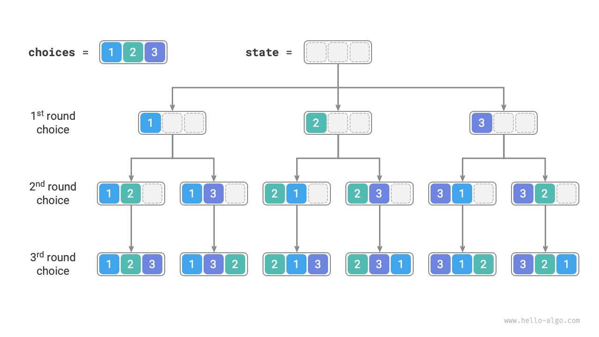
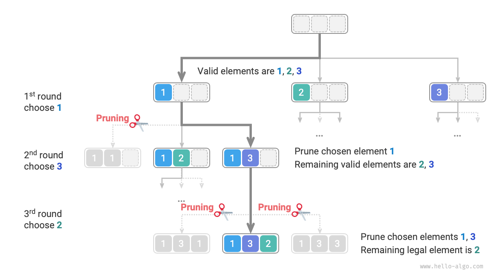
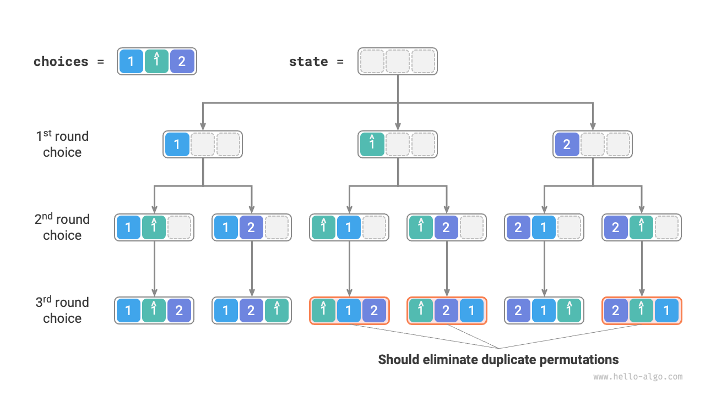
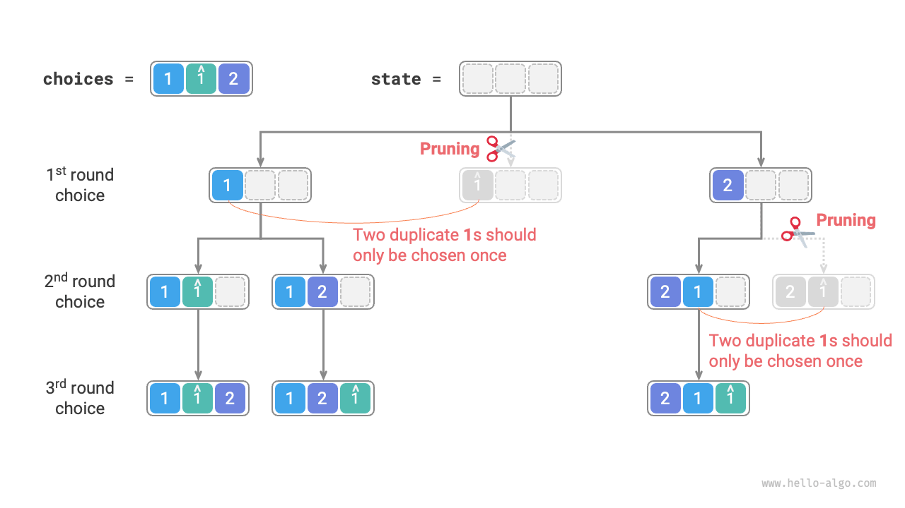
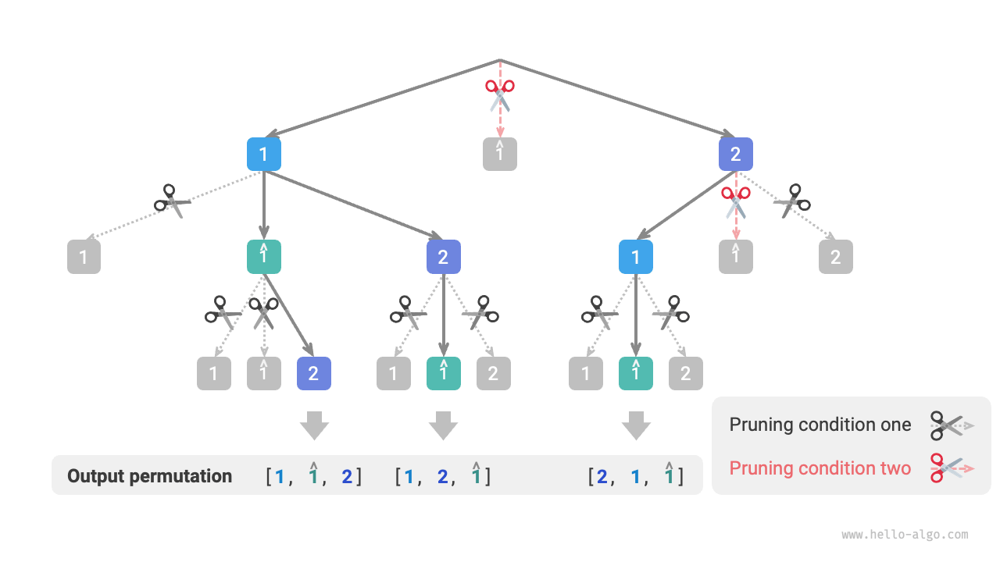

# 13.2 &nbsp; 全順列問題

全順列問題はバックトラッキングアルゴリズムの典型的な応用例です。これは、ある集合（配列や文字列など）が与えられたとき、その要素のあり得るすべての順列を求める問題です。

下表に、入力配列とそれに対応するすべての順列から成る例をいくつか示します。

<p align="center"> 表 13-2 &nbsp; 全順列の例 </p>

<div class="center-table" markdown>

| 入力配列    | すべての順列                                                       |
| :---------- | :----------------------------------------------------------------- |
| $[1]$       | $[1]$                                                              |
| $[1, 2]$    | $[1, 2], [2, 1]$                                                   |
| $[1, 2, 3]$ | $[1, 2, 3], [1, 3, 2], [2, 1, 3], [2, 3, 1], [3, 1, 2], [3, 2, 1]$ |

</div>

## 13.2.1 &nbsp; 等しい要素がない場合

!!! question

    重複要素を含まない整数配列を入力として受け取り、あり得るすべての順列を返します。

バックトラッキングアルゴリズムの観点から見ると、**順列生成の過程は一連の選択の結果として捉えられます**。入力配列が $[1, 2, 3]$ だとすると、最初に $1$ を選び、次に $3$ を選び、最後に $2$ を選べば、順列 $[1, 3, 2]$ が得られます。戻る操作は 1 つの選択を取り消し、その後で別の選択を試し続けることを表します。

バックトラッキングコードの観点では、候補集合 `choices` は入力配列中のすべての要素であり、状態 `state` は現時点までに選ばれた要素です。各要素は 1 回しか選べないことに注意してください。**したがって `state` 内の要素はすべて一意でなければなりません**。

下図のように、探索過程は再帰木として展開できます。木の各ノードは現在の状態 `state` を表します。根ノードから始めて 3 ラウンドの選択を経て葉ノードに到達し、各葉ノードが 1 つの順列に対応します。

{ class="animation-figure" }

<p align="center"> 図 13-5 &nbsp; 全順列の再帰木 </p>

### 1. &nbsp; 重複選択の枝刈り

各要素が 1 回しか選ばれないようにするため、ブール配列 `selected` の導入を考えます。ここで `selected[i]` は `choices[i]` がすでに選ばれているかどうかを表し、これに基づいて次の枝刈りを行います。

- 選択 `choice[i]` を行った後、`selected[i]` を $\text{True}$ に設定し、その要素が選択済みであることを表します。
- 選択肢リスト `choices` を走査するとき、すでに選ばれたノードはすべてスキップします。これが枝刈りです。

下図のように、1 回目に 1、2 回目に 3、3 回目に 2 を選ぶとします。このとき 2 回目では要素 1 の分岐を、3 回目では要素 1 と要素 3 の分岐を刈り取る必要があります。

{ class="animation-figure" }

<p align="center"> 図 13-6 &nbsp; 全順列の枝刈り例 </p>

上図から、この枝刈りにより探索空間の大きさは $O(n^n)$ から $O(n!)$ へ削減されることがわかります。

### 2. &nbsp; コード実装

以上を整理できれば、フレームワークコードの「穴埋め」を行えます。全体のコードを短くするため、フレームワークコード中の各関数を個別には実装せず、これらを `backtrack()` 関数内に展開します。

=== "Python"

    ```python title="permutations_i.py"
    def backtrack(
        state: list[int], choices: list[int], selected: list[bool], res: list[list[int]]
    ):
        """バックトラッキング：順列 I"""
        # 状態の長さが要素数に等しければ、解を記録
        if len(state) == len(choices):
            res.append(list(state))
            return
        # すべての選択肢を走査
        for i, choice in enumerate(choices):
            # 枝刈り：要素の重複選択を許可しない
            if not selected[i]:
                # 試行: 選択を行い、状態を更新
                selected[i] = True
                state.append(choice)
                # 次の選択へ進む
                backtrack(state, choices, selected, res)
                # バックトラック：選択を取り消し、前の状態に戻す
                selected[i] = False
                state.pop()

    def permutations_i(nums: list[int]) -> list[list[int]]:
        """全順列 I"""
        res = []
        backtrack(state=[], choices=nums, selected=[False] * len(nums), res=res)
        return res
    ```

=== "C++"

    ```cpp title="permutations_i.cpp"
    /* バックトラッキング：順列 I */
    void backtrack(vector<int> &state, const vector<int> &choices, vector<bool> &selected, vector<vector<int>> &res) {
        // 状態の長さが要素数に等しければ、解を記録
        if (state.size() == choices.size()) {
            res.push_back(state);
            return;
        }
        // すべての選択肢を走査
        for (int i = 0; i < choices.size(); i++) {
            int choice = choices[i];
            // 枝刈り：要素の重複選択を許可しない
            if (!selected[i]) {
                // 試行: 選択を行い、状態を更新
                selected[i] = true;
                state.push_back(choice);
                // 次の選択へ進む
                backtrack(state, choices, selected, res);
                // バックトラック：選択を取り消し、前の状態に戻す
                selected[i] = false;
                state.pop_back();
            }
        }
    }

    /* 全順列 I */
    vector<vector<int>> permutationsI(vector<int> nums) {
        vector<int> state;
        vector<bool> selected(nums.size(), false);
        vector<vector<int>> res;
        backtrack(state, nums, selected, res);
        return res;
    }
    ```

=== "Java"

    ```java title="permutations_i.java"
    /* バックトラッキング：順列 I */
    void backtrack(List<Integer> state, int[] choices, boolean[] selected, List<List<Integer>> res) {
        // 状態の長さが要素数に等しければ、解を記録
        if (state.size() == choices.length) {
            res.add(new ArrayList<Integer>(state));
            return;
        }
        // すべての選択肢を走査
        for (int i = 0; i < choices.length; i++) {
            int choice = choices[i];
            // 枝刈り：要素の重複選択を許可しない
            if (!selected[i]) {
                // 試行: 選択を行い、状態を更新
                selected[i] = true;
                state.add(choice);
                // 次の選択へ進む
                backtrack(state, choices, selected, res);
                // バックトラック：選択を取り消し、前の状態に戻す
                selected[i] = false;
                state.remove(state.size() - 1);
            }
        }
    }

    /* 全順列 I */
    List<List<Integer>> permutationsI(int[] nums) {
        List<List<Integer>> res = new ArrayList<List<Integer>>();
        backtrack(new ArrayList<Integer>(), nums, new boolean[nums.length], res);
        return res;
    }
    ```

=== "C#"

    ```csharp title="permutations_i.cs"
    /* バックトラッキング：順列 I */
    void Backtrack(List<int> state, int[] choices, bool[] selected, List<List<int>> res) {
        // 状態の長さが要素数に等しければ、解を記録
        if (state.Count == choices.Length) {
            res.Add(new List<int>(state));
            return;
        }
        // すべての選択肢を走査
        for (int i = 0; i < choices.Length; i++) {
            int choice = choices[i];
            // 枝刈り：要素の重複選択を許可しない
            if (!selected[i]) {
                // 試行: 選択を行い、状態を更新
                selected[i] = true;
                state.Add(choice);
                // 次の選択へ進む
                Backtrack(state, choices, selected, res);
                // バックトラック：選択を取り消し、前の状態に戻す
                selected[i] = false;
                state.RemoveAt(state.Count - 1);
            }
        }
    }

    /* 全順列 I */
    List<List<int>> PermutationsI(int[] nums) {
        List<List<int>> res = [];
        Backtrack([], nums, new bool[nums.Length], res);
        return res;
    }
    ```

=== "Go"

    ```go title="permutations_i.go"
    /* バックトラッキング：順列 I */
    func backtrackI(state *[]int, choices *[]int, selected *[]bool, res *[][]int) {
        // 状態の長さが要素数に等しければ、解を記録
        if len(*state) == len(*choices) {
            newState := append([]int{}, *state...)
            *res = append(*res, newState)
        }
        // すべての選択肢を走査
        for i := 0; i < len(*choices); i++ {
            choice := (*choices)[i]
            // 枝刈り：要素の重複選択を許可しない
            if !(*selected)[i] {
                // 試行: 選択を行い、状態を更新
                (*selected)[i] = true
                *state = append(*state, choice)
                // 次の選択へ進む
                backtrackI(state, choices, selected, res)
                // バックトラック：選択を取り消し、前の状態に戻す
                (*selected)[i] = false
                *state = (*state)[:len(*state)-1]
            }
        }
    }

    /* 全順列 I */
    func permutationsI(nums []int) [][]int {
        res := make([][]int, 0)
        state := make([]int, 0)
        selected := make([]bool, len(nums))
        backtrackI(&state, &nums, &selected, &res)
        return res
    }
    ```

=== "Swift"

    ```swift title="permutations_i.swift"
    /* バックトラッキング：順列 I */
    func backtrack(state: inout [Int], choices: [Int], selected: inout [Bool], res: inout [[Int]]) {
        // 状態の長さが要素数に等しければ、解を記録
        if state.count == choices.count {
            res.append(state)
            return
        }
        // すべての選択肢を走査
        for (i, choice) in choices.enumerated() {
            // 枝刈り：要素の重複選択を許可しない
            if !selected[i] {
                // 試行: 選択を行い、状態を更新
                selected[i] = true
                state.append(choice)
                // 次の選択へ進む
                backtrack(state: &state, choices: choices, selected: &selected, res: &res)
                // バックトラック：選択を取り消し、前の状態に戻す
                selected[i] = false
                state.removeLast()
            }
        }
    }

    /* 全順列 I */
    func permutationsI(nums: [Int]) -> [[Int]] {
        var state: [Int] = []
        var selected = Array(repeating: false, count: nums.count)
        var res: [[Int]] = []
        backtrack(state: &state, choices: nums, selected: &selected, res: &res)
        return res
    }
    ```

=== "JS"

    ```javascript title="permutations_i.js"
    /* バックトラッキング：順列 I */
    function backtrack(state, choices, selected, res) {
        // 状態の長さが要素数に等しければ、解を記録
        if (state.length === choices.length) {
            res.push([...state]);
            return;
        }
        // すべての選択肢を走査
        choices.forEach((choice, i) => {
            // 枝刈り：要素の重複選択を許可しない
            if (!selected[i]) {
                // 試行: 選択を行い、状態を更新
                selected[i] = true;
                state.push(choice);
                // 次の選択へ進む
                backtrack(state, choices, selected, res);
                // バックトラック：選択を取り消し、前の状態に戻す
                selected[i] = false;
                state.pop();
            }
        });
    }

    /* 全順列 I */
    function permutationsI(nums) {
        const res = [];
        backtrack([], nums, Array(nums.length).fill(false), res);
        return res;
    }
    ```

=== "TS"

    ```typescript title="permutations_i.ts"
    /* バックトラッキング：順列 I */
    function backtrack(
        state: number[],
        choices: number[],
        selected: boolean[],
        res: number[][]
    ): void {
        // 状態の長さが要素数に等しければ、解を記録
        if (state.length === choices.length) {
            res.push([...state]);
            return;
        }
        // すべての選択肢を走査
        choices.forEach((choice, i) => {
            // 枝刈り：要素の重複選択を許可しない
            if (!selected[i]) {
                // 試行: 選択を行い、状態を更新
                selected[i] = true;
                state.push(choice);
                // 次の選択へ進む
                backtrack(state, choices, selected, res);
                // バックトラック：選択を取り消し、前の状態に戻す
                selected[i] = false;
                state.pop();
            }
        });
    }

    /* 全順列 I */
    function permutationsI(nums: number[]): number[][] {
        const res: number[][] = [];
        backtrack([], nums, Array(nums.length).fill(false), res);
        return res;
    }
    ```

=== "Dart"

    ```dart title="permutations_i.dart"
    /* バックトラッキング：順列 I */
    void backtrack(
      List<int> state,
      List<int> choices,
      List<bool> selected,
      List<List<int>> res,
    ) {
      // 状態の長さが要素数に等しければ、解を記録
      if (state.length == choices.length) {
        res.add(List.from(state));
        return;
      }
      // すべての選択肢を走査
      for (int i = 0; i < choices.length; i++) {
        int choice = choices[i];
        // 枝刈り：要素の重複選択を許可しない
        if (!selected[i]) {
          // 試行: 選択を行い、状態を更新
          selected[i] = true;
          state.add(choice);
          // 次の選択へ進む
          backtrack(state, choices, selected, res);
          // バックトラック：選択を取り消し、前の状態に戻す
          selected[i] = false;
          state.removeLast();
        }
      }
    }

    /* 全順列 I */
    List<List<int>> permutationsI(List<int> nums) {
      List<List<int>> res = [];
      backtrack([], nums, List.filled(nums.length, false), res);
      return res;
    }
    ```

=== "Rust"

    ```rust title="permutations_i.rs"
    /* バックトラッキング：順列 I */
    fn backtrack(mut state: Vec<i32>, choices: &[i32], selected: &mut [bool], res: &mut Vec<Vec<i32>>) {
        // 状態の長さが要素数に等しければ、解を記録
        if state.len() == choices.len() {
            res.push(state);
            return;
        }
        // すべての選択肢を走査
        for i in 0..choices.len() {
            let choice = choices[i];
            // 枝刈り：要素の重複選択を許可しない
            if !selected[i] {
                // 試行: 選択を行い、状態を更新
                selected[i] = true;
                state.push(choice);
                // 次の選択へ進む
                backtrack(state.clone(), choices, selected, res);
                // バックトラック：選択を取り消し、前の状態に戻す
                selected[i] = false;
                state.pop();
            }
        }
    }

    /* 全順列 I */
    fn permutations_i(nums: &mut [i32]) -> Vec<Vec<i32>> {
        let mut res = Vec::new(); // 状態（部分集合）
        backtrack(Vec::new(), nums, &mut vec![false; nums.len()], &mut res);
        res
    }
    ```

=== "C"

    ```c title="permutations_i.c"
    /* バックトラッキング：順列 I */
    void backtrack(int *state, int stateSize, int *choices, int choicesSize, bool *selected, int **res, int *resSize) {
        // 状態の長さが要素数に等しければ、解を記録
        if (stateSize == choicesSize) {
            res[*resSize] = (int *)malloc(choicesSize * sizeof(int));
            for (int i = 0; i < choicesSize; i++) {
                res[*resSize][i] = state[i];
            }
            (*resSize)++;
            return;
        }
        // すべての選択肢を走査
        for (int i = 0; i < choicesSize; i++) {
            int choice = choices[i];
            // 枝刈り：要素の重複選択を許可しない
            if (!selected[i]) {
                // 試行: 選択を行い、状態を更新
                selected[i] = true;
                state[stateSize] = choice;
                // 次の選択へ進む
                backtrack(state, stateSize + 1, choices, choicesSize, selected, res, resSize);
                // バックトラック：選択を取り消し、前の状態に戻す
                selected[i] = false;
            }
        }
    }

    /* 全順列 I */
    int **permutationsI(int *nums, int numsSize, int *returnSize) {
        int *state = (int *)malloc(numsSize * sizeof(int));
        bool *selected = (bool *)malloc(numsSize * sizeof(bool));
        for (int i = 0; i < numsSize; i++) {
            selected[i] = false;
        }
        int **res = (int **)malloc(MAX_SIZE * sizeof(int *));
        *returnSize = 0;

        backtrack(state, 0, nums, numsSize, selected, res, returnSize);

        free(state);
        free(selected);

        return res;
    }
    ```

=== "Kotlin"

    ```kotlin title="permutations_i.kt"
    /* バックトラッキング：順列 I */
    fun backtrack(
        state: MutableList<Int>,
        choices: IntArray,
        selected: BooleanArray,
        res: MutableList<MutableList<Int>?>
    ) {
        // 状態の長さが要素数に等しければ、解を記録
        if (state.size == choices.size) {
            res.add(state.toMutableList())
            return
        }
        // すべての選択肢を走査
        for (i in choices.indices) {
            val choice = choices[i]
            // 枝刈り：要素の重複選択を許可しない
            if (!selected[i]) {
                // 試行: 選択を行い、状態を更新
                selected[i] = true
                state.add(choice)
                // 次の選択へ進む
                backtrack(state, choices, selected, res)
                // バックトラック：選択を取り消し、前の状態に戻す
                selected[i] = false
                state.removeAt(state.size - 1)
            }
        }
    }

    /* 全順列 I */
    fun permutationsI(nums: IntArray): MutableList<MutableList<Int>?> {
        val res = mutableListOf<MutableList<Int>?>()
        backtrack(mutableListOf(), nums, BooleanArray(nums.size), res)
        return res
    }
    ```

=== "Ruby"

    ```ruby title="permutations_i.rb"
    ### バックトラッキング法：全順列 I ###
    def backtrack(state, choices, selected, res)
      # 状態の長さが要素数に等しければ、解を記録
      if state.length == choices.length
        res << state.dup
        return
      end

      # すべての選択肢を走査
      choices.each_with_index do |choice, i|
        # 枝刈り：要素の重複選択を許可しない
        unless selected[i]
          # 試行: 選択を行い、状態を更新
          selected[i] = true
          state << choice
          # 次の選択へ進む
          backtrack(state, choices, selected, res)
          # バックトラック：選択を取り消し、前の状態に戻す
          selected[i] = false
          state.pop
        end
      end
    end

    ### 全順列 I ###
    def permutations_i(nums)
      res = []
      backtrack([], nums, Array.new(nums.length, false), res)
      res
    end
    ```

??? pythontutor "コードの可視化"

    <div style="height: 549px; width: 100%;"><iframe class="pythontutor-iframe" src="https://pythontutor.com/iframe-embed.html#code=def%20backtrack%28%0A%20%20%20%20state%3A%20list%5Bint%5D%2C%20choices%3A%20list%5Bint%5D%2C%20selected%3A%20list%5Bbool%5D%2C%20res%3A%20list%5Blist%5Bint%5D%5D%0A%29%3A%0A%20%20%20%20%22%22%22%E3%83%90%E3%83%83%E3%82%AF%E3%83%88%E3%83%A9%E3%83%83%E3%82%AD%E3%83%B3%E3%82%B0%EF%BC%9A%E9%A0%86%E5%88%97%20I%22%22%22%0A%20%20%20%20%23%20%E7%8A%B6%E6%85%8B%E3%81%AE%E9%95%B7%E3%81%95%E3%81%8C%E8%A6%81%E7%B4%A0%E6%95%B0%E3%81%AB%E7%AD%89%E3%81%97%E3%81%91%E3%82%8C%E3%81%B0%E3%80%81%E8%A7%A3%E3%82%92%E8%A8%98%E9%8C%B2%0A%20%20%20%20if%20len%28state%29%20%3D%3D%20len%28choices%29%3A%0A%20%20%20%20%20%20%20%20res.append%28list%28state%29%29%0A%20%20%20%20%20%20%20%20return%0A%20%20%20%20%23%20%E3%81%99%E3%81%B9%E3%81%A6%E3%81%AE%E9%81%B8%E6%8A%9E%E8%82%A2%E3%82%92%E8%B5%B0%E6%9F%BB%0A%20%20%20%20for%20i%2C%20choice%20in%20enumerate%28choices%29%3A%0A%20%20%20%20%20%20%20%20%23%20%E6%9E%9D%E5%88%88%E3%82%8A%EF%BC%9A%E8%A6%81%E7%B4%A0%E3%81%AE%E9%87%8D%E8%A4%87%E9%81%B8%E6%8A%9E%E3%82%92%E8%A8%B1%E5%8F%AF%E3%81%97%E3%81%AA%E3%81%84%0A%20%20%20%20%20%20%20%20if%20not%20selected%5Bi%5D%3A%0A%20%20%20%20%20%20%20%20%20%20%20%20%23%20%E8%A9%A6%E8%A1%8C%3A%20%E9%81%B8%E6%8A%9E%E3%82%92%E8%A1%8C%E3%81%84%E3%80%81%E7%8A%B6%E6%85%8B%E3%82%92%E6%9B%B4%E6%96%B0%0A%20%20%20%20%20%20%20%20%20%20%20%20selected%5Bi%5D%20%3D%20True%0A%20%20%20%20%20%20%20%20%20%20%20%20state.append%28choice%29%0A%20%20%20%20%20%20%20%20%20%20%20%20%23%20%E6%AC%A1%E3%81%AE%E9%81%B8%E6%8A%9E%E3%81%B8%E9%80%B2%E3%82%80%0A%20%20%20%20%20%20%20%20%20%20%20%20backtrack%28state%2C%20choices%2C%20selected%2C%20res%29%0A%20%20%20%20%20%20%20%20%20%20%20%20%23%20%E3%83%90%E3%83%83%E3%82%AF%E3%83%88%E3%83%A9%E3%83%83%E3%82%AF%EF%BC%9A%E9%81%B8%E6%8A%9E%E3%82%92%E5%8F%96%E3%82%8A%E6%B6%88%E3%81%97%E3%80%81%E5%89%8D%E3%81%AE%E7%8A%B6%E6%85%8B%E3%81%AB%E6%88%BB%E3%81%99%0A%20%20%20%20%20%20%20%20%20%20%20%20selected%5Bi%5D%20%3D%20False%0A%20%20%20%20%20%20%20%20%20%20%20%20state.pop%28%29%0A%0A%0Adef%20permutations_i%28nums%3A%20list%5Bint%5D%29%20-%3E%20list%5Blist%5Bint%5D%5D%3A%0A%20%20%20%20%22%22%22%E5%85%A8%E9%A0%86%E5%88%97%20I%22%22%22%0A%20%20%20%20res%20%3D%20%5B%5D%0A%20%20%20%20backtrack%28state%3D%5B%5D%2C%20choices%3Dnums%2C%20selected%3D%5BFalse%5D%20%2A%20len%28nums%29%2C%20res%3Dres%29%0A%20%20%20%20return%20res%0A%0A%0Aif%20__name__%20%3D%3D%20%22__main__%22%3A%0A%20%20%20%20nums%20%3D%20%5B1%2C%202%2C%203%5D%0A%0A%20%20%20%20res%20%3D%20permutations_i%28nums%29%0A%0A%20%20%20%20print%28f%22%E5%85%A5%E5%8A%9B%E9%85%8D%E5%88%97%20nums%20%3D%20%7Bnums%7D%22%29%0A%20%20%20%20print%28f%22%E3%81%99%E3%81%B9%E3%81%A6%E3%81%AE%E9%A0%86%E5%88%97%20res%20%3D%20%7Bres%7D%22%29&codeDivHeight=472&codeDivWidth=350&cumulative=false&curInstr=13&heapPrimitives=nevernest&origin=opt-frontend.js&py=311&rawInputLstJSON=%5B%5D&textReferences=false"> </iframe></div>
    <div style="margin-top: 5px;"><a href="https://pythontutor.com/iframe-embed.html#code=def%20backtrack%28%0A%20%20%20%20state%3A%20list%5Bint%5D%2C%20choices%3A%20list%5Bint%5D%2C%20selected%3A%20list%5Bbool%5D%2C%20res%3A%20list%5Blist%5Bint%5D%5D%0A%29%3A%0A%20%20%20%20%22%22%22%E3%83%90%E3%83%83%E3%82%AF%E3%83%88%E3%83%A9%E3%83%83%E3%82%AD%E3%83%B3%E3%82%B0%EF%BC%9A%E9%A0%86%E5%88%97%20I%22%22%22%0A%20%20%20%20%23%20%E7%8A%B6%E6%85%8B%E3%81%AE%E9%95%B7%E3%81%95%E3%81%8C%E8%A6%81%E7%B4%A0%E6%95%B0%E3%81%AB%E7%AD%89%E3%81%97%E3%81%91%E3%82%8C%E3%81%B0%E3%80%81%E8%A7%A3%E3%82%92%E8%A8%98%E9%8C%B2%0A%20%20%20%20if%20len%28state%29%20%3D%3D%20len%28choices%29%3A%0A%20%20%20%20%20%20%20%20res.append%28list%28state%29%29%0A%20%20%20%20%20%20%20%20return%0A%20%20%20%20%23%20%E3%81%99%E3%81%B9%E3%81%A6%E3%81%AE%E9%81%B8%E6%8A%9E%E8%82%A2%E3%82%92%E8%B5%B0%E6%9F%BB%0A%20%20%20%20for%20i%2C%20choice%20in%20enumerate%28choices%29%3A%0A%20%20%20%20%20%20%20%20%23%20%E6%9E%9D%E5%88%88%E3%82%8A%EF%BC%9A%E8%A6%81%E7%B4%A0%E3%81%AE%E9%87%8D%E8%A4%87%E9%81%B8%E6%8A%9E%E3%82%92%E8%A8%B1%E5%8F%AF%E3%81%97%E3%81%AA%E3%81%84%0A%20%20%20%20%20%20%20%20if%20not%20selected%5Bi%5D%3A%0A%20%20%20%20%20%20%20%20%20%20%20%20%23%20%E8%A9%A6%E8%A1%8C%3A%20%E9%81%B8%E6%8A%9E%E3%82%92%E8%A1%8C%E3%81%84%E3%80%81%E7%8A%B6%E6%85%8B%E3%82%92%E6%9B%B4%E6%96%B0%0A%20%20%20%20%20%20%20%20%20%20%20%20selected%5Bi%5D%20%3D%20True%0A%20%20%20%20%20%20%20%20%20%20%20%20state.append%28choice%29%0A%20%20%20%20%20%20%20%20%20%20%20%20%23%20%E6%AC%A1%E3%81%AE%E9%81%B8%E6%8A%9E%E3%81%B8%E9%80%B2%E3%82%80%0A%20%20%20%20%20%20%20%20%20%20%20%20backtrack%28state%2C%20choices%2C%20selected%2C%20res%29%0A%20%20%20%20%20%20%20%20%20%20%20%20%23%20%E3%83%90%E3%83%83%E3%82%AF%E3%83%88%E3%83%A9%E3%83%83%E3%82%AF%EF%BC%9A%E9%81%B8%E6%8A%9E%E3%82%92%E5%8F%96%E3%82%8A%E6%B6%88%E3%81%97%E3%80%81%E5%89%8D%E3%81%AE%E7%8A%B6%E6%85%8B%E3%81%AB%E6%88%BB%E3%81%99%0A%20%20%20%20%20%20%20%20%20%20%20%20selected%5Bi%5D%20%3D%20False%0A%20%20%20%20%20%20%20%20%20%20%20%20state.pop%28%29%0A%0A%0Adef%20permutations_i%28nums%3A%20list%5Bint%5D%29%20-%3E%20list%5Blist%5Bint%5D%5D%3A%0A%20%20%20%20%22%22%22%E5%85%A8%E9%A0%86%E5%88%97%20I%22%22%22%0A%20%20%20%20res%20%3D%20%5B%5D%0A%20%20%20%20backtrack%28state%3D%5B%5D%2C%20choices%3Dnums%2C%20selected%3D%5BFalse%5D%20%2A%20len%28nums%29%2C%20res%3Dres%29%0A%20%20%20%20return%20res%0A%0A%0Aif%20__name__%20%3D%3D%20%22__main__%22%3A%0A%20%20%20%20nums%20%3D%20%5B1%2C%202%2C%203%5D%0A%0A%20%20%20%20res%20%3D%20permutations_i%28nums%29%0A%0A%20%20%20%20print%28f%22%E5%85%A5%E5%8A%9B%E9%85%8D%E5%88%97%20nums%20%3D%20%7Bnums%7D%22%29%0A%20%20%20%20print%28f%22%E3%81%99%E3%81%B9%E3%81%A6%E3%81%AE%E9%A0%86%E5%88%97%20res%20%3D%20%7Bres%7D%22%29&codeDivHeight=800&codeDivWidth=600&cumulative=false&curInstr=13&heapPrimitives=nevernest&origin=opt-frontend.js&py=311&rawInputLstJSON=%5B%5D&textReferences=false" target="_blank" rel="noopener noreferrer">全画面で見る ></a></div>

## 13.2.2 &nbsp; 等しい要素を考慮する場合

!!! question

    整数配列を入力として受け取り、**配列には重複要素が含まれる場合があります**。重複しない順列をすべて返します。

入力配列が $[1, 1, 2]$ だと仮定します。2 つの重複する要素 $1$ を区別しやすくするため、2 つ目の $1$ を $\hat{1}$ と記します。

下図のように、上述の方法で生成される順列の半分は重複しています。

{ class="animation-figure" }

<p align="center"> 図 13-7 &nbsp; 重複した順列 </p>

では、重複した順列をどのように取り除けばよいのでしょうか。最も直接的なのは、ハッシュ集合を用いて順列結果をそのまま重複排除する方法です。しかしこのやり方は十分に洗練されていません。**なぜなら、重複順列を生成する探索分岐はそもそも不要であり、事前に見つけて枝刈りすべきだからです**。そうすることで、アルゴリズム効率をさらに高められます。

### 1. &nbsp; 等しい要素の枝刈り

下図を見ると、1 回目のラウンドでは $1$ を選ぶことと $\hat{1}$ を選ぶことは等価であり、これら 2 つの選択の下で生成される順列はすべて重複します。したがって $\hat{1}$ を枝刈りすべきです。

同様に、1 回目で $2$ を選んだ後では、2 回目のラウンドにおける $1$ と $\hat{1}$ も重複分岐を生むため、2 回目の $\hat{1}$ も枝刈りすべきです。

本質的には、**各ラウンドの選択において、等しい複数の要素が 1 回しか選ばれないようにすることが目標です**。

{ class="animation-figure" }

<p align="center"> 図 13-8 &nbsp; 重複順列の枝刈り </p>

### 2. &nbsp; コード実装

前問のコードを土台として、各ラウンドの選択でハッシュ集合 `duplicated` を 1 つ用意し、そのラウンドですでに試した要素を記録して、重複要素を枝刈りすることを考えます。

=== "Python"

    ```python title="permutations_ii.py"
    def backtrack(
        state: list[int], choices: list[int], selected: list[bool], res: list[list[int]]
    ):
        """バックトラッキング：順列 II"""
        # 状態の長さが要素数に等しければ、解を記録
        if len(state) == len(choices):
            res.append(list(state))
            return
        # すべての選択肢を走査
        duplicated = set[int]()
        for i, choice in enumerate(choices):
            # 枝刈り：要素の重複選択を許可せず、同値要素の重複選択も許可しない
            if not selected[i] and choice not in duplicated:
                # 試行: 選択を行い、状態を更新
                duplicated.add(choice)  # 選択済みの要素値を記録
                selected[i] = True
                state.append(choice)
                # 次の選択へ進む
                backtrack(state, choices, selected, res)
                # バックトラック：選択を取り消し、前の状態に戻す
                selected[i] = False
                state.pop()

    def permutations_ii(nums: list[int]) -> list[list[int]]:
        """全順列 II"""
        res = []
        backtrack(state=[], choices=nums, selected=[False] * len(nums), res=res)
        return res
    ```

=== "C++"

    ```cpp title="permutations_ii.cpp"
    /* バックトラッキング：順列 II */
    void backtrack(vector<int> &state, const vector<int> &choices, vector<bool> &selected, vector<vector<int>> &res) {
        // 状態の長さが要素数に等しければ、解を記録
        if (state.size() == choices.size()) {
            res.push_back(state);
            return;
        }
        // すべての選択肢を走査
        unordered_set<int> duplicated;
        for (int i = 0; i < choices.size(); i++) {
            int choice = choices[i];
            // 枝刈り：要素の重複選択を許可せず、同値要素の重複選択も許可しない
            if (!selected[i] && duplicated.find(choice) == duplicated.end()) {
                // 試行: 選択を行い、状態を更新
                duplicated.emplace(choice); // 選択済みの要素値を記録
                selected[i] = true;
                state.push_back(choice);
                // 次の選択へ進む
                backtrack(state, choices, selected, res);
                // バックトラック：選択を取り消し、前の状態に戻す
                selected[i] = false;
                state.pop_back();
            }
        }
    }

    /* 全順列 II */
    vector<vector<int>> permutationsII(vector<int> nums) {
        vector<int> state;
        vector<bool> selected(nums.size(), false);
        vector<vector<int>> res;
        backtrack(state, nums, selected, res);
        return res;
    }
    ```

=== "Java"

    ```java title="permutations_ii.java"
    /* バックトラッキング：順列 II */
    void backtrack(List<Integer> state, int[] choices, boolean[] selected, List<List<Integer>> res) {
        // 状態の長さが要素数に等しければ、解を記録
        if (state.size() == choices.length) {
            res.add(new ArrayList<Integer>(state));
            return;
        }
        // すべての選択肢を走査
        Set<Integer> duplicated = new HashSet<Integer>();
        for (int i = 0; i < choices.length; i++) {
            int choice = choices[i];
            // 枝刈り：要素の重複選択を許可せず、同値要素の重複選択も許可しない
            if (!selected[i] && !duplicated.contains(choice)) {
                // 試行: 選択を行い、状態を更新
                duplicated.add(choice); // 選択済みの要素値を記録
                selected[i] = true;
                state.add(choice);
                // 次の選択へ進む
                backtrack(state, choices, selected, res);
                // バックトラック：選択を取り消し、前の状態に戻す
                selected[i] = false;
                state.remove(state.size() - 1);
            }
        }
    }

    /* 全順列 II */
    List<List<Integer>> permutationsII(int[] nums) {
        List<List<Integer>> res = new ArrayList<List<Integer>>();
        backtrack(new ArrayList<Integer>(), nums, new boolean[nums.length], res);
        return res;
    }
    ```

=== "C#"

    ```csharp title="permutations_ii.cs"
    /* バックトラッキング：順列 II */
    void Backtrack(List<int> state, int[] choices, bool[] selected, List<List<int>> res) {
        // 状態の長さが要素数に等しければ、解を記録
        if (state.Count == choices.Length) {
            res.Add(new List<int>(state));
            return;
        }
        // すべての選択肢を走査
        HashSet<int> duplicated = [];
        for (int i = 0; i < choices.Length; i++) {
            int choice = choices[i];
            // 枝刈り：要素の重複選択を許可せず、同値要素の重複選択も許可しない
            if (!selected[i] && !duplicated.Contains(choice)) {
                // 試行: 選択を行い、状態を更新
                duplicated.Add(choice); // 選択済みの要素値を記録
                selected[i] = true;
                state.Add(choice);
                // 次の選択へ進む
                Backtrack(state, choices, selected, res);
                // バックトラック：選択を取り消し、前の状態に戻す
                selected[i] = false;
                state.RemoveAt(state.Count - 1);
            }
        }
    }

    /* 全順列 II */
    List<List<int>> PermutationsII(int[] nums) {
        List<List<int>> res = [];
        Backtrack([], nums, new bool[nums.Length], res);
        return res;
    }
    ```

=== "Go"

    ```go title="permutations_ii.go"
    /* バックトラッキング：順列 II */
    func backtrackII(state *[]int, choices *[]int, selected *[]bool, res *[][]int) {
        // 状態の長さが要素数に等しければ、解を記録
        if len(*state) == len(*choices) {
            newState := append([]int{}, *state...)
            *res = append(*res, newState)
        }
        // すべての選択肢を走査
        duplicated := make(map[int]struct{}, 0)
        for i := 0; i < len(*choices); i++ {
            choice := (*choices)[i]
            // 枝刈り：要素の重複選択を許可せず、同値要素の重複選択も許可しない
            if _, ok := duplicated[choice]; !ok && !(*selected)[i] {
                // 試す: 選択を行って状態を更新
                // 選択済みの要素値を記録
                duplicated[choice] = struct{}{}
                (*selected)[i] = true
                *state = append(*state, choice)
                // 次の選択へ進む
                backtrackII(state, choices, selected, res)
                // バックトラック：選択を取り消し、前の状態に戻す
                (*selected)[i] = false
                *state = (*state)[:len(*state)-1]
            }
        }
    }

    /* 全順列 II */
    func permutationsII(nums []int) [][]int {
        res := make([][]int, 0)
        state := make([]int, 0)
        selected := make([]bool, len(nums))
        backtrackII(&state, &nums, &selected, &res)
        return res
    }
    ```

=== "Swift"

    ```swift title="permutations_ii.swift"
    /* バックトラッキング：順列 II */
    func backtrack(state: inout [Int], choices: [Int], selected: inout [Bool], res: inout [[Int]]) {
        // 状態の長さが要素数に等しければ、解を記録
        if state.count == choices.count {
            res.append(state)
            return
        }
        // すべての選択肢を走査
        var duplicated: Set<Int> = []
        for (i, choice) in choices.enumerated() {
            // 枝刈り：要素の重複選択を許可せず、同値要素の重複選択も許可しない
            if !selected[i], !duplicated.contains(choice) {
                // 試行: 選択を行い、状態を更新
                duplicated.insert(choice) // 選択済みの要素値を記録
                selected[i] = true
                state.append(choice)
                // 次の選択へ進む
                backtrack(state: &state, choices: choices, selected: &selected, res: &res)
                // バックトラック：選択を取り消し、前の状態に戻す
                selected[i] = false
                state.removeLast()
            }
        }
    }

    /* 全順列 II */
    func permutationsII(nums: [Int]) -> [[Int]] {
        var state: [Int] = []
        var selected = Array(repeating: false, count: nums.count)
        var res: [[Int]] = []
        backtrack(state: &state, choices: nums, selected: &selected, res: &res)
        return res
    }
    ```

=== "JS"

    ```javascript title="permutations_ii.js"
    /* バックトラッキング：順列 II */
    function backtrack(state, choices, selected, res) {
        // 状態の長さが要素数に等しければ、解を記録
        if (state.length === choices.length) {
            res.push([...state]);
            return;
        }
        // すべての選択肢を走査
        const duplicated = new Set();
        choices.forEach((choice, i) => {
            // 枝刈り：要素の重複選択を許可せず、同値要素の重複選択も許可しない
            if (!selected[i] && !duplicated.has(choice)) {
                // 試行: 選択を行い、状態を更新
                duplicated.add(choice); // 選択済みの要素値を記録
                selected[i] = true;
                state.push(choice);
                // 次の選択へ進む
                backtrack(state, choices, selected, res);
                // バックトラック：選択を取り消し、前の状態に戻す
                selected[i] = false;
                state.pop();
            }
        });
    }

    /* 全順列 II */
    function permutationsII(nums) {
        const res = [];
        backtrack([], nums, Array(nums.length).fill(false), res);
        return res;
    }
    ```

=== "TS"

    ```typescript title="permutations_ii.ts"
    /* バックトラッキング：順列 II */
    function backtrack(
        state: number[],
        choices: number[],
        selected: boolean[],
        res: number[][]
    ): void {
        // 状態の長さが要素数に等しければ、解を記録
        if (state.length === choices.length) {
            res.push([...state]);
            return;
        }
        // すべての選択肢を走査
        const duplicated = new Set();
        choices.forEach((choice, i) => {
            // 枝刈り：要素の重複選択を許可せず、同値要素の重複選択も許可しない
            if (!selected[i] && !duplicated.has(choice)) {
                // 試行: 選択を行い、状態を更新
                duplicated.add(choice); // 選択済みの要素値を記録
                selected[i] = true;
                state.push(choice);
                // 次の選択へ進む
                backtrack(state, choices, selected, res);
                // バックトラック：選択を取り消し、前の状態に戻す
                selected[i] = false;
                state.pop();
            }
        });
    }

    /* 全順列 II */
    function permutationsII(nums: number[]): number[][] {
        const res: number[][] = [];
        backtrack([], nums, Array(nums.length).fill(false), res);
        return res;
    }
    ```

=== "Dart"

    ```dart title="permutations_ii.dart"
    /* バックトラッキング：順列 II */
    void backtrack(
      List<int> state,
      List<int> choices,
      List<bool> selected,
      List<List<int>> res,
    ) {
      // 状態の長さが要素数に等しければ、解を記録
      if (state.length == choices.length) {
        res.add(List.from(state));
        return;
      }
      // すべての選択肢を走査
      Set<int> duplicated = {};
      for (int i = 0; i < choices.length; i++) {
        int choice = choices[i];
        // 枝刈り：要素の重複選択を許可せず、同値要素の重複選択も許可しない
        if (!selected[i] && !duplicated.contains(choice)) {
          // 試行: 選択を行い、状態を更新
          duplicated.add(choice); // 選択済みの要素値を記録
          selected[i] = true;
          state.add(choice);
          // 次の選択へ進む
          backtrack(state, choices, selected, res);
          // バックトラック：選択を取り消し、前の状態に戻す
          selected[i] = false;
          state.removeLast();
        }
      }
    }

    /* 全順列 II */
    List<List<int>> permutationsII(List<int> nums) {
      List<List<int>> res = [];
      backtrack([], nums, List.filled(nums.length, false), res);
      return res;
    }
    ```

=== "Rust"

    ```rust title="permutations_ii.rs"
    /* バックトラッキング：順列 II */
    fn backtrack(mut state: Vec<i32>, choices: &[i32], selected: &mut [bool], res: &mut Vec<Vec<i32>>) {
        // 状態の長さが要素数に等しければ、解を記録
        if state.len() == choices.len() {
            res.push(state);
            return;
        }
        // すべての選択肢を走査
        let mut duplicated = HashSet::<i32>::new();
        for i in 0..choices.len() {
            let choice = choices[i];
            // 枝刈り：要素の重複選択を許可せず、同値要素の重複選択も許可しない
            if !selected[i] && !duplicated.contains(&choice) {
                // 試行: 選択を行い、状態を更新
                duplicated.insert(choice); // 選択済みの要素値を記録
                selected[i] = true;
                state.push(choice);
                // 次の選択へ進む
                backtrack(state.clone(), choices, selected, res);
                // バックトラック：選択を取り消し、前の状態に戻す
                selected[i] = false;
                state.pop();
            }
        }
    }

    /* 全順列 II */
    fn permutations_ii(nums: &mut [i32]) -> Vec<Vec<i32>> {
        let mut res = Vec::new();
        backtrack(Vec::new(), nums, &mut vec![false; nums.len()], &mut res);
        res
    }
    ```

=== "C"

    ```c title="permutations_ii.c"
    /* バックトラッキング：順列 II */
    void backtrack(int *state, int stateSize, int *choices, int choicesSize, bool *selected, int **res, int *resSize) {
        // 状態の長さが要素数に等しければ、解を記録
        if (stateSize == choicesSize) {
            res[*resSize] = (int *)malloc(choicesSize * sizeof(int));
            for (int i = 0; i < choicesSize; i++) {
                res[*resSize][i] = state[i];
            }
            (*resSize)++;
            return;
        }
        // すべての選択肢を走査
        bool duplicated[MAX_SIZE] = {false};
        for (int i = 0; i < choicesSize; i++) {
            int choice = choices[i];
            // 枝刈り：要素の重複選択を許可せず、同値要素の重複選択も許可しない
            if (!selected[i] && !duplicated[choice]) {
                // 試行: 選択を行い、状態を更新
                duplicated[choice] = true; // 選択済みの要素値を記録
                selected[i] = true;
                state[stateSize] = choice;
                // 次の選択へ進む
                backtrack(state, stateSize + 1, choices, choicesSize, selected, res, resSize);
                // バックトラック：選択を取り消し、前の状態に戻す
                selected[i] = false;
            }
        }
    }

    /* 全順列 II */
    int **permutationsII(int *nums, int numsSize, int *returnSize) {
        int *state = (int *)malloc(numsSize * sizeof(int));
        bool *selected = (bool *)malloc(numsSize * sizeof(bool));
        for (int i = 0; i < numsSize; i++) {
            selected[i] = false;
        }
        int **res = (int **)malloc(MAX_SIZE * sizeof(int *));
        *returnSize = 0;

        backtrack(state, 0, nums, numsSize, selected, res, returnSize);

        free(state);
        free(selected);

        return res;
    }
    ```

=== "Kotlin"

    ```kotlin title="permutations_ii.kt"
    /* バックトラッキング：順列 II */
    fun backtrack(
        state: MutableList<Int>,
        choices: IntArray,
        selected: BooleanArray,
        res: MutableList<MutableList<Int>?>
    ) {
        // 状態の長さが要素数に等しければ、解を記録
        if (state.size == choices.size) {
            res.add(state.toMutableList())
            return
        }
        // すべての選択肢を走査
        val duplicated = HashSet<Int>()
        for (i in choices.indices) {
            val choice = choices[i]
            // 枝刈り：要素の重複選択を許可せず、同値要素の重複選択も許可しない
            if (!selected[i] && !duplicated.contains(choice)) {
                // 試行: 選択を行い、状態を更新
                duplicated.add(choice) // 選択済みの要素値を記録
                selected[i] = true
                state.add(choice)
                // 次の選択へ進む
                backtrack(state, choices, selected, res)
                // バックトラック：選択を取り消し、前の状態に戻す
                selected[i] = false
                state.removeAt(state.size - 1)
            }
        }
    }

    /* 全順列 II */
    fun permutationsII(nums: IntArray): MutableList<MutableList<Int>?> {
        val res = mutableListOf<MutableList<Int>?>()
        backtrack(mutableListOf(), nums, BooleanArray(nums.size), res)
        return res
    }
    ```

=== "Ruby"

    ```ruby title="permutations_ii.rb"
    ### バックトラッキング法：全順列 II ###
    def backtrack(state, choices, selected, res)
      # 状態の長さが要素数に等しければ、解を記録
      if state.length == choices.length
        res << state.dup
        return
      end

      # すべての選択肢を走査
      duplicated = Set.new
      choices.each_with_index do |choice, i|
        # 枝刈り：要素の重複選択を許可せず、同値要素の重複選択も許可しない
        if !selected[i] && !duplicated.include?(choice)
          # 試行: 選択を行い、状態を更新
          duplicated.add(choice)
          selected[i] = true
          state << choice
          # 次の選択へ進む
          backtrack(state, choices, selected, res)
          # バックトラック：選択を取り消し、前の状態に戻す
          selected[i] = false
          state.pop
        end
      end
    end

    ### 全順列 II ###
    def permutations_ii(nums)
      res = []
      backtrack([], nums, Array.new(nums.length, false), res)
      res
    end
    ```

??? pythontutor "コードの可視化"

    <div style="height: 549px; width: 100%;"><iframe class="pythontutor-iframe" src="https://pythontutor.com/iframe-embed.html#code=def%20backtrack%28%0A%20%20%20%20state%3A%20list%5Bint%5D%2C%20choices%3A%20list%5Bint%5D%2C%20selected%3A%20list%5Bbool%5D%2C%20res%3A%20list%5Blist%5Bint%5D%5D%0A%29%3A%0A%20%20%20%20%22%22%22%E3%83%90%E3%83%83%E3%82%AF%E3%83%88%E3%83%A9%E3%83%83%E3%82%AD%E3%83%B3%E3%82%B0%EF%BC%9A%E9%A0%86%E5%88%97%20II%22%22%22%0A%20%20%20%20%23%20%E7%8A%B6%E6%85%8B%E3%81%AE%E9%95%B7%E3%81%95%E3%81%8C%E8%A6%81%E7%B4%A0%E6%95%B0%E3%81%AB%E7%AD%89%E3%81%97%E3%81%91%E3%82%8C%E3%81%B0%E3%80%81%E8%A7%A3%E3%82%92%E8%A8%98%E9%8C%B2%0A%20%20%20%20if%20len%28state%29%20%3D%3D%20len%28choices%29%3A%0A%20%20%20%20%20%20%20%20res.append%28list%28state%29%29%0A%20%20%20%20%20%20%20%20return%0A%20%20%20%20%23%20%E3%81%99%E3%81%B9%E3%81%A6%E3%81%AE%E9%81%B8%E6%8A%9E%E8%82%A2%E3%82%92%E8%B5%B0%E6%9F%BB%0A%20%20%20%20duplicated%20%3D%20set%5Bint%5D%28%29%0A%20%20%20%20for%20i%2C%20choice%20in%20enumerate%28choices%29%3A%0A%20%20%20%20%20%20%20%20%23%20%E6%9E%9D%E5%88%88%E3%82%8A%EF%BC%9A%E8%A6%81%E7%B4%A0%E3%81%AE%E9%87%8D%E8%A4%87%E9%81%B8%E6%8A%9E%E3%82%92%E8%A8%B1%E5%8F%AF%E3%81%9B%E3%81%9A%E3%80%81%E5%90%8C%E5%80%A4%E8%A6%81%E7%B4%A0%E3%81%AE%E9%87%8D%E8%A4%87%E9%81%B8%E6%8A%9E%E3%82%82%E8%A8%B1%E5%8F%AF%E3%81%97%E3%81%AA%E3%81%84%0A%20%20%20%20%20%20%20%20if%20not%20selected%5Bi%5D%20and%20choice%20not%20in%20duplicated%3A%0A%20%20%20%20%20%20%20%20%20%20%20%20%23%20%E8%A9%A6%E8%A1%8C%3A%20%E9%81%B8%E6%8A%9E%E3%82%92%E8%A1%8C%E3%81%84%E3%80%81%E7%8A%B6%E6%85%8B%E3%82%92%E6%9B%B4%E6%96%B0%0A%20%20%20%20%20%20%20%20%20%20%20%20duplicated.add%28choice%29%20%20%23%20%E9%81%B8%E6%8A%9E%E6%B8%88%E3%81%BF%E3%81%AE%E8%A6%81%E7%B4%A0%E5%80%A4%E3%82%92%E8%A8%98%E9%8C%B2%0A%20%20%20%20%20%20%20%20%20%20%20%20selected%5Bi%5D%20%3D%20True%0A%20%20%20%20%20%20%20%20%20%20%20%20state.append%28choice%29%0A%20%20%20%20%20%20%20%20%20%20%20%20%23%20%E6%AC%A1%E3%81%AE%E9%81%B8%E6%8A%9E%E3%81%B8%E9%80%B2%E3%82%80%0A%20%20%20%20%20%20%20%20%20%20%20%20backtrack%28state%2C%20choices%2C%20selected%2C%20res%29%0A%20%20%20%20%20%20%20%20%20%20%20%20%23%20%E3%83%90%E3%83%83%E3%82%AF%E3%83%88%E3%83%A9%E3%83%83%E3%82%AF%EF%BC%9A%E9%81%B8%E6%8A%9E%E3%82%92%E5%8F%96%E3%82%8A%E6%B6%88%E3%81%97%E3%80%81%E5%89%8D%E3%81%AE%E7%8A%B6%E6%85%8B%E3%81%AB%E6%88%BB%E3%81%99%0A%20%20%20%20%20%20%20%20%20%20%20%20selected%5Bi%5D%20%3D%20False%0A%20%20%20%20%20%20%20%20%20%20%20%20state.pop%28%29%0A%0A%0Adef%20permutations_ii%28nums%3A%20list%5Bint%5D%29%20-%3E%20list%5Blist%5Bint%5D%5D%3A%0A%20%20%20%20%22%22%22%E5%85%A8%E9%A0%86%E5%88%97%20II%22%22%22%0A%20%20%20%20res%20%3D%20%5B%5D%0A%20%20%20%20backtrack%28state%3D%5B%5D%2C%20choices%3Dnums%2C%20selected%3D%5BFalse%5D%20%2A%20len%28nums%29%2C%20res%3Dres%29%0A%20%20%20%20return%20res%0A%0A%0Aif%20__name__%20%3D%3D%20%22__main__%22%3A%0A%20%20%20%20nums%20%3D%20%5B1%2C%202%2C%202%5D%0A%0A%20%20%20%20res%20%3D%20permutations_ii%28nums%29%0A%0A%20%20%20%20print%28f%22%E5%85%A5%E5%8A%9B%E9%85%8D%E5%88%97%20nums%20%3D%20%7Bnums%7D%22%29%0A%20%20%20%20print%28f%22%E3%81%99%E3%81%B9%E3%81%A6%E3%81%AE%E9%A0%86%E5%88%97%20res%20%3D%20%7Bres%7D%22%29&codeDivHeight=472&codeDivWidth=350&cumulative=false&curInstr=13&heapPrimitives=nevernest&origin=opt-frontend.js&py=311&rawInputLstJSON=%5B%5D&textReferences=false"> </iframe></div>
    <div style="margin-top: 5px;"><a href="https://pythontutor.com/iframe-embed.html#code=def%20backtrack%28%0A%20%20%20%20state%3A%20list%5Bint%5D%2C%20choices%3A%20list%5Bint%5D%2C%20selected%3A%20list%5Bbool%5D%2C%20res%3A%20list%5Blist%5Bint%5D%5D%0A%29%3A%0A%20%20%20%20%22%22%22%E3%83%90%E3%83%83%E3%82%AF%E3%83%88%E3%83%A9%E3%83%83%E3%82%AD%E3%83%B3%E3%82%B0%EF%BC%9A%E9%A0%86%E5%88%97%20II%22%22%22%0A%20%20%20%20%23%20%E7%8A%B6%E6%85%8B%E3%81%AE%E9%95%B7%E3%81%95%E3%81%8C%E8%A6%81%E7%B4%A0%E6%95%B0%E3%81%AB%E7%AD%89%E3%81%97%E3%81%91%E3%82%8C%E3%81%B0%E3%80%81%E8%A7%A3%E3%82%92%E8%A8%98%E9%8C%B2%0A%20%20%20%20if%20len%28state%29%20%3D%3D%20len%28choices%29%3A%0A%20%20%20%20%20%20%20%20res.append%28list%28state%29%29%0A%20%20%20%20%20%20%20%20return%0A%20%20%20%20%23%20%E3%81%99%E3%81%B9%E3%81%A6%E3%81%AE%E9%81%B8%E6%8A%9E%E8%82%A2%E3%82%92%E8%B5%B0%E6%9F%BB%0A%20%20%20%20duplicated%20%3D%20set%5Bint%5D%28%29%0A%20%20%20%20for%20i%2C%20choice%20in%20enumerate%28choices%29%3A%0A%20%20%20%20%20%20%20%20%23%20%E6%9E%9D%E5%88%88%E3%82%8A%EF%BC%9A%E8%A6%81%E7%B4%A0%E3%81%AE%E9%87%8D%E8%A4%87%E9%81%B8%E6%8A%9E%E3%82%92%E8%A8%B1%E5%8F%AF%E3%81%9B%E3%81%9A%E3%80%81%E5%90%8C%E5%80%A4%E8%A6%81%E7%B4%A0%E3%81%AE%E9%87%8D%E8%A4%87%E9%81%B8%E6%8A%9E%E3%82%82%E8%A8%B1%E5%8F%AF%E3%81%97%E3%81%AA%E3%81%84%0A%20%20%20%20%20%20%20%20if%20not%20selected%5Bi%5D%20and%20choice%20not%20in%20duplicated%3A%0A%20%20%20%20%20%20%20%20%20%20%20%20%23%20%E8%A9%A6%E8%A1%8C%3A%20%E9%81%B8%E6%8A%9E%E3%82%92%E8%A1%8C%E3%81%84%E3%80%81%E7%8A%B6%E6%85%8B%E3%82%92%E6%9B%B4%E6%96%B0%0A%20%20%20%20%20%20%20%20%20%20%20%20duplicated.add%28choice%29%20%20%23%20%E9%81%B8%E6%8A%9E%E6%B8%88%E3%81%BF%E3%81%AE%E8%A6%81%E7%B4%A0%E5%80%A4%E3%82%92%E8%A8%98%E9%8C%B2%0A%20%20%20%20%20%20%20%20%20%20%20%20selected%5Bi%5D%20%3D%20True%0A%20%20%20%20%20%20%20%20%20%20%20%20state.append%28choice%29%0A%20%20%20%20%20%20%20%20%20%20%20%20%23%20%E6%AC%A1%E3%81%AE%E9%81%B8%E6%8A%9E%E3%81%B8%E9%80%B2%E3%82%80%0A%20%20%20%20%20%20%20%20%20%20%20%20backtrack%28state%2C%20choices%2C%20selected%2C%20res%29%0A%20%20%20%20%20%20%20%20%20%20%20%20%23%20%E3%83%90%E3%83%83%E3%82%AF%E3%83%88%E3%83%A9%E3%83%83%E3%82%AF%EF%BC%9A%E9%81%B8%E6%8A%9E%E3%82%92%E5%8F%96%E3%82%8A%E6%B6%88%E3%81%97%E3%80%81%E5%89%8D%E3%81%AE%E7%8A%B6%E6%85%8B%E3%81%AB%E6%88%BB%E3%81%99%0A%20%20%20%20%20%20%20%20%20%20%20%20selected%5Bi%5D%20%3D%20False%0A%20%20%20%20%20%20%20%20%20%20%20%20state.pop%28%29%0A%0A%0Adef%20permutations_ii%28nums%3A%20list%5Bint%5D%29%20-%3E%20list%5Blist%5Bint%5D%5D%3A%0A%20%20%20%20%22%22%22%E5%85%A8%E9%A0%86%E5%88%97%20II%22%22%22%0A%20%20%20%20res%20%3D%20%5B%5D%0A%20%20%20%20backtrack%28state%3D%5B%5D%2C%20choices%3Dnums%2C%20selected%3D%5BFalse%5D%20%2A%20len%28nums%29%2C%20res%3Dres%29%0A%20%20%20%20return%20res%0A%0A%0Aif%20__name__%20%3D%3D%20%22__main__%22%3A%0A%20%20%20%20nums%20%3D%20%5B1%2C%202%2C%202%5D%0A%0A%20%20%20%20res%20%3D%20permutations_ii%28nums%29%0A%0A%20%20%20%20print%28f%22%E5%85%A5%E5%8A%9B%E9%85%8D%E5%88%97%20nums%20%3D%20%7Bnums%7D%22%29%0A%20%20%20%20print%28f%22%E3%81%99%E3%81%B9%E3%81%A6%E3%81%AE%E9%A0%86%E5%88%97%20res%20%3D%20%7Bres%7D%22%29&codeDivHeight=800&codeDivWidth=600&cumulative=false&curInstr=13&heapPrimitives=nevernest&origin=opt-frontend.js&py=311&rawInputLstJSON=%5B%5D&textReferences=false" target="_blank" rel="noopener noreferrer">全画面で見る ></a></div>

要素どうしがすべて互いに異なると仮定すると、$n$ 個の要素には全部で $n!$  通りの順列（階乗）があります。結果を記録する際には、長さ $n$ のリストをコピーする必要があり、これに $O(n)$ 時間を要します。**したがって時間計算量は $O(n!n)$** です。

再帰の最大深さは $n$ であり、$O(n)$ のスタックフレーム空間を使います。`selected` は $O(n)$ 空間を使用します。同時刻に存在する `duplicated` は最大で $n$ 個であり、$O(n^2)$ 空間を要します。**したがって空間計算量は $O(n^2)$** です。

### 3. &nbsp; 2 種類の枝刈りの比較

`selected` と `duplicated` はどちらも枝刈りに用いられますが、目的は異なる点に注意してください。

- **重複選択の枝刈り**：探索全体を通して `selected` は 1 つだけです。これは現在の状態にどの要素が含まれているかを記録し、ある要素が `state` に重複して現れるのを防ぎます。
- **等しい要素の枝刈り**：各ラウンドの選択、すなわち各回の `backtrack` 呼び出しには `duplicated` が含まれます。これはそのラウンドの走査（`for` ループ）でどの要素がすでに選ばれたかを記録し、等しい要素が 1 回しか選ばれないことを保証します。

下図は、2 つの枝刈り条件が有効になる範囲を示しています。木の各ノードは 1 つの選択を表し、根ノードから葉ノードまでの経路上の各ノードが 1 つの順列を構成することに注意してください。

{ class="animation-figure" }

<p align="center"> 図 13-9 &nbsp; 2 種類の枝刈り条件の作用範囲 </p>
