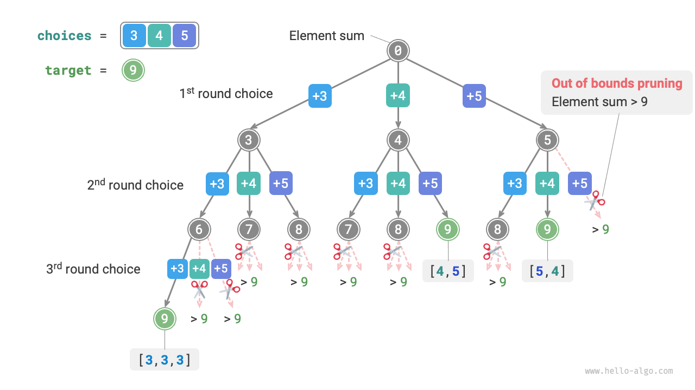
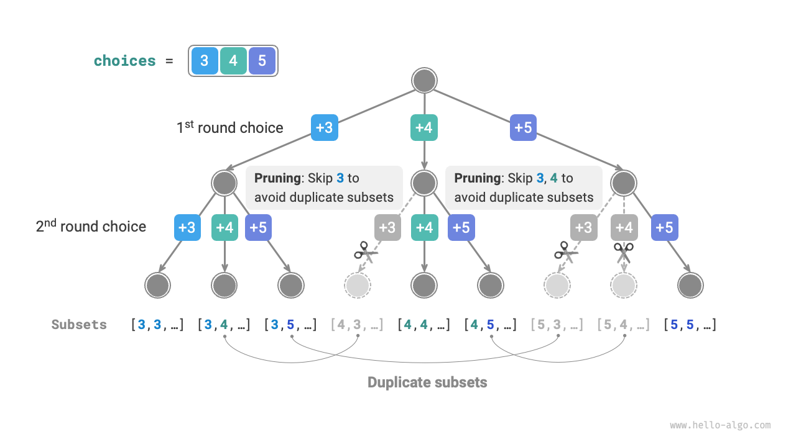
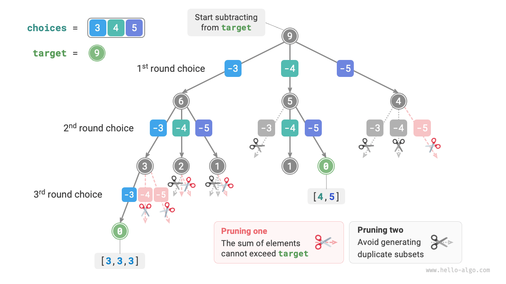
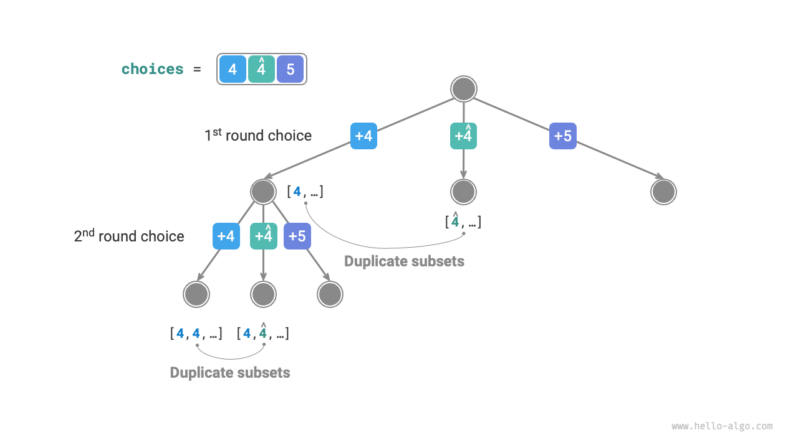
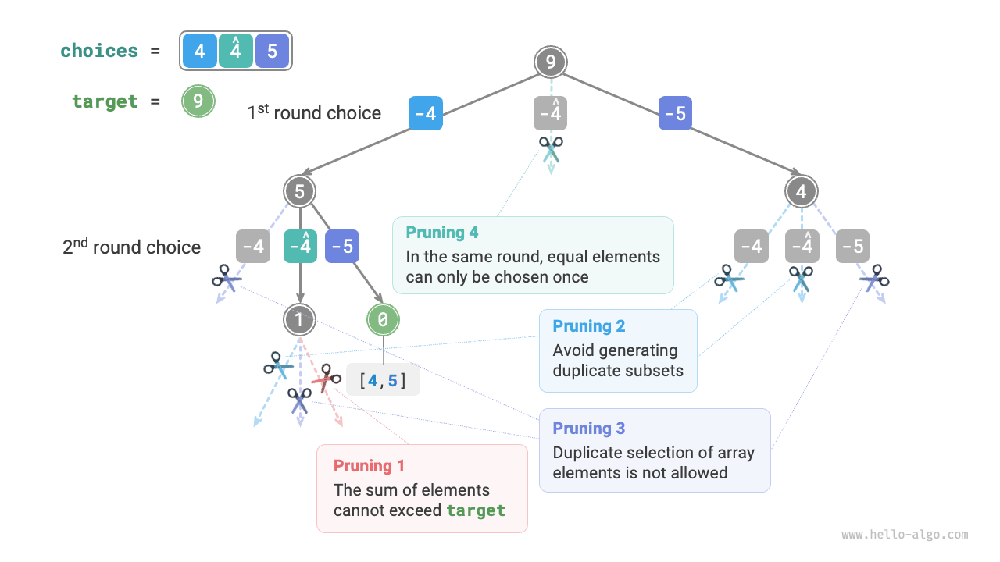

# 部分集合和問題

## 重複要素がない場合

!!! question

    正の整数の配列 `nums` とターゲット正整数 `target` が与えられた場合、組み合わせ内の要素の和が `target` に等しくなるようなすべての可能な組み合わせを見つけてください。与えられた配列には重複要素がなく、各要素は複数回選択できます。これらの組み合わせを重複する組み合わせを含まないリストとして返してください。

例えば、入力集合 $\{3, 4, 5\}$ とターゲット整数 $9$ の場合、解は $\{3, 3, 3\}, \{4, 5\}$ です。以下の2点に注意してください。

- 入力集合の要素は無制限に選択できます。
- 部分集合は要素の順序を区別しません。例えば $\{4, 5\}$ と $\{5, 4\}$ は同じ部分集合です。

### 順列解法の参考

順列問題と同様に、部分集合の生成を一連の選択として想像でき、選択プロセス中に「要素和」をリアルタイムで更新できます。要素和が `target` に等しくなったとき、部分集合を結果リストに記録します。

順列問題とは異なり、**この問題では要素は無制限に選択できるため**、要素が選択されたかどうかを記録するための `selected` ブール配列を使用する必要がありません。順列コードに軽微な修正を加えて、最初に問題を解決できます：

```src
[file]{subset_sum_i_naive}-[class]{}-[func]{subset_sum_i_naive}
```

配列 $[3, 4, 5]$ とターゲット要素 $9$ を上記のコードに入力すると、結果 $[3, 3, 3], [4, 5], [5, 4]$ が得られます。**和が $9$ のすべての部分集合を正常に見つけましたが、重複する部分集合 $[4, 5]$ と $[5, 4]$ が含まれています**。

これは、検索プロセスが選択の順序を区別するためですが、部分集合は選択順序を区別しません。以下の図に示すように、$5$ の前に $4$ を選択することと $4$ の前に $5$ を選択することは異なる分岐ですが、同じ部分集合に対応します。



重複する部分集合を除去するために、**直接的なアイデアは結果リストを重複除去することです**。しかし、この方法は2つの理由で非常に非効率的です。

- 配列要素が多い場合、特に `target` が大きい場合、検索プロセスで大量の重複する部分集合が生成されます。
- 部分集合（配列）の差異を比較することは非常に時間がかかり、まず配列をソートし、次に配列の各要素の差異を比較する必要があります。

### 重複部分集合の剪定

**剪定を通じて検索プロセス中に重複除去を検討します**。以下の図を観察すると、異なる順序で配列要素を選択するときに重複する部分集合が生成されます。例えば、以下の状況です。

1. 最初のラウンドで $3$ を選択し、2番目のラウンドで $4$ を選択すると、これら2つの要素を含むすべての部分集合が生成され、$[3, 4, \dots]$ と表記されます。
2. 後で、最初のラウンドで $4$ が選択されたとき、**2番目のラウンドは $3$ をスキップすべきです**。この選択によって生成される部分集合 $[4, 3, \dots]$ はステップ `1.` の部分集合と完全に重複するからです。

検索プロセスでは、各層の選択が左から右に一つずつ試行されるため、右側の分岐ほどより多く剪定されます。

1. 最初の2ラウンドで $3$ と $5$ を選択し、部分集合 $[3, 5, \dots]$ を生成します。
2. 最初の2ラウンドで $4$ と $5$ を選択し、部分集合 $[4, 5, \dots]$ を生成します。
3. 最初のラウンドで $5$ が選択された場合、**2番目のラウンドは $3$ と $4$ をスキップすべきです**。部分集合 $[5, 3, \dots]$ と $[5, 4, \dots]$ はステップ `1.` と `2.` で記述された部分集合と完全に重複するからです。



要約すると、入力配列 $[x_1, x_2, \dots, x_n]$ が与えられた場合、検索プロセスでの選択シーケンスは $[x_{i_1}, x_{i_2}, \dots, x_{i_m}]$ であるべきで、$i_1 \leq i_2 \leq \dots \leq i_m$ を満たす必要があります。**この条件を満たさない選択シーケンスは重複を引き起こし、剪定されるべきです**。

### コード実装

この剪定を実装するために、変数 `start` を初期化し、これは走査の開始点を示します。**選択 $x_{i}$ を行った後、次のラウンドをインデックス $i$ から開始するように設定します**。これにより、選択シーケンスが $i_1 \leq i_2 \leq \dots \leq i_m$ を満たすことが保証され、部分集合の一意性が保証されます。

さらに、コードに以下の2つの最適化を行いました。

- 検索を開始する前に、配列 `nums` をソートします。すべての選択の走査で、**部分集合和が `target` を超えたときにループを直接終了します**。後続の要素はより大きく、それらの部分集合和は確実に `target` を超えるからです。
- 要素和変数 `total` を除去し、**`target` に対して減算を実行して要素和をカウントします**。`target` が $0$ に等しくなったとき、解を記録します。

```src
[file]{subset_sum_i}-[class]{}-[func]{subset_sum_i}
```

以下の図は、配列 $[3, 4, 5]$ とターゲット要素 $9$ を上記のコードに入力した後の全体的なバックトラッキングプロセスを示しています。



## 重複要素がある場合を考慮

!!! question

    正の整数の配列 `nums` とターゲット正整数 `target` が与えられた場合、組み合わせ内の要素の和が `target` に等しくなるようなすべての可能な組み合わせを見つけてください。**与えられた配列には重複要素が含まれる可能性があり、各要素は一度だけ選択できます**。これらの組み合わせを重複する組み合わせを含まないリストとして返してください。

前の問題と比較して、**この問題の入力配列には重複要素が含まれる可能性があり**、新しい問題が導入されます。例えば、配列 $[4, \hat{4}, 5]$ とターゲット要素 $9$ が与えられた場合、既存のコードの出力結果は $[4, 5], [\hat{4}, 5]$ となり、重複する部分集合が生成されます。

**この重複の理由は、特定のラウンドで等しい要素が複数回選択されることです**。以下の図では、最初のラウンドに3つの選択肢があり、そのうち2つが $4$ であり、2つの重複する検索分岐を生成し、重複する部分集合を出力します。同様に、2番目のラウンドの2つの $4$ も重複する部分集合を生成します。



### 等値要素の剪定

この問題を解決するために、**等しい要素がラウンドごとに一度だけ選択されるように制限する必要があります**。実装は非常に巧妙です：配列がソートされているため、等しい要素は隣接しています。これは、特定のラウンドの選択で、現在の要素がその左側の要素と等しい場合、それはすでに選択されていることを意味するため、現在の要素を直接スキップします。

同時に、**この問題では各配列要素は一度だけ選択できると規定されています**。幸い、変数 `start` を使用してこの制約も満たすことができます：選択 $x_{i}$ を行った後、次のラウンドをインデックス $i + 1$ から前方に開始するように設定します。これにより、重複する部分集合が除去されるだけでなく、要素の重複選択も回避されます。

### コード実装

```src
[file]{subset_sum_ii}-[class]{}-[func]{subset_sum_ii}
```

以下の図は、配列 $[4, 4, 5]$ とターゲット要素 $9$ のバックトラッキングプロセスを示し、4種類の剪定操作が含まれています。図とコードのコメントを組み合わせて、検索プロセス全体と各種類の剪定操作の動作を理解してください。


