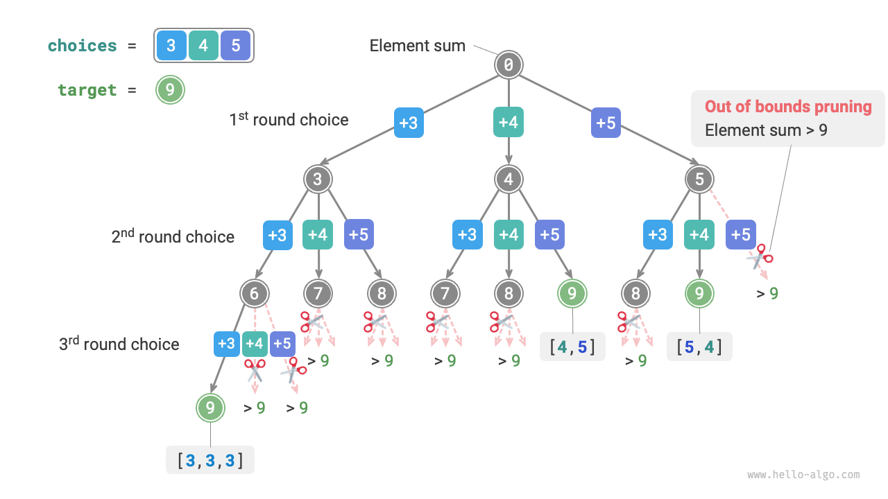
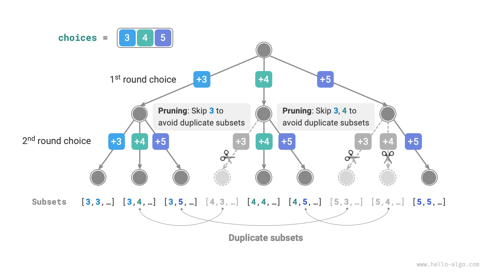
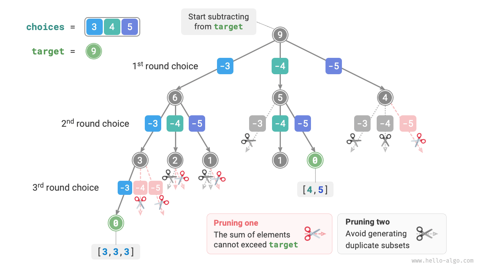
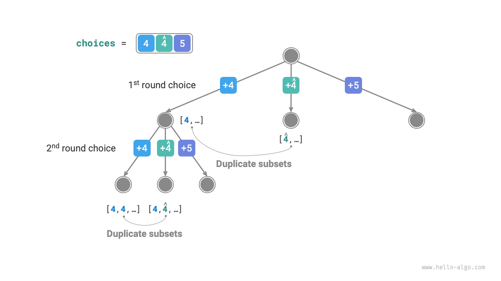
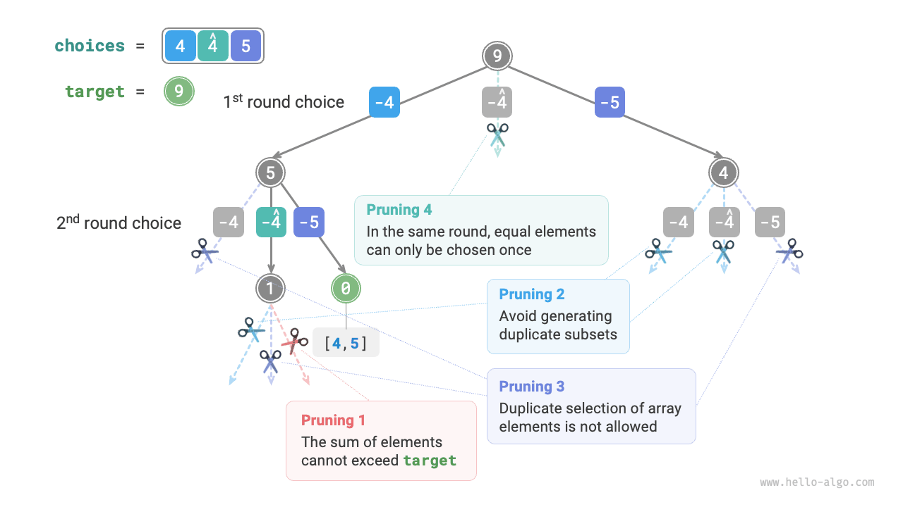

# 13.3 &nbsp; 部分和問題

## 13.3.1 &nbsp; 重複しない要素の場合

!!! question

    正整数配列 `nums` と目標の正整数 `target` が与えられたとき、要素の和が `target` に等しくなるすべての組合せを見つけてください。配列に重複要素はなく、各要素は複数回選択できます。これらの組合せをリスト形式で返してください。リストに重複する組合せを含めてはなりません。

例えば、入力集合 $\{3, 4, 5\}$ と目標整数 $9$ に対する解は $\{3, 3, 3\}, \{4, 5\}$ です。次の 2 点に注意してください。

- 入力集合内の要素は何度でも繰り返し選択できます。
- 部分集合では要素の順序を区別しません。例えば $\{4, 5\}$ と $\{5, 4\}$ は同じ部分集合です。

### 1. &nbsp; 全順列の解法を参考にする

全順列問題と同様に、部分集合の生成過程を一連の選択結果として捉え、選択の過程で「要素の和」を逐次更新できます。そして要素の和が `target` に等しくなった時点で、その部分集合を結果リストに記録します。

ただし全順列問題と異なるのは、**この問題では集合内の要素を無制限に選択できる**点です。そのため、要素がすでに選択されたかどうかを記録する `selected` ブール配列は不要です。全順列のコードに少し修正を加えると、まず次の解法コードが得られます。

=== "Python"

    ```python title="subset_sum_i_naive.py"
    def backtrack(
        state: list[int],
        target: int,
        total: int,
        choices: list[int],
        res: list[list[int]],
    ):
        """バックトラッキング：部分和 I"""
        # 部分集合の和が target に等しければ、解を記録
        if total == target:
            res.append(list(state))
            return
        # すべての選択肢を走査
        for i in range(len(choices)):
            # 枝刈り：部分和が target を超える場合はその選択をスキップする
            if total + choices[i] > target:
                continue
            # 試行：選択を行い、要素と total を更新する
            state.append(choices[i])
            # 次の選択へ進む
            backtrack(state, target, total + choices[i], choices, res)
            # バックトラック：選択を取り消し、前の状態に戻す
            state.pop()

    def subset_sum_i_naive(nums: list[int], target: int) -> list[list[int]]:
        """部分和 I を解く（重複部分集合を含む）"""
        state = []  # 状態（部分集合）
        total = 0  # 部分和
        res = []  # 結果リスト（部分集合のリスト）
        backtrack(state, target, total, nums, res)
        return res
    ```

=== "C++"

    ```cpp title="subset_sum_i_naive.cpp"
    /* バックトラッキング：部分和 I */
    void backtrack(vector<int> &state, int target, int total, vector<int> &choices, vector<vector<int>> &res) {
        // 部分集合の和が target に等しければ、解を記録
        if (total == target) {
            res.push_back(state);
            return;
        }
        // すべての選択肢を走査
        for (size_t i = 0; i < choices.size(); i++) {
            // 枝刈り：部分和が target を超える場合はその選択をスキップする
            if (total + choices[i] > target) {
                continue;
            }
            // 試行：選択を行い、要素と total を更新する
            state.push_back(choices[i]);
            // 次の選択へ進む
            backtrack(state, target, total + choices[i], choices, res);
            // バックトラック：選択を取り消し、前の状態に戻す
            state.pop_back();
        }
    }

    /* 部分和 I を解く（重複部分集合を含む） */
    vector<vector<int>> subsetSumINaive(vector<int> &nums, int target) {
        vector<int> state;       // 状態（部分集合）
        int total = 0;           // 部分和
        vector<vector<int>> res; // 結果リスト（部分集合のリスト）
        backtrack(state, target, total, nums, res);
        return res;
    }
    ```

=== "Java"

    ```java title="subset_sum_i_naive.java"
    /* バックトラッキング：部分和 I */
    void backtrack(List<Integer> state, int target, int total, int[] choices, List<List<Integer>> res) {
        // 部分集合の和が target に等しければ、解を記録
        if (total == target) {
            res.add(new ArrayList<>(state));
            return;
        }
        // すべての選択肢を走査
        for (int i = 0; i < choices.length; i++) {
            // 枝刈り：部分和が target を超える場合はその選択をスキップする
            if (total + choices[i] > target) {
                continue;
            }
            // 試行：選択を行い、要素と total を更新する
            state.add(choices[i]);
            // 次の選択へ進む
            backtrack(state, target, total + choices[i], choices, res);
            // バックトラック：選択を取り消し、前の状態に戻す
            state.remove(state.size() - 1);
        }
    }

    /* 部分和 I を解く（重複部分集合を含む） */
    List<List<Integer>> subsetSumINaive(int[] nums, int target) {
        List<Integer> state = new ArrayList<>(); // 状態（部分集合）
        int total = 0; // 部分和
        List<List<Integer>> res = new ArrayList<>(); // 結果リスト（部分集合のリスト）
        backtrack(state, target, total, nums, res);
        return res;
    }
    ```

=== "C#"

    ```csharp title="subset_sum_i_naive.cs"
    /* バックトラッキング：部分和 I */
    void Backtrack(List<int> state, int target, int total, int[] choices, List<List<int>> res) {
        // 部分集合の和が target に等しければ、解を記録
        if (total == target) {
            res.Add(new List<int>(state));
            return;
        }
        // すべての選択肢を走査
        for (int i = 0; i < choices.Length; i++) {
            // 枝刈り：部分和が target を超える場合はその選択をスキップする
            if (total + choices[i] > target) {
                continue;
            }
            // 試行：選択を行い、要素と total を更新する
            state.Add(choices[i]);
            // 次の選択へ進む
            Backtrack(state, target, total + choices[i], choices, res);
            // バックトラック：選択を取り消し、前の状態に戻す
            state.RemoveAt(state.Count - 1);
        }
    }

    /* 部分和 I を解く（重複部分集合を含む） */
    List<List<int>> SubsetSumINaive(int[] nums, int target) {
        List<int> state = []; // 状態（部分集合）
        int total = 0; // 部分和
        List<List<int>> res = []; // 結果リスト（部分集合のリスト）
        Backtrack(state, target, total, nums, res);
        return res;
    }
    ```

=== "Go"

    ```go title="subset_sum_i_naive.go"
    /* バックトラッキング：部分和 I */
    func backtrackSubsetSumINaive(total, target int, state, choices *[]int, res *[][]int) {
        // 部分集合の和が target に等しければ、解を記録
        if target == total {
            newState := append([]int{}, *state...)
            *res = append(*res, newState)
            return
        }
        // すべての選択肢を走査
        for i := 0; i < len(*choices); i++ {
            // 枝刈り：部分和が target を超える場合はその選択をスキップする
            if total+(*choices)[i] > target {
                continue
            }
            // 試行：選択を行い、要素と total を更新する
            *state = append(*state, (*choices)[i])
            // 次の選択へ進む
            backtrackSubsetSumINaive(total+(*choices)[i], target, state, choices, res)
            // バックトラック：選択を取り消し、前の状態に戻す
            *state = (*state)[:len(*state)-1]
        }
    }

    /* 部分和 I を解く（重複部分集合を含む） */
    func subsetSumINaive(nums []int, target int) [][]int {
        state := make([]int, 0) // 状態（部分集合）
        total := 0              // 部分和
        res := make([][]int, 0) // 結果リスト（部分集合のリスト）
        backtrackSubsetSumINaive(total, target, &state, &nums, &res)
        return res
    }
    ```

=== "Swift"

    ```swift title="subset_sum_i_naive.swift"
    /* バックトラッキング：部分和 I */
    func backtrack(state: inout [Int], target: Int, total: Int, choices: [Int], res: inout [[Int]]) {
        // 部分集合の和が target に等しければ、解を記録
        if total == target {
            res.append(state)
            return
        }
        // すべての選択肢を走査
        for i in choices.indices {
            // 枝刈り：部分和が target を超える場合はその選択をスキップする
            if total + choices[i] > target {
                continue
            }
            // 試行：選択を行い、要素と total を更新する
            state.append(choices[i])
            // 次の選択へ進む
            backtrack(state: &state, target: target, total: total + choices[i], choices: choices, res: &res)
            // バックトラック：選択を取り消し、前の状態に戻す
            state.removeLast()
        }
    }

    /* 部分和 I を解く（重複部分集合を含む） */
    func subsetSumINaive(nums: [Int], target: Int) -> [[Int]] {
        var state: [Int] = [] // 状態（部分集合）
        let total = 0 // 部分和
        var res: [[Int]] = [] // 結果リスト（部分集合のリスト）
        backtrack(state: &state, target: target, total: total, choices: nums, res: &res)
        return res
    }
    ```

=== "JS"

    ```javascript title="subset_sum_i_naive.js"
    /* バックトラッキング：部分和 I */
    function backtrack(state, target, total, choices, res) {
        // 部分集合の和が target に等しければ、解を記録
        if (total === target) {
            res.push([...state]);
            return;
        }
        // すべての選択肢を走査
        for (let i = 0; i < choices.length; i++) {
            // 枝刈り：部分和が target を超える場合はその選択をスキップする
            if (total + choices[i] > target) {
                continue;
            }
            // 試行：選択を行い、要素と total を更新する
            state.push(choices[i]);
            // 次の選択へ進む
            backtrack(state, target, total + choices[i], choices, res);
            // バックトラック：選択を取り消し、前の状態に戻す
            state.pop();
        }
    }

    /* 部分和 I を解く（重複部分集合を含む） */
    function subsetSumINaive(nums, target) {
        const state = []; // 状態（部分集合）
        const total = 0; // 部分和
        const res = []; // 結果リスト（部分集合のリスト）
        backtrack(state, target, total, nums, res);
        return res;
    }
    ```

=== "TS"

    ```typescript title="subset_sum_i_naive.ts"
    /* バックトラッキング：部分和 I */
    function backtrack(
        state: number[],
        target: number,
        total: number,
        choices: number[],
        res: number[][]
    ): void {
        // 部分集合の和が target に等しければ、解を記録
        if (total === target) {
            res.push([...state]);
            return;
        }
        // すべての選択肢を走査
        for (let i = 0; i < choices.length; i++) {
            // 枝刈り：部分和が target を超える場合はその選択をスキップする
            if (total + choices[i] > target) {
                continue;
            }
            // 試行：選択を行い、要素と total を更新する
            state.push(choices[i]);
            // 次の選択へ進む
            backtrack(state, target, total + choices[i], choices, res);
            // バックトラック：選択を取り消し、前の状態に戻す
            state.pop();
        }
    }

    /* 部分和 I を解く（重複部分集合を含む） */
    function subsetSumINaive(nums: number[], target: number): number[][] {
        const state = []; // 状態（部分集合）
        const total = 0; // 部分和
        const res = []; // 結果リスト（部分集合のリスト）
        backtrack(state, target, total, nums, res);
        return res;
    }
    ```

=== "Dart"

    ```dart title="subset_sum_i_naive.dart"
    /* バックトラッキング：部分和 I */
    void backtrack(
      List<int> state,
      int target,
      int total,
      List<int> choices,
      List<List<int>> res,
    ) {
      // 部分集合の和が target に等しければ、解を記録
      if (total == target) {
        res.add(List.from(state));
        return;
      }
      // すべての選択肢を走査
      for (int i = 0; i < choices.length; i++) {
        // 枝刈り：部分和が target を超える場合はその選択をスキップする
        if (total + choices[i] > target) {
          continue;
        }
        // 試行：選択を行い、要素と total を更新する
        state.add(choices[i]);
        // 次の選択へ進む
        backtrack(state, target, total + choices[i], choices, res);
        // バックトラック：選択を取り消し、前の状態に戻す
        state.removeLast();
      }
    }

    /* 部分和 I を解く（重複部分集合を含む） */
    List<List<int>> subsetSumINaive(List<int> nums, int target) {
      List<int> state = []; // 状態（部分集合）
      int total = 0; // 要素の合計
      List<List<int>> res = []; // 結果リスト（部分集合のリスト）
      backtrack(state, target, total, nums, res);
      return res;
    }
    ```

=== "Rust"

    ```rust title="subset_sum_i_naive.rs"
    /* バックトラッキング：部分和 I */
    fn backtrack(
        state: &mut Vec<i32>,
        target: i32,
        total: i32,
        choices: &[i32],
        res: &mut Vec<Vec<i32>>,
    ) {
        // 部分集合の和が target に等しければ、解を記録
        if total == target {
            res.push(state.clone());
            return;
        }
        // すべての選択肢を走査
        for i in 0..choices.len() {
            // 枝刈り：部分和が target を超える場合はその選択をスキップする
            if total + choices[i] > target {
                continue;
            }
            // 試行：選択を行い、要素と total を更新する
            state.push(choices[i]);
            // 次の選択へ進む
            backtrack(state, target, total + choices[i], choices, res);
            // バックトラック：選択を取り消し、前の状態に戻す
            state.pop();
        }
    }

    /* 部分和 I を解く（重複部分集合を含む） */
    fn subset_sum_i_naive(nums: &[i32], target: i32) -> Vec<Vec<i32>> {
        let mut state = Vec::new(); // 状態（部分集合）
        let total = 0; // 部分和
        let mut res = Vec::new(); // 結果リスト（部分集合のリスト）
        backtrack(&mut state, target, total, nums, &mut res);
        res
    }
    ```

=== "C"

    ```c title="subset_sum_i_naive.c"
    /* バックトラッキング：部分和 I */
    void backtrack(int target, int total, int *choices, int choicesSize) {
        // 部分集合の和が target に等しければ、解を記録
        if (total == target) {
            for (int i = 0; i < stateSize; i++) {
                res[resSize][i] = state[i];
            }
            resColSizes[resSize++] = stateSize;
            return;
        }
        // すべての選択肢を走査
        for (int i = 0; i < choicesSize; i++) {
            // 枝刈り：部分和が target を超える場合はその選択をスキップする
            if (total + choices[i] > target) {
                continue;
            }
            // 試行：選択を行い、要素と total を更新する
            state[stateSize++] = choices[i];
            // 次の選択へ進む
            backtrack(target, total + choices[i], choices, choicesSize);
            // バックトラック：選択を取り消し、前の状態に戻す
            stateSize--;
        }
    }

    /* 部分和 I を解く（重複部分集合を含む） */
    void subsetSumINaive(int *nums, int numsSize, int target) {
        resSize = 0; // 解の個数を 0 に初期化する
        backtrack(target, 0, nums, numsSize);
    }
    ```

=== "Kotlin"

    ```kotlin title="subset_sum_i_naive.kt"
    /* バックトラッキング：部分和 I */
    fun backtrack(
        state: MutableList<Int>,
        target: Int,
        total: Int,
        choices: IntArray,
        res: MutableList<MutableList<Int>?>
    ) {
        // 部分集合の和が target に等しければ、解を記録
        if (total == target) {
            res.add(state.toMutableList())
            return
        }
        // すべての選択肢を走査
        for (i in choices.indices) {
            // 枝刈り：部分和が target を超える場合はその選択をスキップする
            if (total + choices[i] > target) {
                continue
            }
            // 試行：選択を行い、要素と total を更新する
            state.add(choices[i])
            // 次の選択へ進む
            backtrack(state, target, total + choices[i], choices, res)
            // バックトラック：選択を取り消し、前の状態に戻す
            state.removeAt(state.size - 1)
        }
    }

    /* 部分和 I を解く（重複部分集合を含む） */
    fun subsetSumINaive(nums: IntArray, target: Int): MutableList<MutableList<Int>?> {
        val state = mutableListOf<Int>() // 状態（部分集合）
        val total = 0 // 部分和
        val res = mutableListOf<MutableList<Int>?>() // 結果リスト（部分集合のリスト）
        backtrack(state, target, total, nums, res)
        return res
    }
    ```

=== "Ruby"

    ```ruby title="subset_sum_i_naive.rb"
    ### バックトラッキング: 部分和 I ###
    def backtrack(state, target, total, choices, res)
      # 部分集合の和が target に等しければ、解を記録
      if total == target
        res << state.dup
        return
      end

      # すべての選択肢を走査
      for i in 0...choices.length
        # 枝刈り：部分和が target を超える場合はその選択をスキップする
        next if total + choices[i] > target
        # 試行：選択を行い、要素と total を更新する
        state << choices[i]
        # 次の選択へ進む
        backtrack(state, target, total + choices[i], choices, res)
        # バックトラック：選択を取り消し、前の状態に戻す
        state.pop
      end
    end

    ### バックトラッキング: 部分和 I ###
    def backtrack(state, target, total, choices, res)
      # 部分集合の和が target に等しければ、解を記録
      if total == target
        res << state.dup
        return
      end

      # すべての選択肢を走査
      for i in 0...choices.length
        # 枝刈り：部分和が target を超える場合はその選択をスキップする
        next if total + choices[i] > target
        # 試行：選択を行い、要素と total を更新する
        state << choices[i]
        # 次の選択へ進む
        backtrack(state, target, total + choices[i], choices, res)
        # バックトラック：選択を取り消し、前の状態に戻す
        state.pop
      end
    end

    # ## 部分和 I を解く（重複する部分集合を含む）###
    def subset_sum_i_naive(nums, target)
      state = [] # 状態（部分集合）
      total = 0 # 部分和
      res = [] # 結果リスト（部分集合のリスト）
      backtrack(state, target, total, nums, res)
      res
    end
    ```

??? pythontutor "コードの可視化"

    <div style="height: 549px; width: 100%;"><iframe class="pythontutor-iframe" src="https://pythontutor.com/iframe-embed.html#code=def%20backtrack%28%0A%20%20%20%20state%3A%20list%5Bint%5D%2C%0A%20%20%20%20target%3A%20int%2C%0A%20%20%20%20total%3A%20int%2C%0A%20%20%20%20choices%3A%20list%5Bint%5D%2C%0A%20%20%20%20res%3A%20list%5Blist%5Bint%5D%5D%2C%0A%29%3A%0A%20%20%20%20%22%22%22%E3%83%90%E3%83%83%E3%82%AF%E3%83%88%E3%83%A9%E3%83%83%E3%82%AD%E3%83%B3%E3%82%B0%EF%BC%9A%E9%83%A8%E5%88%86%E5%92%8C%20I%22%22%22%0A%20%20%20%20%23%20%E9%83%A8%E5%88%86%E9%9B%86%E5%90%88%E3%81%AE%E5%92%8C%E3%81%8C%20target%20%E3%81%AB%E7%AD%89%E3%81%97%E3%81%91%E3%82%8C%E3%81%B0%E3%80%81%E8%A7%A3%E3%82%92%E8%A8%98%E9%8C%B2%0A%20%20%20%20if%20total%20%3D%3D%20target%3A%0A%20%20%20%20%20%20%20%20res.append%28list%28state%29%29%0A%20%20%20%20%20%20%20%20return%0A%20%20%20%20%23%20%E3%81%99%E3%81%B9%E3%81%A6%E3%81%AE%E9%81%B8%E6%8A%9E%E8%82%A2%E3%82%92%E8%B5%B0%E6%9F%BB%0A%20%20%20%20for%20i%20in%20range%28len%28choices%29%29%3A%0A%20%20%20%20%20%20%20%20%23%20%E6%9E%9D%E5%88%88%E3%82%8A%EF%BC%9A%E9%83%A8%E5%88%86%E5%92%8C%E3%81%8C%20target%20%E3%82%92%E8%B6%85%E3%81%88%E3%82%8B%E5%A0%B4%E5%90%88%E3%81%AF%E3%81%9D%E3%81%AE%E9%81%B8%E6%8A%9E%E3%82%92%E3%82%B9%E3%82%AD%E3%83%83%E3%83%97%E3%81%99%E3%82%8B%0A%20%20%20%20%20%20%20%20if%20total%20%2B%20choices%5Bi%5D%20%3E%20target%3A%0A%20%20%20%20%20%20%20%20%20%20%20%20continue%0A%20%20%20%20%20%20%20%20%23%20%E8%A9%A6%E8%A1%8C%EF%BC%9A%E9%81%B8%E6%8A%9E%E3%82%92%E8%A1%8C%E3%81%84%E3%80%81%E8%A6%81%E7%B4%A0%E3%81%A8%20total%20%E3%82%92%E6%9B%B4%E6%96%B0%E3%81%99%E3%82%8B%0A%20%20%20%20%20%20%20%20state.append%28choices%5Bi%5D%29%0A%20%20%20%20%20%20%20%20%23%20%E6%AC%A1%E3%81%AE%E9%81%B8%E6%8A%9E%E3%81%B8%E9%80%B2%E3%82%80%0A%20%20%20%20%20%20%20%20backtrack%28state%2C%20target%2C%20total%20%2B%20choices%5Bi%5D%2C%20choices%2C%20res%29%0A%20%20%20%20%20%20%20%20%23%20%E3%83%90%E3%83%83%E3%82%AF%E3%83%88%E3%83%A9%E3%83%83%E3%82%AF%EF%BC%9A%E9%81%B8%E6%8A%9E%E3%82%92%E5%8F%96%E3%82%8A%E6%B6%88%E3%81%97%E3%80%81%E5%89%8D%E3%81%AE%E7%8A%B6%E6%85%8B%E3%81%AB%E6%88%BB%E3%81%99%0A%20%20%20%20%20%20%20%20state.pop%28%29%0A%0A%0Adef%20subset_sum_i_naive%28nums%3A%20list%5Bint%5D%2C%20target%3A%20int%29%20-%3E%20list%5Blist%5Bint%5D%5D%3A%0A%20%20%20%20%22%22%22%E9%83%A8%E5%88%86%E5%92%8C%20I%20%E3%82%92%E8%A7%A3%E3%81%8F%EF%BC%88%E9%87%8D%E8%A4%87%E9%83%A8%E5%88%86%E9%9B%86%E5%90%88%E3%82%92%E5%90%AB%E3%82%80%EF%BC%89%22%22%22%0A%20%20%20%20state%20%3D%20%5B%5D%20%20%23%20%E7%8A%B6%E6%85%8B%EF%BC%88%E9%83%A8%E5%88%86%E9%9B%86%E5%90%88%EF%BC%89%0A%20%20%20%20total%20%3D%200%20%20%23%20%E9%83%A8%E5%88%86%E5%92%8C%0A%20%20%20%20res%20%3D%20%5B%5D%20%20%23%20%E7%B5%90%E6%9E%9C%E3%83%AA%E3%82%B9%E3%83%88%EF%BC%88%E9%83%A8%E5%88%86%E9%9B%86%E5%90%88%E3%81%AE%E3%83%AA%E3%82%B9%E3%83%88%EF%BC%89%0A%20%20%20%20backtrack%28state%2C%20target%2C%20total%2C%20nums%2C%20res%29%0A%20%20%20%20return%20res%0A%0A%0Aif%20__name__%20%3D%3D%20%22__main__%22%3A%0A%20%20%20%20nums%20%3D%20%5B3%2C%204%2C%205%5D%0A%20%20%20%20target%20%3D%209%0A%20%20%20%20res%20%3D%20subset_sum_i_naive%28nums%2C%20target%29%0A%0A%20%20%20%20print%28f%22%E5%85%A5%E5%8A%9B%E9%85%8D%E5%88%97%20nums%20%3D%20%7Bnums%7D%2C%20target%20%3D%20%7Btarget%7D%22%29%0A%20%20%20%20print%28f%22%E5%92%8C%E3%81%8C%20%7Btarget%7D%20%E3%81%AB%E7%AD%89%E3%81%97%E3%81%84%E3%81%99%E3%81%B9%E3%81%A6%E3%81%AE%E9%83%A8%E5%88%86%E9%9B%86%E5%90%88%20res%20%3D%20%7Bres%7D%22%29%0A%20%20%20%20print%28f%22%E6%B3%A8%E6%84%8F%3A%20%E3%81%93%E3%81%AE%E6%96%B9%E6%B3%95%E3%81%AE%E5%87%BA%E5%8A%9B%E7%B5%90%E6%9E%9C%E3%81%AB%E3%81%AF%E9%87%8D%E8%A4%87%E3%81%99%E3%82%8B%E9%9B%86%E5%90%88%E3%81%8C%E5%90%AB%E3%81%BE%E3%82%8C%E3%81%BE%E3%81%99%22%29&codeDivHeight=472&codeDivWidth=350&cumulative=false&curInstr=16&heapPrimitives=nevernest&origin=opt-frontend.js&py=311&rawInputLstJSON=%5B%5D&textReferences=false"> </iframe></div>
    <div style="margin-top: 5px;"><a href="https://pythontutor.com/iframe-embed.html#code=def%20backtrack%28%0A%20%20%20%20state%3A%20list%5Bint%5D%2C%0A%20%20%20%20target%3A%20int%2C%0A%20%20%20%20total%3A%20int%2C%0A%20%20%20%20choices%3A%20list%5Bint%5D%2C%0A%20%20%20%20res%3A%20list%5Blist%5Bint%5D%5D%2C%0A%29%3A%0A%20%20%20%20%22%22%22%E3%83%90%E3%83%83%E3%82%AF%E3%83%88%E3%83%A9%E3%83%83%E3%82%AD%E3%83%B3%E3%82%B0%EF%BC%9A%E9%83%A8%E5%88%86%E5%92%8C%20I%22%22%22%0A%20%20%20%20%23%20%E9%83%A8%E5%88%86%E9%9B%86%E5%90%88%E3%81%AE%E5%92%8C%E3%81%8C%20target%20%E3%81%AB%E7%AD%89%E3%81%97%E3%81%91%E3%82%8C%E3%81%B0%E3%80%81%E8%A7%A3%E3%82%92%E8%A8%98%E9%8C%B2%0A%20%20%20%20if%20total%20%3D%3D%20target%3A%0A%20%20%20%20%20%20%20%20res.append%28list%28state%29%29%0A%20%20%20%20%20%20%20%20return%0A%20%20%20%20%23%20%E3%81%99%E3%81%B9%E3%81%A6%E3%81%AE%E9%81%B8%E6%8A%9E%E8%82%A2%E3%82%92%E8%B5%B0%E6%9F%BB%0A%20%20%20%20for%20i%20in%20range%28len%28choices%29%29%3A%0A%20%20%20%20%20%20%20%20%23%20%E6%9E%9D%E5%88%88%E3%82%8A%EF%BC%9A%E9%83%A8%E5%88%86%E5%92%8C%E3%81%8C%20target%20%E3%82%92%E8%B6%85%E3%81%88%E3%82%8B%E5%A0%B4%E5%90%88%E3%81%AF%E3%81%9D%E3%81%AE%E9%81%B8%E6%8A%9E%E3%82%92%E3%82%B9%E3%82%AD%E3%83%83%E3%83%97%E3%81%99%E3%82%8B%0A%20%20%20%20%20%20%20%20if%20total%20%2B%20choices%5Bi%5D%20%3E%20target%3A%0A%20%20%20%20%20%20%20%20%20%20%20%20continue%0A%20%20%20%20%20%20%20%20%23%20%E8%A9%A6%E8%A1%8C%EF%BC%9A%E9%81%B8%E6%8A%9E%E3%82%92%E8%A1%8C%E3%81%84%E3%80%81%E8%A6%81%E7%B4%A0%E3%81%A8%20total%20%E3%82%92%E6%9B%B4%E6%96%B0%E3%81%99%E3%82%8B%0A%20%20%20%20%20%20%20%20state.append%28choices%5Bi%5D%29%0A%20%20%20%20%20%20%20%20%23%20%E6%AC%A1%E3%81%AE%E9%81%B8%E6%8A%9E%E3%81%B8%E9%80%B2%E3%82%80%0A%20%20%20%20%20%20%20%20backtrack%28state%2C%20target%2C%20total%20%2B%20choices%5Bi%5D%2C%20choices%2C%20res%29%0A%20%20%20%20%20%20%20%20%23%20%E3%83%90%E3%83%83%E3%82%AF%E3%83%88%E3%83%A9%E3%83%83%E3%82%AF%EF%BC%9A%E9%81%B8%E6%8A%9E%E3%82%92%E5%8F%96%E3%82%8A%E6%B6%88%E3%81%97%E3%80%81%E5%89%8D%E3%81%AE%E7%8A%B6%E6%85%8B%E3%81%AB%E6%88%BB%E3%81%99%0A%20%20%20%20%20%20%20%20state.pop%28%29%0A%0A%0Adef%20subset_sum_i_naive%28nums%3A%20list%5Bint%5D%2C%20target%3A%20int%29%20-%3E%20list%5Blist%5Bint%5D%5D%3A%0A%20%20%20%20%22%22%22%E9%83%A8%E5%88%86%E5%92%8C%20I%20%E3%82%92%E8%A7%A3%E3%81%8F%EF%BC%88%E9%87%8D%E8%A4%87%E9%83%A8%E5%88%86%E9%9B%86%E5%90%88%E3%82%92%E5%90%AB%E3%82%80%EF%BC%89%22%22%22%0A%20%20%20%20state%20%3D%20%5B%5D%20%20%23%20%E7%8A%B6%E6%85%8B%EF%BC%88%E9%83%A8%E5%88%86%E9%9B%86%E5%90%88%EF%BC%89%0A%20%20%20%20total%20%3D%200%20%20%23%20%E9%83%A8%E5%88%86%E5%92%8C%0A%20%20%20%20res%20%3D%20%5B%5D%20%20%23%20%E7%B5%90%E6%9E%9C%E3%83%AA%E3%82%B9%E3%83%88%EF%BC%88%E9%83%A8%E5%88%86%E9%9B%86%E5%90%88%E3%81%AE%E3%83%AA%E3%82%B9%E3%83%88%EF%BC%89%0A%20%20%20%20backtrack%28state%2C%20target%2C%20total%2C%20nums%2C%20res%29%0A%20%20%20%20return%20res%0A%0A%0Aif%20__name__%20%3D%3D%20%22__main__%22%3A%0A%20%20%20%20nums%20%3D%20%5B3%2C%204%2C%205%5D%0A%20%20%20%20target%20%3D%209%0A%20%20%20%20res%20%3D%20subset_sum_i_naive%28nums%2C%20target%29%0A%0A%20%20%20%20print%28f%22%E5%85%A5%E5%8A%9B%E9%85%8D%E5%88%97%20nums%20%3D%20%7Bnums%7D%2C%20target%20%3D%20%7Btarget%7D%22%29%0A%20%20%20%20print%28f%22%E5%92%8C%E3%81%8C%20%7Btarget%7D%20%E3%81%AB%E7%AD%89%E3%81%97%E3%81%84%E3%81%99%E3%81%B9%E3%81%A6%E3%81%AE%E9%83%A8%E5%88%86%E9%9B%86%E5%90%88%20res%20%3D%20%7Bres%7D%22%29%0A%20%20%20%20print%28f%22%E6%B3%A8%E6%84%8F%3A%20%E3%81%93%E3%81%AE%E6%96%B9%E6%B3%95%E3%81%AE%E5%87%BA%E5%8A%9B%E7%B5%90%E6%9E%9C%E3%81%AB%E3%81%AF%E9%87%8D%E8%A4%87%E3%81%99%E3%82%8B%E9%9B%86%E5%90%88%E3%81%8C%E5%90%AB%E3%81%BE%E3%82%8C%E3%81%BE%E3%81%99%22%29&codeDivHeight=800&codeDivWidth=600&cumulative=false&curInstr=16&heapPrimitives=nevernest&origin=opt-frontend.js&py=311&rawInputLstJSON=%5B%5D&textReferences=false" target="_blank" rel="noopener noreferrer">全画面で見る ></a></div>

上のコードに配列 $[3, 4, 5]$ と目標値 $9$ を入力すると、出力は $[3, 3, 3], [4, 5], [5, 4]$ となります。**和が $9$ となる部分集合はすべて見つかっていますが、重複する部分集合 $[4, 5]$ と $[5, 4]$ が含まれています**。

これは、探索過程では選択順を区別する一方で、部分集合では選択順を区別しないためです。次の図のように、先に $4$ を選んでから $5$ を選ぶ場合と、先に $5$ を選んでから $4$ を選ぶ場合は別の分岐ですが、対応する部分集合は同じです。

{ class="animation-figure" }

<p align="center"> 図 13-10 &nbsp; 部分集合探索と境界超過の枝刈り </p>

重複する部分集合を取り除くために、**直接的な方法として結果リストの重複を除去する**ことが考えられます。しかし、この方法は効率が低く、その理由は次の 2 点です。

- 配列要素が多い場合、特に `target` が大きい場合には、探索過程で大量の重複部分集合が生成されます。
- 部分集合（配列）同士の違いを比較するのは非常に時間がかかり、まず配列をソートし、その後に各要素を比較する必要があります。

### 2. &nbsp; 重複部分集合の枝刈り

**探索過程で枝刈りを行って重複を除去する**ことを考えます。次の図を観察すると、重複部分集合は配列要素を異なる順序で選択したときに生じます。例えば次のような状況です。

1. 1 回目と 2 回目でそれぞれ $3$ と $4$ を選ぶと、これら 2 要素を含むすべての部分集合、すなわち $[3, 4, \dots]$ が生成されます。
2. その後、1 回目で $4$ を選んだ場合、**2 回目では $3$ をスキップすべき**です。というのも、この選択で生成される部分集合 $[4, 3, \dots]$ は、手順 `1.` で生成された部分集合と完全に重複するからです。

探索過程では、各階層の選択は左から右へ順に試されるため、右側にある分岐ほど多く枝刈りされます。

1. 最初の 2 回で $3$ と $5$ を選ぶと、部分集合 $[3, 5, \dots]$ が生成されます。
2. 最初の 2 回で $4$ と $5$ を選ぶと、部分集合 $[4, 5, \dots]$ が生成されます。
3. もし 1 回目で $5$ を選ぶなら、**2 回目では $3$ と $4$ をスキップすべき**です。なぜなら、部分集合 $[5, 3, \dots]$ と $[5, 4, \dots]$ は、手順 `1.` と手順 `2.` で述べた部分集合と完全に重複するからです。

{ class="animation-figure" }

<p align="center"> 図 13-11 &nbsp; 異なる選択順によって生じる重複部分集合 </p>

まとめると、入力配列 $[x_1, x_2, \dots, x_n]$ が与えられ、探索過程における選択列を $[x_{i_1}, x_{i_2}, \dots, x_{i_m}]$ とすると、この選択列は $i_1 \leq i_2 \leq \dots \leq i_m$ を満たす必要があります。**この条件を満たさない選択列は重複を生むため、枝刈りすべきです**。

### 3. &nbsp; コード実装

この枝刈りを実現するために、走査の開始位置を示す変数 `start` を初期化します。**選択 $x_{i}$ を行った後、次のラウンドはインデックス $i$ から走査を開始する**ように設定します。これにより、選択列が $i_1 \leq i_2 \leq \dots \leq i_m$ を満たし、部分集合の一意性が保証されます。

これに加えて、コードには次の 2 つの最適化も施しています。

- 探索を始める前に、まず配列 `nums` をソートします。すべての選択肢を走査するとき、**部分集合の和が `target` を超えたら直ちにループを終了**します。後続の要素はさらに大きいため、その和も必ず `target` を超えるからです。
- 要素和を保持する変数 `total` は省略し、**`target` から減算することで要素和を管理**します。`target` が $0$ になったときに解を記録します。

=== "Python"

    ```python title="subset_sum_i.py"
    def backtrack(
        state: list[int], target: int, choices: list[int], start: int, res: list[list[int]]
    ):
        """バックトラッキング：部分和 I"""
        # 部分集合の和が target に等しければ、解を記録
        if target == 0:
            res.append(list(state))
            return
        # すべての選択肢を走査
        # 枝刈り 2: start から走査し、重複する部分集合の生成を避ける
        for i in range(start, len(choices)):
            # 枝刈り1：部分集合の和が target を超えたら、直ちにループを終了する
            # 配列はソート済みで後続要素のほうが大きく、部分集合の和は必ず target を超えるため
            if target - choices[i] < 0:
                break
            # 試す：選択を行い、target と start を更新
            state.append(choices[i])
            # 次の選択へ進む
            backtrack(state, target - choices[i], choices, i, res)
            # バックトラック：選択を取り消し、前の状態に戻す
            state.pop()

    def subset_sum_i(nums: list[int], target: int) -> list[list[int]]:
        """部分和 I を解く"""
        state = []  # 状態（部分集合）
        nums.sort()  # nums をソート
        start = 0  # 開始点を走査
        res = []  # 結果リスト（部分集合のリスト）
        backtrack(state, target, nums, start, res)
        return res
    ```

=== "C++"

    ```cpp title="subset_sum_i.cpp"
    /* バックトラッキング：部分和 I */
    void backtrack(vector<int> &state, int target, vector<int> &choices, int start, vector<vector<int>> &res) {
        // 部分集合の和が target に等しければ、解を記録
        if (target == 0) {
            res.push_back(state);
            return;
        }
        // すべての選択肢を走査
        // 枝刈り 2: start から走査し、重複する部分集合の生成を避ける
        for (int i = start; i < choices.size(); i++) {
            // 枝刈り1：部分集合の和が target を超えたら、直ちにループを終了する
            // 配列はソート済みで後続要素のほうが大きく、部分集合の和は必ず target を超えるため
            if (target - choices[i] < 0) {
                break;
            }
            // 試す：選択を行い、target と start を更新
            state.push_back(choices[i]);
            // 次の選択へ進む
            backtrack(state, target - choices[i], choices, i, res);
            // バックトラック：選択を取り消し、前の状態に戻す
            state.pop_back();
        }
    }

    /* 部分和 I を解く */
    vector<vector<int>> subsetSumI(vector<int> &nums, int target) {
        vector<int> state;              // 状態（部分集合）
        sort(nums.begin(), nums.end()); // nums をソート
        int start = 0;                  // 開始点を走査
        vector<vector<int>> res;        // 結果リスト（部分集合のリスト）
        backtrack(state, target, nums, start, res);
        return res;
    }
    ```

=== "Java"

    ```java title="subset_sum_i.java"
    /* バックトラッキング：部分和 I */
    void backtrack(List<Integer> state, int target, int[] choices, int start, List<List<Integer>> res) {
        // 部分集合の和が target に等しければ、解を記録
        if (target == 0) {
            res.add(new ArrayList<>(state));
            return;
        }
        // すべての選択肢を走査
        // 枝刈り 2: start から走査し、重複する部分集合の生成を避ける
        for (int i = start; i < choices.length; i++) {
            // 枝刈り1：部分集合の和が target を超えたら、直ちにループを終了する
            // 配列はソート済みで後続要素のほうが大きく、部分集合の和は必ず target を超えるため
            if (target - choices[i] < 0) {
                break;
            }
            // 試す：選択を行い、target と start を更新
            state.add(choices[i]);
            // 次の選択へ進む
            backtrack(state, target - choices[i], choices, i, res);
            // バックトラック：選択を取り消し、前の状態に戻す
            state.remove(state.size() - 1);
        }
    }

    /* 部分和 I を解く */
    List<List<Integer>> subsetSumI(int[] nums, int target) {
        List<Integer> state = new ArrayList<>(); // 状態（部分集合）
        Arrays.sort(nums); // nums をソート
        int start = 0; // 開始点を走査
        List<List<Integer>> res = new ArrayList<>(); // 結果リスト（部分集合のリスト）
        backtrack(state, target, nums, start, res);
        return res;
    }
    ```

=== "C#"

    ```csharp title="subset_sum_i.cs"
    /* バックトラッキング：部分和 I */
    void Backtrack(List<int> state, int target, int[] choices, int start, List<List<int>> res) {
        // 部分集合の和が target に等しければ、解を記録
        if (target == 0) {
            res.Add(new List<int>(state));
            return;
        }
        // すべての選択肢を走査
        // 枝刈り 2: start から走査し、重複する部分集合の生成を避ける
        for (int i = start; i < choices.Length; i++) {
            // 枝刈り1：部分集合の和が target を超えたら、直ちにループを終了する
            // 配列はソート済みで後続要素のほうが大きく、部分集合の和は必ず target を超えるため
            if (target - choices[i] < 0) {
                break;
            }
            // 試す：選択を行い、target と start を更新
            state.Add(choices[i]);
            // 次の選択へ進む
            Backtrack(state, target - choices[i], choices, i, res);
            // バックトラック：選択を取り消し、前の状態に戻す
            state.RemoveAt(state.Count - 1);
        }
    }

    /* 部分和 I を解く */
    List<List<int>> SubsetSumI(int[] nums, int target) {
        List<int> state = []; // 状態（部分集合）
        Array.Sort(nums); // nums をソート
        int start = 0; // 開始点を走査
        List<List<int>> res = []; // 結果リスト（部分集合のリスト）
        Backtrack(state, target, nums, start, res);
        return res;
    }
    ```

=== "Go"

    ```go title="subset_sum_i.go"
    /* バックトラッキング：部分和 I */
    func backtrackSubsetSumI(start, target int, state, choices *[]int, res *[][]int) {
        // 部分集合の和が target に等しければ、解を記録
        if target == 0 {
            newState := append([]int{}, *state...)
            *res = append(*res, newState)
            return
        }
        // すべての選択肢を走査
        // 枝刈り 2: start から走査し、重複する部分集合の生成を避ける
        for i := start; i < len(*choices); i++ {
            // 枝刈り1：部分集合の和が target を超えたら、直ちにループを終了する
            // 配列はソート済みで後続要素のほうが大きく、部分集合の和は必ず target を超えるため
            if target-(*choices)[i] < 0 {
                break
            }
            // 試す：選択を行い、target と start を更新
            *state = append(*state, (*choices)[i])
            // 次の選択へ進む
            backtrackSubsetSumI(i, target-(*choices)[i], state, choices, res)
            // バックトラック：選択を取り消し、前の状態に戻す
            *state = (*state)[:len(*state)-1]
        }
    }

    /* 部分和 I を解く */
    func subsetSumI(nums []int, target int) [][]int {
        state := make([]int, 0) // 状態（部分集合）
        sort.Ints(nums)         // nums をソート
        start := 0              // 開始点を走査
        res := make([][]int, 0) // 結果リスト（部分集合のリスト）
        backtrackSubsetSumI(start, target, &state, &nums, &res)
        return res
    }
    ```

=== "Swift"

    ```swift title="subset_sum_i.swift"
    /* バックトラッキング：部分和 I */
    func backtrack(state: inout [Int], target: Int, choices: [Int], start: Int, res: inout [[Int]]) {
        // 部分集合の和が target に等しければ、解を記録
        if target == 0 {
            res.append(state)
            return
        }
        // すべての選択肢を走査
        // 枝刈り 2: start から走査し、重複する部分集合の生成を避ける
        for i in choices.indices.dropFirst(start) {
            // 枝刈り1：部分集合の和が target を超えたら、直ちにループを終了する
            // 配列はソート済みで後続要素のほうが大きく、部分集合の和は必ず target を超えるため
            if target - choices[i] < 0 {
                break
            }
            // 試す：選択を行い、target と start を更新
            state.append(choices[i])
            // 次の選択へ進む
            backtrack(state: &state, target: target - choices[i], choices: choices, start: i, res: &res)
            // バックトラック：選択を取り消し、前の状態に戻す
            state.removeLast()
        }
    }

    /* 部分和 I を解く */
    func subsetSumI(nums: [Int], target: Int) -> [[Int]] {
        var state: [Int] = [] // 状態（部分集合）
        let nums = nums.sorted() // nums をソート
        let start = 0 // 開始点を走査
        var res: [[Int]] = [] // 結果リスト（部分集合のリスト）
        backtrack(state: &state, target: target, choices: nums, start: start, res: &res)
        return res
    }
    ```

=== "JS"

    ```javascript title="subset_sum_i.js"
    /* バックトラッキング：部分和 I */
    function backtrack(state, target, choices, start, res) {
        // 部分集合の和が target に等しければ、解を記録
        if (target === 0) {
            res.push([...state]);
            return;
        }
        // すべての選択肢を走査
        // 枝刈り 2: start から走査し、重複する部分集合の生成を避ける
        for (let i = start; i < choices.length; i++) {
            // 枝刈り1：部分集合の和が target を超えたら、直ちにループを終了する
            // 配列はソート済みで後続要素のほうが大きく、部分集合の和は必ず target を超えるため
            if (target - choices[i] < 0) {
                break;
            }
            // 試す：選択を行い、target と start を更新
            state.push(choices[i]);
            // 次の選択へ進む
            backtrack(state, target - choices[i], choices, i, res);
            // バックトラック：選択を取り消し、前の状態に戻す
            state.pop();
        }
    }

    /* 部分和 I を解く */
    function subsetSumI(nums, target) {
        const state = []; // 状態（部分集合）
        nums.sort((a, b) => a - b); // nums をソート
        const start = 0; // 開始点を走査
        const res = []; // 結果リスト（部分集合のリスト）
        backtrack(state, target, nums, start, res);
        return res;
    }
    ```

=== "TS"

    ```typescript title="subset_sum_i.ts"
    /* バックトラッキング：部分和 I */
    function backtrack(
        state: number[],
        target: number,
        choices: number[],
        start: number,
        res: number[][]
    ): void {
        // 部分集合の和が target に等しければ、解を記録
        if (target === 0) {
            res.push([...state]);
            return;
        }
        // すべての選択肢を走査
        // 枝刈り 2: start から走査し、重複する部分集合の生成を避ける
        for (let i = start; i < choices.length; i++) {
            // 枝刈り1：部分集合の和が target を超えたら、直ちにループを終了する
            // 配列はソート済みで後続要素のほうが大きく、部分集合の和は必ず target を超えるため
            if (target - choices[i] < 0) {
                break;
            }
            // 試す：選択を行い、target と start を更新
            state.push(choices[i]);
            // 次の選択へ進む
            backtrack(state, target - choices[i], choices, i, res);
            // バックトラック：選択を取り消し、前の状態に戻す
            state.pop();
        }
    }

    /* 部分和 I を解く */
    function subsetSumI(nums: number[], target: number): number[][] {
        const state = []; // 状態（部分集合）
        nums.sort((a, b) => a - b); // nums をソート
        const start = 0; // 開始点を走査
        const res = []; // 結果リスト（部分集合のリスト）
        backtrack(state, target, nums, start, res);
        return res;
    }
    ```

=== "Dart"

    ```dart title="subset_sum_i.dart"
    /* バックトラッキング：部分和 I */
    void backtrack(
      List<int> state,
      int target,
      List<int> choices,
      int start,
      List<List<int>> res,
    ) {
      // 部分集合の和が target に等しければ、解を記録
      if (target == 0) {
        res.add(List.from(state));
        return;
      }
      // すべての選択肢を走査
      // 枝刈り 2: start から走査し、重複する部分集合の生成を避ける
      for (int i = start; i < choices.length; i++) {
        // 枝刈り1：部分集合の和が target を超えたら、直ちにループを終了する
        // 配列はソート済みで後続要素のほうが大きく、部分集合の和は必ず target を超えるため
        if (target - choices[i] < 0) {
          break;
        }
        // 試す：選択を行い、target と start を更新
        state.add(choices[i]);
        // 次の選択へ進む
        backtrack(state, target - choices[i], choices, i, res);
        // バックトラック：選択を取り消し、前の状態に戻す
        state.removeLast();
      }
    }

    /* 部分和 I を解く */
    List<List<int>> subsetSumI(List<int> nums, int target) {
      List<int> state = []; // 状態（部分集合）
      nums.sort(); // nums をソート
      int start = 0; // 開始点を走査
      List<List<int>> res = []; // 結果リスト（部分集合のリスト）
      backtrack(state, target, nums, start, res);
      return res;
    }
    ```

=== "Rust"

    ```rust title="subset_sum_i.rs"
    /* バックトラッキング：部分和 I */
    fn backtrack(
        state: &mut Vec<i32>,
        target: i32,
        choices: &[i32],
        start: usize,
        res: &mut Vec<Vec<i32>>,
    ) {
        // 部分集合の和が target に等しければ、解を記録
        if target == 0 {
            res.push(state.clone());
            return;
        }
        // すべての選択肢を走査
        // 枝刈り 2: start から走査し、重複する部分集合の生成を避ける
        for i in start..choices.len() {
            // 枝刈り1：部分集合の和が target を超えたら、直ちにループを終了する
            // 配列はソート済みで後続要素のほうが大きく、部分集合の和は必ず target を超えるため
            if target - choices[i] < 0 {
                break;
            }
            // 試す：選択を行い、target と start を更新
            state.push(choices[i]);
            // 次の選択へ進む
            backtrack(state, target - choices[i], choices, i, res);
            // バックトラック：選択を取り消し、前の状態に戻す
            state.pop();
        }
    }

    /* 部分和 I を解く */
    fn subset_sum_i(nums: &mut [i32], target: i32) -> Vec<Vec<i32>> {
        let mut state = Vec::new(); // 状態（部分集合）
        nums.sort(); // nums をソート
        let start = 0; // 開始点を走査
        let mut res = Vec::new(); // 結果リスト（部分集合のリスト）
        backtrack(&mut state, target, nums, start, &mut res);
        res
    }
    ```

=== "C"

    ```c title="subset_sum_i.c"
    /* バックトラッキング：部分和 I */
    void backtrack(int target, int *choices, int choicesSize, int start) {
        // 部分集合の和が target に等しければ、解を記録
        if (target == 0) {
            for (int i = 0; i < stateSize; ++i) {
                res[resSize][i] = state[i];
            }
            resColSizes[resSize++] = stateSize;
            return;
        }
        // すべての選択肢を走査
        // 枝刈り 2: start から走査し、重複する部分集合の生成を避ける
        for (int i = start; i < choicesSize; i++) {
            // 枝刈り1：部分集合の和が target を超えたら、直ちにループを終了する
            // 配列はソート済みで後続要素のほうが大きく、部分集合の和は必ず target を超えるため
            if (target - choices[i] < 0) {
                break;
            }
            // 試す：選択を行い、target と start を更新
            state[stateSize] = choices[i];
            stateSize++;
            // 次の選択へ進む
            backtrack(target - choices[i], choices, choicesSize, i);
            // バックトラック：選択を取り消し、前の状態に戻す
            stateSize--;
        }
    }

    /* 部分和 I を解く */
    void subsetSumI(int *nums, int numsSize, int target) {
        qsort(nums, numsSize, sizeof(int), cmp); // nums をソート
        int start = 0;                           // 開始点を走査
        backtrack(target, nums, numsSize, start);
    }
    ```

=== "Kotlin"

    ```kotlin title="subset_sum_i.kt"
    /* バックトラッキング：部分和 I */
    fun backtrack(
        state: MutableList<Int>,
        target: Int,
        choices: IntArray,
        start: Int,
        res: MutableList<MutableList<Int>?>
    ) {
        // 部分集合の和が target に等しければ、解を記録
        if (target == 0) {
            res.add(state.toMutableList())
            return
        }
        // すべての選択肢を走査
        // 枝刈り 2: start から走査し、重複する部分集合の生成を避ける
        for (i in start..<choices.size) {
            // 枝刈り1：部分集合の和が target を超えたら、直ちにループを終了する
            // 配列はソート済みで後続要素のほうが大きく、部分集合の和は必ず target を超えるため
            if (target - choices[i] < 0) {
                break
            }
            // 試す：選択を行い、target と start を更新
            state.add(choices[i])
            // 次の選択へ進む
            backtrack(state, target - choices[i], choices, i, res)
            // バックトラック：選択を取り消し、前の状態に戻す
            state.removeAt(state.size - 1)
        }
    }

    /* 部分和 I を解く */
    fun subsetSumI(nums: IntArray, target: Int): MutableList<MutableList<Int>?> {
        val state = mutableListOf<Int>() // 状態（部分集合）
        nums.sort() // nums をソート
        val start = 0 // 開始点を走査
        val res = mutableListOf<MutableList<Int>?>() // 結果リスト（部分集合のリスト）
        backtrack(state, target, nums, start, res)
        return res
    }
    ```

=== "Ruby"

    ```ruby title="subset_sum_i.rb"
    ### バックトラッキング: 部分和 I ###
    def backtrack(state, target, choices, start, res)
      # 部分集合の和が target に等しければ、解を記録
      if target.zero?
        res << state.dup
        return
      end
      # すべての選択肢を走査
      # 枝刈り 2: start から走査し、重複する部分集合の生成を避ける
      for i in start...choices.length
        # 枝刈り1：部分集合の和が target を超えたら、直ちにループを終了する
        # 配列はソート済みで後続要素のほうが大きく、部分集合の和は必ず target を超えるため
        break if target - choices[i] < 0
        # 試す：選択を行い、target と start を更新
        state << choices[i]
        # 次の選択へ進む
        backtrack(state, target - choices[i], choices, i, res)
        # バックトラック：選択を取り消し、前の状態に戻す
        state.pop
      end
    end

    ### 部分和 I を解く ###
    def subset_sum_i(nums, target)
      state = [] # 状態（部分集合）
      nums.sort! # nums をソート
      start = 0 # 開始点を走査
      res = [] # 結果リスト（部分集合のリスト）
      backtrack(state, target, nums, start, res)
      res
    end
    ```

??? pythontutor "コードの可視化"

    <div style="height: 549px; width: 100%;"><iframe class="pythontutor-iframe" src="https://pythontutor.com/iframe-embed.html#code=def%20backtrack%28%0A%20%20%20%20state%3A%20list%5Bint%5D%2C%20target%3A%20int%2C%20choices%3A%20list%5Bint%5D%2C%20start%3A%20int%2C%20res%3A%20list%5Blist%5Bint%5D%5D%0A%29%3A%0A%20%20%20%20%22%22%22%E3%83%90%E3%83%83%E3%82%AF%E3%83%88%E3%83%A9%E3%83%83%E3%82%AD%E3%83%B3%E3%82%B0%EF%BC%9A%E9%83%A8%E5%88%86%E5%92%8C%20I%22%22%22%0A%20%20%20%20%23%20%E9%83%A8%E5%88%86%E9%9B%86%E5%90%88%E3%81%AE%E5%92%8C%E3%81%8C%20target%20%E3%81%AB%E7%AD%89%E3%81%97%E3%81%91%E3%82%8C%E3%81%B0%E3%80%81%E8%A7%A3%E3%82%92%E8%A8%98%E9%8C%B2%0A%20%20%20%20if%20target%20%3D%3D%200%3A%0A%20%20%20%20%20%20%20%20res.append%28list%28state%29%29%0A%20%20%20%20%20%20%20%20return%0A%20%20%20%20%23%20%E3%81%99%E3%81%B9%E3%81%A6%E3%81%AE%E9%81%B8%E6%8A%9E%E8%82%A2%E3%82%92%E8%B5%B0%E6%9F%BB%0A%20%20%20%20%23%20%E6%9E%9D%E5%88%88%E3%82%8A%202%3A%20start%20%E3%81%8B%E3%82%89%E8%B5%B0%E6%9F%BB%E3%81%97%E3%80%81%E9%87%8D%E8%A4%87%E3%81%99%E3%82%8B%E9%83%A8%E5%88%86%E9%9B%86%E5%90%88%E3%81%AE%E7%94%9F%E6%88%90%E3%82%92%E9%81%BF%E3%81%91%E3%82%8B%0A%20%20%20%20for%20i%20in%20range%28start%2C%20len%28choices%29%29%3A%0A%20%20%20%20%20%20%20%20%23%20%E6%9E%9D%E5%88%88%E3%82%8A1%EF%BC%9A%E9%83%A8%E5%88%86%E9%9B%86%E5%90%88%E3%81%AE%E5%92%8C%E3%81%8C%20target%20%E3%82%92%E8%B6%85%E3%81%88%E3%81%9F%E3%82%89%E3%80%81%E7%9B%B4%E3%81%A1%E3%81%AB%E3%83%AB%E3%83%BC%E3%83%97%E3%82%92%E7%B5%82%E4%BA%86%E3%81%99%E3%82%8B%0A%20%20%20%20%20%20%20%20%23%20%E9%85%8D%E5%88%97%E3%81%AF%E3%82%BD%E3%83%BC%E3%83%88%E6%B8%88%E3%81%BF%E3%81%A7%E5%BE%8C%E7%B6%9A%E8%A6%81%E7%B4%A0%E3%81%AE%E3%81%BB%E3%81%86%E3%81%8C%E5%A4%A7%E3%81%8D%E3%81%8F%E3%80%81%E9%83%A8%E5%88%86%E9%9B%86%E5%90%88%E3%81%AE%E5%92%8C%E3%81%AF%E5%BF%85%E3%81%9A%20target%20%E3%82%92%E8%B6%85%E3%81%88%E3%82%8B%E3%81%9F%E3%82%81%0A%20%20%20%20%20%20%20%20if%20target%20-%20choices%5Bi%5D%20%3C%200%3A%0A%20%20%20%20%20%20%20%20%20%20%20%20break%0A%20%20%20%20%20%20%20%20%23%20%E8%A9%A6%E3%81%99%EF%BC%9A%E9%81%B8%E6%8A%9E%E3%82%92%E8%A1%8C%E3%81%84%E3%80%81target%20%E3%81%A8%20start%20%E3%82%92%E6%9B%B4%E6%96%B0%0A%20%20%20%20%20%20%20%20state.append%28choices%5Bi%5D%29%0A%20%20%20%20%20%20%20%20%23%20%E6%AC%A1%E3%81%AE%E9%81%B8%E6%8A%9E%E3%81%B8%E9%80%B2%E3%82%80%0A%20%20%20%20%20%20%20%20backtrack%28state%2C%20target%20-%20choices%5Bi%5D%2C%20choices%2C%20i%2C%20res%29%0A%20%20%20%20%20%20%20%20%23%20%E3%83%90%E3%83%83%E3%82%AF%E3%83%88%E3%83%A9%E3%83%83%E3%82%AF%EF%BC%9A%E9%81%B8%E6%8A%9E%E3%82%92%E5%8F%96%E3%82%8A%E6%B6%88%E3%81%97%E3%80%81%E5%89%8D%E3%81%AE%E7%8A%B6%E6%85%8B%E3%81%AB%E6%88%BB%E3%81%99%0A%20%20%20%20%20%20%20%20state.pop%28%29%0A%0A%0Adef%20subset_sum_i%28nums%3A%20list%5Bint%5D%2C%20target%3A%20int%29%20-%3E%20list%5Blist%5Bint%5D%5D%3A%0A%20%20%20%20%22%22%22%E9%83%A8%E5%88%86%E5%92%8C%20I%20%E3%82%92%E8%A7%A3%E3%81%8F%22%22%22%0A%20%20%20%20state%20%3D%20%5B%5D%20%20%23%20%E7%8A%B6%E6%85%8B%EF%BC%88%E9%83%A8%E5%88%86%E9%9B%86%E5%90%88%EF%BC%89%0A%20%20%20%20nums.sort%28%29%20%20%23%20nums%20%E3%82%92%E3%82%BD%E3%83%BC%E3%83%88%0A%20%20%20%20start%20%3D%200%20%20%23%20%E9%96%8B%E5%A7%8B%E7%82%B9%E3%82%92%E8%B5%B0%E6%9F%BB%0A%20%20%20%20res%20%3D%20%5B%5D%20%20%23%20%E7%B5%90%E6%9E%9C%E3%83%AA%E3%82%B9%E3%83%88%EF%BC%88%E9%83%A8%E5%88%86%E9%9B%86%E5%90%88%E3%81%AE%E3%83%AA%E3%82%B9%E3%83%88%EF%BC%89%0A%20%20%20%20backtrack%28state%2C%20target%2C%20nums%2C%20start%2C%20res%29%0A%20%20%20%20return%20res%0A%0A%0Aif%20__name__%20%3D%3D%20%22__main__%22%3A%0A%20%20%20%20nums%20%3D%20%5B3%2C%204%2C%205%5D%0A%20%20%20%20target%20%3D%209%0A%20%20%20%20res%20%3D%20subset_sum_i%28nums%2C%20target%29%0A%0A%20%20%20%20print%28f%22%E5%85%A5%E5%8A%9B%E9%85%8D%E5%88%97%20nums%20%3D%20%7Bnums%7D%2C%20target%20%3D%20%7Btarget%7D%22%29%0A%20%20%20%20print%28f%22%E5%92%8C%E3%81%8C%20%7Btarget%7D%20%E3%81%AB%E7%AD%89%E3%81%97%E3%81%84%E3%81%99%E3%81%B9%E3%81%A6%E3%81%AE%E9%83%A8%E5%88%86%E9%9B%86%E5%90%88%20res%20%3D%20%7Bres%7D%22%29&codeDivHeight=472&codeDivWidth=350&cumulative=false&curInstr=16&heapPrimitives=nevernest&origin=opt-frontend.js&py=311&rawInputLstJSON=%5B%5D&textReferences=false"> </iframe></div>
    <div style="margin-top: 5px;"><a href="https://pythontutor.com/iframe-embed.html#code=def%20backtrack%28%0A%20%20%20%20state%3A%20list%5Bint%5D%2C%20target%3A%20int%2C%20choices%3A%20list%5Bint%5D%2C%20start%3A%20int%2C%20res%3A%20list%5Blist%5Bint%5D%5D%0A%29%3A%0A%20%20%20%20%22%22%22%E3%83%90%E3%83%83%E3%82%AF%E3%83%88%E3%83%A9%E3%83%83%E3%82%AD%E3%83%B3%E3%82%B0%EF%BC%9A%E9%83%A8%E5%88%86%E5%92%8C%20I%22%22%22%0A%20%20%20%20%23%20%E9%83%A8%E5%88%86%E9%9B%86%E5%90%88%E3%81%AE%E5%92%8C%E3%81%8C%20target%20%E3%81%AB%E7%AD%89%E3%81%97%E3%81%91%E3%82%8C%E3%81%B0%E3%80%81%E8%A7%A3%E3%82%92%E8%A8%98%E9%8C%B2%0A%20%20%20%20if%20target%20%3D%3D%200%3A%0A%20%20%20%20%20%20%20%20res.append%28list%28state%29%29%0A%20%20%20%20%20%20%20%20return%0A%20%20%20%20%23%20%E3%81%99%E3%81%B9%E3%81%A6%E3%81%AE%E9%81%B8%E6%8A%9E%E8%82%A2%E3%82%92%E8%B5%B0%E6%9F%BB%0A%20%20%20%20%23%20%E6%9E%9D%E5%88%88%E3%82%8A%202%3A%20start%20%E3%81%8B%E3%82%89%E8%B5%B0%E6%9F%BB%E3%81%97%E3%80%81%E9%87%8D%E8%A4%87%E3%81%99%E3%82%8B%E9%83%A8%E5%88%86%E9%9B%86%E5%90%88%E3%81%AE%E7%94%9F%E6%88%90%E3%82%92%E9%81%BF%E3%81%91%E3%82%8B%0A%20%20%20%20for%20i%20in%20range%28start%2C%20len%28choices%29%29%3A%0A%20%20%20%20%20%20%20%20%23%20%E6%9E%9D%E5%88%88%E3%82%8A1%EF%BC%9A%E9%83%A8%E5%88%86%E9%9B%86%E5%90%88%E3%81%AE%E5%92%8C%E3%81%8C%20target%20%E3%82%92%E8%B6%85%E3%81%88%E3%81%9F%E3%82%89%E3%80%81%E7%9B%B4%E3%81%A1%E3%81%AB%E3%83%AB%E3%83%BC%E3%83%97%E3%82%92%E7%B5%82%E4%BA%86%E3%81%99%E3%82%8B%0A%20%20%20%20%20%20%20%20%23%20%E9%85%8D%E5%88%97%E3%81%AF%E3%82%BD%E3%83%BC%E3%83%88%E6%B8%88%E3%81%BF%E3%81%A7%E5%BE%8C%E7%B6%9A%E8%A6%81%E7%B4%A0%E3%81%AE%E3%81%BB%E3%81%86%E3%81%8C%E5%A4%A7%E3%81%8D%E3%81%8F%E3%80%81%E9%83%A8%E5%88%86%E9%9B%86%E5%90%88%E3%81%AE%E5%92%8C%E3%81%AF%E5%BF%85%E3%81%9A%20target%20%E3%82%92%E8%B6%85%E3%81%88%E3%82%8B%E3%81%9F%E3%82%81%0A%20%20%20%20%20%20%20%20if%20target%20-%20choices%5Bi%5D%20%3C%200%3A%0A%20%20%20%20%20%20%20%20%20%20%20%20break%0A%20%20%20%20%20%20%20%20%23%20%E8%A9%A6%E3%81%99%EF%BC%9A%E9%81%B8%E6%8A%9E%E3%82%92%E8%A1%8C%E3%81%84%E3%80%81target%20%E3%81%A8%20start%20%E3%82%92%E6%9B%B4%E6%96%B0%0A%20%20%20%20%20%20%20%20state.append%28choices%5Bi%5D%29%0A%20%20%20%20%20%20%20%20%23%20%E6%AC%A1%E3%81%AE%E9%81%B8%E6%8A%9E%E3%81%B8%E9%80%B2%E3%82%80%0A%20%20%20%20%20%20%20%20backtrack%28state%2C%20target%20-%20choices%5Bi%5D%2C%20choices%2C%20i%2C%20res%29%0A%20%20%20%20%20%20%20%20%23%20%E3%83%90%E3%83%83%E3%82%AF%E3%83%88%E3%83%A9%E3%83%83%E3%82%AF%EF%BC%9A%E9%81%B8%E6%8A%9E%E3%82%92%E5%8F%96%E3%82%8A%E6%B6%88%E3%81%97%E3%80%81%E5%89%8D%E3%81%AE%E7%8A%B6%E6%85%8B%E3%81%AB%E6%88%BB%E3%81%99%0A%20%20%20%20%20%20%20%20state.pop%28%29%0A%0A%0Adef%20subset_sum_i%28nums%3A%20list%5Bint%5D%2C%20target%3A%20int%29%20-%3E%20list%5Blist%5Bint%5D%5D%3A%0A%20%20%20%20%22%22%22%E9%83%A8%E5%88%86%E5%92%8C%20I%20%E3%82%92%E8%A7%A3%E3%81%8F%22%22%22%0A%20%20%20%20state%20%3D%20%5B%5D%20%20%23%20%E7%8A%B6%E6%85%8B%EF%BC%88%E9%83%A8%E5%88%86%E9%9B%86%E5%90%88%EF%BC%89%0A%20%20%20%20nums.sort%28%29%20%20%23%20nums%20%E3%82%92%E3%82%BD%E3%83%BC%E3%83%88%0A%20%20%20%20start%20%3D%200%20%20%23%20%E9%96%8B%E5%A7%8B%E7%82%B9%E3%82%92%E8%B5%B0%E6%9F%BB%0A%20%20%20%20res%20%3D%20%5B%5D%20%20%23%20%E7%B5%90%E6%9E%9C%E3%83%AA%E3%82%B9%E3%83%88%EF%BC%88%E9%83%A8%E5%88%86%E9%9B%86%E5%90%88%E3%81%AE%E3%83%AA%E3%82%B9%E3%83%88%EF%BC%89%0A%20%20%20%20backtrack%28state%2C%20target%2C%20nums%2C%20start%2C%20res%29%0A%20%20%20%20return%20res%0A%0A%0Aif%20__name__%20%3D%3D%20%22__main__%22%3A%0A%20%20%20%20nums%20%3D%20%5B3%2C%204%2C%205%5D%0A%20%20%20%20target%20%3D%209%0A%20%20%20%20res%20%3D%20subset_sum_i%28nums%2C%20target%29%0A%0A%20%20%20%20print%28f%22%E5%85%A5%E5%8A%9B%E9%85%8D%E5%88%97%20nums%20%3D%20%7Bnums%7D%2C%20target%20%3D%20%7Btarget%7D%22%29%0A%20%20%20%20print%28f%22%E5%92%8C%E3%81%8C%20%7Btarget%7D%20%E3%81%AB%E7%AD%89%E3%81%97%E3%81%84%E3%81%99%E3%81%B9%E3%81%A6%E3%81%AE%E9%83%A8%E5%88%86%E9%9B%86%E5%90%88%20res%20%3D%20%7Bres%7D%22%29&codeDivHeight=800&codeDivWidth=600&cumulative=false&curInstr=16&heapPrimitives=nevernest&origin=opt-frontend.js&py=311&rawInputLstJSON=%5B%5D&textReferences=false" target="_blank" rel="noopener noreferrer">全画面で見る ></a></div>

次の図は、配列 $[3, 4, 5]$ と目標値 $9$ を上のコードに入力したときの、全体のバックトラッキング過程を示しています。

{ class="animation-figure" }

<p align="center"> 図 13-12 &nbsp; 部分和 I のバックトラッキング過程 </p>

## 13.3.2 &nbsp; 重複要素を考慮する場合

!!! question

    正整数配列 `nums` と目標の正整数 `target` が与えられたとき、要素の和が `target` に等しくなるすべての組合せを見つけてください。**与えられた配列には重複要素が含まれる可能性があり、各要素は 1 回しか選択できません**。これらの組合せをリスト形式で返してください。リストに重複する組合せを含めてはなりません。

前問と比べると、**この問題の入力配列には重複要素が含まれる可能性があります**。そのため、新たな問題が生じます。例えば、配列 $[4, \hat{4}, 5]$ と目標値 $9$ が与えられると、既存コードの出力は $[4, 5], [\hat{4}, 5]$ となり、重複部分集合が現れます。

**この重複が生じる原因は、同じ値の要素があるラウンドで複数回選ばれてしまうことにあります**。次の図では、1 回目には 3 つの選択肢があり、そのうち 2 つはどちらも $4$ です。これにより 2 本の重複した探索分岐が生じ、重複部分集合が出力されます。同様に、2 回目の 2 つの $4$ も重複部分集合を生みます。

{ class="animation-figure" }

<p align="center"> 図 13-13 &nbsp; 等しい要素によって生じる重複部分集合 </p>

### 1. &nbsp; 等しい要素の枝刈り

この問題を解決するには、**各ラウンドで等しい要素が 1 回しか選ばれないように制限する必要があります**。実装方法は巧妙です。配列はすでにソートされているため、等しい要素は必ず隣り合っています。したがって、あるラウンドの選択で現在の要素が左隣の要素と等しいなら、それはすでに選ばれたことを意味するので、その要素を直接スキップします。

同時に、**この問題では各配列要素を 1 回しか選択できない**という制約もあります。幸い、この制約も変数 `start` を使って満たせます。すなわち、選択 $x_{i}$ を行った後、次のラウンドはインデックス $i + 1$ から後ろへ走査するよう設定します。これにより、重複部分集合を除去できるだけでなく、同じ要素を繰り返し選ぶことも防げます。

### 2. &nbsp; コード実装

=== "Python"

    ```python title="subset_sum_ii.py"
    def backtrack(
        state: list[int], target: int, choices: list[int], start: int, res: list[list[int]]
    ):
        """バックトラッキング：部分和 II"""
        # 部分集合の和が target に等しければ、解を記録
        if target == 0:
            res.append(list(state))
            return
        # すべての選択肢を走査
        # 枝刈り 2: start から走査し、重複する部分集合の生成を避ける
        # 枝刈り 3: start から走査し、同じ要素の重複選択を避ける
        for i in range(start, len(choices)):
            # 枝刈り1：部分集合の和が target を超えたら、直ちにループを終了する
            # 配列はソート済みで後続要素のほうが大きく、部分集合の和は必ず target を超えるため
            if target - choices[i] < 0:
                break
            # 枝刈り4：この要素が左隣の要素と等しければ、その探索分岐は重複しているためスキップする
            if i > start and choices[i] == choices[i - 1]:
                continue
            # 試す：選択を行い、target と start を更新
            state.append(choices[i])
            # 次の選択へ進む
            backtrack(state, target - choices[i], choices, i + 1, res)
            # バックトラック：選択を取り消し、前の状態に戻す
            state.pop()

    def subset_sum_ii(nums: list[int], target: int) -> list[list[int]]:
        """部分和 II を解く"""
        state = []  # 状態（部分集合）
        nums.sort()  # nums をソート
        start = 0  # 開始点を走査
        res = []  # 結果リスト（部分集合のリスト）
        backtrack(state, target, nums, start, res)
        return res
    ```

=== "C++"

    ```cpp title="subset_sum_ii.cpp"
    /* バックトラッキング：部分和 II */
    void backtrack(vector<int> &state, int target, vector<int> &choices, int start, vector<vector<int>> &res) {
        // 部分集合の和が target に等しければ、解を記録
        if (target == 0) {
            res.push_back(state);
            return;
        }
        // すべての選択肢を走査
        // 枝刈り 2: start から走査し、重複する部分集合の生成を避ける
        // 枝刈り 3: start から走査し、同じ要素の重複選択を避ける
        for (int i = start; i < choices.size(); i++) {
            // 枝刈り1：部分集合の和が target を超えたら、直ちにループを終了する
            // 配列はソート済みで後続要素のほうが大きく、部分集合の和は必ず target を超えるため
            if (target - choices[i] < 0) {
                break;
            }
            // 枝刈り4：この要素が左隣の要素と等しければ、その探索分岐は重複しているためスキップする
            if (i > start && choices[i] == choices[i - 1]) {
                continue;
            }
            // 試す：選択を行い、target と start を更新
            state.push_back(choices[i]);
            // 次の選択へ進む
            backtrack(state, target - choices[i], choices, i + 1, res);
            // バックトラック：選択を取り消し、前の状態に戻す
            state.pop_back();
        }
    }

    /* 部分和 II を解く */
    vector<vector<int>> subsetSumII(vector<int> &nums, int target) {
        vector<int> state;              // 状態（部分集合）
        sort(nums.begin(), nums.end()); // nums をソート
        int start = 0;                  // 開始点を走査
        vector<vector<int>> res;        // 結果リスト（部分集合のリスト）
        backtrack(state, target, nums, start, res);
        return res;
    }
    ```

=== "Java"

    ```java title="subset_sum_ii.java"
    /* バックトラッキング：部分和 II */
    void backtrack(List<Integer> state, int target, int[] choices, int start, List<List<Integer>> res) {
        // 部分集合の和が target に等しければ、解を記録
        if (target == 0) {
            res.add(new ArrayList<>(state));
            return;
        }
        // すべての選択肢を走査
        // 枝刈り 2: start から走査し、重複する部分集合の生成を避ける
        // 枝刈り 3: start から走査し、同じ要素の重複選択を避ける
        for (int i = start; i < choices.length; i++) {
            // 枝刈り1：部分集合の和が target を超えたら、直ちにループを終了する
            // 配列はソート済みで後続要素のほうが大きく、部分集合の和は必ず target を超えるため
            if (target - choices[i] < 0) {
                break;
            }
            // 枝刈り4：この要素が左隣の要素と等しければ、その探索分岐は重複しているためスキップする
            if (i > start && choices[i] == choices[i - 1]) {
                continue;
            }
            // 試す：選択を行い、target と start を更新
            state.add(choices[i]);
            // 次の選択へ進む
            backtrack(state, target - choices[i], choices, i + 1, res);
            // バックトラック：選択を取り消し、前の状態に戻す
            state.remove(state.size() - 1);
        }
    }

    /* 部分和 II を解く */
    List<List<Integer>> subsetSumII(int[] nums, int target) {
        List<Integer> state = new ArrayList<>(); // 状態（部分集合）
        Arrays.sort(nums); // nums をソート
        int start = 0; // 開始点を走査
        List<List<Integer>> res = new ArrayList<>(); // 結果リスト（部分集合のリスト）
        backtrack(state, target, nums, start, res);
        return res;
    }
    ```

=== "C#"

    ```csharp title="subset_sum_ii.cs"
    /* バックトラッキング：部分和 II */
    void Backtrack(List<int> state, int target, int[] choices, int start, List<List<int>> res) {
        // 部分集合の和が target に等しければ、解を記録
        if (target == 0) {
            res.Add(new List<int>(state));
            return;
        }
        // すべての選択肢を走査
        // 枝刈り 2: start から走査し、重複する部分集合の生成を避ける
        // 枝刈り 3: start から走査し、同じ要素の重複選択を避ける
        for (int i = start; i < choices.Length; i++) {
            // 枝刈り1：部分集合の和が target を超えたら、直ちにループを終了する
            // 配列はソート済みで後続要素のほうが大きく、部分集合の和は必ず target を超えるため
            if (target - choices[i] < 0) {
                break;
            }
            // 枝刈り4：この要素が左隣の要素と等しければ、その探索分岐は重複しているためスキップする
            if (i > start && choices[i] == choices[i - 1]) {
                continue;
            }
            // 試す：選択を行い、target と start を更新
            state.Add(choices[i]);
            // 次の選択へ進む
            Backtrack(state, target - choices[i], choices, i + 1, res);
            // バックトラック：選択を取り消し、前の状態に戻す
            state.RemoveAt(state.Count - 1);
        }
    }

    /* 部分和 II を解く */
    List<List<int>> SubsetSumII(int[] nums, int target) {
        List<int> state = []; // 状態（部分集合）
        Array.Sort(nums); // nums をソート
        int start = 0; // 開始点を走査
        List<List<int>> res = []; // 結果リスト（部分集合のリスト）
        Backtrack(state, target, nums, start, res);
        return res;
    }
    ```

=== "Go"

    ```go title="subset_sum_ii.go"
    /* バックトラッキング：部分和 II */
    func backtrackSubsetSumII(start, target int, state, choices *[]int, res *[][]int) {
        // 部分集合の和が target に等しければ、解を記録
        if target == 0 {
            newState := append([]int{}, *state...)
            *res = append(*res, newState)
            return
        }
        // すべての選択肢を走査
        // 枝刈り 2: start から走査し、重複する部分集合の生成を避ける
        // 枝刈り 3: start から走査し、同じ要素の重複選択を避ける
        for i := start; i < len(*choices); i++ {
            // 枝刈り1：部分集合の和が target を超えたら、直ちにループを終了する
            // 配列はソート済みで後続要素のほうが大きく、部分集合の和は必ず target を超えるため
            if target-(*choices)[i] < 0 {
                break
            }
            // 枝刈り4：この要素が左隣の要素と等しければ、その探索分岐は重複しているためスキップする
            if i > start && (*choices)[i] == (*choices)[i-1] {
                continue
            }
            // 試す：選択を行い、target と start を更新
            *state = append(*state, (*choices)[i])
            // 次の選択へ進む
            backtrackSubsetSumII(i+1, target-(*choices)[i], state, choices, res)
            // バックトラック：選択を取り消し、前の状態に戻す
            *state = (*state)[:len(*state)-1]
        }
    }

    /* 部分和 II を解く */
    func subsetSumII(nums []int, target int) [][]int {
        state := make([]int, 0) // 状態（部分集合）
        sort.Ints(nums)         // nums をソート
        start := 0              // 開始点を走査
        res := make([][]int, 0) // 結果リスト（部分集合のリスト）
        backtrackSubsetSumII(start, target, &state, &nums, &res)
        return res
    }
    ```

=== "Swift"

    ```swift title="subset_sum_ii.swift"
    /* バックトラッキング：部分和 II */
    func backtrack(state: inout [Int], target: Int, choices: [Int], start: Int, res: inout [[Int]]) {
        // 部分集合の和が target に等しければ、解を記録
        if target == 0 {
            res.append(state)
            return
        }
        // すべての選択肢を走査
        // 枝刈り 2: start から走査し、重複する部分集合の生成を避ける
        // 枝刈り 3: start から走査し、同じ要素の重複選択を避ける
        for i in choices.indices.dropFirst(start) {
            // 枝刈り1：部分集合の和が target を超えたら、直ちにループを終了する
            // 配列はソート済みで後続要素のほうが大きく、部分集合の和は必ず target を超えるため
            if target - choices[i] < 0 {
                break
            }
            // 枝刈り4：この要素が左隣の要素と等しければ、その探索分岐は重複しているためスキップする
            if i > start, choices[i] == choices[i - 1] {
                continue
            }
            // 試す：選択を行い、target と start を更新
            state.append(choices[i])
            // 次の選択へ進む
            backtrack(state: &state, target: target - choices[i], choices: choices, start: i + 1, res: &res)
            // バックトラック：選択を取り消し、前の状態に戻す
            state.removeLast()
        }
    }

    /* 部分和 II を解く */
    func subsetSumII(nums: [Int], target: Int) -> [[Int]] {
        var state: [Int] = [] // 状態（部分集合）
        let nums = nums.sorted() // nums をソート
        let start = 0 // 開始点を走査
        var res: [[Int]] = [] // 結果リスト（部分集合のリスト）
        backtrack(state: &state, target: target, choices: nums, start: start, res: &res)
        return res
    }
    ```

=== "JS"

    ```javascript title="subset_sum_ii.js"
    /* バックトラッキング：部分和 II */
    function backtrack(state, target, choices, start, res) {
        // 部分集合の和が target に等しければ、解を記録
        if (target === 0) {
            res.push([...state]);
            return;
        }
        // すべての選択肢を走査
        // 枝刈り 2: start から走査し、重複する部分集合の生成を避ける
        // 枝刈り 3: start から走査し、同じ要素の重複選択を避ける
        for (let i = start; i < choices.length; i++) {
            // 枝刈り1：部分集合の和が target を超えたら、直ちにループを終了する
            // 配列はソート済みで後続要素のほうが大きく、部分集合の和は必ず target を超えるため
            if (target - choices[i] < 0) {
                break;
            }
            // 枝刈り4：この要素が左隣の要素と等しければ、その探索分岐は重複しているためスキップする
            if (i > start && choices[i] === choices[i - 1]) {
                continue;
            }
            // 試す：選択を行い、target と start を更新
            state.push(choices[i]);
            // 次の選択へ進む
            backtrack(state, target - choices[i], choices, i + 1, res);
            // バックトラック：選択を取り消し、前の状態に戻す
            state.pop();
        }
    }

    /* 部分和 II を解く */
    function subsetSumII(nums, target) {
        const state = []; // 状態（部分集合）
        nums.sort((a, b) => a - b); // nums をソート
        const start = 0; // 開始点を走査
        const res = []; // 結果リスト（部分集合のリスト）
        backtrack(state, target, nums, start, res);
        return res;
    }
    ```

=== "TS"

    ```typescript title="subset_sum_ii.ts"
    /* バックトラッキング：部分和 II */
    function backtrack(
        state: number[],
        target: number,
        choices: number[],
        start: number,
        res: number[][]
    ): void {
        // 部分集合の和が target に等しければ、解を記録
        if (target === 0) {
            res.push([...state]);
            return;
        }
        // すべての選択肢を走査
        // 枝刈り 2: start から走査し、重複する部分集合の生成を避ける
        // 枝刈り 3: start から走査し、同じ要素の重複選択を避ける
        for (let i = start; i < choices.length; i++) {
            // 枝刈り1：部分集合の和が target を超えたら、直ちにループを終了する
            // 配列はソート済みで後続要素のほうが大きく、部分集合の和は必ず target を超えるため
            if (target - choices[i] < 0) {
                break;
            }
            // 枝刈り4：この要素が左隣の要素と等しければ、その探索分岐は重複しているためスキップする
            if (i > start && choices[i] === choices[i - 1]) {
                continue;
            }
            // 試す：選択を行い、target と start を更新
            state.push(choices[i]);
            // 次の選択へ進む
            backtrack(state, target - choices[i], choices, i + 1, res);
            // バックトラック：選択を取り消し、前の状態に戻す
            state.pop();
        }
    }

    /* 部分和 II を解く */
    function subsetSumII(nums: number[], target: number): number[][] {
        const state = []; // 状態（部分集合）
        nums.sort((a, b) => a - b); // nums をソート
        const start = 0; // 開始点を走査
        const res = []; // 結果リスト（部分集合のリスト）
        backtrack(state, target, nums, start, res);
        return res;
    }
    ```

=== "Dart"

    ```dart title="subset_sum_ii.dart"
    /* バックトラッキング：部分和 II */
    void backtrack(
      List<int> state,
      int target,
      List<int> choices,
      int start,
      List<List<int>> res,
    ) {
      // 部分集合の和が target に等しければ、解を記録
      if (target == 0) {
        res.add(List.from(state));
        return;
      }
      // すべての選択肢を走査
      // 枝刈り 2: start から走査し、重複する部分集合の生成を避ける
      // 枝刈り 3: start から走査し、同じ要素の重複選択を避ける
      for (int i = start; i < choices.length; i++) {
        // 枝刈り1：部分集合の和が target を超えたら、直ちにループを終了する
        // 配列はソート済みで後続要素のほうが大きく、部分集合の和は必ず target を超えるため
        if (target - choices[i] < 0) {
          break;
        }
        // 枝刈り4：この要素が左隣の要素と等しければ、その探索分岐は重複しているためスキップする
        if (i > start && choices[i] == choices[i - 1]) {
          continue;
        }
        // 試す：選択を行い、target と start を更新
        state.add(choices[i]);
        // 次の選択へ進む
        backtrack(state, target - choices[i], choices, i + 1, res);
        // バックトラック：選択を取り消し、前の状態に戻す
        state.removeLast();
      }
    }

    /* 部分和 II を解く */
    List<List<int>> subsetSumII(List<int> nums, int target) {
      List<int> state = []; // 状態（部分集合）
      nums.sort(); // nums をソート
      int start = 0; // 開始点を走査
      List<List<int>> res = []; // 結果リスト（部分集合のリスト）
      backtrack(state, target, nums, start, res);
      return res;
    }
    ```

=== "Rust"

    ```rust title="subset_sum_ii.rs"
    /* バックトラッキング：部分和 II */
    fn backtrack(
        state: &mut Vec<i32>,
        target: i32,
        choices: &[i32],
        start: usize,
        res: &mut Vec<Vec<i32>>,
    ) {
        // 部分集合の和が target に等しければ、解を記録
        if target == 0 {
            res.push(state.clone());
            return;
        }
        // すべての選択肢を走査
        // 枝刈り 2: start から走査し、重複する部分集合の生成を避ける
        // 枝刈り 3: start から走査し、同じ要素の重複選択を避ける
        for i in start..choices.len() {
            // 枝刈り1：部分集合の和が target を超えたら、直ちにループを終了する
            // 配列はソート済みで後続要素のほうが大きく、部分集合の和は必ず target を超えるため
            if target - choices[i] < 0 {
                break;
            }
            // 枝刈り4：この要素が左隣の要素と等しければ、その探索分岐は重複しているためスキップする
            if i > start && choices[i] == choices[i - 1] {
                continue;
            }
            // 試す：選択を行い、target と start を更新
            state.push(choices[i]);
            // 次の選択へ進む
            backtrack(state, target - choices[i], choices, i + 1, res);
            // バックトラック：選択を取り消し、前の状態に戻す
            state.pop();
        }
    }

    /* 部分和 II を解く */
    fn subset_sum_ii(nums: &mut [i32], target: i32) -> Vec<Vec<i32>> {
        let mut state = Vec::new(); // 状態（部分集合）
        nums.sort(); // nums をソート
        let start = 0; // 開始点を走査
        let mut res = Vec::new(); // 結果リスト（部分集合のリスト）
        backtrack(&mut state, target, nums, start, &mut res);
        res
    }
    ```

=== "C"

    ```c title="subset_sum_ii.c"
    /* バックトラッキング：部分和 II */
    void backtrack(int target, int *choices, int choicesSize, int start) {
        // 部分集合の和が target に等しければ、解を記録
        if (target == 0) {
            for (int i = 0; i < stateSize; i++) {
                res[resSize][i] = state[i];
            }
            resColSizes[resSize++] = stateSize;
            return;
        }
        // すべての選択肢を走査
        // 枝刈り 2: start から走査し、重複する部分集合の生成を避ける
        // 枝刈り 3: start から走査し、同じ要素の重複選択を避ける
        for (int i = start; i < choicesSize; i++) {
            // 枝刈り 1: 部分集合の和が target を超えたら、そのままスキップする
            if (target - choices[i] < 0) {
                continue;
            }
            // 枝刈り4：この要素が左隣の要素と等しければ、その探索分岐は重複しているためスキップする
            if (i > start && choices[i] == choices[i - 1]) {
                continue;
            }
            // 試す：選択を行い、target と start を更新
            state[stateSize] = choices[i];
            stateSize++;
            // 次の選択へ進む
            backtrack(target - choices[i], choices, choicesSize, i + 1);
            // バックトラック：選択を取り消し、前の状態に戻す
            stateSize--;
        }
    }

    /* 部分和 II を解く */
    void subsetSumII(int *nums, int numsSize, int target) {
        // nums をソート
        qsort(nums, numsSize, sizeof(int), cmp);
        // バックトラッキングを開始
        backtrack(target, nums, numsSize, 0);
    }
    ```

=== "Kotlin"

    ```kotlin title="subset_sum_ii.kt"
    /* バックトラッキング：部分和 II */
    fun backtrack(
        state: MutableList<Int>,
        target: Int,
        choices: IntArray,
        start: Int,
        res: MutableList<MutableList<Int>?>
    ) {
        // 部分集合の和が target に等しければ、解を記録
        if (target == 0) {
            res.add(state.toMutableList())
            return
        }
        // すべての選択肢を走査
        // 枝刈り 2: start から走査し、重複する部分集合の生成を避ける
        // 枝刈り 3: start から走査し、同じ要素の重複選択を避ける
        for (i in start..<choices.size) {
            // 枝刈り1：部分集合の和が target を超えたら、直ちにループを終了する
            // 配列はソート済みで後続要素のほうが大きく、部分集合の和は必ず target を超えるため
            if (target - choices[i] < 0) {
                break
            }
            // 枝刈り4：この要素が左隣の要素と等しければ、その探索分岐は重複しているためスキップする
            if (i > start && choices[i] == choices[i - 1]) {
                continue
            }
            // 試す：選択を行い、target と start を更新
            state.add(choices[i])
            // 次の選択へ進む
            backtrack(state, target - choices[i], choices, i + 1, res)
            // バックトラック：選択を取り消し、前の状態に戻す
            state.removeAt(state.size - 1)
        }
    }

    /* 部分和 II を解く */
    fun subsetSumII(nums: IntArray, target: Int): MutableList<MutableList<Int>?> {
        val state = mutableListOf<Int>() // 状態（部分集合）
        nums.sort() // nums をソート
        val start = 0 // 開始点を走査
        val res = mutableListOf<MutableList<Int>?>() // 結果リスト（部分集合のリスト）
        backtrack(state, target, nums, start, res)
        return res
    }
    ```

=== "Ruby"

    ```ruby title="subset_sum_ii.rb"
    ### バックトラッキング法：部分和 II ###
    def backtrack(state, target, choices, start, res)
      # 部分集合の和が target に等しければ、解を記録
      if target.zero?
        res << state.dup
        return
      end

      # すべての選択肢を走査
      # 枝刈り 2: start から走査し、重複する部分集合の生成を避ける
      # 枝刈り 3: start から走査し、同じ要素の重複選択を避ける
      for i in start...choices.length
        # 枝刈り1：部分集合の和が target を超えたら、直ちにループを終了する
        # 配列はソート済みで後続要素のほうが大きく、部分集合の和は必ず target を超えるため
        break if target - choices[i] < 0
        # 枝刈り4：この要素が左隣の要素と等しければ、その探索分岐は重複しているためスキップする
        next if i > start && choices[i] == choices[i - 1]
        # 試す：選択を行い、target と start を更新
        state << choices[i]
        # 次の選択へ進む
        backtrack(state, target - choices[i], choices, i + 1, res)
        # バックトラック：選択を取り消し、前の状態に戻す
        state.pop
      end
    end

    ### 部分和 II を解く ###
    def subset_sum_ii(nums, target)
      state = [] # 状態（部分集合）
      nums.sort! # nums をソート
      start = 0 # 開始点を走査
      res = [] # 結果リスト（部分集合のリスト）
      backtrack(state, target, nums, start, res)
      res
    end
    ```

??? pythontutor "コードの可視化"

    <div style="height: 549px; width: 100%;"><iframe class="pythontutor-iframe" src="https://pythontutor.com/iframe-embed.html#code=def%20backtrack%28%0A%20%20%20%20state%3A%20list%5Bint%5D%2C%20target%3A%20int%2C%20choices%3A%20list%5Bint%5D%2C%20start%3A%20int%2C%20res%3A%20list%5Blist%5Bint%5D%5D%0A%29%3A%0A%20%20%20%20%22%22%22%E3%83%90%E3%83%83%E3%82%AF%E3%83%88%E3%83%A9%E3%83%83%E3%82%AD%E3%83%B3%E3%82%B0%EF%BC%9A%E9%83%A8%E5%88%86%E5%92%8C%20II%22%22%22%0A%20%20%20%20%23%20%E9%83%A8%E5%88%86%E9%9B%86%E5%90%88%E3%81%AE%E5%92%8C%E3%81%8C%20target%20%E3%81%AB%E7%AD%89%E3%81%97%E3%81%91%E3%82%8C%E3%81%B0%E3%80%81%E8%A7%A3%E3%82%92%E8%A8%98%E9%8C%B2%0A%20%20%20%20if%20target%20%3D%3D%200%3A%0A%20%20%20%20%20%20%20%20res.append%28list%28state%29%29%0A%20%20%20%20%20%20%20%20return%0A%20%20%20%20%23%20%E3%81%99%E3%81%B9%E3%81%A6%E3%81%AE%E9%81%B8%E6%8A%9E%E8%82%A2%E3%82%92%E8%B5%B0%E6%9F%BB%0A%20%20%20%20%23%20%E6%9E%9D%E5%88%88%E3%82%8A%202%3A%20start%20%E3%81%8B%E3%82%89%E8%B5%B0%E6%9F%BB%E3%81%97%E3%80%81%E9%87%8D%E8%A4%87%E3%81%99%E3%82%8B%E9%83%A8%E5%88%86%E9%9B%86%E5%90%88%E3%81%AE%E7%94%9F%E6%88%90%E3%82%92%E9%81%BF%E3%81%91%E3%82%8B%0A%20%20%20%20%23%20%E6%9E%9D%E5%88%88%E3%82%8A%203%3A%20start%20%E3%81%8B%E3%82%89%E8%B5%B0%E6%9F%BB%E3%81%97%E3%80%81%E5%90%8C%E3%81%98%E8%A6%81%E7%B4%A0%E3%81%AE%E9%87%8D%E8%A4%87%E9%81%B8%E6%8A%9E%E3%82%92%E9%81%BF%E3%81%91%E3%82%8B%0A%20%20%20%20for%20i%20in%20range%28start%2C%20len%28choices%29%29%3A%0A%20%20%20%20%20%20%20%20%23%20%E6%9E%9D%E5%88%88%E3%82%8A1%EF%BC%9A%E9%83%A8%E5%88%86%E9%9B%86%E5%90%88%E3%81%AE%E5%92%8C%E3%81%8C%20target%20%E3%82%92%E8%B6%85%E3%81%88%E3%81%9F%E3%82%89%E3%80%81%E7%9B%B4%E3%81%A1%E3%81%AB%E3%83%AB%E3%83%BC%E3%83%97%E3%82%92%E7%B5%82%E4%BA%86%E3%81%99%E3%82%8B%0A%20%20%20%20%20%20%20%20%23%20%E9%85%8D%E5%88%97%E3%81%AF%E3%82%BD%E3%83%BC%E3%83%88%E6%B8%88%E3%81%BF%E3%81%A7%E5%BE%8C%E7%B6%9A%E8%A6%81%E7%B4%A0%E3%81%AE%E3%81%BB%E3%81%86%E3%81%8C%E5%A4%A7%E3%81%8D%E3%81%8F%E3%80%81%E9%83%A8%E5%88%86%E9%9B%86%E5%90%88%E3%81%AE%E5%92%8C%E3%81%AF%E5%BF%85%E3%81%9A%20target%20%E3%82%92%E8%B6%85%E3%81%88%E3%82%8B%E3%81%9F%E3%82%81%0A%20%20%20%20%20%20%20%20if%20target%20-%20choices%5Bi%5D%20%3C%200%3A%0A%20%20%20%20%20%20%20%20%20%20%20%20break%0A%20%20%20%20%20%20%20%20%23%20%E6%9E%9D%E5%88%88%E3%82%8A4%EF%BC%9A%E3%81%93%E3%81%AE%E8%A6%81%E7%B4%A0%E3%81%8C%E5%B7%A6%E9%9A%A3%E3%81%AE%E8%A6%81%E7%B4%A0%E3%81%A8%E7%AD%89%E3%81%97%E3%81%91%E3%82%8C%E3%81%B0%E3%80%81%E3%81%9D%E3%81%AE%E6%8E%A2%E7%B4%A2%E5%88%86%E5%B2%90%E3%81%AF%E9%87%8D%E8%A4%87%E3%81%97%E3%81%A6%E3%81%84%E3%82%8B%E3%81%9F%E3%82%81%E3%82%B9%E3%82%AD%E3%83%83%E3%83%97%E3%81%99%E3%82%8B%0A%20%20%20%20%20%20%20%20if%20i%20%3E%20start%20and%20choices%5Bi%5D%20%3D%3D%20choices%5Bi%20-%201%5D%3A%0A%20%20%20%20%20%20%20%20%20%20%20%20continue%0A%20%20%20%20%20%20%20%20%23%20%E8%A9%A6%E3%81%99%EF%BC%9A%E9%81%B8%E6%8A%9E%E3%82%92%E8%A1%8C%E3%81%84%E3%80%81target%20%E3%81%A8%20start%20%E3%82%92%E6%9B%B4%E6%96%B0%0A%20%20%20%20%20%20%20%20state.append%28choices%5Bi%5D%29%0A%20%20%20%20%20%20%20%20%23%20%E6%AC%A1%E3%81%AE%E9%81%B8%E6%8A%9E%E3%81%B8%E9%80%B2%E3%82%80%0A%20%20%20%20%20%20%20%20backtrack%28state%2C%20target%20-%20choices%5Bi%5D%2C%20choices%2C%20i%20%2B%201%2C%20res%29%0A%20%20%20%20%20%20%20%20%23%20%E3%83%90%E3%83%83%E3%82%AF%E3%83%88%E3%83%A9%E3%83%83%E3%82%AF%EF%BC%9A%E9%81%B8%E6%8A%9E%E3%82%92%E5%8F%96%E3%82%8A%E6%B6%88%E3%81%97%E3%80%81%E5%89%8D%E3%81%AE%E7%8A%B6%E6%85%8B%E3%81%AB%E6%88%BB%E3%81%99%0A%20%20%20%20%20%20%20%20state.pop%28%29%0A%0A%0Adef%20subset_sum_ii%28nums%3A%20list%5Bint%5D%2C%20target%3A%20int%29%20-%3E%20list%5Blist%5Bint%5D%5D%3A%0A%20%20%20%20%22%22%22%E9%83%A8%E5%88%86%E5%92%8C%20II%20%E3%82%92%E8%A7%A3%E3%81%8F%22%22%22%0A%20%20%20%20state%20%3D%20%5B%5D%20%20%23%20%E7%8A%B6%E6%85%8B%EF%BC%88%E9%83%A8%E5%88%86%E9%9B%86%E5%90%88%EF%BC%89%0A%20%20%20%20nums.sort%28%29%20%20%23%20nums%20%E3%82%92%E3%82%BD%E3%83%BC%E3%83%88%0A%20%20%20%20start%20%3D%200%20%20%23%20%E9%96%8B%E5%A7%8B%E7%82%B9%E3%82%92%E8%B5%B0%E6%9F%BB%0A%20%20%20%20res%20%3D%20%5B%5D%20%20%23%20%E7%B5%90%E6%9E%9C%E3%83%AA%E3%82%B9%E3%83%88%EF%BC%88%E9%83%A8%E5%88%86%E9%9B%86%E5%90%88%E3%81%AE%E3%83%AA%E3%82%B9%E3%83%88%EF%BC%89%0A%20%20%20%20backtrack%28state%2C%20target%2C%20nums%2C%20start%2C%20res%29%0A%20%20%20%20return%20res%0A%0A%0Aif%20__name__%20%3D%3D%20%22__main__%22%3A%0A%20%20%20%20nums%20%3D%20%5B4%2C%204%2C%205%5D%0A%20%20%20%20target%20%3D%209%0A%20%20%20%20res%20%3D%20subset_sum_ii%28nums%2C%20target%29%0A%0A%20%20%20%20print%28f%22%E5%85%A5%E5%8A%9B%E9%85%8D%E5%88%97%20nums%20%3D%20%7Bnums%7D%2C%20target%20%3D%20%7Btarget%7D%22%29%0A%20%20%20%20print%28f%22%E5%92%8C%E3%81%8C%20%7Btarget%7D%20%E3%81%AB%E7%AD%89%E3%81%97%E3%81%84%E3%81%99%E3%81%B9%E3%81%A6%E3%81%AE%E9%83%A8%E5%88%86%E9%9B%86%E5%90%88%20res%20%3D%20%7Bres%7D%22%29&codeDivHeight=472&codeDivWidth=350&cumulative=false&curInstr=16&heapPrimitives=nevernest&origin=opt-frontend.js&py=311&rawInputLstJSON=%5B%5D&textReferences=false"> </iframe></div>
    <div style="margin-top: 5px;"><a href="https://pythontutor.com/iframe-embed.html#code=def%20backtrack%28%0A%20%20%20%20state%3A%20list%5Bint%5D%2C%20target%3A%20int%2C%20choices%3A%20list%5Bint%5D%2C%20start%3A%20int%2C%20res%3A%20list%5Blist%5Bint%5D%5D%0A%29%3A%0A%20%20%20%20%22%22%22%E3%83%90%E3%83%83%E3%82%AF%E3%83%88%E3%83%A9%E3%83%83%E3%82%AD%E3%83%B3%E3%82%B0%EF%BC%9A%E9%83%A8%E5%88%86%E5%92%8C%20II%22%22%22%0A%20%20%20%20%23%20%E9%83%A8%E5%88%86%E9%9B%86%E5%90%88%E3%81%AE%E5%92%8C%E3%81%8C%20target%20%E3%81%AB%E7%AD%89%E3%81%97%E3%81%91%E3%82%8C%E3%81%B0%E3%80%81%E8%A7%A3%E3%82%92%E8%A8%98%E9%8C%B2%0A%20%20%20%20if%20target%20%3D%3D%200%3A%0A%20%20%20%20%20%20%20%20res.append%28list%28state%29%29%0A%20%20%20%20%20%20%20%20return%0A%20%20%20%20%23%20%E3%81%99%E3%81%B9%E3%81%A6%E3%81%AE%E9%81%B8%E6%8A%9E%E8%82%A2%E3%82%92%E8%B5%B0%E6%9F%BB%0A%20%20%20%20%23%20%E6%9E%9D%E5%88%88%E3%82%8A%202%3A%20start%20%E3%81%8B%E3%82%89%E8%B5%B0%E6%9F%BB%E3%81%97%E3%80%81%E9%87%8D%E8%A4%87%E3%81%99%E3%82%8B%E9%83%A8%E5%88%86%E9%9B%86%E5%90%88%E3%81%AE%E7%94%9F%E6%88%90%E3%82%92%E9%81%BF%E3%81%91%E3%82%8B%0A%20%20%20%20%23%20%E6%9E%9D%E5%88%88%E3%82%8A%203%3A%20start%20%E3%81%8B%E3%82%89%E8%B5%B0%E6%9F%BB%E3%81%97%E3%80%81%E5%90%8C%E3%81%98%E8%A6%81%E7%B4%A0%E3%81%AE%E9%87%8D%E8%A4%87%E9%81%B8%E6%8A%9E%E3%82%92%E9%81%BF%E3%81%91%E3%82%8B%0A%20%20%20%20for%20i%20in%20range%28start%2C%20len%28choices%29%29%3A%0A%20%20%20%20%20%20%20%20%23%20%E6%9E%9D%E5%88%88%E3%82%8A1%EF%BC%9A%E9%83%A8%E5%88%86%E9%9B%86%E5%90%88%E3%81%AE%E5%92%8C%E3%81%8C%20target%20%E3%82%92%E8%B6%85%E3%81%88%E3%81%9F%E3%82%89%E3%80%81%E7%9B%B4%E3%81%A1%E3%81%AB%E3%83%AB%E3%83%BC%E3%83%97%E3%82%92%E7%B5%82%E4%BA%86%E3%81%99%E3%82%8B%0A%20%20%20%20%20%20%20%20%23%20%E9%85%8D%E5%88%97%E3%81%AF%E3%82%BD%E3%83%BC%E3%83%88%E6%B8%88%E3%81%BF%E3%81%A7%E5%BE%8C%E7%B6%9A%E8%A6%81%E7%B4%A0%E3%81%AE%E3%81%BB%E3%81%86%E3%81%8C%E5%A4%A7%E3%81%8D%E3%81%8F%E3%80%81%E9%83%A8%E5%88%86%E9%9B%86%E5%90%88%E3%81%AE%E5%92%8C%E3%81%AF%E5%BF%85%E3%81%9A%20target%20%E3%82%92%E8%B6%85%E3%81%88%E3%82%8B%E3%81%9F%E3%82%81%0A%20%20%20%20%20%20%20%20if%20target%20-%20choices%5Bi%5D%20%3C%200%3A%0A%20%20%20%20%20%20%20%20%20%20%20%20break%0A%20%20%20%20%20%20%20%20%23%20%E6%9E%9D%E5%88%88%E3%82%8A4%EF%BC%9A%E3%81%93%E3%81%AE%E8%A6%81%E7%B4%A0%E3%81%8C%E5%B7%A6%E9%9A%A3%E3%81%AE%E8%A6%81%E7%B4%A0%E3%81%A8%E7%AD%89%E3%81%97%E3%81%91%E3%82%8C%E3%81%B0%E3%80%81%E3%81%9D%E3%81%AE%E6%8E%A2%E7%B4%A2%E5%88%86%E5%B2%90%E3%81%AF%E9%87%8D%E8%A4%87%E3%81%97%E3%81%A6%E3%81%84%E3%82%8B%E3%81%9F%E3%82%81%E3%82%B9%E3%82%AD%E3%83%83%E3%83%97%E3%81%99%E3%82%8B%0A%20%20%20%20%20%20%20%20if%20i%20%3E%20start%20and%20choices%5Bi%5D%20%3D%3D%20choices%5Bi%20-%201%5D%3A%0A%20%20%20%20%20%20%20%20%20%20%20%20continue%0A%20%20%20%20%20%20%20%20%23%20%E8%A9%A6%E3%81%99%EF%BC%9A%E9%81%B8%E6%8A%9E%E3%82%92%E8%A1%8C%E3%81%84%E3%80%81target%20%E3%81%A8%20start%20%E3%82%92%E6%9B%B4%E6%96%B0%0A%20%20%20%20%20%20%20%20state.append%28choices%5Bi%5D%29%0A%20%20%20%20%20%20%20%20%23%20%E6%AC%A1%E3%81%AE%E9%81%B8%E6%8A%9E%E3%81%B8%E9%80%B2%E3%82%80%0A%20%20%20%20%20%20%20%20backtrack%28state%2C%20target%20-%20choices%5Bi%5D%2C%20choices%2C%20i%20%2B%201%2C%20res%29%0A%20%20%20%20%20%20%20%20%23%20%E3%83%90%E3%83%83%E3%82%AF%E3%83%88%E3%83%A9%E3%83%83%E3%82%AF%EF%BC%9A%E9%81%B8%E6%8A%9E%E3%82%92%E5%8F%96%E3%82%8A%E6%B6%88%E3%81%97%E3%80%81%E5%89%8D%E3%81%AE%E7%8A%B6%E6%85%8B%E3%81%AB%E6%88%BB%E3%81%99%0A%20%20%20%20%20%20%20%20state.pop%28%29%0A%0A%0Adef%20subset_sum_ii%28nums%3A%20list%5Bint%5D%2C%20target%3A%20int%29%20-%3E%20list%5Blist%5Bint%5D%5D%3A%0A%20%20%20%20%22%22%22%E9%83%A8%E5%88%86%E5%92%8C%20II%20%E3%82%92%E8%A7%A3%E3%81%8F%22%22%22%0A%20%20%20%20state%20%3D%20%5B%5D%20%20%23%20%E7%8A%B6%E6%85%8B%EF%BC%88%E9%83%A8%E5%88%86%E9%9B%86%E5%90%88%EF%BC%89%0A%20%20%20%20nums.sort%28%29%20%20%23%20nums%20%E3%82%92%E3%82%BD%E3%83%BC%E3%83%88%0A%20%20%20%20start%20%3D%200%20%20%23%20%E9%96%8B%E5%A7%8B%E7%82%B9%E3%82%92%E8%B5%B0%E6%9F%BB%0A%20%20%20%20res%20%3D%20%5B%5D%20%20%23%20%E7%B5%90%E6%9E%9C%E3%83%AA%E3%82%B9%E3%83%88%EF%BC%88%E9%83%A8%E5%88%86%E9%9B%86%E5%90%88%E3%81%AE%E3%83%AA%E3%82%B9%E3%83%88%EF%BC%89%0A%20%20%20%20backtrack%28state%2C%20target%2C%20nums%2C%20start%2C%20res%29%0A%20%20%20%20return%20res%0A%0A%0Aif%20__name__%20%3D%3D%20%22__main__%22%3A%0A%20%20%20%20nums%20%3D%20%5B4%2C%204%2C%205%5D%0A%20%20%20%20target%20%3D%209%0A%20%20%20%20res%20%3D%20subset_sum_ii%28nums%2C%20target%29%0A%0A%20%20%20%20print%28f%22%E5%85%A5%E5%8A%9B%E9%85%8D%E5%88%97%20nums%20%3D%20%7Bnums%7D%2C%20target%20%3D%20%7Btarget%7D%22%29%0A%20%20%20%20print%28f%22%E5%92%8C%E3%81%8C%20%7Btarget%7D%20%E3%81%AB%E7%AD%89%E3%81%97%E3%81%84%E3%81%99%E3%81%B9%E3%81%A6%E3%81%AE%E9%83%A8%E5%88%86%E9%9B%86%E5%90%88%20res%20%3D%20%7Bres%7D%22%29&codeDivHeight=800&codeDivWidth=600&cumulative=false&curInstr=16&heapPrimitives=nevernest&origin=opt-frontend.js&py=311&rawInputLstJSON=%5B%5D&textReferences=false" target="_blank" rel="noopener noreferrer">全画面で見る ></a></div>

次の図は、配列 $[4, 4, 5]$ と目標値 $9$ に対するバックトラッキング過程を示しており、全部で 4 種類の枝刈り操作が含まれています。図とコードコメントを対応させながら、探索全体の流れと、各枝刈り操作がどのように機能するかを理解してください。

{ class="animation-figure" }

<p align="center"> 図 13-14 &nbsp; 部分和 II のバックトラッキング過程 </p>
