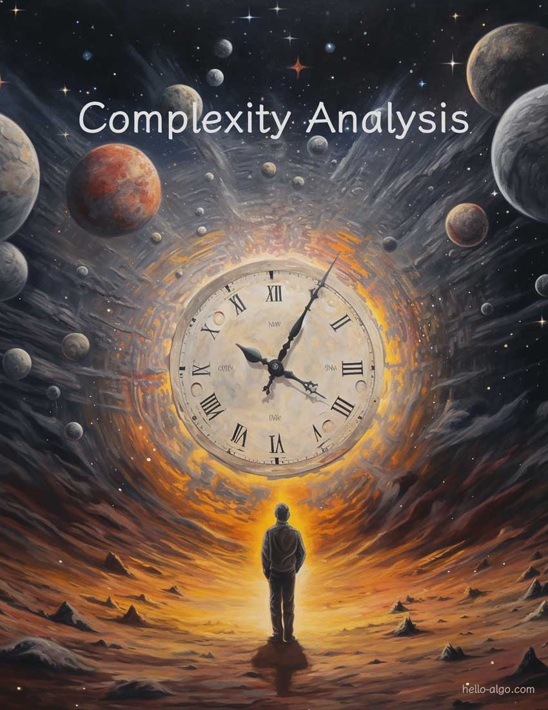

# 第 2 章 &nbsp; 複雑度解析

{ class="cover-image" }

!!! abstract

    複雑度解析は、アルゴリズムの広大な宇宙における時空のナビゲーターのようなものです。

    時間と空間の次元をより深く探求し、より優雅な解決策を求めるためのガイドとなります。

## 章の内容

- [2.1 &nbsp; アルゴリズム効率評価](performance_evaluation.md)
- [2.2 &nbsp; 反復と再帰](iteration_and_recursion.md)
- [2.3 &nbsp; 時間計算量](time_complexity.md)
- [2.4 &nbsp; 空間計算量](space_complexity.md)
- [2.5 &nbsp; まとめ](summary.md)
