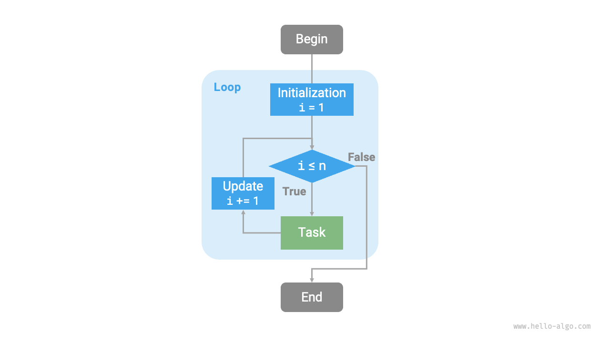
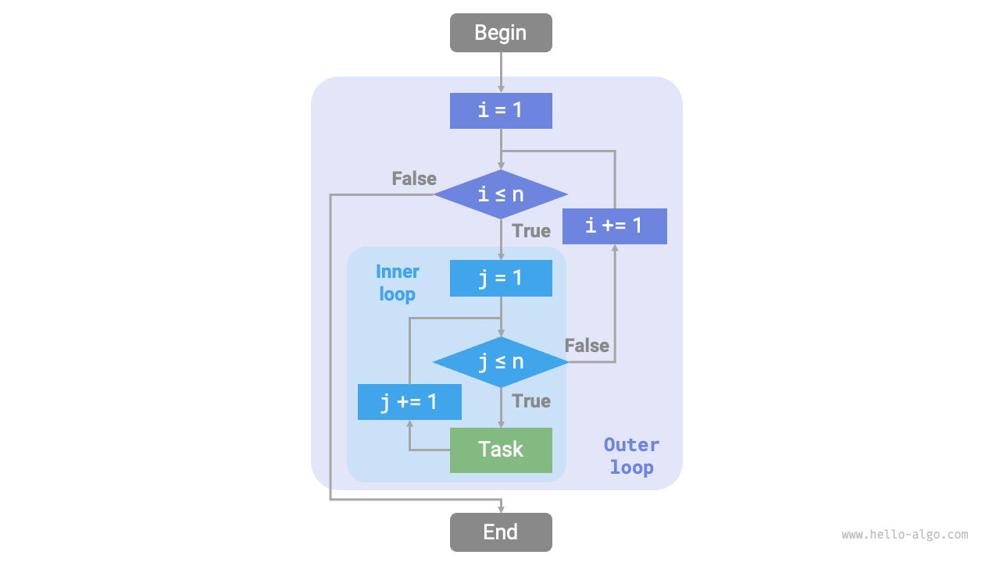
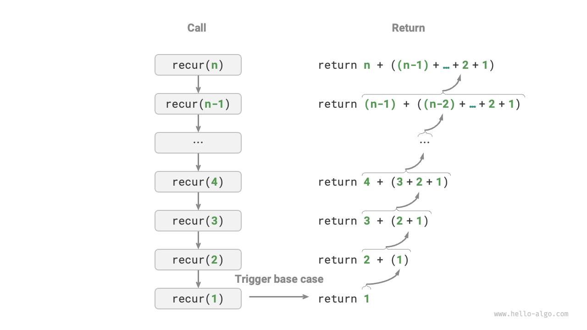
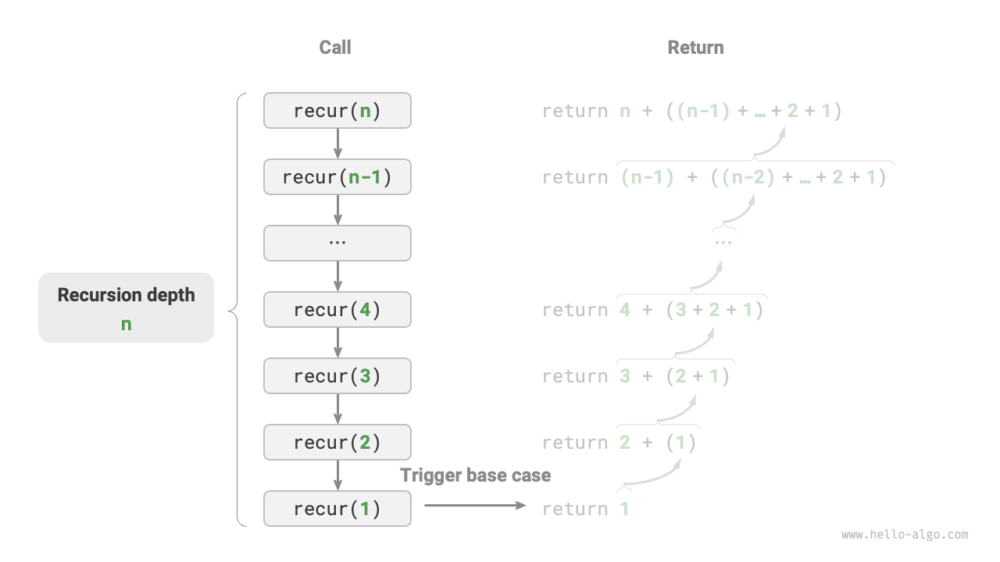
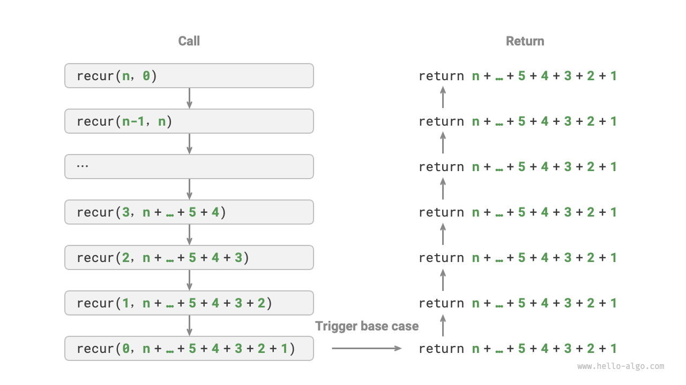
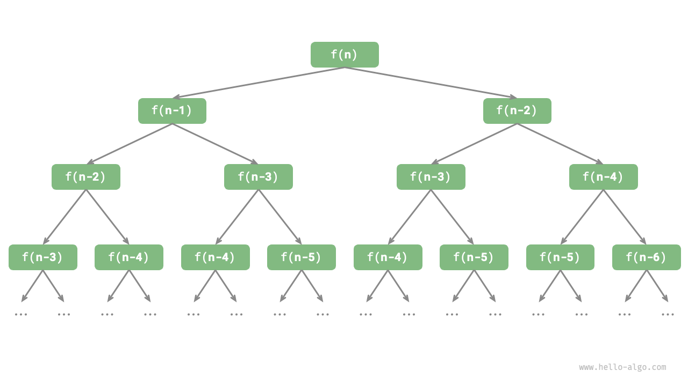

# 2.2 &nbsp; 反復と再帰

アルゴリズムでは、ある処理を繰り返し実行することがよくあり、これは複雑度解析と密接に関係しています。そのため、時間計算量と空間計算量を紹介する前に、まずプログラム内で反復実行を実現する方法、つまり 2 つの基本的な制御構造である反復と再帰について見ていきます。

## 2.2.1 &nbsp; 反復

<u>反復（iteration）</u>は、ある処理を繰り返し実行するための制御構造です。反復では、プログラムは一定の条件を満たす間、あるコード片を繰り返し実行し、その条件を満たさなくなるまで続けます。

### 1. &nbsp; for ループ

`for` ループは最も一般的な反復形式の 1 つで、**反復回数があらかじめ分かっている場合に適しています**。

次の関数は `for` ループを用いて $1 + 2 + \dots + n$ の総和を計算しており、その結果は変数 `res` に記録されます。なお、Python の `range(a, b)` に対応する区間は「左閉右開」であり、走査範囲は $a, a + 1, \dots, b-1$ です。

=== "Python"

    ```python title="iteration.py"
    def for_loop(n: int) -> int:
        """for ループ"""
        res = 0
        # 1, 2, ..., n-1, n を順に加算する
        for i in range(1, n + 1):
            res += i
        return res
    ```

=== "C++"

    ```cpp title="iteration.cpp"
    /* for ループ */
    int forLoop(int n) {
        int res = 0;
        // 1, 2, ..., n-1, n を順に加算する
        for (int i = 1; i <= n; ++i) {
            res += i;
        }
        return res;
    }
    ```

=== "Java"

    ```java title="iteration.java"
    /* for ループ */
    int forLoop(int n) {
        int res = 0;
        // 1, 2, ..., n-1, n を順に加算する
        for (int i = 1; i <= n; i++) {
            res += i;
        }
        return res;
    }
    ```

=== "C#"

    ```csharp title="iteration.cs"
    /* for ループ */
    int ForLoop(int n) {
        int res = 0;
        // 1, 2, ..., n-1, n を順に加算する
        for (int i = 1; i <= n; i++) {
            res += i;
        }
        return res;
    }
    ```

=== "Go"

    ```go title="iteration.go"
    /* for ループ */
    func forLoop(n int) int {
        res := 0
        // 1, 2, ..., n-1, n を順に加算する
        for i := 1; i <= n; i++ {
            res += i
        }
        return res
    }
    ```

=== "Swift"

    ```swift title="iteration.swift"
    /* for ループ */
    func forLoop(n: Int) -> Int {
        var res = 0
        // 1, 2, ..., n-1, n を順に加算する
        for i in 1 ... n {
            res += i
        }
        return res
    }
    ```

=== "JS"

    ```javascript title="iteration.js"
    /* for ループ */
    function forLoop(n) {
        let res = 0;
        // 1, 2, ..., n-1, n を順に加算する
        for (let i = 1; i <= n; i++) {
            res += i;
        }
        return res;
    }
    ```

=== "TS"

    ```typescript title="iteration.ts"
    /* for ループ */
    function forLoop(n: number): number {
        let res = 0;
        // 1, 2, ..., n-1, n を順に加算する
        for (let i = 1; i <= n; i++) {
            res += i;
        }
        return res;
    }
    ```

=== "Dart"

    ```dart title="iteration.dart"
    /* for ループ */
    int forLoop(int n) {
      int res = 0;
      // 1, 2, ..., n-1, n を順に加算する
      for (int i = 1; i <= n; i++) {
        res += i;
      }
      return res;
    }
    ```

=== "Rust"

    ```rust title="iteration.rs"
    /* for ループ */
    fn for_loop(n: i32) -> i32 {
        let mut res = 0;
        // 1, 2, ..., n-1, n を順に加算する
        for i in 1..=n {
            res += i;
        }
        res
    }
    ```

=== "C"

    ```c title="iteration.c"
    /* for ループ */
    int forLoop(int n) {
        int res = 0;
        // 1, 2, ..., n-1, n を順に加算する
        for (int i = 1; i <= n; i++) {
            res += i;
        }
        return res;
    }
    ```

=== "Kotlin"

    ```kotlin title="iteration.kt"
    /* for ループ */
    fun forLoop(n: Int): Int {
        var res = 0
        // 1, 2, ..., n-1, n を順に加算する
        for (i in 1..n) {
            res += i
        }
        return res
    }
    ```

=== "Ruby"

    ```ruby title="iteration.rb"
    ### for ループ ###
    def for_loop(n)
      res = 0

      # 1, 2, ..., n-1, n を順に加算する
      for i in 1..n
        res += i
      end

      res
    end
    ```

??? pythontutor "コードの可視化"

    <div style="height: 405px; width: 100%;"><iframe class="pythontutor-iframe" src="https://pythontutor.com/iframe-embed.html#code=def%20for_loop%28n%3A%20int%29%20-%3E%20int%3A%0A%20%20%20%20%22%22%22for%20%E3%83%AB%E3%83%BC%E3%83%97%22%22%22%0A%20%20%20%20res%20%3D%200%0A%20%20%20%20%23%201%2C%202%2C%20...%2C%20n-1%2C%20n%20%E3%82%92%E9%A0%86%E3%81%AB%E5%8A%A0%E7%AE%97%E3%81%99%E3%82%8B%0A%20%20%20%20for%20i%20in%20range%281%2C%20n%20%2B%201%29%3A%0A%20%20%20%20%20%20%20%20res%20%2B%3D%20i%0A%20%20%20%20return%20res%0A%0Aif%20__name__%20%3D%3D%20%22__main__%22%3A%0A%20%20%20%20n%20%3D%205%0A%20%20%20%20res%20%3D%20for_loop%28n%29%0A%20%20%20%20print%28f%22%5Cnfor%20%E3%83%AB%E3%83%BC%E3%83%97%E3%81%AE%E5%90%88%E8%A8%88%E7%B5%90%E6%9E%9C%20res%20%3D%20%7Bres%7D%22%29&codeDivHeight=472&codeDivWidth=350&cumulative=false&curInstr=3&heapPrimitives=nevernest&origin=opt-frontend.js&py=311&rawInputLstJSON=%5B%5D&"> </iframe></div>
    <div style="margin-top: 5px;"><a href="https://pythontutor.com/iframe-embed.html#code=def%20for_loop%28n%3A%20int%29%20-%3E%20int%3A%0A%20%20%20%20%22%22%22for%20%E3%83%AB%E3%83%BC%E3%83%97%22%22%22%0A%20%20%20%20res%20%3D%200%0A%20%20%20%20%23%201%2C%202%2C%20...%2C%20n-1%2C%20n%20%E3%82%92%E9%A0%86%E3%81%AB%E5%8A%A0%E7%AE%97%E3%81%99%E3%82%8B%0A%20%20%20%20for%20i%20in%20range%281%2C%20n%20%2B%201%29%3A%0A%20%20%20%20%20%20%20%20res%20%2B%3D%20i%0A%20%20%20%20return%20res%0A%0Aif%20__name__%20%3D%3D%20%22__main__%22%3A%0A%20%20%20%20n%20%3D%205%0A%20%20%20%20res%20%3D%20for_loop%28n%29%0A%20%20%20%20print%28f%22%5Cnfor%20%E3%83%AB%E3%83%BC%E3%83%97%E3%81%AE%E5%90%88%E8%A8%88%E7%B5%90%E6%9E%9C%20res%20%3D%20%7Bres%7D%22%29&codeDivHeight=800&codeDivWidth=600&cumulative=false&curInstr=3&heapPrimitives=nevernest&origin=opt-frontend.js&py=311&rawInputLstJSON=%5B%5D&" target="_blank" rel="noopener noreferrer">全画面で見る ></a></div>

次の図は、この総和関数のフローチャートです。

{ class="animation-figure" }

<p align="center"> 図 2-1 &nbsp; 総和関数のフローチャート </p>

この総和関数の操作回数は入力データサイズ $n$ に比例し、言い換えれば「線形関係」にあります。実際、**時間計算量が記述するのはこの「線形関係」そのものです**。関連内容は次節で詳しく説明します。

### 2. &nbsp; while ループ

`for` ループと同様に、`while` ループも反復を実現する方法の 1 つです。`while` ループでは、各反復のたびにまず条件を確認し、条件が真であれば実行を続け、そうでなければループを終了します。

次に、`while` ループを使って $1 + 2 + \dots + n$ の総和を求めてみましょう。

=== "Python"

    ```python title="iteration.py"
    def while_loop(n: int) -> int:
        """while ループ"""
        res = 0
        i = 1  # 条件変数を初期化する
        # 1, 2, ..., n-1, n を順に加算する
        while i <= n:
            res += i
            i += 1  # 条件変数を更新する
        return res
    ```

=== "C++"

    ```cpp title="iteration.cpp"
    /* while ループ */
    int whileLoop(int n) {
        int res = 0;
        int i = 1; // 条件変数を初期化する
        // 1, 2, ..., n-1, n を順に加算する
        while (i <= n) {
            res += i;
            i++; // 条件変数を更新する
        }
        return res;
    }
    ```

=== "Java"

    ```java title="iteration.java"
    /* while ループ */
    int whileLoop(int n) {
        int res = 0;
        int i = 1; // 条件変数を初期化する
        // 1, 2, ..., n-1, n を順に加算する
        while (i <= n) {
            res += i;
            i++; // 条件変数を更新する
        }
        return res;
    }
    ```

=== "C#"

    ```csharp title="iteration.cs"
    /* while ループ */
    int WhileLoop(int n) {
        int res = 0;
        int i = 1; // 条件変数を初期化する
        // 1, 2, ..., n-1, n を順に加算する
        while (i <= n) {
            res += i;
            i += 1; // 条件変数を更新する
        }
        return res;
    }
    ```

=== "Go"

    ```go title="iteration.go"
    /* while ループ */
    func whileLoop(n int) int {
        res := 0
        // 条件変数を初期化する
        i := 1
        // 1, 2, ..., n-1, n を順に加算する
        for i <= n {
            res += i
            // 条件変数を更新する
            i++
        }
        return res
    }
    ```

=== "Swift"

    ```swift title="iteration.swift"
    /* while ループ */
    func whileLoop(n: Int) -> Int {
        var res = 0
        var i = 1 // 条件変数を初期化する
        // 1, 2, ..., n-1, n を順に加算する
        while i <= n {
            res += i
            i += 1 // 条件変数を更新する
        }
        return res
    }
    ```

=== "JS"

    ```javascript title="iteration.js"
    /* while ループ */
    function whileLoop(n) {
        let res = 0;
        let i = 1; // 条件変数を初期化する
        // 1, 2, ..., n-1, n を順に加算する
        while (i <= n) {
            res += i;
            i++; // 条件変数を更新する
        }
        return res;
    }
    ```

=== "TS"

    ```typescript title="iteration.ts"
    /* while ループ */
    function whileLoop(n: number): number {
        let res = 0;
        let i = 1; // 条件変数を初期化する
        // 1, 2, ..., n-1, n を順に加算する
        while (i <= n) {
            res += i;
            i++; // 条件変数を更新する
        }
        return res;
    }
    ```

=== "Dart"

    ```dart title="iteration.dart"
    /* while ループ */
    int whileLoop(int n) {
      int res = 0;
      int i = 1; // 条件変数を初期化する
      // 1, 2, ..., n-1, n を順に加算する
      while (i <= n) {
        res += i;
        i++; // 条件変数を更新する
      }
      return res;
    }
    ```

=== "Rust"

    ```rust title="iteration.rs"
    /* while ループ */
    fn while_loop(n: i32) -> i32 {
        let mut res = 0;
        let mut i = 1; // 条件変数を初期化する

        // 1, 2, ..., n-1, n を順に加算する
        while i <= n {
            res += i;
            i += 1; // 条件変数を更新する
        }
        res
    }
    ```

=== "C"

    ```c title="iteration.c"
    /* while ループ */
    int whileLoop(int n) {
        int res = 0;
        int i = 1; // 条件変数を初期化する
        // 1, 2, ..., n-1, n を順に加算する
        while (i <= n) {
            res += i;
            i++; // 条件変数を更新する
        }
        return res;
    }
    ```

=== "Kotlin"

    ```kotlin title="iteration.kt"
    /* while ループ */
    fun whileLoop(n: Int): Int {
        var res = 0
        var i = 1 // 条件変数を初期化する
        // 1, 2, ..., n-1, n を順に加算する
        while (i <= n) {
            res += i
            i++ // 条件変数を更新する
        }
        return res
    }
    ```

=== "Ruby"

    ```ruby title="iteration.rb"
    ### while ループ ###
    def while_loop(n)
      res = 0
      i = 1 # 条件変数を初期化する

      # 1, 2, ..., n-1, n を順に加算する
      while i <= n
        res += i
        i += 1 # 条件変数を更新する
      end

      res
    end
    ```

??? pythontutor "コードの可視化"

    <div style="height: 441px; width: 100%;"><iframe class="pythontutor-iframe" src="https://pythontutor.com/iframe-embed.html#code=def%20while_loop%28n%3A%20int%29%20-%3E%20int%3A%0A%20%20%20%20%22%22%22while%20%E3%83%AB%E3%83%BC%E3%83%97%22%22%22%0A%20%20%20%20res%20%3D%200%0A%20%20%20%20i%20%3D%201%20%20%23%20%E6%9D%A1%E4%BB%B6%E5%A4%89%E6%95%B0%E3%82%92%E5%88%9D%E6%9C%9F%E5%8C%96%E3%81%99%E3%82%8B%0A%20%20%20%20%23%201%2C%202%2C%20...%2C%20n-1%2C%20n%20%E3%82%92%E9%A0%86%E3%81%AB%E5%8A%A0%E7%AE%97%E3%81%99%E3%82%8B%0A%20%20%20%20while%20i%20%3C%3D%20n%3A%0A%20%20%20%20%20%20%20%20res%20%2B%3D%20i%0A%20%20%20%20%20%20%20%20i%20%2B%3D%201%20%20%23%20%E6%9D%A1%E4%BB%B6%E5%A4%89%E6%95%B0%E3%82%92%E6%9B%B4%E6%96%B0%E3%81%99%E3%82%8B%0A%20%20%20%20return%20res%0A%0Aif%20__name__%20%3D%3D%20%22__main__%22%3A%0A%20%20%20%20n%20%3D%205%0A%20%20%20%20res%20%3D%20while_loop%28n%29%0A%20%20%20%20print%28f%22%5Cnwhile%20%E3%83%AB%E3%83%BC%E3%83%97%E3%81%AE%E5%90%88%E8%A8%88%E7%B5%90%E6%9E%9C%20res%20%3D%20%7Bres%7D%22%29&codeDivHeight=472&codeDivWidth=350&cumulative=false&curInstr=3&heapPrimitives=nevernest&origin=opt-frontend.js&py=311&rawInputLstJSON=%5B%5D&textReferences=false"> </iframe></div>
    <div style="margin-top: 5px;"><a href="https://pythontutor.com/iframe-embed.html#code=def%20while_loop%28n%3A%20int%29%20-%3E%20int%3A%0A%20%20%20%20%22%22%22while%20%E3%83%AB%E3%83%BC%E3%83%97%22%22%22%0A%20%20%20%20res%20%3D%200%0A%20%20%20%20i%20%3D%201%20%20%23%20%E6%9D%A1%E4%BB%B6%E5%A4%89%E6%95%B0%E3%82%92%E5%88%9D%E6%9C%9F%E5%8C%96%E3%81%99%E3%82%8B%0A%20%20%20%20%23%201%2C%202%2C%20...%2C%20n-1%2C%20n%20%E3%82%92%E9%A0%86%E3%81%AB%E5%8A%A0%E7%AE%97%E3%81%99%E3%82%8B%0A%20%20%20%20while%20i%20%3C%3D%20n%3A%0A%20%20%20%20%20%20%20%20res%20%2B%3D%20i%0A%20%20%20%20%20%20%20%20i%20%2B%3D%201%20%20%23%20%E6%9D%A1%E4%BB%B6%E5%A4%89%E6%95%B0%E3%82%92%E6%9B%B4%E6%96%B0%E3%81%99%E3%82%8B%0A%20%20%20%20return%20res%0A%0Aif%20__name__%20%3D%3D%20%22__main__%22%3A%0A%20%20%20%20n%20%3D%205%0A%20%20%20%20res%20%3D%20while_loop%28n%29%0A%20%20%20%20print%28f%22%5Cnwhile%20%E3%83%AB%E3%83%BC%E3%83%97%E3%81%AE%E5%90%88%E8%A8%88%E7%B5%90%E6%9E%9C%20res%20%3D%20%7Bres%7D%22%29&codeDivHeight=800&codeDivWidth=600&cumulative=false&curInstr=3&heapPrimitives=nevernest&origin=opt-frontend.js&py=311&rawInputLstJSON=%5B%5D&textReferences=false" target="_blank" rel="noopener noreferrer">全画面で見る ></a></div>

**`while` ループは `for` ループより自由度が高い**です。`while` ループでは、条件変数の初期化や更新手順を柔軟に設計できます。

たとえば次のコードでは、条件変数 $i$ が各反復で 2 回更新されており、このようなケースは `for` ループではあまり扱いやすくありません。

=== "Python"

    ```python title="iteration.py"
    def while_loop_ii(n: int) -> int:
        """while ループ（2回更新）"""
        res = 0
        i = 1  # 条件変数を初期化する
        # 1, 4, 10, ... を順に加算する
        while i <= n:
            res += i
            # 条件変数を更新する
            i += 1
            i *= 2
        return res
    ```

=== "C++"

    ```cpp title="iteration.cpp"
    /* while ループ（2回更新） */
    int whileLoopII(int n) {
        int res = 0;
        int i = 1; // 条件変数を初期化する
        // 1, 4, 10, ... を順に加算する
        while (i <= n) {
            res += i;
            // 条件変数を更新する
            i++;
            i *= 2;
        }
        return res;
    }
    ```

=== "Java"

    ```java title="iteration.java"
    /* while ループ（2回更新） */
    int whileLoopII(int n) {
        int res = 0;
        int i = 1; // 条件変数を初期化する
        // 1, 4, 10, ... を順に加算する
        while (i <= n) {
            res += i;
            // 条件変数を更新する
            i++;
            i *= 2;
        }
        return res;
    }
    ```

=== "C#"

    ```csharp title="iteration.cs"
    /* while ループ（2回更新） */
    int WhileLoopII(int n) {
        int res = 0;
        int i = 1; // 条件変数を初期化する
        // 1, 4, 10, ... を順に加算する
        while (i <= n) {
            res += i;
            // 条件変数を更新する
            i += 1; 
            i *= 2;
        }
        return res;
    }
    ```

=== "Go"

    ```go title="iteration.go"
    /* while ループ（2回更新） */
    func whileLoopII(n int) int {
        res := 0
        // 条件変数を初期化する
        i := 1
        // 1, 4, 10, ... を順に加算する
        for i <= n {
            res += i
            // 条件変数を更新する
            i++
            i *= 2
        }
        return res
    }
    ```

=== "Swift"

    ```swift title="iteration.swift"
    /* while ループ（2回更新） */
    func whileLoopII(n: Int) -> Int {
        var res = 0
        var i = 1 // 条件変数を初期化する
        // 1, 4, 10, ... を順に加算する
        while i <= n {
            res += i
            // 条件変数を更新する
            i += 1
            i *= 2
        }
        return res
    }
    ```

=== "JS"

    ```javascript title="iteration.js"
    /* while ループ（2回更新） */
    function whileLoopII(n) {
        let res = 0;
        let i = 1; // 条件変数を初期化する
        // 1, 4, 10, ... を順に加算する
        while (i <= n) {
            res += i;
            // 条件変数を更新する
            i++;
            i *= 2;
        }
        return res;
    }
    ```

=== "TS"

    ```typescript title="iteration.ts"
    /* while ループ（2回更新） */
    function whileLoopII(n: number): number {
        let res = 0;
        let i = 1; // 条件変数を初期化する
        // 1, 4, 10, ... を順に加算する
        while (i <= n) {
            res += i;
            // 条件変数を更新する
            i++;
            i *= 2;
        }
        return res;
    }
    ```

=== "Dart"

    ```dart title="iteration.dart"
    /* while ループ（2回更新） */
    int whileLoopII(int n) {
      int res = 0;
      int i = 1; // 条件変数を初期化する
      // 1, 4, 10, ... を順に加算する
      while (i <= n) {
        res += i;
        // 条件変数を更新する
        i++;
        i *= 2;
      }
      return res;
    }
    ```

=== "Rust"

    ```rust title="iteration.rs"
    /* while ループ（2回更新） */
    fn while_loop_ii(n: i32) -> i32 {
        let mut res = 0;
        let mut i = 1; // 条件変数を初期化する

        // 1, 4, 10, ... を順に加算する
        while i <= n {
            res += i;
            // 条件変数を更新する
            i += 1;
            i *= 2;
        }
        res
    }
    ```

=== "C"

    ```c title="iteration.c"
    /* while ループ（2回更新） */
    int whileLoopII(int n) {
        int res = 0;
        int i = 1; // 条件変数を初期化する
        // 1, 4, 10, ... を順に加算する
        while (i <= n) {
            res += i;
            // 条件変数を更新する
            i++;
            i *= 2;
        }
        return res;
    }
    ```

=== "Kotlin"

    ```kotlin title="iteration.kt"
    /* while ループ（2回更新） */
    fun whileLoopII(n: Int): Int {
        var res = 0
        var i = 1 // 条件変数を初期化する
        // 1, 4, 10, ... を順に加算する
        while (i <= n) {
            res += i
            // 条件変数を更新する
            i++
            i *= 2
        }
        return res
    }
    ```

=== "Ruby"

    ```ruby title="iteration.rb"
    ### while ループ ###
    def while_loop(n)
      res = 0
      i = 1 # 条件変数を初期化する

      # 1, 2, ..., n-1, n を順に加算する
      while i <= n
        res += i
        i += 1 # 条件変数を更新する
      end

      res
    end

    # ## while ループ（2 回更新）###
    def while_loop_ii(n)
      res = 0
      i = 1 # 条件変数を初期化する

      # 1, 4, 10, ... を順に加算する
      while i <= n
        res += i
        # 条件変数を更新する
        i += 1
        i *= 2
      end

      res
    end
    ```

??? pythontutor "コードの可視化"

    <div style="height: 477px; width: 100%;"><iframe class="pythontutor-iframe" src="https://pythontutor.com/iframe-embed.html#code=def%20while_loop_ii%28n%3A%20int%29%20-%3E%20int%3A%0A%20%20%20%20%22%22%22while%20%E3%83%AB%E3%83%BC%E3%83%97%EF%BC%882%E5%9B%9E%E6%9B%B4%E6%96%B0%EF%BC%89%22%22%22%0A%20%20%20%20res%20%3D%200%0A%20%20%20%20i%20%3D%201%20%20%23%20%E6%9D%A1%E4%BB%B6%E5%A4%89%E6%95%B0%E3%82%92%E5%88%9D%E6%9C%9F%E5%8C%96%E3%81%99%E3%82%8B%0A%20%20%20%20%23%201%2C%204%2C%2010%2C%20...%20%E3%82%92%E9%A0%86%E3%81%AB%E5%8A%A0%E7%AE%97%E3%81%99%E3%82%8B%0A%20%20%20%20while%20i%20%3C%3D%20n%3A%0A%20%20%20%20%20%20%20%20res%20%2B%3D%20i%0A%20%20%20%20%20%20%20%20%23%20%E6%9D%A1%E4%BB%B6%E5%A4%89%E6%95%B0%E3%82%92%E6%9B%B4%E6%96%B0%E3%81%99%E3%82%8B%0A%20%20%20%20%20%20%20%20i%20%2B%3D%201%0A%20%20%20%20%20%20%20%20i%20%2A%3D%202%0A%20%20%20%20return%20res%0A%0Aif%20__name__%20%3D%3D%20%22__main__%22%3A%0A%20%20%20%20n%20%3D%205%0A%20%20%20%20res%20%3D%20while_loop_ii%28n%29%0A%20%20%20%20print%28f%22%5Cnwhile%20%E3%83%AB%E3%83%BC%E3%83%97%EF%BC%882%20%E5%9B%9E%E6%9B%B4%E6%96%B0%EF%BC%89%E3%81%AE%E5%90%88%E8%A8%88%E7%B5%90%E6%9E%9C%20res%20%3D%20%7Bres%7D%22%29&codeDivHeight=472&codeDivWidth=350&cumulative=false&curInstr=3&heapPrimitives=nevernest&origin=opt-frontend.js&py=311&rawInputLstJSON=%5B%5D&textReferences=false"> </iframe></div>
    <div style="margin-top: 5px;"><a href="https://pythontutor.com/iframe-embed.html#code=def%20while_loop_ii%28n%3A%20int%29%20-%3E%20int%3A%0A%20%20%20%20%22%22%22while%20%E3%83%AB%E3%83%BC%E3%83%97%EF%BC%882%E5%9B%9E%E6%9B%B4%E6%96%B0%EF%BC%89%22%22%22%0A%20%20%20%20res%20%3D%200%0A%20%20%20%20i%20%3D%201%20%20%23%20%E6%9D%A1%E4%BB%B6%E5%A4%89%E6%95%B0%E3%82%92%E5%88%9D%E6%9C%9F%E5%8C%96%E3%81%99%E3%82%8B%0A%20%20%20%20%23%201%2C%204%2C%2010%2C%20...%20%E3%82%92%E9%A0%86%E3%81%AB%E5%8A%A0%E7%AE%97%E3%81%99%E3%82%8B%0A%20%20%20%20while%20i%20%3C%3D%20n%3A%0A%20%20%20%20%20%20%20%20res%20%2B%3D%20i%0A%20%20%20%20%20%20%20%20%23%20%E6%9D%A1%E4%BB%B6%E5%A4%89%E6%95%B0%E3%82%92%E6%9B%B4%E6%96%B0%E3%81%99%E3%82%8B%0A%20%20%20%20%20%20%20%20i%20%2B%3D%201%0A%20%20%20%20%20%20%20%20i%20%2A%3D%202%0A%20%20%20%20return%20res%0A%0Aif%20__name__%20%3D%3D%20%22__main__%22%3A%0A%20%20%20%20n%20%3D%205%0A%20%20%20%20res%20%3D%20while_loop_ii%28n%29%0A%20%20%20%20print%28f%22%5Cnwhile%20%E3%83%AB%E3%83%BC%E3%83%97%EF%BC%882%20%E5%9B%9E%E6%9B%B4%E6%96%B0%EF%BC%89%E3%81%AE%E5%90%88%E8%A8%88%E7%B5%90%E6%9E%9C%20res%20%3D%20%7Bres%7D%22%29&codeDivHeight=800&codeDivWidth=600&cumulative=false&curInstr=3&heapPrimitives=nevernest&origin=opt-frontend.js&py=311&rawInputLstJSON=%5B%5D&textReferences=false" target="_blank" rel="noopener noreferrer">全画面で見る ></a></div>

総じて、**`for` ループのコードはより簡潔で、`while` ループはより柔軟**です。どちらも反復構造を実現できますが、どちらを使うかは問題ごとの要件に応じて決めるべきです。

### 3. &nbsp; ネストしたループ

1 つのループ構造の中に別のループ構造を入れ子にできます。以下では `for` ループを例にします。

=== "Python"

    ```python title="iteration.py"
    def nested_for_loop(n: int) -> str:
        """二重 for ループ"""
        res = ""
        # i = 1, 2, ..., n-1, n とループする
        for i in range(1, n + 1):
            # j = 1, 2, ..., n-1, n とループする
            for j in range(1, n + 1):
                res += f"({i}, {j}), "
        return res
    ```

=== "C++"

    ```cpp title="iteration.cpp"
    /* 二重 for ループ */
    string nestedForLoop(int n) {
        ostringstream res;
        // i = 1, 2, ..., n-1, n とループする
        for (int i = 1; i <= n; ++i) {
            // j = 1, 2, ..., n-1, n とループする
            for (int j = 1; j <= n; ++j) {
                res << "(" << i << ", " << j << "), ";
            }
        }
        return res.str();
    }
    ```

=== "Java"

    ```java title="iteration.java"
    /* 二重 for ループ */
    String nestedForLoop(int n) {
        StringBuilder res = new StringBuilder();
        // i = 1, 2, ..., n-1, n とループする
        for (int i = 1; i <= n; i++) {
            // j = 1, 2, ..., n-1, n とループする
            for (int j = 1; j <= n; j++) {
                res.append("(" + i + ", " + j + "), ");
            }
        }
        return res.toString();
    }
    ```

=== "C#"

    ```csharp title="iteration.cs"
    /* 二重 for ループ */
    string NestedForLoop(int n) {
        StringBuilder res = new();
        // i = 1, 2, ..., n-1, n とループする
        for (int i = 1; i <= n; i++) {
            // j = 1, 2, ..., n-1, n とループする
            for (int j = 1; j <= n; j++) {
                res.Append($"({i}, {j}), ");
            }
        }
        return res.ToString();
    }
    ```

=== "Go"

    ```go title="iteration.go"
    /* 二重 for ループ */
    func nestedForLoop(n int) string {
        res := ""
        // i = 1, 2, ..., n-1, n とループする
        for i := 1; i <= n; i++ {
            for j := 1; j <= n; j++ {
                // j = 1, 2, ..., n-1, n とループする
                res += fmt.Sprintf("(%d, %d), ", i, j)
            }
        }
        return res
    }
    ```

=== "Swift"

    ```swift title="iteration.swift"
    /* 二重 for ループ */
    func nestedForLoop(n: Int) -> String {
        var res = ""
        // i = 1, 2, ..., n-1, n とループする
        for i in 1 ... n {
            // j = 1, 2, ..., n-1, n とループする
            for j in 1 ... n {
                res.append("(\(i), \(j)), ")
            }
        }
        return res
    }
    ```

=== "JS"

    ```javascript title="iteration.js"
    /* 二重 for ループ */
    function nestedForLoop(n) {
        let res = '';
        // i = 1, 2, ..., n-1, n とループする
        for (let i = 1; i <= n; i++) {
            // j = 1, 2, ..., n-1, n とループする
            for (let j = 1; j <= n; j++) {
                res += `(${i}, ${j}), `;
            }
        }
        return res;
    }
    ```

=== "TS"

    ```typescript title="iteration.ts"
    /* 二重 for ループ */
    function nestedForLoop(n: number): string {
        let res = '';
        // i = 1, 2, ..., n-1, n とループする
        for (let i = 1; i <= n; i++) {
            // j = 1, 2, ..., n-1, n とループする
            for (let j = 1; j <= n; j++) {
                res += `(${i}, ${j}), `;
            }
        }
        return res;
    }
    ```

=== "Dart"

    ```dart title="iteration.dart"
    /* 二重 for ループ */
    String nestedForLoop(int n) {
      String res = "";
      // i = 1, 2, ..., n-1, n とループする
      for (int i = 1; i <= n; i++) {
        // j = 1, 2, ..., n-1, n とループする
        for (int j = 1; j <= n; j++) {
          res += "($i, $j), ";
        }
      }
      return res;
    }
    ```

=== "Rust"

    ```rust title="iteration.rs"
    /* 二重 for ループ */
    fn nested_for_loop(n: i32) -> String {
        let mut res = vec![];
        // i = 1, 2, ..., n-1, n とループする
        for i in 1..=n {
            // j = 1, 2, ..., n-1, n とループする
            for j in 1..=n {
                res.push(format!("({}, {}), ", i, j));
            }
        }
        res.join("")
    }
    ```

=== "C"

    ```c title="iteration.c"
    /* 二重 for ループ */
    char *nestedForLoop(int n) {
        // n * n は対応する点の個数であり、"(i, j), " に対応する文字列長の最大は 6+10*2 で、さらに末尾の空文字 \0 のための追加領域が必要
        int size = n * n * 26 + 1;
        char *res = malloc(size * sizeof(char));
        // i = 1, 2, ..., n-1, n とループする
        for (int i = 1; i <= n; i++) {
            // j = 1, 2, ..., n-1, n とループする
            for (int j = 1; j <= n; j++) {
                char tmp[26];
                snprintf(tmp, sizeof(tmp), "(%d, %d), ", i, j);
                strncat(res, tmp, size - strlen(res) - 1);
            }
        }
        return res;
    }
    ```

=== "Kotlin"

    ```kotlin title="iteration.kt"
    /* 二重 for ループ */
    fun nestedForLoop(n: Int): String {
        val res = StringBuilder()
        // i = 1, 2, ..., n-1, n とループする
        for (i in 1..n) {
            // j = 1, 2, ..., n-1, n とループする
            for (j in 1..n) {
                res.append(" ($i, $j), ")
            }
        }
        return res.toString()
    }
    ```

=== "Ruby"

    ```ruby title="iteration.rb"
    ### 二重 for ループ ###
    def nested_for_loop(n)
      res = ""

      # i = 1, 2, ..., n-1, n とループする
      for i in 1..n
        # j = 1, 2, ..., n-1, n とループする
        for j in 1..n
          res += "(#{i}, #{j}), "
        end
      end

      res
    end
    ```

??? pythontutor "コードの可視化"

    <div style="height: 441px; width: 100%;"><iframe class="pythontutor-iframe" src="https://pythontutor.com/iframe-embed.html#code=def%20nested_for_loop%28n%3A%20int%29%20-%3E%20str%3A%0A%20%20%20%20%22%22%22%E4%BA%8C%E9%87%8D%20for%20%E3%83%AB%E3%83%BC%E3%83%97%22%22%22%0A%20%20%20%20res%20%3D%20%22%22%0A%20%20%20%20%23%20i%20%3D%201%2C%202%2C%20...%2C%20n-1%2C%20n%20%E3%81%A8%E3%83%AB%E3%83%BC%E3%83%97%E3%81%99%E3%82%8B%0A%20%20%20%20for%20i%20in%20range%281%2C%20n%20%2B%201%29%3A%0A%20%20%20%20%20%20%20%20%23%20j%20%3D%201%2C%202%2C%20...%2C%20n-1%2C%20n%20%E3%81%A8%E3%83%AB%E3%83%BC%E3%83%97%E3%81%99%E3%82%8B%0A%20%20%20%20%20%20%20%20for%20j%20in%20range%281%2C%20n%20%2B%201%29%3A%0A%20%20%20%20%20%20%20%20%20%20%20%20res%20%2B%3D%20f%22%28%7Bi%7D%2C%20%7Bj%7D%29%2C%20%22%0A%20%20%20%20return%20res%0A%0Aif%20__name__%20%3D%3D%20%22__main__%22%3A%0A%20%20%20%20n%20%3D%205%0A%20%20%20%20res%20%3D%20nested_for_loop%28n%29%0A%20%20%20%20print%28f%22%5Cn%E4%BA%8C%E9%87%8D%20for%20%E3%83%AB%E3%83%BC%E3%83%97%E3%81%AE%E8%B5%B0%E6%9F%BB%E7%B5%90%E6%9E%9C%20%7Bres%7D%22%29&codeDivHeight=472&codeDivWidth=350&cumulative=false&curInstr=3&heapPrimitives=nevernest&origin=opt-frontend.js&py=311&rawInputLstJSON=%5B%5D&textReferences=false"> </iframe></div>
    <div style="margin-top: 5px;"><a href="https://pythontutor.com/iframe-embed.html#code=def%20nested_for_loop%28n%3A%20int%29%20-%3E%20str%3A%0A%20%20%20%20%22%22%22%E4%BA%8C%E9%87%8D%20for%20%E3%83%AB%E3%83%BC%E3%83%97%22%22%22%0A%20%20%20%20res%20%3D%20%22%22%0A%20%20%20%20%23%20i%20%3D%201%2C%202%2C%20...%2C%20n-1%2C%20n%20%E3%81%A8%E3%83%AB%E3%83%BC%E3%83%97%E3%81%99%E3%82%8B%0A%20%20%20%20for%20i%20in%20range%281%2C%20n%20%2B%201%29%3A%0A%20%20%20%20%20%20%20%20%23%20j%20%3D%201%2C%202%2C%20...%2C%20n-1%2C%20n%20%E3%81%A8%E3%83%AB%E3%83%BC%E3%83%97%E3%81%99%E3%82%8B%0A%20%20%20%20%20%20%20%20for%20j%20in%20range%281%2C%20n%20%2B%201%29%3A%0A%20%20%20%20%20%20%20%20%20%20%20%20res%20%2B%3D%20f%22%28%7Bi%7D%2C%20%7Bj%7D%29%2C%20%22%0A%20%20%20%20return%20res%0A%0Aif%20__name__%20%3D%3D%20%22__main__%22%3A%0A%20%20%20%20n%20%3D%205%0A%20%20%20%20res%20%3D%20nested_for_loop%28n%29%0A%20%20%20%20print%28f%22%5Cn%E4%BA%8C%E9%87%8D%20for%20%E3%83%AB%E3%83%BC%E3%83%97%E3%81%AE%E8%B5%B0%E6%9F%BB%E7%B5%90%E6%9E%9C%20%7Bres%7D%22%29&codeDivHeight=800&codeDivWidth=600&cumulative=false&curInstr=3&heapPrimitives=nevernest&origin=opt-frontend.js&py=311&rawInputLstJSON=%5B%5D&textReferences=false" target="_blank" rel="noopener noreferrer">全画面で見る ></a></div>

次の図は、このネストしたループのフローチャートです。

{ class="animation-figure" }

<p align="center"> 図 2-2 &nbsp; ネストしたループのフローチャート </p>

この場合、関数の操作回数は $n^2$ に比例し、言い換えればアルゴリズムの実行時間は入力データサイズ $n$ と「二次関係」にあります。

さらにネストしたループを追加することもできます。ネストが 1 段増えるたびに「次元が 1 つ上がる」ことになり、時間計算量は「三次関係」「四次関係」へと高くなっていきます。

## 2.2.2 &nbsp; 再帰

 <u>再帰（recursion）</u>は、関数が自分自身を呼び出すことで問題を解決するアルゴリズム戦略です。主に 2 つの段階から成ります。

1. **再帰呼び出し**：プログラムは自分自身をより深く呼び出し続け、通常はより小さい、またはより単純化された引数を渡し、「終了条件」に達するまで進みます。
2. **復帰**： 「終了条件」が満たされると、プログラムは最も深い再帰関数から 1 層ずつ戻り、各層の結果をまとめていきます。

実装の観点から見ると、再帰コードは主に 3 つの要素から成ります。

1. **終了条件**：いつ再帰呼び出しから復帰へ切り替わるかを決めます。
2. **再帰呼び出し**：再帰呼び出しに対応し、関数が自分自身を呼び出します。通常はより小さい、またはより単純化された引数を入力します。
3. **結果の返却**：復帰に対応し、現在の再帰レベルの結果を 1 つ上の層へ返します。

次のコードを見ると、関数 `recur(n)` を呼び出すだけで $1 + 2 + \dots + n$ を計算できます。

=== "Python"

    ```python title="recursion.py"
    def recur(n: int) -> int:
        """再帰"""
        # 終了条件
        if n == 1:
            return 1
        # 再帰：再帰呼び出し
        res = recur(n - 1)
        # 帰りがけ：結果を返す
        return n + res
    ```

=== "C++"

    ```cpp title="recursion.cpp"
    /* 再帰 */
    int recur(int n) {
        // 終了条件
        if (n == 1)
            return 1;
        // 再帰：再帰呼び出し
        int res = recur(n - 1);
        // 帰りがけ：結果を返す
        return n + res;
    }
    ```

=== "Java"

    ```java title="recursion.java"
    /* 再帰 */
    int recur(int n) {
        // 終了条件
        if (n == 1)
            return 1;
        // 再帰：再帰呼び出し
        int res = recur(n - 1);
        // 帰りがけ：結果を返す
        return n + res;
    }
    ```

=== "C#"

    ```csharp title="recursion.cs"
    /* 再帰 */
    int Recur(int n) {
        // 終了条件
        if (n == 1)
            return 1;
        // 再帰：再帰呼び出し
        int res = Recur(n - 1);
        // 帰りがけ：結果を返す
        return n + res;
    }
    ```

=== "Go"

    ```go title="recursion.go"
    /* 再帰 */
    func recur(n int) int {
        // 終了条件
        if n == 1 {
            return 1
        }
        // 再帰：再帰呼び出し
        res := recur(n - 1)
        // 帰りがけ：結果を返す
        return n + res
    }
    ```

=== "Swift"

    ```swift title="recursion.swift"
    /* 再帰 */
    func recur(n: Int) -> Int {
        // 終了条件
        if n == 1 {
            return 1
        }
        // 再帰：再帰呼び出し
        let res = recur(n: n - 1)
        // 帰りがけ：結果を返す
        return n + res
    }
    ```

=== "JS"

    ```javascript title="recursion.js"
    /* 再帰 */
    function recur(n) {
        // 終了条件
        if (n === 1) return 1;
        // 再帰：再帰呼び出し
        const res = recur(n - 1);
        // 帰りがけ：結果を返す
        return n + res;
    }
    ```

=== "TS"

    ```typescript title="recursion.ts"
    /* 再帰 */
    function recur(n: number): number {
        // 終了条件
        if (n === 1) return 1;
        // 再帰：再帰呼び出し
        const res = recur(n - 1);
        // 帰りがけ：結果を返す
        return n + res;
    }
    ```

=== "Dart"

    ```dart title="recursion.dart"
    /* 再帰 */
    int recur(int n) {
      // 終了条件
      if (n == 1) return 1;
      // 再帰：再帰呼び出し
      int res = recur(n - 1);
      // 帰りがけ：結果を返す
      return n + res;
    }
    ```

=== "Rust"

    ```rust title="recursion.rs"
    /* 再帰 */
    fn recur(n: i32) -> i32 {
        // 終了条件
        if n == 1 {
            return 1;
        }
        // 再帰：再帰呼び出し
        let res = recur(n - 1);
        // 帰りがけ：結果を返す
        n + res
    }
    ```

=== "C"

    ```c title="recursion.c"
    /* 再帰 */
    int recur(int n) {
        // 終了条件
        if (n == 1)
            return 1;
        // 再帰：再帰呼び出し
        int res = recur(n - 1);
        // 帰りがけ：結果を返す
        return n + res;
    }
    ```

=== "Kotlin"

    ```kotlin title="recursion.kt"
    /* 再帰 */
    fun recur(n: Int): Int {
        // 終了条件
        if (n == 1)
            return 1
        // 再帰: 再帰呼び出し
        val res = recur(n - 1)
        // 戻る: 結果を返す
        return n + res
    }
    ```

=== "Ruby"

    ```ruby title="recursion.rb"
    ### 再帰 ###
    def recur(n)
      # 終了条件
      return 1 if n == 1
      # 再帰：再帰呼び出し
      res = recur(n - 1)
      # 帰りがけ：結果を返す
      n + res
    end
    ```

??? pythontutor "コードの可視化"

    <div style="height: 441px; width: 100%;"><iframe class="pythontutor-iframe" src="https://pythontutor.com/iframe-embed.html#code=def%20recur%28n%3A%20int%29%20-%3E%20int%3A%0A%20%20%20%20%22%22%22%E5%86%8D%E5%B8%B0%22%22%22%0A%20%20%20%20%23%20%E7%B5%82%E4%BA%86%E6%9D%A1%E4%BB%B6%0A%20%20%20%20if%20n%20%3D%3D%201%3A%0A%20%20%20%20%20%20%20%20return%201%0A%20%20%20%20%23%20%E5%86%8D%E5%B8%B0%EF%BC%9A%E5%86%8D%E5%B8%B0%E5%91%BC%E3%81%B3%E5%87%BA%E3%81%97%0A%20%20%20%20res%20%3D%20recur%28n%20-%201%29%0A%20%20%20%20%23%20%E5%B8%B0%E3%82%8A%E3%81%8C%E3%81%91%EF%BC%9A%E7%B5%90%E6%9E%9C%E3%82%92%E8%BF%94%E3%81%99%0A%20%20%20%20return%20n%20%2B%20res%0A%0Aif%20__name__%20%3D%3D%20%22__main__%22%3A%0A%20%20%20%20n%20%3D%205%0A%20%20%20%20res%20%3D%20recur%28n%29%0A%20%20%20%20print%28f%22%5Cn%E5%86%8D%E5%B8%B0%E9%96%A2%E6%95%B0%E3%81%AE%E5%90%88%E8%A8%88%E7%B5%90%E6%9E%9C%20res%20%3D%20%7Bres%7D%22%29&codeDivHeight=472&codeDivWidth=350&cumulative=false&curInstr=3&heapPrimitives=nevernest&origin=opt-frontend.js&py=311&rawInputLstJSON=%5B%5D&textReferences=false"> </iframe></div>
    <div style="margin-top: 5px;"><a href="https://pythontutor.com/iframe-embed.html#code=def%20recur%28n%3A%20int%29%20-%3E%20int%3A%0A%20%20%20%20%22%22%22%E5%86%8D%E5%B8%B0%22%22%22%0A%20%20%20%20%23%20%E7%B5%82%E4%BA%86%E6%9D%A1%E4%BB%B6%0A%20%20%20%20if%20n%20%3D%3D%201%3A%0A%20%20%20%20%20%20%20%20return%201%0A%20%20%20%20%23%20%E5%86%8D%E5%B8%B0%EF%BC%9A%E5%86%8D%E5%B8%B0%E5%91%BC%E3%81%B3%E5%87%BA%E3%81%97%0A%20%20%20%20res%20%3D%20recur%28n%20-%201%29%0A%20%20%20%20%23%20%E5%B8%B0%E3%82%8A%E3%81%8C%E3%81%91%EF%BC%9A%E7%B5%90%E6%9E%9C%E3%82%92%E8%BF%94%E3%81%99%0A%20%20%20%20return%20n%20%2B%20res%0A%0Aif%20__name__%20%3D%3D%20%22__main__%22%3A%0A%20%20%20%20n%20%3D%205%0A%20%20%20%20res%20%3D%20recur%28n%29%0A%20%20%20%20print%28f%22%5Cn%E5%86%8D%E5%B8%B0%E9%96%A2%E6%95%B0%E3%81%AE%E5%90%88%E8%A8%88%E7%B5%90%E6%9E%9C%20res%20%3D%20%7Bres%7D%22%29&codeDivHeight=800&codeDivWidth=600&cumulative=false&curInstr=3&heapPrimitives=nevernest&origin=opt-frontend.js&py=311&rawInputLstJSON=%5B%5D&textReferences=false" target="_blank" rel="noopener noreferrer">全画面で見る ></a></div>

次の図は、この関数の再帰過程を示しています。

{ class="animation-figure" }

<p align="center"> 図 2-3 &nbsp; 総和関数の再帰過程 </p>

計算の観点では、反復と再帰は同じ結果を得られますが、**それらは問題を考え解決するためのまったく異なる 2 つのパラダイムを表しています**。

- **反復**：「ボトムアップ」で問題を解決します。最も基本的な手順から始め、それらを繰り返したり積み上げたりして、処理が完了するまで進めます。
- **再帰**：「トップダウン」で問題を解決します。元の問題をより小さな部分問題に分解し、それらの部分問題は元の問題と同じ形を持ちます。さらに部分問題をより小さな部分問題へと分解し、基本ケースに達したところで停止します（基本ケースの解は既知です）。

前述の総和関数を例に、問題を $f(n) = 1 + 2 + \dots + n$ とします。

- **反復**：ループ内で総和の過程を模擬し、$1$ から $n$ まで走査して、各反復で加算を行えば $f(n)$ を求められます。
- **再帰**：問題を部分問題 $f(n) = n + f(n-1)$ に分解し、これを再帰的に分解し続け、基本ケース $f(1) = 1$ に達したところで終了します。

### 1. &nbsp; 呼び出しスタック

再帰関数が自分自身を呼び出すたびに、システムは新たに開始された関数のためにメモリを割り当て、局所変数、呼び出し先アドレス、その他の情報を保存します。これにより 2 つの結果が生じます。

- 関数のコンテキストデータは「スタックフレーム領域」と呼ばれるメモリ領域に保存され、関数が戻るまで解放されません。したがって、**再帰は通常、反復より多くのメモリ空間を消費します**。
- 再帰による関数呼び出しには追加のオーバーヘッドが発生します。**そのため再帰は通常、ループより時間効率が低くなります**。

次の図のように、終了条件が発動する前には、まだ戻っていない再帰関数が同時に $n$ 個存在し、**再帰の深さは $n$** になります。

{ class="animation-figure" }

<p align="center"> 図 2-4 &nbsp; 再帰呼び出しの深さ </p>

実際には、プログラミング言語が許容する再帰の深さには通常上限があり、深すぎる再帰はスタックオーバーフローを引き起こす可能性があります。

### 2. &nbsp; 末尾再帰

興味深いことに、**関数が返る直前の最後の処理で再帰呼び出しを行う場合**、その関数はコンパイラやインタプリタによって最適化され、空間効率が反復と同程度になることがあります。これを<u>末尾再帰（tail recursion）</u>と呼びます。

- **通常の再帰**：関数が 1 つ上の階層の関数へ戻った後も、引き続きコードを実行する必要があるため、システムは 1 つ上の呼び出しのコンテキストを保存しておく必要があります。
- **末尾再帰**：再帰呼び出しが関数の返却前の最後の操作であるため、1 つ上の階層へ戻った後に他の処理を続ける必要がなく、システムは 1 つ上の関数のコンテキストを保存する必要がありません。

$1 + 2 + \dots + n$ の計算を例にすると、結果変数 `res` を関数の引数にすることで、末尾再帰を実現できます。

=== "Python"

    ```python title="recursion.py"
    def tail_recur(n, res):
        """末尾再帰"""
        # 終了条件
        if n == 0:
            return res
        # 末尾再帰呼び出し
        return tail_recur(n - 1, res + n)
    ```

=== "C++"

    ```cpp title="recursion.cpp"
    /* 末尾再帰 */
    int tailRecur(int n, int res) {
        // 終了条件
        if (n == 0)
            return res;
        // 末尾再帰呼び出し
        return tailRecur(n - 1, res + n);
    }
    ```

=== "Java"

    ```java title="recursion.java"
    /* 末尾再帰 */
    int tailRecur(int n, int res) {
        // 終了条件
        if (n == 0)
            return res;
        // 末尾再帰呼び出し
        return tailRecur(n - 1, res + n);
    }
    ```

=== "C#"

    ```csharp title="recursion.cs"
    /* 末尾再帰 */
    int TailRecur(int n, int res) {
        // 終了条件
        if (n == 0)
            return res;
        // 末尾再帰呼び出し
        return TailRecur(n - 1, res + n);
    }
    ```

=== "Go"

    ```go title="recursion.go"
    /* 末尾再帰 */
    func tailRecur(n int, res int) int {
        // 終了条件
        if n == 0 {
            return res
        }
        // 末尾再帰呼び出し
        return tailRecur(n-1, res+n)
    }
    ```

=== "Swift"

    ```swift title="recursion.swift"
    /* 末尾再帰 */
    func tailRecur(n: Int, res: Int) -> Int {
        // 終了条件
        if n == 0 {
            return res
        }
        // 末尾再帰呼び出し
        return tailRecur(n: n - 1, res: res + n)
    }
    ```

=== "JS"

    ```javascript title="recursion.js"
    /* 末尾再帰 */
    function tailRecur(n, res) {
        // 終了条件
        if (n === 0) return res;
        // 末尾再帰呼び出し
        return tailRecur(n - 1, res + n);
    }
    ```

=== "TS"

    ```typescript title="recursion.ts"
    /* 末尾再帰 */
    function tailRecur(n: number, res: number): number {
        // 終了条件
        if (n === 0) return res;
        // 末尾再帰呼び出し
        return tailRecur(n - 1, res + n);
    }
    ```

=== "Dart"

    ```dart title="recursion.dart"
    /* 末尾再帰 */
    int tailRecur(int n, int res) {
      // 終了条件
      if (n == 0) return res;
      // 末尾再帰呼び出し
      return tailRecur(n - 1, res + n);
    }
    ```

=== "Rust"

    ```rust title="recursion.rs"
    /* 末尾再帰 */
    fn tail_recur(n: i32, res: i32) -> i32 {
        // 終了条件
        if n == 0 {
            return res;
        }
        // 末尾再帰呼び出し
        tail_recur(n - 1, res + n)
    }
    ```

=== "C"

    ```c title="recursion.c"
    /* 末尾再帰 */
    int tailRecur(int n, int res) {
        // 終了条件
        if (n == 0)
            return res;
        // 末尾再帰呼び出し
        return tailRecur(n - 1, res + n);
    }
    ```

=== "Kotlin"

    ```kotlin title="recursion.kt"
    /* 末尾再帰 */
    tailrec fun tailRecur(n: Int, res: Int): Int {
        // `tailrec` キーワードを追加して末尾再帰最適化を有効にする
        // 終了条件
        if (n == 0)
            return res
        // 末尾再帰呼び出し
        return tailRecur(n - 1, res + n)
    }
    ```

=== "Ruby"

    ```ruby title="recursion.rb"
    ### 末尾再帰 ###
    def tail_recur(n, res)
      # 終了条件
      return res if n == 0
      # 末尾再帰呼び出し
      tail_recur(n - 1, res + n)
    end
    ```

??? pythontutor "コードの可視化"

    <div style="height: 405px; width: 100%;"><iframe class="pythontutor-iframe" src="https://pythontutor.com/iframe-embed.html#code=def%20tail_recur%28n%2C%20res%29%3A%0A%20%20%20%20%22%22%22%E6%9C%AB%E5%B0%BE%E5%86%8D%E5%B8%B0%22%22%22%0A%20%20%20%20%23%20%E7%B5%82%E4%BA%86%E6%9D%A1%E4%BB%B6%0A%20%20%20%20if%20n%20%3D%3D%200%3A%0A%20%20%20%20%20%20%20%20return%20res%0A%20%20%20%20%23%20%E6%9C%AB%E5%B0%BE%E5%86%8D%E5%B8%B0%E5%91%BC%E3%81%B3%E5%87%BA%E3%81%97%0A%20%20%20%20return%20tail_recur%28n%20-%201%2C%20res%20%2B%20n%29%0A%0Aif%20__name__%20%3D%3D%20%22__main__%22%3A%0A%20%20%20%20n%20%3D%205%0A%20%20%20%20res%20%3D%20tail_recur%28n%2C%200%29%0A%20%20%20%20print%28f%22%5Cn%E6%9C%AB%E5%B0%BE%E5%86%8D%E5%B8%B0%E9%96%A2%E6%95%B0%E3%81%AE%E5%90%88%E8%A8%88%E7%B5%90%E6%9E%9C%20res%20%3D%20%7Bres%7D%22%29&codeDivHeight=472&codeDivWidth=350&cumulative=false&curInstr=3&heapPrimitives=nevernest&origin=opt-frontend.js&py=311&rawInputLstJSON=%5B%5D&textReferences=false"> </iframe></div>
    <div style="margin-top: 5px;"><a href="https://pythontutor.com/iframe-embed.html#code=def%20tail_recur%28n%2C%20res%29%3A%0A%20%20%20%20%22%22%22%E6%9C%AB%E5%B0%BE%E5%86%8D%E5%B8%B0%22%22%22%0A%20%20%20%20%23%20%E7%B5%82%E4%BA%86%E6%9D%A1%E4%BB%B6%0A%20%20%20%20if%20n%20%3D%3D%200%3A%0A%20%20%20%20%20%20%20%20return%20res%0A%20%20%20%20%23%20%E6%9C%AB%E5%B0%BE%E5%86%8D%E5%B8%B0%E5%91%BC%E3%81%B3%E5%87%BA%E3%81%97%0A%20%20%20%20return%20tail_recur%28n%20-%201%2C%20res%20%2B%20n%29%0A%0Aif%20__name__%20%3D%3D%20%22__main__%22%3A%0A%20%20%20%20n%20%3D%205%0A%20%20%20%20res%20%3D%20tail_recur%28n%2C%200%29%0A%20%20%20%20print%28f%22%5Cn%E6%9C%AB%E5%B0%BE%E5%86%8D%E5%B8%B0%E9%96%A2%E6%95%B0%E3%81%AE%E5%90%88%E8%A8%88%E7%B5%90%E6%9E%9C%20res%20%3D%20%7Bres%7D%22%29&codeDivHeight=800&codeDivWidth=600&cumulative=false&curInstr=3&heapPrimitives=nevernest&origin=opt-frontend.js&py=311&rawInputLstJSON=%5B%5D&textReferences=false" target="_blank" rel="noopener noreferrer">全画面で見る ></a></div>

末尾再帰の実行過程を次の図に示します。通常の再帰と末尾再帰を比べると、加算処理が実行されるタイミングが異なります。

- **通常の再帰**：加算処理は復帰の過程で実行され、各層が戻るたびにもう一度加算を行います。
- **末尾再帰**：加算処理は再帰呼び出しの過程で実行され、復帰の過程では各層が戻るだけで済みます。

{ class="animation-figure" }

<p align="center"> 図 2-5 &nbsp; 末尾再帰の過程 </p>

!!! tip

    多くのコンパイラやインタプリタは末尾再帰最適化をサポートしていない点に注意してください。たとえば、Python はデフォルトで末尾再帰最適化をサポートしていないため、関数が末尾再帰の形であっても、スタックオーバーフローが発生する可能性があります。

### 3. &nbsp; 再帰木

「分割統治」に関連するアルゴリズム問題を扱う際、再帰は反復よりも発想が直感的で、コードも読みやすいことがよくあります。「フィボナッチ数列」を例に見てみましょう。

!!! question

    フィボナッチ数列 $0, 1, 1, 2, 3, 5, 8, 13, \dots$ が与えられたとき、この数列の第 $n$ 項を求めてください。

フィボナッチ数列の第 $n$ 項を $f(n)$ とすると、次の 2 つが容易に分かります。

- 数列の最初の 2 項は $f(1) = 0$ と $f(2) = 1$ です。
- 数列中の各項は直前の 2 項の和であり、すなわち $f(n) = f(n - 1) + f(n - 2)$ です。

漸化式に従って再帰呼び出しを行い、最初の 2 項を終了条件とすれば、再帰コードを書けます。`fib(n)` を呼び出すことでフィボナッチ数列の第 $n$ 項を得られます。

=== "Python"

    ```python title="recursion.py"
    def fib(n: int) -> int:
        """フィボナッチ数列：再帰"""
        # 終了条件 f(1) = 0, f(2) = 1
        if n == 1 or n == 2:
            return n - 1
        # f(n) = f(n-1) + f(n-2) を再帰的に呼び出す
        res = fib(n - 1) + fib(n - 2)
        # 結果 f(n) を返す
        return res
    ```

=== "C++"

    ```cpp title="recursion.cpp"
    /* フィボナッチ数列：再帰 */
    int fib(int n) {
        // 終了条件 f(1) = 0, f(2) = 1
        if (n == 1 || n == 2)
            return n - 1;
        // f(n) = f(n-1) + f(n-2) を再帰的に呼び出す
        int res = fib(n - 1) + fib(n - 2);
        // 結果 f(n) を返す
        return res;
    }
    ```

=== "Java"

    ```java title="recursion.java"
    /* フィボナッチ数列：再帰 */
    int fib(int n) {
        // 終了条件 f(1) = 0, f(2) = 1
        if (n == 1 || n == 2)
            return n - 1;
        // f(n) = f(n-1) + f(n-2) を再帰的に呼び出す
        int res = fib(n - 1) + fib(n - 2);
        // 結果 f(n) を返す
        return res;
    }
    ```

=== "C#"

    ```csharp title="recursion.cs"
    /* フィボナッチ数列：再帰 */
    int Fib(int n) {
        // 終了条件 f(1) = 0, f(2) = 1
        if (n == 1 || n == 2)
            return n - 1;
        // f(n) = f(n-1) + f(n-2) を再帰的に呼び出す
        int res = Fib(n - 1) + Fib(n - 2);
        // 結果 f(n) を返す
        return res;
    }
    ```

=== "Go"

    ```go title="recursion.go"
    /* フィボナッチ数列：再帰 */
    func fib(n int) int {
        // 終了条件 f(1) = 0, f(2) = 1
        if n == 1 || n == 2 {
            return n - 1
        }
        // f(n) = f(n-1) + f(n-2) を再帰的に呼び出す
        res := fib(n-1) + fib(n-2)
        // 結果 f(n) を返す
        return res
    }
    ```

=== "Swift"

    ```swift title="recursion.swift"
    /* フィボナッチ数列：再帰 */
    func fib(n: Int) -> Int {
        // 終了条件 f(1) = 0, f(2) = 1
        if n == 1 || n == 2 {
            return n - 1
        }
        // f(n) = f(n-1) + f(n-2) を再帰的に呼び出す
        let res = fib(n: n - 1) + fib(n: n - 2)
        // 結果 f(n) を返す
        return res
    }
    ```

=== "JS"

    ```javascript title="recursion.js"
    /* フィボナッチ数列：再帰 */
    function fib(n) {
        // 終了条件 f(1) = 0, f(2) = 1
        if (n === 1 || n === 2) return n - 1;
        // f(n) = f(n-1) + f(n-2) を再帰的に呼び出す
        const res = fib(n - 1) + fib(n - 2);
        // 結果 f(n) を返す
        return res;
    }
    ```

=== "TS"

    ```typescript title="recursion.ts"
    /* フィボナッチ数列：再帰 */
    function fib(n: number): number {
        // 終了条件 f(1) = 0, f(2) = 1
        if (n === 1 || n === 2) return n - 1;
        // f(n) = f(n-1) + f(n-2) を再帰的に呼び出す
        const res = fib(n - 1) + fib(n - 2);
        // 結果 f(n) を返す
        return res;
    }
    ```

=== "Dart"

    ```dart title="recursion.dart"
    /* フィボナッチ数列：再帰 */
    int fib(int n) {
      // 終了条件 f(1) = 0, f(2) = 1
      if (n == 1 || n == 2) return n - 1;
      // f(n) = f(n-1) + f(n-2) を再帰的に呼び出す
      int res = fib(n - 1) + fib(n - 2);
      // 結果 f(n) を返す
      return res;
    }
    ```

=== "Rust"

    ```rust title="recursion.rs"
    /* フィボナッチ数列：再帰 */
    fn fib(n: i32) -> i32 {
        // 終了条件 f(1) = 0, f(2) = 1
        if n == 1 || n == 2 {
            return n - 1;
        }
        // f(n) = f(n-1) + f(n-2) を再帰的に呼び出す
        let res = fib(n - 1) + fib(n - 2);
        // 結果を返す
        res
    }
    ```

=== "C"

    ```c title="recursion.c"
    /* フィボナッチ数列：再帰 */
    int fib(int n) {
        // 終了条件 f(1) = 0, f(2) = 1
        if (n == 1 || n == 2)
            return n - 1;
        // f(n) = f(n-1) + f(n-2) を再帰的に呼び出す
        int res = fib(n - 1) + fib(n - 2);
        // 結果 f(n) を返す
        return res;
    }
    ```

=== "Kotlin"

    ```kotlin title="recursion.kt"
    /* フィボナッチ数列：再帰 */
    fun fib(n: Int): Int {
        // 終了条件 f(1) = 0, f(2) = 1
        if (n == 1 || n == 2)
            return n - 1
        // f(n) = f(n-1) + f(n-2) を再帰的に呼び出す
        val res = fib(n - 1) + fib(n - 2)
        // 結果 f(n) を返す
        return res
    }
    ```

=== "Ruby"

    ```ruby title="recursion.rb"
    ### フィボナッチ数列：再帰 ###
    def fib(n)
      # 終了条件 f(1) = 0, f(2) = 1
      return n - 1 if n == 1 || n == 2
      # f(n) = f(n-1) + f(n-2) を再帰的に呼び出す
      res = fib(n - 1) + fib(n - 2)
      # 結果 f(n) を返す
      res
    end
    ```

??? pythontutor "コードの可視化"

    <div style="height: 441px; width: 100%;"><iframe class="pythontutor-iframe" src="https://pythontutor.com/iframe-embed.html#code=def%20fib%28n%3A%20int%29%20-%3E%20int%3A%0A%20%20%20%20%22%22%22%E3%83%95%E3%82%A3%E3%83%9C%E3%83%8A%E3%83%83%E3%83%81%E6%95%B0%E5%88%97%EF%BC%9A%E5%86%8D%E5%B8%B0%22%22%22%0A%20%20%20%20%23%20%E7%B5%82%E4%BA%86%E6%9D%A1%E4%BB%B6%20f%281%29%20%3D%200%2C%20f%282%29%20%3D%201%0A%20%20%20%20if%20n%20%3D%3D%201%20or%20n%20%3D%3D%202%3A%0A%20%20%20%20%20%20%20%20return%20n%20-%201%0A%20%20%20%20%23%20f%28n%29%20%3D%20f%28n-1%29%20%2B%20f%28n-2%29%20%E3%82%92%E5%86%8D%E5%B8%B0%E7%9A%84%E3%81%AB%E5%91%BC%E3%81%B3%E5%87%BA%E3%81%99%0A%20%20%20%20res%20%3D%20fib%28n%20-%201%29%20%2B%20fib%28n%20-%202%29%0A%20%20%20%20%23%20%E7%B5%90%E6%9E%9C%20f%28n%29%20%E3%82%92%E8%BF%94%E3%81%99%0A%20%20%20%20return%20res%0A%0Aif%20__name__%20%3D%3D%20%22__main__%22%3A%0A%20%20%20%20n%20%3D%205%0A%20%20%20%20res%20%3D%20fib%28n%29%0A%20%20%20%20print%28f%22%5Cn%E3%83%95%E3%82%A3%E3%83%9C%E3%83%8A%E3%83%83%E3%83%81%E6%95%B0%E5%88%97%E3%81%AE%E7%AC%AC%20%7Bn%7D%20%E9%A0%85%E3%81%AF%20%7Bres%7D%22%29&codeDivHeight=472&codeDivWidth=350&cumulative=false&curInstr=3&heapPrimitives=nevernest&origin=opt-frontend.js&py=311&rawInputLstJSON=%5B%5D&textReferences=false"> </iframe></div>
    <div style="margin-top: 5px;"><a href="https://pythontutor.com/iframe-embed.html#code=def%20fib%28n%3A%20int%29%20-%3E%20int%3A%0A%20%20%20%20%22%22%22%E3%83%95%E3%82%A3%E3%83%9C%E3%83%8A%E3%83%83%E3%83%81%E6%95%B0%E5%88%97%EF%BC%9A%E5%86%8D%E5%B8%B0%22%22%22%0A%20%20%20%20%23%20%E7%B5%82%E4%BA%86%E6%9D%A1%E4%BB%B6%20f%281%29%20%3D%200%2C%20f%282%29%20%3D%201%0A%20%20%20%20if%20n%20%3D%3D%201%20or%20n%20%3D%3D%202%3A%0A%20%20%20%20%20%20%20%20return%20n%20-%201%0A%20%20%20%20%23%20f%28n%29%20%3D%20f%28n-1%29%20%2B%20f%28n-2%29%20%E3%82%92%E5%86%8D%E5%B8%B0%E7%9A%84%E3%81%AB%E5%91%BC%E3%81%B3%E5%87%BA%E3%81%99%0A%20%20%20%20res%20%3D%20fib%28n%20-%201%29%20%2B%20fib%28n%20-%202%29%0A%20%20%20%20%23%20%E7%B5%90%E6%9E%9C%20f%28n%29%20%E3%82%92%E8%BF%94%E3%81%99%0A%20%20%20%20return%20res%0A%0Aif%20__name__%20%3D%3D%20%22__main__%22%3A%0A%20%20%20%20n%20%3D%205%0A%20%20%20%20res%20%3D%20fib%28n%29%0A%20%20%20%20print%28f%22%5Cn%E3%83%95%E3%82%A3%E3%83%9C%E3%83%8A%E3%83%83%E3%83%81%E6%95%B0%E5%88%97%E3%81%AE%E7%AC%AC%20%7Bn%7D%20%E9%A0%85%E3%81%AF%20%7Bres%7D%22%29&codeDivHeight=800&codeDivWidth=600&cumulative=false&curInstr=3&heapPrimitives=nevernest&origin=opt-frontend.js&py=311&rawInputLstJSON=%5B%5D&textReferences=false" target="_blank" rel="noopener noreferrer">全画面で見る ></a></div>

上のコードを見ると、関数内で 2 回の再帰呼び出しを行っています。**これは 1 回の呼び出しから 2 つの呼び出し分岐が生じることを意味します**。次の図のように、この再帰呼び出しを繰り返していくと、最終的に深さ $n$ の<u>再帰木（recursion tree）</u>が生成されます。

{ class="animation-figure" }

<p align="center"> 図 2-6 &nbsp; フィボナッチ数列の再帰木 </p>

本質的に見ると、再帰は「問題をより小さな部分問題へ分解する」という思考パラダイムを体現しており、この分割統治の戦略は非常に重要です。

- アルゴリズムの観点では、探索、ソート、バックトラッキング、分割統治、動的計画法など、多くの重要な戦略が直接または間接にこの考え方を用いています。
- データ構造の観点では、再帰は連結リスト、木、グラフに関する問題の処理に本質的に適しており、これらは分割統治の考え方で分析しやすいからです。

## 2.2.3 &nbsp; 両者の比較

以上をまとめると、次の表のように、反復と再帰は実装、性能、適用性の面で違いがあります。

<p align="center"> 表 2-1 &nbsp; 反復と再帰の特徴の比較 </p>

<div class="center-table" markdown>

|          | 反復                                   | 再帰                                                         |
| -------- | -------------------------------------- | ------------------------------------------------------------ |
| 実装方法 | ループ構造                             | 関数が自分自身を呼び出す                                     |
| 時間効率 | 通常は効率が高く、関数呼び出しの負荷がない | 関数呼び出しのたびにオーバーヘッドが発生する                 |
| メモリ使用 | 通常は固定サイズのメモリ空間を使う       | 関数呼び出しの蓄積により大量のスタックフレーム領域を使う可能性がある |
| 適用対象 | 単純な反復処理に適し、コードが直感的で読みやすい | 木、グラフ、分割統治、バックトラッキングなどの部分問題分解に適し、コード構造が簡潔で明快 |

</div>

!!! tip

    以下の内容が難しいと感じる場合は、「スタック」の章を読み終えた後に改めて復習してください。

では、反復と再帰にはどのような内在的な関係があるのでしょうか。前述の再帰関数を例にすると、加算処理は再帰の復帰段階で行われます。これは、最初に呼び出された関数が実際には最後に加算を完了することを意味しており、**この動作の仕組みはスタックの「後入れ先出し」の原則とよく似ています**。

実際、「呼び出しスタック」や「スタックフレーム領域」といった再帰の用語自体が、再帰とスタックの密接な関係を示唆しています。

1. **再帰呼び出し**：関数が呼び出されると、システムは「呼び出しスタック」上にその関数のための新しいスタックフレームを割り当て、局所変数、引数、返却先アドレスなどのデータを保存します。
2. **復帰**：関数の実行が完了して戻ると、対応するスタックフレームは「呼び出しスタック」から取り除かれ、前の関数の実行環境が復元されます。

したがって、**明示的なスタックを使って呼び出しスタックの振る舞いを模擬することができ**、その結果として再帰を反復形式へ変換できます。

=== "Python"

    ```python title="recursion.py"
    def for_loop_recur(n: int) -> int:
        """反復で再帰を模擬する"""
        # 明示的なスタックを使ってシステムコールスタックを模擬する
        stack = []
        res = 0
        # 再帰：再帰呼び出し
        for i in range(n, 0, -1):
            # 「スタックへのプッシュ」で「再帰」を模擬する
            stack.append(i)
        # 帰りがけ：結果を返す
        while stack:
            # 「スタックから取り出す操作」で「帰り」をシミュレート
            res += stack.pop()
        # res = 1+2+3+...+n
        return res
    ```

=== "C++"

    ```cpp title="recursion.cpp"
    /* 反復で再帰を模擬する */
    int forLoopRecur(int n) {
        // 明示的なスタックを使ってシステムコールスタックを模擬する
        stack<int> stack;
        int res = 0;
        // 再帰：再帰呼び出し
        for (int i = n; i > 0; i--) {
            // 「スタックへのプッシュ」で「再帰」を模擬する
            stack.push(i);
        }
        // 帰りがけ：結果を返す
        while (!stack.empty()) {
            // 「スタックから取り出す操作」で「帰り」をシミュレート
            res += stack.top();
            stack.pop();
        }
        // res = 1+2+3+...+n
        return res;
    }
    ```

=== "Java"

    ```java title="recursion.java"
    /* 反復で再帰を模擬する */
    int forLoopRecur(int n) {
        // 明示的なスタックを使ってシステムコールスタックを模擬する
        Stack<Integer> stack = new Stack<>();
        int res = 0;
        // 再帰：再帰呼び出し
        for (int i = n; i > 0; i--) {
            // 「スタックへのプッシュ」で「再帰」を模擬する
            stack.push(i);
        }
        // 帰りがけ：結果を返す
        while (!stack.isEmpty()) {
            // 「スタックから取り出す操作」で「帰り」をシミュレート
            res += stack.pop();
        }
        // res = 1+2+3+...+n
        return res;
    }
    ```

=== "C#"

    ```csharp title="recursion.cs"
    /* 反復で再帰を模擬する */
    int ForLoopRecur(int n) {
        // 明示的なスタックを使ってシステムコールスタックを模擬する
        Stack<int> stack = new();
        int res = 0;
        // 再帰：再帰呼び出し
        for (int i = n; i > 0; i--) {
            // 「スタックへのプッシュ」で「再帰」を模擬する
            stack.Push(i);
        }
        // 帰りがけ：結果を返す
        while (stack.Count > 0) {
            // 「スタックから取り出す操作」で「帰り」をシミュレート
            res += stack.Pop();
        }
        // res = 1+2+3+...+n
        return res;
    }
    ```

=== "Go"

    ```go title="recursion.go"
    /* 反復で再帰を模擬する */
    func forLoopRecur(n int) int {
        // 明示的なスタックを使ってシステムコールスタックを模擬する
        stack := list.New()
        res := 0
        // 再帰：再帰呼び出し
        for i := n; i > 0; i-- {
            // 「スタックへのプッシュ」で「再帰」を模擬する
            stack.PushBack(i)
        }
        // 帰りがけ：結果を返す
        for stack.Len() != 0 {
            // 「スタックから取り出す操作」で「帰り」をシミュレート
            res += stack.Back().Value.(int)
            stack.Remove(stack.Back())
        }
        // res = 1+2+3+...+n
        return res
    }
    ```

=== "Swift"

    ```swift title="recursion.swift"
    /* 反復で再帰を模擬する */
    func forLoopRecur(n: Int) -> Int {
        // 明示的なスタックを使ってシステムコールスタックを模擬する
        var stack: [Int] = []
        var res = 0
        // 再帰：再帰呼び出し
        for i in (1 ... n).reversed() {
            // 「スタックへのプッシュ」で「再帰」を模擬する
            stack.append(i)
        }
        // 帰りがけ：結果を返す
        while !stack.isEmpty {
            // 「スタックから取り出す操作」で「帰り」をシミュレート
            res += stack.removeLast()
        }
        // res = 1+2+3+...+n
        return res
    }
    ```

=== "JS"

    ```javascript title="recursion.js"
    /* 反復で再帰を模擬する */
    function forLoopRecur(n) {
        // 明示的なスタックを使ってシステムコールスタックを模擬する
        const stack = [];
        let res = 0;
        // 再帰：再帰呼び出し
        for (let i = n; i > 0; i--) {
            // 「スタックへのプッシュ」で「再帰」を模擬する
            stack.push(i);
        }
        // 帰りがけ：結果を返す
        while (stack.length) {
            // 「スタックから取り出す操作」で「帰り」をシミュレート
            res += stack.pop();
        }
        // res = 1+2+3+...+n
        return res;
    }
    ```

=== "TS"

    ```typescript title="recursion.ts"
    /* 反復で再帰を模擬する */
    function forLoopRecur(n: number): number {
        // 明示的なスタックを使ってシステムコールスタックを模擬する
        const stack: number[] = [];
        let res: number = 0;
        // 再帰：再帰呼び出し
        for (let i = n; i > 0; i--) {
            // 「スタックへのプッシュ」で「再帰」を模擬する
            stack.push(i);
        }
        // 帰りがけ：結果を返す
        while (stack.length) {
            // 「スタックから取り出す操作」で「帰り」をシミュレート
            res += stack.pop();
        }
        // res = 1+2+3+...+n
        return res;
    }
    ```

=== "Dart"

    ```dart title="recursion.dart"
    /* 反復で再帰を模擬する */
    int forLoopRecur(int n) {
      // 明示的なスタックを使ってシステムコールスタックを模擬する
      List<int> stack = [];
      int res = 0;
      // 再帰：再帰呼び出し
      for (int i = n; i > 0; i--) {
        // 「スタックへのプッシュ」で「再帰」を模擬する
        stack.add(i);
      }
      // 帰りがけ：結果を返す
      while (!stack.isEmpty) {
        // 「スタックから取り出す操作」で「帰り」をシミュレート
        res += stack.removeLast();
      }
      // res = 1+2+3+...+n
      return res;
    }
    ```

=== "Rust"

    ```rust title="recursion.rs"
    /* 反復で再帰を模擬する */
    fn for_loop_recur(n: i32) -> i32 {
        // 明示的なスタックを使ってシステムコールスタックを模擬する
        let mut stack = Vec::new();
        let mut res = 0;
        // 再帰：再帰呼び出し
        for i in (1..=n).rev() {
            // 「スタックへのプッシュ」で「再帰」を模擬する
            stack.push(i);
        }
        // 帰りがけ：結果を返す
        while !stack.is_empty() {
            // 「スタックから取り出す操作」で「帰り」をシミュレート
            res += stack.pop().unwrap();
        }
        // res = 1+2+3+...+n
        res
    }
    ```

=== "C"

    ```c title="recursion.c"
    /* 反復で再帰を模擬する */
    int forLoopRecur(int n) {
        int stack[1000]; // 大きな配列を使ってスタックを実装する
        int top = -1;    // スタックトップのインデックス
        int res = 0;
        // 再帰：再帰呼び出し
        for (int i = n; i > 0; i--) {
            // 「スタックへのプッシュ」で「再帰」を模擬する
            stack[1 + top++] = i;
        }
        // 帰りがけ：結果を返す
        while (top >= 0) {
            // 「スタックから取り出す操作」で「帰り」をシミュレート
            res += stack[top--];
        }
        // res = 1+2+3+...+n
        return res;
    }
    ```

=== "Kotlin"

    ```kotlin title="recursion.kt"
    /* 反復で再帰を模擬する */
    fun forLoopRecur(n: Int): Int {
        // 明示的なスタックを使ってシステムコールスタックを模擬する
        val stack = Stack<Int>()
        var res = 0
        // 再帰: 再帰呼び出し
        for (i in n downTo 0) {
            // 「スタックへのプッシュ」で「再帰」を模擬する
            stack.push(i)
        }
        // 戻る: 結果を返す
        while (stack.isNotEmpty()) {
            // 「スタックから取り出す操作」で「帰り」をシミュレート
            res += stack.pop()
        }
        // res = 1+2+3+...+n
        return res
    }
    ```

=== "Ruby"

    ```ruby title="recursion.rb"
    ### 反復で再帰をシミュレート ###
    def for_loop_recur(n)
      # 明示的なスタックを使ってシステムコールスタックを模擬する
      stack = []
      res = 0

      # 再帰：再帰呼び出し
      for i in n.downto(0)
        # 「スタックへのプッシュ」で「再帰」を模擬する
        stack << i
      end
      # 帰りがけ：結果を返す
      while !stack.empty?
        res += stack.pop
      end

      # res = 1+2+3+...+n
      res
    end
    ```

??? pythontutor "コードの可視化"

    <div style="height: 549px; width: 100%;"><iframe class="pythontutor-iframe" src="https://pythontutor.com/iframe-embed.html#code=def%20for_loop_recur%28n%3A%20int%29%20-%3E%20int%3A%0A%20%20%20%20%22%22%22%E5%8F%8D%E5%BE%A9%E3%81%A7%E5%86%8D%E5%B8%B0%E3%82%92%E6%A8%A1%E6%93%AC%E3%81%99%E3%82%8B%22%22%22%0A%20%20%20%20%23%20%E6%98%8E%E7%A4%BA%E7%9A%84%E3%81%AA%E3%82%B9%E3%82%BF%E3%83%83%E3%82%AF%E3%82%92%E4%BD%BF%E3%81%A3%E3%81%A6%E3%82%B7%E3%82%B9%E3%83%86%E3%83%A0%E3%82%B3%E3%83%BC%E3%83%AB%E3%82%B9%E3%82%BF%E3%83%83%E3%82%AF%E3%82%92%E6%A8%A1%E6%93%AC%E3%81%99%E3%82%8B%0A%20%20%20%20stack%20%3D%20%5B%5D%0A%20%20%20%20res%20%3D%200%0A%20%20%20%20%23%20%E5%86%8D%E5%B8%B0%EF%BC%9A%E5%86%8D%E5%B8%B0%E5%91%BC%E3%81%B3%E5%87%BA%E3%81%97%0A%20%20%20%20for%20i%20in%20range%28n%2C%200%2C%20-1%29%3A%0A%20%20%20%20%20%20%20%20%23%20%E3%80%8C%E3%82%B9%E3%82%BF%E3%83%83%E3%82%AF%E3%81%B8%E3%81%AE%E3%83%97%E3%83%83%E3%82%B7%E3%83%A5%E3%80%8D%E3%81%A7%E3%80%8C%E5%86%8D%E5%B8%B0%E3%80%8D%E3%82%92%E6%A8%A1%E6%93%AC%E3%81%99%E3%82%8B%0A%20%20%20%20%20%20%20%20stack.append%28i%29%0A%20%20%20%20%23%20%E5%B8%B0%E3%82%8A%E3%81%8C%E3%81%91%EF%BC%9A%E7%B5%90%E6%9E%9C%E3%82%92%E8%BF%94%E3%81%99%0A%20%20%20%20while%20stack%3A%0A%20%20%20%20%20%20%20%20%23%20%E3%80%8C%E3%82%B9%E3%82%BF%E3%83%83%E3%82%AF%E3%81%8B%E3%82%89%E5%8F%96%E3%82%8A%E5%87%BA%E3%81%99%E6%93%8D%E4%BD%9C%E3%80%8D%E3%81%A7%E3%80%8C%E5%B8%B0%E3%82%8A%E3%80%8D%E3%82%92%E3%82%B7%E3%83%9F%E3%83%A5%E3%83%AC%E3%83%BC%E3%83%88%0A%20%20%20%20%20%20%20%20res%20%2B%3D%20stack.pop%28%29%0A%20%20%20%20%23%20res%20%3D%201%2B2%2B3%2B...%2Bn%0A%20%20%20%20return%20res%0A%0Aif%20__name__%20%3D%3D%20%22__main__%22%3A%0A%20%20%20%20n%20%3D%205%0A%20%20%20%20res%20%3D%20for_loop_recur%28n%29%0A%20%20%20%20print%28f%22%5Cn%E5%8F%8D%E5%BE%A9%E3%81%A7%E5%86%8D%E5%B8%B0%E3%82%92%E3%82%B7%E3%83%9F%E3%83%A5%E3%83%AC%E3%83%BC%E3%83%88%E3%81%97%E3%81%9F%E5%90%88%E8%A8%88%E7%B5%90%E6%9E%9C%20res%20%3D%20%7Bres%7D%22%29&codeDivHeight=472&codeDivWidth=350&cumulative=false&curInstr=3&heapPrimitives=nevernest&origin=opt-frontend.js&py=311&rawInputLstJSON=%5B%5D&textReferences=false"> </iframe></div>
    <div style="margin-top: 5px;"><a href="https://pythontutor.com/iframe-embed.html#code=def%20for_loop_recur%28n%3A%20int%29%20-%3E%20int%3A%0A%20%20%20%20%22%22%22%E5%8F%8D%E5%BE%A9%E3%81%A7%E5%86%8D%E5%B8%B0%E3%82%92%E6%A8%A1%E6%93%AC%E3%81%99%E3%82%8B%22%22%22%0A%20%20%20%20%23%20%E6%98%8E%E7%A4%BA%E7%9A%84%E3%81%AA%E3%82%B9%E3%82%BF%E3%83%83%E3%82%AF%E3%82%92%E4%BD%BF%E3%81%A3%E3%81%A6%E3%82%B7%E3%82%B9%E3%83%86%E3%83%A0%E3%82%B3%E3%83%BC%E3%83%AB%E3%82%B9%E3%82%BF%E3%83%83%E3%82%AF%E3%82%92%E6%A8%A1%E6%93%AC%E3%81%99%E3%82%8B%0A%20%20%20%20stack%20%3D%20%5B%5D%0A%20%20%20%20res%20%3D%200%0A%20%20%20%20%23%20%E5%86%8D%E5%B8%B0%EF%BC%9A%E5%86%8D%E5%B8%B0%E5%91%BC%E3%81%B3%E5%87%BA%E3%81%97%0A%20%20%20%20for%20i%20in%20range%28n%2C%200%2C%20-1%29%3A%0A%20%20%20%20%20%20%20%20%23%20%E3%80%8C%E3%82%B9%E3%82%BF%E3%83%83%E3%82%AF%E3%81%B8%E3%81%AE%E3%83%97%E3%83%83%E3%82%B7%E3%83%A5%E3%80%8D%E3%81%A7%E3%80%8C%E5%86%8D%E5%B8%B0%E3%80%8D%E3%82%92%E6%A8%A1%E6%93%AC%E3%81%99%E3%82%8B%0A%20%20%20%20%20%20%20%20stack.append%28i%29%0A%20%20%20%20%23%20%E5%B8%B0%E3%82%8A%E3%81%8C%E3%81%91%EF%BC%9A%E7%B5%90%E6%9E%9C%E3%82%92%E8%BF%94%E3%81%99%0A%20%20%20%20while%20stack%3A%0A%20%20%20%20%20%20%20%20%23%20%E3%80%8C%E3%82%B9%E3%82%BF%E3%83%83%E3%82%AF%E3%81%8B%E3%82%89%E5%8F%96%E3%82%8A%E5%87%BA%E3%81%99%E6%93%8D%E4%BD%9C%E3%80%8D%E3%81%A7%E3%80%8C%E5%B8%B0%E3%82%8A%E3%80%8D%E3%82%92%E3%82%B7%E3%83%9F%E3%83%A5%E3%83%AC%E3%83%BC%E3%83%88%0A%20%20%20%20%20%20%20%20res%20%2B%3D%20stack.pop%28%29%0A%20%20%20%20%23%20res%20%3D%201%2B2%2B3%2B...%2Bn%0A%20%20%20%20return%20res%0A%0Aif%20__name__%20%3D%3D%20%22__main__%22%3A%0A%20%20%20%20n%20%3D%205%0A%20%20%20%20res%20%3D%20for_loop_recur%28n%29%0A%20%20%20%20print%28f%22%5Cn%E5%8F%8D%E5%BE%A9%E3%81%A7%E5%86%8D%E5%B8%B0%E3%82%92%E3%82%B7%E3%83%9F%E3%83%A5%E3%83%AC%E3%83%BC%E3%83%88%E3%81%97%E3%81%9F%E5%90%88%E8%A8%88%E7%B5%90%E6%9E%9C%20res%20%3D%20%7Bres%7D%22%29&codeDivHeight=800&codeDivWidth=600&cumulative=false&curInstr=3&heapPrimitives=nevernest&origin=opt-frontend.js&py=311&rawInputLstJSON=%5B%5D&textReferences=false" target="_blank" rel="noopener noreferrer">全画面で見る ></a></div>

上のコードを見ると、再帰を反復へ変換すると、コードはより複雑になります。反復と再帰は多くの場合に相互変換できますが、常にそうする価値があるとは限りません。理由は次の 2 点です。

- 変換後のコードは理解しにくくなり、可読性が下がる可能性があります。
- 複雑な問題によっては、システムの呼び出しスタックの振る舞いを模擬すること自体が非常に難しい場合があります。

要するに、**反復を選ぶか再帰を選ぶかは、対象となる問題の性質によって決まります**。実際のプログラミングでは、両者の長所と短所を見極め、状況に応じて適切な方法を選ぶことが重要です。
