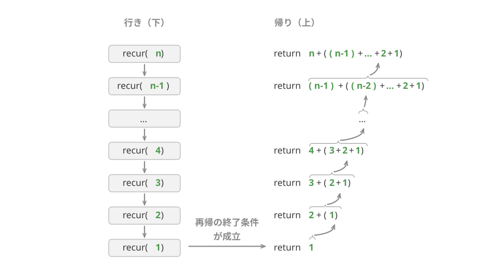
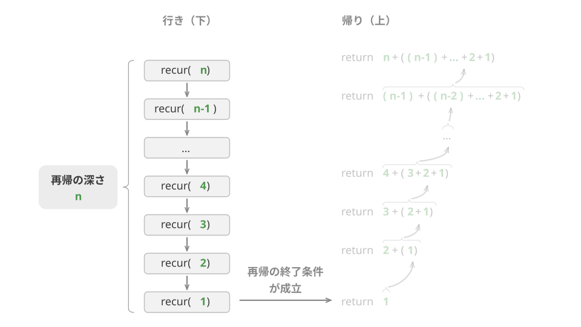
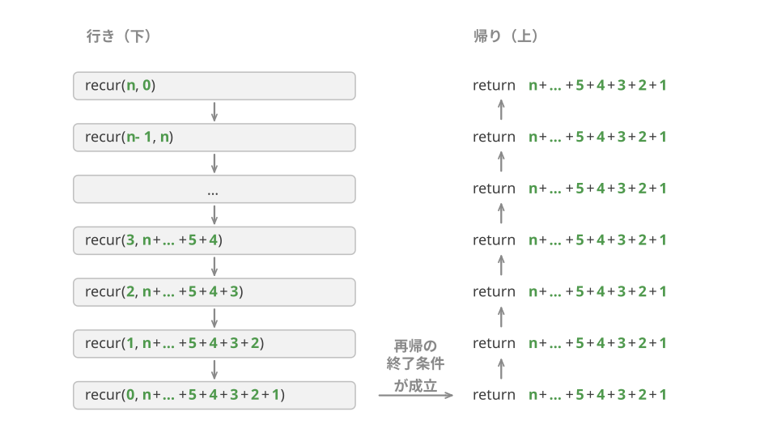
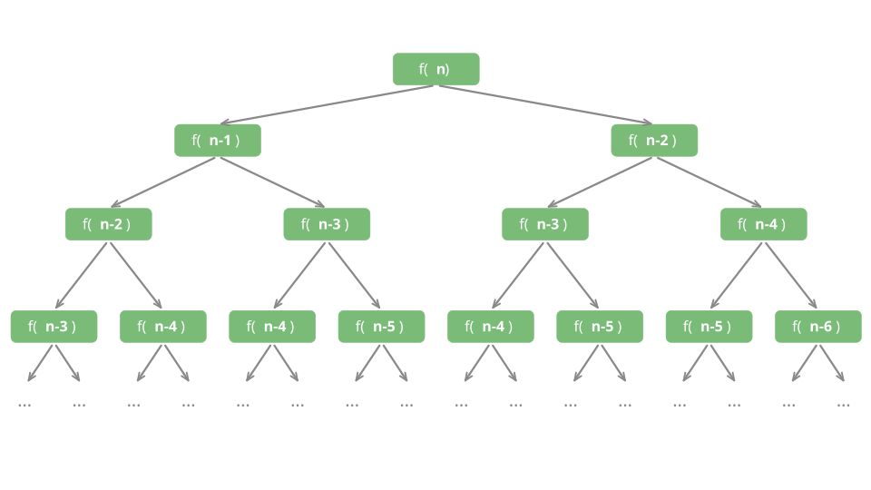

# 2.2 &nbsp; 反復と再帰

アルゴリズムでは同じ処理を繰り返すことがよくあり、その繰り返し方は計算量の分析と密接に関わります。そこで、時間計算量と空間計算量に入る前に、プログラムで処理を繰り返すための 2 つの基本的な制御構造、反復と再帰を見ていきましょう。

## 2.2.1 &nbsp; 反復

<u>反復（iteration）</u>は、同じ処理を繰り返し実行する制御構造です。一定の条件が満たされている間、プログラムは同じコードを繰り返し実行し、条件が満たされなくなると終了します。

### 1. &nbsp; for ループ

`for` ループは最も一般的な反復の形式の一つで、**反復回数があらかじめわかっている場合に適しています**。

次の関数は `for` ループで $1 + 2 + \dots + n$ を求め、合計を変数 `res` に記録します。Python の `range(a, b)` は左端を含み右端を含まない区間を表すので、走査するのは $a, a + 1, \dots, b-1$ です。

=== "Python"

    ```python title="iteration.py"
    def for_loop(n: int) -> int:
        """for ループ"""
        res = 0
        # 1, 2, ..., n-1, n の和をループで求める
        for i in range(1, n + 1):
            res += i
        return res
    ```

=== "C++"

    ```cpp title="iteration.cpp"
    /* for ループ */
    int forLoop(int n) {
        int res = 0;
        // 1, 2, ..., n-1, n の和をループで求める
        for (int i = 1; i <= n; ++i) {
            res += i;
        }
        return res;
    }
    ```

=== "Java"

    ```java title="iteration.java"
    /* for ループ */
    int forLoop(int n) {
        int res = 0;
        // 1, 2, ..., n-1, n の和をループで求める
        for (int i = 1; i <= n; i++) {
            res += i;
        }
        return res;
    }
    ```

=== "C#"

    ```csharp title="iteration.cs"
    /* for ループ */
    int ForLoop(int n) {
        int res = 0;
        // 1, 2, ..., n-1, n の和をループで求める
        for (int i = 1; i <= n; i++) {
            res += i;
        }
        return res;
    }
    ```

=== "Go"

    ```go title="iteration.go"
    /* for ループ */
    func forLoop(n int) int {
        res := 0
        // 1, 2, ..., n-1, n の和をループで求める
        for i := 1; i <= n; i++ {
            res += i
        }
        return res
    }
    ```

=== "Swift"

    ```swift title="iteration.swift"
    /* for ループ */
    func forLoop(n: Int) -> Int {
        var res = 0
        // 1, 2, ..., n-1, n の和をループで求める
        for i in 1 ... n {
            res += i
        }
        return res
    }
    ```

=== "JS"

    ```javascript title="iteration.js"
    /* for ループ */
    function forLoop(n) {
        let res = 0;
        // 1, 2, ..., n-1, n の和をループで求める
        for (let i = 1; i <= n; i++) {
            res += i;
        }
        return res;
    }
    ```

=== "TS"

    ```typescript title="iteration.ts"
    /* for ループ */
    function forLoop(n: number): number {
        let res = 0;
        // 1, 2, ..., n-1, n の和をループで求める
        for (let i = 1; i <= n; i++) {
            res += i;
        }
        return res;
    }
    ```

=== "Dart"

    ```dart title="iteration.dart"
    /* for ループ */
    int forLoop(int n) {
      int res = 0;
      // 1, 2, ..., n-1, n の和をループで求める
      for (int i = 1; i <= n; i++) {
        res += i;
      }
      return res;
    }
    ```

=== "Rust"

    ```rust title="iteration.rs"
    /* for ループ */
    fn for_loop(n: i32) -> i32 {
        let mut res = 0;
        // 1, 2, ..., n-1, n の和をループで求める
        for i in 1..=n {
            res += i;
        }
        res
    }
    ```

=== "C"

    ```c title="iteration.c"
    /* for ループ */
    int forLoop(int n) {
        int res = 0;
        // 1, 2, ..., n-1, n の和をループで求める
        for (int i = 1; i <= n; i++) {
            res += i;
        }
        return res;
    }
    ```

=== "Kotlin"

    ```kotlin title="iteration.kt"
    /* for ループ */
    fun forLoop(n: Int): Int {
        var res = 0
        // 1, 2, ..., n-1, n の和をループで求める
        for (i in 1..n) {
            res += i
        }
        return res
    }
    ```

=== "Ruby"

    ```ruby title="iteration.rb"
    ### for ループ ###
    def for_loop(n)
      res = 0

      # 1, 2, ..., n-1, n の和をループで求める
      for i in 1..n
        res += i
      end

      res
    end
    ```

??? pythontutor "実行の様子を見る"

    <div style="height: 423px; width: 100%;"><iframe class="pythontutor-iframe" title="実行の様子を見る" src="https://pythontutor.com/iframe-embed.html#code=def%20for_loop%28n%3A%20int%29%20-%3E%20int%3A%0A%20%20%20%20%22%22%22for%20%E3%83%AB%E3%83%BC%E3%83%97%22%22%22%0A%20%20%20%20res%20%3D%200%0A%20%20%20%20%23%201,%202,%20...,%20n-1,%20n%20%E3%81%AE%E5%92%8C%E3%82%92%E3%83%AB%E3%83%BC%E3%83%97%E3%81%A7%E6%B1%82%E3%82%81%E3%82%8B%0A%20%20%20%20for%20i%20in%20range%281,%20n%20%2B%201%29%3A%0A%20%20%20%20%20%20%20%20res%20%2B%3D%20i%0A%20%20%20%20return%20res%0A%0A%22%22%22Driver%20Code%22%22%22%0Aif%20__name__%20%3D%3D%20%22__main__%22%3A%0A%20%20%20%20n%20%3D%205%0A%20%20%20%20res%20%3D%20for_loop%28n%29%0A%20%20%20%20print%28f%22%5Cnfor%20%E3%83%AB%E3%83%BC%E3%83%97%E3%81%AB%E3%82%88%E3%82%8B%E7%B7%8F%E5%92%8C%20res%20%3D%20%7Bres%7D%22%29&codeDivHeight=472&codeDivWidth=350&cumulative=false&curInstr=3&heapPrimitives=nevernest&origin=opt-frontend.js&py=311&rawInputLstJSON=%5B%5D&"> </iframe></div>
    <div style="margin-top: 5px;"><a href="https://pythontutor.com/iframe-embed.html#code=def%20for_loop%28n%3A%20int%29%20-%3E%20int%3A%0A%20%20%20%20%22%22%22for%20%E3%83%AB%E3%83%BC%E3%83%97%22%22%22%0A%20%20%20%20res%20%3D%200%0A%20%20%20%20%23%201,%202,%20...,%20n-1,%20n%20%E3%81%AE%E5%92%8C%E3%82%92%E3%83%AB%E3%83%BC%E3%83%97%E3%81%A7%E6%B1%82%E3%82%81%E3%82%8B%0A%20%20%20%20for%20i%20in%20range%281,%20n%20%2B%201%29%3A%0A%20%20%20%20%20%20%20%20res%20%2B%3D%20i%0A%20%20%20%20return%20res%0A%0A%22%22%22Driver%20Code%22%22%22%0Aif%20__name__%20%3D%3D%20%22__main__%22%3A%0A%20%20%20%20n%20%3D%205%0A%20%20%20%20res%20%3D%20for_loop%28n%29%0A%20%20%20%20print%28f%22%5Cnfor%20%E3%83%AB%E3%83%BC%E3%83%97%E3%81%AB%E3%82%88%E3%82%8B%E7%B7%8F%E5%92%8C%20res%20%3D%20%7Bres%7D%22%29&codeDivHeight=800&codeDivWidth=600&cumulative=false&curInstr=3&heapPrimitives=nevernest&origin=opt-frontend.js&py=311&rawInputLstJSON=%5B%5D&" target="_blank" rel="noopener noreferrer">全画面で表示 ></a></div>

図 2-1 は、この総和を求める関数のフローチャートです。

{ class="animation-figure" }

<p align="center"> 図 2-1 &nbsp; 総和を求める関数のフローチャート </p>

この関数の操作回数は入力データのサイズ $n$ に比例します。つまり、両者には線形関係があります。実は、**この「線形関係」を表すのが時間計算量です**。詳しくは次節で説明します。

### 2. &nbsp; while ループ

`for` ループと同じように、`while` ループでも反復を実現できます。`while` ループでは毎回最初に条件を調べ、真なら処理を続け、偽ならループを終了します。

`while` ループで $1 + 2 + \dots + n$ を求めてみましょう。

=== "Python"

    ```python title="iteration.py"
    def while_loop(n: int) -> int:
        """while ループ"""
        res = 0
        i = 1  # 条件判定用の変数を初期化
        # 1, 2, ..., n-1, n の和をループで求める
        while i <= n:
            res += i
            i += 1  # 条件判定用の変数を更新
        return res
    ```

=== "C++"

    ```cpp title="iteration.cpp"
    /* while ループ */
    int whileLoop(int n) {
        int res = 0;
        int i = 1; // 条件判定用の変数を初期化
        // 1, 2, ..., n-1, n の和をループで求める
        while (i <= n) {
            res += i;
            i++; // 条件判定用の変数を更新
        }
        return res;
    }
    ```

=== "Java"

    ```java title="iteration.java"
    /* while ループ */
    int whileLoop(int n) {
        int res = 0;
        int i = 1; // 条件判定用の変数を初期化
        // 1, 2, ..., n-1, n の和をループで求める
        while (i <= n) {
            res += i;
            i++; // 条件判定用の変数を更新
        }
        return res;
    }
    ```

=== "C#"

    ```csharp title="iteration.cs"
    /* while ループ */
    int WhileLoop(int n) {
        int res = 0;
        int i = 1; // 条件判定用の変数を初期化
        // 1, 2, ..., n-1, n の和をループで求める
        while (i <= n) {
            res += i;
            i += 1; // 条件判定用の変数を更新
        }
        return res;
    }
    ```

=== "Go"

    ```go title="iteration.go"
    /* while ループ */
    func whileLoop(n int) int {
        res := 0
        // 条件判定用の変数を初期化
        i := 1
        // 1, 2, ..., n-1, n の和をループで求める
        for i <= n {
            res += i
            // 条件判定用の変数を更新
            i++
        }
        return res
    }
    ```

=== "Swift"

    ```swift title="iteration.swift"
    /* while ループ */
    func whileLoop(n: Int) -> Int {
        var res = 0
        var i = 1 // 条件判定用の変数を初期化
        // 1, 2, ..., n-1, n の和をループで求める
        while i <= n {
            res += i
            i += 1 // 条件判定用の変数を更新
        }
        return res
    }
    ```

=== "JS"

    ```javascript title="iteration.js"
    /* while ループ */
    function whileLoop(n) {
        let res = 0;
        let i = 1; // 条件判定用の変数を初期化
        // 1, 2, ..., n-1, n の和をループで求める
        while (i <= n) {
            res += i;
            i++; // 条件判定用の変数を更新
        }
        return res;
    }
    ```

=== "TS"

    ```typescript title="iteration.ts"
    /* while ループ */
    function whileLoop(n: number): number {
        let res = 0;
        let i = 1; // 条件判定用の変数を初期化
        // 1, 2, ..., n-1, n の和をループで求める
        while (i <= n) {
            res += i;
            i++; // 条件判定用の変数を更新
        }
        return res;
    }
    ```

=== "Dart"

    ```dart title="iteration.dart"
    /* while ループ */
    int whileLoop(int n) {
      int res = 0;
      int i = 1; // 条件判定用の変数を初期化
      // 1, 2, ..., n-1, n の和をループで求める
      while (i <= n) {
        res += i;
        i++; // 条件判定用の変数を更新
      }
      return res;
    }
    ```

=== "Rust"

    ```rust title="iteration.rs"
    /* while ループ */
    fn while_loop(n: i32) -> i32 {
        let mut res = 0;
        let mut i = 1; // 条件判定用の変数を初期化

        // 1, 2, ..., n-1, n の和をループで求める
        while i <= n {
            res += i;
            i += 1; // 条件判定用の変数を更新
        }
        res
    }
    ```

=== "C"

    ```c title="iteration.c"
    /* while ループ */
    int whileLoop(int n) {
        int res = 0;
        int i = 1; // 条件判定用の変数を初期化
        // 1, 2, ..., n-1, n の和をループで求める
        while (i <= n) {
            res += i;
            i++; // 条件判定用の変数を更新
        }
        return res;
    }
    ```

=== "Kotlin"

    ```kotlin title="iteration.kt"
    /* while ループ */
    fun whileLoop(n: Int): Int {
        var res = 0
        var i = 1 // 条件判定用の変数を初期化
        // 1, 2, ..., n-1, n の和をループで求める
        while (i <= n) {
            res += i
            i++ // 条件判定用の変数を更新
        }
        return res
    }
    ```

=== "Ruby"

    ```ruby title="iteration.rb"
    ### while ループ ###
    def while_loop(n)
      res = 0
      i = 1 # 条件判定用の変数を初期化

      # 1, 2, ..., n-1, n の和をループで求める
      while i <= n
        res += i
        i += 1 # 条件判定用の変数を更新
      end

      res
    end
    ```

??? pythontutor "実行の様子を見る"

    <div style="height: 459px; width: 100%;"><iframe class="pythontutor-iframe" title="実行の様子を見る" src="https://pythontutor.com/iframe-embed.html#code=def%20while_loop%28n%3A%20int%29%20-%3E%20int%3A%0A%20%20%20%20%22%22%22while%20%E3%83%AB%E3%83%BC%E3%83%97%22%22%22%0A%20%20%20%20res%20%3D%200%0A%20%20%20%20i%20%3D%201%20%20%23%20%E6%9D%A1%E4%BB%B6%E5%88%A4%E5%AE%9A%E7%94%A8%E3%81%AE%E5%A4%89%E6%95%B0%E3%82%92%E5%88%9D%E6%9C%9F%E5%8C%96%0A%20%20%20%20%23%201,%202,%20...,%20n-1,%20n%20%E3%81%AE%E5%92%8C%E3%82%92%E3%83%AB%E3%83%BC%E3%83%97%E3%81%A7%E6%B1%82%E3%82%81%E3%82%8B%0A%20%20%20%20while%20i%20%3C%3D%20n%3A%0A%20%20%20%20%20%20%20%20res%20%2B%3D%20i%0A%20%20%20%20%20%20%20%20i%20%2B%3D%201%20%20%23%20%E6%9D%A1%E4%BB%B6%E5%88%A4%E5%AE%9A%E7%94%A8%E3%81%AE%E5%A4%89%E6%95%B0%E3%82%92%E6%9B%B4%E6%96%B0%0A%20%20%20%20return%20res%0A%0A%22%22%22Driver%20Code%22%22%22%0Aif%20__name__%20%3D%3D%20%22__main__%22%3A%0A%20%20%20%20n%20%3D%205%0A%20%20%20%20res%20%3D%20while_loop%28n%29%0A%20%20%20%20print%28f%22%5Cnwhile%20%E3%83%AB%E3%83%BC%E3%83%97%E3%81%AB%E3%82%88%E3%82%8B%E7%B7%8F%E5%92%8C%20res%20%3D%20%7Bres%7D%22%29&codeDivHeight=472&codeDivWidth=350&cumulative=false&curInstr=3&heapPrimitives=nevernest&origin=opt-frontend.js&py=311&rawInputLstJSON=%5B%5D&textReferences=false"> </iframe></div>
    <div style="margin-top: 5px;"><a href="https://pythontutor.com/iframe-embed.html#code=def%20while_loop%28n%3A%20int%29%20-%3E%20int%3A%0A%20%20%20%20%22%22%22while%20%E3%83%AB%E3%83%BC%E3%83%97%22%22%22%0A%20%20%20%20res%20%3D%200%0A%20%20%20%20i%20%3D%201%20%20%23%20%E6%9D%A1%E4%BB%B6%E5%88%A4%E5%AE%9A%E7%94%A8%E3%81%AE%E5%A4%89%E6%95%B0%E3%82%92%E5%88%9D%E6%9C%9F%E5%8C%96%0A%20%20%20%20%23%201,%202,%20...,%20n-1,%20n%20%E3%81%AE%E5%92%8C%E3%82%92%E3%83%AB%E3%83%BC%E3%83%97%E3%81%A7%E6%B1%82%E3%82%81%E3%82%8B%0A%20%20%20%20while%20i%20%3C%3D%20n%3A%0A%20%20%20%20%20%20%20%20res%20%2B%3D%20i%0A%20%20%20%20%20%20%20%20i%20%2B%3D%201%20%20%23%20%E6%9D%A1%E4%BB%B6%E5%88%A4%E5%AE%9A%E7%94%A8%E3%81%AE%E5%A4%89%E6%95%B0%E3%82%92%E6%9B%B4%E6%96%B0%0A%20%20%20%20return%20res%0A%0A%22%22%22Driver%20Code%22%22%22%0Aif%20__name__%20%3D%3D%20%22__main__%22%3A%0A%20%20%20%20n%20%3D%205%0A%20%20%20%20res%20%3D%20while_loop%28n%29%0A%20%20%20%20print%28f%22%5Cnwhile%20%E3%83%AB%E3%83%BC%E3%83%97%E3%81%AB%E3%82%88%E3%82%8B%E7%B7%8F%E5%92%8C%20res%20%3D%20%7Bres%7D%22%29&codeDivHeight=800&codeDivWidth=600&cumulative=false&curInstr=3&heapPrimitives=nevernest&origin=opt-frontend.js&py=311&rawInputLstJSON=%5B%5D&textReferences=false" target="_blank" rel="noopener noreferrer">全画面で表示 ></a></div>

**`while` ループは `for` ループよりも自由度が高くなります**。`while` ループでは、条件判定に使う変数の初期化と更新を自由に設計できます。

例えば次のコードでは、条件判定用の変数 $i$ を毎回 2 回更新します。このような処理は `for` ループではやや書きにくくなります。

=== "Python"

    ```python title="iteration.py"
    def while_loop_ii(n: int) -> int:
        """while ループ（2 回更新）"""
        res = 0
        i = 1  # 条件判定用の変数を初期化
        # 1, 4, 10, ... の和をループで求める
        while i <= n:
            res += i
            # 条件判定用の変数を更新
            i += 1
            i *= 2
        return res
    ```

=== "C++"

    ```cpp title="iteration.cpp"
    /* while ループ（2 回更新） */
    int whileLoopII(int n) {
        int res = 0;
        int i = 1; // 条件判定用の変数を初期化
        // 1, 4, 10, ... の和をループで求める
        while (i <= n) {
            res += i;
            // 条件判定用の変数を更新
            i++;
            i *= 2;
        }
        return res;
    }
    ```

=== "Java"

    ```java title="iteration.java"
    /* while ループ（2 回更新） */
    int whileLoopII(int n) {
        int res = 0;
        int i = 1; // 条件判定用の変数を初期化
        // 1, 4, 10, ... の和をループで求める
        while (i <= n) {
            res += i;
            // 条件判定用の変数を更新
            i++;
            i *= 2;
        }
        return res;
    }
    ```

=== "C#"

    ```csharp title="iteration.cs"
    /* while ループ（2 回更新） */
    int WhileLoopII(int n) {
        int res = 0;
        int i = 1; // 条件判定用の変数を初期化
        // 1, 4, 10, ... の和をループで求める
        while (i <= n) {
            res += i;
            // 条件判定用の変数を更新
            i += 1; 
            i *= 2;
        }
        return res;
    }
    ```

=== "Go"

    ```go title="iteration.go"
    /* while ループ（2 回更新） */
    func whileLoopII(n int) int {
        res := 0
        // 条件判定用の変数を初期化
        i := 1
        // 1, 4, 10, ... の和をループで求める
        for i <= n {
            res += i
            // 条件判定用の変数を更新
            i++
            i *= 2
        }
        return res
    }
    ```

=== "Swift"

    ```swift title="iteration.swift"
    /* while ループ（2 回更新） */
    func whileLoopII(n: Int) -> Int {
        var res = 0
        var i = 1 // 条件判定用の変数を初期化
        // 1, 4, 10, ... の和をループで求める
        while i <= n {
            res += i
            // 条件判定用の変数を更新
            i += 1
            i *= 2
        }
        return res
    }
    ```

=== "JS"

    ```javascript title="iteration.js"
    /* while ループ（2 回更新） */
    function whileLoopII(n) {
        let res = 0;
        let i = 1; // 条件判定用の変数を初期化
        // 1, 4, 10, ... の和をループで求める
        while (i <= n) {
            res += i;
            // 条件判定用の変数を更新
            i++;
            i *= 2;
        }
        return res;
    }
    ```

=== "TS"

    ```typescript title="iteration.ts"
    /* while ループ（2 回更新） */
    function whileLoopII(n: number): number {
        let res = 0;
        let i = 1; // 条件判定用の変数を初期化
        // 1, 4, 10, ... の和をループで求める
        while (i <= n) {
            res += i;
            // 条件判定用の変数を更新
            i++;
            i *= 2;
        }
        return res;
    }
    ```

=== "Dart"

    ```dart title="iteration.dart"
    /* while ループ（2 回更新） */
    int whileLoopII(int n) {
      int res = 0;
      int i = 1; // 条件判定用の変数を初期化
      // 1, 4, 10, ... の和をループで求める
      while (i <= n) {
        res += i;
        // 条件判定用の変数を更新
        i++;
        i *= 2;
      }
      return res;
    }
    ```

=== "Rust"

    ```rust title="iteration.rs"
    /* while ループ（2 回更新） */
    fn while_loop_ii(n: i32) -> i32 {
        let mut res = 0;
        let mut i = 1; // 条件判定用の変数を初期化

        // 1, 4, 10, ... の和をループで求める
        while i <= n {
            res += i;
            // 条件判定用の変数を更新
            i += 1;
            i *= 2;
        }
        res
    }
    ```

=== "C"

    ```c title="iteration.c"
    /* while ループ（2 回更新） */
    int whileLoopII(int n) {
        int res = 0;
        int i = 1; // 条件判定用の変数を初期化
        // 1, 4, 10, ... の和をループで求める
        while (i <= n) {
            res += i;
            // 条件判定用の変数を更新
            i++;
            i *= 2;
        }
        return res;
    }
    ```

=== "Kotlin"

    ```kotlin title="iteration.kt"
    /* while ループ（2 回更新） */
    fun whileLoopII(n: Int): Int {
        var res = 0
        var i = 1 // 条件判定用の変数を初期化
        // 1, 4, 10, ... の和をループで求める
        while (i <= n) {
            res += i
            // 条件判定用の変数を更新
            i++
            i *= 2
        }
        return res
    }
    ```

=== "Ruby"

    ```ruby title="iteration.rb"
    ### while ループ（2 回更新）###
    def while_loop_ii(n)
      res = 0
      i = 1 # 条件判定用の変数を初期化

      # 1, 4, 10, ... の和をループで求める
      while i <= n
        res += i
        # 条件判定用の変数を更新
        i += 1
        i *= 2
      end

      res
    end
    ```

??? pythontutor "実行の様子を見る"

    <div style="height: 495px; width: 100%;"><iframe class="pythontutor-iframe" title="実行の様子を見る" src="https://pythontutor.com/iframe-embed.html#code=def%20while_loop_ii%28n%3A%20int%29%20-%3E%20int%3A%0A%20%20%20%20%22%22%22while%20%E3%83%AB%E3%83%BC%E3%83%97%EF%BC%882%20%E5%9B%9E%E6%9B%B4%E6%96%B0%EF%BC%89%22%22%22%0A%20%20%20%20res%20%3D%200%0A%20%20%20%20i%20%3D%201%20%20%23%20%E6%9D%A1%E4%BB%B6%E5%88%A4%E5%AE%9A%E7%94%A8%E3%81%AE%E5%A4%89%E6%95%B0%E3%82%92%E5%88%9D%E6%9C%9F%E5%8C%96%0A%20%20%20%20%23%201,%204,%2010,%20...%20%E3%81%AE%E5%92%8C%E3%82%92%E3%83%AB%E3%83%BC%E3%83%97%E3%81%A7%E6%B1%82%E3%82%81%E3%82%8B%0A%20%20%20%20while%20i%20%3C%3D%20n%3A%0A%20%20%20%20%20%20%20%20res%20%2B%3D%20i%0A%20%20%20%20%20%20%20%20%23%20%E6%9D%A1%E4%BB%B6%E5%88%A4%E5%AE%9A%E7%94%A8%E3%81%AE%E5%A4%89%E6%95%B0%E3%82%92%E6%9B%B4%E6%96%B0%0A%20%20%20%20%20%20%20%20i%20%2B%3D%201%0A%20%20%20%20%20%20%20%20i%20%2A%3D%202%0A%20%20%20%20return%20res%0A%0A%22%22%22Driver%20Code%22%22%22%0Aif%20__name__%20%3D%3D%20%22__main__%22%3A%0A%20%20%20%20n%20%3D%205%0A%20%20%20%20res%20%3D%20while_loop_ii%28n%29%0A%20%20%20%20print%28f%22%5Cnwhile%20%E3%83%AB%E3%83%BC%E3%83%97%EF%BC%882%20%E5%9B%9E%E6%9B%B4%E6%96%B0%EF%BC%89%E3%81%AB%E3%82%88%E3%82%8B%E7%B7%8F%E5%92%8C%20res%20%3D%20%7Bres%7D%22%29&codeDivHeight=472&codeDivWidth=350&cumulative=false&curInstr=3&heapPrimitives=nevernest&origin=opt-frontend.js&py=311&rawInputLstJSON=%5B%5D&textReferences=false"> </iframe></div>
    <div style="margin-top: 5px;"><a href="https://pythontutor.com/iframe-embed.html#code=def%20while_loop_ii%28n%3A%20int%29%20-%3E%20int%3A%0A%20%20%20%20%22%22%22while%20%E3%83%AB%E3%83%BC%E3%83%97%EF%BC%882%20%E5%9B%9E%E6%9B%B4%E6%96%B0%EF%BC%89%22%22%22%0A%20%20%20%20res%20%3D%200%0A%20%20%20%20i%20%3D%201%20%20%23%20%E6%9D%A1%E4%BB%B6%E5%88%A4%E5%AE%9A%E7%94%A8%E3%81%AE%E5%A4%89%E6%95%B0%E3%82%92%E5%88%9D%E6%9C%9F%E5%8C%96%0A%20%20%20%20%23%201,%204,%2010,%20...%20%E3%81%AE%E5%92%8C%E3%82%92%E3%83%AB%E3%83%BC%E3%83%97%E3%81%A7%E6%B1%82%E3%82%81%E3%82%8B%0A%20%20%20%20while%20i%20%3C%3D%20n%3A%0A%20%20%20%20%20%20%20%20res%20%2B%3D%20i%0A%20%20%20%20%20%20%20%20%23%20%E6%9D%A1%E4%BB%B6%E5%88%A4%E5%AE%9A%E7%94%A8%E3%81%AE%E5%A4%89%E6%95%B0%E3%82%92%E6%9B%B4%E6%96%B0%0A%20%20%20%20%20%20%20%20i%20%2B%3D%201%0A%20%20%20%20%20%20%20%20i%20%2A%3D%202%0A%20%20%20%20return%20res%0A%0A%22%22%22Driver%20Code%22%22%22%0Aif%20__name__%20%3D%3D%20%22__main__%22%3A%0A%20%20%20%20n%20%3D%205%0A%20%20%20%20res%20%3D%20while_loop_ii%28n%29%0A%20%20%20%20print%28f%22%5Cnwhile%20%E3%83%AB%E3%83%BC%E3%83%97%EF%BC%882%20%E5%9B%9E%E6%9B%B4%E6%96%B0%EF%BC%89%E3%81%AB%E3%82%88%E3%82%8B%E7%B7%8F%E5%92%8C%20res%20%3D%20%7Bres%7D%22%29&codeDivHeight=800&codeDivWidth=600&cumulative=false&curInstr=3&heapPrimitives=nevernest&origin=opt-frontend.js&py=311&rawInputLstJSON=%5B%5D&textReferences=false" target="_blank" rel="noopener noreferrer">全画面で表示 ></a></div>

まとめると、**`for` ループは簡潔に書け、`while` ループは柔軟に使えます**。どちらも反復を実現できるので、問題に応じて使い分けましょう。

### 3. &nbsp; 入れ子のループ

ループの中に別のループを入れることもできます。`for` ループの例を見てみましょう。

=== "Python"

    ```python title="iteration.py"
    def nested_for_loop(n: int) -> str:
        """二重の for ループ"""
        res = ""
        # i = 1, 2, ..., n-1, n の順に繰り返す
        for i in range(1, n + 1):
            # j = 1, 2, ..., n-1, n の順に繰り返す
            for j in range(1, n + 1):
                res += f"({i}, {j}), "
        return res
    ```

=== "C++"

    ```cpp title="iteration.cpp"
    /* 二重の for ループ */
    string nestedForLoop(int n) {
        ostringstream res;
        // i = 1, 2, ..., n-1, n の順に繰り返す
        for (int i = 1; i <= n; ++i) {
            // j = 1, 2, ..., n-1, n の順に繰り返す
            for (int j = 1; j <= n; ++j) {
                res << "(" << i << ", " << j << "), ";
            }
        }
        return res.str();
    }
    ```

=== "Java"

    ```java title="iteration.java"
    /* 二重の for ループ */
    String nestedForLoop(int n) {
        StringBuilder res = new StringBuilder();
        // i = 1, 2, ..., n-1, n の順に繰り返す
        for (int i = 1; i <= n; i++) {
            // j = 1, 2, ..., n-1, n の順に繰り返す
            for (int j = 1; j <= n; j++) {
                res.append("(" + i + ", " + j + "), ");
            }
        }
        return res.toString();
    }
    ```

=== "C#"

    ```csharp title="iteration.cs"
    /* 二重の for ループ */
    string NestedForLoop(int n) {
        StringBuilder res = new();
        // i = 1, 2, ..., n-1, n の順に繰り返す
        for (int i = 1; i <= n; i++) {
            // j = 1, 2, ..., n-1, n の順に繰り返す
            for (int j = 1; j <= n; j++) {
                res.Append($"({i}, {j}), ");
            }
        }
        return res.ToString();
    }
    ```

=== "Go"

    ```go title="iteration.go"
    /* 二重の for ループ */
    func nestedForLoop(n int) string {
        res := ""
        // i = 1, 2, ..., n-1, n の順に繰り返す
        for i := 1; i <= n; i++ {
            for j := 1; j <= n; j++ {
                // j = 1, 2, ..., n-1, n の順に繰り返す
                res += fmt.Sprintf("(%d, %d), ", i, j)
            }
        }
        return res
    }
    ```

=== "Swift"

    ```swift title="iteration.swift"
    /* 二重の for ループ */
    func nestedForLoop(n: Int) -> String {
        var res = ""
        // i = 1, 2, ..., n-1, n の順に繰り返す
        for i in 1 ... n {
            // j = 1, 2, ..., n-1, n の順に繰り返す
            for j in 1 ... n {
                res.append("(\(i), \(j)), ")
            }
        }
        return res
    }
    ```

=== "JS"

    ```javascript title="iteration.js"
    /* 二重の for ループ */
    function nestedForLoop(n) {
        let res = '';
        // i = 1, 2, ..., n-1, n の順に繰り返す
        for (let i = 1; i <= n; i++) {
            // j = 1, 2, ..., n-1, n の順に繰り返す
            for (let j = 1; j <= n; j++) {
                res += `(${i}, ${j}), `;
            }
        }
        return res;
    }
    ```

=== "TS"

    ```typescript title="iteration.ts"
    /* 二重の for ループ */
    function nestedForLoop(n: number): string {
        let res = '';
        // i = 1, 2, ..., n-1, n の順に繰り返す
        for (let i = 1; i <= n; i++) {
            // j = 1, 2, ..., n-1, n の順に繰り返す
            for (let j = 1; j <= n; j++) {
                res += `(${i}, ${j}), `;
            }
        }
        return res;
    }
    ```

=== "Dart"

    ```dart title="iteration.dart"
    /* 二重の for ループ */
    String nestedForLoop(int n) {
      String res = "";
      // i = 1, 2, ..., n-1, n の順に繰り返す
      for (int i = 1; i <= n; i++) {
        // j = 1, 2, ..., n-1, n の順に繰り返す
        for (int j = 1; j <= n; j++) {
          res += "($i, $j), ";
        }
      }
      return res;
    }
    ```

=== "Rust"

    ```rust title="iteration.rs"
    /* 二重の for ループ */
    fn nested_for_loop(n: i32) -> String {
        let mut res = vec![];
        // i = 1, 2, ..., n-1, n の順に繰り返す
        for i in 1..=n {
            // j = 1, 2, ..., n-1, n の順に繰り返す
            for j in 1..=n {
                res.push(format!("({}, {}), ", i, j));
            }
        }
        res.join("")
    }
    ```

=== "C"

    ```c title="iteration.c"
    /* 二重の for ループ */
    char *nestedForLoop(int n) {
        // 点の個数は n * n。各点を表す文字列 "(i, j), " の長さは最大 6+10*2 で、末尾のヌル文字 \0 の領域も必要
        int size = n * n * 26 + 1;
        char *res = malloc(size * sizeof(char));
        // i = 1, 2, ..., n-1, n の順に繰り返す
        for (int i = 1; i <= n; i++) {
            // j = 1, 2, ..., n-1, n の順に繰り返す
            for (int j = 1; j <= n; j++) {
                char tmp[26];
                snprintf(tmp, sizeof(tmp), "(%d, %d), ", i, j);
                strncat(res, tmp, size - strlen(res) - 1);
            }
        }
        return res;
    }
    ```

=== "Kotlin"

    ```kotlin title="iteration.kt"
    /* 二重の for ループ */
    fun nestedForLoop(n: Int): String {
        val res = StringBuilder()
        // i = 1, 2, ..., n-1, n の順に繰り返す
        for (i in 1..n) {
            // j = 1, 2, ..., n-1, n の順に繰り返す
            for (j in 1..n) {
                res.append(" ($i, $j), ")
            }
        }
        return res.toString()
    }
    ```

=== "Ruby"

    ```ruby title="iteration.rb"
    ### 二重の for ループ ###
    def nested_for_loop(n)
      res = ""

      # i = 1, 2, ..., n-1, n の順に繰り返す
      for i in 1..n
        # j = 1, 2, ..., n-1, n の順に繰り返す
        for j in 1..n
          res += "(#{i}, #{j}), "
        end
      end

      res
    end
    ```

??? pythontutor "実行の様子を見る"

    <div style="height: 459px; width: 100%;"><iframe class="pythontutor-iframe" title="実行の様子を見る" src="https://pythontutor.com/iframe-embed.html#code=def%20nested_for_loop%28n%3A%20int%29%20-%3E%20str%3A%0A%20%20%20%20%22%22%22%E4%BA%8C%E9%87%8D%E3%81%AE%20for%20%E3%83%AB%E3%83%BC%E3%83%97%22%22%22%0A%20%20%20%20res%20%3D%20%22%22%0A%20%20%20%20%23%20i%20%3D%201,%202,%20...,%20n-1,%20n%20%E3%81%AE%E9%A0%86%E3%81%AB%E7%B9%B0%E3%82%8A%E8%BF%94%E3%81%99%0A%20%20%20%20for%20i%20in%20range%281,%20n%20%2B%201%29%3A%0A%20%20%20%20%20%20%20%20%23%20j%20%3D%201,%202,%20...,%20n-1,%20n%20%E3%81%AE%E9%A0%86%E3%81%AB%E7%B9%B0%E3%82%8A%E8%BF%94%E3%81%99%0A%20%20%20%20%20%20%20%20for%20j%20in%20range%281,%20n%20%2B%201%29%3A%0A%20%20%20%20%20%20%20%20%20%20%20%20res%20%2B%3D%20f%22%28%7Bi%7D,%20%7Bj%7D%29,%20%22%0A%20%20%20%20return%20res%0A%0A%22%22%22Driver%20Code%22%22%22%0Aif%20__name__%20%3D%3D%20%22__main__%22%3A%0A%20%20%20%20n%20%3D%205%0A%20%20%20%20res%20%3D%20nested_for_loop%28n%29%0A%20%20%20%20print%28f%22%5Cn%E4%BA%8C%E9%87%8D%E3%81%AE%20for%20%E3%83%AB%E3%83%BC%E3%83%97%E3%81%AE%E8%B5%B0%E6%9F%BB%E7%B5%90%E6%9E%9C%20%7Bres%7D%22%29&codeDivHeight=472&codeDivWidth=350&cumulative=false&curInstr=3&heapPrimitives=nevernest&origin=opt-frontend.js&py=311&rawInputLstJSON=%5B%5D&textReferences=false"> </iframe></div>
    <div style="margin-top: 5px;"><a href="https://pythontutor.com/iframe-embed.html#code=def%20nested_for_loop%28n%3A%20int%29%20-%3E%20str%3A%0A%20%20%20%20%22%22%22%E4%BA%8C%E9%87%8D%E3%81%AE%20for%20%E3%83%AB%E3%83%BC%E3%83%97%22%22%22%0A%20%20%20%20res%20%3D%20%22%22%0A%20%20%20%20%23%20i%20%3D%201,%202,%20...,%20n-1,%20n%20%E3%81%AE%E9%A0%86%E3%81%AB%E7%B9%B0%E3%82%8A%E8%BF%94%E3%81%99%0A%20%20%20%20for%20i%20in%20range%281,%20n%20%2B%201%29%3A%0A%20%20%20%20%20%20%20%20%23%20j%20%3D%201,%202,%20...,%20n-1,%20n%20%E3%81%AE%E9%A0%86%E3%81%AB%E7%B9%B0%E3%82%8A%E8%BF%94%E3%81%99%0A%20%20%20%20%20%20%20%20for%20j%20in%20range%281,%20n%20%2B%201%29%3A%0A%20%20%20%20%20%20%20%20%20%20%20%20res%20%2B%3D%20f%22%28%7Bi%7D,%20%7Bj%7D%29,%20%22%0A%20%20%20%20return%20res%0A%0A%22%22%22Driver%20Code%22%22%22%0Aif%20__name__%20%3D%3D%20%22__main__%22%3A%0A%20%20%20%20n%20%3D%205%0A%20%20%20%20res%20%3D%20nested_for_loop%28n%29%0A%20%20%20%20print%28f%22%5Cn%E4%BA%8C%E9%87%8D%E3%81%AE%20for%20%E3%83%AB%E3%83%BC%E3%83%97%E3%81%AE%E8%B5%B0%E6%9F%BB%E7%B5%90%E6%9E%9C%20%7Bres%7D%22%29&codeDivHeight=800&codeDivWidth=600&cumulative=false&curInstr=3&heapPrimitives=nevernest&origin=opt-frontend.js&py=311&rawInputLstJSON=%5B%5D&textReferences=false" target="_blank" rel="noopener noreferrer">全画面で表示 ></a></div>

図 2-2 は、この入れ子のループのフローチャートです。

{ class="animation-figure" }

<p align="center"> 図 2-2 &nbsp; 入れ子のループのフローチャート </p>

この場合、関数の操作回数は $n^2$ に比例します。言い換えると、アルゴリズムの実行時間は入力データのサイズ $n$ の二乗に比例します。

ループをさらに入れ子にすることもできます。入れ子を 1 段深くするたびに次数が 1 つ上がり、時間計算量は三次、四次というように大きくなります。

## 2.2.2 &nbsp; 再帰

 <u>再帰（recursion）</u>は、関数が自分自身を呼び出すことで問題を解く手法です。主に 2 つの段階からなります。

1. **行き**：プログラムは通常、引数を小さく、あるいは単純にしながら自分自身を呼び出し続け、「終了条件」に達するまで深く進みます。
2. **帰り**：「終了条件」が成立すると、一番深い再帰呼び出しから順に戻りながら、各段の結果をまとめます。

実装の観点からは、再帰のコードは主に次の 3 つの要素からなります。

1. **終了条件**：「行き」から「帰り」に切り替えるタイミングを決めます。
2. **再帰呼び出し**：「行き」に当たり、通常は引数を小さく、あるいは単純にして関数が自分自身を呼び出します。
3. **結果を返す**：「帰り」に当たり、現在の段で得た結果を 1 つ上の段に返します。

次のコードでは、関数 `recur(n)` を呼び出すだけで $1 + 2 + \dots + n$ を計算できます。

=== "Python"

    ```python title="recursion.py"
    def recur(n: int) -> int:
        """再帰"""
        # 終了条件
        if n == 1:
            return 1
        # 行き：再帰呼び出し
        res = recur(n - 1)
        # 帰り：結果を返す
        return n + res
    ```

=== "C++"

    ```cpp title="recursion.cpp"
    /* 再帰 */
    int recur(int n) {
        // 終了条件
        if (n == 1)
            return 1;
        // 行き：再帰呼び出し
        int res = recur(n - 1);
        // 帰り：結果を返す
        return n + res;
    }
    ```

=== "Java"

    ```java title="recursion.java"
    /* 再帰 */
    int recur(int n) {
        // 終了条件
        if (n == 1)
            return 1;
        // 行き：再帰呼び出し
        int res = recur(n - 1);
        // 帰り：結果を返す
        return n + res;
    }
    ```

=== "C#"

    ```csharp title="recursion.cs"
    /* 再帰 */
    int Recur(int n) {
        // 終了条件
        if (n == 1)
            return 1;
        // 行き：再帰呼び出し
        int res = Recur(n - 1);
        // 帰り：結果を返す
        return n + res;
    }
    ```

=== "Go"

    ```go title="recursion.go"
    /* 再帰 */
    func recur(n int) int {
        // 終了条件
        if n == 1 {
            return 1
        }
        // 行き：再帰呼び出し
        res := recur(n - 1)
        // 帰り：結果を返す
        return n + res
    }
    ```

=== "Swift"

    ```swift title="recursion.swift"
    /* 再帰 */
    func recur(n: Int) -> Int {
        // 終了条件
        if n == 1 {
            return 1
        }
        // 行き：再帰呼び出し
        let res = recur(n: n - 1)
        // 帰り：結果を返す
        return n + res
    }
    ```

=== "JS"

    ```javascript title="recursion.js"
    /* 再帰 */
    function recur(n) {
        // 終了条件
        if (n === 1) return 1;
        // 行き：再帰呼び出し
        const res = recur(n - 1);
        // 帰り：結果を返す
        return n + res;
    }
    ```

=== "TS"

    ```typescript title="recursion.ts"
    /* 再帰 */
    function recur(n: number): number {
        // 終了条件
        if (n === 1) return 1;
        // 行き：再帰呼び出し
        const res = recur(n - 1);
        // 帰り：結果を返す
        return n + res;
    }
    ```

=== "Dart"

    ```dart title="recursion.dart"
    /* 再帰 */
    int recur(int n) {
      // 終了条件
      if (n == 1) return 1;
      // 行き：再帰呼び出し
      int res = recur(n - 1);
      // 帰り：結果を返す
      return n + res;
    }
    ```

=== "Rust"

    ```rust title="recursion.rs"
    /* 再帰 */
    fn recur(n: i32) -> i32 {
        // 終了条件
        if n == 1 {
            return 1;
        }
        // 行き：再帰呼び出し
        let res = recur(n - 1);
        // 帰り：結果を返す
        n + res
    }
    ```

=== "C"

    ```c title="recursion.c"
    /* 再帰 */
    int recur(int n) {
        // 終了条件
        if (n == 1)
            return 1;
        // 行き：再帰呼び出し
        int res = recur(n - 1);
        // 帰り：結果を返す
        return n + res;
    }
    ```

=== "Kotlin"

    ```kotlin title="recursion.kt"
    /* 再帰 */
    fun recur(n: Int): Int {
        // 終了条件
        if (n == 1)
            return 1
        // 行き：再帰呼び出し
        val res = recur(n - 1)
        // 帰り：結果を返す
        return n + res
    }
    ```

=== "Ruby"

    ```ruby title="recursion.rb"
    ### 再帰 ###
    def recur(n)
      # 終了条件
      return 1 if n == 1
      # 行き：再帰呼び出し
      res = recur(n - 1)
      # 帰り：結果を返す
      n + res
    end
    ```

??? pythontutor "実行の様子を見る"

    <div style="height: 459px; width: 100%;"><iframe class="pythontutor-iframe" title="実行の様子を見る" src="https://pythontutor.com/iframe-embed.html#code=def%20recur%28n%3A%20int%29%20-%3E%20int%3A%0A%20%20%20%20%22%22%22%E5%86%8D%E5%B8%B0%22%22%22%0A%20%20%20%20%23%20%E7%B5%82%E4%BA%86%E6%9D%A1%E4%BB%B6%0A%20%20%20%20if%20n%20%3D%3D%201%3A%0A%20%20%20%20%20%20%20%20return%201%0A%20%20%20%20%23%20%E8%A1%8C%E3%81%8D%EF%BC%9A%E5%86%8D%E5%B8%B0%E5%91%BC%E3%81%B3%E5%87%BA%E3%81%97%0A%20%20%20%20res%20%3D%20recur%28n%20-%201%29%0A%20%20%20%20%23%20%E5%B8%B0%E3%82%8A%EF%BC%9A%E7%B5%90%E6%9E%9C%E3%82%92%E8%BF%94%E3%81%99%0A%20%20%20%20return%20n%20%2B%20res%0A%0A%22%22%22Driver%20Code%22%22%22%0Aif%20__name__%20%3D%3D%20%22__main__%22%3A%0A%20%20%20%20n%20%3D%205%0A%20%20%20%20res%20%3D%20recur%28n%29%0A%20%20%20%20print%28f%22%5Cn%E5%86%8D%E5%B8%B0%E9%96%A2%E6%95%B0%E3%81%AB%E3%82%88%E3%82%8B%E7%B7%8F%E5%92%8C%20res%20%3D%20%7Bres%7D%22%29&codeDivHeight=472&codeDivWidth=350&cumulative=false&curInstr=3&heapPrimitives=nevernest&origin=opt-frontend.js&py=311&rawInputLstJSON=%5B%5D&textReferences=false"> </iframe></div>
    <div style="margin-top: 5px;"><a href="https://pythontutor.com/iframe-embed.html#code=def%20recur%28n%3A%20int%29%20-%3E%20int%3A%0A%20%20%20%20%22%22%22%E5%86%8D%E5%B8%B0%22%22%22%0A%20%20%20%20%23%20%E7%B5%82%E4%BA%86%E6%9D%A1%E4%BB%B6%0A%20%20%20%20if%20n%20%3D%3D%201%3A%0A%20%20%20%20%20%20%20%20return%201%0A%20%20%20%20%23%20%E8%A1%8C%E3%81%8D%EF%BC%9A%E5%86%8D%E5%B8%B0%E5%91%BC%E3%81%B3%E5%87%BA%E3%81%97%0A%20%20%20%20res%20%3D%20recur%28n%20-%201%29%0A%20%20%20%20%23%20%E5%B8%B0%E3%82%8A%EF%BC%9A%E7%B5%90%E6%9E%9C%E3%82%92%E8%BF%94%E3%81%99%0A%20%20%20%20return%20n%20%2B%20res%0A%0A%22%22%22Driver%20Code%22%22%22%0Aif%20__name__%20%3D%3D%20%22__main__%22%3A%0A%20%20%20%20n%20%3D%205%0A%20%20%20%20res%20%3D%20recur%28n%29%0A%20%20%20%20print%28f%22%5Cn%E5%86%8D%E5%B8%B0%E9%96%A2%E6%95%B0%E3%81%AB%E3%82%88%E3%82%8B%E7%B7%8F%E5%92%8C%20res%20%3D%20%7Bres%7D%22%29&codeDivHeight=800&codeDivWidth=600&cumulative=false&curInstr=3&heapPrimitives=nevernest&origin=opt-frontend.js&py=311&rawInputLstJSON=%5B%5D&textReferences=false" target="_blank" rel="noopener noreferrer">全画面で表示 ></a></div>

この関数の再帰の流れを図 2-3 に示します。

{ class="animation-figure" }

<p align="center"> 図 2-3 &nbsp; 総和を求める関数の再帰の流れ </p>

反復と再帰で同じ計算結果を得られますが、**問題の捉え方と解き方はまったく異なります**。

- **反復**：問題を「ボトムアップ」に解きます。最も基本的な手順から始め、処理が完了するまでその手順を繰り返したり、結果を積み上げたりします。
- **再帰**：問題を「トップダウン」に解きます。元の問題を、それと同じ形をした小さな部分問題に分けます。さらに小さな部分問題へと分解を続け、解がわかっている基本ケースに達したら止めます。

先ほどの総和を求める関数を例に、$f(n) = 1 + 2 + \dots + n$ を求める問題を考えます。

- **反復**：ループで和を求める過程を再現します。$1$ から $n$ まで順にたどり、毎回加算すると $f(n)$ が得られます。
- **再帰**：$f(n) = n + f(n-1)$ のように問題を部分問題に分解します。この分解を再帰的に繰り返し、基本ケース $f(1) = 1$ に達したら終了します。

### 1. &nbsp; 呼び出しスタック

再帰関数が自分自身を呼び出すたびに、システムは新しい呼び出しにメモリを割り当て、ローカル変数や呼び出し元のアドレスなどを保存します。ここから次の 2 つのことがわかります。

- 関数の実行状態は「スタックフレーム」と呼ばれるメモリ領域に保存され、関数が戻って初めて解放されます。そのため、**再帰は一般に反復よりも多くのメモリを使います**。
- 再帰で関数を呼び出すたびに余分な処理が発生します。**そのため、再帰は一般にループよりも時間効率が低くなります**。

図 2-4 のように、終了条件に達するときには、まだ戻っていない再帰呼び出しが同時に $n$ 個あります。したがって、**再帰の深さは $n$ です**。

{ class="animation-figure" }

<p align="center"> 図 2-4 &nbsp; 再帰呼び出しの深さ </p>

実際には、プログラミング言語が許容する再帰の深さには通常上限があり、深すぎる再帰はスタックオーバーフローを引き起こすことがあります。

### 2. &nbsp; 末尾再帰

興味深いことに、**関数が戻る直前の最後の操作として再帰呼び出しを行う場合**、コンパイラやインタプリタによる最適化で、反復と同程度の空間効率を実現できます。この形を<u>末尾再帰（tail recursion）</u>といいます。

- **通常の再帰**：呼び出し元に戻った後も実行すべきコードがあるため、システムは呼び出し元の実行状態を保存しておく必要があります。
- **末尾再帰**：再帰呼び出しが関数の最後の操作です。呼び出し元に戻ってから行う操作はないので、システムは呼び出し元の実行状態を保存する必要がありません。

$1 + 2 + \dots + n$ の計算なら、結果を保持する変数 `res` を関数の引数にすると、末尾再帰で書けます。

=== "Python"

    ```python title="recursion.py"
    def tail_recur(n, res):
        """末尾再帰"""
        # 終了条件
        if n == 0:
            return res
        # 末尾再帰呼び出し
        return tail_recur(n - 1, res + n)
    ```

=== "C++"

    ```cpp title="recursion.cpp"
    /* 末尾再帰 */
    int tailRecur(int n, int res) {
        // 終了条件
        if (n == 0)
            return res;
        // 末尾再帰呼び出し
        return tailRecur(n - 1, res + n);
    }
    ```

=== "Java"

    ```java title="recursion.java"
    /* 末尾再帰 */
    int tailRecur(int n, int res) {
        // 終了条件
        if (n == 0)
            return res;
        // 末尾再帰呼び出し
        return tailRecur(n - 1, res + n);
    }
    ```

=== "C#"

    ```csharp title="recursion.cs"
    /* 末尾再帰 */
    int TailRecur(int n, int res) {
        // 終了条件
        if (n == 0)
            return res;
        // 末尾再帰呼び出し
        return TailRecur(n - 1, res + n);
    }
    ```

=== "Go"

    ```go title="recursion.go"
    /* 末尾再帰 */
    func tailRecur(n int, res int) int {
        // 終了条件
        if n == 0 {
            return res
        }
        // 末尾再帰呼び出し
        return tailRecur(n-1, res+n)
    }
    ```

=== "Swift"

    ```swift title="recursion.swift"
    /* 末尾再帰 */
    func tailRecur(n: Int, res: Int) -> Int {
        // 終了条件
        if n == 0 {
            return res
        }
        // 末尾再帰呼び出し
        return tailRecur(n: n - 1, res: res + n)
    }
    ```

=== "JS"

    ```javascript title="recursion.js"
    /* 末尾再帰 */
    function tailRecur(n, res) {
        // 終了条件
        if (n === 0) return res;
        // 末尾再帰呼び出し
        return tailRecur(n - 1, res + n);
    }
    ```

=== "TS"

    ```typescript title="recursion.ts"
    /* 末尾再帰 */
    function tailRecur(n: number, res: number): number {
        // 終了条件
        if (n === 0) return res;
        // 末尾再帰呼び出し
        return tailRecur(n - 1, res + n);
    }
    ```

=== "Dart"

    ```dart title="recursion.dart"
    /* 末尾再帰 */
    int tailRecur(int n, int res) {
      // 終了条件
      if (n == 0) return res;
      // 末尾再帰呼び出し
      return tailRecur(n - 1, res + n);
    }
    ```

=== "Rust"

    ```rust title="recursion.rs"
    /* 末尾再帰 */
    fn tail_recur(n: i32, res: i32) -> i32 {
        // 終了条件
        if n == 0 {
            return res;
        }
        // 末尾再帰呼び出し
        tail_recur(n - 1, res + n)
    }
    ```

=== "C"

    ```c title="recursion.c"
    /* 末尾再帰 */
    int tailRecur(int n, int res) {
        // 終了条件
        if (n == 0)
            return res;
        // 末尾再帰呼び出し
        return tailRecur(n - 1, res + n);
    }
    ```

=== "Kotlin"

    ```kotlin title="recursion.kt"
    /* 末尾再帰 */
    tailrec fun tailRecur(n: Int, res: Int): Int {
        // tailrec キーワードを付けて末尾再帰最適化を有効にする
        // 終了条件
        if (n == 0)
            return res
        // 末尾再帰呼び出し
        return tailRecur(n - 1, res + n)
    }
    ```

=== "Ruby"

    ```ruby title="recursion.rb"
    ### 末尾再帰 ###
    def tail_recur(n, res)
      # 終了条件
      return res if n == 0
      # 末尾再帰呼び出し
      tail_recur(n - 1, res + n)
    end
    ```

??? pythontutor "実行の様子を見る"

    <div style="height: 423px; width: 100%;"><iframe class="pythontutor-iframe" title="実行の様子を見る" src="https://pythontutor.com/iframe-embed.html#code=def%20tail_recur%28n,%20res%29%3A%0A%20%20%20%20%22%22%22%E6%9C%AB%E5%B0%BE%E5%86%8D%E5%B8%B0%22%22%22%0A%20%20%20%20%23%20%E7%B5%82%E4%BA%86%E6%9D%A1%E4%BB%B6%0A%20%20%20%20if%20n%20%3D%3D%200%3A%0A%20%20%20%20%20%20%20%20return%20res%0A%20%20%20%20%23%20%E6%9C%AB%E5%B0%BE%E5%86%8D%E5%B8%B0%E5%91%BC%E3%81%B3%E5%87%BA%E3%81%97%0A%20%20%20%20return%20tail_recur%28n%20-%201,%20res%20%2B%20n%29%0A%0A%22%22%22Driver%20Code%22%22%22%0Aif%20__name__%20%3D%3D%20%22__main__%22%3A%0A%20%20%20%20n%20%3D%205%0A%20%20%20%20res%20%3D%20tail_recur%28n,%200%29%0A%20%20%20%20print%28f%22%5Cn%E6%9C%AB%E5%B0%BE%E5%86%8D%E5%B8%B0%E9%96%A2%E6%95%B0%E3%81%AB%E3%82%88%E3%82%8B%E7%B7%8F%E5%92%8C%20res%20%3D%20%7Bres%7D%22%29&codeDivHeight=472&codeDivWidth=350&cumulative=false&curInstr=3&heapPrimitives=nevernest&origin=opt-frontend.js&py=311&rawInputLstJSON=%5B%5D&textReferences=false"> </iframe></div>
    <div style="margin-top: 5px;"><a href="https://pythontutor.com/iframe-embed.html#code=def%20tail_recur%28n,%20res%29%3A%0A%20%20%20%20%22%22%22%E6%9C%AB%E5%B0%BE%E5%86%8D%E5%B8%B0%22%22%22%0A%20%20%20%20%23%20%E7%B5%82%E4%BA%86%E6%9D%A1%E4%BB%B6%0A%20%20%20%20if%20n%20%3D%3D%200%3A%0A%20%20%20%20%20%20%20%20return%20res%0A%20%20%20%20%23%20%E6%9C%AB%E5%B0%BE%E5%86%8D%E5%B8%B0%E5%91%BC%E3%81%B3%E5%87%BA%E3%81%97%0A%20%20%20%20return%20tail_recur%28n%20-%201,%20res%20%2B%20n%29%0A%0A%22%22%22Driver%20Code%22%22%22%0Aif%20__name__%20%3D%3D%20%22__main__%22%3A%0A%20%20%20%20n%20%3D%205%0A%20%20%20%20res%20%3D%20tail_recur%28n,%200%29%0A%20%20%20%20print%28f%22%5Cn%E6%9C%AB%E5%B0%BE%E5%86%8D%E5%B8%B0%E9%96%A2%E6%95%B0%E3%81%AB%E3%82%88%E3%82%8B%E7%B7%8F%E5%92%8C%20res%20%3D%20%7Bres%7D%22%29&codeDivHeight=800&codeDivWidth=600&cumulative=false&curInstr=3&heapPrimitives=nevernest&origin=opt-frontend.js&py=311&rawInputLstJSON=%5B%5D&textReferences=false" target="_blank" rel="noopener noreferrer">全画面で表示 ></a></div>

末尾再帰の実行の流れを図 2-5 に示します。通常の再帰と末尾再帰を比べると、足し算を行うタイミングが異なります。

- **通常の再帰**：「帰り」に加算します。各段では、子の呼び出しが戻ってから加算を 1 回行います。
- **末尾再帰**：「行き」に加算します。「帰り」は各段で結果をそのまま返すだけです。

{ class="animation-figure" }

<p align="center"> 図 2-5 &nbsp; 末尾再帰の流れ </p>

!!! tip "ヒント"

    末尾再帰最適化に対応していないコンパイラやインタプリタも数多くあります。例えば Python は標準では末尾再帰最適化に対応していないので、関数を末尾再帰で書いてもスタックオーバーフローが起こり得ます。

### 3. &nbsp; 再帰木

分割統治に関わる問題では、反復よりも再帰のほうが解き方を自然に捉えられ、コードも読みやすくなることがよくあります。フィボナッチ数列を例に考えましょう。

!!! question "問題"

    フィボナッチ数列 $0, 1, 1, 2, 3, 5, 8, 13, \dots$ の第 $n$ 項を求めてください。

フィボナッチ数列の第 $n$ 項を $f(n)$ とすると、次の 2 つのことがわかります。

- 数列の最初の 2 項は $f(1) = 0$ と $f(2) = 1$ です。
- それ以降の各項は直前の 2 項の和で、$f(n) = f(n - 1) + f(n - 2)$ と表せます。

最初の 2 項を終了条件とし、漸化式に従って関数を再帰的に呼び出せば、再帰のコードが書けます。`fib(n)` を呼び出すと、フィボナッチ数列の第 $n$ 項が得られます。

=== "Python"

    ```python title="recursion.py"
    def fib(n: int) -> int:
        """フィボナッチ数列：再帰"""
        # 終了条件 f(1) = 0, f(2) = 1
        if n == 1 or n == 2:
            return n - 1
        # 再帰呼び出し f(n) = f(n-1) + f(n-2)
        res = fib(n - 1) + fib(n - 2)
        # 結果 f(n) を返す
        return res
    ```

=== "C++"

    ```cpp title="recursion.cpp"
    /* フィボナッチ数列：再帰 */
    int fib(int n) {
        // 終了条件 f(1) = 0, f(2) = 1
        if (n == 1 || n == 2)
            return n - 1;
        // 再帰呼び出し f(n) = f(n-1) + f(n-2)
        int res = fib(n - 1) + fib(n - 2);
        // 結果 f(n) を返す
        return res;
    }
    ```

=== "Java"

    ```java title="recursion.java"
    /* フィボナッチ数列：再帰 */
    int fib(int n) {
        // 終了条件 f(1) = 0, f(2) = 1
        if (n == 1 || n == 2)
            return n - 1;
        // 再帰呼び出し f(n) = f(n-1) + f(n-2)
        int res = fib(n - 1) + fib(n - 2);
        // 結果 f(n) を返す
        return res;
    }
    ```

=== "C#"

    ```csharp title="recursion.cs"
    /* フィボナッチ数列：再帰 */
    int Fib(int n) {
        // 終了条件 f(1) = 0, f(2) = 1
        if (n == 1 || n == 2)
            return n - 1;
        // 再帰呼び出し f(n) = f(n-1) + f(n-2)
        int res = Fib(n - 1) + Fib(n - 2);
        // 結果 f(n) を返す
        return res;
    }
    ```

=== "Go"

    ```go title="recursion.go"
    /* フィボナッチ数列：再帰 */
    func fib(n int) int {
        // 終了条件 f(1) = 0, f(2) = 1
        if n == 1 || n == 2 {
            return n - 1
        }
        // 再帰呼び出し f(n) = f(n-1) + f(n-2)
        res := fib(n-1) + fib(n-2)
        // 結果 f(n) を返す
        return res
    }
    ```

=== "Swift"

    ```swift title="recursion.swift"
    /* フィボナッチ数列：再帰 */
    func fib(n: Int) -> Int {
        // 終了条件 f(1) = 0, f(2) = 1
        if n == 1 || n == 2 {
            return n - 1
        }
        // 再帰呼び出し f(n) = f(n-1) + f(n-2)
        let res = fib(n: n - 1) + fib(n: n - 2)
        // 結果 f(n) を返す
        return res
    }
    ```

=== "JS"

    ```javascript title="recursion.js"
    /* フィボナッチ数列：再帰 */
    function fib(n) {
        // 終了条件 f(1) = 0, f(2) = 1
        if (n === 1 || n === 2) return n - 1;
        // 再帰呼び出し f(n) = f(n-1) + f(n-2)
        const res = fib(n - 1) + fib(n - 2);
        // 結果 f(n) を返す
        return res;
    }
    ```

=== "TS"

    ```typescript title="recursion.ts"
    /* フィボナッチ数列：再帰 */
    function fib(n: number): number {
        // 終了条件 f(1) = 0, f(2) = 1
        if (n === 1 || n === 2) return n - 1;
        // 再帰呼び出し f(n) = f(n-1) + f(n-2)
        const res = fib(n - 1) + fib(n - 2);
        // 結果 f(n) を返す
        return res;
    }
    ```

=== "Dart"

    ```dart title="recursion.dart"
    /* フィボナッチ数列：再帰 */
    int fib(int n) {
      // 終了条件 f(1) = 0, f(2) = 1
      if (n == 1 || n == 2) return n - 1;
      // 再帰呼び出し f(n) = f(n-1) + f(n-2)
      int res = fib(n - 1) + fib(n - 2);
      // 結果 f(n) を返す
      return res;
    }
    ```

=== "Rust"

    ```rust title="recursion.rs"
    /* フィボナッチ数列：再帰 */
    fn fib(n: i32) -> i32 {
        // 終了条件 f(1) = 0, f(2) = 1
        if n == 1 || n == 2 {
            return n - 1;
        }
        // 再帰呼び出し f(n) = f(n-1) + f(n-2)
        let res = fib(n - 1) + fib(n - 2);
        // 結果を返す
        res
    }
    ```

=== "C"

    ```c title="recursion.c"
    /* フィボナッチ数列：再帰 */
    int fib(int n) {
        // 終了条件 f(1) = 0, f(2) = 1
        if (n == 1 || n == 2)
            return n - 1;
        // 再帰呼び出し f(n) = f(n-1) + f(n-2)
        int res = fib(n - 1) + fib(n - 2);
        // 結果 f(n) を返す
        return res;
    }
    ```

=== "Kotlin"

    ```kotlin title="recursion.kt"
    /* フィボナッチ数列：再帰 */
    fun fib(n: Int): Int {
        // 終了条件 f(1) = 0, f(2) = 1
        if (n == 1 || n == 2)
            return n - 1
        // 再帰呼び出し f(n) = f(n-1) + f(n-2)
        val res = fib(n - 1) + fib(n - 2)
        // 結果 f(n) を返す
        return res
    }
    ```

=== "Ruby"

    ```ruby title="recursion.rb"
    ### フィボナッチ数列：再帰 ###
    def fib(n)
      # 終了条件 f(1) = 0, f(2) = 1
      return n - 1 if n == 1 || n == 2
      # 再帰呼び出し f(n) = f(n-1) + f(n-2)
      res = fib(n - 1) + fib(n - 2)
      # 結果 f(n) を返す
      res
    end
    ```

??? pythontutor "実行の様子を見る"

    <div style="height: 459px; width: 100%;"><iframe class="pythontutor-iframe" title="実行の様子を見る" src="https://pythontutor.com/iframe-embed.html#code=def%20fib%28n%3A%20int%29%20-%3E%20int%3A%0A%20%20%20%20%22%22%22%E3%83%95%E3%82%A3%E3%83%9C%E3%83%8A%E3%83%83%E3%83%81%E6%95%B0%E5%88%97%EF%BC%9A%E5%86%8D%E5%B8%B0%22%22%22%0A%20%20%20%20%23%20%E7%B5%82%E4%BA%86%E6%9D%A1%E4%BB%B6%20f%281%29%20%3D%200,%20f%282%29%20%3D%201%0A%20%20%20%20if%20n%20%3D%3D%201%20or%20n%20%3D%3D%202%3A%0A%20%20%20%20%20%20%20%20return%20n%20-%201%0A%20%20%20%20%23%20%E5%86%8D%E5%B8%B0%E5%91%BC%E3%81%B3%E5%87%BA%E3%81%97%20f%28n%29%20%3D%20f%28n-1%29%20%2B%20f%28n-2%29%0A%20%20%20%20res%20%3D%20fib%28n%20-%201%29%20%2B%20fib%28n%20-%202%29%0A%20%20%20%20%23%20%E7%B5%90%E6%9E%9C%20f%28n%29%20%E3%82%92%E8%BF%94%E3%81%99%0A%20%20%20%20return%20res%0A%0A%22%22%22Driver%20Code%22%22%22%0Aif%20__name__%20%3D%3D%20%22__main__%22%3A%0A%20%20%20%20n%20%3D%205%0A%20%20%20%20res%20%3D%20fib%28n%29%0A%20%20%20%20print%28f%22%5Cn%E3%83%95%E3%82%A3%E3%83%9C%E3%83%8A%E3%83%83%E3%83%81%E6%95%B0%E5%88%97%E3%81%AE%E7%AC%AC%20%7Bn%7D%20%E9%A0%85%E3%81%AF%20%7Bres%7D%22%29&codeDivHeight=472&codeDivWidth=350&cumulative=false&curInstr=3&heapPrimitives=nevernest&origin=opt-frontend.js&py=311&rawInputLstJSON=%5B%5D&textReferences=false"> </iframe></div>
    <div style="margin-top: 5px;"><a href="https://pythontutor.com/iframe-embed.html#code=def%20fib%28n%3A%20int%29%20-%3E%20int%3A%0A%20%20%20%20%22%22%22%E3%83%95%E3%82%A3%E3%83%9C%E3%83%8A%E3%83%83%E3%83%81%E6%95%B0%E5%88%97%EF%BC%9A%E5%86%8D%E5%B8%B0%22%22%22%0A%20%20%20%20%23%20%E7%B5%82%E4%BA%86%E6%9D%A1%E4%BB%B6%20f%281%29%20%3D%200,%20f%282%29%20%3D%201%0A%20%20%20%20if%20n%20%3D%3D%201%20or%20n%20%3D%3D%202%3A%0A%20%20%20%20%20%20%20%20return%20n%20-%201%0A%20%20%20%20%23%20%E5%86%8D%E5%B8%B0%E5%91%BC%E3%81%B3%E5%87%BA%E3%81%97%20f%28n%29%20%3D%20f%28n-1%29%20%2B%20f%28n-2%29%0A%20%20%20%20res%20%3D%20fib%28n%20-%201%29%20%2B%20fib%28n%20-%202%29%0A%20%20%20%20%23%20%E7%B5%90%E6%9E%9C%20f%28n%29%20%E3%82%92%E8%BF%94%E3%81%99%0A%20%20%20%20return%20res%0A%0A%22%22%22Driver%20Code%22%22%22%0Aif%20__name__%20%3D%3D%20%22__main__%22%3A%0A%20%20%20%20n%20%3D%205%0A%20%20%20%20res%20%3D%20fib%28n%29%0A%20%20%20%20print%28f%22%5Cn%E3%83%95%E3%82%A3%E3%83%9C%E3%83%8A%E3%83%83%E3%83%81%E6%95%B0%E5%88%97%E3%81%AE%E7%AC%AC%20%7Bn%7D%20%E9%A0%85%E3%81%AF%20%7Bres%7D%22%29&codeDivHeight=800&codeDivWidth=600&cumulative=false&curInstr=3&heapPrimitives=nevernest&origin=opt-frontend.js&py=311&rawInputLstJSON=%5B%5D&textReferences=false" target="_blank" rel="noopener noreferrer">全画面で表示 ></a></div>

このコードでは、関数の中で再帰呼び出しを 2 回行います。**つまり、1 回の呼び出しから呼び出しの枝が 2 本に分かれます**。図 2-6 のように再帰呼び出しを続けると、最終的に $n$ 段の<u>再帰木（recursion tree）</u>ができます。

{ class="animation-figure" }

<p align="center"> 図 2-6 &nbsp; フィボナッチ数列の再帰木 </p>

再帰の本質は、「問題をより小さな部分問題に分ける」という考え方にあります。この分割統治の発想はとても重要です。

- アルゴリズムの面では、探索、ソート、バックトラッキング、分割統治法、動的計画法など、多くの重要な手法が直接または間接にこの考え方を取り入れています。
- データ構造の面では、連結リスト、木、グラフは分割統治の考え方で分析しやすいため、これらを扱う問題には再帰が自然に当てはまります。

## 2.2.3 &nbsp; 反復と再帰の比較

ここまでを表 2-1 にまとめます。反復と再帰では、実装方法、性能、適した問題が異なります。

<p align="center"> 表 2-1 &nbsp; 反復と再帰の特徴の比較 </p>

<div class="center-table" markdown>

|          | 反復                                   | 再帰                                                         |
| -------- | -------------------------------------- | ------------------------------------------------------------ |
| 実装方法 | ループ構造                               | 関数が自分自身を呼び出す                                                 |
| 時間効率 | 関数呼び出しの負担がなく、一般に効率が高い           | 関数を呼び出すたびに負担が生じる                                     |
| メモリ使用量 | 通常は一定の大きさのメモリを使う             | 呼び出しが積み重なると、スタックフレームが多くの領域を使うことがある                           |
| 適した問題 | 単純な繰り返し処理に適し、コードが直感的で読みやすい | 木やグラフ、分割統治、バックトラッキングなど部分問題に分けられる場合に適し、コードの構造が簡潔でわかりやすい |

</div>

!!! tip "ヒント"

    ここからの内容が難しければ、「スタック」の章を読んでから戻ってきてください。

反復と再帰はどのようにつながっているのでしょうか。先ほどの再帰関数は「帰り」に加算するので、最初に呼び出された関数が最後に加算を終えます。**これはスタックの「先に入れたものが後に出る」仕組みと同じです**。

実際、「呼び出しスタック」や「スタックフレーム」といった再帰の用語にも、再帰とスタックの深いつながりが表れています。

1. **行き**：関数を呼び出すと、システムは呼び出しスタックに新しいスタックフレームを確保し、ローカル変数、引数、戻り先のアドレスなどを保存します。
2. **帰り**：関数が実行を終えて戻ると、対応するスタックフレームが呼び出しスタックから取り除かれ、呼び出し元の実行環境が復元されます。

このため、**明示的なスタックを使って呼び出しスタックの動きを再現すれば**、再帰を反復に書き換えられます。

=== "Python"

    ```python title="recursion.py"
    def for_loop_recur(n: int) -> int:
        """反復で再帰を模擬"""
        # 明示的なスタックでシステムの呼び出しスタックを模擬
        stack = []
        res = 0
        # 行き：再帰呼び出し
        for i in range(n, 0, -1):
            # プッシュで「行き」を模擬
            stack.append(i)
        # 帰り：結果を返す
        while stack:
            # ポップで「帰り」を模擬
            res += stack.pop()
        # res = 1+2+3+...+n
        return res
    ```

=== "C++"

    ```cpp title="recursion.cpp"
    /* 反復で再帰を模擬 */
    int forLoopRecur(int n) {
        // 明示的なスタックでシステムの呼び出しスタックを模擬
        stack<int> stack;
        int res = 0;
        // 行き：再帰呼び出し
        for (int i = n; i > 0; i--) {
            // プッシュで「行き」を模擬
            stack.push(i);
        }
        // 帰り：結果を返す
        while (!stack.empty()) {
            // ポップで「帰り」を模擬
            res += stack.top();
            stack.pop();
        }
        // res = 1+2+3+...+n
        return res;
    }
    ```

=== "Java"

    ```java title="recursion.java"
    /* 反復で再帰を模擬 */
    int forLoopRecur(int n) {
        // 明示的なスタックでシステムの呼び出しスタックを模擬
        Stack<Integer> stack = new Stack<>();
        int res = 0;
        // 行き：再帰呼び出し
        for (int i = n; i > 0; i--) {
            // プッシュで「行き」を模擬
            stack.push(i);
        }
        // 帰り：結果を返す
        while (!stack.isEmpty()) {
            // ポップで「帰り」を模擬
            res += stack.pop();
        }
        // res = 1+2+3+...+n
        return res;
    }
    ```

=== "C#"

    ```csharp title="recursion.cs"
    /* 反復で再帰を模擬 */
    int ForLoopRecur(int n) {
        // 明示的なスタックでシステムの呼び出しスタックを模擬
        Stack<int> stack = new();
        int res = 0;
        // 行き：再帰呼び出し
        for (int i = n; i > 0; i--) {
            // プッシュで「行き」を模擬
            stack.Push(i);
        }
        // 帰り：結果を返す
        while (stack.Count > 0) {
            // ポップで「帰り」を模擬
            res += stack.Pop();
        }
        // res = 1+2+3+...+n
        return res;
    }
    ```

=== "Go"

    ```go title="recursion.go"
    /* 反復で再帰を模擬 */
    func forLoopRecur(n int) int {
        // 明示的なスタックでシステムの呼び出しスタックを模擬
        stack := list.New()
        res := 0
        // 行き：再帰呼び出し
        for i := n; i > 0; i-- {
            // プッシュで「行き」を模擬
            stack.PushBack(i)
        }
        // 帰り：結果を返す
        for stack.Len() != 0 {
            // ポップで「帰り」を模擬
            res += stack.Back().Value.(int)
            stack.Remove(stack.Back())
        }
        // res = 1+2+3+...+n
        return res
    }
    ```

=== "Swift"

    ```swift title="recursion.swift"
    /* 反復で再帰を模擬 */
    func forLoopRecur(n: Int) -> Int {
        // 明示的なスタックでシステムの呼び出しスタックを模擬
        var stack: [Int] = []
        var res = 0
        // 行き：再帰呼び出し
        for i in (1 ... n).reversed() {
            // プッシュで「行き」を模擬
            stack.append(i)
        }
        // 帰り：結果を返す
        while !stack.isEmpty {
            // ポップで「帰り」を模擬
            res += stack.removeLast()
        }
        // res = 1+2+3+...+n
        return res
    }
    ```

=== "JS"

    ```javascript title="recursion.js"
    /* 反復で再帰を模擬 */
    function forLoopRecur(n) {
        // 明示的なスタックでシステムの呼び出しスタックを模擬
        const stack = [];
        let res = 0;
        // 行き：再帰呼び出し
        for (let i = n; i > 0; i--) {
            // プッシュで「行き」を模擬
            stack.push(i);
        }
        // 帰り：結果を返す
        while (stack.length) {
            // ポップで「帰り」を模擬
            res += stack.pop();
        }
        // res = 1+2+3+...+n
        return res;
    }
    ```

=== "TS"

    ```typescript title="recursion.ts"
    /* 反復で再帰を模擬 */
    function forLoopRecur(n: number): number {
        // 明示的なスタックでシステムの呼び出しスタックを模擬 
        const stack: number[] = [];
        let res: number = 0;
        // 行き：再帰呼び出し
        for (let i = n; i > 0; i--) {
            // プッシュで「行き」を模擬
            stack.push(i);
        }
        // 帰り：結果を返す
        while (stack.length) {
            // ポップで「帰り」を模擬
            res += stack.pop();
        }
        // res = 1+2+3+...+n
        return res;
    }
    ```

=== "Dart"

    ```dart title="recursion.dart"
    /* 反復で再帰を模擬 */
    int forLoopRecur(int n) {
      // 明示的なスタックでシステムの呼び出しスタックを模擬
      List<int> stack = [];
      int res = 0;
      // 行き：再帰呼び出し
      for (int i = n; i > 0; i--) {
        // プッシュで「行き」を模擬
        stack.add(i);
      }
      // 帰り：結果を返す
      while (!stack.isEmpty) {
        // ポップで「帰り」を模擬
        res += stack.removeLast();
      }
      // res = 1+2+3+...+n
      return res;
    }
    ```

=== "Rust"

    ```rust title="recursion.rs"
    /* 反復で再帰を模擬 */
    fn for_loop_recur(n: i32) -> i32 {
        // 明示的なスタックでシステムの呼び出しスタックを模擬
        let mut stack = Vec::new();
        let mut res = 0;
        // 行き：再帰呼び出し
        for i in (1..=n).rev() {
            // プッシュで「行き」を模擬
            stack.push(i);
        }
        // 帰り：結果を返す
        while !stack.is_empty() {
            // ポップで「帰り」を模擬
            res += stack.pop().unwrap();
        }
        // res = 1+2+3+...+n
        res
    }
    ```

=== "C"

    ```c title="recursion.c"
    /* 反復で再帰を模擬 */
    int forLoopRecur(int n) {
        int stack[1000]; // 大きな配列でスタックを模擬
        int top = -1;    // スタックの先頭のインデックス
        int res = 0;
        // 行き：再帰呼び出し
        for (int i = n; i > 0; i--) {
            // プッシュで「行き」を模擬
            stack[1 + top++] = i;
        }
        // 帰り：結果を返す
        while (top >= 0) {
            // ポップで「帰り」を模擬
            res += stack[top--];
        }
        // res = 1+2+3+...+n
        return res;
    }
    ```

=== "Kotlin"

    ```kotlin title="recursion.kt"
    /* 反復で再帰を模擬 */
    fun forLoopRecur(n: Int): Int {
        // 明示的なスタックでシステムの呼び出しスタックを模擬
        val stack = Stack<Int>()
        var res = 0
        // 行き：再帰呼び出し
        for (i in n downTo 0) {
            // プッシュで「行き」を模擬
            stack.push(i)
        }
        // 帰り：結果を返す
        while (stack.isNotEmpty()) {
            // ポップで「帰り」を模擬
            res += stack.pop()
        }
        // res = 1+2+3+...+n
        return res
    }
    ```

=== "Ruby"

    ```ruby title="recursion.rb"
    ### 反復で再帰を模擬 ###
    def for_loop_recur(n)
      # 明示的なスタックでシステムの呼び出しスタックを模擬
      stack = []
      res = 0

      # 行き：再帰呼び出し
      for i in n.downto(0)
        # プッシュで「行き」を模擬
        stack << i
      end
      # 帰り：結果を返す
      while !stack.empty?
        res += stack.pop
      end

      # res = 1+2+3+...+n
      res
    end
    ```

??? pythontutor "実行の様子を見る"

    <div style="height: 549px; width: 100%;"><iframe class="pythontutor-iframe" title="実行の様子を見る" src="https://pythontutor.com/iframe-embed.html#code=def%20for_loop_recur%28n%3A%20int%29%20-%3E%20int%3A%0A%20%20%20%20%22%22%22%E5%8F%8D%E5%BE%A9%E3%81%A7%E5%86%8D%E5%B8%B0%E3%82%92%E6%A8%A1%E6%93%AC%22%22%22%0A%20%20%20%20%23%20%E6%98%8E%E7%A4%BA%E7%9A%84%E3%81%AA%E3%82%B9%E3%82%BF%E3%83%83%E3%82%AF%E3%81%A7%E3%82%B7%E3%82%B9%E3%83%86%E3%83%A0%E3%81%AE%E5%91%BC%E3%81%B3%E5%87%BA%E3%81%97%E3%82%B9%E3%82%BF%E3%83%83%E3%82%AF%E3%82%92%E6%A8%A1%E6%93%AC%0A%20%20%20%20stack%20%3D%20%5B%5D%0A%20%20%20%20res%20%3D%200%0A%20%20%20%20%23%20%E8%A1%8C%E3%81%8D%EF%BC%9A%E5%86%8D%E5%B8%B0%E5%91%BC%E3%81%B3%E5%87%BA%E3%81%97%0A%20%20%20%20for%20i%20in%20range%28n,%200,%20-1%29%3A%0A%20%20%20%20%20%20%20%20%23%20%E3%83%97%E3%83%83%E3%82%B7%E3%83%A5%E3%81%A7%E3%80%8C%E8%A1%8C%E3%81%8D%E3%80%8D%E3%82%92%E6%A8%A1%E6%93%AC%0A%20%20%20%20%20%20%20%20stack.append%28i%29%0A%20%20%20%20%23%20%E5%B8%B0%E3%82%8A%EF%BC%9A%E7%B5%90%E6%9E%9C%E3%82%92%E8%BF%94%E3%81%99%0A%20%20%20%20while%20stack%3A%0A%20%20%20%20%20%20%20%20%23%20%E3%83%9D%E3%83%83%E3%83%97%E3%81%A7%E3%80%8C%E5%B8%B0%E3%82%8A%E3%80%8D%E3%82%92%E6%A8%A1%E6%93%AC%0A%20%20%20%20%20%20%20%20res%20%2B%3D%20stack.pop%28%29%0A%20%20%20%20%23%20res%20%3D%201%2B2%2B3%2B...%2Bn%0A%20%20%20%20return%20res%0A%0A%22%22%22Driver%20Code%22%22%22%0Aif%20__name__%20%3D%3D%20%22__main__%22%3A%0A%20%20%20%20n%20%3D%205%0A%20%20%20%20res%20%3D%20for_loop_recur%28n%29%0A%20%20%20%20print%28f%22%5Cn%E5%8F%8D%E5%BE%A9%E3%81%A7%E5%86%8D%E5%B8%B0%E3%82%92%E6%A8%A1%E6%93%AC%E3%81%97%E3%81%A6%E6%B1%82%E3%82%81%E3%81%9F%E7%B7%8F%E5%92%8C%20res%20%3D%20%7Bres%7D%22%29&codeDivHeight=472&codeDivWidth=350&cumulative=false&curInstr=3&heapPrimitives=nevernest&origin=opt-frontend.js&py=311&rawInputLstJSON=%5B%5D&textReferences=false"> </iframe></div>
    <div style="margin-top: 5px;"><a href="https://pythontutor.com/iframe-embed.html#code=def%20for_loop_recur%28n%3A%20int%29%20-%3E%20int%3A%0A%20%20%20%20%22%22%22%E5%8F%8D%E5%BE%A9%E3%81%A7%E5%86%8D%E5%B8%B0%E3%82%92%E6%A8%A1%E6%93%AC%22%22%22%0A%20%20%20%20%23%20%E6%98%8E%E7%A4%BA%E7%9A%84%E3%81%AA%E3%82%B9%E3%82%BF%E3%83%83%E3%82%AF%E3%81%A7%E3%82%B7%E3%82%B9%E3%83%86%E3%83%A0%E3%81%AE%E5%91%BC%E3%81%B3%E5%87%BA%E3%81%97%E3%82%B9%E3%82%BF%E3%83%83%E3%82%AF%E3%82%92%E6%A8%A1%E6%93%AC%0A%20%20%20%20stack%20%3D%20%5B%5D%0A%20%20%20%20res%20%3D%200%0A%20%20%20%20%23%20%E8%A1%8C%E3%81%8D%EF%BC%9A%E5%86%8D%E5%B8%B0%E5%91%BC%E3%81%B3%E5%87%BA%E3%81%97%0A%20%20%20%20for%20i%20in%20range%28n,%200,%20-1%29%3A%0A%20%20%20%20%20%20%20%20%23%20%E3%83%97%E3%83%83%E3%82%B7%E3%83%A5%E3%81%A7%E3%80%8C%E8%A1%8C%E3%81%8D%E3%80%8D%E3%82%92%E6%A8%A1%E6%93%AC%0A%20%20%20%20%20%20%20%20stack.append%28i%29%0A%20%20%20%20%23%20%E5%B8%B0%E3%82%8A%EF%BC%9A%E7%B5%90%E6%9E%9C%E3%82%92%E8%BF%94%E3%81%99%0A%20%20%20%20while%20stack%3A%0A%20%20%20%20%20%20%20%20%23%20%E3%83%9D%E3%83%83%E3%83%97%E3%81%A7%E3%80%8C%E5%B8%B0%E3%82%8A%E3%80%8D%E3%82%92%E6%A8%A1%E6%93%AC%0A%20%20%20%20%20%20%20%20res%20%2B%3D%20stack.pop%28%29%0A%20%20%20%20%23%20res%20%3D%201%2B2%2B3%2B...%2Bn%0A%20%20%20%20return%20res%0A%0A%22%22%22Driver%20Code%22%22%22%0Aif%20__name__%20%3D%3D%20%22__main__%22%3A%0A%20%20%20%20n%20%3D%205%0A%20%20%20%20res%20%3D%20for_loop_recur%28n%29%0A%20%20%20%20print%28f%22%5Cn%E5%8F%8D%E5%BE%A9%E3%81%A7%E5%86%8D%E5%B8%B0%E3%82%92%E6%A8%A1%E6%93%AC%E3%81%97%E3%81%A6%E6%B1%82%E3%82%81%E3%81%9F%E7%B7%8F%E5%92%8C%20res%20%3D%20%7Bres%7D%22%29&codeDivHeight=800&codeDivWidth=600&cumulative=false&curInstr=3&heapPrimitives=nevernest&origin=opt-frontend.js&py=311&rawInputLstJSON=%5B%5D&textReferences=false" target="_blank" rel="noopener noreferrer">全画面で表示 ></a></div>

この例では、再帰を反復に書き換えるとコードが複雑になりました。反復と再帰は多くの場合、相互に変換できますが、常にそうする価値があるとは限りません。理由は 2 つあります。

- 変換後のコードが理解しにくくなり、可読性が下がることがあります。
- 複雑な問題では、システムの呼び出しスタックの動きを再現すること自体が非常に難しい場合があります。

結局、**反復と再帰のどちらを選ぶかは問題の性質によって決まります**。実際にプログラムを書くときは、両者の長所と短所を考え、その場に適した方法を選ぶことが大切です。
