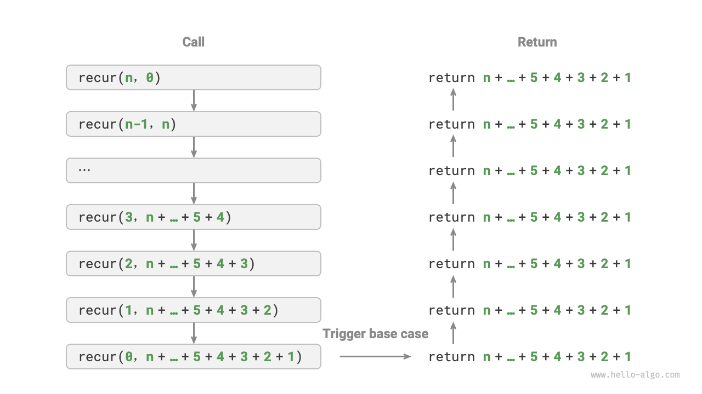

# 反復と再帰

アルゴリズムにおいて、タスクの繰り返し実行は非常に一般的であり、複雑度の分析と密接に関係しています。したがって、時間計算量と空間計算量の概念を詳しく学ぶ前に、まずプログラミングで繰り返しタスクを実装する方法を探究しましょう。これには、2つの基本的なプログラミング制御構造である反復と再帰の理解が含まれます。

## 反復

<u>反復</u>は、タスクを繰り返し実行するための制御構造です。反復では、プログラムは特定の条件が満たされている限りコードブロックを繰り返し実行し、この条件が満たされなくなるまで続けます。

### forループ

`for`ループは反復の最も一般的な形式の1つであり、**反復回数が事前に分かっている場合に特に適しています**。

以下の関数は`for`ループを使用して$1 + 2 + \dots + n$の合計を実行し、合計を変数`res`に格納します。Pythonでは、`range(a, b)`は`a`を含み`b`を除く区間を作成することに注意してください。つまり、$a$から$b−1$までの範囲で反復します。

```src
[file]{iteration}-[class]{}-[func]{for_loop}
```

以下の図はこの合計関数を表しています。


この合計関数での操作数は入力データのサイズ$n$に比例する、つまり線形関係があります。**この「線形関係」こそが時間計算量が記述するものです**。このトピックについては次のセクションで詳しく説明します。

### whileループ

`for`ループと同様に、`while`ループは反復を実装するためのもう1つのアプローチです。`while`ループでは、プログラムは各反復の開始時に条件をチェックし、条件が真の場合は実行を継続し、そうでなければループを終了します。

以下では`while`ループを使用して合計$1 + 2 + \dots + n$を実装します。

```src
[file]{iteration}-[class]{}-[func]{while_loop}
```

**`while`ループは`for`ループよりも柔軟性を提供します**。特に、条件変数のカスタム初期化と各ステップでの変更が可能です。

例えば、以下のコードでは、条件変数$i$が各ラウンドで2回更新されますが、これは`for`ループでは実装が不便です。

```src
[file]{iteration}-[class]{}-[func]{while_loop_ii}
```

全体的に、**`for`ループはより簡潔で、`while`ループはより柔軟です**。どちらも反復構造を実装できます。どちらを使用するかは、問題の具体的な要件に基づいて決定する必要があります。

### ネストしたループ

1つのループ構造を別のループ構造内にネストできます。以下は`for`ループを使用した例です：

```src
[file]{iteration}-[class]{}-[func]{nested_for_loop}
```

以下の図はこのネストしたループを表しています。


このような場合、関数の操作数は$n^2$に比例します。つまり、アルゴリズムの実行時間と入力データのサイズ$n$には「二次関係」があります。

さらにネストしたループを追加することで複雑度を高めることができ、各レベルのネストは事実上「次元を増加」させ、時間計算量を「三次」、「四次」などに引き上げます。

## 再帰

<u>再帰</u>は、関数が自分自身を呼び出すことで問題を解決するアルゴリズム戦略です。主に2つのフェーズが含まれます：

1. **呼び出し**: プログラムが自分自身を繰り返し呼び出し、しばしばより小さいまたはより単純な引数で、「終了条件」に向かって進みます。
2. **返却**: 「終了条件」がトリガーされると、プログラムは最も深い再帰関数から返り始め、各レイヤーの結果を集約します。

実装の観点から、再帰コードは主に3つの要素を含みます。

1. **終了条件**: 「呼び出し」から「返却」にいつ切り替えるかを決定します。
2. **再帰呼び出し**: 「呼び出し」に対応し、関数が自分自身を呼び出し、通常はより小さいまたはより単純化されたパラメータで行います。
3. **結果の返却**: 「返却」に対応し、現在の再帰レベルの結果が前のレイヤーに返されます。

以下のコードを観察してください。単純に関数`recur(n)`を呼び出すだけで$1 + 2 + \dots + n$の合計を計算できます：

```src
[file]{recursion}-[class]{}-[func]{recur}
```

以下の図はこの関数の再帰プロセスを示しています。


反復と再帰は計算の観点から同じ結果を達成できますが、**それらは思考と問題解決の全く異なるパラダイムを表します**。

- **反復**: 「ボトムアップ」で問題を解決します。最も基本的なステップから始まり、タスクが完了するまでこれらのステップを繰り返し追加または累積します。
- **再帰**: 「トップダウン」で問題を解決します。元の問題をより小さなサブ問題に分解し、各サブ問題は元の問題と同じ形式を持ちます。これらのサブ問題は、解が分かっているベースケースで停止するまで、さらに小さなサブ問題に分解されます。

先ほどの合計関数の例を取ってみましょう。$f(n) = 1 + 2 + \dots + n$として定義されます。

- **反復**: このアプローチでは、ループ内で合計プロセスをシミュレートします。$1$から始まり$n$まで横断し、各反復で合計操作を実行して最終的に$f(n)$を計算します。
- **再帰**: ここでは、問題はサブ問題に分解されます：$f(n) = n + f(n-1)$。この分解は、ベースケースの$f(1) = 1$に到達するまで再帰的に続き、そこで再帰が終了します。

### 呼び出しスタック

再帰関数が自分自身を呼び出すたびに、システムは新しく開始された関数にメモリを割り当てて、ローカル変数、戻りアドレス、その他の関連情報を格納します。これは2つの主要な結果をもたらします。

- 関数のコンテキストデータは「スタックフレーム空間」と呼ばれるメモリ領域に格納され、関数が返された後にのみ解放されます。したがって、**再帰は一般的に反復よりも多くのメモリ空間を消費します**。
- 再帰呼び出しは追加のオーバーヘッドを導入します。**したがって、再帰は通常ループよりも時間効率が劣ります。**

以下の図に示されているように、終了条件がトリガーされる前に$n$個の未返却の再帰関数があり、**再帰の深さが$n$であることを示しています**。


実際には、プログラミング言語で許可される再帰の深さは通常制限されており、過度に深い再帰はスタックオーバーフローエラーを引き起こす可能性があります。

### 末尾再帰

興味深いことに、**関数が返す直前の最後のステップとして再帰呼び出しを実行する場合**、コンパイラまたはインタープリターによって反復と同じ空間効率になるように最適化できます。このシナリオは<u>末尾再帰</u>として知られています。

- **通常の再帰**: 標準的な再帰では、関数が前のレベルに戻ったとき、さらにコードを実行し続けるため、システムは前の呼び出しのコンテキストを保存する必要があります。
- **末尾再帰**: ここでは、再帰呼び出しは関数が返す前の最終操作です。これは、前のレベルに戻った際に、さらなるアクションが必要ないことを意味するため、システムは前のレベルのコンテキストを保存する必要がありません。

例えば、$1 + 2 + \dots + n$の計算では、結果変数`res`を関数のパラメータにすることで、末尾再帰を実現できます：

```src
[file]{recursion}-[class]{}-[func]{tail_recur}
```

末尾再帰の実行プロセスは以下の図に示されています。通常の再帰と末尾再帰を比較すると、合計操作のポイントが異なります。

- **通常の再帰**: 合計操作は「返却」フェーズで発生し、各レイヤーが返った後にもう一度合計が必要です。
- **末尾再帰**: 合計操作は「呼び出し」フェーズで発生し、「返却」フェーズは各レイヤーを通じて返すだけです。



!!! tip

    多くのコンパイラやインタープリターは末尾再帰最適化をサポートしていないことに注意してください。例えば、Pythonはデフォルトで末尾再帰最適化をサポートしていないため、関数が末尾再帰の形式であっても、スタックオーバーフローの問題に遭遇する可能性があります。

### 再帰木

「分割統治」に関連するアルゴリズムを扱う際、再帰は反復よりもしばしばより直感的なアプローチとより読みやすいコードを提供します。「フィボナッチ数列」を例に取ってみましょう。

!!! question

    フィボナッチ数列$0, 1, 1, 2, 3, 5, 8, 13, \dots$が与えられた場合、数列の$n$番目の数を求めなさい。

フィボナッチ数列の$n$番目の数を$f(n)$とすると、2つの結論を簡単に導き出せます：

- 数列の最初の2つの数は$f(1) = 0$と$f(2) = 1$です。
- 数列の各数は前の2つの数の合計です。つまり、$f(n) = f(n - 1) + f(n - 2)$です。

再帰関係を使用し、最初の2つの数を終了条件として考慮すると、再帰コードを書けます。`fib(n)`を呼び出すとフィボナッチ数列の$n$番目の数が得られます：

```src
[file]{recursion}-[class]{}-[func]{fib}
```

上記のコードを観察すると、それ自体の中で2つの関数を再帰的に呼び出していることがわかります。**つまり、1回の呼び出しで2つの分岐呼び出しが生成されます**。以下の図に示されているように、この継続的な再帰呼び出しは最終的に深さ$n$の<u>再帰木</u>を作成します。


基本的に、再帰は「問題をより小さなサブ問題に分解する」パラダイムを体現しています。この分割統治戦略は重要です。

- アルゴリズムの観点から、探索、ソート、バックトラッキング、分割統治、動的プログラミングなどの多くの重要な戦略は、直接的または間接的にこの思考方法を使用しています。
- データ構造の観点から、再帰は連結リスト、木、グラフを扱うのに自然に適しており、これらは分割統治アプローチを使用した分析に適しているためです。

## 比較

上記の内容をまとめると、以下の表は実装、性能、適用性の観点から反復と再帰の違いを示しています。

<p align="center"> 表: 反復と再帰の特性の比較 </p>

|                   | 反復                                             | 再帰                                                                                           |
| ----------------- | ------------------------------------------------ | ---------------------------------------------------------------------------------------------- |
| アプローチ        | ループ構造                                       | 関数が自分自身を呼び出す                                                                       |
| 時間効率          | 一般的により高い効率、関数呼び出しのオーバーヘッドなし | 各関数呼び出しがオーバーヘッドを生成                                                           |
| メモリ使用量      | 通常は固定サイズのメモリ空間を使用               | 累積的な関数呼び出しが大量のスタックフレーム空間を使用する可能性                               |
| 適用可能な問題    | 単純なループタスクに適している、直感的で読みやすいコード | 問題の分解に適している（木、グラフ、分割統治、バックトラッキングなど）、簡潔で明確なコード構造 |

!!! tip

    以下の内容が理解しにくい場合は、「スタック」の章を読んだ後に再び訪れることを検討してください。

それでは、反復と再帰の本質的な関連は何でしょうか？上記の再帰関数を例に取ると、合計操作は再帰の「返却」フェーズで発生します。これは、最初に呼び出された関数が最後に合計操作を完了することを意味し、**スタックの「後入れ先出し」原理を反映しています**。

「呼び出しスタック」や「スタックフレーム空間」などの再帰用語は、再帰とスタックの密接な関係を示しています。

1. **呼び出し**: 関数が呼び出されると、システムは「呼び出しスタック」上にその関数用の新しいスタックフレームを割り当て、ローカル変数、パラメータ、戻りアドレス、その他のデータを格納します。
2. **返却**: 関数が実行を完了して返ると、対応するスタックフレームが「呼び出しスタック」から削除され、前の関数の実行環境が復元されます。

したがって、**明示的なスタックを使用して呼び出しスタックの動作をシミュレートできます**。これにより再帰を反復形式に変換できます：

```src
[file]{recursion}-[class]{}-[func]{for_loop_recur}
```

上記のコードを観察すると、再帰が反復に変換されたとき、コードはより複雑になります。反復と再帰はしばしば相互に変換できますが、2つの理由でそうすることが常に推奨されるわけではありません：

- 変換されたコードは理解がより困難になり、読みにくくなる可能性があります。
- 一部の複雑な問題では、システムの呼び出しスタックの動作をシミュレートすることは非常に困難です。

結論として、**反復または再帰を選択するかは問題の具体的な性質によります**。プログラミングの実践では、両方の長所と短所を比較検討し、手元の状況に最も適したアプローチを選択することが重要です。
