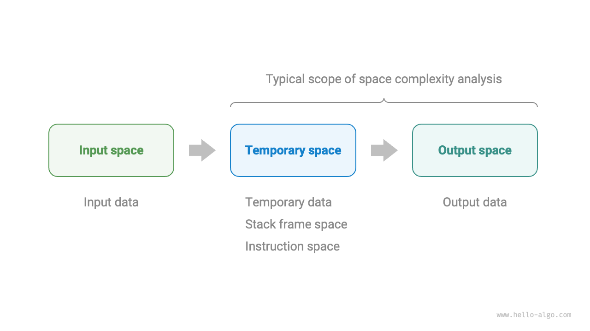
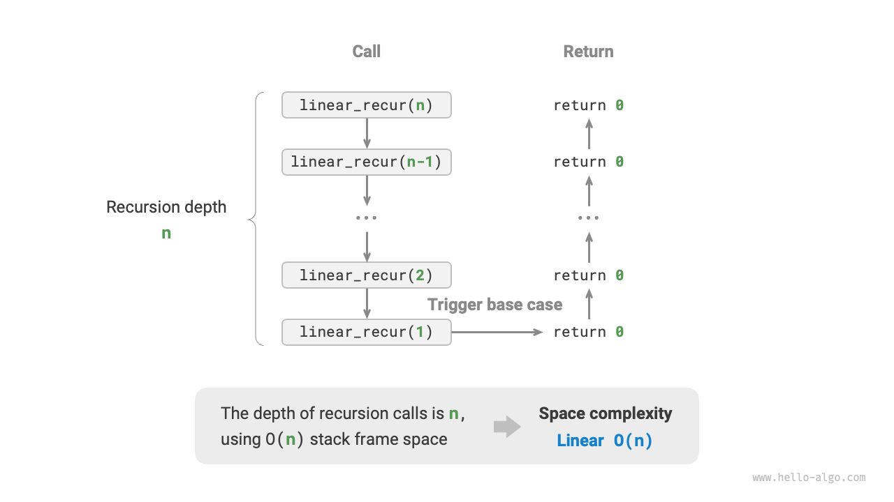

# 空間計算量

<u>空間計算量</u>は、データ量が増加するにつれてアルゴリズムが占有するメモリ空間の増加傾向を測定するために使用されます。この概念は時間計算量と非常に似ていますが、「実行時間」が「占有メモリ空間」に置き換えられています。

## アルゴリズムに関連する空間

アルゴリズムが実行中に使用するメモリ空間には、主に以下の種類があります。

- **入力空間**: アルゴリズムの入力データを格納するために使用されます。
- **一時空間**: アルゴリズムの実行中に変数、オブジェクト、関数コンテキスト、その他のデータを格納するために使用されます。
- **出力空間**: アルゴリズムの出力データを格納するために使用されます。

一般的に、空間計算量の統計範囲には「一時空間」と「出力空間」の両方が含まれます。

一時空間はさらに3つの部分に分けることができます。

- **一時データ**: アルゴリズムの実行中に様々な定数、変数、オブジェクトなどを保存するために使用されます。
- **スタックフレーム空間**: 呼び出された関数のコンテキストデータを保存するために使用されます。システムは関数が呼び出されるたびにスタックの頂上にスタックフレームを作成し、関数が返された後にスタックフレーム空間を解放します。
- **命令空間**: コンパイル済みプログラム命令を格納するために使用され、実際の統計では通常無視できます。

プログラムの空間計算量を分析する際、**通常は一時データ、スタックフレーム空間、出力データをカウントします**。以下の図に示されています。



関連するコードは以下の通りです：

=== "Python"

    ```python title=""
    class Node:
        """クラス"""
        def __init__(self, x: int):
            self.val: int = x               # ノード値
            self.next: Node | None = None   # 次のノードへの参照

    def function() -> int:
        """関数"""
        # 特定の操作を実行...
        return 0

    def algorithm(n) -> int:    # 入力データ
        A = 0                   # 一時データ（定数、通常大文字）
        b = 0                   # 一時データ（変数）
        node = Node(0)          # 一時データ（オブジェクト）
        c = function()          # スタックフレーム空間（関数呼び出し）
        return A + b + c        # 出力データ
    ```

=== "C++"

    ```cpp title=""
    /* 構造体 */
    struct Node {
        int val;
        Node *next;
        Node(int x) : val(x), next(nullptr) {}
    };

    /* 関数 */
    int func() {
        // 特定の操作を実行...
        return 0;
    }

    int algorithm(int n) {          // 入力データ
        const int a = 0;            // 一時データ（定数）
        int b = 0;                  // 一時データ（変数）
        Node* node = new Node(0);   // 一時データ（オブジェクト）
        int c = func();             // スタックフレーム空間（関数呼び出し）
        return a + b + c;           // 出力データ
    }
    ```

=== "Java"

    ```java title=""
    /* クラス */
    class Node {
        int val;
        Node next;
        Node(int x) { val = x; }
    }

    /* 関数 */
    int function() {
        // 特定の操作を実行...
        return 0;
    }

    int algorithm(int n) {          // 入力データ
        final int a = 0;            // 一時データ（定数）
        int b = 0;                  // 一時データ（変数）
        Node node = new Node(0);    // 一時データ（オブジェクト）
        int c = function();         // スタックフレーム空間（関数呼び出し）
        return a + b + c;           // 出力データ
    }
    ```

=== "C#"

    ```csharp title=""
    /* クラス */
    class Node {
        int val;
        Node next;
        Node(int x) { val = x; }
    }

    /* 関数 */
    int Function() {
        // 特定の操作を実行...
        return 0;
    }

    int Algorithm(int n) {  // 入力データ
        const int a = 0;    // 一時データ（定数）
        int b = 0;          // 一時データ（変数）
        Node node = new(0); // 一時データ（オブジェクト）
        int c = Function(); // スタックフレーム空間（関数呼び出し）
        return a + b + c;   // 出力データ
    }
    ```

=== "Go"

    ```go title=""
    /* 構造体 */
    type node struct {
        val  int
        next *node
    }

    /* ノード構造体を作成 */
    func newNode(val int) *node {
        return &node{val: val}
    }

    /* 関数 */
    func function() int {
        // 特定の操作を実行...
        return 0
    }

    func algorithm(n int) int { // 入力データ
        const a = 0             // 一時データ（定数）
        b := 0                  // 一時データ（変数）
        newNode(0)              // 一時データ（オブジェクト）
        c := function()         // スタックフレーム空間（関数呼び出し）
        return a + b + c        // 出力データ
    }
    ```

=== "Swift"

    ```swift title=""
    /* クラス */
    class Node {
        var val: Int
        var next: Node?

        init(x: Int) {
            val = x
        }
    }

    /* 関数 */
    func function() -> Int {
        // 特定の操作を実行...
        return 0
    }

    func algorithm(n: Int) -> Int { // 入力データ
        let a = 0                   // 一時データ（定数）
        var b = 0                   // 一時データ（変数）
        let node = Node(x: 0)       // 一時データ（オブジェクト）
        let c = function()          // スタックフレーム空間（関数呼び出し）
        return a + b + c            // 出力データ
    }
    ```

=== "JS"

    ```javascript title=""
    /* クラス */
    class Node {
        val;
        next;
        constructor(val) {
            this.val = val === undefined ? 0 : val; // ノード値
            this.next = null;                       // 次のノードへの参照
        }
    }

    /* 関数 */
    function constFunc() {
        // 特定の操作を実行
        return 0;
    }

    function algorithm(n) {         // 入力データ
        const a = 0;                // 一時データ（定数）
        let b = 0;                  // 一時データ（変数）
        const node = new Node(0);   // 一時データ（オブジェクト）
        const c = constFunc();      // スタックフレーム空間（関数呼び出し）
        return a + b + c;           // 出力データ
    }
    ```

=== "TS"

    ```typescript title=""
    /* クラス */
    class Node {
        val: number;
        next: Node | null;
        constructor(val?: number) {
            this.val = val === undefined ? 0 : val; // ノード値
            this.next = null;                       // 次のノードへの参照
        }
    }

    /* 関数 */
    function constFunc(): number {
        // 特定の操作を実行
        return 0;
    }

    function algorithm(n: number): number { // 入力データ
        const a = 0;                        // 一時データ（定数）
        let b = 0;                          // 一時データ（変数）
        const node = new Node(0);           // 一時データ（オブジェクト）
        const c = constFunc();              // スタックフレーム空間（関数呼び出し）
        return a + b + c;                   // 出力データ
    }
    ```

=== "Dart"

    ```dart title=""
    /* クラス */
    class Node {
      int val;
      Node next;
      Node(this.val, [this.next]);
    }

    /* 関数 */
    int function() {
      // 特定の操作を実行...
      return 0;
    }

    int algorithm(int n) {  // 入力データ
      const int a = 0;      // 一時データ（定数）
      int b = 0;            // 一時データ（変数）
      Node node = Node(0);  // 一時データ（オブジェクト）
      int c = function();   // スタックフレーム空間（関数呼び出し）
      return a + b + c;     // 出力データ
    }
    ```

=== "Rust"

    ```rust title=""
    use std::rc::Rc;
    use std::cell::RefCell;

    /* 構造体 */
    struct Node {
        val: i32,
        next: Option<Rc<RefCell<Node>>>,
    }

    /* コンストラクタ */
    impl Node {
        fn new(val: i32) -> Self {
            Self { val: val, next: None }
        }
    }

    /* 関数 */
    fn function() -> i32 {
        // 特定の操作を実行...
        return 0;
    }

    fn algorithm(n: i32) -> i32 {   // 入力データ
        const a: i32 = 0;           // 一時データ（定数）
        let mut b = 0;              // 一時データ（変数）
        let node = Node::new(0);    // 一時データ（オブジェクト）
        let c = function();         // スタックフレーム空間（関数呼び出し）
        return a + b + c;           // 出力データ
    }
    ```

=== "C"

    ```c title=""
    /* 関数 */
    int func() {
        // 特定の操作を実行...
        return 0;
    }

    int algorithm(int n) {  // 入力データ
        const int a = 0;    // 一時データ（定数）
        int b = 0;          // 一時データ（変数）
        int c = func();     // スタックフレーム空間（関数呼び出し）
        return a + b + c;   // 出力データ
    }
    ```

=== "Kotlin"

    ```kotlin title=""

    ```

=== "Zig"

    ```zig title=""

    ```

## 計算方法

空間計算量を計算する方法は時間計算量とほぼ同様で、統計対象を「操作数」から「使用空間のサイズ」に変更するだけです。

しかし、時間計算量とは異なり、**通常は最悪ケース空間計算量のみに焦点を当てます**。これは、メモリ空間がハード要件であり、すべての入力データの下で十分なメモリ空間が確保されていることを保証する必要があるためです。

以下のコードを考えてみましょう。最悪ケース空間計算量の「最悪ケース」という用語には2つの意味があります。

1. **最悪の入力データに基づく**: $n < 10$の場合、空間計算量は$O(1)$ですが、$n > 10$の場合、初期化された配列`nums`が$O(n)$の空間を占有するため、最悪ケース空間計算量は$O(n)$です。
2. **アルゴリズムの実行中に使用されるピークメモリに基づく**: 例えば、最後の行を実行する前、プログラムは$O(1)$の空間を占有します。配列`nums`を初期化する際、プログラムは$O(n)$の空間を占有するため、最悪ケース空間計算量は$O(n)$です。

=== "Python"

    ```python title=""
    def algorithm(n: int):
        a = 0               # O(1)
        b = [0] * 10000     # O(1)
        if n > 10:
            nums = [0] * n  # O(n)
    ```

=== "C++"

    ```cpp title=""
    void algorithm(int n) {
        int a = 0;               // O(1)
        vector<int> b(10000);    // O(1)
        if (n > 10)
            vector<int> nums(n); // O(n)
    }
    ```

=== "Java"

    ```java title=""
    void algorithm(int n) {
        int a = 0;                   // O(1)
        int[] b = new int[10000];    // O(1)
        if (n > 10)
            int[] nums = new int[n]; // O(n)
    }
    ```

=== "C#"

    ```csharp title=""
    void Algorithm(int n) {
        int a = 0;                   // O(1)
        int[] b = new int[10000];    // O(1)
        if (n > 10) {
            int[] nums = new int[n]; // O(n)
        }
    }
    ```

=== "Go"

    ```go title=""
    func algorithm(n int) {
        a := 0                      // O(1)
        b := make([]int, 10000)     // O(1)
        var nums []int
        if n > 10 {
            nums := make([]int, n)  // O(n)
        }
        fmt.Println(a, b, nums)
    }
    ```

=== "Swift"

    ```swift title=""
    func algorithm(n: Int) {
        let a = 0 // O(1)
        let b = Array(repeating: 0, count: 10000) // O(1)
        if n > 10 {
            let nums = Array(repeating: 0, count: n) // O(n)
        }
    }
    ```

=== "JS"

    ```javascript title=""
    function algorithm(n) {
        const a = 0;                   // O(1)
        const b = new Array(10000);    // O(1)
        if (n > 10) {
            const nums = new Array(n); // O(n)
        }
    }
    ```

=== "TS"

    ```typescript title=""
    function algorithm(n: number): void {
        const a = 0;                   // O(1)
        const b = new Array(10000);    // O(1)
        if (n > 10) {
            const nums = new Array(n); // O(n)
        }
    }
    ```

=== "Dart"

    ```dart title=""
    void algorithm(int n) {
      int a = 0;                            // O(1)
      List<int> b = List.filled(10000, 0);  // O(1)
      if (n > 10) {
        List<int> nums = List.filled(n, 0); // O(n)
      }
    }
    ```

=== "Rust"

    ```rust title=""
    fn algorithm(n: i32) {
        let a = 0;                           // O(1)
        let b = [0; 10000];                  // O(1)
        if n > 10 {
            let nums = vec![0; n as usize];  // O(n)
        }
    }
    ```

=== "C"

    ```c title=""
    void algorithm(int n) {
        int a = 0;               // O(1)
        int b[10000];            // O(1)
        if (n > 10)
            int nums[n] = {0};   // O(n)
    }
    ```

=== "Kotlin"

    ```kotlin title=""

    ```

=== "Zig"

    ```zig title=""

    ```

**再帰関数では、スタックフレーム空間を考慮に入れる必要があります**。以下のコードを考えてみましょう：

=== "Python"

    ```python title=""
    def function() -> int:
        # 特定の操作を実行
        return 0

    def loop(n: int):
        """ループ O(1)"""
        for _ in range(n):
            function()

    def recur(n: int):
        """再帰 O(n)"""
        if n == 1:
            return
        return recur(n - 1)
    ```

=== "C++"

    ```cpp title=""
    int func() {
        // 特定の操作を実行
        return 0;
    }
    /* サイクル O(1) */
    void loop(int n) {
        for (int i = 0; i < n; i++) {
            func();
        }
    }
    /* 再帰 O(n) */
    void recur(int n) {
        if (n == 1) return;
        recur(n - 1);
    }
    ```

=== "Java"

    ```java title=""
    int function() {
        // 特定の操作を実行
        return 0;
    }
    /* サイクル O(1) */
    void loop(int n) {
        for (int i = 0; i < n; i++) {
            function();
        }
    }
    /* 再帰 O(n) */
    void recur(int n) {
        if (n == 1) return;
        recur(n - 1);
    }
    ```

=== "C#"

    ```csharp title=""
    int Function() {
        // 特定の操作を実行
        return 0;
    }
    /* サイクル O(1) */
    void Loop(int n) {
        for (int i = 0; i < n; i++) {
            Function();
        }
    }
    /* 再帰 O(n) */
    int Recur(int n) {
        if (n == 1) return 1;
        return Recur(n - 1);
    }
    ```

=== "Go"

    ```go title=""
    func function() int {
        // 特定の操作を実行
        return 0
    }

    /* サイクル O(1) */
    func loop(n int) {
        for i := 0; i < n; i++ {
            function()
        }
    }

    /* 再帰 O(n) */
    func recur(n int) {
        if n == 1 {
            return
        }
        recur(n - 1)
    }
    ```

=== "Swift"

    ```swift title=""
    @discardableResult
    func function() -> Int {
        // 特定の操作を実行
        return 0
    }

    /* サイクル O(1) */
    func loop(n: Int) {
        for _ in 0 ..< n {
            function()
        }
    }

    /* 再帰 O(n) */
    func recur(n: Int) {
        if n == 1 {
            return
        }
        recur(n: n - 1)
    }
    ```

=== "JS"

    ```javascript title=""
    function constFunc() {
        // 特定の操作を実行
        return 0;
    }
    /* サイクル O(1) */
    function loop(n) {
        for (let i = 0; i < n; i++) {
            constFunc();
        }
    }
    /* 再帰 O(n) */
    function recur(n) {
        if (n === 1) return;
        return recur(n - 1);
    }
    ```

=== "TS"

    ```typescript title=""
    function constFunc(): number {
        // 特定の操作を実行
        return 0;
    }
    /* サイクル O(1) */
    function loop(n: number): void {
        for (let i = 0; i < n; i++) {
            constFunc();
        }
    }
    /* 再帰 O(n) */
    function recur(n: number): void {
        if (n === 1) return;
        return recur(n - 1);
    }
    ```

=== "Dart"

    ```dart title=""
    int function() {
      // 特定の操作を実行
      return 0;
    }
    /* サイクル O(1) */
    void loop(int n) {
      for (int i = 0; i < n; i++) {
        function();
      }
    }
    /* 再帰 O(n) */
    void recur(int n) {
      if (n == 1) return;
      recur(n - 1);
    }
    ```

=== "Rust"

    ```rust title=""
    fn function() -> i32 {
        // 特定の操作を実行
        return 0;
    }
    /* サイクル O(1) */
    fn loop(n: i32) {
        for i in 0..n {
            function();
        }
    }
    /* 再帰 O(n) */
    void recur(n: i32) {
        if n == 1 {
            return;
        }
        recur(n - 1);
    }
    ```

=== "C"

    ```c title=""
    int func() {
        // 特定の操作を実行
        return 0;
    }
    /* サイクル O(1) */
    void loop(int n) {
        for (int i = 0; i < n; i++) {
            func();
        }
    }
    /* 再帰 O(n) */
    void recur(int n) {
        if (n == 1) return;
        recur(n - 1);
    }
    ```

=== "Kotlin"

    ```kotlin title=""

    ```

=== "Zig"

    ```zig title=""

    ```

`loop()`関数と`recur()`関数の時間計算量は両方とも$O(n)$ですが、それらの空間計算量は異なります。

- `loop()`関数はループ内で`function()`を$n$回呼び出し、各反復の`function()`は返ってそのスタックフレーム空間を解放するため、空間計算量は$O(1)$のままです。
- 再帰関数`recur()`は実行中に$n$個の未返却の`recur()`インスタンスが同時に存在するため、$O(n)$のスタックフレーム空間を占有します。

## 一般的な種類

入力データのサイズを$n$とすると、下図は一般的な空間計算量の種類を示しています（低いものから高いものへと並べられています）。

$$
\begin{aligned}
& O(1) < O(\log n) < O(n) < O(n^2) < O(2^n) \newline
& \text{定数} < \text{対数} < \text{線形} < \text{二次} < \text{指数}
\end{aligned}
$$


### 定数オーダー $O(1)$

定数オーダーは、入力データサイズ$n$とは無関係な定数、変数、オブジェクトで一般的です。

ループで変数を初期化したり関数を呼び出したりするために占有されるメモリは、次のサイクルに入る際に解放され、空間上で累積されないため、空間計算量は$O(1)$のままです：

```src
[file]{space_complexity}-[class]{}-[func]{constant}
```

### 線形オーダー $O(n)$

線形オーダーは配列、連結リスト、スタック、キューなどで一般的で、要素数は$n$に比例します：

```src
[file]{space_complexity}-[class]{}-[func]{linear}
```

下図に示されているように、この関数の再帰深度は$n$で、$n$個の未返却の`linear_recur()`関数インスタンスがあり、$O(n)$サイズのスタックフレーム空間を使用します：

```src
[file]{space_complexity}-[class]{}-[func]{linear_recur}
```



### 二次オーダー $O(n^2)$

二次オーダーは行列やグラフで一般的で、要素数は$n$の二乗に比例します：

```src
[file]{space_complexity}-[class]{}-[func]{quadratic}
```

下図に示されているように、この関数の再帰深度は$n$で、各再帰呼び出しで長さ$n$、$n-1$、$\dots$、$2$、$1$の配列が初期化され、平均$n/2$となり、全体として$O(n^2)$の空間を占有します：

```src
[file]{space_complexity}-[class]{}-[func]{quadratic_recur}
```


### 指数オーダー $O(2^n)$

指数オーダーは二分木で一般的です。下図を観察すると、$n$レベルの「完全二分木」は$2^n - 1$個のノードを持ち、$O(2^n)$の空間を占有します：

```src
[file]{space_complexity}-[class]{}-[func]{build_tree}
```


### 対数オーダー $O(\log n)$

対数オーダーは分割統治アルゴリズムで一般的です。例えば、マージソートでは、長さ$n$の配列が各ラウンドで再帰的に半分に分割され、高さ$\log n$の再帰木を形成し、$O(\log n)$のスタックフレーム空間を使用します。

別の例は、数値を文字列に変換することです。正の整数$n$が与えられた場合、その桁数は$\log_{10} n + 1$で、文字列の長さに対応するため、空間計算量は$O(\log_{10} n + 1) = O(\log n)$です。

## 時間と空間のバランス

理想的には、時間計算量と空間計算量の両方が最適であることを目指します。しかし、実際には両方を同時に最適化することはしばしば困難です。

**時間計算量を下げることは通常、空間計算量の増加を代償とし、その逆も同様です**。アルゴリズムの速度を向上させるためにメモリ空間を犠牲にするアプローチは「時空トレードオフ」として知られ、その逆は「空時トレードオフ」として知られています。

選択は、どちらの側面をより重視するかに依存します。ほとんどの場合、時間は空間よりも貴重であるため、「時空トレードオフ」がより一般的な戦略です。もちろん、大量のデータを扱う際は空間計算量を制御することも非常に重要です。
