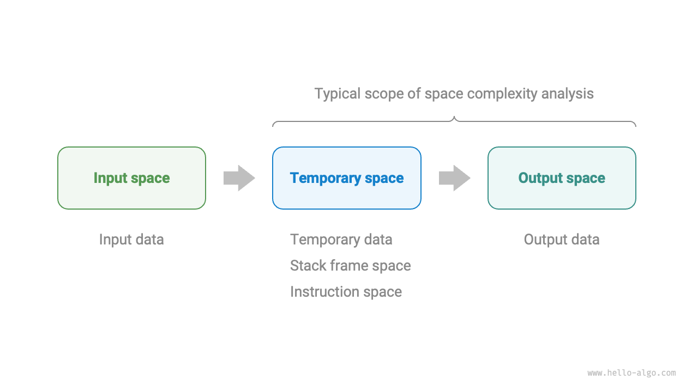
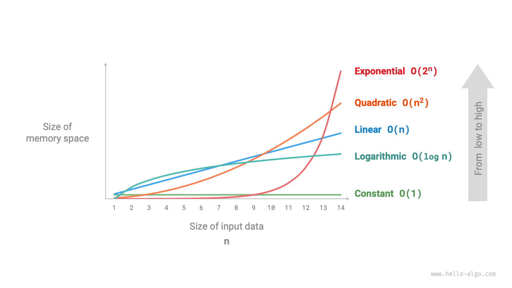
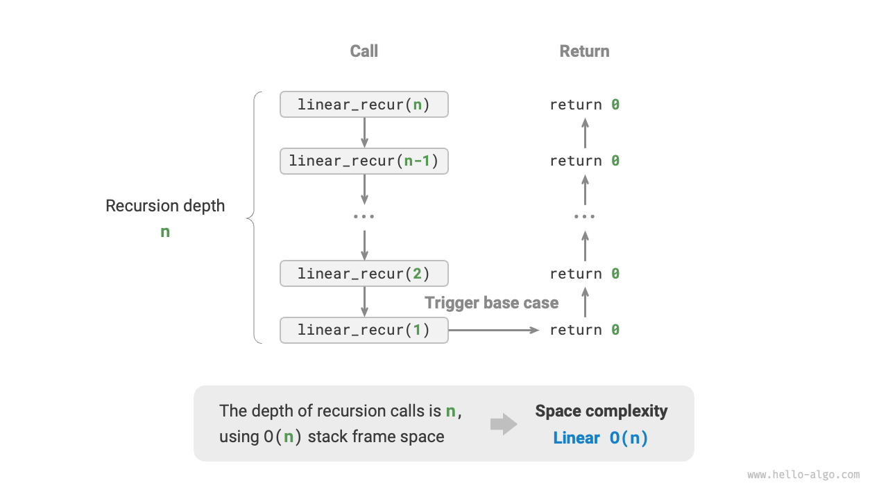
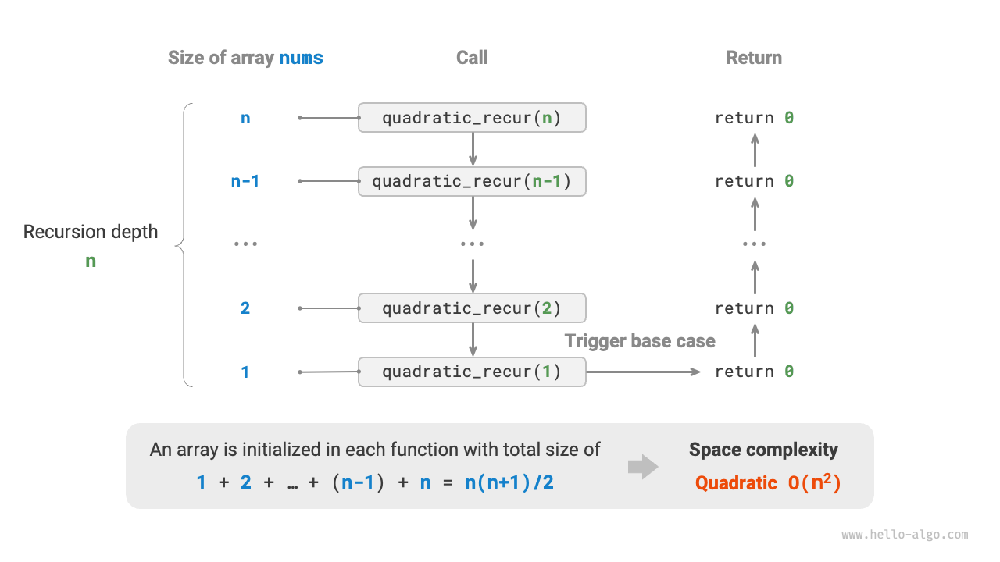
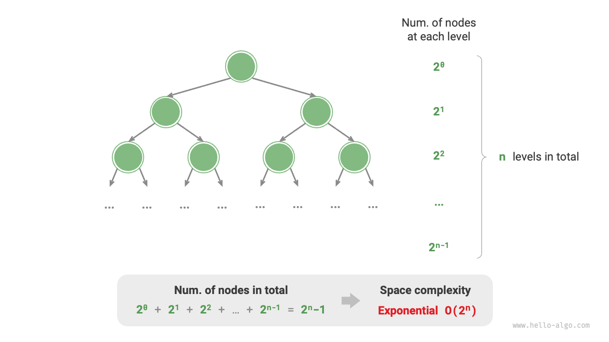

# 空間計算量

<u>空間計算量（space complexity）</u>は、アルゴリズムが占有するメモリ空間がデータ量の増加に伴ってどのように増えるかを測る指標です。この概念は時間計算量と非常によく似ており、「実行時間」を「占有メモリ空間」に置き換えるだけです。

## アルゴリズムに関連する空間

アルゴリズムが実行中に使用するメモリ空間には、主に次の種類があります。

- **入力空間**：アルゴリズムの入力データを格納するための空間。
- **一時空間**：アルゴリズムの実行中に使用する変数、オブジェクト、関数コンテキストなどのデータを格納するための空間。
- **出力空間**：アルゴリズムの出力データを格納するための空間。

一般に、空間計算量の集計範囲は「一時空間」と「出力空間」を合わせたものです。

一時空間はさらに三つに分けられます。

- **一時データ**：アルゴリズム実行中の各種定数、変数、オブジェクトなどを保存するための空間。
- **スタックフレーム空間**：呼び出された関数のコンテキストデータを保存するための空間。システムは関数を呼び出すたびにスタックの先頭にスタックフレームを作成し、関数が戻るとその空間を解放します。
- **命令空間**：コンパイル後のプログラム命令を保存するための空間で、実際の集計では通常無視されます。

プログラムの空間計算量を分析する際には、**通常、一時データ、スタックフレーム空間、出力データの三つを数えます**。以下の図に示すとおりです。



関連するコードを以下に示します。

=== "Python"

    ```python title=""
    class Node:
        """クラス"""
        def __init__(self, x: int):
            self.val: int = x              # ノードの値
            self.next: Node | None = None  # 次のノードへの参照

    def function() -> int:
        """関数"""
        # いくつかの処理を実行...
        return 0

    def algorithm(n) -> int:  # 入力データ
        A = 0                 # 一時データ（定数。一般に大文字で表す）
        b = 0                 # 一時データ（変数）
        node = Node(0)        # 一時データ（オブジェクト）
        c = function()        # スタックフレーム空間（関数呼び出し）
        return A + b + c      # 出力データ
    ```

=== "C++"

    ```cpp title=""
    /* 構造体 */
    struct Node {
        int val;
        Node *next;
        Node(int x) : val(x), next(nullptr) {}
    };

    /* 関数 */
    int func() {
        // いくつかの処理を実行...
        return 0;
    }

    int algorithm(int n) {        // 入力データ
        const int a = 0;          // 一時データ（定数）
        int b = 0;                // 一時データ（変数）
        Node* node = new Node(0); // 一時データ（オブジェクト）
        int c = func();           // スタックフレーム空間（関数呼び出し）
        return a + b + c;         // 出力データ
    }
    ```

=== "Java"

    ```java title=""
    /* クラス */
    class Node {
        int val;
        Node next;
        Node(int x) { val = x; }
    }
    
    /* 関数 */
    int function() {
        // いくつかの処理を実行...
        return 0;
    }
    
    int algorithm(int n) {        // 入力データ
        final int a = 0;          // 一時データ（定数）
        int b = 0;                // 一時データ（変数）
        Node node = new Node(0);  // 一時データ（オブジェクト）
        int c = function();       // スタックフレーム空間（関数呼び出し）
        return a + b + c;         // 出力データ
    }
    ```

=== "C#"

    ```csharp title=""
    /* クラス */
    class Node(int x) {
        int val = x;
        Node next;
    }

    /* 関数 */
    int Function() {
        // いくつかの処理を実行...
        return 0;
    }

    int Algorithm(int n) {        // 入力データ
        const int a = 0;          // 一時データ（定数）
        int b = 0;                // 一時データ（変数）
        Node node = new(0);       // 一時データ（オブジェクト）
        int c = Function();       // スタックフレーム空間（関数呼び出し）
        return a + b + c;         // 出力データ
    }
    ```

=== "Go"

    ```go title=""
    /* 構造体 */
    type node struct {
        val  int
        next *node
    }

    /* node 構造体を作成 */
    func newNode(val int) *node {
        return &node{val: val}
    }
    
    /* 関数 */
    func function() int {
        // いくつかの処理を実行...
        return 0
    }

    func algorithm(n int) int { // 入力データ
        const a = 0             // 一時データ（定数）
        b := 0                  // 一時データ（変数）
        newNode(0)              // 一時データ（オブジェクト）
        c := function()         // スタックフレーム空間（関数呼び出し）
        return a + b + c        // 出力データ
    }
    ```

=== "Swift"

    ```swift title=""
    /* クラス */
    class Node {
        var val: Int
        var next: Node?

        init(x: Int) {
            val = x
        }
    }

    /* 関数 */
    func function() -> Int {
        // いくつかの処理を実行...
        return 0
    }

    func algorithm(n: Int) -> Int { // 入力データ
        let a = 0             // 一時データ（定数）
        var b = 0             // 一時データ（変数）
        let node = Node(x: 0) // 一時データ（オブジェクト）
        let c = function()    // スタックフレーム空間（関数呼び出し）
        return a + b + c      // 出力データ
    }
    ```

=== "JS"

    ```javascript title=""
    /* クラス */
    class Node {
        val;
        next;
        constructor(val) {
            this.val = val === undefined ? 0 : val; // ノードの値
            this.next = null;                       // 次のノードへの参照
        }
    }

    /* 関数 */
    function constFunc() {
        // いくつかの処理を実行
        return 0;
    }

    function algorithm(n) {       // 入力データ
        const a = 0;              // 一時データ（定数）
        let b = 0;                // 一時データ（変数）
        const node = new Node(0); // 一時データ（オブジェクト）
        const c = constFunc();    // スタックフレーム空間（関数呼び出し）
        return a + b + c;         // 出力データ
    }
    ```

=== "TS"

    ```typescript title=""
    /* クラス */
    class Node {
        val: number;
        next: Node | null;
        constructor(val?: number) {
            this.val = val === undefined ? 0 : val; // ノードの値
            this.next = null;                       // 次のノードへの参照
        }
    }

    /* 関数 */
    function constFunc(): number {
        // いくつかの処理を実行
        return 0;
    }

    function algorithm(n: number): number { // 入力データ
        const a = 0;                        // 一時データ（定数）
        let b = 0;                          // 一時データ（変数）
        const node = new Node(0);           // 一時データ（オブジェクト）
        const c = constFunc();              // スタックフレーム空間（関数呼び出し）
        return a + b + c;                   // 出力データ
    }
    ```

=== "Dart"

    ```dart title=""
    /* クラス */
    class Node {
      int val;
      Node next;
      Node(this.val, [this.next]);
    }

    /* 関数 */
    int function() {
      // いくつかの処理を実行...
      return 0;
    }

    int algorithm(int n) {  // 入力データ
      const int a = 0;      // 一時データ（定数）
      int b = 0;            // 一時データ（変数）
      Node node = Node(0);  // 一時データ（オブジェクト）
      int c = function();   // スタックフレーム空間（関数呼び出し）
      return a + b + c;     // 出力データ
    }
    ```

=== "Rust"

    ```rust title=""
    use std::rc::Rc;
    use std::cell::RefCell;
    
    /* 構造体 */
    struct Node {
        val: i32,
        next: Option<Rc<RefCell<Node>>>,
    }

    /* Node 構造体を作成 */
    impl Node {
        fn new(val: i32) -> Self {
            Self { val: val, next: None }
        }
    }

    /* 関数 */
    fn function() -> i32 {      
        // いくつかの処理を実行...
        return 0;
    }

    fn algorithm(n: i32) -> i32 {       // 入力データ
        const a: i32 = 0;               // 一時データ（定数）
        let mut b = 0;                  // 一時データ（変数）
        let node = Node::new(0);        // 一時データ（オブジェクト）
        let c = function();             // スタックフレーム空間（関数呼び出し）
        return a + b + c;               // 出力データ
    }
    ```

=== "C"

    ```c title=""
    /* 関数 */
    int func() {
        // いくつかの処理を実行...
        return 0;
    }

    int algorithm(int n) { // 入力データ
        const int a = 0;   // 一時データ（定数）
        int b = 0;         // 一時データ（変数）
        int c = func();    // スタックフレーム空間（関数呼び出し）
        return a + b + c;  // 出力データ
    }
    ```

=== "Kotlin"

    ```kotlin title=""
    /* クラス */
    class Node(var _val: Int) {
        var next: Node? = null
    }

    /* 関数 */
    fun function(): Int {
        // いくつかの処理を実行...
        return 0
    }

    fun algorithm(n: Int): Int { // 入力データ
        val a = 0                // 一時データ（定数）
        var b = 0                // 一時データ（変数）
        val node = Node(0)       // 一時データ（オブジェクト）
        val c = function()       // スタックフレーム空間（関数呼び出し）
        return a + b + c         // 出力データ
    }
    ```

=== "Ruby"

    ```ruby title=""
    ### クラス ###
    class Node
        attr_accessor :val      # ノードの値
        attr_accessor :next     # 次のノードへの参照

        def initialize(x)
            @val = x
        end
    end

    ### 関数 ###
    def function
        # いくつかの処理を実行...
        0
    end

    ### アルゴリズム ###
    def algorithm(n)        # 入力データ
        a = 0               # 一時データ（定数）
        b = 0               # 一時データ（変数）
        node = Node.new(0)  # 一時データ（オブジェクト）
        c = function        # スタックフレーム空間（関数呼び出し）
        a + b + c           # 出力データ
    end
    ```

## 推定方法

空間計算量の推定方法は時間計算量とおおむね同じで、数える対象を「操作回数」から「使用空間の大きさ」に変えるだけです。

ただし時間計算量と異なり、**通常は最悪空間計算量だけに注目します**。メモリ空間は厳格な要件であり、どの入力データに対しても十分なメモリを確保できることを保証しなければならないからです。

以下のコードを見ると、最悪空間計算量における「最悪」には二つの意味があります。

1. **最悪の入力データを基準にする**：$n < 10$ のとき空間計算量は $O(1)$ ですが、$n > 10$ のとき初期化される配列 `nums` が $O(n)$ の空間を占有するため、最悪空間計算量は $O(n)$ です。
2. **アルゴリズム実行中のメモリ使用量のピークを基準にする**：例えば、プログラムは最後の行を実行する前までは $O(1)$ の空間しか使いませんが、配列 `nums` を初期化するときには $O(n)$ の空間を占有するため、最悪空間計算量は $O(n)$ です。

=== "Python"

    ```python title=""
    def algorithm(n: int):
        a = 0               # O(1)
        b = [0] * 10000     # O(1)
        if n > 10:
            nums = [0] * n  # O(n)
    ```

=== "C++"

    ```cpp title=""
    void algorithm(int n) {
        int a = 0;               // O(1)
        vector<int> b(10000);    // O(1)
        if (n > 10)
            vector<int> nums(n); // O(n)
    }
    ```

=== "Java"

    ```java title=""
    void algorithm(int n) {
        int a = 0;                   // O(1)
        int[] b = new int[10000];    // O(1)
        if (n > 10)
            int[] nums = new int[n]; // O(n)
    }
    ```

=== "C#"

    ```csharp title=""
    void Algorithm(int n) {
        int a = 0;                   // O(1)
        int[] b = new int[10000];    // O(1)
        if (n > 10) {
            int[] nums = new int[n]; // O(n)
        }
    }
    ```

=== "Go"

    ```go title=""
    func algorithm(n int) {
        a := 0                      // O(1)
        b := make([]int, 10000)     // O(1)
        var nums []int
        if n > 10 {
            nums := make([]int, n)  // O(n)
        }
        fmt.Println(a, b, nums)
    }
    ```

=== "Swift"

    ```swift title=""
    func algorithm(n: Int) {
        let a = 0 // O(1)
        let b = Array(repeating: 0, count: 10000) // O(1)
        if n > 10 {
            let nums = Array(repeating: 0, count: n) // O(n)
        }
    }
    ```

=== "JS"

    ```javascript title=""
    function algorithm(n) {
        const a = 0;                   // O(1)
        const b = new Array(10000);    // O(1)
        if (n > 10) {
            const nums = new Array(n); // O(n)
        }
    }
    ```

=== "TS"

    ```typescript title=""
    function algorithm(n: number): void {
        const a = 0;                   // O(1)
        const b = new Array(10000);    // O(1)
        if (n > 10) {
            const nums = new Array(n); // O(n)
        }
    }
    ```

=== "Dart"

    ```dart title=""
    void algorithm(int n) {
      int a = 0;                            // O(1)
      List<int> b = List.filled(10000, 0);  // O(1)
      if (n > 10) {
        List<int> nums = List.filled(n, 0); // O(n)
      }
    }
    ```

=== "Rust"

    ```rust title=""
    fn algorithm(n: i32) {
        let a = 0;                              // O(1)
        let b = [0; 10000];                     // O(1)
        if n > 10 {
            let nums = vec![0; n as usize];     // O(n)
        }
    }
    ```

=== "C"

    ```c title=""
    void algorithm(int n) {
        int a = 0;               // O(1)
        int b[10000];            // O(1)
        if (n > 10)
            int nums[n] = {0};   // O(n)
    }
    ```

=== "Kotlin"

    ```kotlin title=""
    fun algorithm(n: Int) {
        val a = 0                    // O(1)
        val b = IntArray(10000)      // O(1)
        if (n > 10) {
            val nums = IntArray(n)   // O(n)
        }
    }
    ```

=== "Ruby"

    ```ruby title=""
    def algorithm(n)
        a = 0                           # O(1)
        b = Array.new(10000)            # O(1)
        nums = Array.new(n) if n > 10   # O(n)
    end
    ```

**再帰関数では、スタックフレーム空間の集計に注意が必要です**。以下のコードを見てみましょう。

=== "Python"

    ```python title=""
    def function() -> int:
        # いくつかの処理を実行
        return 0

    def loop(n: int):
        """ループの空間計算量は O(1)"""
        for _ in range(n):
            function()

    def recur(n: int):
        """再帰の空間計算量は O(n)"""
        if n == 1:
            return
        return recur(n - 1)
    ```

=== "C++"

    ```cpp title=""
    int func() {
        // いくつかの処理を実行
        return 0;
    }
    /* ループの空間計算量は O(1) */
    void loop(int n) {
        for (int i = 0; i < n; i++) {
            func();
        }
    }
    /* 再帰の空間計算量は O(n) */
    void recur(int n) {
        if (n == 1) return;
        recur(n - 1);
    }
    ```

=== "Java"

    ```java title=""
    int function() {
        // いくつかの処理を実行
        return 0;
    }
    /* ループの空間計算量は O(1) */
    void loop(int n) {
        for (int i = 0; i < n; i++) {
            function();
        }
    }
    /* 再帰の空間計算量は O(n) */
    void recur(int n) {
        if (n == 1) return;
        recur(n - 1);
    }
    ```

=== "C#"

    ```csharp title=""
    int Function() {
        // いくつかの処理を実行
        return 0;
    }
    /* ループの空間計算量は O(1) */
    void Loop(int n) {
        for (int i = 0; i < n; i++) {
            Function();
        }
    }
    /* 再帰の空間計算量は O(n) */
    int Recur(int n) {
        if (n == 1) return 1;
        return Recur(n - 1);
    }
    ```

=== "Go"

    ```go title=""
    func function() int {
        // いくつかの処理を実行
        return 0
    }
    
    /* ループの空間計算量は O(1) */
    func loop(n int) {
        for i := 0; i < n; i++ {
            function()
        }
    }
    
    /* 再帰の空間計算量は O(n) */
    func recur(n int) {
        if n == 1 {
            return
        }
        recur(n - 1)
    }
    ```

=== "Swift"

    ```swift title=""
    @discardableResult
    func function() -> Int {
        // いくつかの処理を実行
        return 0
    }

    /* ループの空間計算量は O(1) */
    func loop(n: Int) {
        for _ in 0 ..< n {
            function()
        }
    }

    /* 再帰の空間計算量は O(n) */
    func recur(n: Int) {
        if n == 1 {
            return
        }
        recur(n: n - 1)
    }
    ```

=== "JS"

    ```javascript title=""
    function constFunc() {
        // いくつかの処理を実行
        return 0;
    }
    /* ループの空間計算量は O(1) */
    function loop(n) {
        for (let i = 0; i < n; i++) {
            constFunc();
        }
    }
    /* 再帰の空間計算量は O(n) */
    function recur(n) {
        if (n === 1) return;
        return recur(n - 1);
    }
    ```

=== "TS"

    ```typescript title=""
    function constFunc(): number {
        // いくつかの処理を実行
        return 0;
    }
    /* ループの空間計算量は O(1) */
    function loop(n: number): void {
        for (let i = 0; i < n; i++) {
            constFunc();
        }
    }
    /* 再帰の空間計算量は O(n) */
    function recur(n: number): void {
        if (n === 1) return;
        return recur(n - 1);
    }
    ```

=== "Dart"

    ```dart title=""
    int function() {
      // いくつかの処理を実行
      return 0;
    }
    /* ループの空間計算量は O(1) */
    void loop(int n) {
      for (int i = 0; i < n; i++) {
        function();
      }
    }
    /* 再帰の空間計算量は O(n) */
    void recur(int n) {
      if (n == 1) return;
      recur(n - 1);
    }
    ```

=== "Rust"

    ```rust title=""
    fn function() -> i32 {
        // いくつかの処理を実行
        return 0;
    }
    /* ループの空間計算量は O(1) */
    fn loop(n: i32) {
        for i in 0..n {
            function();
        }
    }
    /* 再帰の空間計算量は O(n) */
    fn recur(n: i32) {
        if n == 1 {
            return;
        }
        recur(n - 1);
    }
    ```

=== "C"

    ```c title=""
    int func() {
        // いくつかの処理を実行
        return 0;
    }
    /* ループの空間計算量は O(1) */
    void loop(int n) {
        for (int i = 0; i < n; i++) {
            func();
        }
    }
    /* 再帰の空間計算量は O(n) */
    void recur(int n) {
        if (n == 1) return;
        recur(n - 1);
    }
    ```

=== "Kotlin"

    ```kotlin title=""
    fun function(): Int {
        // いくつかの処理を実行
        return 0
    }
    /* ループの空間計算量は O(1) */
    fun loop(n: Int) {
        for (i in 0..<n) {
            function()
        }
    }
    /* 再帰の空間計算量は O(n) */
    fun recur(n: Int) {
        if (n == 1) return
        return recur(n - 1)
    }
    ```

=== "Ruby"

    ```ruby title=""
    def function
        # いくつかの処理を実行
        0
    end

    ### ループの空間計算量は O(1) ###
    def loop(n)
        (0...n).each { function }
    end

    ### 再帰の空間計算量は O(n) ###
    def recur(n)
        return if n == 1
        recur(n - 1)
    end
    ```

関数 `loop()` と `recur()` はどちらも時間計算量は $O(n)$ ですが、空間計算量は異なります。

- 関数 `loop()` はループの中で `function()` を $n$ 回呼び出しますが、各反復での `function()` は戻るたびにスタックフレーム空間が解放されるため、空間計算量は依然として $O(1)$ です。
- 再帰関数 `recur()` は実行中に未返却の `recur()` が同時に $n$ 個存在するため、$O(n)$ のスタックフレーム空間を占有します。

## よくある型

入力データサイズを $n$ とすると、以下の図はよくある空間計算量の型を低い順から高い順に示しています。

$$
\begin{aligned}
& O(1) < O(\log n) < O(n) < O(n^2) < O(2^n) \newline
& \text{定数階} < \text{対数階} < \text{線形階} < \text{平方階} < \text{指数階}
\end{aligned}
$$



### 定数階 $O(1)$

定数階は、個数が入力データサイズ $n$ に依存しない定数、変数、オブジェクトなどによく現れます。

注意すべき点として、ループ内で変数を初期化したり関数を呼び出したりして使用されたメモリは、次の反復に入ると解放されるため、空間の占有は累積せず、空間計算量は依然として $O(1)$ です。

```src
[file]{space_complexity}-[class]{}-[func]{constant}
```

### 線形階 $O(n)$

線形階は、要素数が $n$ に比例する配列、連結リスト、スタック、キューなどによく現れます。

```src
[file]{space_complexity}-[class]{}-[func]{linear}
```

以下の図に示すように、この関数の再帰の深さは $n$ であり、同時に $n$ 個の未返却 `linear_recur()` 関数が存在するため、$O(n)$ のスタックフレーム空間を使用します。

```src
[file]{space_complexity}-[class]{}-[func]{linear_recur}
```



### 平方階 $O(n^2)$

平方階は、要素数が $n$ の二乗に比例する行列やグラフによく現れます。

```src
[file]{space_complexity}-[class]{}-[func]{quadratic}
```

以下の図に示すように、この関数の再帰の深さは $n$ であり、各再帰関数の中で長さがそれぞれ $n$、$n-1$、$\dots$、$2$、$1$ の配列を初期化しています。平均長は $n / 2$ なので、全体では $O(n^2)$ の空間を占有します。

```src
[file]{space_complexity}-[class]{}-[func]{quadratic_recur}
```



### 指数階 $O(2^n)$

指数階は二分木によく現れます。以下の図を見ると、高さが $n$ の「満二分木」のノード数は $2^n - 1$ であり、$O(2^n)$ の空間を占有します。

```src
[file]{space_complexity}-[class]{}-[func]{build_tree}
```



### 対数階 $O(\log n)$

対数階は分割統治アルゴリズムによく現れます。例えばマージソートでは、長さ $n$ の配列を入力として、各再帰で配列を中央から二つに分割するため、高さ $\log n$ の再帰木が形成され、$O(\log n)$ のスタックフレーム空間を使用します。

また、数値を文字列に変換する場合を考えると、正の整数 $n$ の桁数は $\lfloor \log_{10} n \rfloor + 1$ であり、対応する文字列長も $\lfloor \log_{10} n \rfloor + 1$ です。したがって空間計算量は $O(\log_{10} n + 1) = O(\log n)$ となります。

## 時間と空間のトレードオフ

理想的には、アルゴリズムの時間計算量と空間計算量の両方を最適にしたいところです。しかし実際には、この二つを同時に最適化するのは通常きわめて困難です。

**時間計算量を下げるには、通常、空間計算量を増やす代償が必要であり、その逆も同様です**。メモリ空間を犠牲にして実行速度を上げる考え方を「空間を時間と引き換えにする」と呼び、その逆を「時間を空間と引き換えにする」と呼びます。

どちらの考え方を選ぶかは、何をより重視するかによって決まります。多くの場合、空間より時間のほうが貴重なので、「空間を時間と引き換えにする」戦略のほうが一般的です。もちろん、データ量が非常に大きい場合には、空間計算量を抑えることも同じくらい重要です。
