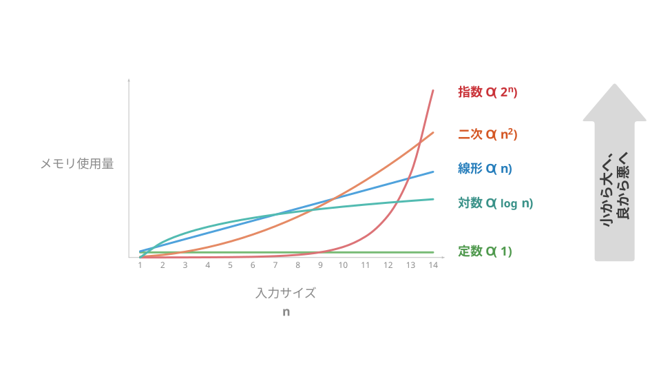

# 空間計算量

<u>空間計算量（space complexity）</u>は、データ量が増えるにつれて、アルゴリズムのメモリ使用量がどのように増えるかを測ります。時間計算量とよく似ており、「実行時間」を「メモリ使用量」に置き換えた概念です。

## アルゴリズムに関わる空間

実行中に使うメモリ空間は、主に次の種類に分かれます。

- **入力空間**：入力データを保存します。
- **一時空間**：実行中の変数、オブジェクト、関数の実行状態などを保存します。
- **出力空間**：出力データを保存します。

通常、空間計算量には「一時空間」と「出力空間」を含めます。

一時空間は、さらに三つに分けられます。

- **一時データ**：実行中の定数、変数、オブジェクトなどを保存します。
- **スタックフレーム**：呼び出した関数の実行状態を保存します。関数を呼ぶたびにスタックの先頭にフレームが作られ、戻ると解放されます。
- **命令空間**：コンパイルされた命令を保存します。実際の集計では通常、無視します。

プログラムの空間計算量では、下図のように、**通常は一時データ、スタックフレーム、出力データの三つを数えます**。


関連するコードを次に示します。

```snippet
space_categories
```

## 見積もり方

空間計算量の見積もり方は時間計算量とほぼ同じで、数える対象を「操作回数」から「使う空間の大きさ」に変えます。

ただし時間計算量と異なり、**通常は最悪空間計算量だけに注目します**。メモリ容量は必ず満たすべき要件であり、どの入力でも十分なメモリを確保できるようにする必要があるためです。

次のコードでは、「最悪」には二つの意味があります。

1. **最悪の入力を基準にする**：$n < 10$ なら $O(1)$ ですが、$n > 10$ なら配列 `nums` が $O(n)$ の空間を使うため、最悪空間計算量は $O(n)$ です。
2. **実行中の最大メモリ使用量を基準にする**：たとえば、最後の行の実行前は $O(1)$ ですが、配列 `nums` を初期化すると $O(n)$ の空間を使うため、最悪空間計算量は $O(n)$ です。

```snippet
worst_case_space
```

**再帰関数では、スタックフレームを数え忘れないよう注意が必要です**。次のコードを見てください。

```snippet
loop_vs_recursion_space
```

関数 `loop()` と `recur()` の時間計算量はどちらも $O(n)$ ですが、空間計算量は異なります。

- `loop()` は `function()` を $n$ 回呼びますが、毎回戻ってスタックフレームを解放するため、空間計算量は $O(1)$ のままです。
- 再帰関数 `recur()` では、戻っていない `recur()` が同時に $n$ 個存在するため、スタックフレームに $O(n)$ の空間を使います。

## 代表的な種類

入力の大きさを $n$ とし、代表的な空間計算量を小さい順に下図に示します。

$$
\begin{aligned}
& O(1) < O(\log n) < O(n) < O(n^2) < O(2^n) \newline
& \text{定数} < \text{対数} < \text{線形} < \text{二乗} < \text{指数}
\end{aligned}
$$



### 定数のオーダー $O(1)$

定数のオーダーは、入力の大きさ $n$ によって個数が変わらない定数、変数、オブジェクトによく見られます。

ループ内の変数の初期化や関数呼び出しで使ったメモリは、次の反復に入ると解放され、累積しないため、空間計算量は $O(1)$ のままです。

```src
[file]{space_complexity}-[class]{}-[func]{constant}
```

### 線形のオーダー $O(n)$

線形のオーダーは、要素数が $n$ に比例する配列、連結リスト、スタック、キューなどによく見られます。

```src
[file]{space_complexity}-[class]{}-[func]{linear}
```

下図の関数は再帰深度が $n$ で、まだ戻っていない `linear_recur()` が同時に $n$ 個存在するため、スタックフレームに $O(n)$ の空間を使います。

```src
[file]{space_complexity}-[class]{}-[func]{linear_recur}
```


### 二乗のオーダー $O(n^2)$

二乗のオーダーは、要素数が $n$ の二乗に比例する行列やグラフによく見られます。

```src
[file]{space_complexity}-[class]{}-[func]{quadratic}
```

下図の関数は再帰深度が $n$ で、各呼び出しで長さ $n$、$n-1$、$\dots$、$2$、$1$ の配列を初期化します。平均の長さは $n / 2$ なので、全体では $O(n^2)$ の空間を使います。

```src
[file]{space_complexity}-[class]{}-[func]{quadratic_recur}
```


### 指数のオーダー $O(2^n)$

指数のオーダーは二分木によく見られます。下図の、層数が $n$ の「パーフェクト二分木」はノード数が $2^n - 1$ で、$O(2^n)$ の空間を使います。

```src
[file]{space_complexity}-[class]{}-[func]{build_tree}
```


### 対数のオーダー $O(\log n)$

対数のオーダーは分割統治によく見られます。たとえばマージソートは、長さ $n$ の配列を各再帰で中央から半分に分け、高さ $\log n$ の再帰木を作るため、スタックフレームに $O(\log n)$ の空間を使います。

数値から文字列への変換も例になります。正の整数 $n$ の桁数は $\lfloor \log_{10} n \rfloor + 1$ なので、文字列の長さも $\lfloor \log_{10} n \rfloor + 1$ です。したがって、空間計算量は $O(\log_{10} n + 1) = O(\log n)$ です。

## 時間と空間のトレードオフ

理想的には、時間計算量も空間計算量も最適にしたいところです。しかし実際には、両方を同時に最適化するのは非常に難しいことが多いです。

**時間計算量を減らすには、空間計算量を増やす必要があることが多く、その逆も同様です**。メモリを使って実行を速くする考え方を「空間を使って時間を節約する」、その逆を「時間を使って空間を節約する」と呼びます。

どちらを選ぶかは、何を重視するかによります。多くの場合、空間より時間の方が貴重なため、空間を使って時間を節約する戦略が一般的です。ただし、データ量が非常に多い場合は、空間計算量を抑えることも重要です。
