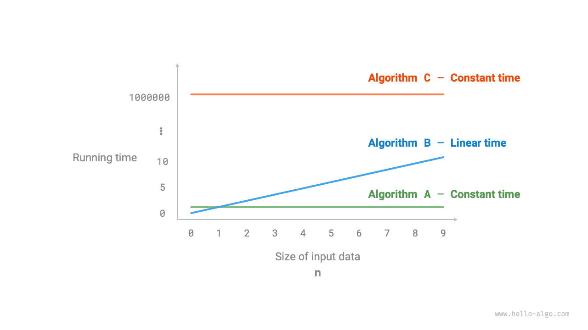
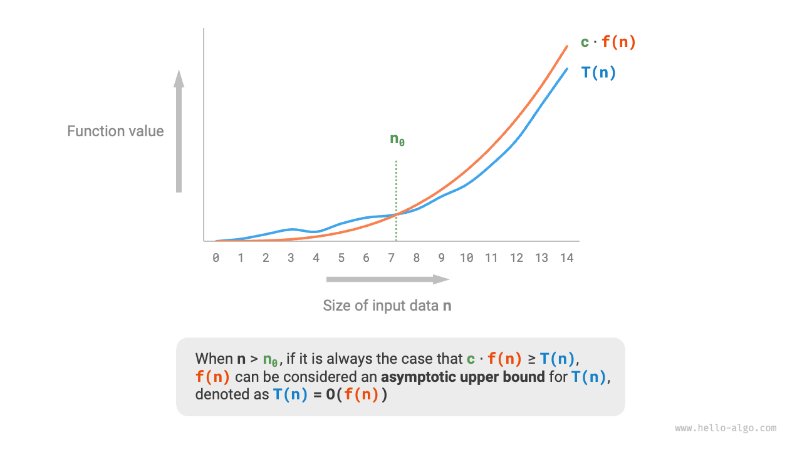
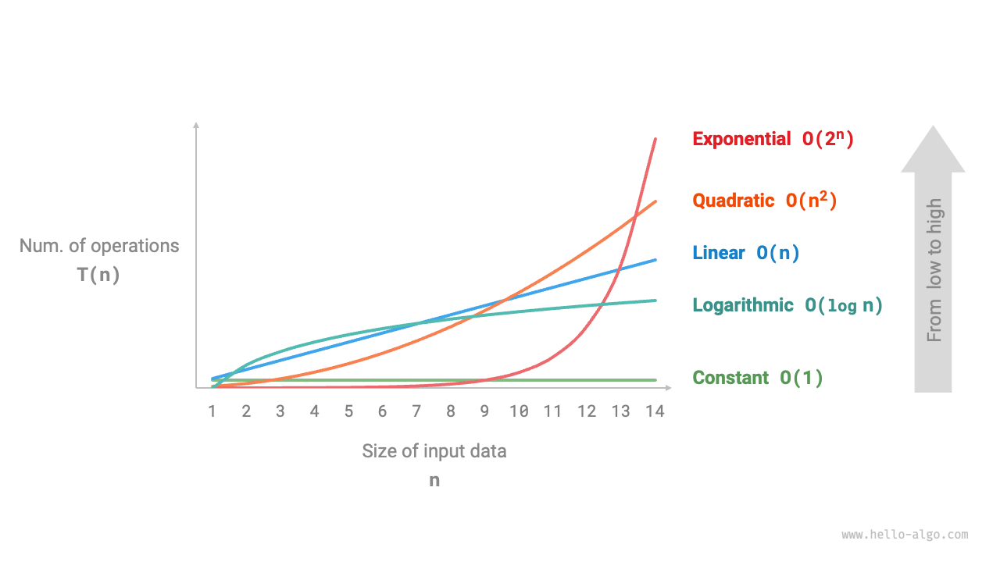
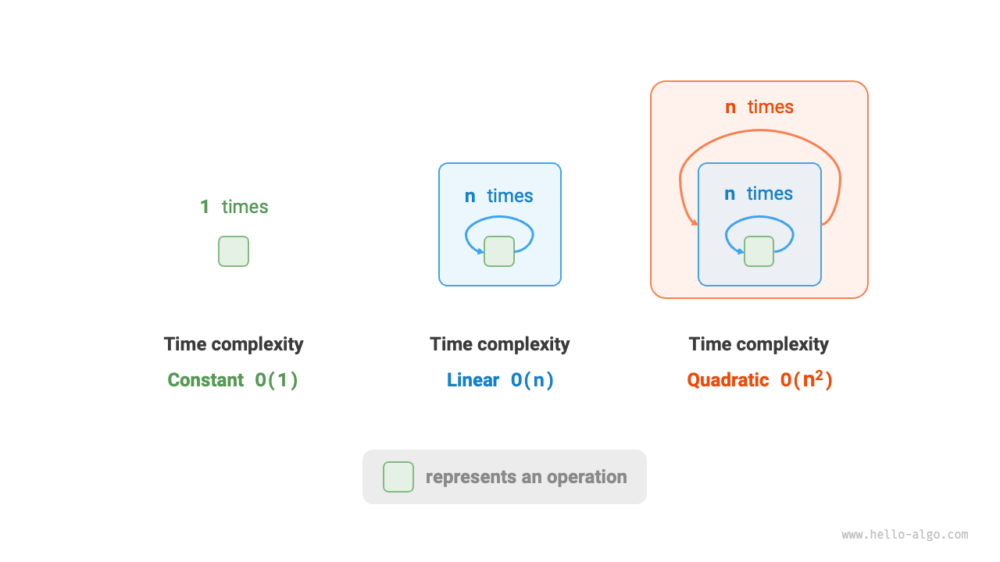
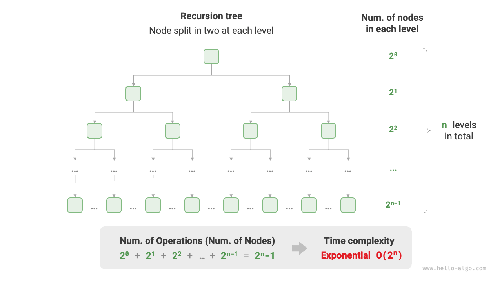
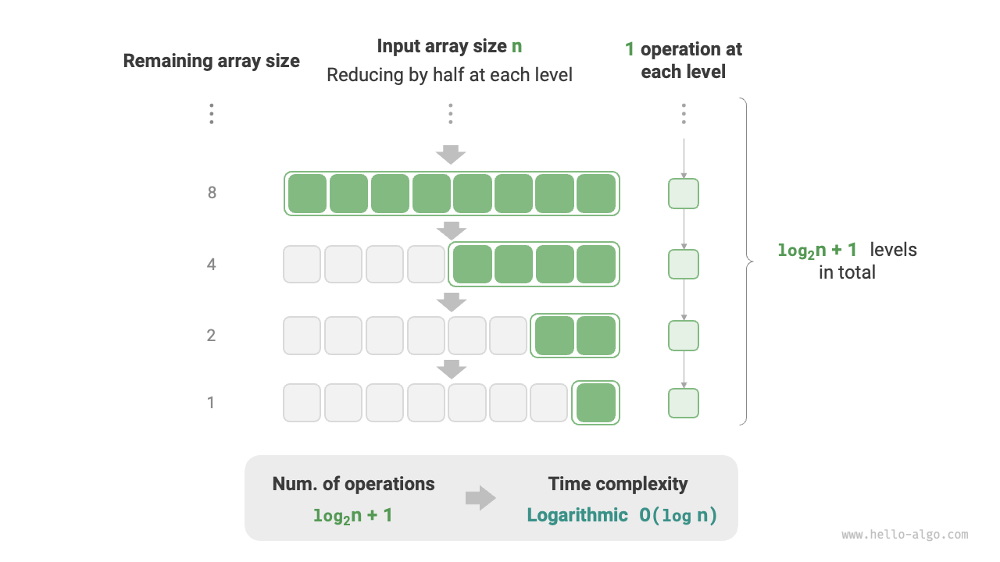

# 時間計算量

実行時間は、アルゴリズムの効率を直感的に評価できます。アルゴリズムの実行時間を正確に推定するにはどうすればよいでしょうか？

1. **実行プラットフォームの決定**: これには、ハードウェア構成、プログラミング言語、システム環境などが含まれ、これらすべてがコードの実行効率に影響する可能性があります。
2. **様々な計算操作の実行時間の評価**: 例えば、加算操作`+`は1 ns、乗算操作`*`は10 ns、印刷操作`print()`は5 nsなどかかる可能性があります。
3. **コード内のすべての計算操作をカウント**: これらすべての操作の実行時間を合計すると、総実行時間が得られます。

例えば、入力サイズが$n$の以下のコードを考えてみましょう：

=== "Python"

    ```python title=""
    # 特定の操作プラットフォーム下で
    def algorithm(n: int):
        a = 2      # 1 ns
        a = a + 1  # 1 ns
        a = a * 2  # 10 ns
        # n回ループ
        for _ in range(n):  # 1 ns
            print(0)        # 5 ns
    ```

=== "C++"

    ```cpp title=""
    // 特定の操作プラットフォーム下で
    void algorithm(int n) {
        int a = 2;  // 1 ns
        a = a + 1;  // 1 ns
        a = a * 2;  // 10 ns
        // n回ループ
        for (int i = 0; i < n; i++) {  // 1 ns, 毎回i++が実行される
            cout << 0 << endl;         // 5 ns
        }
    }
    ```

=== "Java"

    ```java title=""
    // 特定の操作プラットフォーム下で
    void algorithm(int n) {
        int a = 2;  // 1 ns
        a = a + 1;  // 1 ns
        a = a * 2;  // 10 ns
        // n回ループ
        for (int i = 0; i < n; i++) {  // 1 ns, 毎回i++が実行される
            System.out.println(0);     // 5 ns
        }
    }
    ```

=== "C#"

    ```csharp title=""
    // 特定の操作プラットフォーム下で
    void Algorithm(int n) {
        int a = 2;  // 1 ns
        a = a + 1;  // 1 ns
        a = a * 2;  // 10 ns
        // n回ループ
        for (int i = 0; i < n; i++) {  // 1 ns, 毎回i++が実行される
            Console.WriteLine(0);      // 5 ns
        }
    }
    ```

=== "Go"

    ```go title=""
    // 特定の操作プラットフォーム下で
    func algorithm(n int) {
        a := 2     // 1 ns
        a = a + 1  // 1 ns
        a = a * 2  // 10 ns
        // n回ループ
        for i := 0; i < n; i++ {  // 1 ns
            fmt.Println(a)        // 5 ns
        }
    }
    ```

=== "Swift"

    ```swift title=""
    // 特定の操作プラットフォーム下で
    func algorithm(n: Int) {
        var a = 2 // 1 ns
        a = a + 1 // 1 ns
        a = a * 2 // 10 ns
        // n回ループ
        for _ in 0 ..< n { // 1 ns
            print(0) // 5 ns
        }
    }
    ```

=== "JS"

    ```javascript title=""
    // 特定の操作プラットフォーム下で
    function algorithm(n) {
        var a = 2; // 1 ns
        a = a + 1; // 1 ns
        a = a * 2; // 10 ns
        // n回ループ
        for(let i = 0; i < n; i++) { // 1 ns, 毎回i++が実行される
            console.log(0); // 5 ns
        }
    }
    ```

=== "TS"

    ```typescript title=""
    // 特定の操作プラットフォーム下で
    function algorithm(n: number): void {
        var a: number = 2; // 1 ns
        a = a + 1; // 1 ns
        a = a * 2; // 10 ns
        // n回ループ
        for(let i = 0; i < n; i++) { // 1 ns, 毎回i++が実行される
            console.log(0); // 5 ns
        }
    }
    ```

=== "Dart"

    ```dart title=""
    // 特定の操作プラットフォーム下で
    void algorithm(int n) {
      int a = 2; // 1 ns
      a = a + 1; // 1 ns
      a = a * 2; // 10 ns
      // n回ループ
      for (int i = 0; i < n; i++) { // 1 ns, 毎回i++が実行される
        print(0); // 5 ns
      }
    }
    ```

=== "Rust"

    ```rust title=""
    // 特定の操作プラットフォーム下で
    fn algorithm(n: i32) {
        let mut a = 2;      // 1 ns
        a = a + 1;          // 1 ns
        a = a * 2;          // 10 ns
        // n回ループ
        for _ in 0..n {     // 毎回i++で1 ns
            println!("{}", 0);  // 5 ns
        }
    }
    ```

=== "C"

    ```c title=""
    // 特定の操作プラットフォーム下で
    void algorithm(int n) {
        int a = 2;  // 1 ns
        a = a + 1;  // 1 ns
        a = a * 2;  // 10 ns
        // n回ループ
        for (int i = 0; i < n; i++) {   // 1 ns, 毎回i++が実行される
            printf("%d", 0);            // 5 ns
        }
    }
    ```

=== "Kotlin"

    ```kotlin title=""

    ```

=== "Zig"

    ```zig title=""
    // 特定の操作プラットフォーム下で
    fn algorithm(n: usize) void {
        var a: i32 = 2; // 1 ns
        a += 1; // 1 ns
        a *= 2; // 10 ns
        // n回ループ
        for (0..n) |_| { // 1 ns
            std.debug.print("{}\n", .{0}); // 5 ns
        }
    }
    ```

上記の方法を使用すると、アルゴリズムの実行時間は$(6n + 12)$ nsとして計算できます：

$$
1 + 1 + 10 + (1 + 5) \times n = 6n + 12
$$

しかし、実際には、**アルゴリズムの実行時間をカウントすることは実用的でも合理的でもありません**。第一に、推定時間を実行プラットフォームに結び付けたくありません。アルゴリズムは様々なプラットフォームで実行される必要があるからです。第二に、各種操作の実行時間を知ることは困難であり、推定プロセスを難しくします。

## 時間増加傾向の評価

時間計算量分析は、アルゴリズムの実行時間をカウントするのではなく、**データ量が増加するにつれての実行時間の増加傾向**を分析します。

この「時間増加傾向」の概念を例で理解しましょう。入力データサイズを$n$とし、3つのアルゴリズム`A`、`B`、`C`を考えてみます：

=== "Python"

    ```python title=""
    # アルゴリズムAの時間計算量：定数オーダー
    def algorithm_A(n: int):
        print(0)
    # アルゴリズムBの時間計算量：線形オーダー
    def algorithm_B(n: int):
        for _ in range(n):
            print(0)
    # アルゴリズムCの時間計算量：定数オーダー
    def algorithm_C(n: int):
        for _ in range(1000000):
            print(0)
    ```

=== "C++"

    ```cpp title=""
    // アルゴリズムAの時間計算量：定数オーダー
    void algorithm_A(int n) {
        cout << 0 << endl;
    }
    // アルゴリズムBの時間計算量：線形オーダー
    void algorithm_B(int n) {
        for (int i = 0; i < n; i++) {
            cout << 0 << endl;
        }
    }
    // アルゴリズムCの時間計算量：定数オーダー
    void algorithm_C(int n) {
        for (int i = 0; i < 1000000; i++) {
            cout << 0 << endl;
        }
    }
    ```

=== "Java"

    ```java title=""
    // アルゴリズムAの時間計算量：定数オーダー
    void algorithm_A(int n) {
        System.out.println(0);
    }
    // アルゴリズムBの時間計算量：線形オーダー
    void algorithm_B(int n) {
        for (int i = 0; i < n; i++) {
            System.out.println(0);
        }
    }
    // アルゴリズムCの時間計算量：定数オーダー
    void algorithm_C(int n) {
        for (int i = 0; i < 1000000; i++) {
            System.out.println(0);
        }
    }
    ```

=== "C#"

    ```csharp title=""
    // アルゴリズムAの時間計算量：定数オーダー
    void AlgorithmA(int n) {
        Console.WriteLine(0);
    }
    // アルゴリズムBの時間計算量：線形オーダー
    void AlgorithmB(int n) {
        for (int i = 0; i < n; i++) {
            Console.WriteLine(0);
        }
    }
    // アルゴリズムCの時間計算量：定数オーダー
    void AlgorithmC(int n) {
        for (int i = 0; i < 1000000; i++) {
            Console.WriteLine(0);
        }
    }
    ```

=== "Go"

    ```go title=""
    // アルゴリズムAの時間計算量：定数オーダー
    func algorithm_A(n int) {
        fmt.Println(0)
    }
    // アルゴリズムBの時間計算量：線形オーダー
    func algorithm_B(n int) {
        for i := 0; i < n; i++ {
            fmt.Println(0)
        }
    }
    // アルゴリズムCの時間計算量：定数オーダー
    func algorithm_C(n int) {
        for i := 0; i < 1000000; i++ {
            fmt.Println(0)
        }
    }
    ```

=== "Swift"

    ```swift title=""
    // アルゴリズムAの時間計算量：定数オーダー
    func algorithmA(n: Int) {
        print(0)
    }

    // アルゴリズムBの時間計算量：線形オーダー
    func algorithmB(n: Int) {
        for _ in 0 ..< n {
            print(0)
        }
    }

    // アルゴリズムCの時間計算量：定数オーダー
    func algorithmC(n: Int) {
        for _ in 0 ..< 1_000_000 {
            print(0)
        }
    }
    ```

=== "JS"

    ```javascript title=""
    // アルゴリズムAの時間計算量：定数オーダー
    function algorithm_A(n) {
        console.log(0);
    }
    // アルゴリズムBの時間計算量：線形オーダー
    function algorithm_B(n) {
        for (let i = 0; i < n; i++) {
            console.log(0);
        }
    }
    // アルゴリズムCの時間計算量：定数オーダー
    function algorithm_C(n) {
        for (let i = 0; i < 1000000; i++) {
            console.log(0);
        }
    }

    ```

=== "TS"

    ```typescript title=""
    // アルゴリズムAの時間計算量：定数オーダー
    function algorithm_A(n: number): void {
        console.log(0);
    }
    // アルゴリズムBの時間計算量：線形オーダー
    function algorithm_B(n: number): void {
        for (let i = 0; i < n; i++) {
            console.log(0);
        }
    }
    // アルゴリズムCの時間計算量：定数オーダー
    function algorithm_C(n: number): void {
        for (let i = 0; i < 1000000; i++) {
            console.log(0);
        }
    }
    ```

=== "Dart"

    ```dart title=""
    // アルゴリズムAの時間計算量：定数オーダー
    void algorithmA(int n) {
      print(0);
    }
    // アルゴリズムBの時間計算量：線形オーダー
    void algorithmB(int n) {
      for (int i = 0; i < n; i++) {
        print(0);
      }
    }
    // アルゴリズムCの時間計算量：定数オーダー
    void algorithmC(int n) {
      for (int i = 0; i < 1000000; i++) {
        print(0);
      }
    }
    ```

=== "Rust"

    ```rust title=""
    // アルゴリズムAの時間計算量：定数オーダー
    fn algorithm_A(n: i32) {
        println!("{}", 0);
    }
    // アルゴリズムBの時間計算量：線形オーダー
    fn algorithm_B(n: i32) {
        for _ in 0..n {
            println!("{}", 0);
        }
    }
    // アルゴリズムCの時間計算量：定数オーダー
    fn algorithm_C(n: i32) {
        for _ in 0..1000000 {
            println!("{}", 0);
        }
    }
    ```

=== "C"

    ```c title=""
    // アルゴリズムAの時間計算量：定数オーダー
    void algorithm_A(int n) {
        printf("%d", 0);
    }
    // アルゴリズムBの時間計算量：線形オーダー
    void algorithm_B(int n) {
        for (int i = 0; i < n; i++) {
            printf("%d", 0);
        }
    }
    // アルゴリズムCの時間計算量：定数オーダー
    void algorithm_C(int n) {
        for (int i = 0; i < 1000000; i++) {
            printf("%d", 0);
        }
    }
    ```

=== "Kotlin"

    ```kotlin title=""

    ```

=== "Zig"

    ```zig title=""
    // アルゴリズムAの時間計算量：定数オーダー
    fn algorithm_A(n: usize) void {
        _ = n;
        std.debug.print("{}\n", .{0});
    }
    // アルゴリズムBの時間計算量：線形オーダー
    fn algorithm_B(n: i32) void {
        for (0..n) |_| {
            std.debug.print("{}\n", .{0});
        }
    }
    // アルゴリズムCの時間計算量：定数オーダー
    fn algorithm_C(n: i32) void {
        _ = n;
        for (0..1000000) |_| {
            std.debug.print("{}\n", .{0});
        }
    }
    ```

下図はこれら3つのアルゴリズムの時間計算量を示しています。

- アルゴリズム`A`には1つの印刷操作のみがあり、その実行時間は$n$とともに増加しません。その時間計算量は「定数オーダー」と考えられます。
- アルゴリズム`B`には$n$回ループする印刷操作があり、その実行時間は$n$と線形に増加します。その時間計算量は「線形オーダー」です。
- アルゴリズム`C`には1,000,000回ループする印刷操作があります。時間はかかりますが、入力データサイズ$n$とは無関係です。したがって、`C`の時間計算量は`A`と同じ「定数オーダー」です。



アルゴリズムの実行時間を直接カウントすることと比較して、時間計算量分析の特徴は何でしょうか？

- **時間計算量はアルゴリズムの効率を効果的に評価します**。例えば、アルゴリズム`B`は線形に増加する実行時間を持ち、$n > 1$の時はアルゴリズム`A`より遅く、$n > 1,000,000$の時は`C`より遅くなります。実際、入力データサイズ$n$が十分に大きい限り、「定数オーダー」複雑度アルゴリズムは常に「線形オーダー」よりも優れており、時間増加傾向の本質を示しています。
- **時間計算量分析はより直感的です**。明らかに、実行プラットフォームと計算操作の種類は実行時間増加の傾向とは無関係です。したがって、時間計算量分析では、すべての計算操作の実行時間を同じ「単位時間」として扱うことができ、「計算操作実行時間カウント」を「計算操作カウント」に単純化できます。これにより推定の複雑さが大幅に軽減されます。
- **時間計算量には制限があります**。例えば、アルゴリズム`A`と`C`は同じ時間計算量を持ちますが、実際の実行時間は大きく異なる場合があります。同様に、アルゴリズム`B`は`C`よりも高い時間計算量を持ちますが、入力データサイズ$n$が小さい場合は明らかに優れています。これらの場合、時間計算量のみに基づいてアルゴリズムの効率を判断することは困難です。しかし、これらの問題にもかかわらず、複雑度分析はアルゴリズムの効率を評価するための最も効果的で一般的に使用される方法です。

## 漸近上限

入力サイズが$n$の関数を考えてみましょう：

=== "Python"

    ```python title=""
    def algorithm(n: int):
        a = 1      # +1
        a = a + 1  # +1
        a = a * 2  # +1
        # n回ループ
        for i in range(n):  # +1
            print(0)        # +1
    ```

=== "C++"

    ```cpp title=""
    void algorithm(int n) {
        int a = 1;  // +1
        a = a + 1;  // +1
        a = a * 2;  // +1
        // n回ループ
        for (int i = 0; i < n; i++) { // +1 (毎回i++が実行される)
            cout << 0 << endl;    // +1
        }
    }
    ```

=== "Java"

    ```java title=""
    void algorithm(int n) {
        int a = 1;  // +1
        a = a + 1;  // +1
        a = a * 2;  // +1
        // n回ループ
        for (int i = 0; i < n; i++) { // +1 (毎回i++が実行される)
            System.out.println(0);    // +1
        }
    }
    ```

=== "C#"

    ```csharp title=""
    void Algorithm(int n) {
        int a = 1;  // +1
        a = a + 1;  // +1
        a = a * 2;  // +1
        // n回ループ
        for (int i = 0; i < n; i++) {   // +1 (毎回i++が実行される)
            Console.WriteLine(0);   // +1
        }
    }
    ```

=== "Go"

    ```go title=""
    func algorithm(n int) {
        a := 1      // +1
        a = a + 1   // +1
        a = a * 2   // +1
        // n回ループ
        for i := 0; i < n; i++ {   // +1
            fmt.Println(a)         // +1
        }
    }
    ```

=== "Swift"

    ```swift title=""
    func algorithm(n: Int) {
        var a = 1 // +1
        a = a + 1 // +1
        a = a * 2 // +1
        // n回ループ
        for _ in 0 ..< n { // +1
            print(0) // +1
        }
    }
    ```

=== "JS"

    ```javascript title=""
    function algorithm(n) {
        var a = 1; // +1
        a += 1; // +1
        a *= 2; // +1
        // n回ループ
        for(let i = 0; i < n; i++){ // +1 (毎回i++が実行される)
            console.log(0); // +1
        }
    }
    ```

=== "TS"

    ```typescript title=""
    function algorithm(n: number): void{
        var a: number = 1; // +1
        a += 1; // +1
        a *= 2; // +1
        // n回ループ
        for(let i = 0; i < n; i++){ // +1 (毎回i++が実行される)
            console.log(0); // +1
        }
    }
    ```

=== "Dart"

    ```dart title=""
    void algorithm(int n) {
      int a = 1; // +1
      a = a + 1; // +1
      a = a * 2; // +1
      // n回ループ
      for (int i = 0; i < n; i++) { // +1 (毎回i++が実行される)
        print(0); // +1
      }
    }
    ```

=== "Rust"

    ```rust title=""
    fn algorithm(n: i32) {
        let mut a = 1;   // +1
        a = a + 1;      // +1
        a = a * 2;      // +1

        // n回ループ
        for _ in 0..n { // +1 (毎回i++が実行される)
            println!("{}", 0); // +1
        }
    }
    ```

=== "C"

    ```c title=""
    void algorithm(int n) {
        int a = 1;  // +1
        a = a + 1;  // +1
        a = a * 2;  // +1
        // n回ループ
        for (int i = 0; i < n; i++) {   // +1 (毎回i++が実行される)
            printf("%d", 0);            // +1
        }
    }
    ```

=== "Kotlin"

    ```kotlin title=""

    ```

=== "Zig"

    ```zig title=""
    fn algorithm(n: usize) void {
        var a: i32 = 1; // +1
        a += 1; // +1
        a *= 2; // +1
        // n回ループ
        for (0..n) |_| { // +1 (毎回i++が実行される)
            std.debug.print("{}\n", .{0}); // +1
        }
    }
    ```

アルゴリズムの操作数を入力サイズ$n$の関数として表す関数を$T(n)$とすると、以下の例を考えてみましょう：

$$
T(n) = 3 + 2n
$$

$T(n)$は線形関数であるため、その増加傾向は線形であり、したがって、その時間計算量は線形オーダーで、$O(n)$と表記されます。この数学記法は<u>ビッグO記法</u>として知られ、関数$T(n)$の<u>漸近上限</u>を表します。

本質的に、時間計算量分析は「操作数$T(n)$」の漸近上限を見つけることです。それには正確な数学的定義があります。

!!! note "漸近上限"

    すべての$n > n_0$に対して$T(n) \leq c \cdot f(n)$となるような正の実数$c$と$n_0$が存在する場合、$f(n)$は$T(n)$の漸近上限とみなされ、$T(n) = O(f(n))$と表記されます。

下図に示されているように、漸近上限の計算では、$n$が無限大に近づくにつれて、$T(n)$と$f(n)$が同じ増加オーダーを持ち、定数因子$c$のみが異なるような関数$f(n)$を見つけることが含まれます。



## 計算方法

漸近上限の概念は数学的に濃密に見えるかもしれませんが、今すぐ完全に理解する必要はありません。まず計算方法を理解し、時間をかけて練習し理解しましょう。

$f(n)$が決まれば、時間計算量$O(f(n))$が得られます。しかし、漸近上限$f(n)$をどのように決定するのでしょうか？このプロセスには一般的に2つのステップが含まれます：操作数のカウントと漸近上限の決定です。

### ステップ1: 操作数のカウント

このステップでは、コードを行ごとに確認します。しかし、$c \cdot f(n)$の定数$c$の存在により、**$T(n)$のすべての係数と定数項は無視できます**。この原理により、操作をカウントする際の簡略化技法が可能になります。

1. **$T(n)$の定数項を無視します**。これらは$n$とは無関係であるため、時間計算量に影響しません。
2. **すべての係数を省略します**。例えば、$2n$、$5n + 1$回などのループは、$n$の前の係数が時間計算量に影響しないため、$n$回に簡略化できます。
3. **ネストしたループには乗算を使用します**。総操作数は各ループの操作数の積であり、ポイント1と2の簡略化技法を各ループレベルに適用します。

関数が与えられた場合、これらの技法を使用して操作をカウントできます：

=== "Python"

    ```python title=""
    def algorithm(n: int):
        a = 1      # +0 (技法1)
        a = a + n  # +0 (技法1)
        # +n (技法2)
        for i in range(5 * n + 1):
            print(0)
        # +n*n (技法3)
        for i in range(2 * n):
            for j in range(n + 1):
                print(0)
    ```

=== "C++"

    ```cpp title=""
    void algorithm(int n) {
        int a = 1;  // +0 (技法1)
        a = a + n;  // +0 (技法1)
        // +n (技法2)
        for (int i = 0; i < 5 * n + 1; i++) {
            cout << 0 << endl;
        }
        // +n*n (技法3)
        for (int i = 0; i < 2 * n; i++) {
            for (int j = 0; j < n + 1; j++) {
                cout << 0 << endl;
            }
        }
    }
    ```

=== "Java"

    ```java title=""
    void algorithm(int n) {
        int a = 1;  // +0 (技法1)
        a = a + n;  // +0 (技法1)
        // +n (技法2)
        for (int i = 0; i < 5 * n + 1; i++) {
            System.out.println(0);
        }
        // +n*n (技法3)
        for (int i = 0; i < 2 * n; i++) {
            for (int j = 0; j < n + 1; j++) {
                System.out.println(0);
            }
        }
    }
    ```

=== "C#"

    ```csharp title=""
    void Algorithm(int n) {
        int a = 1;  // +0 (技法1)
        a = a + n;  // +0 (技法1)
        // +n (技法2)
        for (int i = 0; i < 5 * n + 1; i++) {
            Console.WriteLine(0);
        }
        // +n*n (技法3)
        for (int i = 0; i < 2 * n; i++) {
            for (int j = 0; j < n + 1; j++) {
                Console.WriteLine(0);
            }
        }
    }
    ```

=== "Go"

    ```go title=""
    func algorithm(n int) {
        a := 1     // +0 (技法1)
        a = a + n  // +0 (技法1)
        // +n (技法2)
        for i := 0; i < 5 * n + 1; i++ {
            fmt.Println(0)
        }
        // +n*n (技法3)
        for i := 0; i < 2 * n; i++ {
            for j := 0; j < n + 1; j++ {
                fmt.Println(0)
            }
        }
    }
    ```

=== "Swift"

    ```swift title=""
    func algorithm(n: Int) {
        var a = 1 // +0 (技法1)
        a = a + n // +0 (技法1)
        // +n (技法2)
        for _ in 0 ..< (5 * n + 1) {
            print(0)
        }
        // +n*n (技法3)
        for _ in 0 ..< (2 * n) {
            for _ in 0 ..< (n + 1) {
                print(0)
            }
        }
    }
    ```

=== "JS"

    ```javascript title=""
    function algorithm(n) {
        let a = 1;  // +0 (技法1)
        a = a + n;  // +0 (技法1)
        // +n (技法2)
        for (let i = 0; i < 5 * n + 1; i++) {
            console.log(0);
        }
        // +n*n (技法3)
        for (let i = 0; i < 2 * n; i++) {
            for (let j = 0; j < n + 1; j++) {
                console.log(0);
            }
        }
    }
    ```

=== "TS"

    ```typescript title=""
    function algorithm(n: number): void {
        let a = 1;  // +0 (技法1)
        a = a + n;  // +0 (技法1)
        // +n (技法2)
        for (let i = 0; i < 5 * n + 1; i++) {
            console.log(0);
        }
        // +n*n (技法3)
        for (let i = 0; i < 2 * n; i++) {
            for (let j = 0; j < n + 1; j++) {
                console.log(0);
            }
        }
    }
    ```

=== "Dart"

    ```dart title=""
    void algorithm(int n) {
      int a = 1; // +0 (技法1)
      a = a + n; // +0 (技法1)
      // +n (技法2)
      for (int i = 0; i < 5 * n + 1; i++) {
        print(0);
      }
      // +n*n (技法3)
      for (int i = 0; i < 2 * n; i++) {
        for (int j = 0; j < n + 1; j++) {
          print(0);
        }
      }
    }
    ```

=== "Rust"

    ```rust title=""
    fn algorithm(n: i32) {
        let mut a = 1;     // +0 (技法1)
        a = a + n;        // +0 (技法1)

        // +n (技法2)
        for i in 0..(5 * n + 1) {
            println!("{}", 0);
        }

        // +n*n (技法3)
        for i in 0..(2 * n) {
            for j in 0..(n + 1) {
                println!("{}", 0);
            }
        }
    }
    ```

=== "C"

    ```c title=""
    void algorithm(int n) {
        int a = 1;  // +0 (技法1)
        a = a + n;  // +0 (技法1)
        // +n (技法2)
        for (int i = 0; i < 5 * n + 1; i++) {
            printf("%d", 0);
        }
        // +n*n (技法3)
        for (int i = 0; i < 2 * n; i++) {
            for (int j = 0; j < n + 1; j++) {
                printf("%d", 0);
            }
        }
    }
    ```

=== "Kotlin"

    ```kotlin title=""

    ```

=== "Zig"

    ```zig title=""
    fn algorithm(n: usize) void {
        var a: i32 = 1;     // +0 (技法1)
        a = a + @as(i32, @intCast(n));        // +0 (技法1)

        // +n (技法2)
        for(0..(5 * n + 1)) |_| {
            std.debug.print("{}\n", .{0});
        }

        // +n*n (技法3)
        for(0..(2 * n)) |_| {
            for(0..(n + 1)) |_| {
                std.debug.print("{}\n", .{0});
            }
        }
    }
    ```

以下の式は、簡略化前後のカウント結果を示しており、どちらも$O(n^2)$の時間計算量に導きます：

$$
\begin{aligned}
T(n) & = 2n(n + 1) + (5n + 1) + 2 & \text{完全カウント (-.-|||)} \newline
& = 2n^2 + 7n + 3 \newline
T(n) & = n^2 + n & \text{簡略化カウント (o.O)}
\end{aligned}
$$

### ステップ2: 漸近上限の決定

**時間計算量は$T(n)$の最高次項によって決定されます**。これは、$n$が無限大に近づくにつれて、最高次項が支配的になり、他の項の影響は無視できるようになるためです。

以下の表は、異なる操作カウントとそれに対応する時間計算量の例を示しています。係数が増加オーダーを変更できないことを強調するために、誇張された値が使用されています。$n$が非常に大きくなると、これらの定数は重要でなくなります。

<p align="center"> 表: 異なる操作カウントに対する時間計算量 </p>

| 操作カウント $T(n)$ | 時間計算量 $O(f(n))$ |
| ---------------------- | ------------------------- |
| $100000$               | $O(1)$                    |
| $3n + 2$               | $O(n)$                    |
| $2n^2 + 3n + 2$        | $O(n^2)$                  |
| $n^3 + 10000n^2$       | $O(n^3)$                  |
| $2^n + 10000n^{10000}$ | $O(2^n)$                  |

## 一般的な時間計算量の種類

入力データサイズを$n$としましょう。一般的な時間計算量の種類を下図に示し、低いものから高いものへと並べています：

$$
\begin{aligned}
& O(1) < O(\log n) < O(n) < O(n \log n) < O(n^2) < O(2^n) < O(n!) \newline
& \text{定数} < \text{対数} < \text{線形} < \text{線形対数} < \text{二次} < \text{指数} < \text{階乗}
\end{aligned}
$$



### 定数オーダー $O(1)$

定数オーダーは、操作数が入力データサイズ$n$とは無関係であることを意味します。以下の関数では、操作数`size`が大きい場合でも、$n$とは無関係であるため、時間計算量は$O(1)$のままです：

```src
[file]{time_complexity}-[class]{}-[func]{constant}
```

### 線形オーダー $O(n)$

線形オーダーは、操作数が入力データサイズ$n$と線形に増加することを示します。線形オーダーは一般的に単一ループ構造で現れます：

```src
[file]{time_complexity}-[class]{}-[func]{linear}
```

配列の走査や連結リストの走査などの操作は時間計算量が$O(n)$で、$n$は配列またはリストの長さです：

```src
[file]{time_complexity}-[class]{}-[func]{array_traversal}
```

**入力データサイズ$n$は入力データの種類に基づいて決定する必要があります**。例えば、最初の例では、$n$は入力データサイズを表し、2番目の例では、配列の長さ$n$がデータサイズです。

### 二次オーダー $O(n^2)$

二次オーダーは、操作数が入力データサイズ$n$の二乗に比例して増加することを意味します。二次オーダーは通常ネストしたループで現れ、外側と内側のループの両方が時間計算量$O(n)$を持ち、全体の複雑度は$O(n^2)$になります：

```src
[file]{time_complexity}-[class]{}-[func]{quadratic}
```

下図は定数オーダー、線形オーダー、二次オーダーの時間計算量を比較しています。



例えば、バブルソートでは、外側のループが$n - 1$回実行され、内側のループが$n-1$、$n-2$、...、$2$、$1$回実行され、平均$n / 2$回となり、時間計算量は$O((n - 1) n / 2) = O(n^2)$になります：

```src
[file]{time_complexity}-[class]{}-[func]{bubble_sort}
```

### 指数オーダー $O(2^n)$

生物学的「細胞分裂」は指数オーダー増加の典型例です：1つの細胞から始まり、1回の分裂後に2つ、2回の分裂後に4つとなり、$n$回の分裂後に$2^n$個の細胞になります。

下図とコードは細胞分裂プロセスをシミュレートし、時間計算量は$O(2^n)$です：

```src
[file]{time_complexity}-[class]{}-[func]{exponential}
```



実際には、指数オーダーは再帰関数でよく現れます。例えば、以下のコードでは、再帰的に2つの半分に分割し、$n$回の分割後に停止します：

```src
[file]{time_complexity}-[class]{}-[func]{exp_recur}
```

指数オーダーの増加は極めて急速で、全数探索法（ブルートフォース、バックトラッキングなど）でよく見られます。大規模問題では、指数オーダーは受け入れられず、しばしば動的プログラミングや貪欲アルゴリズムが解決策として必要になります。

### 対数オーダー $O(\log n)$

指数オーダーとは対照的に、対数オーダーは「各ラウンドでサイズが半分になる」状況を反映します。入力データサイズが$n$の場合、各ラウンドでサイズが半分になるため、反復回数は$\log_2 n$で、これは$2^n$の逆関数です。

下図とコードは「各ラウンドで半分にする」プロセスをシミュレートし、時間計算量は$O(\log_2 n)$で、一般的に$O(\log n)$と省略されます：

```src
[file]{time_complexity}-[class]{}-[func]{logarithmic}
```



指数オーダーと同様に、対数オーダーも再帰関数で頻繁に現れます。以下のコードは高さ$\log_2 n$の再帰木を形成します：

```src
[file]{time_complexity}-[class]{}-[func]{log_recur}
```

対数オーダーは分割統治戦略に基づくアルゴリズムの典型で、「多くに分割」と「複雑な問題を単純化」するアプローチを体現しています。増加が遅く、定数オーダーの次に最も理想的な時間計算量です。

!!! tip "$O(\log n)$の底は何ですか？"

    技術的には、「$m$に分割」は時間計算量$O(\log_m n)$に対応します。対数の底変更公式を使用すると、異なる対数複雑度を等価にできます：

    $$
    O(\log_m n) = O(\log_k n / \log_k m) = O(\log_k n)
    $$

    これは、底$m$を複雑度に影響を与えることなく変更できることを意味します。したがって、しばしば底$m$を省略し、単に対数オーダーを$O(\log n)$と表記します。

### 線形対数オーダー $O(n \log n)$

線形対数オーダーはネストしたループでよく現れ、2つのループの複雑度がそれぞれ$O(\log n)$と$O(n)$です。関連するコードは以下の通りです：

```src
[file]{time_complexity}-[class]{}-[func]{linear_log_recur}
```

下図は線形対数オーダーがどのように生成されるかを示しています。二分木の各レベルには$n$個の操作があり、木には$\log_2 n + 1$レベルがあり、時間計算量は$O(n \log n)$になります。


主流のソートアルゴリズムは通常$O(n \log n)$の時間計算量を持ち、クイックソート、マージソート、ヒープソートなどがあります。

### 階乗オーダー $O(n!)$

階乗オーダーは「全順列」の数学問題に対応します。$n$個の異なる要素が与えられた場合、可能な順列の総数は：

$$
n! = n \times (n - 1) \times (n - 2) \times \dots \times 2 \times 1
$$

階乗は通常再帰を使用して実装されます。以下のコードと図に示されているように、第1レベルは$n$個の分岐に分割され、第2レベルは$n - 1$個の分岐に分割され、第$n$レベル後に停止します：

```src
[file]{time_complexity}-[class]{}-[func]{factorial_recur}
```


階乗オーダーは指数オーダーよりもさらに速く増加することに注意してください。より大きな$n$値では受け入れられません。

## 最悪、最良、平均時間計算量

**アルゴリズムの時間効率は固定されていないことが多く、入力データの分布に依存します**。長さ$n$の配列`nums`があり、$1$から$n$までの数で構成され、それぞれが一度だけ現れますが、ランダムにシャッフルされた順序であるとします。タスクは要素$1$のインデックスを返すことです。以下の結論を導けます：

- `nums = [?, ?, ..., 1]`の場合、つまり最後の要素が$1$の場合、配列の完全な走査が必要で、**最悪ケース時間計算量$O(n)$を達成します**。
- `nums = [1, ?, ?, ...]`の場合、つまり最初の要素が$1$の場合、配列の長さに関係なく、さらなる走査は不要で、**最良ケース時間計算量$\Omega(1)$を達成します**。

「最悪ケース時間計算量」は漸近上限に対応し、大きな$O$記法で表されます。対応して、「最良ケース時間計算量」は漸近下限に対応し、$\Omega$で表されます：

```src
[file]{worst_best_time_complexity}-[class]{}-[func]{find_one}
```

最良ケース時間計算量は実際にはほとんど使用されないことに注意してください。通常は非常に低い確率でのみ達成可能で、誤解を招く可能性があるからです。**最悪ケース時間計算量はより実用的で、効率の安全値を提供し**、アルゴリズムを自信を持って使用できるようにします。

上記の例から、最悪ケースと最良ケースの時間計算量は両方とも「特殊なデータ分布」下でのみ発生し、発生確率が小さく、アルゴリズムの実行効率を正確に反映しない可能性があることが明らかです。対照的に、**平均時間計算量はランダム入力データ下でのアルゴリズムの効率を反映でき**、$\Theta$記法で表されます。

一部のアルゴリズムでは、ランダムデータ分布下での平均ケースを簡単に推定できます。例えば、前述の例では、入力配列がシャッフルされているため、要素$1$が任意のインデックスに現れる確率は等しいです。したがって、アルゴリズムの平均ループ数は配列長さの半分$n / 2$で、平均時間計算量は$\Theta(n / 2) = \Theta(n)$です。

しかし、より複雑なアルゴリズムの平均時間計算量を計算することは非常に困難です。データ分布下での全体的な数学的期待値を分析することが困難だからです。そのような場合、通常はアルゴリズムの効率を判断する基準として最悪ケース時間計算量を使用します。

!!! question "$\Theta$記号はなぜほとんど見られないのですか？"

    おそらく$O$記法がより一般的に話されるため、平均時間計算量を表すためによく使用されます。しかし、厳密に言えば、この実践は正確ではありません。この本や他の資料で「平均時間計算量$O(n)$」のような表現に遭遇した場合は、直接$\Theta(n)$として理解してください。
