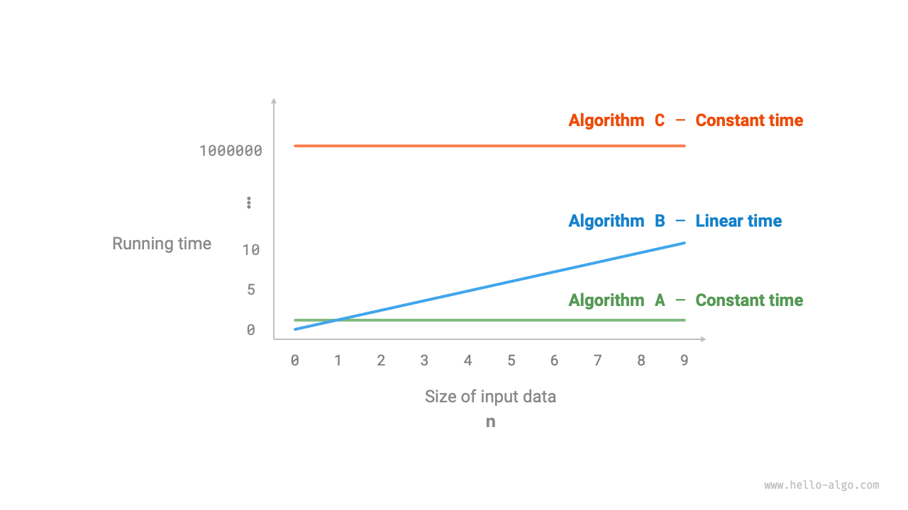
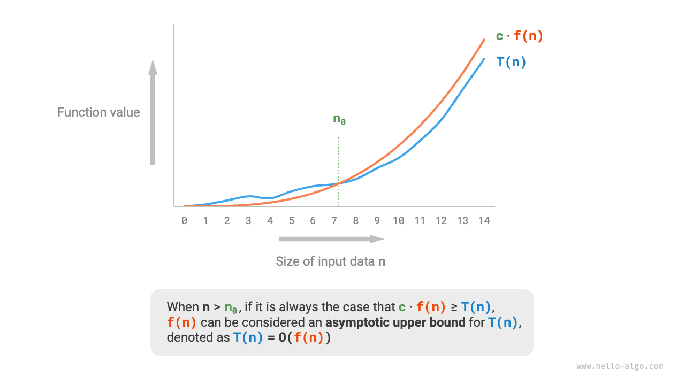
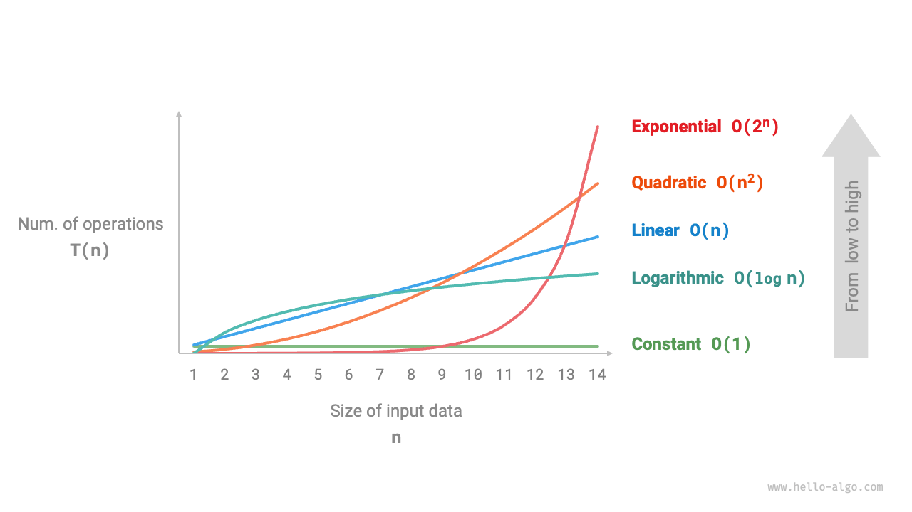
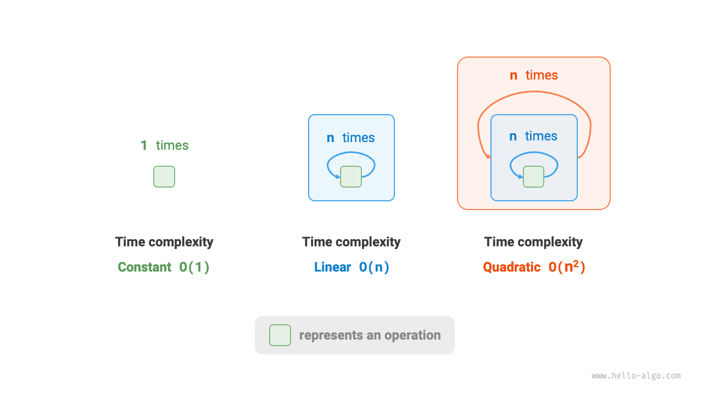
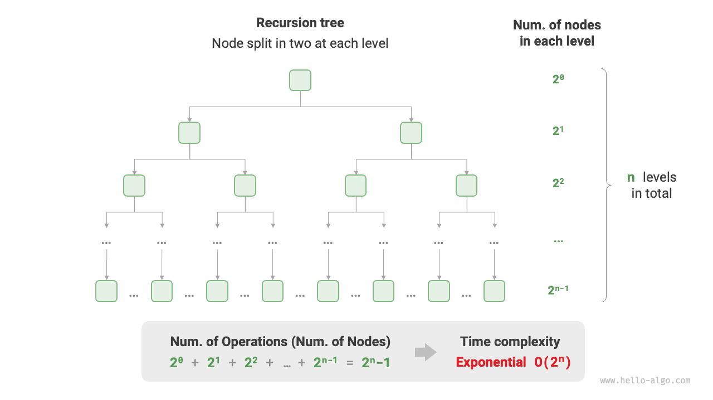
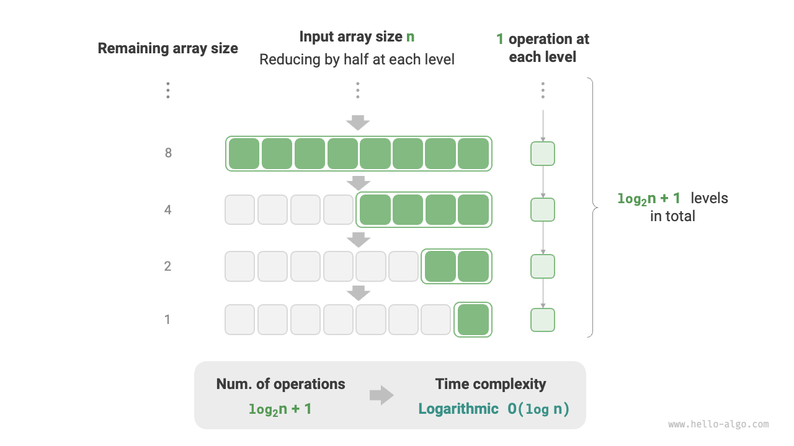
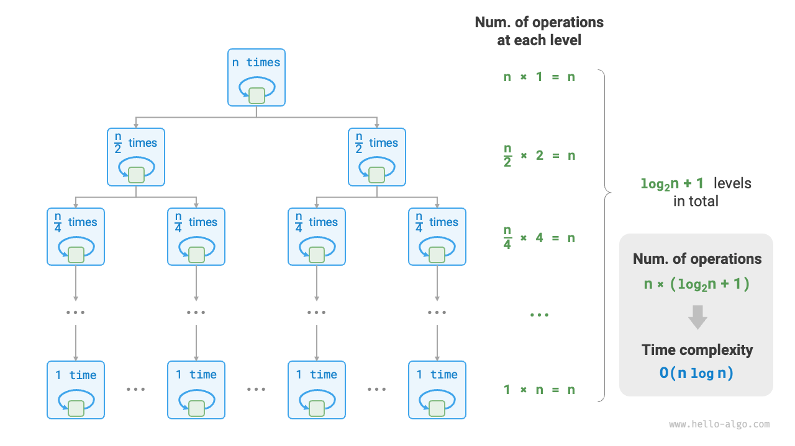
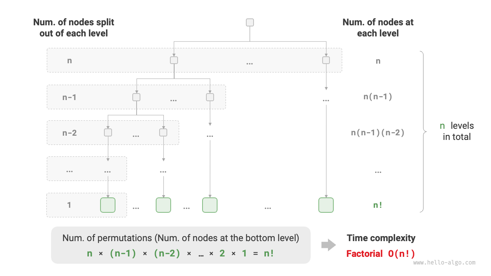

# 2.3 &nbsp; 時間計算量

実行時間はアルゴリズムの効率を直感的かつ正確に反映します。あるコードの実行時間を正確に見積もりたい場合、どのようにすればよいでしょうか？

1. **実行プラットフォームを特定する**。ハードウェア構成、プログラミング言語、システム環境などが含まれ、これらの要因はいずれもコードの実行効率に影響します。
2. **各種計算操作に必要な実行時間を評価する**。例えば加算 `+` には 1 ns 、乗算 `*` には 10 ns 、出力 `print()` には 5 ns などが必要です。
3. **コード中のすべての計算操作を数える**。そして各操作の実行時間を合計することで、実行時間を得ます。

例えば次のコードでは、入力データサイズを $n$ とします：

=== "Python"

    ```python title=""
    # ある実行プラットフォーム上で
    def algorithm(n: int):
        a = 2      # 1 ns
        a = a + 1  # 1 ns
        a = a * 2  # 10 ns
        # n 回ループ
        for _ in range(n):  # 1 ns
            print(0)        # 5 ns
    ```

=== "C++"

    ```cpp title=""
    // ある実行プラットフォーム上で
    void algorithm(int n) {
        int a = 2;  // 1 ns
        a = a + 1;  // 1 ns
        a = a * 2;  // 10 ns
        // n 回ループ
        for (int i = 0; i < n; i++) {  // 1 ns
            cout << 0 << endl;         // 5 ns
        }
    }
    ```

=== "Java"

    ```java title=""
    // ある実行プラットフォーム上で
    void algorithm(int n) {
        int a = 2;  // 1 ns
        a = a + 1;  // 1 ns
        a = a * 2;  // 10 ns
        // n 回ループ
        for (int i = 0; i < n; i++) {  // 1 ns
            System.out.println(0);     // 5 ns
        }
    }
    ```

=== "C#"

    ```csharp title=""
    // ある実行プラットフォーム上で
    void Algorithm(int n) {
        int a = 2;  // 1 ns
        a = a + 1;  // 1 ns
        a = a * 2;  // 10 ns
        // n 回ループ
        for (int i = 0; i < n; i++) {  // 1 ns
            Console.WriteLine(0);      // 5 ns
        }
    }
    ```

=== "Go"

    ```go title=""
    // ある実行プラットフォーム上で
    func algorithm(n int) {
        a := 2     // 1 ns
        a = a + 1  // 1 ns
        a = a * 2  // 10 ns
        // n 回ループ
        for i := 0; i < n; i++ {  // 1 ns
            fmt.Println(a)        // 5 ns
        }
    }
    ```

=== "Swift"

    ```swift title=""
    // ある実行プラットフォーム上で
    func algorithm(n: Int) {
        var a = 2 // 1 ns
        a = a + 1 // 1 ns
        a = a * 2 // 10 ns
        // n 回ループ
        for _ in 0 ..< n { // 1 ns
            print(0) // 5 ns
        }
    }
    ```

=== "JS"

    ```javascript title=""
    // ある実行プラットフォーム上で
    function algorithm(n) {
        var a = 2; // 1 ns
        a = a + 1; // 1 ns
        a = a * 2; // 10 ns
        // n 回ループ
        for(let i = 0; i < n; i++) { // 1 ns
            console.log(0); // 5 ns
        }
    }
    ```

=== "TS"

    ```typescript title=""
    // ある実行プラットフォーム上で
    function algorithm(n: number): void {
        var a: number = 2; // 1 ns
        a = a + 1; // 1 ns
        a = a * 2; // 10 ns
        // n 回ループ
        for(let i = 0; i < n; i++) { // 1 ns
            console.log(0); // 5 ns
        }
    }
    ```

=== "Dart"

    ```dart title=""
    // ある実行プラットフォーム上で
    void algorithm(int n) {
      int a = 2; // 1 ns
      a = a + 1; // 1 ns
      a = a * 2; // 10 ns
      // n 回ループ
      for (int i = 0; i < n; i++) { // 1 ns
        print(0); // 5 ns
      }
    }
    ```

=== "Rust"

    ```rust title=""
    // ある実行プラットフォーム上で
    fn algorithm(n: i32) {
        let mut a = 2;      // 1 ns
        a = a + 1;          // 1 ns
        a = a * 2;          // 10 ns
        // n 回ループ
        for _ in 0..n {     // 1 ns
            println!("{}", 0);  // 5 ns
        }
    }
    ```

=== "C"

    ```c title=""
    // ある実行プラットフォーム上で
    void algorithm(int n) {
        int a = 2;  // 1 ns
        a = a + 1;  // 1 ns
        a = a * 2;  // 10 ns
        // n 回ループ
        for (int i = 0; i < n; i++) {   // 1 ns
            printf("%d", 0);            // 5 ns
        }
    }
    ```

=== "Kotlin"

    ```kotlin title=""
    // ある実行プラットフォーム上で
    fun algorithm(n: Int) {
        var a = 2 // 1 ns
        a = a + 1 // 1 ns
        a = a * 2 // 10 ns
        // n 回ループ
        for (i in 0..<n) {  // 1 ns
            println(0)      // 5 ns
        }
    }
    ```

=== "Ruby"

    ```ruby title=""
    # ある実行プラットフォーム上で
    def algorithm(n)
        a = 2       # 1 ns
        a = a + 1   # 1 ns
        a = a * 2   # 10 ns
        # n 回ループ
        (0...n).each do # 1 ns
            puts 0      # 5 ns
        end
    end
    ```

上記の方法に基づくと、アルゴリズムの実行時間は $(6n + 12)$ ns になります：

$$
1 + 1 + 10 + (1 + 5) \times n = 6n + 12
$$

しかし実際には、**アルゴリズムの実行時間を統計的に求めることは合理的でも現実的でもありません**。まず、見積もり時間を実行プラットフォームに縛りたくありません。アルゴリズムはさまざまな異なるプラットフォームで動作する必要があるからです。次に、各種操作の実行時間を知ること自体が難しく、見積もりの難易度を大きく引き上げます。

## 2.3.1 &nbsp; 実行時間の増加傾向を捉える

時間計算量の分析で扱うのはアルゴリズムの実行時間そのものではなく、**データ量が増えたときに実行時間がどう増加するかという傾向**です。

「実行時間の増加傾向」という概念はやや抽象的なので、例を通して理解してみましょう。入力データサイズを $n$ とし、3 つのアルゴリズム `A`、`B`、`C` を考えます：

=== "Python"

    ```python title=""
    # アルゴリズム A の時間計算量：定数階
    def algorithm_A(n: int):
        print(0)
    # アルゴリズム B の時間計算量：線形階
    def algorithm_B(n: int):
        for _ in range(n):
            print(0)
    # アルゴリズム C の時間計算量：定数階
    def algorithm_C(n: int):
        for _ in range(1000000):
            print(0)
    ```

=== "C++"

    ```cpp title=""
    // アルゴリズム A の時間計算量：定数階
    void algorithm_A(int n) {
        cout << 0 << endl;
    }
    // アルゴリズム B の時間計算量：線形階
    void algorithm_B(int n) {
        for (int i = 0; i < n; i++) {
            cout << 0 << endl;
        }
    }
    // アルゴリズム C の時間計算量：定数階
    void algorithm_C(int n) {
        for (int i = 0; i < 1000000; i++) {
            cout << 0 << endl;
        }
    }
    ```

=== "Java"

    ```java title=""
    // アルゴリズム A の時間計算量：定数階
    void algorithm_A(int n) {
        System.out.println(0);
    }
    // アルゴリズム B の時間計算量：線形階
    void algorithm_B(int n) {
        for (int i = 0; i < n; i++) {
            System.out.println(0);
        }
    }
    // アルゴリズム C の時間計算量：定数階
    void algorithm_C(int n) {
        for (int i = 0; i < 1000000; i++) {
            System.out.println(0);
        }
    }
    ```

=== "C#"

    ```csharp title=""
    // アルゴリズム A の時間計算量：定数階
    void AlgorithmA(int n) {
        Console.WriteLine(0);
    }
    // アルゴリズム B の時間計算量：線形階
    void AlgorithmB(int n) {
        for (int i = 0; i < n; i++) {
            Console.WriteLine(0);
        }
    }
    // アルゴリズム C の時間計算量：定数階
    void AlgorithmC(int n) {
        for (int i = 0; i < 1000000; i++) {
            Console.WriteLine(0);
        }
    }
    ```

=== "Go"

    ```go title=""
    // アルゴリズム A の時間計算量：定数階
    func algorithm_A(n int) {
        fmt.Println(0)
    }
    // アルゴリズム B の時間計算量：線形階
    func algorithm_B(n int) {
        for i := 0; i < n; i++ {
            fmt.Println(0)
        }
    }
    // アルゴリズム C の時間計算量：定数階
    func algorithm_C(n int) {
        for i := 0; i < 1000000; i++ {
            fmt.Println(0)
        }
    }
    ```

=== "Swift"

    ```swift title=""
    // アルゴリズム A の時間計算量：定数階
    func algorithmA(n: Int) {
        print(0)
    }

    // アルゴリズム B の時間計算量：線形階
    func algorithmB(n: Int) {
        for _ in 0 ..< n {
            print(0)
        }
    }

    // アルゴリズム C の時間計算量：定数階
    func algorithmC(n: Int) {
        for _ in 0 ..< 1_000_000 {
            print(0)
        }
    }
    ```

=== "JS"

    ```javascript title=""
    // アルゴリズム A の時間計算量：定数階
    function algorithm_A(n) {
        console.log(0);
    }
    // アルゴリズム B の時間計算量：線形階
    function algorithm_B(n) {
        for (let i = 0; i < n; i++) {
            console.log(0);
        }
    }
    // アルゴリズム C の時間計算量：定数階
    function algorithm_C(n) {
        for (let i = 0; i < 1000000; i++) {
            console.log(0);
        }
    }

    ```

=== "TS"

    ```typescript title=""
    // アルゴリズム A の時間計算量：定数階
    function algorithm_A(n: number): void {
        console.log(0);
    }
    // アルゴリズム B の時間計算量：線形階
    function algorithm_B(n: number): void {
        for (let i = 0; i < n; i++) {
            console.log(0);
        }
    }
    // アルゴリズム C の時間計算量：定数階
    function algorithm_C(n: number): void {
        for (let i = 0; i < 1000000; i++) {
            console.log(0);
        }
    }
    ```

=== "Dart"

    ```dart title=""
    // アルゴリズム A の時間計算量：定数階
    void algorithmA(int n) {
      print(0);
    }
    // アルゴリズム B の時間計算量：線形階
    void algorithmB(int n) {
      for (int i = 0; i < n; i++) {
        print(0);
      }
    }
    // アルゴリズム C の時間計算量：定数階
    void algorithmC(int n) {
      for (int i = 0; i < 1000000; i++) {
        print(0);
      }
    }
    ```

=== "Rust"

    ```rust title=""
    // アルゴリズム A の時間計算量：定数階
    fn algorithm_A(n: i32) {
        println!("{}", 0);
    }
    // アルゴリズム B の時間計算量：線形階
    fn algorithm_B(n: i32) {
        for _ in 0..n {
            println!("{}", 0);
        }
    }
    // アルゴリズム C の時間計算量：定数階
    fn algorithm_C(n: i32) {
        for _ in 0..1000000 {
            println!("{}", 0);
        }
    }
    ```

=== "C"

    ```c title=""
    // アルゴリズム A の時間計算量：定数階
    void algorithm_A(int n) {
        printf("%d", 0);
    }
    // アルゴリズム B の時間計算量：線形階
    void algorithm_B(int n) {
        for (int i = 0; i < n; i++) {
            printf("%d", 0);
        }
    }
    // アルゴリズム C の時間計算量：定数階
    void algorithm_C(int n) {
        for (int i = 0; i < 1000000; i++) {
            printf("%d", 0);
        }
    }
    ```

=== "Kotlin"

    ```kotlin title=""
    // アルゴリズム A の時間計算量：定数階
    fun algoritm_A(n: Int) {
        println(0)
    }
    // アルゴリズム B の時間計算量：線形階
    fun algorithm_B(n: Int) {
        for (i in 0..<n){
            println(0)
        }
    }
    // アルゴリズム C の時間計算量：定数階
    fun algorithm_C(n: Int) {
        for (i in 0..<1000000) {
            println(0)
        }
    }
    ```

=== "Ruby"

    ```ruby title=""
    # アルゴリズム A の時間計算量：定数階
    def algorithm_A(n)
        puts 0
    end

    # アルゴリズム B の時間計算量：線形階
    def algorithm_B(n)
        (0...n).each { puts 0 }
    end

    # アルゴリズム C の時間計算量：定数階
    def algorithm_C(n)
        (0...1_000_000).each { puts 0 }
    end
    ```

以下の図は、上記 3 つのアルゴリズム関数の時間計算量を示しています。

- アルゴリズム `A` には出力操作が $1$ 回しかなく、実行時間は $n$ が大きくなっても増加しません。このアルゴリズムの時間計算量を「定数階」と呼びます。
- アルゴリズム `B` の出力操作は $n$ 回ループする必要があり、実行時間は $n$ の増加に対して線形に増加します。このアルゴリズムの時間計算量は「線形階」と呼ばれます。
- アルゴリズム `C` の出力操作は $1000000$ 回ループする必要があり、実行時間は長いものの、入力データサイズ $n$ とは無関係です。したがって `C` の時間計算量は `A` と同じく、依然として「定数階」です。

{ class="animation-figure" }

<p align="center"> 図 2-7 &nbsp; アルゴリズム A、B、C の時間増加傾向 </p>

アルゴリズムの実行時間を直接数える方法と比べて、時間計算量分析にはどのような特徴があるでしょうか？

- **時間計算量はアルゴリズム効率を有効に評価できます**。例えばアルゴリズム `B` の実行時間は線形に増加するため、$n > 1$ ではアルゴリズム `A` より遅く、$n > 1000000$ ではアルゴリズム `C` より遅くなります。実際、入力データサイズ $n$ が十分に大きければ、「定数階」のアルゴリズムは必ず「線形階」のアルゴリズムより優れます。これが実行時間の増加傾向の意味です。
- **時間計算量の見積もり方法はより簡潔です**。実行プラットフォームや計算操作の種類は、アルゴリズム実行時間の増加傾向とは無関係です。そのため時間計算量分析では、すべての計算操作の実行時間を同じ「単位時間」とみなしてよく、「計算操作の実行時間を数える」作業を「計算操作の個数を数える」作業へ簡略化できます。これにより見積もりの難易度は大きく下がります。
- **時間計算量には一定の限界もあります**。例えばアルゴリズム `A` と `C` の時間計算量は同じでも、実際の実行時間には大きな差があります。同様に、アルゴリズム `B` の時間計算量は `C` より高いものの、入力データサイズ $n$ が小さい場合にはアルゴリズム `B` のほうが明らかに優れます。このような場合、時間計算量だけでアルゴリズム効率の高低を判断するのは難しいことがあります。もっとも、こうした問題があっても、複雑度分析は依然としてアルゴリズム効率を評価する最も有効で一般的な方法です。

## 2.3.2 &nbsp; 関数の漸近上界

入力サイズが $n$ の次の関数を考えます：

=== "Python"

    ```python title=""
    def algorithm(n: int):
        a = 1      # +1
        a = a + 1  # +1
        a = a * 2  # +1
        # n 回ループ
        for i in range(n):  # +1
            print(0)        # +1
    ```

=== "C++"

    ```cpp title=""
    void algorithm(int n) {
        int a = 1;  // +1
        a = a + 1;  // +1
        a = a * 2;  // +1
        // n 回ループ
        for (int i = 0; i < n; i++) { // +1（各反復で i ++ を実行）
            cout << 0 << endl;    // +1
        }
    }
    ```

=== "Java"

    ```java title=""
    void algorithm(int n) {
        int a = 1;  // +1
        a = a + 1;  // +1
        a = a * 2;  // +1
        // n 回ループ
        for (int i = 0; i < n; i++) { // +1（各反復で i ++ を実行）
            System.out.println(0);    // +1
        }
    }
    ```

=== "C#"

    ```csharp title=""
    void Algorithm(int n) {
        int a = 1;  // +1
        a = a + 1;  // +1
        a = a * 2;  // +1
        // n 回ループ
        for (int i = 0; i < n; i++) {   // +1（各反復で i ++ を実行）
            Console.WriteLine(0);   // +1
        }
    }
    ```

=== "Go"

    ```go title=""
    func algorithm(n int) {
        a := 1      // +1
        a = a + 1   // +1
        a = a * 2   // +1
        // n 回ループ
        for i := 0; i < n; i++ {   // +1
            fmt.Println(a)         // +1
        }
    }
    ```

=== "Swift"

    ```swift title=""
    func algorithm(n: Int) {
        var a = 1 // +1
        a = a + 1 // +1
        a = a * 2 // +1
        // n 回ループ
        for _ in 0 ..< n { // +1
            print(0) // +1
        }
    }
    ```

=== "JS"

    ```javascript title=""
    function algorithm(n) {
        var a = 1; // +1
        a += 1; // +1
        a *= 2; // +1
        // n 回ループ
        for(let i = 0; i < n; i++){ // +1（各反復で i ++ を実行）
            console.log(0); // +1
        }
    }
    ```

=== "TS"

    ```typescript title=""
    function algorithm(n: number): void{
        var a: number = 1; // +1
        a += 1; // +1
        a *= 2; // +1
        // n 回ループ
        for(let i = 0; i < n; i++){ // +1（各反復で i ++ を実行）
            console.log(0); // +1
        }
    }
    ```

=== "Dart"

    ```dart title=""
    void algorithm(int n) {
      int a = 1; // +1
      a = a + 1; // +1
      a = a * 2; // +1
      // n 回ループ
      for (int i = 0; i < n; i++) { // +1（各反復で i ++ を実行）
        print(0); // +1
      }
    }
    ```

=== "Rust"

    ```rust title=""
    fn algorithm(n: i32) {
        let mut a = 1;   // +1
        a = a + 1;      // +1
        a = a * 2;      // +1

        // n 回ループ
        for _ in 0..n { // +1（各反復で i ++ を実行）
            println!("{}", 0); // +1
        }
    }
    ```

=== "C"

    ```c title=""
    void algorithm(int n) {
        int a = 1;  // +1
        a = a + 1;  // +1
        a = a * 2;  // +1
        // n 回ループ
        for (int i = 0; i < n; i++) {   // +1（各反復で i ++ を実行）
            printf("%d", 0);            // +1
        }
    }
    ```

=== "Kotlin"

    ```kotlin title=""
    fun algorithm(n: Int) {
        var a = 1 // +1
        a = a + 1 // +1
        a = a * 2 // +1
        // n 回ループ
        for (i in 0..<n) { // +1（各反復で i ++ を実行）
            println(0) // +1
        }
    }
    ```

=== "Ruby"

    ```ruby title=""
    def algorithm(n)
        a = 1       # +1
        a = a + 1   # +1
        a = a * 2   # +1
        # n 回ループ
        (0...n).each do # +1
            puts 0      # +1
        end
    end
    ```

アルゴリズムの操作回数を入力データサイズ $n$ の関数とし、$T(n)$ と表すと、上の関数の操作回数は次のようになります：

$$
T(n) = 3 + 2n
$$

$T(n)$ は一次関数であり、実行時間の増加傾向が線形であることを示しています。したがってその時間計算量は線形階です。

線形階の時間計算量を $O(n)$ と表します。この数学記号は<u>ビッグ $O$ 記法（big-$O$ notation）</u>と呼ばれ、関数 $T(n)$ の<u>漸近上界（asymptotic upper bound）</u>を表します。

時間計算量の分析は本質的に「操作回数 $T(n)$」の漸近上界を求めることであり、明確な数学的定義があります。

!!! note "関数の漸近上界"

    正の実数 $c$ と実数 $n_0$ が存在し、すべての $n > n_0$ について $T(n) \leq c \cdot f(n)$ が成り立つならば、$f(n)$ は $T(n)$ の漸近上界の 1 つであるとみなせます。これを $T(n) = O(f(n))$ と記します。

下図のように、漸近上界を求めるとは関数 $f(n)$ を探すことであり、$n$ が無限大へ近づくときに $T(n)$ と $f(n)$ が同じ増加オーダーにあり、定数係数 $c$ だけが異なる状態を表します。

{ class="animation-figure" }

<p align="center"> 図 2-8 &nbsp; 関数の漸近上界 </p>

## 2.3.3 &nbsp; 求め方

漸近上界はやや数学色が強い概念ですが、完全に理解できていなくても心配はいりません。まずは求め方を押さえ、実践を重ねる中で徐々にその数学的意味をつかめば十分です。

定義より、$f(n)$ が定まれば時間計算量 $O(f(n))$ が得られます。では、漸近上界 $f(n)$ をどのように決めればよいのでしょうか。大きく 2 段階あります。まず操作回数を数え、その後で漸近上界を判断します。

### 1. &nbsp; 第 1 ステップ：操作回数を数える

コードについては、上から下へ 1 行ずつ数えれば十分です。しかし、前述の $c \cdot f(n)$ における定数係数 $c$ は任意に大きく取れるため、**操作回数 $T(n)$ に含まれるさまざまな係数や定数項は無視できます**。この原則から、次のような簡略化のコツが得られます。

1. **$T(n)$ 中の定数を無視する**。それらはすべて $n$ と無関係なので、時間計算量には影響しません。
2. **すべての係数を省略する**。例えば $2n$ 回や $5n + 1$ 回のループは、いずれも $n$ 回と簡略化できます。$n$ の前の係数は時間計算量に影響しないからです。
3. **ループが入れ子のときは乗算を使う**。総操作回数は外側のループと内側のループの操作回数の積に等しく、各ループ層には引き続き `1.` と `2.` のコツをそれぞれ適用できます。

次の関数では、上記のコツを使って操作回数を数えられます：

=== "Python"

    ```python title=""
    def algorithm(n: int):
        a = 1      # +0（コツ 1）
        a = a + n  # +0（コツ 1）
        # +n（コツ 2）
        for i in range(5 * n + 1):
            print(0)
        # +n*n（コツ 3）
        for i in range(2 * n):
            for j in range(n + 1):
                print(0)
    ```

=== "C++"

    ```cpp title=""
    void algorithm(int n) {
        int a = 1;  // +0（コツ 1）
        a = a + n;  // +0（コツ 1）
        // +n（コツ 2）
        for (int i = 0; i < 5 * n + 1; i++) {
            cout << 0 << endl;
        }
        // +n*n（コツ 3）
        for (int i = 0; i < 2 * n; i++) {
            for (int j = 0; j < n + 1; j++) {
                cout << 0 << endl;
            }
        }
    }
    ```

=== "Java"

    ```java title=""
    void algorithm(int n) {
        int a = 1;  // +0（コツ 1）
        a = a + n;  // +0（コツ 1）
        // +n（コツ 2）
        for (int i = 0; i < 5 * n + 1; i++) {
            System.out.println(0);
        }
        // +n*n（コツ 3）
        for (int i = 0; i < 2 * n; i++) {
            for (int j = 0; j < n + 1; j++) {
                System.out.println(0);
            }
        }
    }
    ```

=== "C#"

    ```csharp title=""
    void Algorithm(int n) {
        int a = 1;  // +0（コツ 1）
        a = a + n;  // +0（コツ 1）
        // +n（コツ 2）
        for (int i = 0; i < 5 * n + 1; i++) {
            Console.WriteLine(0);
        }
        // +n*n（コツ 3）
        for (int i = 0; i < 2 * n; i++) {
            for (int j = 0; j < n + 1; j++) {
                Console.WriteLine(0);
            }
        }
    }
    ```

=== "Go"

    ```go title=""
    func algorithm(n int) {
        a := 1     // +0（コツ 1）
        a = a + n  // +0（コツ 1）
        // +n（コツ 2）
        for i := 0; i < 5 * n + 1; i++ {
            fmt.Println(0)
        }
        // +n*n（コツ 3）
        for i := 0; i < 2 * n; i++ {
            for j := 0; j < n + 1; j++ {
                fmt.Println(0)
            }
        }
    }
    ```

=== "Swift"

    ```swift title=""
    func algorithm(n: Int) {
        var a = 1 // +0（コツ 1）
        a = a + n // +0（コツ 1）
        // +n（コツ 2）
        for _ in 0 ..< (5 * n + 1) {
            print(0)
        }
        // +n*n（コツ 3）
        for _ in 0 ..< (2 * n) {
            for _ in 0 ..< (n + 1) {
                print(0)
            }
        }
    }
    ```

=== "JS"

    ```javascript title=""
    function algorithm(n) {
        let a = 1;  // +0（コツ 1）
        a = a + n;  // +0（コツ 1）
        // +n（コツ 2）
        for (let i = 0; i < 5 * n + 1; i++) {
            console.log(0);
        }
        // +n*n（コツ 3）
        for (let i = 0; i < 2 * n; i++) {
            for (let j = 0; j < n + 1; j++) {
                console.log(0);
            }
        }
    }
    ```

=== "TS"

    ```typescript title=""
    function algorithm(n: number): void {
        let a = 1;  // +0（コツ 1）
        a = a + n;  // +0（コツ 1）
        // +n（コツ 2）
        for (let i = 0; i < 5 * n + 1; i++) {
            console.log(0);
        }
        // +n*n（コツ 3）
        for (let i = 0; i < 2 * n; i++) {
            for (let j = 0; j < n + 1; j++) {
                console.log(0);
            }
        }
    }
    ```

=== "Dart"

    ```dart title=""
    void algorithm(int n) {
      int a = 1; // +0（コツ 1）
      a = a + n; // +0（コツ 1）
      // +n（コツ 2）
      for (int i = 0; i < 5 * n + 1; i++) {
        print(0);
      }
      // +n*n（コツ 3）
      for (int i = 0; i < 2 * n; i++) {
        for (int j = 0; j < n + 1; j++) {
          print(0);
        }
      }
    }
    ```

=== "Rust"

    ```rust title=""
    fn algorithm(n: i32) {
        let mut a = 1;     // +0（コツ 1）
        a = a + n;        // +0（コツ 1）

        // +n（コツ 2）
        for i in 0..(5 * n + 1) {
            println!("{}", 0);
        }

        // +n*n（コツ 3）
        for i in 0..(2 * n) {
            for j in 0..(n + 1) {
                println!("{}", 0);
            }
        }
    }
    ```

=== "C"

    ```c title=""
    void algorithm(int n) {
        int a = 1;  // +0（コツ 1）
        a = a + n;  // +0（コツ 1）
        // +n（コツ 2）
        for (int i = 0; i < 5 * n + 1; i++) {
            printf("%d", 0);
        }
        // +n*n（コツ 3）
        for (int i = 0; i < 2 * n; i++) {
            for (int j = 0; j < n + 1; j++) {
                printf("%d", 0);
            }
        }
    }
    ```

=== "Kotlin"

    ```kotlin title=""
    fun algorithm(n: Int) {
        var a = 1   // +0（コツ 1）
        a = a + n   // +0（コツ 1）
        // +n（コツ 2）
        for (i in 0..<5 * n + 1) {
            println(0)
        }
        // +n*n（コツ 3）
        for (i in 0..<2 * n) {
            for (j in 0..<n + 1) {
                println(0)
            }
        }
    }
    ```

=== "Ruby"

    ```ruby title=""
    def algorithm(n)
        a = 1       # +0（コツ 1）
        a = a + n   # +0（コツ 1）
        # +n（コツ 2）
        (0...(5 * n + 1)).each do { puts 0 }
        # +n*n（コツ 3）
        (0...(2 * n)).each do
            (0...(n + 1)).each do { puts 0 }
        end
    end
    ```

次の式は、上記のコツを使う前後の集計結果を示したもので、どちらから求めても時間計算量は $O(n^2)$ です。

$$
\begin{aligned}
T(n) & = 2n(n + 1) + (5n + 1) + 2 & \text{厳密集計 (-.-|||)} \newline
& = 2n^2 + 7n + 3 \newline
T(n) & = n^2 + n & \text{手抜き集計 (o.O)}
\end{aligned}
$$

### 2. &nbsp; 第 2 ステップ：漸近上界を判断する

**時間計算量は $T(n)$ の最高次の項によって決まります**。これは、$n$ が無限大に近づくとき、最高次の項が支配的となり、他の項の影響は無視できるからです。

以下の表はその例です。いくつか極端な値を入れているのは、「係数では次数は変わらない」という結論を強調するためです。$n$ が無限大に近づくと、これらの定数は重要でなくなります。

<p align="center"> 表 2-2 &nbsp; 異なる操作回数に対応する時間計算量 </p>

<div class="center-table" markdown>

| 操作回数 $T(n)$        | 時間計算量 $O(f(n))$ |
| ---------------------- | -------------------- |
| $100000$               | $O(1)$               |
| $3n + 2$               | $O(n)$               |
| $2n^2 + 3n + 2$        | $O(n^2)$             |
| $n^3 + 10000n^2$       | $O(n^3)$             |
| $2^n + 10000n^{10000}$ | $O(2^n)$             |

</div>

## 2.3.4 &nbsp; よくある種類

入力データサイズを $n$ とすると、よくある時間計算量の種類は次図のとおりです（小さい順に並べています）。

$$
\begin{aligned}
& O(1) < O(\log n) < O(n) < O(n \log n) < O(n^2) < O(2^n) < O(n!) \newline
& \text{定数階} < \text{対数階} < \text{線形階} < \text{線形対数階} < \text{平方階} < \text{指数階} < \text{階乗階}
\end{aligned}
$$

{ class="animation-figure" }

<p align="center"> 図 2-9 &nbsp; よくある時間計算量の種類 </p>

### 1. &nbsp; 定数階 $O(1)$ {data-toc-label="1. &nbsp; 定数階"}

定数階の操作回数は入力データサイズ $n$ と無関係であり、$n$ が変化しても増減しません。

次の関数では、操作回数 `size` が大きい可能性はありますが、入力データサイズ $n$ とは無関係なので、時間計算量は依然として $O(1)$ です：

=== "Python"

    ```python title="time_complexity.py"
    def constant(n: int) -> int:
        """定数階"""
        count = 0
        size = 100000
        for _ in range(size):
            count += 1
        return count
    ```

=== "C++"

    ```cpp title="time_complexity.cpp"
    /* 定数階 */
    int constant(int n) {
        int count = 0;
        int size = 100000;
        for (int i = 0; i < size; i++)
            count++;
        return count;
    }
    ```

=== "Java"

    ```java title="time_complexity.java"
    /* 定数階 */
    int constant(int n) {
        int count = 0;
        int size = 100000;
        for (int i = 0; i < size; i++)
            count++;
        return count;
    }
    ```

=== "C#"

    ```csharp title="time_complexity.cs"
    /* 定数階 */
    int Constant(int n) {
        int count = 0;
        int size = 100000;
        for (int i = 0; i < size; i++)
            count++;
        return count;
    }
    ```

=== "Go"

    ```go title="time_complexity.go"
    /* 定数階 */
    func constant(n int) int {
        count := 0
        size := 100000
        for i := 0; i < size; i++ {
            count++
        }
        return count
    }
    ```

=== "Swift"

    ```swift title="time_complexity.swift"
    /* 定数階 */
    func constant(n: Int) -> Int {
        var count = 0
        let size = 100_000
        for _ in 0 ..< size {
            count += 1
        }
        return count
    }
    ```

=== "JS"

    ```javascript title="time_complexity.js"
    /* 定数階 */
    function constant(n) {
        let count = 0;
        const size = 100000;
        for (let i = 0; i < size; i++) count++;
        return count;
    }
    ```

=== "TS"

    ```typescript title="time_complexity.ts"
    /* 定数階 */
    function constant(n: number): number {
        let count = 0;
        const size = 100000;
        for (let i = 0; i < size; i++) count++;
        return count;
    }
    ```

=== "Dart"

    ```dart title="time_complexity.dart"
    /* 定数階 */
    int constant(int n) {
      int count = 0;
      int size = 100000;
      for (var i = 0; i < size; i++) {
        count++;
      }
      return count;
    }
    ```

=== "Rust"

    ```rust title="time_complexity.rs"
    /* 定数階 */
    fn constant(n: i32) -> i32 {
        _ = n;
        let mut count = 0;
        let size = 100_000;
        for _ in 0..size {
            count += 1;
        }
        count
    }
    ```

=== "C"

    ```c title="time_complexity.c"
    /* 定数階 */
    int constant(int n) {
        int count = 0;
        int size = 100000;
        int i = 0;
        for (int i = 0; i < size; i++) {
            count++;
        }
        return count;
    }
    ```

=== "Kotlin"

    ```kotlin title="time_complexity.kt"
    /* 定数階 */
    fun constant(n: Int): Int {
        var count = 0
        val size = 100000
        for (i in 0..<size)
            count++
        return count
    }
    ```

=== "Ruby"

    ```ruby title="time_complexity.rb"
    ### 定数階 ###
    def constant(n)
      count = 0
      size = 100000

      (0...size).each { count += 1 }

      count
    end
    ```

??? pythontutor "コードの可視化"

    <div style="height: 441px; width: 100%;"><iframe class="pythontutor-iframe" src="https://pythontutor.com/iframe-embed.html#code=def%20constant%28n%3A%20int%29%20-%3E%20int%3A%0A%20%20%20%20%22%22%22%E5%AE%9A%E6%95%B0%E9%9A%8E%22%22%22%0A%20%20%20%20count%20%3D%200%0A%20%20%20%20size%20%3D%2010%0A%20%20%20%20for%20_%20in%20range%28size%29%3A%0A%20%20%20%20%20%20%20%20count%20%2B%3D%201%0A%20%20%20%20return%20count%0A%0Aif%20__name__%20%3D%3D%20%22__main__%22%3A%0A%20%20%20%20n%20%3D%208%0A%20%20%20%20print%28%22%E5%85%A5%E5%8A%9B%E3%83%87%E3%83%BC%E3%82%BF%E3%82%B5%E3%82%A4%E3%82%BA%20n%20%3D%22%2C%20n%29%0A%0A%20%20%20%20count%20%3D%20constant%28n%29%0A%20%20%20%20print%28%22%E5%AE%9A%E6%95%B0%E6%99%82%E9%96%93%E3%81%AE%E6%93%8D%E4%BD%9C%E5%9B%9E%E6%95%B0%20%3D%22%2C%20count%29&codeDivHeight=472&codeDivWidth=350&cumulative=false&curInstr=3&heapPrimitives=nevernest&origin=opt-frontend.js&py=311&rawInputLstJSON=%5B%5D&textReferences=false"> </iframe></div>
    <div style="margin-top: 5px;"><a href="https://pythontutor.com/iframe-embed.html#code=def%20constant%28n%3A%20int%29%20-%3E%20int%3A%0A%20%20%20%20%22%22%22%E5%AE%9A%E6%95%B0%E9%9A%8E%22%22%22%0A%20%20%20%20count%20%3D%200%0A%20%20%20%20size%20%3D%2010%0A%20%20%20%20for%20_%20in%20range%28size%29%3A%0A%20%20%20%20%20%20%20%20count%20%2B%3D%201%0A%20%20%20%20return%20count%0A%0Aif%20__name__%20%3D%3D%20%22__main__%22%3A%0A%20%20%20%20n%20%3D%208%0A%20%20%20%20print%28%22%E5%85%A5%E5%8A%9B%E3%83%87%E3%83%BC%E3%82%BF%E3%82%B5%E3%82%A4%E3%82%BA%20n%20%3D%22%2C%20n%29%0A%0A%20%20%20%20count%20%3D%20constant%28n%29%0A%20%20%20%20print%28%22%E5%AE%9A%E6%95%B0%E6%99%82%E9%96%93%E3%81%AE%E6%93%8D%E4%BD%9C%E5%9B%9E%E6%95%B0%20%3D%22%2C%20count%29&codeDivHeight=800&codeDivWidth=600&cumulative=false&curInstr=3&heapPrimitives=nevernest&origin=opt-frontend.js&py=311&rawInputLstJSON=%5B%5D&textReferences=false" target="_blank" rel="noopener noreferrer">全画面で見る ></a></div>

### 2. &nbsp; 線形階 $O(n)$ {data-toc-label="2. &nbsp; 線形階"}

線形階の操作回数は入力データサイズ $n$ に対して線形に増加します。線形階は通常、単一ループに現れます：

=== "Python"

    ```python title="time_complexity.py"
    def linear(n: int) -> int:
        """線形階"""
        count = 0
        for _ in range(n):
            count += 1
        return count
    ```

=== "C++"

    ```cpp title="time_complexity.cpp"
    /* 線形階 */
    int linear(int n) {
        int count = 0;
        for (int i = 0; i < n; i++)
            count++;
        return count;
    }
    ```

=== "Java"

    ```java title="time_complexity.java"
    /* 線形階 */
    int linear(int n) {
        int count = 0;
        for (int i = 0; i < n; i++)
            count++;
        return count;
    }
    ```

=== "C#"

    ```csharp title="time_complexity.cs"
    /* 線形階 */
    int Linear(int n) {
        int count = 0;
        for (int i = 0; i < n; i++)
            count++;
        return count;
    }
    ```

=== "Go"

    ```go title="time_complexity.go"
    /* 線形階 */
    func linear(n int) int {
        count := 0
        for i := 0; i < n; i++ {
            count++
        }
        return count
    }
    ```

=== "Swift"

    ```swift title="time_complexity.swift"
    /* 線形階 */
    func linear(n: Int) -> Int {
        var count = 0
        for _ in 0 ..< n {
            count += 1
        }
        return count
    }
    ```

=== "JS"

    ```javascript title="time_complexity.js"
    /* 線形階 */
    function linear(n) {
        let count = 0;
        for (let i = 0; i < n; i++) count++;
        return count;
    }
    ```

=== "TS"

    ```typescript title="time_complexity.ts"
    /* 線形階 */
    function linear(n: number): number {
        let count = 0;
        for (let i = 0; i < n; i++) count++;
        return count;
    }
    ```

=== "Dart"

    ```dart title="time_complexity.dart"
    /* 線形階 */
    int linear(int n) {
      int count = 0;
      for (var i = 0; i < n; i++) {
        count++;
      }
      return count;
    }
    ```

=== "Rust"

    ```rust title="time_complexity.rs"
    /* 線形階 */
    fn linear(n: i32) -> i32 {
        let mut count = 0;
        for _ in 0..n {
            count += 1;
        }
        count
    }
    ```

=== "C"

    ```c title="time_complexity.c"
    /* 線形階 */
    int linear(int n) {
        int count = 0;
        for (int i = 0; i < n; i++) {
            count++;
        }
        return count;
    }
    ```

=== "Kotlin"

    ```kotlin title="time_complexity.kt"
    /* 線形階 */
    fun linear(n: Int): Int {
        var count = 0
        for (i in 0..<n)
            count++
        return count
    }
    ```

=== "Ruby"

    ```ruby title="time_complexity.rb"
    ### 線形階 ###
    def linear(n)
      count = 0
      (0...n).each { count += 1 }
      count
    end
    ```

??? pythontutor "コードの可視化"

    <div style="height: 423px; width: 100%;"><iframe class="pythontutor-iframe" src="https://pythontutor.com/iframe-embed.html#code=def%20linear%28n%29%20-%3E%20int%3A%0A%20%20%20%20%22%22%22%E7%B7%9A%E5%BD%A2%E9%9A%8E%22%22%22%0A%20%20%20%20count%20%3D%200%0A%20%20%20%20for%20_%20in%20range%28n%29%3A%0A%20%20%20%20%20%20%20%20count%20%2B%3D%201%0A%20%20%20%20return%20count%0A%0Aif%20__name__%20%3D%3D%20%22__main__%22%3A%0A%20%20%20%20n%20%3D%208%0A%20%20%20%20print%28%22%E5%85%A5%E5%8A%9B%E3%83%87%E3%83%BC%E3%82%BF%E3%82%B5%E3%82%A4%E3%82%BA%20n%20%3D%22%2C%20n%29%0A%0A%20%20%20%20count%20%3D%20linear%28n%29%0A%20%20%20%20print%28%22%E7%B7%9A%E5%BD%A2%E6%99%82%E9%96%93%E3%81%AE%E6%93%8D%E4%BD%9C%E5%9B%9E%E6%95%B0%20%3D%22%2C%20count%29&codeDivHeight=472&codeDivWidth=350&cumulative=false&curInstr=3&heapPrimitives=nevernest&origin=opt-frontend.js&py=311&rawInputLstJSON=%5B%5D&textReferences=false"> </iframe></div>
    <div style="margin-top: 5px;"><a href="https://pythontutor.com/iframe-embed.html#code=def%20linear%28n%29%20-%3E%20int%3A%0A%20%20%20%20%22%22%22%E7%B7%9A%E5%BD%A2%E9%9A%8E%22%22%22%0A%20%20%20%20count%20%3D%200%0A%20%20%20%20for%20_%20in%20range%28n%29%3A%0A%20%20%20%20%20%20%20%20count%20%2B%3D%201%0A%20%20%20%20return%20count%0A%0Aif%20__name__%20%3D%3D%20%22__main__%22%3A%0A%20%20%20%20n%20%3D%208%0A%20%20%20%20print%28%22%E5%85%A5%E5%8A%9B%E3%83%87%E3%83%BC%E3%82%BF%E3%82%B5%E3%82%A4%E3%82%BA%20n%20%3D%22%2C%20n%29%0A%0A%20%20%20%20count%20%3D%20linear%28n%29%0A%20%20%20%20print%28%22%E7%B7%9A%E5%BD%A2%E6%99%82%E9%96%93%E3%81%AE%E6%93%8D%E4%BD%9C%E5%9B%9E%E6%95%B0%20%3D%22%2C%20count%29&codeDivHeight=800&codeDivWidth=600&cumulative=false&curInstr=3&heapPrimitives=nevernest&origin=opt-frontend.js&py=311&rawInputLstJSON=%5B%5D&textReferences=false" target="_blank" rel="noopener noreferrer">全画面で見る ></a></div>

配列走査や連結リスト走査などの操作の時間計算量はいずれも $O(n)$ であり、ここでの $n$ は配列または連結リストの長さです：

=== "Python"

    ```python title="time_complexity.py"
    def array_traversal(nums: list[int]) -> int:
        """線形時間（配列を走査）"""
        count = 0
        # ループ回数は配列長に比例する
        for num in nums:
            count += 1
        return count
    ```

=== "C++"

    ```cpp title="time_complexity.cpp"
    /* 線形時間（配列を走査） */
    int arrayTraversal(vector<int> &nums) {
        int count = 0;
        // ループ回数は配列長に比例する
        for (int num : nums) {
            count++;
        }
        return count;
    }
    ```

=== "Java"

    ```java title="time_complexity.java"
    /* 線形時間（配列を走査） */
    int arrayTraversal(int[] nums) {
        int count = 0;
        // ループ回数は配列長に比例する
        for (int num : nums) {
            count++;
        }
        return count;
    }
    ```

=== "C#"

    ```csharp title="time_complexity.cs"
    /* 線形時間（配列を走査） */
    int ArrayTraversal(int[] nums) {
        int count = 0;
        // ループ回数は配列長に比例する
        foreach (int num in nums) {
            count++;
        }
        return count;
    }
    ```

=== "Go"

    ```go title="time_complexity.go"
    /* 線形時間（配列を走査） */
    func arrayTraversal(nums []int) int {
        count := 0
        // ループ回数は配列長に比例する
        for range nums {
            count++
        }
        return count
    }
    ```

=== "Swift"

    ```swift title="time_complexity.swift"
    /* 線形時間（配列を走査） */
    func arrayTraversal(nums: [Int]) -> Int {
        var count = 0
        // ループ回数は配列長に比例する
        for _ in nums {
            count += 1
        }
        return count
    }
    ```

=== "JS"

    ```javascript title="time_complexity.js"
    /* 線形時間（配列を走査） */
    function arrayTraversal(nums) {
        let count = 0;
        // ループ回数は配列長に比例する
        for (let i = 0; i < nums.length; i++) {
            count++;
        }
        return count;
    }
    ```

=== "TS"

    ```typescript title="time_complexity.ts"
    /* 線形時間（配列を走査） */
    function arrayTraversal(nums: number[]): number {
        let count = 0;
        // ループ回数は配列長に比例する
        for (let i = 0; i < nums.length; i++) {
            count++;
        }
        return count;
    }
    ```

=== "Dart"

    ```dart title="time_complexity.dart"
    /* 線形時間（配列を走査） */
    int arrayTraversal(List<int> nums) {
      int count = 0;
      // ループ回数は配列長に比例する
      for (var _num in nums) {
        count++;
      }
      return count;
    }
    ```

=== "Rust"

    ```rust title="time_complexity.rs"
    /* 線形時間（配列を走査） */
    fn array_traversal(nums: &[i32]) -> i32 {
        let mut count = 0;
        // ループ回数は配列長に比例する
        for _ in nums {
            count += 1;
        }
        count
    }
    ```

=== "C"

    ```c title="time_complexity.c"
    /* 線形時間（配列を走査） */
    int arrayTraversal(int *nums, int n) {
        int count = 0;
        // ループ回数は配列長に比例する
        for (int i = 0; i < n; i++) {
            count++;
        }
        return count;
    }
    ```

=== "Kotlin"

    ```kotlin title="time_complexity.kt"
    /* 線形時間（配列を走査） */
    fun arrayTraversal(nums: IntArray): Int {
        var count = 0
        // ループ回数は配列長に比例する
        for (num in nums) {
            count++
        }
        return count
    }
    ```

=== "Ruby"

    ```ruby title="time_complexity.rb"
    ### 線形階 ###
    def linear(n)
      count = 0
      (0...n).each { count += 1 }
      count
    end

    # ## 線形階（配列を走査）###
    def array_traversal(nums)
      count = 0

      # ループ回数は配列長に比例する
      for num in nums
        count += 1
      end

      count
    end
    ```

??? pythontutor "コードの可視化"

    <div style="height: 441px; width: 100%;"><iframe class="pythontutor-iframe" src="https://pythontutor.com/iframe-embed.html#code=def%20array_traversal%28nums%3A%20list%5Bint%5D%29%20-%3E%20int%3A%0A%20%20%20%20%22%22%22%E7%B7%9A%E5%BD%A2%E6%99%82%E9%96%93%EF%BC%88%E9%85%8D%E5%88%97%E3%82%92%E8%B5%B0%E6%9F%BB%EF%BC%89%22%22%22%0A%20%20%20%20count%20%3D%200%0A%20%20%20%20%23%20%E3%83%AB%E3%83%BC%E3%83%97%E5%9B%9E%E6%95%B0%E3%81%AF%E9%85%8D%E5%88%97%E9%95%B7%E3%81%AB%E6%AF%94%E4%BE%8B%E3%81%99%E3%82%8B%0A%20%20%20%20for%20num%20in%20nums%3A%0A%20%20%20%20%20%20%20%20count%20%2B%3D%201%0A%20%20%20%20return%20count%0A%0Aif%20__name__%20%3D%3D%20%22__main__%22%3A%0A%20%20%20%20n%20%3D%208%0A%20%20%20%20print%28%22%E5%85%A5%E5%8A%9B%E3%83%87%E3%83%BC%E3%82%BF%E3%82%B5%E3%82%A4%E3%82%BA%20n%20%3D%22%2C%20n%29%0A%0A%20%20%20%20count%20%3D%20array_traversal%28%5B0%5D%20%2A%20n%29%0A%20%20%20%20print%28%22%E7%B7%9A%E5%BD%A2%E6%99%82%E9%96%93%EF%BC%88%E9%85%8D%E5%88%97%E8%B5%B0%E6%9F%BB%EF%BC%89%E3%81%AE%E6%93%8D%E4%BD%9C%E5%9B%9E%E6%95%B0%20%3D%22%2C%20count%29&codeDivHeight=472&codeDivWidth=350&cumulative=false&curInstr=3&heapPrimitives=nevernest&origin=opt-frontend.js&py=311&rawInputLstJSON=%5B%5D&textReferences=false"> </iframe></div>
    <div style="margin-top: 5px;"><a href="https://pythontutor.com/iframe-embed.html#code=def%20array_traversal%28nums%3A%20list%5Bint%5D%29%20-%3E%20int%3A%0A%20%20%20%20%22%22%22%E7%B7%9A%E5%BD%A2%E6%99%82%E9%96%93%EF%BC%88%E9%85%8D%E5%88%97%E3%82%92%E8%B5%B0%E6%9F%BB%EF%BC%89%22%22%22%0A%20%20%20%20count%20%3D%200%0A%20%20%20%20%23%20%E3%83%AB%E3%83%BC%E3%83%97%E5%9B%9E%E6%95%B0%E3%81%AF%E9%85%8D%E5%88%97%E9%95%B7%E3%81%AB%E6%AF%94%E4%BE%8B%E3%81%99%E3%82%8B%0A%20%20%20%20for%20num%20in%20nums%3A%0A%20%20%20%20%20%20%20%20count%20%2B%3D%201%0A%20%20%20%20return%20count%0A%0Aif%20__name__%20%3D%3D%20%22__main__%22%3A%0A%20%20%20%20n%20%3D%208%0A%20%20%20%20print%28%22%E5%85%A5%E5%8A%9B%E3%83%87%E3%83%BC%E3%82%BF%E3%82%B5%E3%82%A4%E3%82%BA%20n%20%3D%22%2C%20n%29%0A%0A%20%20%20%20count%20%3D%20array_traversal%28%5B0%5D%20%2A%20n%29%0A%20%20%20%20print%28%22%E7%B7%9A%E5%BD%A2%E6%99%82%E9%96%93%EF%BC%88%E9%85%8D%E5%88%97%E8%B5%B0%E6%9F%BB%EF%BC%89%E3%81%AE%E6%93%8D%E4%BD%9C%E5%9B%9E%E6%95%B0%20%3D%22%2C%20count%29&codeDivHeight=800&codeDivWidth=600&cumulative=false&curInstr=3&heapPrimitives=nevernest&origin=opt-frontend.js&py=311&rawInputLstJSON=%5B%5D&textReferences=false" target="_blank" rel="noopener noreferrer">全画面で見る ></a></div>

注意すべきなのは、**入力データサイズ $n$ は入力データの型に応じて具体的に定める必要がある**ということです。例えば 1 つ目の例では変数 $n$ が入力データサイズであり、2 つ目の例では配列長 $n$ がデータサイズです。

### 3. &nbsp; 平方階 $O(n^2)$ {data-toc-label="3. &nbsp; 平方階"}

平方階の操作回数は入力データサイズ $n$ に対して二乗のオーダーで増加します。平方階は通常、入れ子ループに現れ、外側のループと内側のループの時間計算量がともに $O(n)$ であるため、全体の時間計算量は $O(n^2)$ になります：

=== "Python"

    ```python title="time_complexity.py"
    def quadratic(n: int) -> int:
        """二乗階"""
        count = 0
        # ループ回数はデータサイズ n の二乗に比例する
        for i in range(n):
            for j in range(n):
                count += 1
        return count
    ```

=== "C++"

    ```cpp title="time_complexity.cpp"
    /* 二乗階 */
    int quadratic(int n) {
        int count = 0;
        // ループ回数はデータサイズ n の二乗に比例する
        for (int i = 0; i < n; i++) {
            for (int j = 0; j < n; j++) {
                count++;
            }
        }
        return count;
    }
    ```

=== "Java"

    ```java title="time_complexity.java"
    /* 二乗階 */
    int quadratic(int n) {
        int count = 0;
        // ループ回数はデータサイズ n の二乗に比例する
        for (int i = 0; i < n; i++) {
            for (int j = 0; j < n; j++) {
                count++;
            }
        }
        return count;
    }
    ```

=== "C#"

    ```csharp title="time_complexity.cs"
    /* 二乗階 */
    int Quadratic(int n) {
        int count = 0;
        // ループ回数はデータサイズ n の二乗に比例する
        for (int i = 0; i < n; i++) {
            for (int j = 0; j < n; j++) {
                count++;
            }
        }
        return count;
    }
    ```

=== "Go"

    ```go title="time_complexity.go"
    /* 二乗階 */
    func quadratic(n int) int {
        count := 0
        // ループ回数はデータサイズ n の二乗に比例する
        for i := 0; i < n; i++ {
            for j := 0; j < n; j++ {
                count++
            }
        }
        return count
    }
    ```

=== "Swift"

    ```swift title="time_complexity.swift"
    /* 二乗階 */
    func quadratic(n: Int) -> Int {
        var count = 0
        // ループ回数はデータサイズ n の二乗に比例する
        for _ in 0 ..< n {
            for _ in 0 ..< n {
                count += 1
            }
        }
        return count
    }
    ```

=== "JS"

    ```javascript title="time_complexity.js"
    /* 二乗階 */
    function quadratic(n) {
        let count = 0;
        // ループ回数はデータサイズ n の二乗に比例する
        for (let i = 0; i < n; i++) {
            for (let j = 0; j < n; j++) {
                count++;
            }
        }
        return count;
    }
    ```

=== "TS"

    ```typescript title="time_complexity.ts"
    /* 二乗階 */
    function quadratic(n: number): number {
        let count = 0;
        // ループ回数はデータサイズ n の二乗に比例する
        for (let i = 0; i < n; i++) {
            for (let j = 0; j < n; j++) {
                count++;
            }
        }
        return count;
    }
    ```

=== "Dart"

    ```dart title="time_complexity.dart"
    /* 二乗階 */
    int quadratic(int n) {
      int count = 0;
      // ループ回数はデータサイズ n の二乗に比例する
      for (int i = 0; i < n; i++) {
        for (int j = 0; j < n; j++) {
          count++;
        }
      }
      return count;
    }
    ```

=== "Rust"

    ```rust title="time_complexity.rs"
    /* 二乗階 */
    fn quadratic(n: i32) -> i32 {
        let mut count = 0;
        // ループ回数はデータサイズ n の二乗に比例する
        for _ in 0..n {
            for _ in 0..n {
                count += 1;
            }
        }
        count
    }
    ```

=== "C"

    ```c title="time_complexity.c"
    /* 二乗階 */
    int quadratic(int n) {
        int count = 0;
        // ループ回数はデータサイズ n の二乗に比例する
        for (int i = 0; i < n; i++) {
            for (int j = 0; j < n; j++) {
                count++;
            }
        }
        return count;
    }
    ```

=== "Kotlin"

    ```kotlin title="time_complexity.kt"
    /* 二乗階 */
    fun quadratic(n: Int): Int {
        var count = 0
        // ループ回数はデータサイズ n の二乗に比例する
        for (i in 0..<n) {
            for (j in 0..<n) {
                count++
            }
        }
        return count
    }
    ```

=== "Ruby"

    ```ruby title="time_complexity.rb"
    ### 平方階 ###
    def quadratic(n)
      count = 0

      # ループ回数はデータサイズ n の二乗に比例する
      for i in 0...n
        for j in 0...n
          count += 1
        end
      end

      count
    end
    ```

??? pythontutor "コードの可視化"

    <div style="height: 459px; width: 100%;"><iframe class="pythontutor-iframe" src="https://pythontutor.com/iframe-embed.html#code=def%20quadratic%28n%29%20-%3E%20int%3A%0A%20%20%20%20%22%22%22%E4%BA%8C%E4%B9%97%E9%9A%8E%22%22%22%0A%20%20%20%20count%20%3D%200%0A%20%20%20%20%23%20%E3%83%AB%E3%83%BC%E3%83%97%E5%9B%9E%E6%95%B0%E3%81%AF%E3%83%87%E3%83%BC%E3%82%BF%E3%82%B5%E3%82%A4%E3%82%BA%20n%20%E3%81%AE%E4%BA%8C%E4%B9%97%E3%81%AB%E6%AF%94%E4%BE%8B%E3%81%99%E3%82%8B%0A%20%20%20%20for%20i%20in%20range%28n%29%3A%0A%20%20%20%20%20%20%20%20for%20j%20in%20range%28n%29%3A%0A%20%20%20%20%20%20%20%20%20%20%20%20count%20%2B%3D%201%0A%20%20%20%20return%20count%0A%0Aif%20__name__%20%3D%3D%20%22__main__%22%3A%0A%20%20%20%20n%20%3D%208%0A%20%20%20%20print%28%22%E5%85%A5%E5%8A%9B%E3%83%87%E3%83%BC%E3%82%BF%E3%82%B5%E3%82%A4%E3%82%BA%20n%20%3D%22%2C%20n%29%0A%0A%20%20%20%20count%20%3D%20quadratic%28n%29%0A%20%20%20%20print%28%22%E4%BA%8C%E4%B9%97%E6%99%82%E9%96%93%E3%81%AE%E6%93%8D%E4%BD%9C%E5%9B%9E%E6%95%B0%20%3D%22%2C%20count%29&codeDivHeight=472&codeDivWidth=350&cumulative=false&curInstr=3&heapPrimitives=nevernest&origin=opt-frontend.js&py=311&rawInputLstJSON=%5B%5D&textReferences=false"> </iframe></div>
    <div style="margin-top: 5px;"><a href="https://pythontutor.com/iframe-embed.html#code=def%20quadratic%28n%29%20-%3E%20int%3A%0A%20%20%20%20%22%22%22%E4%BA%8C%E4%B9%97%E9%9A%8E%22%22%22%0A%20%20%20%20count%20%3D%200%0A%20%20%20%20%23%20%E3%83%AB%E3%83%BC%E3%83%97%E5%9B%9E%E6%95%B0%E3%81%AF%E3%83%87%E3%83%BC%E3%82%BF%E3%82%B5%E3%82%A4%E3%82%BA%20n%20%E3%81%AE%E4%BA%8C%E4%B9%97%E3%81%AB%E6%AF%94%E4%BE%8B%E3%81%99%E3%82%8B%0A%20%20%20%20for%20i%20in%20range%28n%29%3A%0A%20%20%20%20%20%20%20%20for%20j%20in%20range%28n%29%3A%0A%20%20%20%20%20%20%20%20%20%20%20%20count%20%2B%3D%201%0A%20%20%20%20return%20count%0A%0Aif%20__name__%20%3D%3D%20%22__main__%22%3A%0A%20%20%20%20n%20%3D%208%0A%20%20%20%20print%28%22%E5%85%A5%E5%8A%9B%E3%83%87%E3%83%BC%E3%82%BF%E3%82%B5%E3%82%A4%E3%82%BA%20n%20%3D%22%2C%20n%29%0A%0A%20%20%20%20count%20%3D%20quadratic%28n%29%0A%20%20%20%20print%28%22%E4%BA%8C%E4%B9%97%E6%99%82%E9%96%93%E3%81%AE%E6%93%8D%E4%BD%9C%E5%9B%9E%E6%95%B0%20%3D%22%2C%20count%29&codeDivHeight=800&codeDivWidth=600&cumulative=false&curInstr=3&heapPrimitives=nevernest&origin=opt-frontend.js&py=311&rawInputLstJSON=%5B%5D&textReferences=false" target="_blank" rel="noopener noreferrer">全画面で見る ></a></div>

以下の図は、定数階・線形階・平方階の 3 種類の時間計算量を比較したものです。

{ class="animation-figure" }

<p align="center"> 図 2-10 &nbsp; 定数階、線形階、平方階の時間計算量 </p>

バブルソートを例にとると、外側のループは $n - 1$ 回実行され、内側のループは $n-1$、$n-2$、$\dots$、$2$、$1$ 回実行され、平均すると $n / 2$ 回です。したがって時間計算量は $O((n - 1) n / 2) = O(n^2)$ となります：

=== "Python"

    ```python title="time_complexity.py"
    def bubble_sort(nums: list[int]) -> int:
        """二次時間（バブルソート）"""
        count = 0  # カウンタ
        # 外側のループ：未ソート区間は [0, i]
        for i in range(len(nums) - 1, 0, -1):
            # 内側のループ：未ソート区間 [0, i] の最大要素をその区間の最右端へ交換
            for j in range(i):
                if nums[j] > nums[j + 1]:
                    # nums[j] と nums[j + 1] を交換
                    tmp: int = nums[j]
                    nums[j] = nums[j + 1]
                    nums[j + 1] = tmp
                    count += 3  # 要素交換には 3 回の単位操作が含まれる
        return count
    ```

=== "C++"

    ```cpp title="time_complexity.cpp"
    /* 二次時間（バブルソート） */
    int bubbleSort(vector<int> &nums) {
        int count = 0; // カウンタ
        // 外側のループ：未ソート区間は [0, i]
        for (int i = nums.size() - 1; i > 0; i--) {
            // 内側のループ：未ソート区間 [0, i] の最大要素をその区間の最右端へ交換
            for (int j = 0; j < i; j++) {
                if (nums[j] > nums[j + 1]) {
                    // nums[j] と nums[j + 1] を交換
                    int tmp = nums[j];
                    nums[j] = nums[j + 1];
                    nums[j + 1] = tmp;
                    count += 3; // 要素交換には 3 回の単位操作が含まれる
                }
            }
        }
        return count;
    }
    ```

=== "Java"

    ```java title="time_complexity.java"
    /* 二次時間（バブルソート） */
    int bubbleSort(int[] nums) {
        int count = 0; // カウンタ
        // 外側のループ：未ソート区間は [0, i]
        for (int i = nums.length - 1; i > 0; i--) {
            // 内側のループ：未ソート区間 [0, i] の最大要素をその区間の最右端へ交換
            for (int j = 0; j < i; j++) {
                if (nums[j] > nums[j + 1]) {
                    // nums[j] と nums[j + 1] を交換
                    int tmp = nums[j];
                    nums[j] = nums[j + 1];
                    nums[j + 1] = tmp;
                    count += 3; // 要素交換には 3 回の単位操作が含まれる
                }
            }
        }
        return count;
    }
    ```

=== "C#"

    ```csharp title="time_complexity.cs"
    /* 二次時間（バブルソート） */
    int BubbleSort(int[] nums) {
        int count = 0;  // カウンタ
        // 外側のループ：未ソート区間は [0, i]
        for (int i = nums.Length - 1; i > 0; i--) {
            // 内側のループ：未ソート区間 [0, i] の最大要素をその区間の最右端へ交換
            for (int j = 0; j < i; j++) {
                if (nums[j] > nums[j + 1]) {
                    // nums[j] と nums[j + 1] を交換
                    (nums[j + 1], nums[j]) = (nums[j], nums[j + 1]);
                    count += 3;  // 要素交換には 3 回の単位操作が含まれる
                }
            }
        }
        return count;
    }
    ```

=== "Go"

    ```go title="time_complexity.go"
    /* 二次時間（バブルソート） */
    func bubbleSort(nums []int) int {
        count := 0 // カウンタ
        // 外側のループ：未ソート区間は [0, i]
        for i := len(nums) - 1; i > 0; i-- {
            // 内側のループ：未ソート区間 [0, i] の最大要素をその区間の最右端へ交換
            for j := 0; j < i; j++ {
                if nums[j] > nums[j+1] {
                    // nums[j] と nums[j + 1] を交換
                    tmp := nums[j]
                    nums[j] = nums[j+1]
                    nums[j+1] = tmp
                    count += 3 // 要素交換には 3 回の単位操作が含まれる
                }
            }
        }
        return count
    }
    ```

=== "Swift"

    ```swift title="time_complexity.swift"
    /* 二次時間（バブルソート） */
    func bubbleSort(nums: inout [Int]) -> Int {
        var count = 0 // カウンタ
        // 外側のループ：未ソート区間は [0, i]
        for i in nums.indices.dropFirst().reversed() {
            // 内側のループ：未ソート区間 [0, i] の最大要素をその区間の最右端へ交換
            for j in 0 ..< i {
                if nums[j] > nums[j + 1] {
                    // nums[j] と nums[j + 1] を交換
                    let tmp = nums[j]
                    nums[j] = nums[j + 1]
                    nums[j + 1] = tmp
                    count += 3 // 要素交換には 3 回の単位操作が含まれる
                }
            }
        }
        return count
    }
    ```

=== "JS"

    ```javascript title="time_complexity.js"
    /* 二次時間（バブルソート） */
    function bubbleSort(nums) {
        let count = 0; // カウンタ
        // 外側のループ：未ソート区間は [0, i]
        for (let i = nums.length - 1; i > 0; i--) {
            // 内側のループ：未ソート区間 [0, i] の最大要素をその区間の最右端へ交換
            for (let j = 0; j < i; j++) {
                if (nums[j] > nums[j + 1]) {
                    // nums[j] と nums[j + 1] を交換
                    let tmp = nums[j];
                    nums[j] = nums[j + 1];
                    nums[j + 1] = tmp;
                    count += 3; // 要素交換には 3 回の単位操作が含まれる
                }
            }
        }
        return count;
    }
    ```

=== "TS"

    ```typescript title="time_complexity.ts"
    /* 二次時間（バブルソート） */
    function bubbleSort(nums: number[]): number {
        let count = 0; // カウンタ
        // 外側のループ：未ソート区間は [0, i]
        for (let i = nums.length - 1; i > 0; i--) {
            // 内側のループ：未ソート区間 [0, i] の最大要素をその区間の最右端へ交換
            for (let j = 0; j < i; j++) {
                if (nums[j] > nums[j + 1]) {
                    // nums[j] と nums[j + 1] を交換
                    let tmp = nums[j];
                    nums[j] = nums[j + 1];
                    nums[j + 1] = tmp;
                    count += 3; // 要素交換には 3 回の単位操作が含まれる
                }
            }
        }
        return count;
    }
    ```

=== "Dart"

    ```dart title="time_complexity.dart"
    /* 二次時間（バブルソート） */
    int bubbleSort(List<int> nums) {
      int count = 0; // カウンタ
      // 外側のループ：未ソート区間は [0, i]
      for (var i = nums.length - 1; i > 0; i--) {
        // 内側のループ：未ソート区間 [0, i] の最大要素をその区間の最右端へ交換
        for (var j = 0; j < i; j++) {
          if (nums[j] > nums[j + 1]) {
            // nums[j] と nums[j + 1] を交換
            int tmp = nums[j];
            nums[j] = nums[j + 1];
            nums[j + 1] = tmp;
            count += 3; // 要素交換には 3 回の単位操作が含まれる
          }
        }
      }
      return count;
    }
    ```

=== "Rust"

    ```rust title="time_complexity.rs"
    /* 二次時間（バブルソート） */
    fn bubble_sort(nums: &mut [i32]) -> i32 {
        let mut count = 0; // カウンタ

        // 外側のループ：未ソート区間は [0, i]
        for i in (1..nums.len()).rev() {
            // 内側のループ：未ソート区間 [0, i] の最大要素をその区間の最右端へ交換
            for j in 0..i {
                if nums[j] > nums[j + 1] {
                    // nums[j] と nums[j + 1] を交換
                    let tmp = nums[j];
                    nums[j] = nums[j + 1];
                    nums[j + 1] = tmp;
                    count += 3; // 要素交換には 3 回の単位操作が含まれる
                }
            }
        }
        count
    }
    ```

=== "C"

    ```c title="time_complexity.c"
    /* 二次時間（バブルソート） */
    int bubbleSort(int *nums, int n) {
        int count = 0; // カウンタ
        // 外側のループ：未ソート区間は [0, i]
        for (int i = n - 1; i > 0; i--) {
            // 内側のループ：未ソート区間 [0, i] の最大要素をその区間の最右端へ交換
            for (int j = 0; j < i; j++) {
                if (nums[j] > nums[j + 1]) {
                    // nums[j] と nums[j + 1] を交換
                    int tmp = nums[j];
                    nums[j] = nums[j + 1];
                    nums[j + 1] = tmp;
                    count += 3; // 要素交換には 3 回の単位操作が含まれる
                }
            }
        }
        return count;
    }
    ```

=== "Kotlin"

    ```kotlin title="time_complexity.kt"
    /* 二次時間（バブルソート） */
    fun bubbleSort(nums: IntArray): Int {
        var count = 0 // カウンタ
        // 外側のループ：未ソート区間は [0, i]
        for (i in nums.size - 1 downTo 1) {
            // 内側のループ：未ソート区間 [0, i] の最大要素をその区間の最右端へ交換
            for (j in 0..<i) {
                if (nums[j] > nums[j + 1]) {
                    // nums[j] と nums[j + 1] を交換
                    val temp = nums[j]
                    nums[j] = nums[j + 1]
                    nums[j + 1] = temp
                    count += 3 // 要素交換には 3 回の単位操作が含まれる
                }
            }
        }
        return count
    }
    ```

=== "Ruby"

    ```ruby title="time_complexity.rb"
    ### 平方階 ###
    def quadratic(n)
      count = 0

      # ループ回数はデータサイズ n の二乗に比例する
      for i in 0...n
        for j in 0...n
          count += 1
        end
      end

      count
    end

    # ## 平方階（バブルソート）###
    def bubble_sort(nums)
      count = 0  # カウンタ

      # 外側のループ：未ソート区間は [0, i]
      for i in (nums.length - 1).downto(0)
        # 内側のループ：未ソート区間 [0, i] の最大要素をその区間の最右端へ交換
        for j in 0...i
          if nums[j] > nums[j + 1]
            # nums[j] と nums[j + 1] を交換
            tmp = nums[j]
            nums[j] = nums[j + 1]
            nums[j + 1] = tmp
            count += 3 # 要素交換には 3 回の単位操作が含まれる
          end
        end
      end

      count
    end
    ```

??? pythontutor "コードの可視化"

    <div style="height: 549px; width: 100%;"><iframe class="pythontutor-iframe" src="https://pythontutor.com/iframe-embed.html#code=def%20bubble_sort%28nums%3A%20list%5Bint%5D%29%20-%3E%20int%3A%0A%20%20%20%20%22%22%22%E4%BA%8C%E6%AC%A1%E6%99%82%E9%96%93%EF%BC%88%E3%83%90%E3%83%96%E3%83%AB%E3%82%BD%E3%83%BC%E3%83%88%EF%BC%89%22%22%22%0A%20%20%20%20count%20%3D%200%20%20%23%20%E3%82%AB%E3%82%A6%E3%83%B3%E3%82%BF%0A%20%20%20%20%23%20%E5%A4%96%E5%81%B4%E3%81%AE%E3%83%AB%E3%83%BC%E3%83%97%EF%BC%9A%E6%9C%AA%E3%82%BD%E3%83%BC%E3%83%88%E5%8C%BA%E9%96%93%E3%81%AF%20%5B0%2C%20i%5D%0A%20%20%20%20for%20i%20in%20range%28len%28nums%29%20-%201%2C%200%2C%20-1%29%3A%0A%20%20%20%20%20%20%20%20%23%20%E5%86%85%E5%81%B4%E3%81%AE%E3%83%AB%E3%83%BC%E3%83%97%EF%BC%9A%E6%9C%AA%E3%82%BD%E3%83%BC%E3%83%88%E5%8C%BA%E9%96%93%20%5B0%2C%20i%5D%20%E3%81%AE%E6%9C%80%E5%A4%A7%E8%A6%81%E7%B4%A0%E3%82%92%E3%81%9D%E3%81%AE%E5%8C%BA%E9%96%93%E3%81%AE%E6%9C%80%E5%8F%B3%E7%AB%AF%E3%81%B8%E4%BA%A4%E6%8F%9B%0A%20%20%20%20%20%20%20%20for%20j%20in%20range%28i%29%3A%0A%20%20%20%20%20%20%20%20%20%20%20%20if%20nums%5Bj%5D%20%3E%20nums%5Bj%20%2B%201%5D%3A%0A%20%20%20%20%20%20%20%20%20%20%20%20%20%20%20%20%23%20nums%5Bj%5D%20%E3%81%A8%20nums%5Bj%20%2B%201%5D%20%E3%82%92%E4%BA%A4%E6%8F%9B%0A%20%20%20%20%20%20%20%20%20%20%20%20%20%20%20%20tmp%20%3D%20nums%5Bj%5D%0A%20%20%20%20%20%20%20%20%20%20%20%20%20%20%20%20nums%5Bj%5D%20%3D%20nums%5Bj%20%2B%201%5D%0A%20%20%20%20%20%20%20%20%20%20%20%20%20%20%20%20nums%5Bj%20%2B%201%5D%20%3D%20tmp%0A%20%20%20%20%20%20%20%20%20%20%20%20%20%20%20%20count%20%2B%3D%203%20%20%23%20%E8%A6%81%E7%B4%A0%E4%BA%A4%E6%8F%9B%E3%81%AB%E3%81%AF%203%20%E5%9B%9E%E3%81%AE%E5%8D%98%E4%BD%8D%E6%93%8D%E4%BD%9C%E3%81%8C%E5%90%AB%E3%81%BE%E3%82%8C%E3%82%8B%0A%20%20%20%20return%20count%0A%0Aif%20__name__%20%3D%3D%20%22__main__%22%3A%0A%20%20%20%20n%20%3D%208%0A%20%20%20%20print%28%22%E5%85%A5%E5%8A%9B%E3%83%87%E3%83%BC%E3%82%BF%E3%82%B5%E3%82%A4%E3%82%BA%20n%20%3D%22%2C%20n%29%0A%0A%20%20%20%20nums%20%3D%20%5Bi%20for%20i%20in%20range%28n%2C%200%2C%20-1%29%5D%20%20%23%20%5Bn%2C%20n-1%2C%20...%2C%202%2C%201%5D%0A%20%20%20%20count%20%3D%20bubble_sort%28nums%29%0A%20%20%20%20print%28%22%E4%BA%8C%E4%B9%97%E6%99%82%E9%96%93%EF%BC%88%E3%83%90%E3%83%96%E3%83%AB%E3%82%BD%E3%83%BC%E3%83%88%EF%BC%89%E3%81%AE%E6%93%8D%E4%BD%9C%E5%9B%9E%E6%95%B0%20%3D%22%2C%20count%29&codeDivHeight=472&codeDivWidth=350&cumulative=false&curInstr=3&heapPrimitives=nevernest&origin=opt-frontend.js&py=311&rawInputLstJSON=%5B%5D&textReferences=false"> </iframe></div>
    <div style="margin-top: 5px;"><a href="https://pythontutor.com/iframe-embed.html#code=def%20bubble_sort%28nums%3A%20list%5Bint%5D%29%20-%3E%20int%3A%0A%20%20%20%20%22%22%22%E4%BA%8C%E6%AC%A1%E6%99%82%E9%96%93%EF%BC%88%E3%83%90%E3%83%96%E3%83%AB%E3%82%BD%E3%83%BC%E3%83%88%EF%BC%89%22%22%22%0A%20%20%20%20count%20%3D%200%20%20%23%20%E3%82%AB%E3%82%A6%E3%83%B3%E3%82%BF%0A%20%20%20%20%23%20%E5%A4%96%E5%81%B4%E3%81%AE%E3%83%AB%E3%83%BC%E3%83%97%EF%BC%9A%E6%9C%AA%E3%82%BD%E3%83%BC%E3%83%88%E5%8C%BA%E9%96%93%E3%81%AF%20%5B0%2C%20i%5D%0A%20%20%20%20for%20i%20in%20range%28len%28nums%29%20-%201%2C%200%2C%20-1%29%3A%0A%20%20%20%20%20%20%20%20%23%20%E5%86%85%E5%81%B4%E3%81%AE%E3%83%AB%E3%83%BC%E3%83%97%EF%BC%9A%E6%9C%AA%E3%82%BD%E3%83%BC%E3%83%88%E5%8C%BA%E9%96%93%20%5B0%2C%20i%5D%20%E3%81%AE%E6%9C%80%E5%A4%A7%E8%A6%81%E7%B4%A0%E3%82%92%E3%81%9D%E3%81%AE%E5%8C%BA%E9%96%93%E3%81%AE%E6%9C%80%E5%8F%B3%E7%AB%AF%E3%81%B8%E4%BA%A4%E6%8F%9B%0A%20%20%20%20%20%20%20%20for%20j%20in%20range%28i%29%3A%0A%20%20%20%20%20%20%20%20%20%20%20%20if%20nums%5Bj%5D%20%3E%20nums%5Bj%20%2B%201%5D%3A%0A%20%20%20%20%20%20%20%20%20%20%20%20%20%20%20%20%23%20nums%5Bj%5D%20%E3%81%A8%20nums%5Bj%20%2B%201%5D%20%E3%82%92%E4%BA%A4%E6%8F%9B%0A%20%20%20%20%20%20%20%20%20%20%20%20%20%20%20%20tmp%20%3D%20nums%5Bj%5D%0A%20%20%20%20%20%20%20%20%20%20%20%20%20%20%20%20nums%5Bj%5D%20%3D%20nums%5Bj%20%2B%201%5D%0A%20%20%20%20%20%20%20%20%20%20%20%20%20%20%20%20nums%5Bj%20%2B%201%5D%20%3D%20tmp%0A%20%20%20%20%20%20%20%20%20%20%20%20%20%20%20%20count%20%2B%3D%203%20%20%23%20%E8%A6%81%E7%B4%A0%E4%BA%A4%E6%8F%9B%E3%81%AB%E3%81%AF%203%20%E5%9B%9E%E3%81%AE%E5%8D%98%E4%BD%8D%E6%93%8D%E4%BD%9C%E3%81%8C%E5%90%AB%E3%81%BE%E3%82%8C%E3%82%8B%0A%20%20%20%20return%20count%0A%0Aif%20__name__%20%3D%3D%20%22__main__%22%3A%0A%20%20%20%20n%20%3D%208%0A%20%20%20%20print%28%22%E5%85%A5%E5%8A%9B%E3%83%87%E3%83%BC%E3%82%BF%E3%82%B5%E3%82%A4%E3%82%BA%20n%20%3D%22%2C%20n%29%0A%0A%20%20%20%20nums%20%3D%20%5Bi%20for%20i%20in%20range%28n%2C%200%2C%20-1%29%5D%20%20%23%20%5Bn%2C%20n-1%2C%20...%2C%202%2C%201%5D%0A%20%20%20%20count%20%3D%20bubble_sort%28nums%29%0A%20%20%20%20print%28%22%E4%BA%8C%E4%B9%97%E6%99%82%E9%96%93%EF%BC%88%E3%83%90%E3%83%96%E3%83%AB%E3%82%BD%E3%83%BC%E3%83%88%EF%BC%89%E3%81%AE%E6%93%8D%E4%BD%9C%E5%9B%9E%E6%95%B0%20%3D%22%2C%20count%29&codeDivHeight=800&codeDivWidth=600&cumulative=false&curInstr=3&heapPrimitives=nevernest&origin=opt-frontend.js&py=311&rawInputLstJSON=%5B%5D&textReferences=false" target="_blank" rel="noopener noreferrer">全画面で見る ></a></div>

### 4. &nbsp; 指数階 $O(2^n)$ {data-toc-label="4. &nbsp; 指数階"}

生物学における「細胞分裂」は指数階増加の典型例です。初期状態では細胞が $1$ 個あり、1 回分裂すると $2$ 個、2 回分裂すると $4$ 個となり、以下同様に、$n$ 回分裂すると $2^n$ 個の細胞になります。

以下の図とコードは細胞分裂の過程を模擬したもので、時間計算量は $O(2^n)$ です。なお、入力の $n$ は分裂回数を表し、戻り値 `count` は総分裂回数を表します。

=== "Python"

    ```python title="time_complexity.py"
    def exponential(n: int) -> int:
        """指数時間（ループ実装）"""
        count = 0
        base = 1
        # 細胞は各ラウンドで 2 つに分裂し、数列 1, 2, 4, 8, ..., 2^(n-1) を形成する
        for _ in range(n):
            for _ in range(base):
                count += 1
            base *= 2
        # count = 1 + 2 + 4 + 8 + .. + 2^(n-1) = 2^n - 1
        return count
    ```

=== "C++"

    ```cpp title="time_complexity.cpp"
    /* 指数時間（ループ実装） */
    int exponential(int n) {
        int count = 0, base = 1;
        // 細胞は各ラウンドで 2 つに分裂し、数列 1, 2, 4, 8, ..., 2^(n-1) を形成する
        for (int i = 0; i < n; i++) {
            for (int j = 0; j < base; j++) {
                count++;
            }
            base *= 2;
        }
        // count = 1 + 2 + 4 + 8 + .. + 2^(n-1) = 2^n - 1
        return count;
    }
    ```

=== "Java"

    ```java title="time_complexity.java"
    /* 指数時間（ループ実装） */
    int exponential(int n) {
        int count = 0, base = 1;
        // 細胞は各ラウンドで 2 つに分裂し、数列 1, 2, 4, 8, ..., 2^(n-1) を形成する
        for (int i = 0; i < n; i++) {
            for (int j = 0; j < base; j++) {
                count++;
            }
            base *= 2;
        }
        // count = 1 + 2 + 4 + 8 + .. + 2^(n-1) = 2^n - 1
        return count;
    }
    ```

=== "C#"

    ```csharp title="time_complexity.cs"
    /* 指数時間（ループ実装） */
    int Exponential(int n) {
        int count = 0, bas = 1;
        // 細胞は各ラウンドで 2 つに分裂し、数列 1, 2, 4, 8, ..., 2^(n-1) を形成する
        for (int i = 0; i < n; i++) {
            for (int j = 0; j < bas; j++) {
                count++;
            }
            bas *= 2;
        }
        // count = 1 + 2 + 4 + 8 + .. + 2^(n-1) = 2^n - 1
        return count;
    }
    ```

=== "Go"

    ```go title="time_complexity.go"
    /* 指数時間（ループ実装） */
    func exponential(n int) int {
        count, base := 0, 1
        // 細胞は各ラウンドで 2 つに分裂し、数列 1, 2, 4, 8, ..., 2^(n-1) を形成する
        for i := 0; i < n; i++ {
            for j := 0; j < base; j++ {
                count++
            }
            base *= 2
        }
        // count = 1 + 2 + 4 + 8 + .. + 2^(n-1) = 2^n - 1
        return count
    }
    ```

=== "Swift"

    ```swift title="time_complexity.swift"
    /* 指数時間（ループ実装） */
    func exponential(n: Int) -> Int {
        var count = 0
        var base = 1
        // 細胞は各ラウンドで 2 つに分裂し、数列 1, 2, 4, 8, ..., 2^(n-1) を形成する
        for _ in 0 ..< n {
            for _ in 0 ..< base {
                count += 1
            }
            base *= 2
        }
        // count = 1 + 2 + 4 + 8 + .. + 2^(n-1) = 2^n - 1
        return count
    }
    ```

=== "JS"

    ```javascript title="time_complexity.js"
    /* 指数時間（ループ実装） */
    function exponential(n) {
        let count = 0,
            base = 1;
        // 細胞は各ラウンドで 2 つに分裂し、数列 1, 2, 4, 8, ..., 2^(n-1) を形成する
        for (let i = 0; i < n; i++) {
            for (let j = 0; j < base; j++) {
                count++;
            }
            base *= 2;
        }
        // count = 1 + 2 + 4 + 8 + .. + 2^(n-1) = 2^n - 1
        return count;
    }
    ```

=== "TS"

    ```typescript title="time_complexity.ts"
    /* 指数時間（ループ実装） */
    function exponential(n: number): number {
        let count = 0,
            base = 1;
        // 細胞は各ラウンドで 2 つに分裂し、数列 1, 2, 4, 8, ..., 2^(n-1) を形成する
        for (let i = 0; i < n; i++) {
            for (let j = 0; j < base; j++) {
                count++;
            }
            base *= 2;
        }
        // count = 1 + 2 + 4 + 8 + .. + 2^(n-1) = 2^n - 1
        return count;
    }
    ```

=== "Dart"

    ```dart title="time_complexity.dart"
    /* 指数時間（ループ実装） */
    int exponential(int n) {
      int count = 0, base = 1;
      // 細胞は各ラウンドで 2 つに分裂し、数列 1, 2, 4, 8, ..., 2^(n-1) を形成する
      for (var i = 0; i < n; i++) {
        for (var j = 0; j < base; j++) {
          count++;
        }
        base *= 2;
      }
      // count = 1 + 2 + 4 + 8 + .. + 2^(n-1) = 2^n - 1
      return count;
    }
    ```

=== "Rust"

    ```rust title="time_complexity.rs"
    /* 指数時間（ループ実装） */
    fn exponential(n: i32) -> i32 {
        let mut count = 0;
        let mut base = 1;
        // 細胞は各ラウンドで 2 つに分裂し、数列 1, 2, 4, 8, ..., 2^(n-1) を形成する
        for _ in 0..n {
            for _ in 0..base {
                count += 1
            }
            base *= 2;
        }
        // count = 1 + 2 + 4 + 8 + .. + 2^(n-1) = 2^n - 1
        count
    }
    ```

=== "C"

    ```c title="time_complexity.c"
    /* 指数時間（ループ実装） */
    int exponential(int n) {
        int count = 0;
        int bas = 1;
        // 細胞は各ラウンドで 2 つに分裂し、数列 1, 2, 4, 8, ..., 2^(n-1) を形成する
        for (int i = 0; i < n; i++) {
            for (int j = 0; j < bas; j++) {
                count++;
            }
            bas *= 2;
        }
        // count = 1 + 2 + 4 + 8 + .. + 2^(n-1) = 2^n - 1
        return count;
    }
    ```

=== "Kotlin"

    ```kotlin title="time_complexity.kt"
    /* 指数時間（ループ実装） */
    fun exponential(n: Int): Int {
        var count = 0
        var base = 1
        // 細胞は各ラウンドで 2 つに分裂し、数列 1, 2, 4, 8, ..., 2^(n-1) を形成する
        for (i in 0..<n) {
            for (j in 0..<base) {
                count++
            }
            base *= 2
        }
        // count = 1 + 2 + 4 + 8 + .. + 2^(n-1) = 2^n - 1
        return count
    }
    ```

=== "Ruby"

    ```ruby title="time_complexity.rb"
    ### 平方階 ###
    def quadratic(n)
      count = 0

      # ループ回数はデータサイズ n の二乗に比例する
      for i in 0...n
        for j in 0...n
          count += 1
        end
      end

      count
    end

    # ## 平方階（バブルソート）###
    def bubble_sort(nums)
      count = 0  # カウンタ

      # 外側のループ：未ソート区間は [0, i]
      for i in (nums.length - 1).downto(0)
        # 内側のループ：未ソート区間 [0, i] の最大要素をその区間の最右端へ交換
        for j in 0...i
          if nums[j] > nums[j + 1]
            # nums[j] と nums[j + 1] を交換
            tmp = nums[j]
            nums[j] = nums[j + 1]
            nums[j + 1] = tmp
            count += 3 # 要素交換には 3 回の単位操作が含まれる
          end
        end
      end

      count
    end

    # ## 指数階（ループ実装）###
    def exponential(n)
      count, base = 0, 1

      # 細胞は各ラウンドで 2 つに分裂し、数列 1, 2, 4, 8, ..., 2^(n-1) を形成する
      (0...n).each do
        (0...base).each { count += 1 }
        base *= 2
      end

      # count = 1 + 2 + 4 + 8 + .. + 2^(n-1) = 2^n - 1
      count
    end
    ```

??? pythontutor "コードの可視化"

    <div style="height: 513px; width: 100%;"><iframe class="pythontutor-iframe" src="https://pythontutor.com/iframe-embed.html#code=def%20exponential%28n%29%20-%3E%20int%3A%0A%20%20%20%20%22%22%22%E6%8C%87%E6%95%B0%E6%99%82%E9%96%93%EF%BC%88%E3%83%AB%E3%83%BC%E3%83%97%E5%AE%9F%E8%A3%85%EF%BC%89%22%22%22%0A%20%20%20%20count%20%3D%200%0A%20%20%20%20base%20%3D%201%0A%20%20%20%20%23%20%E7%B4%B0%E8%83%9E%E3%81%AF%E5%90%84%E3%83%A9%E3%82%A6%E3%83%B3%E3%83%89%E3%81%A7%202%20%E3%81%A4%E3%81%AB%E5%88%86%E8%A3%82%E3%81%97%E3%80%81%E6%95%B0%E5%88%97%201%2C%202%2C%204%2C%208%2C%20...%2C%202%5E%28n-1%29%20%E3%82%92%E5%BD%A2%E6%88%90%E3%81%99%E3%82%8B%0A%20%20%20%20for%20_%20in%20range%28n%29%3A%0A%20%20%20%20%20%20%20%20for%20_%20in%20range%28base%29%3A%0A%20%20%20%20%20%20%20%20%20%20%20%20count%20%2B%3D%201%0A%20%20%20%20%20%20%20%20base%20%2A%3D%202%0A%20%20%20%20%23%20count%20%3D%201%20%2B%202%20%2B%204%20%2B%208%20%2B%20..%20%2B%202%5E%28n-1%29%20%3D%202%5En%20-%201%0A%20%20%20%20return%20count%0A%0Aif%20__name__%20%3D%3D%20%22__main__%22%3A%0A%20%20%20%20n%20%3D%208%0A%20%20%20%20print%28%22%E5%85%A5%E5%8A%9B%E3%83%87%E3%83%BC%E3%82%BF%E3%82%B5%E3%82%A4%E3%82%BA%20n%20%3D%22%2C%20n%29%0A%0A%20%20%20%20count%20%3D%20exponential%28n%29%0A%20%20%20%20print%28%22%E6%8C%87%E6%95%B0%E6%99%82%E9%96%93%EF%BC%88%E3%83%AB%E3%83%BC%E3%83%97%E5%AE%9F%E8%A3%85%EF%BC%89%E3%81%AE%E6%93%8D%E4%BD%9C%E5%9B%9E%E6%95%B0%20%3D%22%2C%20count%29&codeDivHeight=472&codeDivWidth=350&cumulative=false&curInstr=3&heapPrimitives=nevernest&origin=opt-frontend.js&py=311&rawInputLstJSON=%5B%5D&textReferences=false"> </iframe></div>
    <div style="margin-top: 5px;"><a href="https://pythontutor.com/iframe-embed.html#code=def%20exponential%28n%29%20-%3E%20int%3A%0A%20%20%20%20%22%22%22%E6%8C%87%E6%95%B0%E6%99%82%E9%96%93%EF%BC%88%E3%83%AB%E3%83%BC%E3%83%97%E5%AE%9F%E8%A3%85%EF%BC%89%22%22%22%0A%20%20%20%20count%20%3D%200%0A%20%20%20%20base%20%3D%201%0A%20%20%20%20%23%20%E7%B4%B0%E8%83%9E%E3%81%AF%E5%90%84%E3%83%A9%E3%82%A6%E3%83%B3%E3%83%89%E3%81%A7%202%20%E3%81%A4%E3%81%AB%E5%88%86%E8%A3%82%E3%81%97%E3%80%81%E6%95%B0%E5%88%97%201%2C%202%2C%204%2C%208%2C%20...%2C%202%5E%28n-1%29%20%E3%82%92%E5%BD%A2%E6%88%90%E3%81%99%E3%82%8B%0A%20%20%20%20for%20_%20in%20range%28n%29%3A%0A%20%20%20%20%20%20%20%20for%20_%20in%20range%28base%29%3A%0A%20%20%20%20%20%20%20%20%20%20%20%20count%20%2B%3D%201%0A%20%20%20%20%20%20%20%20base%20%2A%3D%202%0A%20%20%20%20%23%20count%20%3D%201%20%2B%202%20%2B%204%20%2B%208%20%2B%20..%20%2B%202%5E%28n-1%29%20%3D%202%5En%20-%201%0A%20%20%20%20return%20count%0A%0Aif%20__name__%20%3D%3D%20%22__main__%22%3A%0A%20%20%20%20n%20%3D%208%0A%20%20%20%20print%28%22%E5%85%A5%E5%8A%9B%E3%83%87%E3%83%BC%E3%82%BF%E3%82%B5%E3%82%A4%E3%82%BA%20n%20%3D%22%2C%20n%29%0A%0A%20%20%20%20count%20%3D%20exponential%28n%29%0A%20%20%20%20print%28%22%E6%8C%87%E6%95%B0%E6%99%82%E9%96%93%EF%BC%88%E3%83%AB%E3%83%BC%E3%83%97%E5%AE%9F%E8%A3%85%EF%BC%89%E3%81%AE%E6%93%8D%E4%BD%9C%E5%9B%9E%E6%95%B0%20%3D%22%2C%20count%29&codeDivHeight=800&codeDivWidth=600&cumulative=false&curInstr=3&heapPrimitives=nevernest&origin=opt-frontend.js&py=311&rawInputLstJSON=%5B%5D&textReferences=false" target="_blank" rel="noopener noreferrer">全画面で見る ></a></div>

{ class="animation-figure" }

<p align="center"> 図 2-11 &nbsp; 指数階の時間計算量 </p>

実際のアルゴリズムでも、指数階は再帰関数によく現れます。例えば次のコードでは、再帰的に 2 つへ分岐し、$n$ 回分裂した後に停止します：

=== "Python"

    ```python title="time_complexity.py"
    def exp_recur(n: int) -> int:
        """指数時間（再帰実装）"""
        if n == 1:
            return 1
        return exp_recur(n - 1) + exp_recur(n - 1) + 1
    ```

=== "C++"

    ```cpp title="time_complexity.cpp"
    /* 指数時間（再帰実装） */
    int expRecur(int n) {
        if (n == 1)
            return 1;
        return expRecur(n - 1) + expRecur(n - 1) + 1;
    }
    ```

=== "Java"

    ```java title="time_complexity.java"
    /* 指数時間（再帰実装） */
    int expRecur(int n) {
        if (n == 1)
            return 1;
        return expRecur(n - 1) + expRecur(n - 1) + 1;
    }
    ```

=== "C#"

    ```csharp title="time_complexity.cs"
    /* 指数時間（再帰実装） */
    int ExpRecur(int n) {
        if (n == 1) return 1;
        return ExpRecur(n - 1) + ExpRecur(n - 1) + 1;
    }
    ```

=== "Go"

    ```go title="time_complexity.go"
    /* 指数時間（再帰実装） */
    func expRecur(n int) int {
        if n == 1 {
            return 1
        }
        return expRecur(n-1) + expRecur(n-1) + 1
    }
    ```

=== "Swift"

    ```swift title="time_complexity.swift"
    /* 指数時間（再帰実装） */
    func expRecur(n: Int) -> Int {
        if n == 1 {
            return 1
        }
        return expRecur(n: n - 1) + expRecur(n: n - 1) + 1
    }
    ```

=== "JS"

    ```javascript title="time_complexity.js"
    /* 指数時間（再帰実装） */
    function expRecur(n) {
        if (n === 1) return 1;
        return expRecur(n - 1) + expRecur(n - 1) + 1;
    }
    ```

=== "TS"

    ```typescript title="time_complexity.ts"
    /* 指数時間（再帰実装） */
    function expRecur(n: number): number {
        if (n === 1) return 1;
        return expRecur(n - 1) + expRecur(n - 1) + 1;
    }
    ```

=== "Dart"

    ```dart title="time_complexity.dart"
    /* 指数時間（再帰実装） */
    int expRecur(int n) {
      if (n == 1) return 1;
      return expRecur(n - 1) + expRecur(n - 1) + 1;
    }
    ```

=== "Rust"

    ```rust title="time_complexity.rs"
    /* 指数時間（再帰実装） */
    fn exp_recur(n: i32) -> i32 {
        if n == 1 {
            return 1;
        }
        exp_recur(n - 1) + exp_recur(n - 1) + 1
    }
    ```

=== "C"

    ```c title="time_complexity.c"
    /* 指数時間（再帰実装） */
    int expRecur(int n) {
        if (n == 1)
            return 1;
        return expRecur(n - 1) + expRecur(n - 1) + 1;
    }
    ```

=== "Kotlin"

    ```kotlin title="time_complexity.kt"
    /* 指数時間（再帰実装） */
    fun expRecur(n: Int): Int {
        if (n == 1) {
            return 1
        }
        return expRecur(n - 1) + expRecur(n - 1) + 1
    }
    ```

=== "Ruby"

    ```ruby title="time_complexity.rb"
    ### 平方階 ###
    def quadratic(n)
      count = 0

      # ループ回数はデータサイズ n の二乗に比例する
      for i in 0...n
        for j in 0...n
          count += 1
        end
      end

      count
    end

    # ## 平方階（バブルソート）###
    def bubble_sort(nums)
      count = 0  # カウンタ

      # 外側のループ：未ソート区間は [0, i]
      for i in (nums.length - 1).downto(0)
        # 内側のループ：未ソート区間 [0, i] の最大要素をその区間の最右端へ交換
        for j in 0...i
          if nums[j] > nums[j + 1]
            # nums[j] と nums[j + 1] を交換
            tmp = nums[j]
            nums[j] = nums[j + 1]
            nums[j + 1] = tmp
            count += 3 # 要素交換には 3 回の単位操作が含まれる
          end
        end
      end

      count
    end

    # ## 指数階（ループ実装）###
    def exponential(n)
      count, base = 0, 1

      # 細胞は各ラウンドで 2 つに分裂し、数列 1, 2, 4, 8, ..., 2^(n-1) を形成する
      (0...n).each do
        (0...base).each { count += 1 }
        base *= 2
      end

      # count = 1 + 2 + 4 + 8 + .. + 2^(n-1) = 2^n - 1
      count
    end

    # ## 指数階（再帰実装）###
    def exp_recur(n)
      return 1 if n == 1
      exp_recur(n - 1) + exp_recur(n - 1) + 1
    end
    ```

??? pythontutor "コードの可視化"

    <div style="height: 405px; width: 100%;"><iframe class="pythontutor-iframe" src="https://pythontutor.com/iframe-embed.html#code=def%20exp_recur%28n%29%20-%3E%20int%3A%0A%20%20%20%20%22%22%22%E6%8C%87%E6%95%B0%E6%99%82%E9%96%93%EF%BC%88%E5%86%8D%E5%B8%B0%E5%AE%9F%E8%A3%85%EF%BC%89%22%22%22%0A%20%20%20%20if%20n%20%3D%3D%201%3A%0A%20%20%20%20%20%20%20%20return%201%0A%20%20%20%20return%20exp_recur%28n%20-%201%29%20%2B%20exp_recur%28n%20-%201%29%20%2B%201%0A%0Aif%20__name__%20%3D%3D%20%22__main__%22%3A%0A%20%20%20%20n%20%3D%207%0A%20%20%20%20print%28%22%E5%85%A5%E5%8A%9B%E3%83%87%E3%83%BC%E3%82%BF%E3%82%B5%E3%82%A4%E3%82%BA%20n%20%3D%22%2C%20n%29%0A%0A%20%20%20%20count%20%3D%20exp_recur%28n%29%0A%20%20%20%20print%28%22%E6%8C%87%E6%95%B0%E6%99%82%E9%96%93%EF%BC%88%E5%86%8D%E5%B8%B0%E5%AE%9F%E8%A3%85%EF%BC%89%E3%81%AE%E6%93%8D%E4%BD%9C%E5%9B%9E%E6%95%B0%20%3D%22%2C%20count%29&codeDivHeight=472&codeDivWidth=350&cumulative=false&curInstr=3&heapPrimitives=nevernest&origin=opt-frontend.js&py=311&rawInputLstJSON=%5B%5D&textReferences=false"> </iframe></div>
    <div style="margin-top: 5px;"><a href="https://pythontutor.com/iframe-embed.html#code=def%20exp_recur%28n%29%20-%3E%20int%3A%0A%20%20%20%20%22%22%22%E6%8C%87%E6%95%B0%E6%99%82%E9%96%93%EF%BC%88%E5%86%8D%E5%B8%B0%E5%AE%9F%E8%A3%85%EF%BC%89%22%22%22%0A%20%20%20%20if%20n%20%3D%3D%201%3A%0A%20%20%20%20%20%20%20%20return%201%0A%20%20%20%20return%20exp_recur%28n%20-%201%29%20%2B%20exp_recur%28n%20-%201%29%20%2B%201%0A%0Aif%20__name__%20%3D%3D%20%22__main__%22%3A%0A%20%20%20%20n%20%3D%207%0A%20%20%20%20print%28%22%E5%85%A5%E5%8A%9B%E3%83%87%E3%83%BC%E3%82%BF%E3%82%B5%E3%82%A4%E3%82%BA%20n%20%3D%22%2C%20n%29%0A%0A%20%20%20%20count%20%3D%20exp_recur%28n%29%0A%20%20%20%20print%28%22%E6%8C%87%E6%95%B0%E6%99%82%E9%96%93%EF%BC%88%E5%86%8D%E5%B8%B0%E5%AE%9F%E8%A3%85%EF%BC%89%E3%81%AE%E6%93%8D%E4%BD%9C%E5%9B%9E%E6%95%B0%20%3D%22%2C%20count%29&codeDivHeight=800&codeDivWidth=600&cumulative=false&curInstr=3&heapPrimitives=nevernest&origin=opt-frontend.js&py=311&rawInputLstJSON=%5B%5D&textReferences=false" target="_blank" rel="noopener noreferrer">全画面で見る ></a></div>

指数階の増加は非常に速く、全探索法（ブルートフォース、バックトラッキングなど）によく見られます。データ規模が大きい問題では、指数階は受け入れられず、通常は動的計画法や貪欲法などを使って解く必要があります。

### 5. &nbsp; 対数階 $O(\log n)$ {data-toc-label="5. &nbsp; 対数階"}

指数階とは逆に、対数階は「各ラウンドで半分になる」状況を表します。入力データサイズを $n$ とすると、各ラウンドで半減するため、ループ回数は $\log_2 n$、すなわち $2^n$ の逆関数になります。

以下の図とコードは、「各ラウンドで半分になる」過程を模擬したもので、時間計算量は $O(\log_2 n)$、簡潔には $O(\log n)$ と書きます：

=== "Python"

    ```python title="time_complexity.py"
    def logarithmic(n: int) -> int:
        """対数時間（ループ実装）"""
        count = 0
        while n > 1:
            n = n / 2
            count += 1
        return count
    ```

=== "C++"

    ```cpp title="time_complexity.cpp"
    /* 対数時間（ループ実装） */
    int logarithmic(int n) {
        int count = 0;
        while (n > 1) {
            n = n / 2;
            count++;
        }
        return count;
    }
    ```

=== "Java"

    ```java title="time_complexity.java"
    /* 対数時間（ループ実装） */
    int logarithmic(int n) {
        int count = 0;
        while (n > 1) {
            n = n / 2;
            count++;
        }
        return count;
    }
    ```

=== "C#"

    ```csharp title="time_complexity.cs"
    /* 対数時間（ループ実装） */
    int Logarithmic(int n) {
        int count = 0;
        while (n > 1) {
            n /= 2;
            count++;
        }
        return count;
    }
    ```

=== "Go"

    ```go title="time_complexity.go"
    /* 対数時間（ループ実装） */
    func logarithmic(n int) int {
        count := 0
        for n > 1 {
            n = n / 2
            count++
        }
        return count
    }
    ```

=== "Swift"

    ```swift title="time_complexity.swift"
    /* 対数時間（ループ実装） */
    func logarithmic(n: Int) -> Int {
        var count = 0
        var n = n
        while n > 1 {
            n = n / 2
            count += 1
        }
        return count
    }
    ```

=== "JS"

    ```javascript title="time_complexity.js"
    /* 対数時間（ループ実装） */
    function logarithmic(n) {
        let count = 0;
        while (n > 1) {
            n = n / 2;
            count++;
        }
        return count;
    }
    ```

=== "TS"

    ```typescript title="time_complexity.ts"
    /* 対数時間（ループ実装） */
    function logarithmic(n: number): number {
        let count = 0;
        while (n > 1) {
            n = n / 2;
            count++;
        }
        return count;
    }
    ```

=== "Dart"

    ```dart title="time_complexity.dart"
    /* 対数時間（ループ実装） */
    int logarithmic(int n) {
      int count = 0;
      while (n > 1) {
        n = n ~/ 2;
        count++;
      }
      return count;
    }
    ```

=== "Rust"

    ```rust title="time_complexity.rs"
    /* 対数時間（ループ実装） */
    fn logarithmic(mut n: i32) -> i32 {
        let mut count = 0;
        while n > 1 {
            n = n / 2;
            count += 1;
        }
        count
    }
    ```

=== "C"

    ```c title="time_complexity.c"
    /* 対数時間（ループ実装） */
    int logarithmic(int n) {
        int count = 0;
        while (n > 1) {
            n = n / 2;
            count++;
        }
        return count;
    }
    ```

=== "Kotlin"

    ```kotlin title="time_complexity.kt"
    /* 対数時間（ループ実装） */
    fun logarithmic(n: Int): Int {
        var n1 = n
        var count = 0
        while (n1 > 1) {
            n1 /= 2
            count++
        }
        return count
    }
    ```

=== "Ruby"

    ```ruby title="time_complexity.rb"
    ### 平方階 ###
    def quadratic(n)
      count = 0

      # ループ回数はデータサイズ n の二乗に比例する
      for i in 0...n
        for j in 0...n
          count += 1
        end
      end

      count
    end

    # ## 平方階（バブルソート）###
    def bubble_sort(nums)
      count = 0  # カウンタ

      # 外側のループ：未ソート区間は [0, i]
      for i in (nums.length - 1).downto(0)
        # 内側のループ：未ソート区間 [0, i] の最大要素をその区間の最右端へ交換
        for j in 0...i
          if nums[j] > nums[j + 1]
            # nums[j] と nums[j + 1] を交換
            tmp = nums[j]
            nums[j] = nums[j + 1]
            nums[j + 1] = tmp
            count += 3 # 要素交換には 3 回の単位操作が含まれる
          end
        end
      end

      count
    end

    # ## 指数階（ループ実装）###
    def exponential(n)
      count, base = 0, 1

      # 細胞は各ラウンドで 2 つに分裂し、数列 1, 2, 4, 8, ..., 2^(n-1) を形成する
      (0...n).each do
        (0...base).each { count += 1 }
        base *= 2
      end

      # count = 1 + 2 + 4 + 8 + .. + 2^(n-1) = 2^n - 1
      count
    end

    # ## 指数階（再帰実装）###
    def exp_recur(n)
      return 1 if n == 1
      exp_recur(n - 1) + exp_recur(n - 1) + 1
    end

    # ## 対数階（ループ実装）###
    def logarithmic(n)
      count = 0

      while n > 1
        n /= 2
        count += 1
      end

      count
    end
    ```

??? pythontutor "コードの可視化"

    <div style="height: 441px; width: 100%;"><iframe class="pythontutor-iframe" src="https://pythontutor.com/iframe-embed.html#code=def%20logarithmic%28n%3A%20int%29%20-%3E%20int%3A%0A%20%20%20%20%22%22%22%E5%AF%BE%E6%95%B0%E6%99%82%E9%96%93%EF%BC%88%E3%83%AB%E3%83%BC%E3%83%97%E5%AE%9F%E8%A3%85%EF%BC%89%22%22%22%0A%20%20%20%20count%20%3D%200%0A%20%20%20%20while%20n%20%3E%201%3A%0A%20%20%20%20%20%20%20%20n%20%3D%20n%20%2F%202%0A%20%20%20%20%20%20%20%20count%20%2B%3D%201%0A%20%20%20%20return%20count%0A%0Aif%20__name__%20%3D%3D%20%22__main__%22%3A%0A%20%20%20%20n%20%3D%208%0A%20%20%20%20print%28%22%E5%85%A5%E5%8A%9B%E3%83%87%E3%83%BC%E3%82%BF%E3%82%B5%E3%82%A4%E3%82%BA%20n%20%3D%22%2C%20n%29%0A%0A%20%20%20%20count%20%3D%20logarithmic%28n%29%0A%20%20%20%20print%28%22%E5%AF%BE%E6%95%B0%E6%99%82%E9%96%93%EF%BC%88%E3%83%AB%E3%83%BC%E3%83%97%E5%AE%9F%E8%A3%85%EF%BC%89%E3%81%AE%E6%93%8D%E4%BD%9C%E5%9B%9E%E6%95%B0%20%3D%22%2C%20count%29&codeDivHeight=472&codeDivWidth=350&cumulative=false&curInstr=3&heapPrimitives=nevernest&origin=opt-frontend.js&py=311&rawInputLstJSON=%5B%5D&textReferences=false"> </iframe></div>
    <div style="margin-top: 5px;"><a href="https://pythontutor.com/iframe-embed.html#code=def%20logarithmic%28n%3A%20int%29%20-%3E%20int%3A%0A%20%20%20%20%22%22%22%E5%AF%BE%E6%95%B0%E6%99%82%E9%96%93%EF%BC%88%E3%83%AB%E3%83%BC%E3%83%97%E5%AE%9F%E8%A3%85%EF%BC%89%22%22%22%0A%20%20%20%20count%20%3D%200%0A%20%20%20%20while%20n%20%3E%201%3A%0A%20%20%20%20%20%20%20%20n%20%3D%20n%20%2F%202%0A%20%20%20%20%20%20%20%20count%20%2B%3D%201%0A%20%20%20%20return%20count%0A%0Aif%20__name__%20%3D%3D%20%22__main__%22%3A%0A%20%20%20%20n%20%3D%208%0A%20%20%20%20print%28%22%E5%85%A5%E5%8A%9B%E3%83%87%E3%83%BC%E3%82%BF%E3%82%B5%E3%82%A4%E3%82%BA%20n%20%3D%22%2C%20n%29%0A%0A%20%20%20%20count%20%3D%20logarithmic%28n%29%0A%20%20%20%20print%28%22%E5%AF%BE%E6%95%B0%E6%99%82%E9%96%93%EF%BC%88%E3%83%AB%E3%83%BC%E3%83%97%E5%AE%9F%E8%A3%85%EF%BC%89%E3%81%AE%E6%93%8D%E4%BD%9C%E5%9B%9E%E6%95%B0%20%3D%22%2C%20count%29&codeDivHeight=800&codeDivWidth=600&cumulative=false&curInstr=3&heapPrimitives=nevernest&origin=opt-frontend.js&py=311&rawInputLstJSON=%5B%5D&textReferences=false" target="_blank" rel="noopener noreferrer">全画面で見る ></a></div>

{ class="animation-figure" }

<p align="center"> 図 2-12 &nbsp; 対数階の時間計算量 </p>

指数階と同様に、対数階も再帰関数によく現れます。次のコードは高さ $\log_2 n$ の再帰木を形成します：

=== "Python"

    ```python title="time_complexity.py"
    def log_recur(n: int) -> int:
        """対数時間（再帰実装）"""
        if n <= 1:
            return 0
        return log_recur(n / 2) + 1
    ```

=== "C++"

    ```cpp title="time_complexity.cpp"
    /* 対数時間（再帰実装） */
    int logRecur(int n) {
        if (n <= 1)
            return 0;
        return logRecur(n / 2) + 1;
    }
    ```

=== "Java"

    ```java title="time_complexity.java"
    /* 対数時間（再帰実装） */
    int logRecur(int n) {
        if (n <= 1)
            return 0;
        return logRecur(n / 2) + 1;
    }
    ```

=== "C#"

    ```csharp title="time_complexity.cs"
    /* 対数時間（再帰実装） */
    int LogRecur(int n) {
        if (n <= 1) return 0;
        return LogRecur(n / 2) + 1;
    }
    ```

=== "Go"

    ```go title="time_complexity.go"
    /* 対数時間（再帰実装） */
    func logRecur(n int) int {
        if n <= 1 {
            return 0
        }
        return logRecur(n/2) + 1
    }
    ```

=== "Swift"

    ```swift title="time_complexity.swift"
    /* 対数時間（再帰実装） */
    func logRecur(n: Int) -> Int {
        if n <= 1 {
            return 0
        }
        return logRecur(n: n / 2) + 1
    }
    ```

=== "JS"

    ```javascript title="time_complexity.js"
    /* 対数時間（再帰実装） */
    function logRecur(n) {
        if (n <= 1) return 0;
        return logRecur(n / 2) + 1;
    }
    ```

=== "TS"

    ```typescript title="time_complexity.ts"
    /* 対数時間（再帰実装） */
    function logRecur(n: number): number {
        if (n <= 1) return 0;
        return logRecur(n / 2) + 1;
    }
    ```

=== "Dart"

    ```dart title="time_complexity.dart"
    /* 対数時間（再帰実装） */
    int logRecur(int n) {
      if (n <= 1) return 0;
      return logRecur(n ~/ 2) + 1;
    }
    ```

=== "Rust"

    ```rust title="time_complexity.rs"
    /* 対数時間（再帰実装） */
    fn log_recur(n: i32) -> i32 {
        if n <= 1 {
            return 0;
        }
        log_recur(n / 2) + 1
    }
    ```

=== "C"

    ```c title="time_complexity.c"
    /* 対数時間（再帰実装） */
    int logRecur(int n) {
        if (n <= 1)
            return 0;
        return logRecur(n / 2) + 1;
    }
    ```

=== "Kotlin"

    ```kotlin title="time_complexity.kt"
    /* 対数時間（再帰実装） */
    fun logRecur(n: Int): Int {
        if (n <= 1)
            return 0
        return logRecur(n / 2) + 1
    }
    ```

=== "Ruby"

    ```ruby title="time_complexity.rb"
    ### 平方階 ###
    def quadratic(n)
      count = 0

      # ループ回数はデータサイズ n の二乗に比例する
      for i in 0...n
        for j in 0...n
          count += 1
        end
      end

      count
    end

    # ## 平方階（バブルソート）###
    def bubble_sort(nums)
      count = 0  # カウンタ

      # 外側のループ：未ソート区間は [0, i]
      for i in (nums.length - 1).downto(0)
        # 内側のループ：未ソート区間 [0, i] の最大要素をその区間の最右端へ交換
        for j in 0...i
          if nums[j] > nums[j + 1]
            # nums[j] と nums[j + 1] を交換
            tmp = nums[j]
            nums[j] = nums[j + 1]
            nums[j + 1] = tmp
            count += 3 # 要素交換には 3 回の単位操作が含まれる
          end
        end
      end

      count
    end

    # ## 指数階（ループ実装）###
    def exponential(n)
      count, base = 0, 1

      # 細胞は各ラウンドで 2 つに分裂し、数列 1, 2, 4, 8, ..., 2^(n-1) を形成する
      (0...n).each do
        (0...base).each { count += 1 }
        base *= 2
      end

      # count = 1 + 2 + 4 + 8 + .. + 2^(n-1) = 2^n - 1
      count
    end

    # ## 指数階（再帰実装）###
    def exp_recur(n)
      return 1 if n == 1
      exp_recur(n - 1) + exp_recur(n - 1) + 1
    end

    # ## 対数階（ループ実装）###
    def logarithmic(n)
      count = 0

      while n > 1
        n /= 2
        count += 1
      end

      count
    end

    # ## 対数階（再帰実装）###
    def log_recur(n)
      return 0 unless n > 1
      log_recur(n / 2) + 1
    end
    ```

??? pythontutor "コードの可視化"

    <div style="height: 405px; width: 100%;"><iframe class="pythontutor-iframe" src="https://pythontutor.com/iframe-embed.html#code=def%20log_recur%28n%3A%20int%29%20-%3E%20int%3A%0A%20%20%20%20%22%22%22%E5%AF%BE%E6%95%B0%E6%99%82%E9%96%93%EF%BC%88%E5%86%8D%E5%B8%B0%E5%AE%9F%E8%A3%85%EF%BC%89%22%22%22%0A%20%20%20%20if%20n%20%3C%3D%201%3A%0A%20%20%20%20%20%20%20%20return%200%0A%20%20%20%20return%20log_recur%28n%20%2F%202%29%20%2B%201%0A%0Aif%20__name__%20%3D%3D%20%22__main__%22%3A%0A%20%20%20%20n%20%3D%208%0A%20%20%20%20print%28%22%E5%85%A5%E5%8A%9B%E3%83%87%E3%83%BC%E3%82%BF%E3%82%B5%E3%82%A4%E3%82%BA%20n%20%3D%22%2C%20n%29%0A%0A%20%20%20%20count%20%3D%20log_recur%28n%29%0A%20%20%20%20print%28%22%E5%AF%BE%E6%95%B0%E6%99%82%E9%96%93%EF%BC%88%E5%86%8D%E5%B8%B0%E5%AE%9F%E8%A3%85%EF%BC%89%E3%81%AE%E6%93%8D%E4%BD%9C%E5%9B%9E%E6%95%B0%20%3D%22%2C%20count%29&codeDivHeight=472&codeDivWidth=350&cumulative=false&curInstr=4&heapPrimitives=nevernest&origin=opt-frontend.js&py=311&rawInputLstJSON=%5B%5D&textReferences=false"> </iframe></div>
    <div style="margin-top: 5px;"><a href="https://pythontutor.com/iframe-embed.html#code=def%20log_recur%28n%3A%20int%29%20-%3E%20int%3A%0A%20%20%20%20%22%22%22%E5%AF%BE%E6%95%B0%E6%99%82%E9%96%93%EF%BC%88%E5%86%8D%E5%B8%B0%E5%AE%9F%E8%A3%85%EF%BC%89%22%22%22%0A%20%20%20%20if%20n%20%3C%3D%201%3A%0A%20%20%20%20%20%20%20%20return%200%0A%20%20%20%20return%20log_recur%28n%20%2F%202%29%20%2B%201%0A%0Aif%20__name__%20%3D%3D%20%22__main__%22%3A%0A%20%20%20%20n%20%3D%208%0A%20%20%20%20print%28%22%E5%85%A5%E5%8A%9B%E3%83%87%E3%83%BC%E3%82%BF%E3%82%B5%E3%82%A4%E3%82%BA%20n%20%3D%22%2C%20n%29%0A%0A%20%20%20%20count%20%3D%20log_recur%28n%29%0A%20%20%20%20print%28%22%E5%AF%BE%E6%95%B0%E6%99%82%E9%96%93%EF%BC%88%E5%86%8D%E5%B8%B0%E5%AE%9F%E8%A3%85%EF%BC%89%E3%81%AE%E6%93%8D%E4%BD%9C%E5%9B%9E%E6%95%B0%20%3D%22%2C%20count%29&codeDivHeight=800&codeDivWidth=600&cumulative=false&curInstr=4&heapPrimitives=nevernest&origin=opt-frontend.js&py=311&rawInputLstJSON=%5B%5D&textReferences=false" target="_blank" rel="noopener noreferrer">全画面で見る ></a></div>

対数階は分割統治に基づくアルゴリズムによく現れ、「1 つを複数に分ける」「複雑なものを単純化する」という考え方を体現しています。増加は緩やかで、定数階に次いで理想的な時間計算量です。

!!! tip "$O(\log n)$ の底は何か？"

    正確には、「$m$ 個に分ける」場合に対応する時間計算量は $O(\log_m n)$ です。そして対数の底の変換公式により、底が異なっても同値な時間計算量が得られます：

    $$
    O(\log_m n) = O(\log_k n / \log_k m) = O(\log_k n)
    $$

    つまり、底 $m$ は複雑度に影響を与えずに変換できます。そのため通常は底 $m$ を省略し、対数階を単に $O(\log n)$ と記します。

### 6. &nbsp; 線形対数階 $O(n \log n)$ {data-toc-label="6. &nbsp; 線形対数階"}

線形対数階は入れ子ループによく現れ、2 層のループの時間計算量はそれぞれ $O(\log n)$ と $O(n)$ です。関連するコードは次のとおりです：

=== "Python"

    ```python title="time_complexity.py"
    def linear_log_recur(n: int) -> int:
        """線形対数時間"""
        if n <= 1:
            return 1
        # 二つに分割すると、部分問題の規模は半分になる
        count = linear_log_recur(n // 2) + linear_log_recur(n // 2)
        # 現在の部分問題には n 個の操作が含まれる
        for _ in range(n):
            count += 1
        return count
    ```

=== "C++"

    ```cpp title="time_complexity.cpp"
    /* 線形対数時間 */
    int linearLogRecur(int n) {
        if (n <= 1)
            return 1;
        int count = linearLogRecur(n / 2) + linearLogRecur(n / 2);
        for (int i = 0; i < n; i++) {
            count++;
        }
        return count;
    }
    ```

=== "Java"

    ```java title="time_complexity.java"
    /* 線形対数時間 */
    int linearLogRecur(int n) {
        if (n <= 1)
            return 1;
        int count = linearLogRecur(n / 2) + linearLogRecur(n / 2);
        for (int i = 0; i < n; i++) {
            count++;
        }
        return count;
    }
    ```

=== "C#"

    ```csharp title="time_complexity.cs"
    /* 線形対数時間 */
    int LinearLogRecur(int n) {
        if (n <= 1) return 1;
        int count = LinearLogRecur(n / 2) + LinearLogRecur(n / 2);
        for (int i = 0; i < n; i++) {
            count++;
        }
        return count;
    }
    ```

=== "Go"

    ```go title="time_complexity.go"
    /* 線形対数時間 */
    func linearLogRecur(n int) int {
        if n <= 1 {
            return 1
        }
        count := linearLogRecur(n/2) + linearLogRecur(n/2)
        for i := 0; i < n; i++ {
            count++
        }
        return count
    }
    ```

=== "Swift"

    ```swift title="time_complexity.swift"
    /* 線形対数時間 */
    func linearLogRecur(n: Int) -> Int {
        if n <= 1 {
            return 1
        }
        var count = linearLogRecur(n: n / 2) + linearLogRecur(n: n / 2)
        for _ in stride(from: 0, to: n, by: 1) {
            count += 1
        }
        return count
    }
    ```

=== "JS"

    ```javascript title="time_complexity.js"
    /* 線形対数時間 */
    function linearLogRecur(n) {
        if (n <= 1) return 1;
        let count = linearLogRecur(n / 2) + linearLogRecur(n / 2);
        for (let i = 0; i < n; i++) {
            count++;
        }
        return count;
    }
    ```

=== "TS"

    ```typescript title="time_complexity.ts"
    /* 線形対数時間 */
    function linearLogRecur(n: number): number {
        if (n <= 1) return 1;
        let count = linearLogRecur(n / 2) + linearLogRecur(n / 2);
        for (let i = 0; i < n; i++) {
            count++;
        }
        return count;
    }
    ```

=== "Dart"

    ```dart title="time_complexity.dart"
    /* 線形対数時間 */
    int linearLogRecur(int n) {
      if (n <= 1) return 1;
      int count = linearLogRecur(n ~/ 2) + linearLogRecur(n ~/ 2);
      for (var i = 0; i < n; i++) {
        count++;
      }
      return count;
    }
    ```

=== "Rust"

    ```rust title="time_complexity.rs"
    /* 線形対数時間 */
    fn linear_log_recur(n: i32) -> i32 {
        if n <= 1 {
            return 1;
        }
        let mut count = linear_log_recur(n / 2) + linear_log_recur(n / 2);
        for _ in 0..n {
            count += 1;
        }
        return count;
    }
    ```

=== "C"

    ```c title="time_complexity.c"
    /* 線形対数時間 */
    int linearLogRecur(int n) {
        if (n <= 1)
            return 1;
        int count = linearLogRecur(n / 2) + linearLogRecur(n / 2);
        for (int i = 0; i < n; i++) {
            count++;
        }
        return count;
    }
    ```

=== "Kotlin"

    ```kotlin title="time_complexity.kt"
    /* 線形対数時間 */
    fun linearLogRecur(n: Int): Int {
        if (n <= 1)
            return 1
        var count = linearLogRecur(n / 2) + linearLogRecur(n / 2)
        for (i in 0..<n) {
            count++
        }
        return count
    }
    ```

=== "Ruby"

    ```ruby title="time_complexity.rb"
    ### 線形対数時間 ###
    def linear_log_recur(n)
      return 1 unless n > 1

      count = linear_log_recur(n / 2) + linear_log_recur(n / 2)
      (0...n).each { count += 1 }

      count
    end
    ```

??? pythontutor "コードの可視化"

    <div style="height: 459px; width: 100%;"><iframe class="pythontutor-iframe" src="https://pythontutor.com/iframe-embed.html#code=def%20linear_log_recur%28n%3A%20int%29%20-%3E%20int%3A%0A%20%20%20%20%22%22%22%E7%B7%9A%E5%BD%A2%E5%AF%BE%E6%95%B0%E6%99%82%E9%96%93%22%22%22%0A%20%20%20%20if%20n%20%3C%3D%201%3A%0A%20%20%20%20%20%20%20%20return%201%0A%20%20%20%20count%20%3D%20linear_log_recur%28n%20%2F%2F%202%29%20%2B%20linear_log_recur%28n%20%2F%2F%202%29%0A%20%20%20%20for%20_%20in%20range%28n%29%3A%0A%20%20%20%20%20%20%20%20count%20%2B%3D%201%0A%20%20%20%20return%20count%0A%0Aif%20__name__%20%3D%3D%20%22__main__%22%3A%0A%20%20%20%20n%20%3D%208%0A%20%20%20%20print%28%22%E5%85%A5%E5%8A%9B%E3%83%87%E3%83%BC%E3%82%BF%E3%82%B5%E3%82%A4%E3%82%BA%20n%20%3D%22%2C%20n%29%0A%0A%20%20%20%20count%20%3D%20linear_log_recur%28n%29%0A%20%20%20%20print%28%22%E7%B7%9A%E5%BD%A2%E5%AF%BE%E6%95%B0%E6%99%82%E9%96%93%EF%BC%88%E5%86%8D%E5%B8%B0%E5%AE%9F%E8%A3%85%EF%BC%89%E3%81%AE%E6%93%8D%E4%BD%9C%E5%9B%9E%E6%95%B0%20%3D%22%2C%20count%29&codeDivHeight=472&codeDivWidth=350&cumulative=false&curInstr=4&heapPrimitives=nevernest&origin=opt-frontend.js&py=311&rawInputLstJSON=%5B%5D&textReferences=false"> </iframe></div>
    <div style="margin-top: 5px;"><a href="https://pythontutor.com/iframe-embed.html#code=def%20linear_log_recur%28n%3A%20int%29%20-%3E%20int%3A%0A%20%20%20%20%22%22%22%E7%B7%9A%E5%BD%A2%E5%AF%BE%E6%95%B0%E6%99%82%E9%96%93%22%22%22%0A%20%20%20%20if%20n%20%3C%3D%201%3A%0A%20%20%20%20%20%20%20%20return%201%0A%20%20%20%20count%20%3D%20linear_log_recur%28n%20%2F%2F%202%29%20%2B%20linear_log_recur%28n%20%2F%2F%202%29%0A%20%20%20%20for%20_%20in%20range%28n%29%3A%0A%20%20%20%20%20%20%20%20count%20%2B%3D%201%0A%20%20%20%20return%20count%0A%0Aif%20__name__%20%3D%3D%20%22__main__%22%3A%0A%20%20%20%20n%20%3D%208%0A%20%20%20%20print%28%22%E5%85%A5%E5%8A%9B%E3%83%87%E3%83%BC%E3%82%BF%E3%82%B5%E3%82%A4%E3%82%BA%20n%20%3D%22%2C%20n%29%0A%0A%20%20%20%20count%20%3D%20linear_log_recur%28n%29%0A%20%20%20%20print%28%22%E7%B7%9A%E5%BD%A2%E5%AF%BE%E6%95%B0%E6%99%82%E9%96%93%EF%BC%88%E5%86%8D%E5%B8%B0%E5%AE%9F%E8%A3%85%EF%BC%89%E3%81%AE%E6%93%8D%E4%BD%9C%E5%9B%9E%E6%95%B0%20%3D%22%2C%20count%29&codeDivHeight=800&codeDivWidth=600&cumulative=false&curInstr=4&heapPrimitives=nevernest&origin=opt-frontend.js&py=311&rawInputLstJSON=%5B%5D&textReferences=false" target="_blank" rel="noopener noreferrer">全画面で見る ></a></div>

下図は線形対数階がどのように生じるかを示しています。二分木の各層の操作総数はすべて $n$ であり、木全体は $\log_2 n + 1$ 層あるため、時間計算量は $O(n \log n)$ です。

{ class="animation-figure" }

<p align="center"> 図 2-13 &nbsp; 線形対数階の時間計算量 </p>

主なソートアルゴリズムの時間計算量は通常 $O(n \log n)$ であり、例えばクイックソート、マージソート、ヒープソートなどがあります。

### 7. &nbsp; 階乗階 $O(n!)$ {data-toc-label="7. &nbsp; 階乗階"}

階乗階は、数学における「全順列」の問題に対応します。互いに重複しない $n$ 個の要素が与えられたとき、そのすべての並べ方を求めると、通り数は次のようになります：

$$
n! = n \times (n - 1) \times (n - 2) \times \dots \times 2 \times 1
$$

階乗は通常、再帰で実装されます。以下の図とコードのように、第 1 層では $n$ 個に分岐し、第 2 層では $n - 1$ 個に分岐し、以下同様に、第 $n$ 層で分岐が停止します：

=== "Python"

    ```python title="time_complexity.py"
    def factorial_recur(n: int) -> int:
        """階乗時間（再帰実装）"""
        if n == 0:
            return 1
        count = 0
        # 1個から n 個に分裂
        for _ in range(n):
            count += factorial_recur(n - 1)
        return count
    ```

=== "C++"

    ```cpp title="time_complexity.cpp"
    /* 階乗時間（再帰実装） */
    int factorialRecur(int n) {
        if (n == 0)
            return 1;
        int count = 0;
        // 1個から n 個に分裂
        for (int i = 0; i < n; i++) {
            count += factorialRecur(n - 1);
        }
        return count;
    }
    ```

=== "Java"

    ```java title="time_complexity.java"
    /* 階乗時間（再帰実装） */
    int factorialRecur(int n) {
        if (n == 0)
            return 1;
        int count = 0;
        // 1個から n 個に分裂
        for (int i = 0; i < n; i++) {
            count += factorialRecur(n - 1);
        }
        return count;
    }
    ```

=== "C#"

    ```csharp title="time_complexity.cs"
    /* 階乗時間（再帰実装） */
    int FactorialRecur(int n) {
        if (n == 0) return 1;
        int count = 0;
        // 1個から n 個に分裂
        for (int i = 0; i < n; i++) {
            count += FactorialRecur(n - 1);
        }
        return count;
    }
    ```

=== "Go"

    ```go title="time_complexity.go"
    /* 階乗時間（再帰実装） */
    func factorialRecur(n int) int {
        if n == 0 {
            return 1
        }
        count := 0
        // 1個から n 個に分裂
        for i := 0; i < n; i++ {
            count += factorialRecur(n - 1)
        }
        return count
    }
    ```

=== "Swift"

    ```swift title="time_complexity.swift"
    /* 階乗時間（再帰実装） */
    func factorialRecur(n: Int) -> Int {
        if n == 0 {
            return 1
        }
        var count = 0
        // 1個から n 個に分裂
        for _ in 0 ..< n {
            count += factorialRecur(n: n - 1)
        }
        return count
    }
    ```

=== "JS"

    ```javascript title="time_complexity.js"
    /* 階乗時間（再帰実装） */
    function factorialRecur(n) {
        if (n === 0) return 1;
        let count = 0;
        // 1個から n 個に分裂
        for (let i = 0; i < n; i++) {
            count += factorialRecur(n - 1);
        }
        return count;
    }
    ```

=== "TS"

    ```typescript title="time_complexity.ts"
    /* 階乗時間（再帰実装） */
    function factorialRecur(n: number): number {
        if (n === 0) return 1;
        let count = 0;
        // 1個から n 個に分裂
        for (let i = 0; i < n; i++) {
            count += factorialRecur(n - 1);
        }
        return count;
    }
    ```

=== "Dart"

    ```dart title="time_complexity.dart"
    /* 階乗時間（再帰実装） */
    int factorialRecur(int n) {
      if (n == 0) return 1;
      int count = 0;
      // 1個から n 個に分裂
      for (var i = 0; i < n; i++) {
        count += factorialRecur(n - 1);
      }
      return count;
    }
    ```

=== "Rust"

    ```rust title="time_complexity.rs"
    /* 階乗時間（再帰実装） */
    fn factorial_recur(n: i32) -> i32 {
        if n == 0 {
            return 1;
        }
        let mut count = 0;
        // 1個から n 個に分裂
        for _ in 0..n {
            count += factorial_recur(n - 1);
        }
        count
    }
    ```

=== "C"

    ```c title="time_complexity.c"
    /* 階乗時間（再帰実装） */
    int factorialRecur(int n) {
        if (n == 0)
            return 1;
        int count = 0;
        for (int i = 0; i < n; i++) {
            count += factorialRecur(n - 1);
        }
        return count;
    }
    ```

=== "Kotlin"

    ```kotlin title="time_complexity.kt"
    /* 階乗時間（再帰実装） */
    fun factorialRecur(n: Int): Int {
        if (n == 0)
            return 1
        var count = 0
        // 1個から n 個に分裂
        for (i in 0..<n) {
            count += factorialRecur(n - 1)
        }
        return count
    }
    ```

=== "Ruby"

    ```ruby title="time_complexity.rb"
    ### 線形対数時間 ###
    def linear_log_recur(n)
      return 1 unless n > 1

      count = linear_log_recur(n / 2) + linear_log_recur(n / 2)
      (0...n).each { count += 1 }

      count
    end

    # ## 階乗階（再帰実装）###
    def factorial_recur(n)
      return 1 if n == 0

      count = 0
      # 1個から n 個に分裂
      (0...n).each { count += factorial_recur(n - 1) }

      count
    end
    ```

??? pythontutor "コードの可視化"

    <div style="height: 477px; width: 100%;"><iframe class="pythontutor-iframe" src="https://pythontutor.com/iframe-embed.html#code=def%20factorial_recur%28n%29%20-%3E%20int%3A%0A%20%20%20%20%22%22%22%E9%9A%8E%E4%B9%97%E6%99%82%E9%96%93%EF%BC%88%E5%86%8D%E5%B8%B0%E5%AE%9F%E8%A3%85%EF%BC%89%22%22%22%0A%20%20%20%20if%20n%20%3D%3D%200%3A%0A%20%20%20%20%20%20%20%20return%201%0A%20%20%20%20count%20%3D%200%0A%20%20%20%20%23%201%E5%80%8B%E3%81%8B%E3%82%89%20n%20%E5%80%8B%E3%81%AB%E5%88%86%E8%A3%82%0A%20%20%20%20for%20_%20in%20range%28n%29%3A%0A%20%20%20%20%20%20%20%20count%20%2B%3D%20factorial_recur%28n%20-%201%29%0A%20%20%20%20return%20count%0A%0Aif%20__name__%20%3D%3D%20%22__main__%22%3A%0A%20%20%20%20n%20%3D%204%0A%20%20%20%20print%28%22%E5%85%A5%E5%8A%9B%E3%83%87%E3%83%BC%E3%82%BF%E3%82%B5%E3%82%A4%E3%82%BA%20n%20%3D%22%2C%20n%29%0A%0A%20%20%20%20count%20%3D%20factorial_recur%28n%29%0A%20%20%20%20print%28%22%E9%9A%8E%E4%B9%97%E6%99%82%E9%96%93%EF%BC%88%E5%86%8D%E5%B8%B0%E5%AE%9F%E8%A3%85%EF%BC%89%E3%81%AE%E6%93%8D%E4%BD%9C%E5%9B%9E%E6%95%B0%20%3D%22%2C%20count%29&codeDivHeight=472&codeDivWidth=350&cumulative=false&curInstr=3&heapPrimitives=nevernest&origin=opt-frontend.js&py=311&rawInputLstJSON=%5B%5D&textReferences=false"> </iframe></div>
    <div style="margin-top: 5px;"><a href="https://pythontutor.com/iframe-embed.html#code=def%20factorial_recur%28n%29%20-%3E%20int%3A%0A%20%20%20%20%22%22%22%E9%9A%8E%E4%B9%97%E6%99%82%E9%96%93%EF%BC%88%E5%86%8D%E5%B8%B0%E5%AE%9F%E8%A3%85%EF%BC%89%22%22%22%0A%20%20%20%20if%20n%20%3D%3D%200%3A%0A%20%20%20%20%20%20%20%20return%201%0A%20%20%20%20count%20%3D%200%0A%20%20%20%20%23%201%E5%80%8B%E3%81%8B%E3%82%89%20n%20%E5%80%8B%E3%81%AB%E5%88%86%E8%A3%82%0A%20%20%20%20for%20_%20in%20range%28n%29%3A%0A%20%20%20%20%20%20%20%20count%20%2B%3D%20factorial_recur%28n%20-%201%29%0A%20%20%20%20return%20count%0A%0Aif%20__name__%20%3D%3D%20%22__main__%22%3A%0A%20%20%20%20n%20%3D%204%0A%20%20%20%20print%28%22%E5%85%A5%E5%8A%9B%E3%83%87%E3%83%BC%E3%82%BF%E3%82%B5%E3%82%A4%E3%82%BA%20n%20%3D%22%2C%20n%29%0A%0A%20%20%20%20count%20%3D%20factorial_recur%28n%29%0A%20%20%20%20print%28%22%E9%9A%8E%E4%B9%97%E6%99%82%E9%96%93%EF%BC%88%E5%86%8D%E5%B8%B0%E5%AE%9F%E8%A3%85%EF%BC%89%E3%81%AE%E6%93%8D%E4%BD%9C%E5%9B%9E%E6%95%B0%20%3D%22%2C%20count%29&codeDivHeight=800&codeDivWidth=600&cumulative=false&curInstr=3&heapPrimitives=nevernest&origin=opt-frontend.js&py=311&rawInputLstJSON=%5B%5D&textReferences=false" target="_blank" rel="noopener noreferrer">全画面で見る ></a></div>

{ class="animation-figure" }

<p align="center"> 図 2-14 &nbsp; 階乗階の時間計算量 </p>

注意すべき点として、$n \geq 4$ なら常に $n! > 2^n$ なので、階乗階は指数階よりもさらに速く増加し、$n$ が大きい場合にはやはり受け入れられません。

## 2.3.5 &nbsp; 最悪・最良・平均時間計算量

**アルゴリズムの時間効率は固定ではなく、入力データの分布に左右されることが多いです**。長さ $n$ の配列 `nums` を考えます。`nums` は $1$ から $n$ までの数字で構成され、各数字は 1 回だけ現れます。ただし要素の順序はランダムにシャッフルされており、目標は要素 $1$ のインデックスを返すことです。ここから次の結論が得られます。

- `nums = [?, ?, ..., 1]`、つまり末尾の要素が $1$ の場合は、配列全体を最後まで走査する必要があり、**最悪時間計算量 $O(n)$** になります。
- `nums = [1, ?, ?, ...]`、つまり先頭要素が $1$ の場合は、配列がどれだけ長くてもそれ以上走査する必要がなく、**最良時間計算量 $\Omega(1)$** になります。

「最悪時間計算量」は関数の漸近上界に対応し、ビッグ $O$ 記法で表します。同様に、「最良時間計算量」は関数の漸近下界に対応し、$\Omega$ 記法で表します：

=== "Python"

    ```python title="worst_best_time_complexity.py"
    def random_numbers(n: int) -> list[int]:
        """要素が 1, 2, ..., n で順序がシャッフルされた配列を生成する"""
        # 配列 nums =: 1, 2, 3, ..., n を生成する
        nums = [i for i in range(1, n + 1)]
        # 配列要素をランダムにシャッフル
        random.shuffle(nums)
        return nums

    def find_one(nums: list[int]) -> int:
        """配列 nums 内で数値 1 のインデックスを探す"""
        for i in range(len(nums)):
            # 要素 1 が配列の先頭にあるとき、最良時間計算量 O(1) となる
            # 要素 1 が配列の末尾にあるとき、最悪時間計算量 O(n) となる
            if nums[i] == 1:
                return i
        return -1
    ```

=== "C++"

    ```cpp title="worst_best_time_complexity.cpp"
    /* 要素が { 1, 2, ..., n } で、順序がシャッフルされた配列を生成 */
    vector<int> randomNumbers(int n) {
        vector<int> nums(n);
        // 配列 nums = { 1, 2, 3, ..., n } を生成
        for (int i = 0; i < n; i++) {
            nums[i] = i + 1;
        }
        // システム時刻を使って乱数シードを生成する
        unsigned seed = chrono::system_clock::now().time_since_epoch().count();
        // 配列要素をランダムにシャッフル
        shuffle(nums.begin(), nums.end(), default_random_engine(seed));
        return nums;
    }

    /* 配列 nums 内で数値 1 のインデックスを探す */
    int findOne(vector<int> &nums) {
        for (int i = 0; i < nums.size(); i++) {
            // 要素 1 が配列の先頭にあるとき、最良時間計算量 O(1) となる
            // 要素 1 が配列の末尾にあるとき、最悪時間計算量 O(n) となる
            if (nums[i] == 1)
                return i;
        }
        return -1;
    }
    ```

=== "Java"

    ```java title="worst_best_time_complexity.java"
    /* 要素が { 1, 2, ..., n } で、順序がシャッフルされた配列を生成 */
    int[] randomNumbers(int n) {
        Integer[] nums = new Integer[n];
        // 配列 nums = { 1, 2, 3, ..., n } を生成
        for (int i = 0; i < n; i++) {
            nums[i] = i + 1;
        }
        // 配列要素をランダムにシャッフル
        Collections.shuffle(Arrays.asList(nums));
        // Integer[] -> int[]
        int[] res = new int[n];
        for (int i = 0; i < n; i++) {
            res[i] = nums[i];
        }
        return res;
    }

    /* 配列 nums 内で数値 1 のインデックスを探す */
    int findOne(int[] nums) {
        for (int i = 0; i < nums.length; i++) {
            // 要素 1 が配列の先頭にあるとき、最良時間計算量 O(1) となる
            // 要素 1 が配列の末尾にあるとき、最悪時間計算量 O(n) となる
            if (nums[i] == 1)
                return i;
        }
        return -1;
    }
    ```

=== "C#"

    ```csharp title="worst_best_time_complexity.cs"
    /* 要素が { 1, 2, ..., n } で、順序がシャッフルされた配列を生成 */
    int[] RandomNumbers(int n) {
        int[] nums = new int[n];
        // 配列 nums = { 1, 2, 3, ..., n } を生成
        for (int i = 0; i < n; i++) {
            nums[i] = i + 1;
        }

        // 配列要素をランダムにシャッフル
        for (int i = 0; i < nums.Length; i++) {
            int index = new Random().Next(i, nums.Length);
            (nums[i], nums[index]) = (nums[index], nums[i]);
        }
        return nums;
    }

    /* 配列 nums 内で数値 1 のインデックスを探す */
    int FindOne(int[] nums) {
        for (int i = 0; i < nums.Length; i++) {
            // 要素 1 が配列の先頭にあるとき、最良時間計算量 O(1) となる
            // 要素 1 が配列の末尾にあるとき、最悪時間計算量 O(n) となる
            if (nums[i] == 1)
                return i;
        }
        return -1;
    }
    ```

=== "Go"

    ```go title="worst_best_time_complexity.go"
    /* 要素が { 1, 2, ..., n } で、順序がシャッフルされた配列を生成 */
    func randomNumbers(n int) []int {
        nums := make([]int, n)
        // 配列 nums = { 1, 2, 3, ..., n } を生成
        for i := 0; i < n; i++ {
            nums[i] = i + 1
        }
        // 配列要素をランダムにシャッフル
        rand.Shuffle(len(nums), func(i, j int) {
            nums[i], nums[j] = nums[j], nums[i]
        })
        return nums
    }

    /* 配列 nums 内で数値 1 のインデックスを探す */
    func findOne(nums []int) int {
        for i := 0; i < len(nums); i++ {
            // 要素 1 が配列の先頭にあるとき、最良時間計算量 O(1) となる
            // 要素 1 が配列の末尾にあるとき、最悪時間計算量 O(n) となる
            if nums[i] == 1 {
                return i
            }
        }
        return -1
    }
    ```

=== "Swift"

    ```swift title="worst_best_time_complexity.swift"
    /* 要素が { 1, 2, ..., n } で、順序がシャッフルされた配列を生成 */
    func randomNumbers(n: Int) -> [Int] {
        // 配列 nums = { 1, 2, 3, ..., n } を生成
        var nums = Array(1 ... n)
        // 配列要素をランダムにシャッフル
        nums.shuffle()
        return nums
    }

    /* 配列 nums 内で数値 1 のインデックスを探す */
    func findOne(nums: [Int]) -> Int {
        for i in nums.indices {
            // 要素 1 が配列の先頭にあるとき、最良時間計算量 O(1) となる
            // 要素 1 が配列の末尾にあるとき、最悪時間計算量 O(n) となる
            if nums[i] == 1 {
                return i
            }
        }
        return -1
    }
    ```

=== "JS"

    ```javascript title="worst_best_time_complexity.js"
    /* 要素が { 1, 2, ..., n } で、順序がシャッフルされた配列を生成 */
    function randomNumbers(n) {
        const nums = Array(n);
        // 配列 nums = { 1, 2, 3, ..., n } を生成
        for (let i = 0; i < n; i++) {
            nums[i] = i + 1;
        }
        // 配列要素をランダムにシャッフル
        for (let i = 0; i < n; i++) {
            const r = Math.floor(Math.random() * (i + 1));
            const temp = nums[i];
            nums[i] = nums[r];
            nums[r] = temp;
        }
        return nums;
    }

    /* 配列 nums 内で数値 1 のインデックスを探す */
    function findOne(nums) {
        for (let i = 0; i < nums.length; i++) {
            // 要素 1 が配列の先頭にあるとき、最良時間計算量 O(1) となる
            // 要素 1 が配列の末尾にあるとき、最悪時間計算量 O(n) となる
            if (nums[i] === 1) {
                return i;
            }
        }
        return -1;
    }
    ```

=== "TS"

    ```typescript title="worst_best_time_complexity.ts"
    /* 要素が { 1, 2, ..., n } で、順序がシャッフルされた配列を生成 */
    function randomNumbers(n: number): number[] {
        const nums = Array(n);
        // 配列 nums = { 1, 2, 3, ..., n } を生成
        for (let i = 0; i < n; i++) {
            nums[i] = i + 1;
        }
        // 配列要素をランダムにシャッフル
        for (let i = 0; i < n; i++) {
            const r = Math.floor(Math.random() * (i + 1));
            const temp = nums[i];
            nums[i] = nums[r];
            nums[r] = temp;
        }
        return nums;
    }

    /* 配列 nums 内で数値 1 のインデックスを探す */
    function findOne(nums: number[]): number {
        for (let i = 0; i < nums.length; i++) {
            // 要素 1 が配列の先頭にあるとき、最良時間計算量 O(1) となる
            // 要素 1 が配列の末尾にあるとき、最悪時間計算量 O(n) となる
            if (nums[i] === 1) {
                return i;
            }
        }
        return -1;
    }
    ```

=== "Dart"

    ```dart title="worst_best_time_complexity.dart"
    /* 要素が { 1, 2, ..., n } で、順序がシャッフルされた配列を生成 */
    List<int> randomNumbers(int n) {
      final nums = List.filled(n, 0);
      // 配列 nums = { 1, 2, 3, ..., n } を生成
      for (var i = 0; i < n; i++) {
        nums[i] = i + 1;
      }
      // 配列要素をランダムにシャッフル
      nums.shuffle();

      return nums;
    }

    /* 配列 nums 内で数値 1 のインデックスを探す */
    int findOne(List<int> nums) {
      for (var i = 0; i < nums.length; i++) {
        // 要素 1 が配列の先頭にあるとき、最良時間計算量 O(1) となる
        // 要素 1 が配列の末尾にあるとき、最悪時間計算量 O(n) となる
        if (nums[i] == 1) return i;
      }

      return -1;
    }
    ```

=== "Rust"

    ```rust title="worst_best_time_complexity.rs"
    /* 要素が { 1, 2, ..., n } で、順序がシャッフルされた配列を生成 */
    fn random_numbers(n: i32) -> Vec<i32> {
        // 配列 nums = { 1, 2, 3, ..., n } を生成
        let mut nums = (1..=n).collect::<Vec<i32>>();
        // 配列要素をランダムにシャッフル
        nums.shuffle(&mut thread_rng());
        nums
    }

    /* 配列 nums 内で数値 1 のインデックスを探す */
    fn find_one(nums: &[i32]) -> Option<usize> {
        for i in 0..nums.len() {
            // 要素 1 が配列の先頭にあるとき、最良時間計算量 O(1) となる
            // 要素 1 が配列の末尾にあるとき、最悪時間計算量 O(n) となる
            if nums[i] == 1 {
                return Some(i);
            }
        }
        None
    }
    ```

=== "C"

    ```c title="worst_best_time_complexity.c"
    /* 要素が { 1, 2, ..., n } で、順序がシャッフルされた配列を生成 */
    int *randomNumbers(int n) {
        // ヒープ領域にメモリを確保する（要素数 n、要素型 int の一次元可変長配列を作成）
        int *nums = (int *)malloc(n * sizeof(int));
        // 配列 nums = { 1, 2, 3, ..., n } を生成
        for (int i = 0; i < n; i++) {
            nums[i] = i + 1;
        }
        // 配列要素をランダムにシャッフル
        for (int i = n - 1; i > 0; i--) {
            int j = rand() % (i + 1);
            int temp = nums[i];
            nums[i] = nums[j];
            nums[j] = temp;
        }
        return nums;
    }

    /* 配列 nums 内で数値 1 のインデックスを探す */
    int findOne(int *nums, int n) {
        for (int i = 0; i < n; i++) {
            // 要素 1 が配列の先頭にあるとき、最良時間計算量 O(1) となる
            // 要素 1 が配列の末尾にあるとき、最悪時間計算量 O(n) となる
            if (nums[i] == 1)
                return i;
        }
        return -1;
    }
    ```

=== "Kotlin"

    ```kotlin title="worst_best_time_complexity.kt"
    /* 要素が { 1, 2, ..., n } で、順序がシャッフルされた配列を生成 */
    fun randomNumbers(n: Int): Array<Int?> {
        val nums = IntArray(n)
        // 配列 nums = { 1, 2, 3, ..., n } を生成
        for (i in 0..<n) {
            nums[i] = i + 1
        }
        // 配列要素をランダムにシャッフル
        nums.shuffle()
        val res = arrayOfNulls<Int>(n)
        for (i in 0..<n) {
            res[i] = nums[i]
        }
        return res
    }

    /* 配列 nums 内で数値 1 のインデックスを探す */
    fun findOne(nums: Array<Int?>): Int {
        for (i in nums.indices) {
            // 要素 1 が配列の先頭にあるとき、最良時間計算量 O(1) となる
            // 要素 1 が配列の末尾にあるとき、最悪時間計算量 O(n) となる
            if (nums[i] == 1)
                return i
        }
        return -1
    }
    ```

=== "Ruby"

    ```ruby title="worst_best_time_complexity.rb"
    ### 1, 2, ..., n を要素とする配列を生成し、順序をシャッフルする ###
    def random_numbers(n)
      # 配列 nums =: 1, 2, 3, ..., n を生成する
      nums = Array.new(n) { |i| i + 1 }
      # 配列要素をランダムにシャッフル
      nums.shuffle!
    end

    ### 配列 nums 内の数値 1 のインデックスを探す ###
    def find_one(nums)
      for i in 0...nums.length
        # 要素 1 が配列の先頭にあるとき、最良時間計算量 O(1) となる
        # 要素 1 が配列の末尾にあるとき、最悪時間計算量 O(n) となる
        return i if nums[i] == 1
      end

      -1
    end
    ```

??? pythontutor "コードの可視化"

    <div style="height: 549px; width: 100%;"><iframe class="pythontutor-iframe" src="https://pythontutor.com/iframe-embed.html#code=import%20random%0A%0Adef%20random_numbers%28n%3A%20int%29%20-%3E%20list%5Bint%5D%3A%0A%20%20%20%20%22%22%22%E8%A6%81%E7%B4%A0%E3%81%8C%201%2C%202%2C%20...%2C%20n%20%E3%81%A7%E9%A0%86%E5%BA%8F%E3%81%8C%E3%82%B7%E3%83%A3%E3%83%83%E3%83%95%E3%83%AB%E3%81%95%E3%82%8C%E3%81%9F%E9%85%8D%E5%88%97%E3%82%92%E7%94%9F%E6%88%90%E3%81%99%E3%82%8B%22%22%22%0A%20%20%20%20%23%20%E9%85%8D%E5%88%97%20nums%20%3D%3A%201%2C%202%2C%203%2C%20...%2C%20n%20%E3%82%92%E7%94%9F%E6%88%90%E3%81%99%E3%82%8B%0A%20%20%20%20nums%20%3D%20%5Bi%20for%20i%20in%20range%281%2C%20n%20%2B%201%29%5D%0A%20%20%20%20%23%20%E9%85%8D%E5%88%97%E8%A6%81%E7%B4%A0%E3%82%92%E3%83%A9%E3%83%B3%E3%83%80%E3%83%A0%E3%81%AB%E3%82%B7%E3%83%A3%E3%83%83%E3%83%95%E3%83%AB%0A%20%20%20%20random.shuffle%28nums%29%0A%20%20%20%20return%20nums%0A%0Adef%20find_one%28nums%3A%20list%5Bint%5D%29%20-%3E%20int%3A%0A%20%20%20%20%22%22%22%E9%85%8D%E5%88%97%20nums%20%E5%86%85%E3%81%A7%E6%95%B0%E5%80%A4%201%20%E3%81%AE%E3%82%A4%E3%83%B3%E3%83%87%E3%83%83%E3%82%AF%E3%82%B9%E3%82%92%E6%8E%A2%E3%81%99%22%22%22%0A%20%20%20%20for%20i%20in%20range%28len%28nums%29%29%3A%0A%20%20%20%20%20%20%20%20%23%20%E8%A6%81%E7%B4%A0%201%20%E3%81%8C%E9%85%8D%E5%88%97%E3%81%AE%E5%85%88%E9%A0%AD%E3%81%AB%E3%81%82%E3%82%8B%E3%81%A8%E3%81%8D%E3%80%81%E6%9C%80%E8%89%AF%E6%99%82%E9%96%93%E8%A8%88%E7%AE%97%E9%87%8F%20O%281%29%20%E3%81%A8%E3%81%AA%E3%82%8B%0A%20%20%20%20%20%20%20%20%23%20%E8%A6%81%E7%B4%A0%201%20%E3%81%8C%E9%85%8D%E5%88%97%E3%81%AE%E6%9C%AB%E5%B0%BE%E3%81%AB%E3%81%82%E3%82%8B%E3%81%A8%E3%81%8D%E3%80%81%E6%9C%80%E6%82%AA%E6%99%82%E9%96%93%E8%A8%88%E7%AE%97%E9%87%8F%20O%28n%29%20%E3%81%A8%E3%81%AA%E3%82%8B%0A%20%20%20%20%20%20%20%20if%20nums%5Bi%5D%20%3D%3D%201%3A%0A%20%20%20%20%20%20%20%20%20%20%20%20return%20i%0A%20%20%20%20return%20-1%0A%0Aif%20__name__%20%3D%3D%20%22__main__%22%3A%0A%20%20%20%20n%20%3D%2010%0A%20%20%20%20nums%20%3D%20random_numbers%28n%29%0A%20%20%20%20index%20%3D%20find_one%28nums%29%0A%20%20%20%20print%28%22%5Cn%E9%85%8D%E5%88%97%20%5B%201%2C%202%2C%20...%2C%20n%20%5D%20%E3%82%92%E3%82%B7%E3%83%A3%E3%83%83%E3%83%95%E3%83%AB%E3%81%99%E3%82%8B%E3%81%A8%20%3D%22%2C%20nums%29%0A%20%20%20%20print%28%22%E6%95%B0%E5%80%A4%201%20%E3%81%AE%E3%82%A4%E3%83%B3%E3%83%87%E3%83%83%E3%82%AF%E3%82%B9%E3%81%AF%22%2C%20index%29&codeDivHeight=472&codeDivWidth=350&cumulative=false&curInstr=25&heapPrimitives=nevernest&origin=opt-frontend.js&py=311&rawInputLstJSON=%5B%5D&textReferences=false"> </iframe></div>
    <div style="margin-top: 5px;"><a href="https://pythontutor.com/iframe-embed.html#code=import%20random%0A%0Adef%20random_numbers%28n%3A%20int%29%20-%3E%20list%5Bint%5D%3A%0A%20%20%20%20%22%22%22%E8%A6%81%E7%B4%A0%E3%81%8C%201%2C%202%2C%20...%2C%20n%20%E3%81%A7%E9%A0%86%E5%BA%8F%E3%81%8C%E3%82%B7%E3%83%A3%E3%83%83%E3%83%95%E3%83%AB%E3%81%95%E3%82%8C%E3%81%9F%E9%85%8D%E5%88%97%E3%82%92%E7%94%9F%E6%88%90%E3%81%99%E3%82%8B%22%22%22%0A%20%20%20%20%23%20%E9%85%8D%E5%88%97%20nums%20%3D%3A%201%2C%202%2C%203%2C%20...%2C%20n%20%E3%82%92%E7%94%9F%E6%88%90%E3%81%99%E3%82%8B%0A%20%20%20%20nums%20%3D%20%5Bi%20for%20i%20in%20range%281%2C%20n%20%2B%201%29%5D%0A%20%20%20%20%23%20%E9%85%8D%E5%88%97%E8%A6%81%E7%B4%A0%E3%82%92%E3%83%A9%E3%83%B3%E3%83%80%E3%83%A0%E3%81%AB%E3%82%B7%E3%83%A3%E3%83%83%E3%83%95%E3%83%AB%0A%20%20%20%20random.shuffle%28nums%29%0A%20%20%20%20return%20nums%0A%0Adef%20find_one%28nums%3A%20list%5Bint%5D%29%20-%3E%20int%3A%0A%20%20%20%20%22%22%22%E9%85%8D%E5%88%97%20nums%20%E5%86%85%E3%81%A7%E6%95%B0%E5%80%A4%201%20%E3%81%AE%E3%82%A4%E3%83%B3%E3%83%87%E3%83%83%E3%82%AF%E3%82%B9%E3%82%92%E6%8E%A2%E3%81%99%22%22%22%0A%20%20%20%20for%20i%20in%20range%28len%28nums%29%29%3A%0A%20%20%20%20%20%20%20%20%23%20%E8%A6%81%E7%B4%A0%201%20%E3%81%8C%E9%85%8D%E5%88%97%E3%81%AE%E5%85%88%E9%A0%AD%E3%81%AB%E3%81%82%E3%82%8B%E3%81%A8%E3%81%8D%E3%80%81%E6%9C%80%E8%89%AF%E6%99%82%E9%96%93%E8%A8%88%E7%AE%97%E9%87%8F%20O%281%29%20%E3%81%A8%E3%81%AA%E3%82%8B%0A%20%20%20%20%20%20%20%20%23%20%E8%A6%81%E7%B4%A0%201%20%E3%81%8C%E9%85%8D%E5%88%97%E3%81%AE%E6%9C%AB%E5%B0%BE%E3%81%AB%E3%81%82%E3%82%8B%E3%81%A8%E3%81%8D%E3%80%81%E6%9C%80%E6%82%AA%E6%99%82%E9%96%93%E8%A8%88%E7%AE%97%E9%87%8F%20O%28n%29%20%E3%81%A8%E3%81%AA%E3%82%8B%0A%20%20%20%20%20%20%20%20if%20nums%5Bi%5D%20%3D%3D%201%3A%0A%20%20%20%20%20%20%20%20%20%20%20%20return%20i%0A%20%20%20%20return%20-1%0A%0Aif%20__name__%20%3D%3D%20%22__main__%22%3A%0A%20%20%20%20n%20%3D%2010%0A%20%20%20%20nums%20%3D%20random_numbers%28n%29%0A%20%20%20%20index%20%3D%20find_one%28nums%29%0A%20%20%20%20print%28%22%5Cn%E9%85%8D%E5%88%97%20%5B%201%2C%202%2C%20...%2C%20n%20%5D%20%E3%82%92%E3%82%B7%E3%83%A3%E3%83%83%E3%83%95%E3%83%AB%E3%81%99%E3%82%8B%E3%81%A8%20%3D%22%2C%20nums%29%0A%20%20%20%20print%28%22%E6%95%B0%E5%80%A4%201%20%E3%81%AE%E3%82%A4%E3%83%B3%E3%83%87%E3%83%83%E3%82%AF%E3%82%B9%E3%81%AF%22%2C%20index%29&codeDivHeight=800&codeDivWidth=600&cumulative=false&curInstr=25&heapPrimitives=nevernest&origin=opt-frontend.js&py=311&rawInputLstJSON=%5B%5D&textReferences=false" target="_blank" rel="noopener noreferrer">全画面で見る ></a></div>

実際には、最良時間計算量を使うことはあまりありません。通常それが実現する確率はごく低く、誤解を招く可能性があるからです。**一方で最悪時間計算量はより実用的で、効率の安全側の目安を与えてくれる**ため、安心してアルゴリズムを使えます。

上の例から分かるように、最悪時間計算量と最良時間計算量は「特殊なデータ分布」でのみ現れ、その発生確率は低いことが多く、アルゴリズムの実行効率をそのまま正確に反映するわけではありません。それに対して、**平均時間計算量はランダム入力におけるアルゴリズムの実行効率を表せる**ため、$\Theta$ 記法で表します。

一部のアルゴリズムでは、ランダムなデータ分布における平均的な状況を比較的簡単に求められます。例えば上の例では、入力配列はシャッフルされているため、要素 $1$ が任意のインデックスに現れる確率は等しいです。したがってアルゴリズムの平均ループ回数は配列長の半分 $n / 2$ となり、平均時間計算量は $\Theta(n / 2) = \Theta(n)$ です。

しかし、より複雑なアルゴリズムでは、平均時間計算量を計算するのはしばしば困難です。データ分布に対する全体の数学的期待値を分析するのが難しいからです。そのような場合、通常は最悪時間計算量をアルゴリズム効率の評価基準として用います。

!!! question "なぜ $\Theta$ 記号をあまり見かけないのか？"

    おそらく $O$ 記号のほうが口にしやすいため、平均時間計算量を表すのにもよく使われます。ただし厳密には、この用法は正確ではありません。本書や他の資料で「平均時間計算量 $O(n)$」のような表現を見かけた場合は、そのまま $\Theta(n)$ と理解してください。
