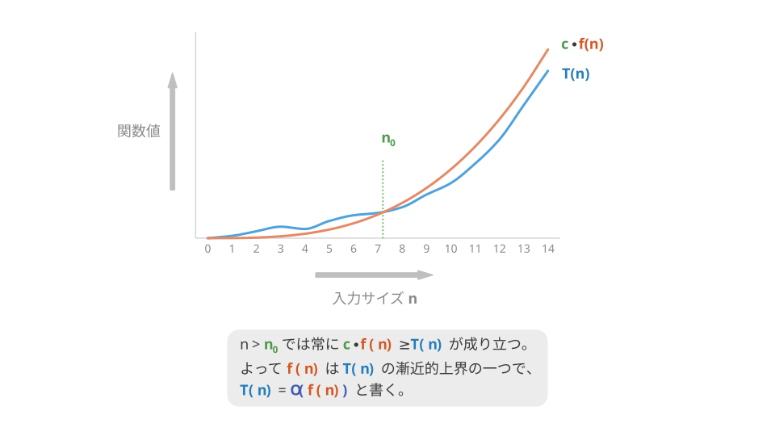
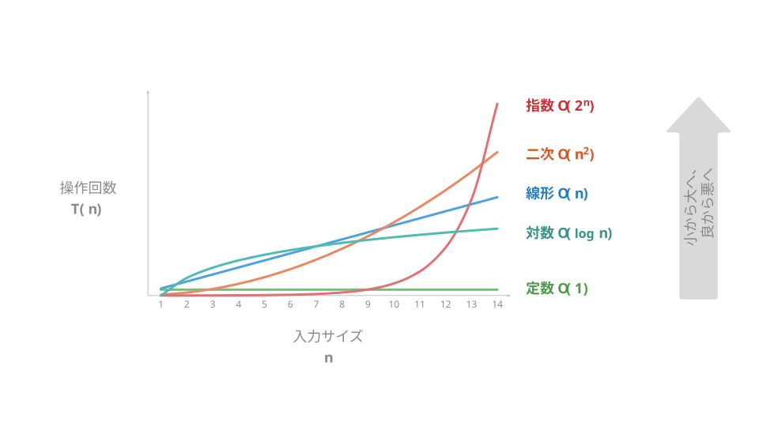
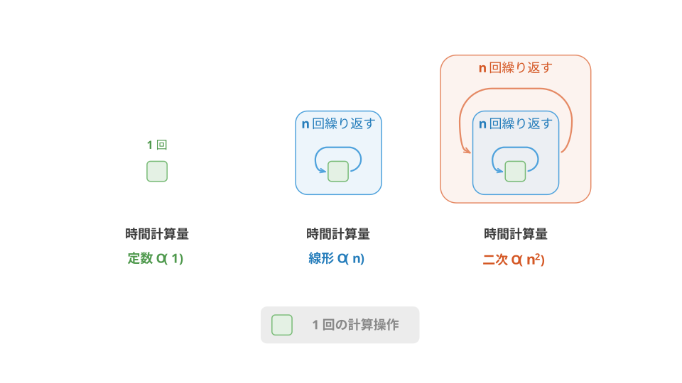
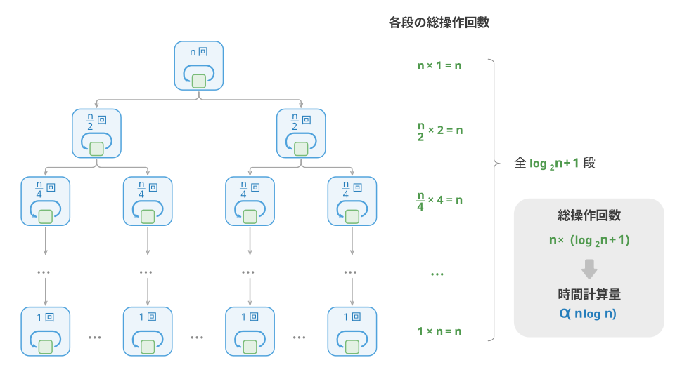
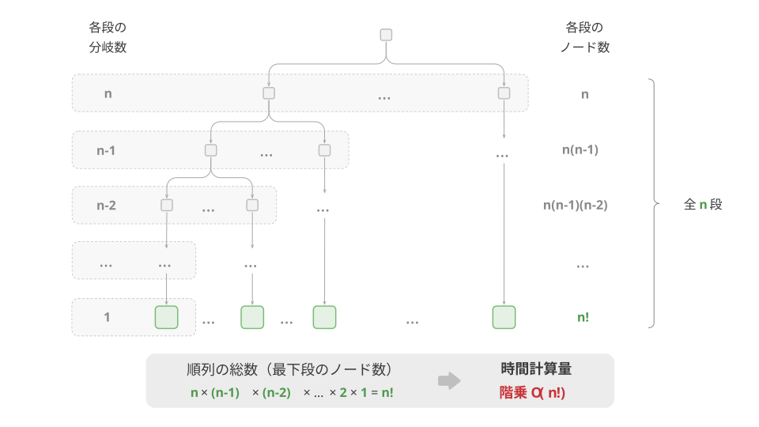

# 2.3 &nbsp; 時間計算量

実行時間は、アルゴリズムの効率を直感的かつ正確に表します。では、あるコードの実行時間を正確に見積もるには、どうすればよいでしょうか。

1. **実行環境を決めます**。ハードウェア構成、プログラミング言語、システム環境などは、いずれもコードの実行効率に影響します。
2. **各計算操作にかかる時間を見積もります**。例えば、加算 `+` は 1 ns、乗算 `*` は 10 ns、表示 `print()` は 5 ns といった具合です。
3. **コードに含まれる計算操作をすべて数え**、それぞれにかかる時間を足し合わせて実行時間を求めます。

例えば、次のコードの入力サイズは $n$ です。

=== "Python"

    ```python title=""
    # ある実行環境での例
    def algorithm(n: int):
        a = 2      # 1 ns
        a = a + 1  # 1 ns
        a = a * 2  # 10 ns
        # n 回繰り返す
        for _ in range(n):  # 1 ns
            print(0)        # 5 ns
    ```

=== "C++"

    ```cpp title=""
    // ある実行環境での例
    void algorithm(int n) {
        int a = 2;  // 1 ns
        a = a + 1;  // 1 ns
        a = a * 2;  // 10 ns
        // n 回繰り返す
        for (int i = 0; i < n; i++) {  // 1 ns
            cout << 0 << endl;         // 5 ns
        }
    }
    ```

=== "Java"

    ```java title=""
    // ある実行環境での例
    void algorithm(int n) {
        int a = 2;  // 1 ns
        a = a + 1;  // 1 ns
        a = a * 2;  // 10 ns
        // n 回繰り返す
        for (int i = 0; i < n; i++) {  // 1 ns
            System.out.println(0);     // 5 ns
        }
    }
    ```

=== "C#"

    ```csharp title=""
    // ある実行環境での例
    void Algorithm(int n) {
        int a = 2;  // 1 ns
        a = a + 1;  // 1 ns
        a = a * 2;  // 10 ns
        // n 回繰り返す
        for (int i = 0; i < n; i++) {  // 1 ns
            Console.WriteLine(0);      // 5 ns
        }
    }
    ```

=== "Go"

    ```go title=""
    // ある実行環境での例
    func algorithm(n int) {
        a := 2     // 1 ns
        a = a + 1  // 1 ns
        a = a * 2  // 10 ns
        // n 回繰り返す
        for i := 0; i < n; i++ {  // 1 ns
            fmt.Println(a)        // 5 ns
        }
    }
    ```

=== "Swift"

    ```swift title=""
    // ある実行環境での例
    func algorithm(n: Int) {
        var a = 2 // 1 ns
        a = a + 1 // 1 ns
        a = a * 2 // 10 ns
        // n 回繰り返す
        for _ in 0 ..< n { // 1 ns
            print(0) // 5 ns
        }
    }
    ```

=== "JS"

    ```javascript title=""
    // ある実行環境での例
    function algorithm(n) {
        var a = 2; // 1 ns
        a = a + 1; // 1 ns
        a = a * 2; // 10 ns
        // n 回繰り返す
        for(let i = 0; i < n; i++) { // 1 ns
            console.log(0); // 5 ns
        }
    }
    ```

=== "TS"

    ```typescript title=""
    // ある実行環境での例
    function algorithm(n: number): void {
        var a: number = 2; // 1 ns
        a = a + 1; // 1 ns
        a = a * 2; // 10 ns
        // n 回繰り返す
        for(let i = 0; i < n; i++) { // 1 ns
            console.log(0); // 5 ns
        }
    }
    ```

=== "Dart"

    ```dart title=""
    // ある実行環境での例
    void algorithm(int n) {
      int a = 2; // 1 ns
      a = a + 1; // 1 ns
      a = a * 2; // 10 ns
      // n 回繰り返す
      for (int i = 0; i < n; i++) { // 1 ns
        print(0); // 5 ns
      }
    }
    ```

=== "Rust"

    ```rust title=""
    // ある実行環境での例
    fn algorithm(n: i32) {
        let mut a = 2;      // 1 ns
        a = a + 1;          // 1 ns
        a = a * 2;          // 10 ns
        // n 回繰り返す
        for _ in 0..n {     // 1 ns
            println!("{}", 0);  // 5 ns
        }
    }
    ```

=== "C"

    ```c title=""
    // ある実行環境での例
    void algorithm(int n) {
        int a = 2;  // 1 ns
        a = a + 1;  // 1 ns
        a = a * 2;  // 10 ns
        // n 回繰り返す
        for (int i = 0; i < n; i++) {   // 1 ns
            printf("%d", 0);            // 5 ns
        }
    }
    ```

=== "Kotlin"

    ```kotlin title=""
    // ある実行環境での例
    fun algorithm(n: Int) {
        var a = 2 // 1 ns
        a = a + 1 // 1 ns
        a = a * 2 // 10 ns
        // n 回繰り返す
        for (i in 0..<n) {  // 1 ns
            println(0)      // 5 ns
        }
    }
    ```

=== "Ruby"

    ```ruby title=""
    # ある実行環境での例
    def algorithm(n)
        a = 2       # 1 ns
        a = a + 1   # 1 ns
        a = a * 2   # 10 ns
        # n 回繰り返す
        (0...n).each do # 1 ns
            puts 0      # 5 ns
        end
    end
    ```

この方法で計算すると、アルゴリズムの実行時間は $(6n + 12)$ ns となります。

$$
1 + 1 + 10 + (1 + 5) \times n = 6n + 12
$$

しかし、実際には**このように実行時間を積み上げることは、適切でも現実的でもありません**。第一に、アルゴリズムはさまざまな環境で動くため、見積もりを特定の実行環境に結び付けたくありません。第二に、操作ごとの実行時間を知るのは難しく、見積もりに大きな手間がかかります。

## 2.3.1 &nbsp; 実行時間の増え方を調べる

時間計算量の分析で調べるのは実行時間そのものではなく、**データ量が大きくなると実行時間がどのように増えるかです**。

「実行時間の増え方」という言葉は少し抽象的なので、例で考えてみましょう。入力サイズを $n$ とし、3 つのアルゴリズム `A`、`B`、`C` を用意します。

=== "Python"

    ```python title=""
    # アルゴリズム A の時間計算量：定数オーダー
    def algorithm_A(n: int):
        print(0)
    # アルゴリズム B の時間計算量：線形オーダー
    def algorithm_B(n: int):
        for _ in range(n):
            print(0)
    # アルゴリズム C の時間計算量：定数オーダー
    def algorithm_C(n: int):
        for _ in range(1000000):
            print(0)
    ```

=== "C++"

    ```cpp title=""
    // アルゴリズム A の時間計算量：定数オーダー
    void algorithm_A(int n) {
        cout << 0 << endl;
    }
    // アルゴリズム B の時間計算量：線形オーダー
    void algorithm_B(int n) {
        for (int i = 0; i < n; i++) {
            cout << 0 << endl;
        }
    }
    // アルゴリズム C の時間計算量：定数オーダー
    void algorithm_C(int n) {
        for (int i = 0; i < 1000000; i++) {
            cout << 0 << endl;
        }
    }
    ```

=== "Java"

    ```java title=""
    // アルゴリズム A の時間計算量：定数オーダー
    void algorithm_A(int n) {
        System.out.println(0);
    }
    // アルゴリズム B の時間計算量：線形オーダー
    void algorithm_B(int n) {
        for (int i = 0; i < n; i++) {
            System.out.println(0);
        }
    }
    // アルゴリズム C の時間計算量：定数オーダー
    void algorithm_C(int n) {
        for (int i = 0; i < 1000000; i++) {
            System.out.println(0);
        }
    }
    ```

=== "C#"

    ```csharp title=""
    // アルゴリズム A の時間計算量：定数オーダー
    void AlgorithmA(int n) {
        Console.WriteLine(0);
    }
    // アルゴリズム B の時間計算量：線形オーダー
    void AlgorithmB(int n) {
        for (int i = 0; i < n; i++) {
            Console.WriteLine(0);
        }
    }
    // アルゴリズム C の時間計算量：定数オーダー
    void AlgorithmC(int n) {
        for (int i = 0; i < 1000000; i++) {
            Console.WriteLine(0);
        }
    }
    ```

=== "Go"

    ```go title=""
    // アルゴリズム A の時間計算量：定数オーダー
    func algorithm_A(n int) {
        fmt.Println(0)
    }
    // アルゴリズム B の時間計算量：線形オーダー
    func algorithm_B(n int) {
        for i := 0; i < n; i++ {
            fmt.Println(0)
        }
    }
    // アルゴリズム C の時間計算量：定数オーダー
    func algorithm_C(n int) {
        for i := 0; i < 1000000; i++ {
            fmt.Println(0)
        }
    }
    ```

=== "Swift"

    ```swift title=""
    // アルゴリズム A の時間計算量：定数オーダー
    func algorithmA(n: Int) {
        print(0)
    }

    // アルゴリズム B の時間計算量：線形オーダー
    func algorithmB(n: Int) {
        for _ in 0 ..< n {
            print(0)
        }
    }

    // アルゴリズム C の時間計算量：定数オーダー
    func algorithmC(n: Int) {
        for _ in 0 ..< 1_000_000 {
            print(0)
        }
    }
    ```

=== "JS"

    ```javascript title=""
    // アルゴリズム A の時間計算量：定数オーダー
    function algorithm_A(n) {
        console.log(0);
    }
    // アルゴリズム B の時間計算量：線形オーダー
    function algorithm_B(n) {
        for (let i = 0; i < n; i++) {
            console.log(0);
        }
    }
    // アルゴリズム C の時間計算量：定数オーダー
    function algorithm_C(n) {
        for (let i = 0; i < 1000000; i++) {
            console.log(0);
        }
    }

    ```

=== "TS"

    ```typescript title=""
    // アルゴリズム A の時間計算量：定数オーダー
    function algorithm_A(n: number): void {
        console.log(0);
    }
    // アルゴリズム B の時間計算量：線形オーダー
    function algorithm_B(n: number): void {
        for (let i = 0; i < n; i++) {
            console.log(0);
        }
    }
    // アルゴリズム C の時間計算量：定数オーダー
    function algorithm_C(n: number): void {
        for (let i = 0; i < 1000000; i++) {
            console.log(0);
        }
    }
    ```

=== "Dart"

    ```dart title=""
    // アルゴリズム A の時間計算量：定数オーダー
    void algorithmA(int n) {
      print(0);
    }
    // アルゴリズム B の時間計算量：線形オーダー
    void algorithmB(int n) {
      for (int i = 0; i < n; i++) {
        print(0);
      }
    }
    // アルゴリズム C の時間計算量：定数オーダー
    void algorithmC(int n) {
      for (int i = 0; i < 1000000; i++) {
        print(0);
      }
    }
    ```

=== "Rust"

    ```rust title=""
    // アルゴリズム A の時間計算量：定数オーダー
    fn algorithm_A(n: i32) {
        println!("{}", 0);
    }
    // アルゴリズム B の時間計算量：線形オーダー
    fn algorithm_B(n: i32) {
        for _ in 0..n {
            println!("{}", 0);
        }
    }
    // アルゴリズム C の時間計算量：定数オーダー
    fn algorithm_C(n: i32) {
        for _ in 0..1000000 {
            println!("{}", 0);
        }
    }
    ```

=== "C"

    ```c title=""
    // アルゴリズム A の時間計算量：定数オーダー
    void algorithm_A(int n) {
        printf("%d", 0);
    }
    // アルゴリズム B の時間計算量：線形オーダー
    void algorithm_B(int n) {
        for (int i = 0; i < n; i++) {
            printf("%d", 0);
        }
    }
    // アルゴリズム C の時間計算量：定数オーダー
    void algorithm_C(int n) {
        for (int i = 0; i < 1000000; i++) {
            printf("%d", 0);
        }
    }
    ```

=== "Kotlin"

    ```kotlin title=""
    // アルゴリズム A の時間計算量：定数オーダー
    fun algorithm_A(n: Int) {
        println(0)
    }
    // アルゴリズム B の時間計算量：線形オーダー
    fun algorithm_B(n: Int) {
        for (i in 0..<n){
            println(0)
        }
    }
    // アルゴリズム C の時間計算量：定数オーダー
    fun algorithm_C(n: Int) {
        for (i in 0..<1000000) {
            println(0)
        }
    }
    ```

=== "Ruby"

    ```ruby title=""
    # アルゴリズム A の時間計算量：定数オーダー
    def algorithm_A(n)
        puts 0
    end

    # アルゴリズム B の時間計算量：線形オーダー
    def algorithm_B(n)
        (0...n).each { puts 0 }
    end

    # アルゴリズム C の時間計算量：定数オーダー
    def algorithm_C(n)
        (0...1_000_000).each { puts 0 }
    end
    ```

図 2-7 は、これら 3 つの関数の時間計算量を示しています。

- アルゴリズム `A` は表示を $1$ 回しか行わず、$n$ が大きくなっても実行時間は増えません。この時間計算量を「定数オーダー」と呼びます。
- アルゴリズム `B` は表示を $n$ 回繰り返すため、実行時間は $n$ とともに線形に増えます。この時間計算量を「線形オーダー」と呼びます。
- アルゴリズム `C` は表示を $1000000$ 回繰り返します。実行時間は長くても、入力サイズ $n$ には依存しません。したがって `C` の時間計算量は `A` と同じ「定数オーダー」です。

{ class="animation-figure" }

<p align="center"> 図 2-7 &nbsp; アルゴリズム A、B、C の実行時間の増え方 </p>

実行時間を直接求める場合と比べて、時間計算量の分析にはどのような特徴があるでしょうか。

- **時間計算量は、アルゴリズムの効率を評価するのに役立ちます**。例えば `B` の実行時間は線形に増え、$n > 1$ では `A` よりも遅く、$n > 1000000$ では `C` よりも遅くなります。入力サイズ $n$ が十分大きくなれば、定数オーダーのアルゴリズムは必ず線形オーダーのアルゴリズムより速くなります。これが実行時間の増え方に着目するということです。
- **時間計算量はより簡単に見積もれます**。実行環境や計算操作の種類は、実行時間の増え方に関係しません。そのため時間計算量の分析では、どの計算操作にも同じ「単位時間」がかかるとみなせます。「各計算操作の実行時間を求める」作業が「計算操作の回数を数える」だけで済み、見積もりがずっと容易になります。
- **時間計算量にも限界があります**。例えば `A` と `C` の時間計算量は同じでも、実行時間は大きく異なります。また `B` の時間計算量は `C` より大きくても、入力サイズ $n$ が小さいときは `B` のほうが `C` より明らかに速くなります。このような場合、時間計算量だけで効率の優劣を判断するのは困難です。それでも、計算量解析は効率を評価するうえで最も有効で広く使われている方法です。

## 2.3.2 &nbsp; 関数の漸近的上界

入力サイズが $n$ の次の関数を考えます。

=== "Python"

    ```python title=""
    def algorithm(n: int):
        a = 1      # +1
        a = a + 1  # +1
        a = a * 2  # +1
        # n 回繰り返す
        for i in range(n):  # +1
            print(0)        # +1
    ```

=== "C++"

    ```cpp title=""
    void algorithm(int n) {
        int a = 1;  // +1
        a = a + 1;  // +1
        a = a * 2;  // +1
        // n 回繰り返す
        for (int i = 0; i < n; i++) { // +1（毎回 i ++ を実行）
            cout << 0 << endl;    // +1
        }
    }
    ```

=== "Java"

    ```java title=""
    void algorithm(int n) {
        int a = 1;  // +1
        a = a + 1;  // +1
        a = a * 2;  // +1
        // n 回繰り返す
        for (int i = 0; i < n; i++) { // +1（毎回 i ++ を実行）
            System.out.println(0);    // +1
        }
    }
    ```

=== "C#"

    ```csharp title=""
    void Algorithm(int n) {
        int a = 1;  // +1
        a = a + 1;  // +1
        a = a * 2;  // +1
        // n 回繰り返す
        for (int i = 0; i < n; i++) {   // +1（毎回 i ++ を実行）
            Console.WriteLine(0);   // +1
        }
    }
    ```

=== "Go"

    ```go title=""
    func algorithm(n int) {
        a := 1      // +1
        a = a + 1   // +1
        a = a * 2   // +1
        // n 回繰り返す
        for i := 0; i < n; i++ {   // +1
            fmt.Println(a)         // +1
        }
    }
    ```

=== "Swift"

    ```swift title=""
    func algorithm(n: Int) {
        var a = 1 // +1
        a = a + 1 // +1
        a = a * 2 // +1
        // n 回繰り返す
        for _ in 0 ..< n { // +1
            print(0) // +1
        }
    }
    ```

=== "JS"

    ```javascript title=""
    function algorithm(n) {
        var a = 1; // +1
        a += 1; // +1
        a *= 2; // +1
        // n 回繰り返す
        for(let i = 0; i < n; i++){ // +1（毎回 i ++ を実行）
            console.log(0); // +1
        }
    }
    ```

=== "TS"

    ```typescript title=""
    function algorithm(n: number): void{
        var a: number = 1; // +1
        a += 1; // +1
        a *= 2; // +1
        // n 回繰り返す
        for(let i = 0; i < n; i++){ // +1（毎回 i ++ を実行）
            console.log(0); // +1
        }
    }
    ```

=== "Dart"

    ```dart title=""
    void algorithm(int n) {
      int a = 1; // +1
      a = a + 1; // +1
      a = a * 2; // +1
      // n 回繰り返す
      for (int i = 0; i < n; i++) { // +1（毎回 i ++ を実行）
        print(0); // +1
      }
    }
    ```

=== "Rust"

    ```rust title=""
    fn algorithm(n: i32) {
        let mut a = 1;   // +1
        a = a + 1;      // +1
        a = a * 2;      // +1

        // n 回繰り返す
        for _ in 0..n { // +1（毎回 i ++ を実行）
            println!("{}", 0); // +1
        }
    }
    ```

=== "C"

    ```c title=""
    void algorithm(int n) {
        int a = 1;  // +1
        a = a + 1;  // +1
        a = a * 2;  // +1
        // n 回繰り返す
        for (int i = 0; i < n; i++) {   // +1（毎回 i ++ を実行）
            printf("%d", 0);            // +1
        }
    }
    ```

=== "Kotlin"

    ```kotlin title=""
    fun algorithm(n: Int) {
        var a = 1 // +1
        a = a + 1 // +1
        a = a * 2 // +1
        // n 回繰り返す
        for (i in 0..<n) { // +1（毎回 i ++ を実行）
            println(0) // +1
        }
    }
    ```

=== "Ruby"

    ```ruby title=""
    def algorithm(n)
        a = 1       # +1
        a = a + 1   # +1
        a = a * 2   # +1
        # n 回繰り返す
        (0...n).each do # +1
            puts 0      # +1
        end
    end
    ```

操作回数を入力サイズ $n$ の関数と考え、$T(n)$ と書くことにします。上の関数の操作回数は次のようになります。

$$
T(n) = 3 + 2n
$$

$T(n)$ は一次関数ですから、実行時間は線形に増え、時間計算量は線形オーダーです。

線形オーダーの時間計算量を $O(n)$ と書きます。この数学的な表記を<u>ビッグ $O$ 記法（big-$O$ notation）</u>といい、関数 $T(n)$ の<u>漸近的上界（asymptotic upper bound）</u>を表します。

時間計算量の分析とは、本質的には「操作回数 $T(n)$」の漸近的上界を求めることです。これには明確な数学的定義があります。

!!! note "関数の漸近的上界"

    正の実数 $c$ と実数 $n_0$ が存在して、すべての $n > n_0$ に対して $T(n) \leq c \cdot f(n)$ が成り立つとき、$f(n)$ は $T(n)$ の漸近的上界の一つを与えるといい、$T(n) = O(f(n))$ と書きます。

図 2-8 のように、漸近的上界を求めるには関数 $f(n)$ を探します。$n$ が無限大に近づくとき、$T(n)$ と $f(n)$ の増加のオーダーが同じで、両者の違いは定数係数 $c$ だけとなるような関数です。

{ class="animation-figure" }

<p align="center"> 図 2-8 &nbsp; 関数の漸近的上界 </p>

## 2.3.3 &nbsp; 計算量の求め方

漸近的上界は少し数学的なので、今すぐ完全に理解できなくても心配はいりません。まずは求め方を覚え、練習を重ねるうちに、その数学的な意味も少しずつつかめるようになります。

定義から、$f(n)$ が決まれば時間計算量 $O(f(n))$ がわかります。では、漸近的上界 $f(n)$ はどう決めればよいでしょうか。まず操作回数を数え、次に漸近的上界を判定するという 2 つの手順を踏みます。

### 1. &nbsp; 手順 1：操作回数を数える

コードを上から 1 行ずつ調べて数えればよいのですが、先ほどの $c \cdot f(n)$ の定数係数 $c$ は任意の大きさに取れるので、**操作回数 $T(n)$ の係数や定数項は無視できます**。この原則を使うと、次のように数え方を簡略化できます。

1. **$T(n)$ の定数項を無視します**。定数項は $n$ に依存せず、時間計算量に影響しないからです。
2. **係数をすべて省きます**。例えば、ループの回数が $2n$ 回でも $5n + 1$ 回でも、$n$ 回と簡略化できます。$n$ の係数は時間計算量に影響しません。
3. **入れ子のループでは掛け算を使います**。総操作回数は外側と内側のループの操作回数の積です。各ループには、`1.` と `2.` の方法をそれぞれ適用できます。

次の関数に、これらの方法を適用して操作回数を数えてみましょう。

=== "Python"

    ```python title=""
    def algorithm(n: int):
        a = 1      # +0（方法 1）
        a = a + n  # +0（方法 1）
        # +n（方法 2）
        for i in range(5 * n + 1):
            print(0)
        # +n*n（方法 3）
        for i in range(2 * n):
            for j in range(n + 1):
                print(0)
    ```

=== "C++"

    ```cpp title=""
    void algorithm(int n) {
        int a = 1;  // +0（方法 1）
        a = a + n;  // +0（方法 1）
        // +n（方法 2）
        for (int i = 0; i < 5 * n + 1; i++) {
            cout << 0 << endl;
        }
        // +n*n（方法 3）
        for (int i = 0; i < 2 * n; i++) {
            for (int j = 0; j < n + 1; j++) {
                cout << 0 << endl;
            }
        }
    }
    ```

=== "Java"

    ```java title=""
    void algorithm(int n) {
        int a = 1;  // +0（方法 1）
        a = a + n;  // +0（方法 1）
        // +n（方法 2）
        for (int i = 0; i < 5 * n + 1; i++) {
            System.out.println(0);
        }
        // +n*n（方法 3）
        for (int i = 0; i < 2 * n; i++) {
            for (int j = 0; j < n + 1; j++) {
                System.out.println(0);
            }
        }
    }
    ```

=== "C#"

    ```csharp title=""
    void Algorithm(int n) {
        int a = 1;  // +0（方法 1）
        a = a + n;  // +0（方法 1）
        // +n（方法 2）
        for (int i = 0; i < 5 * n + 1; i++) {
            Console.WriteLine(0);
        }
        // +n*n（方法 3）
        for (int i = 0; i < 2 * n; i++) {
            for (int j = 0; j < n + 1; j++) {
                Console.WriteLine(0);
            }
        }
    }
    ```

=== "Go"

    ```go title=""
    func algorithm(n int) {
        a := 1     // +0（方法 1）
        a = a + n  // +0（方法 1）
        // +n（方法 2）
        for i := 0; i < 5 * n + 1; i++ {
            fmt.Println(0)
        }
        // +n*n（方法 3）
        for i := 0; i < 2 * n; i++ {
            for j := 0; j < n + 1; j++ {
                fmt.Println(0)
            }
        }
    }
    ```

=== "Swift"

    ```swift title=""
    func algorithm(n: Int) {
        var a = 1 // +0（方法 1）
        a = a + n // +0（方法 1）
        // +n（方法 2）
        for _ in 0 ..< (5 * n + 1) {
            print(0)
        }
        // +n*n（方法 3）
        for _ in 0 ..< (2 * n) {
            for _ in 0 ..< (n + 1) {
                print(0)
            }
        }
    }
    ```

=== "JS"

    ```javascript title=""
    function algorithm(n) {
        let a = 1;  // +0（方法 1）
        a = a + n;  // +0（方法 1）
        // +n（方法 2）
        for (let i = 0; i < 5 * n + 1; i++) {
            console.log(0);
        }
        // +n*n（方法 3）
        for (let i = 0; i < 2 * n; i++) {
            for (let j = 0; j < n + 1; j++) {
                console.log(0);
            }
        }
    }
    ```

=== "TS"

    ```typescript title=""
    function algorithm(n: number): void {
        let a = 1;  // +0（方法 1）
        a = a + n;  // +0（方法 1）
        // +n（方法 2）
        for (let i = 0; i < 5 * n + 1; i++) {
            console.log(0);
        }
        // +n*n（方法 3）
        for (let i = 0; i < 2 * n; i++) {
            for (let j = 0; j < n + 1; j++) {
                console.log(0);
            }
        }
    }
    ```

=== "Dart"

    ```dart title=""
    void algorithm(int n) {
      int a = 1; // +0（方法 1）
      a = a + n; // +0（方法 1）
      // +n（方法 2）
      for (int i = 0; i < 5 * n + 1; i++) {
        print(0);
      }
      // +n*n（方法 3）
      for (int i = 0; i < 2 * n; i++) {
        for (int j = 0; j < n + 1; j++) {
          print(0);
        }
      }
    }
    ```

=== "Rust"

    ```rust title=""
    fn algorithm(n: i32) {
        let mut a = 1;     // +0（方法 1）
        a = a + n;        // +0（方法 1）

        // +n（方法 2）
        for i in 0..(5 * n + 1) {
            println!("{}", 0);
        }

        // +n*n（方法 3）
        for i in 0..(2 * n) {
            for j in 0..(n + 1) {
                println!("{}", 0);
            }
        }
    }
    ```

=== "C"

    ```c title=""
    void algorithm(int n) {
        int a = 1;  // +0（方法 1）
        a = a + n;  // +0（方法 1）
        // +n（方法 2）
        for (int i = 0; i < 5 * n + 1; i++) {
            printf("%d", 0);
        }
        // +n*n（方法 3）
        for (int i = 0; i < 2 * n; i++) {
            for (int j = 0; j < n + 1; j++) {
                printf("%d", 0);
            }
        }
    }
    ```

=== "Kotlin"

    ```kotlin title=""
    fun algorithm(n: Int) {
        var a = 1   // +0（方法 1）
        a = a + n   // +0（方法 1）
        // +n（方法 2）
        for (i in 0..<5 * n + 1) {
            println(0)
        }
        // +n*n（方法 3）
        for (i in 0..<2 * n) {
            for (j in 0..<n + 1) {
                println(0)
            }
        }
    }
    ```

=== "Ruby"

    ```ruby title=""
    def algorithm(n)
        a = 1       # +0（方法 1）
        a = a + n   # +0（方法 1）
        # +n（方法 2）
        (0...(5 * n + 1)).each { puts 0 }
        # +n*n（方法 3）
        (0...(2 * n)).each do
            (0...(n + 1)).each { puts 0 }
        end
    end
    ```

次の式は、簡略化の前と後の計算結果を示します。どちらから求めても時間計算量は $O(n^2)$ です。

$$
\begin{aligned}
T(n) & = 2n(n + 1) + (5n + 1) + 2 & \text{すべて数えた場合 (-.-|||)} \newline
& = 2n^2 + 7n + 3 \newline
T(n) & = n^2 + n & \text{手早く数えた場合 (o.O)}
\end{aligned}
$$

### 2. &nbsp; 手順 2：漸近的上界を判定する

**時間計算量は $T(n)$ の最高次の項で決まります**。$n$ が無限大に近づくと、最高次の項が支配的になり、ほかの項の影響は無視できるからです。

表 2-2 にいくつか例を示します。極端に大きな値をあえて使っているのは、「係数はオーダーを変えない」ことを強調するためです。$n$ が無限大に近づけば、これらの定数の影響は小さくなります。

<p align="center"> 表 2-2 &nbsp; 操作回数とそれに対応する時間計算量 </p>

<div class="center-table" markdown>

| 操作回数 $T(n)$        | 時間計算量 $O(f(n))$ |
| ---------------------- | -------------------- |
| $100000$               | $O(1)$               |
| $3n + 2$               | $O(n)$               |
| $2n^2 + 3n + 2$        | $O(n^2)$             |
| $n^3 + 10000n^2$       | $O(n^3)$             |
| $2^n + 10000n^{10000}$ | $O(2^n)$             |

</div>

## 2.3.4 &nbsp; 代表的な計算量

入力サイズを $n$ とします。代表的な時間計算量を小さい順に並べると、図 2-9 のようになります。

$$
\begin{aligned}
& O(1) < O(\log n) < O(n) < O(n \log n) < O(n^2) < O(2^n) < O(n!) \newline
& \text{定数オーダー} < \text{対数オーダー} < \text{線形オーダー} < \text{線形対数オーダー} < \text{二次オーダー} < \text{指数オーダー} < \text{階乗オーダー}
\end{aligned}
$$

{ class="animation-figure" }

<p align="center"> 図 2-9 &nbsp; 代表的な時間計算量 </p>

### 1. &nbsp; 定数オーダー $O(1)$ {data-toc-label="1. &nbsp; 定数オーダー"}

定数オーダーの操作回数は入力サイズ $n$ に依存せず、$n$ が変わっても一定です。

次の関数で操作回数 `size` がどれほど大きくても、入力サイズ $n$ に依存しないため、時間計算量は $O(1)$ のままです。

=== "Python"

    ```python title="time_complexity.py"
    def constant(n: int) -> int:
        """定数オーダー"""
        count = 0
        size = 100000
        for _ in range(size):
            count += 1
        return count
    ```

=== "C++"

    ```cpp title="time_complexity.cpp"
    /* 定数オーダー */
    int constant(int n) {
        int count = 0;
        int size = 100000;
        for (int i = 0; i < size; i++)
            count++;
        return count;
    }
    ```

=== "Java"

    ```java title="time_complexity.java"
    /* 定数オーダー */
    int constant(int n) {
        int count = 0;
        int size = 100000;
        for (int i = 0; i < size; i++)
            count++;
        return count;
    }
    ```

=== "C#"

    ```csharp title="time_complexity.cs"
    /* 定数オーダー */
    int Constant(int n) {
        int count = 0;
        int size = 100000;
        for (int i = 0; i < size; i++)
            count++;
        return count;
    }
    ```

=== "Go"

    ```go title="time_complexity.go"
    /* 定数オーダー */
    func constant(n int) int {
        count := 0
        size := 100000
        for i := 0; i < size; i++ {
            count++
        }
        return count
    }
    ```

=== "Swift"

    ```swift title="time_complexity.swift"
    /* 定数オーダー */
    func constant(n: Int) -> Int {
        var count = 0
        let size = 100_000
        for _ in 0 ..< size {
            count += 1
        }
        return count
    }
    ```

=== "JS"

    ```javascript title="time_complexity.js"
    /* 定数オーダー */
    function constant(n) {
        let count = 0;
        const size = 100000;
        for (let i = 0; i < size; i++) count++;
        return count;
    }
    ```

=== "TS"

    ```typescript title="time_complexity.ts"
    /* 定数オーダー */
    function constant(n: number): number {
        let count = 0;
        const size = 100000;
        for (let i = 0; i < size; i++) count++;
        return count;
    }
    ```

=== "Dart"

    ```dart title="time_complexity.dart"
    /* 定数オーダー */
    int constant(int n) {
      int count = 0;
      int size = 100000;
      for (var i = 0; i < size; i++) {
        count++;
      }
      return count;
    }
    ```

=== "Rust"

    ```rust title="time_complexity.rs"
    /* 定数オーダー */
    fn constant(n: i32) -> i32 {
        _ = n;
        let mut count = 0;
        let size = 100_000;
        for _ in 0..size {
            count += 1;
        }
        count
    }
    ```

=== "C"

    ```c title="time_complexity.c"
    /* 定数オーダー */
    int constant(int n) {
        int count = 0;
        int size = 100000;
        for (int i = 0; i < size; i++) {
            count++;
        }
        return count;
    }
    ```

=== "Kotlin"

    ```kotlin title="time_complexity.kt"
    /* 定数オーダー */
    fun constant(n: Int): Int {
        var count = 0
        val size = 100000
        for (i in 0..<size)
            count++
        return count
    }
    ```

=== "Ruby"

    ```ruby title="time_complexity.rb"
    ### 定数オーダー ###
    def constant(n)
      count = 0
      size = 100000

      (0...size).each { count += 1 }

      count
    end
    ```

??? pythontutor "実行の様子を見る"

    <div style="height: 459px; width: 100%;"><iframe class="pythontutor-iframe" title="実行の様子を見る" src="https://pythontutor.com/iframe-embed.html#code=def%20constant%28n%3A%20int%29%20-%3E%20int%3A%0A%20%20%20%20%22%22%22%E5%AE%9A%E6%95%B0%E3%82%AA%E3%83%BC%E3%83%80%E3%83%BC%22%22%22%0A%20%20%20%20count%20%3D%200%0A%20%20%20%20size%20%3D%2010%0A%20%20%20%20for%20_%20in%20range%28size%29%3A%0A%20%20%20%20%20%20%20%20count%20%2B%3D%201%0A%20%20%20%20return%20count%0A%0A%22%22%22Driver%20Code%22%22%22%0Aif%20__name__%20%3D%3D%20%22__main__%22%3A%0A%20%20%20%20n%20%3D%208%0A%20%20%20%20print%28%22%E5%85%A5%E5%8A%9B%E3%83%87%E3%83%BC%E3%82%BF%E3%81%AE%E3%82%B5%E3%82%A4%E3%82%BA%20n%20%3D%22,%20n%29%0A%0A%20%20%20%20count%20%3D%20constant%28n%29%0A%20%20%20%20print%28%22%E5%AE%9A%E6%95%B0%E3%82%AA%E3%83%BC%E3%83%80%E3%83%BC%E3%81%AE%E6%93%8D%E4%BD%9C%E5%9B%9E%E6%95%B0%20%3D%22,%20count%29&codeDivHeight=472&codeDivWidth=350&cumulative=false&curInstr=3&heapPrimitives=nevernest&origin=opt-frontend.js&py=311&rawInputLstJSON=%5B%5D&textReferences=false"> </iframe></div>
    <div style="margin-top: 5px;"><a href="https://pythontutor.com/iframe-embed.html#code=def%20constant%28n%3A%20int%29%20-%3E%20int%3A%0A%20%20%20%20%22%22%22%E5%AE%9A%E6%95%B0%E3%82%AA%E3%83%BC%E3%83%80%E3%83%BC%22%22%22%0A%20%20%20%20count%20%3D%200%0A%20%20%20%20size%20%3D%2010%0A%20%20%20%20for%20_%20in%20range%28size%29%3A%0A%20%20%20%20%20%20%20%20count%20%2B%3D%201%0A%20%20%20%20return%20count%0A%0A%22%22%22Driver%20Code%22%22%22%0Aif%20__name__%20%3D%3D%20%22__main__%22%3A%0A%20%20%20%20n%20%3D%208%0A%20%20%20%20print%28%22%E5%85%A5%E5%8A%9B%E3%83%87%E3%83%BC%E3%82%BF%E3%81%AE%E3%82%B5%E3%82%A4%E3%82%BA%20n%20%3D%22,%20n%29%0A%0A%20%20%20%20count%20%3D%20constant%28n%29%0A%20%20%20%20print%28%22%E5%AE%9A%E6%95%B0%E3%82%AA%E3%83%BC%E3%83%80%E3%83%BC%E3%81%AE%E6%93%8D%E4%BD%9C%E5%9B%9E%E6%95%B0%20%3D%22,%20count%29&codeDivHeight=800&codeDivWidth=600&cumulative=false&curInstr=3&heapPrimitives=nevernest&origin=opt-frontend.js&py=311&rawInputLstJSON=%5B%5D&textReferences=false" target="_blank" rel="noopener noreferrer">全画面で表示 ></a></div>

### 2. &nbsp; 線形オーダー $O(n)$ {data-toc-label="2. &nbsp; 線形オーダー"}

線形オーダーの操作回数は、入力サイズ $n$ に対して線形に増えます。一重ループでよく見られます。

=== "Python"

    ```python title="time_complexity.py"
    def linear(n: int) -> int:
        """線形オーダー"""
        count = 0
        for _ in range(n):
            count += 1
        return count
    ```

=== "C++"

    ```cpp title="time_complexity.cpp"
    /* 線形オーダー */
    int linear(int n) {
        int count = 0;
        for (int i = 0; i < n; i++)
            count++;
        return count;
    }
    ```

=== "Java"

    ```java title="time_complexity.java"
    /* 線形オーダー */
    int linear(int n) {
        int count = 0;
        for (int i = 0; i < n; i++)
            count++;
        return count;
    }
    ```

=== "C#"

    ```csharp title="time_complexity.cs"
    /* 線形オーダー */
    int Linear(int n) {
        int count = 0;
        for (int i = 0; i < n; i++)
            count++;
        return count;
    }
    ```

=== "Go"

    ```go title="time_complexity.go"
    /* 線形オーダー */
    func linear(n int) int {
        count := 0
        for i := 0; i < n; i++ {
            count++
        }
        return count
    }
    ```

=== "Swift"

    ```swift title="time_complexity.swift"
    /* 線形オーダー */
    func linear(n: Int) -> Int {
        var count = 0
        for _ in 0 ..< n {
            count += 1
        }
        return count
    }
    ```

=== "JS"

    ```javascript title="time_complexity.js"
    /* 線形オーダー */
    function linear(n) {
        let count = 0;
        for (let i = 0; i < n; i++) count++;
        return count;
    }
    ```

=== "TS"

    ```typescript title="time_complexity.ts"
    /* 線形オーダー */
    function linear(n: number): number {
        let count = 0;
        for (let i = 0; i < n; i++) count++;
        return count;
    }
    ```

=== "Dart"

    ```dart title="time_complexity.dart"
    /* 線形オーダー */
    int linear(int n) {
      int count = 0;
      for (var i = 0; i < n; i++) {
        count++;
      }
      return count;
    }
    ```

=== "Rust"

    ```rust title="time_complexity.rs"
    /* 線形オーダー */
    fn linear(n: i32) -> i32 {
        let mut count = 0;
        for _ in 0..n {
            count += 1;
        }
        count
    }
    ```

=== "C"

    ```c title="time_complexity.c"
    /* 線形オーダー */
    int linear(int n) {
        int count = 0;
        for (int i = 0; i < n; i++) {
            count++;
        }
        return count;
    }
    ```

=== "Kotlin"

    ```kotlin title="time_complexity.kt"
    /* 線形オーダー */
    fun linear(n: Int): Int {
        var count = 0
        for (i in 0..<n)
            count++
        return count
    }
    ```

=== "Ruby"

    ```ruby title="time_complexity.rb"
    ### 線形オーダー ###
    def linear(n)
      count = 0
      (0...n).each { count += 1 }
      count
    end
    ```

??? pythontutor "実行の様子を見る"

    <div style="height: 441px; width: 100%;"><iframe class="pythontutor-iframe" title="実行の様子を見る" src="https://pythontutor.com/iframe-embed.html#code=def%20linear%28n%29%20-%3E%20int%3A%0A%20%20%20%20%22%22%22%E7%B7%9A%E5%BD%A2%E3%82%AA%E3%83%BC%E3%83%80%E3%83%BC%22%22%22%0A%20%20%20%20count%20%3D%200%0A%20%20%20%20for%20_%20in%20range%28n%29%3A%0A%20%20%20%20%20%20%20%20count%20%2B%3D%201%0A%20%20%20%20return%20count%0A%0A%22%22%22Driver%20Code%22%22%22%0Aif%20__name__%20%3D%3D%20%22__main__%22%3A%0A%20%20%20%20n%20%3D%208%0A%20%20%20%20print%28%22%E5%85%A5%E5%8A%9B%E3%83%87%E3%83%BC%E3%82%BF%E3%81%AE%E3%82%B5%E3%82%A4%E3%82%BA%20n%20%3D%22,%20n%29%0A%0A%20%20%20%20count%20%3D%20linear%28n%29%0A%20%20%20%20print%28%22%E7%B7%9A%E5%BD%A2%E3%82%AA%E3%83%BC%E3%83%80%E3%83%BC%E3%81%AE%E6%93%8D%E4%BD%9C%E5%9B%9E%E6%95%B0%20%3D%22,%20count%29&codeDivHeight=472&codeDivWidth=350&cumulative=false&curInstr=3&heapPrimitives=nevernest&origin=opt-frontend.js&py=311&rawInputLstJSON=%5B%5D&textReferences=false"> </iframe></div>
    <div style="margin-top: 5px;"><a href="https://pythontutor.com/iframe-embed.html#code=def%20linear%28n%29%20-%3E%20int%3A%0A%20%20%20%20%22%22%22%E7%B7%9A%E5%BD%A2%E3%82%AA%E3%83%BC%E3%83%80%E3%83%BC%22%22%22%0A%20%20%20%20count%20%3D%200%0A%20%20%20%20for%20_%20in%20range%28n%29%3A%0A%20%20%20%20%20%20%20%20count%20%2B%3D%201%0A%20%20%20%20return%20count%0A%0A%22%22%22Driver%20Code%22%22%22%0Aif%20__name__%20%3D%3D%20%22__main__%22%3A%0A%20%20%20%20n%20%3D%208%0A%20%20%20%20print%28%22%E5%85%A5%E5%8A%9B%E3%83%87%E3%83%BC%E3%82%BF%E3%81%AE%E3%82%B5%E3%82%A4%E3%82%BA%20n%20%3D%22,%20n%29%0A%0A%20%20%20%20count%20%3D%20linear%28n%29%0A%20%20%20%20print%28%22%E7%B7%9A%E5%BD%A2%E3%82%AA%E3%83%BC%E3%83%80%E3%83%BC%E3%81%AE%E6%93%8D%E4%BD%9C%E5%9B%9E%E6%95%B0%20%3D%22,%20count%29&codeDivHeight=800&codeDivWidth=600&cumulative=false&curInstr=3&heapPrimitives=nevernest&origin=opt-frontend.js&py=311&rawInputLstJSON=%5B%5D&textReferences=false" target="_blank" rel="noopener noreferrer">全画面で表示 ></a></div>

配列や連結リストの走査はいずれも時間計算量が $O(n)$ です。ここで $n$ は配列または連結リストの長さです。

=== "Python"

    ```python title="time_complexity.py"
    def array_traversal(nums: list[int]) -> int:
        """線形オーダー（配列の走査）"""
        count = 0
        # 反復回数は配列の長さに比例
        for num in nums:
            count += 1
        return count
    ```

=== "C++"

    ```cpp title="time_complexity.cpp"
    /* 線形オーダー（配列の走査） */
    int arrayTraversal(vector<int> &nums) {
        int count = 0;
        // 反復回数は配列の長さに比例
        for (int num : nums) {
            count++;
        }
        return count;
    }
    ```

=== "Java"

    ```java title="time_complexity.java"
    /* 線形オーダー（配列の走査） */
    int arrayTraversal(int[] nums) {
        int count = 0;
        // 反復回数は配列の長さに比例
        for (int num : nums) {
            count++;
        }
        return count;
    }
    ```

=== "C#"

    ```csharp title="time_complexity.cs"
    /* 線形オーダー（配列の走査） */
    int ArrayTraversal(int[] nums) {
        int count = 0;
        // 反復回数は配列の長さに比例
        foreach (int num in nums) {
            count++;
        }
        return count;
    }
    ```

=== "Go"

    ```go title="time_complexity.go"
    /* 線形オーダー（配列の走査） */
    func arrayTraversal(nums []int) int {
        count := 0
        // 反復回数は配列の長さに比例
        for range nums {
            count++
        }
        return count
    }
    ```

=== "Swift"

    ```swift title="time_complexity.swift"
    /* 線形オーダー（配列の走査） */
    func arrayTraversal(nums: [Int]) -> Int {
        var count = 0
        // 反復回数は配列の長さに比例
        for _ in nums {
            count += 1
        }
        return count
    }
    ```

=== "JS"

    ```javascript title="time_complexity.js"
    /* 線形オーダー（配列の走査） */
    function arrayTraversal(nums) {
        let count = 0;
        // 反復回数は配列の長さに比例
        for (let i = 0; i < nums.length; i++) {
            count++;
        }
        return count;
    }
    ```

=== "TS"

    ```typescript title="time_complexity.ts"
    /* 線形オーダー（配列の走査） */
    function arrayTraversal(nums: number[]): number {
        let count = 0;
        // 反復回数は配列の長さに比例
        for (let i = 0; i < nums.length; i++) {
            count++;
        }
        return count;
    }
    ```

=== "Dart"

    ```dart title="time_complexity.dart"
    /* 線形オーダー（配列の走査） */
    int arrayTraversal(List<int> nums) {
      int count = 0;
      // 反復回数は配列の長さに比例
      for (var _num in nums) {
        count++;
      }
      return count;
    }
    ```

=== "Rust"

    ```rust title="time_complexity.rs"
    /* 線形オーダー（配列の走査） */
    fn array_traversal(nums: &[i32]) -> i32 {
        let mut count = 0;
        // 反復回数は配列の長さに比例
        for _ in nums {
            count += 1;
        }
        count
    }
    ```

=== "C"

    ```c title="time_complexity.c"
    /* 線形オーダー（配列の走査） */
    int arrayTraversal(int *nums, int n) {
        int count = 0;
        // 反復回数は配列の長さに比例
        for (int i = 0; i < n; i++) {
            count++;
        }
        return count;
    }
    ```

=== "Kotlin"

    ```kotlin title="time_complexity.kt"
    /* 線形オーダー（配列の走査） */
    fun arrayTraversal(nums: IntArray): Int {
        var count = 0
        // 反復回数は配列の長さに比例
        for (num in nums) {
            count++
        }
        return count
    }
    ```

=== "Ruby"

    ```ruby title="time_complexity.rb"
    ### 線形オーダー（配列の走査）###
    def array_traversal(nums)
      count = 0

      # 反復回数は配列の長さに比例
      for num in nums
        count += 1
      end

      count
    end
    ```

??? pythontutor "実行の様子を見る"

    <div style="height: 459px; width: 100%;"><iframe class="pythontutor-iframe" title="実行の様子を見る" src="https://pythontutor.com/iframe-embed.html#code=def%20array_traversal%28nums%3A%20list%5Bint%5D%29%20-%3E%20int%3A%0A%20%20%20%20%22%22%22%E7%B7%9A%E5%BD%A2%E3%82%AA%E3%83%BC%E3%83%80%E3%83%BC%EF%BC%88%E9%85%8D%E5%88%97%E3%81%AE%E8%B5%B0%E6%9F%BB%EF%BC%89%22%22%22%0A%20%20%20%20count%20%3D%200%0A%20%20%20%20%23%20%E5%8F%8D%E5%BE%A9%E5%9B%9E%E6%95%B0%E3%81%AF%E9%85%8D%E5%88%97%E3%81%AE%E9%95%B7%E3%81%95%E3%81%AB%E6%AF%94%E4%BE%8B%0A%20%20%20%20for%20num%20in%20nums%3A%0A%20%20%20%20%20%20%20%20count%20%2B%3D%201%0A%20%20%20%20return%20count%0A%0A%22%22%22Driver%20Code%22%22%22%0Aif%20__name__%20%3D%3D%20%22__main__%22%3A%0A%20%20%20%20n%20%3D%208%0A%20%20%20%20print%28%22%E5%85%A5%E5%8A%9B%E3%83%87%E3%83%BC%E3%82%BF%E3%81%AE%E3%82%B5%E3%82%A4%E3%82%BA%20n%20%3D%22,%20n%29%0A%0A%20%20%20%20count%20%3D%20array_traversal%28%5B0%5D%20%2A%20n%29%0A%20%20%20%20print%28%22%E7%B7%9A%E5%BD%A2%E3%82%AA%E3%83%BC%E3%83%80%E3%83%BC%EF%BC%88%E9%85%8D%E5%88%97%E3%81%AE%E8%B5%B0%E6%9F%BB%EF%BC%89%E3%81%AE%E6%93%8D%E4%BD%9C%E5%9B%9E%E6%95%B0%20%3D%22,%20count%29&codeDivHeight=472&codeDivWidth=350&cumulative=false&curInstr=3&heapPrimitives=nevernest&origin=opt-frontend.js&py=311&rawInputLstJSON=%5B%5D&textReferences=false"> </iframe></div>
    <div style="margin-top: 5px;"><a href="https://pythontutor.com/iframe-embed.html#code=def%20array_traversal%28nums%3A%20list%5Bint%5D%29%20-%3E%20int%3A%0A%20%20%20%20%22%22%22%E7%B7%9A%E5%BD%A2%E3%82%AA%E3%83%BC%E3%83%80%E3%83%BC%EF%BC%88%E9%85%8D%E5%88%97%E3%81%AE%E8%B5%B0%E6%9F%BB%EF%BC%89%22%22%22%0A%20%20%20%20count%20%3D%200%0A%20%20%20%20%23%20%E5%8F%8D%E5%BE%A9%E5%9B%9E%E6%95%B0%E3%81%AF%E9%85%8D%E5%88%97%E3%81%AE%E9%95%B7%E3%81%95%E3%81%AB%E6%AF%94%E4%BE%8B%0A%20%20%20%20for%20num%20in%20nums%3A%0A%20%20%20%20%20%20%20%20count%20%2B%3D%201%0A%20%20%20%20return%20count%0A%0A%22%22%22Driver%20Code%22%22%22%0Aif%20__name__%20%3D%3D%20%22__main__%22%3A%0A%20%20%20%20n%20%3D%208%0A%20%20%20%20print%28%22%E5%85%A5%E5%8A%9B%E3%83%87%E3%83%BC%E3%82%BF%E3%81%AE%E3%82%B5%E3%82%A4%E3%82%BA%20n%20%3D%22,%20n%29%0A%0A%20%20%20%20count%20%3D%20array_traversal%28%5B0%5D%20%2A%20n%29%0A%20%20%20%20print%28%22%E7%B7%9A%E5%BD%A2%E3%82%AA%E3%83%BC%E3%83%80%E3%83%BC%EF%BC%88%E9%85%8D%E5%88%97%E3%81%AE%E8%B5%B0%E6%9F%BB%EF%BC%89%E3%81%AE%E6%93%8D%E4%BD%9C%E5%9B%9E%E6%95%B0%20%3D%22,%20count%29&codeDivHeight=800&codeDivWidth=600&cumulative=false&curInstr=3&heapPrimitives=nevernest&origin=opt-frontend.js&py=311&rawInputLstJSON=%5B%5D&textReferences=false" target="_blank" rel="noopener noreferrer">全画面で表示 ></a></div>

**何を入力サイズ $n$ とするかは、入力データの型に合わせて決めます**。最初の例では変数 $n$ の値が入力サイズで、2 番目の例では配列の長さ $n$ が入力サイズです。

### 3. &nbsp; 二次オーダー $O(n^2)$ {data-toc-label="3. &nbsp; 二次オーダー"}

二次オーダーの操作回数は入力サイズ $n$ の二乗に比例して増えます。入れ子のループでよく見られ、外側と内側のループの時間計算量がそれぞれ $O(n)$ なら、全体の時間計算量は $O(n^2)$ です。

=== "Python"

    ```python title="time_complexity.py"
    def quadratic(n: int) -> int:
        """二次オーダー"""
        count = 0
        # 反復回数はデータサイズ n の二乗に比例
        for i in range(n):
            for j in range(n):
                count += 1
        return count
    ```

=== "C++"

    ```cpp title="time_complexity.cpp"
    /* 二次オーダー */
    int quadratic(int n) {
        int count = 0;
        // 反復回数はデータサイズ n の二乗に比例
        for (int i = 0; i < n; i++) {
            for (int j = 0; j < n; j++) {
                count++;
            }
        }
        return count;
    }
    ```

=== "Java"

    ```java title="time_complexity.java"
    /* 二次オーダー */
    int quadratic(int n) {
        int count = 0;
        // 反復回数はデータサイズ n の二乗に比例
        for (int i = 0; i < n; i++) {
            for (int j = 0; j < n; j++) {
                count++;
            }
        }
        return count;
    }
    ```

=== "C#"

    ```csharp title="time_complexity.cs"
    /* 二次オーダー */
    int Quadratic(int n) {
        int count = 0;
        // 反復回数はデータサイズ n の二乗に比例
        for (int i = 0; i < n; i++) {
            for (int j = 0; j < n; j++) {
                count++;
            }
        }
        return count;
    }
    ```

=== "Go"

    ```go title="time_complexity.go"
    /* 二次オーダー */
    func quadratic(n int) int {
        count := 0
        // 反復回数はデータサイズ n の二乗に比例
        for i := 0; i < n; i++ {
            for j := 0; j < n; j++ {
                count++
            }
        }
        return count
    }
    ```

=== "Swift"

    ```swift title="time_complexity.swift"
    /* 二次オーダー */
    func quadratic(n: Int) -> Int {
        var count = 0
        // 反復回数はデータサイズ n の二乗に比例
        for _ in 0 ..< n {
            for _ in 0 ..< n {
                count += 1
            }
        }
        return count
    }
    ```

=== "JS"

    ```javascript title="time_complexity.js"
    /* 二次オーダー */
    function quadratic(n) {
        let count = 0;
        // 反復回数はデータサイズ n の二乗に比例
        for (let i = 0; i < n; i++) {
            for (let j = 0; j < n; j++) {
                count++;
            }
        }
        return count;
    }
    ```

=== "TS"

    ```typescript title="time_complexity.ts"
    /* 二次オーダー */
    function quadratic(n: number): number {
        let count = 0;
        // 反復回数はデータサイズ n の二乗に比例
        for (let i = 0; i < n; i++) {
            for (let j = 0; j < n; j++) {
                count++;
            }
        }
        return count;
    }
    ```

=== "Dart"

    ```dart title="time_complexity.dart"
    /* 二次オーダー */
    int quadratic(int n) {
      int count = 0;
      // 反復回数はデータサイズ n の二乗に比例
      for (int i = 0; i < n; i++) {
        for (int j = 0; j < n; j++) {
          count++;
        }
      }
      return count;
    }
    ```

=== "Rust"

    ```rust title="time_complexity.rs"
    /* 二次オーダー */
    fn quadratic(n: i32) -> i32 {
        let mut count = 0;
        // 反復回数はデータサイズ n の二乗に比例
        for _ in 0..n {
            for _ in 0..n {
                count += 1;
            }
        }
        count
    }
    ```

=== "C"

    ```c title="time_complexity.c"
    /* 二次オーダー */
    int quadratic(int n) {
        int count = 0;
        // 反復回数はデータサイズ n の二乗に比例
        for (int i = 0; i < n; i++) {
            for (int j = 0; j < n; j++) {
                count++;
            }
        }
        return count;
    }
    ```

=== "Kotlin"

    ```kotlin title="time_complexity.kt"
    /* 二次オーダー */
    fun quadratic(n: Int): Int {
        var count = 0
        // 反復回数はデータサイズ n の二乗に比例
        for (i in 0..<n) {
            for (j in 0..<n) {
                count++
            }
        }
        return count
    }
    ```

=== "Ruby"

    ```ruby title="time_complexity.rb"
    ### 二次オーダー ###
    def quadratic(n)
      count = 0

      # 反復回数はデータサイズ n の二乗に比例
      for i in 0...n
        for j in 0...n
          count += 1
        end
      end

      count
    end
    ```

??? pythontutor "実行の様子を見る"

    <div style="height: 477px; width: 100%;"><iframe class="pythontutor-iframe" title="実行の様子を見る" src="https://pythontutor.com/iframe-embed.html#code=def%20quadratic%28n%29%20-%3E%20int%3A%0A%20%20%20%20%22%22%22%E4%BA%8C%E6%AC%A1%E3%82%AA%E3%83%BC%E3%83%80%E3%83%BC%22%22%22%0A%20%20%20%20count%20%3D%200%0A%20%20%20%20%23%20%E5%8F%8D%E5%BE%A9%E5%9B%9E%E6%95%B0%E3%81%AF%E3%83%87%E3%83%BC%E3%82%BF%E3%82%B5%E3%82%A4%E3%82%BA%20n%20%E3%81%AE%E4%BA%8C%E4%B9%97%E3%81%AB%E6%AF%94%E4%BE%8B%0A%20%20%20%20for%20i%20in%20range%28n%29%3A%0A%20%20%20%20%20%20%20%20for%20j%20in%20range%28n%29%3A%0A%20%20%20%20%20%20%20%20%20%20%20%20count%20%2B%3D%201%0A%20%20%20%20return%20count%0A%0A%22%22%22Driver%20Code%22%22%22%0Aif%20__name__%20%3D%3D%20%22__main__%22%3A%0A%20%20%20%20n%20%3D%208%0A%20%20%20%20print%28%22%E5%85%A5%E5%8A%9B%E3%83%87%E3%83%BC%E3%82%BF%E3%81%AE%E3%82%B5%E3%82%A4%E3%82%BA%20n%20%3D%22,%20n%29%0A%0A%20%20%20%20count%20%3D%20quadratic%28n%29%0A%20%20%20%20print%28%22%E4%BA%8C%E6%AC%A1%E3%82%AA%E3%83%BC%E3%83%80%E3%83%BC%E3%81%AE%E6%93%8D%E4%BD%9C%E5%9B%9E%E6%95%B0%20%3D%22,%20count%29&codeDivHeight=472&codeDivWidth=350&cumulative=false&curInstr=3&heapPrimitives=nevernest&origin=opt-frontend.js&py=311&rawInputLstJSON=%5B%5D&textReferences=false"> </iframe></div>
    <div style="margin-top: 5px;"><a href="https://pythontutor.com/iframe-embed.html#code=def%20quadratic%28n%29%20-%3E%20int%3A%0A%20%20%20%20%22%22%22%E4%BA%8C%E6%AC%A1%E3%82%AA%E3%83%BC%E3%83%80%E3%83%BC%22%22%22%0A%20%20%20%20count%20%3D%200%0A%20%20%20%20%23%20%E5%8F%8D%E5%BE%A9%E5%9B%9E%E6%95%B0%E3%81%AF%E3%83%87%E3%83%BC%E3%82%BF%E3%82%B5%E3%82%A4%E3%82%BA%20n%20%E3%81%AE%E4%BA%8C%E4%B9%97%E3%81%AB%E6%AF%94%E4%BE%8B%0A%20%20%20%20for%20i%20in%20range%28n%29%3A%0A%20%20%20%20%20%20%20%20for%20j%20in%20range%28n%29%3A%0A%20%20%20%20%20%20%20%20%20%20%20%20count%20%2B%3D%201%0A%20%20%20%20return%20count%0A%0A%22%22%22Driver%20Code%22%22%22%0Aif%20__name__%20%3D%3D%20%22__main__%22%3A%0A%20%20%20%20n%20%3D%208%0A%20%20%20%20print%28%22%E5%85%A5%E5%8A%9B%E3%83%87%E3%83%BC%E3%82%BF%E3%81%AE%E3%82%B5%E3%82%A4%E3%82%BA%20n%20%3D%22,%20n%29%0A%0A%20%20%20%20count%20%3D%20quadratic%28n%29%0A%20%20%20%20print%28%22%E4%BA%8C%E6%AC%A1%E3%82%AA%E3%83%BC%E3%83%80%E3%83%BC%E3%81%AE%E6%93%8D%E4%BD%9C%E5%9B%9E%E6%95%B0%20%3D%22,%20count%29&codeDivHeight=800&codeDivWidth=600&cumulative=false&curInstr=3&heapPrimitives=nevernest&origin=opt-frontend.js&py=311&rawInputLstJSON=%5B%5D&textReferences=false" target="_blank" rel="noopener noreferrer">全画面で表示 ></a></div>

図 2-10 では、定数、線形、二次の 3 種類の時間計算量を比較しています。

{ class="animation-figure" }

<p align="center"> 図 2-10 &nbsp; 定数、線形、二次の時間計算量 </p>

バブルソートを例に取ると、外側のループは $n - 1$ 回、内側のループは順に $n-1$、$n-2$、$\dots$、$2$、$1$ 回実行されます。内側の平均は $n / 2$ 回なので、時間計算量は $O((n - 1) n / 2) = O(n^2)$ です。

=== "Python"

    ```python title="time_complexity.py"
    def bubble_sort(nums: list[int]) -> int:
        """二次オーダー（バブルソート）"""
        count = 0  # カウンタ
        # 外側のループ：未整列区間は [0, i]
        for i in range(len(nums) - 1, 0, -1):
            # 内側のループ：未整列区間 [0, i] の最大要素を、交換しながら区間の右端へ移す
            for j in range(i):
                if nums[j] > nums[j + 1]:
                    # nums[j] と nums[j + 1] を交換
                    tmp: int = nums[j]
                    nums[j] = nums[j + 1]
                    nums[j + 1] = tmp
                    count += 3  # 要素の交換は 3 回の基本操作からなる
        return count
    ```

=== "C++"

    ```cpp title="time_complexity.cpp"
    /* 二次オーダー（バブルソート） */
    int bubbleSort(vector<int> &nums) {
        int count = 0; // カウンタ
        // 外側のループ：未整列区間は [0, i]
        for (int i = nums.size() - 1; i > 0; i--) {
            // 内側のループ：未整列区間 [0, i] の最大要素を、交換しながら区間の右端へ移す
            for (int j = 0; j < i; j++) {
                if (nums[j] > nums[j + 1]) {
                    // nums[j] と nums[j + 1] を交換
                    int tmp = nums[j];
                    nums[j] = nums[j + 1];
                    nums[j + 1] = tmp;
                    count += 3; // 要素の交換は 3 回の基本操作からなる
                }
            }
        }
        return count;
    }
    ```

=== "Java"

    ```java title="time_complexity.java"
    /* 二次オーダー（バブルソート） */
    int bubbleSort(int[] nums) {
        int count = 0; // カウンタ
        // 外側のループ：未整列区間は [0, i]
        for (int i = nums.length - 1; i > 0; i--) {
            // 内側のループ：未整列区間 [0, i] の最大要素を、交換しながら区間の右端へ移す
            for (int j = 0; j < i; j++) {
                if (nums[j] > nums[j + 1]) {
                    // nums[j] と nums[j + 1] を交換
                    int tmp = nums[j];
                    nums[j] = nums[j + 1];
                    nums[j + 1] = tmp;
                    count += 3; // 要素の交換は 3 回の基本操作からなる
                }
            }
        }
        return count;
    }
    ```

=== "C#"

    ```csharp title="time_complexity.cs"
    /* 二次オーダー（バブルソート） */
    int BubbleSort(int[] nums) {
        int count = 0;  // カウンタ
        // 外側のループ：未整列区間は [0, i]
        for (int i = nums.Length - 1; i > 0; i--) {
            // 内側のループ：未整列区間 [0, i] の最大要素を、交換しながら区間の右端へ移す
            for (int j = 0; j < i; j++) {
                if (nums[j] > nums[j + 1]) {
                    // nums[j] と nums[j + 1] を交換
                    (nums[j + 1], nums[j]) = (nums[j], nums[j + 1]);
                    count += 3;  // 要素の交換は 3 回の基本操作からなる
                }
            }
        }
        return count;
    }
    ```

=== "Go"

    ```go title="time_complexity.go"
    /* 二次オーダー（バブルソート） */
    func bubbleSort(nums []int) int {
        count := 0 // カウンタ
        // 外側のループ：未整列区間は [0, i]
        for i := len(nums) - 1; i > 0; i-- {
            // 内側のループ：未整列区間 [0, i] の最大要素を、交換しながら区間の右端へ移す
            for j := 0; j < i; j++ {
                if nums[j] > nums[j+1] {
                    // nums[j] と nums[j + 1] を交換
                    tmp := nums[j]
                    nums[j] = nums[j+1]
                    nums[j+1] = tmp
                    count += 3 // 要素の交換は 3 回の基本操作からなる
                }
            }
        }
        return count
    }
    ```

=== "Swift"

    ```swift title="time_complexity.swift"
    /* 二次オーダー（バブルソート） */
    func bubbleSort(nums: inout [Int]) -> Int {
        var count = 0 // カウンタ
        // 外側のループ：未整列区間は [0, i]
        for i in nums.indices.dropFirst().reversed() {
            // 内側のループ：未整列区間 [0, i] の最大要素を、交換しながら区間の右端へ移す
            for j in 0 ..< i {
                if nums[j] > nums[j + 1] {
                    // nums[j] と nums[j + 1] を交換
                    let tmp = nums[j]
                    nums[j] = nums[j + 1]
                    nums[j + 1] = tmp
                    count += 3 // 要素の交換は 3 回の基本操作からなる
                }
            }
        }
        return count
    }
    ```

=== "JS"

    ```javascript title="time_complexity.js"
    /* 二次オーダー（バブルソート） */
    function bubbleSort(nums) {
        let count = 0; // カウンタ
        // 外側のループ：未整列区間は [0, i]
        for (let i = nums.length - 1; i > 0; i--) {
            // 内側のループ：未整列区間 [0, i] の最大要素を、交換しながら区間の右端へ移す
            for (let j = 0; j < i; j++) {
                if (nums[j] > nums[j + 1]) {
                    // nums[j] と nums[j + 1] を交換
                    let tmp = nums[j];
                    nums[j] = nums[j + 1];
                    nums[j + 1] = tmp;
                    count += 3; // 要素の交換は 3 回の基本操作からなる
                }
            }
        }
        return count;
    }
    ```

=== "TS"

    ```typescript title="time_complexity.ts"
    /* 二次オーダー（バブルソート） */
    function bubbleSort(nums: number[]): number {
        let count = 0; // カウンタ
        // 外側のループ：未整列区間は [0, i]
        for (let i = nums.length - 1; i > 0; i--) {
            // 内側のループ：未整列区間 [0, i] の最大要素を、交換しながら区間の右端へ移す
            for (let j = 0; j < i; j++) {
                if (nums[j] > nums[j + 1]) {
                    // nums[j] と nums[j + 1] を交換
                    let tmp = nums[j];
                    nums[j] = nums[j + 1];
                    nums[j + 1] = tmp;
                    count += 3; // 要素の交換は 3 回の基本操作からなる
                }
            }
        }
        return count;
    }
    ```

=== "Dart"

    ```dart title="time_complexity.dart"
    /* 二次オーダー（バブルソート） */
    int bubbleSort(List<int> nums) {
      int count = 0; // カウンタ
      // 外側のループ：未整列区間は [0, i]
      for (var i = nums.length - 1; i > 0; i--) {
        // 内側のループ：未整列区間 [0, i] の最大要素を、交換しながら区間の右端へ移す
        for (var j = 0; j < i; j++) {
          if (nums[j] > nums[j + 1]) {
            // nums[j] と nums[j + 1] を交換
            int tmp = nums[j];
            nums[j] = nums[j + 1];
            nums[j + 1] = tmp;
            count += 3; // 要素の交換は 3 回の基本操作からなる
          }
        }
      }
      return count;
    }
    ```

=== "Rust"

    ```rust title="time_complexity.rs"
    /* 二次オーダー（バブルソート） */
    fn bubble_sort(nums: &mut [i32]) -> i32 {
        let mut count = 0; // カウンタ

        // 外側のループ：未整列区間は [0, i]
        for i in (1..nums.len()).rev() {
            // 内側のループ：未整列区間 [0, i] の最大要素を、交換しながら区間の右端へ移す
            for j in 0..i {
                if nums[j] > nums[j + 1] {
                    // nums[j] と nums[j + 1] を交換
                    let tmp = nums[j];
                    nums[j] = nums[j + 1];
                    nums[j + 1] = tmp;
                    count += 3; // 要素の交換は 3 回の基本操作からなる
                }
            }
        }
        count
    }
    ```

=== "C"

    ```c title="time_complexity.c"
    /* 二次オーダー（バブルソート） */
    int bubbleSort(int *nums, int n) {
        int count = 0; // カウンタ
        // 外側のループ：未整列区間は [0, i]
        for (int i = n - 1; i > 0; i--) {
            // 内側のループ：未整列区間 [0, i] の最大要素を、交換しながら区間の右端へ移す
            for (int j = 0; j < i; j++) {
                if (nums[j] > nums[j + 1]) {
                    // nums[j] と nums[j + 1] を交換
                    int tmp = nums[j];
                    nums[j] = nums[j + 1];
                    nums[j + 1] = tmp;
                    count += 3; // 要素の交換は 3 回の基本操作からなる
                }
            }
        }
        return count;
    }
    ```

=== "Kotlin"

    ```kotlin title="time_complexity.kt"
    /* 二次オーダー（バブルソート） */
    fun bubbleSort(nums: IntArray): Int {
        var count = 0 // カウンタ
        // 外側のループ：未整列区間は [0, i]
        for (i in nums.size - 1 downTo 1) {
            // 内側のループ：未整列区間 [0, i] の最大要素を、交換しながら区間の右端へ移す
            for (j in 0..<i) {
                if (nums[j] > nums[j + 1]) {
                    // nums[j] と nums[j + 1] を交換
                    val temp = nums[j]
                    nums[j] = nums[j + 1]
                    nums[j + 1] = temp
                    count += 3 // 要素の交換は 3 回の基本操作からなる
                }
            }
        }
        return count
    }
    ```

=== "Ruby"

    ```ruby title="time_complexity.rb"
    ### 二次オーダー（バブルソート）###
    def bubble_sort(nums)
      count = 0  # カウンタ

      # 外側のループ：未整列区間は [0, i]
      for i in (nums.length - 1).downto(0)
        # 内側のループ：未整列区間 [0, i] の最大要素を、交換しながら区間の右端へ移す
        for j in 0...i
          if nums[j] > nums[j + 1]
            # nums[j] と nums[j + 1] を交換
            tmp = nums[j]
            nums[j] = nums[j + 1]
            nums[j + 1] = tmp
            count += 3 # 要素の交換は 3 回の基本操作からなる
          end
        end
      end

      count
    end
    ```

??? pythontutor "実行の様子を見る"

    <div style="height: 549px; width: 100%;"><iframe class="pythontutor-iframe" title="実行の様子を見る" src="https://pythontutor.com/iframe-embed.html#code=def%20bubble_sort%28nums%3A%20list%5Bint%5D%29%20-%3E%20int%3A%0A%20%20%20%20%22%22%22%E4%BA%8C%E6%AC%A1%E3%82%AA%E3%83%BC%E3%83%80%E3%83%BC%EF%BC%88%E3%83%90%E3%83%96%E3%83%AB%E3%82%BD%E3%83%BC%E3%83%88%EF%BC%89%22%22%22%0A%20%20%20%20count%20%3D%200%20%20%23%20%E3%82%AB%E3%82%A6%E3%83%B3%E3%82%BF%0A%20%20%20%20%23%20%E5%A4%96%E5%81%B4%E3%81%AE%E3%83%AB%E3%83%BC%E3%83%97%EF%BC%9A%E6%9C%AA%E6%95%B4%E5%88%97%E5%8C%BA%E9%96%93%E3%81%AF%20%5B0,%20i%5D%0A%20%20%20%20for%20i%20in%20range%28len%28nums%29%20-%201,%200,%20-1%29%3A%0A%20%20%20%20%20%20%20%20%23%20%E5%86%85%E5%81%B4%E3%81%AE%E3%83%AB%E3%83%BC%E3%83%97%EF%BC%9A%E6%9C%AA%E6%95%B4%E5%88%97%E5%8C%BA%E9%96%93%20%5B0,%20i%5D%20%E3%81%AE%E6%9C%80%E5%A4%A7%E8%A6%81%E7%B4%A0%E3%82%92%E3%80%81%E4%BA%A4%E6%8F%9B%E3%81%97%E3%81%AA%E3%81%8C%E3%82%89%E5%8C%BA%E9%96%93%E3%81%AE%E5%8F%B3%E7%AB%AF%E3%81%B8%E7%A7%BB%E3%81%99%0A%20%20%20%20%20%20%20%20for%20j%20in%20range%28i%29%3A%0A%20%20%20%20%20%20%20%20%20%20%20%20if%20nums%5Bj%5D%20%3E%20nums%5Bj%20%2B%201%5D%3A%0A%20%20%20%20%20%20%20%20%20%20%20%20%20%20%20%20%23%20nums%5Bj%5D%20%E3%81%A8%20nums%5Bj%20%2B%201%5D%20%E3%82%92%E4%BA%A4%E6%8F%9B%0A%20%20%20%20%20%20%20%20%20%20%20%20%20%20%20%20tmp%20%3D%20nums%5Bj%5D%0A%20%20%20%20%20%20%20%20%20%20%20%20%20%20%20%20nums%5Bj%5D%20%3D%20nums%5Bj%20%2B%201%5D%0A%20%20%20%20%20%20%20%20%20%20%20%20%20%20%20%20nums%5Bj%20%2B%201%5D%20%3D%20tmp%0A%20%20%20%20%20%20%20%20%20%20%20%20%20%20%20%20count%20%2B%3D%203%20%20%23%20%E8%A6%81%E7%B4%A0%E3%81%AE%E4%BA%A4%E6%8F%9B%E3%81%AF%203%20%E5%9B%9E%E3%81%AE%E5%9F%BA%E6%9C%AC%E6%93%8D%E4%BD%9C%E3%81%8B%E3%82%89%E3%81%AA%E3%82%8B%0A%20%20%20%20return%20count%0A%0A%22%22%22Driver%20Code%22%22%22%0Aif%20__name__%20%3D%3D%20%22__main__%22%3A%0A%20%20%20%20n%20%3D%208%0A%20%20%20%20print%28%22%E5%85%A5%E5%8A%9B%E3%83%87%E3%83%BC%E3%82%BF%E3%81%AE%E3%82%B5%E3%82%A4%E3%82%BA%20n%20%3D%22,%20n%29%0A%0A%20%20%20%20nums%20%3D%20%5Bi%20for%20i%20in%20range%28n,%200,%20-1%29%5D%20%20%23%20%5Bn,%20n-1,%20...,%202,%201%5D%0A%20%20%20%20count%20%3D%20bubble_sort%28nums%29%0A%20%20%20%20print%28%22%E4%BA%8C%E6%AC%A1%E3%82%AA%E3%83%BC%E3%83%80%E3%83%BC%EF%BC%88%E3%83%90%E3%83%96%E3%83%AB%E3%82%BD%E3%83%BC%E3%83%88%EF%BC%89%E3%81%AE%E6%93%8D%E4%BD%9C%E5%9B%9E%E6%95%B0%20%3D%22,%20count%29&codeDivHeight=472&codeDivWidth=350&cumulative=false&curInstr=3&heapPrimitives=nevernest&origin=opt-frontend.js&py=311&rawInputLstJSON=%5B%5D&textReferences=false"> </iframe></div>
    <div style="margin-top: 5px;"><a href="https://pythontutor.com/iframe-embed.html#code=def%20bubble_sort%28nums%3A%20list%5Bint%5D%29%20-%3E%20int%3A%0A%20%20%20%20%22%22%22%E4%BA%8C%E6%AC%A1%E3%82%AA%E3%83%BC%E3%83%80%E3%83%BC%EF%BC%88%E3%83%90%E3%83%96%E3%83%AB%E3%82%BD%E3%83%BC%E3%83%88%EF%BC%89%22%22%22%0A%20%20%20%20count%20%3D%200%20%20%23%20%E3%82%AB%E3%82%A6%E3%83%B3%E3%82%BF%0A%20%20%20%20%23%20%E5%A4%96%E5%81%B4%E3%81%AE%E3%83%AB%E3%83%BC%E3%83%97%EF%BC%9A%E6%9C%AA%E6%95%B4%E5%88%97%E5%8C%BA%E9%96%93%E3%81%AF%20%5B0,%20i%5D%0A%20%20%20%20for%20i%20in%20range%28len%28nums%29%20-%201,%200,%20-1%29%3A%0A%20%20%20%20%20%20%20%20%23%20%E5%86%85%E5%81%B4%E3%81%AE%E3%83%AB%E3%83%BC%E3%83%97%EF%BC%9A%E6%9C%AA%E6%95%B4%E5%88%97%E5%8C%BA%E9%96%93%20%5B0,%20i%5D%20%E3%81%AE%E6%9C%80%E5%A4%A7%E8%A6%81%E7%B4%A0%E3%82%92%E3%80%81%E4%BA%A4%E6%8F%9B%E3%81%97%E3%81%AA%E3%81%8C%E3%82%89%E5%8C%BA%E9%96%93%E3%81%AE%E5%8F%B3%E7%AB%AF%E3%81%B8%E7%A7%BB%E3%81%99%0A%20%20%20%20%20%20%20%20for%20j%20in%20range%28i%29%3A%0A%20%20%20%20%20%20%20%20%20%20%20%20if%20nums%5Bj%5D%20%3E%20nums%5Bj%20%2B%201%5D%3A%0A%20%20%20%20%20%20%20%20%20%20%20%20%20%20%20%20%23%20nums%5Bj%5D%20%E3%81%A8%20nums%5Bj%20%2B%201%5D%20%E3%82%92%E4%BA%A4%E6%8F%9B%0A%20%20%20%20%20%20%20%20%20%20%20%20%20%20%20%20tmp%20%3D%20nums%5Bj%5D%0A%20%20%20%20%20%20%20%20%20%20%20%20%20%20%20%20nums%5Bj%5D%20%3D%20nums%5Bj%20%2B%201%5D%0A%20%20%20%20%20%20%20%20%20%20%20%20%20%20%20%20nums%5Bj%20%2B%201%5D%20%3D%20tmp%0A%20%20%20%20%20%20%20%20%20%20%20%20%20%20%20%20count%20%2B%3D%203%20%20%23%20%E8%A6%81%E7%B4%A0%E3%81%AE%E4%BA%A4%E6%8F%9B%E3%81%AF%203%20%E5%9B%9E%E3%81%AE%E5%9F%BA%E6%9C%AC%E6%93%8D%E4%BD%9C%E3%81%8B%E3%82%89%E3%81%AA%E3%82%8B%0A%20%20%20%20return%20count%0A%0A%22%22%22Driver%20Code%22%22%22%0Aif%20__name__%20%3D%3D%20%22__main__%22%3A%0A%20%20%20%20n%20%3D%208%0A%20%20%20%20print%28%22%E5%85%A5%E5%8A%9B%E3%83%87%E3%83%BC%E3%82%BF%E3%81%AE%E3%82%B5%E3%82%A4%E3%82%BA%20n%20%3D%22,%20n%29%0A%0A%20%20%20%20nums%20%3D%20%5Bi%20for%20i%20in%20range%28n,%200,%20-1%29%5D%20%20%23%20%5Bn,%20n-1,%20...,%202,%201%5D%0A%20%20%20%20count%20%3D%20bubble_sort%28nums%29%0A%20%20%20%20print%28%22%E4%BA%8C%E6%AC%A1%E3%82%AA%E3%83%BC%E3%83%80%E3%83%BC%EF%BC%88%E3%83%90%E3%83%96%E3%83%AB%E3%82%BD%E3%83%BC%E3%83%88%EF%BC%89%E3%81%AE%E6%93%8D%E4%BD%9C%E5%9B%9E%E6%95%B0%20%3D%22,%20count%29&codeDivHeight=800&codeDivWidth=600&cumulative=false&curInstr=3&heapPrimitives=nevernest&origin=opt-frontend.js&py=311&rawInputLstJSON=%5B%5D&textReferences=false" target="_blank" rel="noopener noreferrer">全画面で表示 ></a></div>

### 4. &nbsp; 指数オーダー $O(2^n)$ {data-toc-label="4. &nbsp; 指数オーダー"}

生物の「細胞分裂」は指数的な増加の典型例です。初めは $1$ 個の細胞が、分裂を 1 回繰り返すと $2$ 個、2 回で $4$ 個となり、同じように $n$ 回繰り返した後には $2^n$ 個になります。

図 2-11 とコードは細胞分裂の過程を模擬したもので、時間計算量は $O(2^n)$ です。入力 $n$ は分裂を何回繰り返すかを表し、戻り値 `count` は個々の分裂を合計した回数を表します。

=== "Python"

    ```python title="time_complexity.py"
    def exponential(n: int) -> int:
        """指数オーダー（ループによる実装）"""
        count = 0
        base = 1
        # 各回で細胞が二分し、分裂する細胞の数は 1, 2, 4, 8, ..., 2^(n-1) となる
        for _ in range(n):
            for _ in range(base):
                count += 1
            base *= 2
        # count = 1 + 2 + 4 + 8 + .. + 2^(n-1) = 2^n - 1
        return count
    ```

=== "C++"

    ```cpp title="time_complexity.cpp"
    /* 指数オーダー（ループによる実装） */
    int exponential(int n) {
        int count = 0, base = 1;
        // 各回で細胞が二分し、分裂する細胞の数は 1, 2, 4, 8, ..., 2^(n-1) となる
        for (int i = 0; i < n; i++) {
            for (int j = 0; j < base; j++) {
                count++;
            }
            base *= 2;
        }
        // count = 1 + 2 + 4 + 8 + .. + 2^(n-1) = 2^n - 1
        return count;
    }
    ```

=== "Java"

    ```java title="time_complexity.java"
    /* 指数オーダー（ループによる実装） */
    int exponential(int n) {
        int count = 0, base = 1;
        // 各回で細胞が二分し、分裂する細胞の数は 1, 2, 4, 8, ..., 2^(n-1) となる
        for (int i = 0; i < n; i++) {
            for (int j = 0; j < base; j++) {
                count++;
            }
            base *= 2;
        }
        // count = 1 + 2 + 4 + 8 + .. + 2^(n-1) = 2^n - 1
        return count;
    }
    ```

=== "C#"

    ```csharp title="time_complexity.cs"
    /* 指数オーダー（ループによる実装） */
    int Exponential(int n) {
        int count = 0, bas = 1;
        // 各回で細胞が二分し、分裂する細胞の数は 1, 2, 4, 8, ..., 2^(n-1) となる
        for (int i = 0; i < n; i++) {
            for (int j = 0; j < bas; j++) {
                count++;
            }
            bas *= 2;
        }
        // count = 1 + 2 + 4 + 8 + .. + 2^(n-1) = 2^n - 1
        return count;
    }
    ```

=== "Go"

    ```go title="time_complexity.go"
    /* 指数オーダー（ループによる実装）*/
    func exponential(n int) int {
        count, base := 0, 1
        // 各回で細胞が二分し、分裂する細胞の数は 1, 2, 4, 8, ..., 2^(n-1) となる
        for i := 0; i < n; i++ {
            for j := 0; j < base; j++ {
                count++
            }
            base *= 2
        }
        // count = 1 + 2 + 4 + 8 + .. + 2^(n-1) = 2^n - 1
        return count
    }
    ```

=== "Swift"

    ```swift title="time_complexity.swift"
    /* 指数オーダー（ループによる実装） */
    func exponential(n: Int) -> Int {
        var count = 0
        var base = 1
        // 各回で細胞が二分し、分裂する細胞の数は 1, 2, 4, 8, ..., 2^(n-1) となる
        for _ in 0 ..< n {
            for _ in 0 ..< base {
                count += 1
            }
            base *= 2
        }
        // count = 1 + 2 + 4 + 8 + .. + 2^(n-1) = 2^n - 1
        return count
    }
    ```

=== "JS"

    ```javascript title="time_complexity.js"
    /* 指数オーダー（ループによる実装） */
    function exponential(n) {
        let count = 0,
            base = 1;
        // 各回で細胞が二分し、分裂する細胞の数は 1, 2, 4, 8, ..., 2^(n-1) となる
        for (let i = 0; i < n; i++) {
            for (let j = 0; j < base; j++) {
                count++;
            }
            base *= 2;
        }
        // count = 1 + 2 + 4 + 8 + .. + 2^(n-1) = 2^n - 1
        return count;
    }
    ```

=== "TS"

    ```typescript title="time_complexity.ts"
    /* 指数オーダー（ループによる実装） */
    function exponential(n: number): number {
        let count = 0,
            base = 1;
        // 各回で細胞が二分し、分裂する細胞の数は 1, 2, 4, 8, ..., 2^(n-1) となる
        for (let i = 0; i < n; i++) {
            for (let j = 0; j < base; j++) {
                count++;
            }
            base *= 2;
        }
        // count = 1 + 2 + 4 + 8 + .. + 2^(n-1) = 2^n - 1
        return count;
    }
    ```

=== "Dart"

    ```dart title="time_complexity.dart"
    /* 指数オーダー（ループによる実装） */
    int exponential(int n) {
      int count = 0, base = 1;
      // 各回で細胞が二分し、分裂する細胞の数は 1, 2, 4, 8, ..., 2^(n-1) となる
      for (var i = 0; i < n; i++) {
        for (var j = 0; j < base; j++) {
          count++;
        }
        base *= 2;
      }
      // count = 1 + 2 + 4 + 8 + .. + 2^(n-1) = 2^n - 1
      return count;
    }
    ```

=== "Rust"

    ```rust title="time_complexity.rs"
    /* 指数オーダー（ループによる実装） */
    fn exponential(n: i32) -> i32 {
        let mut count = 0;
        let mut base = 1;
        // 各回で細胞が二分し、分裂する細胞の数は 1, 2, 4, 8, ..., 2^(n-1) となる
        for _ in 0..n {
            for _ in 0..base {
                count += 1
            }
            base *= 2;
        }
        // count = 1 + 2 + 4 + 8 + .. + 2^(n-1) = 2^n - 1
        count
    }
    ```

=== "C"

    ```c title="time_complexity.c"
    /* 指数オーダー（ループによる実装） */
    int exponential(int n) {
        int count = 0;
        int bas = 1;
        // 各回で細胞が二分し、分裂する細胞の数は 1, 2, 4, 8, ..., 2^(n-1) となる
        for (int i = 0; i < n; i++) {
            for (int j = 0; j < bas; j++) {
                count++;
            }
            bas *= 2;
        }
        // count = 1 + 2 + 4 + 8 + .. + 2^(n-1) = 2^n - 1
        return count;
    }
    ```

=== "Kotlin"

    ```kotlin title="time_complexity.kt"
    /* 指数オーダー（ループによる実装） */
    fun exponential(n: Int): Int {
        var count = 0
        var base = 1
        // 各回で細胞が二分し、分裂する細胞の数は 1, 2, 4, 8, ..., 2^(n-1) となる
        for (i in 0..<n) {
            for (j in 0..<base) {
                count++
            }
            base *= 2
        }
        // count = 1 + 2 + 4 + 8 + .. + 2^(n-1) = 2^n - 1
        return count
    }
    ```

=== "Ruby"

    ```ruby title="time_complexity.rb"
    ### 指数オーダー（ループによる実装）###
    def exponential(n)
      count, base = 0, 1

      # 各回で細胞が二分し、分裂する細胞の数は 1, 2, 4, 8, ..., 2^(n-1) となる
      (0...n).each do
        (0...base).each { count += 1 }
        base *= 2
      end

      # count = 1 + 2 + 4 + 8 + .. + 2^(n-1) = 2^n - 1
      count
    end
    ```

??? pythontutor "実行の様子を見る"

    <div style="height: 531px; width: 100%;"><iframe class="pythontutor-iframe" title="実行の様子を見る" src="https://pythontutor.com/iframe-embed.html#code=def%20exponential%28n%29%20-%3E%20int%3A%0A%20%20%20%20%22%22%22%E6%8C%87%E6%95%B0%E3%82%AA%E3%83%BC%E3%83%80%E3%83%BC%EF%BC%88%E3%83%AB%E3%83%BC%E3%83%97%E3%81%AB%E3%82%88%E3%82%8B%E5%AE%9F%E8%A3%85%EF%BC%89%22%22%22%0A%20%20%20%20count%20%3D%200%0A%20%20%20%20base%20%3D%201%0A%20%20%20%20%23%20%E5%90%84%E5%9B%9E%E3%81%A7%E7%B4%B0%E8%83%9E%E3%81%8C%E4%BA%8C%E5%88%86%E3%81%97%E3%80%81%E5%88%86%E8%A3%82%E3%81%99%E3%82%8B%E7%B4%B0%E8%83%9E%E3%81%AE%E6%95%B0%E3%81%AF%201,%202,%204,%208,%20...,%202%5E%28n-1%29%20%E3%81%A8%E3%81%AA%E3%82%8B%0A%20%20%20%20for%20_%20in%20range%28n%29%3A%0A%20%20%20%20%20%20%20%20for%20_%20in%20range%28base%29%3A%0A%20%20%20%20%20%20%20%20%20%20%20%20count%20%2B%3D%201%0A%20%20%20%20%20%20%20%20base%20%2A%3D%202%0A%20%20%20%20%23%20count%20%3D%201%20%2B%202%20%2B%204%20%2B%208%20%2B%20..%20%2B%202%5E%28n-1%29%20%3D%202%5En%20-%201%0A%20%20%20%20return%20count%0A%0A%22%22%22Driver%20Code%22%22%22%0Aif%20__name__%20%3D%3D%20%22__main__%22%3A%0A%20%20%20%20n%20%3D%208%0A%20%20%20%20print%28%22%E5%85%A5%E5%8A%9B%E3%83%87%E3%83%BC%E3%82%BF%E3%81%AE%E3%82%B5%E3%82%A4%E3%82%BA%20n%20%3D%22,%20n%29%0A%0A%20%20%20%20count%20%3D%20exponential%28n%29%0A%20%20%20%20print%28%22%E6%8C%87%E6%95%B0%E3%82%AA%E3%83%BC%E3%83%80%E3%83%BC%EF%BC%88%E3%83%AB%E3%83%BC%E3%83%97%E3%81%AB%E3%82%88%E3%82%8B%E5%AE%9F%E8%A3%85%EF%BC%89%E3%81%AE%E6%93%8D%E4%BD%9C%E5%9B%9E%E6%95%B0%20%3D%22,%20count%29&codeDivHeight=472&codeDivWidth=350&cumulative=false&curInstr=3&heapPrimitives=nevernest&origin=opt-frontend.js&py=311&rawInputLstJSON=%5B%5D&textReferences=false"> </iframe></div>
    <div style="margin-top: 5px;"><a href="https://pythontutor.com/iframe-embed.html#code=def%20exponential%28n%29%20-%3E%20int%3A%0A%20%20%20%20%22%22%22%E6%8C%87%E6%95%B0%E3%82%AA%E3%83%BC%E3%83%80%E3%83%BC%EF%BC%88%E3%83%AB%E3%83%BC%E3%83%97%E3%81%AB%E3%82%88%E3%82%8B%E5%AE%9F%E8%A3%85%EF%BC%89%22%22%22%0A%20%20%20%20count%20%3D%200%0A%20%20%20%20base%20%3D%201%0A%20%20%20%20%23%20%E5%90%84%E5%9B%9E%E3%81%A7%E7%B4%B0%E8%83%9E%E3%81%8C%E4%BA%8C%E5%88%86%E3%81%97%E3%80%81%E5%88%86%E8%A3%82%E3%81%99%E3%82%8B%E7%B4%B0%E8%83%9E%E3%81%AE%E6%95%B0%E3%81%AF%201,%202,%204,%208,%20...,%202%5E%28n-1%29%20%E3%81%A8%E3%81%AA%E3%82%8B%0A%20%20%20%20for%20_%20in%20range%28n%29%3A%0A%20%20%20%20%20%20%20%20for%20_%20in%20range%28base%29%3A%0A%20%20%20%20%20%20%20%20%20%20%20%20count%20%2B%3D%201%0A%20%20%20%20%20%20%20%20base%20%2A%3D%202%0A%20%20%20%20%23%20count%20%3D%201%20%2B%202%20%2B%204%20%2B%208%20%2B%20..%20%2B%202%5E%28n-1%29%20%3D%202%5En%20-%201%0A%20%20%20%20return%20count%0A%0A%22%22%22Driver%20Code%22%22%22%0Aif%20__name__%20%3D%3D%20%22__main__%22%3A%0A%20%20%20%20n%20%3D%208%0A%20%20%20%20print%28%22%E5%85%A5%E5%8A%9B%E3%83%87%E3%83%BC%E3%82%BF%E3%81%AE%E3%82%B5%E3%82%A4%E3%82%BA%20n%20%3D%22,%20n%29%0A%0A%20%20%20%20count%20%3D%20exponential%28n%29%0A%20%20%20%20print%28%22%E6%8C%87%E6%95%B0%E3%82%AA%E3%83%BC%E3%83%80%E3%83%BC%EF%BC%88%E3%83%AB%E3%83%BC%E3%83%97%E3%81%AB%E3%82%88%E3%82%8B%E5%AE%9F%E8%A3%85%EF%BC%89%E3%81%AE%E6%93%8D%E4%BD%9C%E5%9B%9E%E6%95%B0%20%3D%22,%20count%29&codeDivHeight=800&codeDivWidth=600&cumulative=false&curInstr=3&heapPrimitives=nevernest&origin=opt-frontend.js&py=311&rawInputLstJSON=%5B%5D&textReferences=false" target="_blank" rel="noopener noreferrer">全画面で表示 ></a></div>

{ class="animation-figure" }

<p align="center"> 図 2-11 &nbsp; 指数オーダーの時間計算量 </p>

実際のアルゴリズムでは、指数オーダーは再帰関数によく現れます。例えば次のコードは再帰的に二分岐し、$n$ 回分かれると止まります。

=== "Python"

    ```python title="time_complexity.py"
    def exp_recur(n: int) -> int:
        """指数オーダー（再帰による実装）"""
        if n == 1:
            return 1
        return exp_recur(n - 1) + exp_recur(n - 1) + 1
    ```

=== "C++"

    ```cpp title="time_complexity.cpp"
    /* 指数オーダー（再帰による実装） */
    int expRecur(int n) {
        if (n == 1)
            return 1;
        return expRecur(n - 1) + expRecur(n - 1) + 1;
    }
    ```

=== "Java"

    ```java title="time_complexity.java"
    /* 指数オーダー（再帰による実装） */
    int expRecur(int n) {
        if (n == 1)
            return 1;
        return expRecur(n - 1) + expRecur(n - 1) + 1;
    }
    ```

=== "C#"

    ```csharp title="time_complexity.cs"
    /* 指数オーダー（再帰による実装） */
    int ExpRecur(int n) {
        if (n == 1) return 1;
        return ExpRecur(n - 1) + ExpRecur(n - 1) + 1;
    }
    ```

=== "Go"

    ```go title="time_complexity.go"
    /* 指数オーダー（再帰による実装）*/
    func expRecur(n int) int {
        if n == 1 {
            return 1
        }
        return expRecur(n-1) + expRecur(n-1) + 1
    }
    ```

=== "Swift"

    ```swift title="time_complexity.swift"
    /* 指数オーダー（再帰による実装） */
    func expRecur(n: Int) -> Int {
        if n == 1 {
            return 1
        }
        return expRecur(n: n - 1) + expRecur(n: n - 1) + 1
    }
    ```

=== "JS"

    ```javascript title="time_complexity.js"
    /* 指数オーダー（再帰による実装） */
    function expRecur(n) {
        if (n === 1) return 1;
        return expRecur(n - 1) + expRecur(n - 1) + 1;
    }
    ```

=== "TS"

    ```typescript title="time_complexity.ts"
    /* 指数オーダー（再帰による実装） */
    function expRecur(n: number): number {
        if (n === 1) return 1;
        return expRecur(n - 1) + expRecur(n - 1) + 1;
    }
    ```

=== "Dart"

    ```dart title="time_complexity.dart"
    /* 指数オーダー（再帰による実装） */
    int expRecur(int n) {
      if (n == 1) return 1;
      return expRecur(n - 1) + expRecur(n - 1) + 1;
    }
    ```

=== "Rust"

    ```rust title="time_complexity.rs"
    /* 指数オーダー（再帰による実装） */
    fn exp_recur(n: i32) -> i32 {
        if n == 1 {
            return 1;
        }
        exp_recur(n - 1) + exp_recur(n - 1) + 1
    }
    ```

=== "C"

    ```c title="time_complexity.c"
    /* 指数オーダー（再帰による実装） */
    int expRecur(int n) {
        if (n == 1)
            return 1;
        return expRecur(n - 1) + expRecur(n - 1) + 1;
    }
    ```

=== "Kotlin"

    ```kotlin title="time_complexity.kt"
    /* 指数オーダー（再帰による実装） */
    fun expRecur(n: Int): Int {
        if (n == 1) {
            return 1
        }
        return expRecur(n - 1) + expRecur(n - 1) + 1
    }
    ```

=== "Ruby"

    ```ruby title="time_complexity.rb"
    ### 指数オーダー（再帰による実装）###
    def exp_recur(n)
      return 1 if n == 1
      exp_recur(n - 1) + exp_recur(n - 1) + 1
    end
    ```

??? pythontutor "実行の様子を見る"

    <div style="height: 423px; width: 100%;"><iframe class="pythontutor-iframe" title="実行の様子を見る" src="https://pythontutor.com/iframe-embed.html#code=def%20exp_recur%28n%29%20-%3E%20int%3A%0A%20%20%20%20%22%22%22%E6%8C%87%E6%95%B0%E3%82%AA%E3%83%BC%E3%83%80%E3%83%BC%EF%BC%88%E5%86%8D%E5%B8%B0%E3%81%AB%E3%82%88%E3%82%8B%E5%AE%9F%E8%A3%85%EF%BC%89%22%22%22%0A%20%20%20%20if%20n%20%3D%3D%201%3A%0A%20%20%20%20%20%20%20%20return%201%0A%20%20%20%20return%20exp_recur%28n%20-%201%29%20%2B%20exp_recur%28n%20-%201%29%20%2B%201%0A%0A%22%22%22Driver%20Code%22%22%22%0Aif%20__name__%20%3D%3D%20%22__main__%22%3A%0A%20%20%20%20n%20%3D%207%0A%20%20%20%20print%28%22%E5%85%A5%E5%8A%9B%E3%83%87%E3%83%BC%E3%82%BF%E3%81%AE%E3%82%B5%E3%82%A4%E3%82%BA%20n%20%3D%22,%20n%29%0A%0A%20%20%20%20count%20%3D%20exp_recur%28n%29%0A%20%20%20%20print%28%22%E6%8C%87%E6%95%B0%E3%82%AA%E3%83%BC%E3%83%80%E3%83%BC%EF%BC%88%E5%86%8D%E5%B8%B0%E3%81%AB%E3%82%88%E3%82%8B%E5%AE%9F%E8%A3%85%EF%BC%89%E3%81%AE%E6%93%8D%E4%BD%9C%E5%9B%9E%E6%95%B0%20%3D%22,%20count%29&codeDivHeight=472&codeDivWidth=350&cumulative=false&curInstr=3&heapPrimitives=nevernest&origin=opt-frontend.js&py=311&rawInputLstJSON=%5B%5D&textReferences=false"> </iframe></div>
    <div style="margin-top: 5px;"><a href="https://pythontutor.com/iframe-embed.html#code=def%20exp_recur%28n%29%20-%3E%20int%3A%0A%20%20%20%20%22%22%22%E6%8C%87%E6%95%B0%E3%82%AA%E3%83%BC%E3%83%80%E3%83%BC%EF%BC%88%E5%86%8D%E5%B8%B0%E3%81%AB%E3%82%88%E3%82%8B%E5%AE%9F%E8%A3%85%EF%BC%89%22%22%22%0A%20%20%20%20if%20n%20%3D%3D%201%3A%0A%20%20%20%20%20%20%20%20return%201%0A%20%20%20%20return%20exp_recur%28n%20-%201%29%20%2B%20exp_recur%28n%20-%201%29%20%2B%201%0A%0A%22%22%22Driver%20Code%22%22%22%0Aif%20__name__%20%3D%3D%20%22__main__%22%3A%0A%20%20%20%20n%20%3D%207%0A%20%20%20%20print%28%22%E5%85%A5%E5%8A%9B%E3%83%87%E3%83%BC%E3%82%BF%E3%81%AE%E3%82%B5%E3%82%A4%E3%82%BA%20n%20%3D%22,%20n%29%0A%0A%20%20%20%20count%20%3D%20exp_recur%28n%29%0A%20%20%20%20print%28%22%E6%8C%87%E6%95%B0%E3%82%AA%E3%83%BC%E3%83%80%E3%83%BC%EF%BC%88%E5%86%8D%E5%B8%B0%E3%81%AB%E3%82%88%E3%82%8B%E5%AE%9F%E8%A3%85%EF%BC%89%E3%81%AE%E6%93%8D%E4%BD%9C%E5%9B%9E%E6%95%B0%20%3D%22,%20count%29&codeDivHeight=800&codeDivWidth=600&cumulative=false&curInstr=3&heapPrimitives=nevernest&origin=opt-frontend.js&py=311&rawInputLstJSON=%5B%5D&textReferences=false" target="_blank" rel="noopener noreferrer">全画面で表示 ></a></div>

指数オーダーは非常に速く増えます。全探索（総当たり探索やバックトラッキングなど）でよく見られますが、データサイズが大きい問題には適さず、通常は動的計画法や貪欲法などで解く必要があります。

### 5. &nbsp; 対数オーダー $O(\log n)$ {data-toc-label="5. &nbsp; 対数オーダー"}

指数オーダーとは逆に、対数オーダーは「毎回半分に減る」場合に現れます。入力サイズが $n$ で毎回半分になると、反復回数は $\log_2 n$ です。これは $2^n$ の逆関数に当たります。

図 2-12 とコードは毎回半分に減らす過程を模擬しています。時間計算量は $O(\log_2 n)$ で、略して $O(\log n)$ と書きます。

=== "Python"

    ```python title="time_complexity.py"
    def logarithmic(n: int) -> int:
        """対数オーダー（ループによる実装）"""
        count = 0
        while n > 1:
            n = n / 2
            count += 1
        return count
    ```

=== "C++"

    ```cpp title="time_complexity.cpp"
    /* 対数オーダー（ループによる実装） */
    int logarithmic(int n) {
        int count = 0;
        while (n > 1) {
            n = n / 2;
            count++;
        }
        return count;
    }
    ```

=== "Java"

    ```java title="time_complexity.java"
    /* 対数オーダー（ループによる実装） */
    int logarithmic(int n) {
        int count = 0;
        while (n > 1) {
            n = n / 2;
            count++;
        }
        return count;
    }
    ```

=== "C#"

    ```csharp title="time_complexity.cs"
    /* 対数オーダー（ループによる実装） */
    int Logarithmic(int n) {
        int count = 0;
        while (n > 1) {
            n /= 2;
            count++;
        }
        return count;
    }
    ```

=== "Go"

    ```go title="time_complexity.go"
    /* 対数オーダー（ループによる実装）*/
    func logarithmic(n int) int {
        count := 0
        for n > 1 {
            n = n / 2
            count++
        }
        return count
    }
    ```

=== "Swift"

    ```swift title="time_complexity.swift"
    /* 対数オーダー（ループによる実装） */
    func logarithmic(n: Int) -> Int {
        var count = 0
        var n = n
        while n > 1 {
            n = n / 2
            count += 1
        }
        return count
    }
    ```

=== "JS"

    ```javascript title="time_complexity.js"
    /* 対数オーダー（ループによる実装） */
    function logarithmic(n) {
        let count = 0;
        while (n > 1) {
            n = n / 2;
            count++;
        }
        return count;
    }
    ```

=== "TS"

    ```typescript title="time_complexity.ts"
    /* 対数オーダー（ループによる実装） */
    function logarithmic(n: number): number {
        let count = 0;
        while (n > 1) {
            n = n / 2;
            count++;
        }
        return count;
    }
    ```

=== "Dart"

    ```dart title="time_complexity.dart"
    /* 対数オーダー（ループによる実装） */
    int logarithmic(int n) {
      int count = 0;
      while (n > 1) {
        n = n ~/ 2;
        count++;
      }
      return count;
    }
    ```

=== "Rust"

    ```rust title="time_complexity.rs"
    /* 対数オーダー（ループによる実装） */
    fn logarithmic(mut n: i32) -> i32 {
        let mut count = 0;
        while n > 1 {
            n = n / 2;
            count += 1;
        }
        count
    }
    ```

=== "C"

    ```c title="time_complexity.c"
    /* 対数オーダー（ループによる実装） */
    int logarithmic(int n) {
        int count = 0;
        while (n > 1) {
            n = n / 2;
            count++;
        }
        return count;
    }
    ```

=== "Kotlin"

    ```kotlin title="time_complexity.kt"
    /* 対数オーダー（ループによる実装） */
    fun logarithmic(n: Int): Int {
        var n1 = n
        var count = 0
        while (n1 > 1) {
            n1 /= 2
            count++
        }
        return count
    }
    ```

=== "Ruby"

    ```ruby title="time_complexity.rb"
    ### 対数オーダー（ループによる実装）###
    def logarithmic(n)
      count = 0

      while n > 1
        n /= 2
        count += 1
      end

      count
    end
    ```

??? pythontutor "実行の様子を見る"

    <div style="height: 459px; width: 100%;"><iframe class="pythontutor-iframe" title="実行の様子を見る" src="https://pythontutor.com/iframe-embed.html#code=def%20logarithmic%28n%3A%20int%29%20-%3E%20int%3A%0A%20%20%20%20%22%22%22%E5%AF%BE%E6%95%B0%E3%82%AA%E3%83%BC%E3%83%80%E3%83%BC%EF%BC%88%E3%83%AB%E3%83%BC%E3%83%97%E3%81%AB%E3%82%88%E3%82%8B%E5%AE%9F%E8%A3%85%EF%BC%89%22%22%22%0A%20%20%20%20count%20%3D%200%0A%20%20%20%20while%20n%20%3E%201%3A%0A%20%20%20%20%20%20%20%20n%20%3D%20n%20/%202%0A%20%20%20%20%20%20%20%20count%20%2B%3D%201%0A%20%20%20%20return%20count%0A%0A%22%22%22Driver%20Code%22%22%22%0Aif%20__name__%20%3D%3D%20%22__main__%22%3A%0A%20%20%20%20n%20%3D%208%0A%20%20%20%20print%28%22%E5%85%A5%E5%8A%9B%E3%83%87%E3%83%BC%E3%82%BF%E3%81%AE%E3%82%B5%E3%82%A4%E3%82%BA%20n%20%3D%22,%20n%29%0A%0A%20%20%20%20count%20%3D%20logarithmic%28n%29%0A%20%20%20%20print%28%22%E5%AF%BE%E6%95%B0%E3%82%AA%E3%83%BC%E3%83%80%E3%83%BC%EF%BC%88%E3%83%AB%E3%83%BC%E3%83%97%E3%81%AB%E3%82%88%E3%82%8B%E5%AE%9F%E8%A3%85%EF%BC%89%E3%81%AE%E6%93%8D%E4%BD%9C%E5%9B%9E%E6%95%B0%20%3D%22,%20count%29&codeDivHeight=472&codeDivWidth=350&cumulative=false&curInstr=3&heapPrimitives=nevernest&origin=opt-frontend.js&py=311&rawInputLstJSON=%5B%5D&textReferences=false"> </iframe></div>
    <div style="margin-top: 5px;"><a href="https://pythontutor.com/iframe-embed.html#code=def%20logarithmic%28n%3A%20int%29%20-%3E%20int%3A%0A%20%20%20%20%22%22%22%E5%AF%BE%E6%95%B0%E3%82%AA%E3%83%BC%E3%83%80%E3%83%BC%EF%BC%88%E3%83%AB%E3%83%BC%E3%83%97%E3%81%AB%E3%82%88%E3%82%8B%E5%AE%9F%E8%A3%85%EF%BC%89%22%22%22%0A%20%20%20%20count%20%3D%200%0A%20%20%20%20while%20n%20%3E%201%3A%0A%20%20%20%20%20%20%20%20n%20%3D%20n%20/%202%0A%20%20%20%20%20%20%20%20count%20%2B%3D%201%0A%20%20%20%20return%20count%0A%0A%22%22%22Driver%20Code%22%22%22%0Aif%20__name__%20%3D%3D%20%22__main__%22%3A%0A%20%20%20%20n%20%3D%208%0A%20%20%20%20print%28%22%E5%85%A5%E5%8A%9B%E3%83%87%E3%83%BC%E3%82%BF%E3%81%AE%E3%82%B5%E3%82%A4%E3%82%BA%20n%20%3D%22,%20n%29%0A%0A%20%20%20%20count%20%3D%20logarithmic%28n%29%0A%20%20%20%20print%28%22%E5%AF%BE%E6%95%B0%E3%82%AA%E3%83%BC%E3%83%80%E3%83%BC%EF%BC%88%E3%83%AB%E3%83%BC%E3%83%97%E3%81%AB%E3%82%88%E3%82%8B%E5%AE%9F%E8%A3%85%EF%BC%89%E3%81%AE%E6%93%8D%E4%BD%9C%E5%9B%9E%E6%95%B0%20%3D%22,%20count%29&codeDivHeight=800&codeDivWidth=600&cumulative=false&curInstr=3&heapPrimitives=nevernest&origin=opt-frontend.js&py=311&rawInputLstJSON=%5B%5D&textReferences=false" target="_blank" rel="noopener noreferrer">全画面で表示 ></a></div>

{ class="animation-figure" }

<p align="center"> 図 2-12 &nbsp; 対数オーダーの時間計算量 </p>

指数オーダーと同じように、対数オーダーも再帰関数によく現れます。次のコードが作る再帰木の高さは $\log_2 n$ です。

=== "Python"

    ```python title="time_complexity.py"
    def log_recur(n: int) -> int:
        """対数オーダー（再帰による実装）"""
        if n <= 1:
            return 0
        return log_recur(n / 2) + 1
    ```

=== "C++"

    ```cpp title="time_complexity.cpp"
    /* 対数オーダー（再帰による実装） */
    int logRecur(int n) {
        if (n <= 1)
            return 0;
        return logRecur(n / 2) + 1;
    }
    ```

=== "Java"

    ```java title="time_complexity.java"
    /* 対数オーダー（再帰による実装） */
    int logRecur(int n) {
        if (n <= 1)
            return 0;
        return logRecur(n / 2) + 1;
    }
    ```

=== "C#"

    ```csharp title="time_complexity.cs"
    /* 対数オーダー（再帰による実装） */
    int LogRecur(int n) {
        if (n <= 1) return 0;
        return LogRecur(n / 2) + 1;
    }
    ```

=== "Go"

    ```go title="time_complexity.go"
    /* 対数オーダー（再帰による実装）*/
    func logRecur(n int) int {
        if n <= 1 {
            return 0
        }
        return logRecur(n/2) + 1
    }
    ```

=== "Swift"

    ```swift title="time_complexity.swift"
    /* 対数オーダー（再帰による実装） */
    func logRecur(n: Int) -> Int {
        if n <= 1 {
            return 0
        }
        return logRecur(n: n / 2) + 1
    }
    ```

=== "JS"

    ```javascript title="time_complexity.js"
    /* 対数オーダー（再帰による実装） */
    function logRecur(n) {
        if (n <= 1) return 0;
        return logRecur(n / 2) + 1;
    }
    ```

=== "TS"

    ```typescript title="time_complexity.ts"
    /* 対数オーダー（再帰による実装） */
    function logRecur(n: number): number {
        if (n <= 1) return 0;
        return logRecur(n / 2) + 1;
    }
    ```

=== "Dart"

    ```dart title="time_complexity.dart"
    /* 対数オーダー（再帰による実装） */
    int logRecur(int n) {
      if (n <= 1) return 0;
      return logRecur(n ~/ 2) + 1;
    }
    ```

=== "Rust"

    ```rust title="time_complexity.rs"
    /* 対数オーダー（再帰による実装） */
    fn log_recur(n: i32) -> i32 {
        if n <= 1 {
            return 0;
        }
        log_recur(n / 2) + 1
    }
    ```

=== "C"

    ```c title="time_complexity.c"
    /* 対数オーダー（再帰による実装） */
    int logRecur(int n) {
        if (n <= 1)
            return 0;
        return logRecur(n / 2) + 1;
    }
    ```

=== "Kotlin"

    ```kotlin title="time_complexity.kt"
    /* 対数オーダー（再帰による実装） */
    fun logRecur(n: Int): Int {
        if (n <= 1)
            return 0
        return logRecur(n / 2) + 1
    }
    ```

=== "Ruby"

    ```ruby title="time_complexity.rb"
    ### 対数オーダー（再帰による実装）###
    def log_recur(n)
      return 0 unless n > 1
      log_recur(n / 2) + 1
    end
    ```

??? pythontutor "実行の様子を見る"

    <div style="height: 423px; width: 100%;"><iframe class="pythontutor-iframe" title="実行の様子を見る" src="https://pythontutor.com/iframe-embed.html#code=def%20log_recur%28n%3A%20int%29%20-%3E%20int%3A%0A%20%20%20%20%22%22%22%E5%AF%BE%E6%95%B0%E3%82%AA%E3%83%BC%E3%83%80%E3%83%BC%EF%BC%88%E5%86%8D%E5%B8%B0%E3%81%AB%E3%82%88%E3%82%8B%E5%AE%9F%E8%A3%85%EF%BC%89%22%22%22%0A%20%20%20%20if%20n%20%3C%3D%201%3A%0A%20%20%20%20%20%20%20%20return%200%0A%20%20%20%20return%20log_recur%28n%20/%202%29%20%2B%201%0A%0A%22%22%22Driver%20Code%22%22%22%0Aif%20__name__%20%3D%3D%20%22__main__%22%3A%0A%20%20%20%20n%20%3D%208%0A%20%20%20%20print%28%22%E5%85%A5%E5%8A%9B%E3%83%87%E3%83%BC%E3%82%BF%E3%81%AE%E3%82%B5%E3%82%A4%E3%82%BA%20n%20%3D%22,%20n%29%0A%0A%20%20%20%20count%20%3D%20log_recur%28n%29%0A%20%20%20%20print%28%22%E5%AF%BE%E6%95%B0%E3%82%AA%E3%83%BC%E3%83%80%E3%83%BC%EF%BC%88%E5%86%8D%E5%B8%B0%E3%81%AB%E3%82%88%E3%82%8B%E5%AE%9F%E8%A3%85%EF%BC%89%E3%81%AE%E6%93%8D%E4%BD%9C%E5%9B%9E%E6%95%B0%20%3D%22,%20count%29&codeDivHeight=472&codeDivWidth=350&cumulative=false&curInstr=4&heapPrimitives=nevernest&origin=opt-frontend.js&py=311&rawInputLstJSON=%5B%5D&textReferences=false"> </iframe></div>
    <div style="margin-top: 5px;"><a href="https://pythontutor.com/iframe-embed.html#code=def%20log_recur%28n%3A%20int%29%20-%3E%20int%3A%0A%20%20%20%20%22%22%22%E5%AF%BE%E6%95%B0%E3%82%AA%E3%83%BC%E3%83%80%E3%83%BC%EF%BC%88%E5%86%8D%E5%B8%B0%E3%81%AB%E3%82%88%E3%82%8B%E5%AE%9F%E8%A3%85%EF%BC%89%22%22%22%0A%20%20%20%20if%20n%20%3C%3D%201%3A%0A%20%20%20%20%20%20%20%20return%200%0A%20%20%20%20return%20log_recur%28n%20/%202%29%20%2B%201%0A%0A%22%22%22Driver%20Code%22%22%22%0Aif%20__name__%20%3D%3D%20%22__main__%22%3A%0A%20%20%20%20n%20%3D%208%0A%20%20%20%20print%28%22%E5%85%A5%E5%8A%9B%E3%83%87%E3%83%BC%E3%82%BF%E3%81%AE%E3%82%B5%E3%82%A4%E3%82%BA%20n%20%3D%22,%20n%29%0A%0A%20%20%20%20count%20%3D%20log_recur%28n%29%0A%20%20%20%20print%28%22%E5%AF%BE%E6%95%B0%E3%82%AA%E3%83%BC%E3%83%80%E3%83%BC%EF%BC%88%E5%86%8D%E5%B8%B0%E3%81%AB%E3%82%88%E3%82%8B%E5%AE%9F%E8%A3%85%EF%BC%89%E3%81%AE%E6%93%8D%E4%BD%9C%E5%9B%9E%E6%95%B0%20%3D%22,%20count%29&codeDivHeight=800&codeDivWidth=600&cumulative=false&curInstr=4&heapPrimitives=nevernest&origin=opt-frontend.js&py=311&rawInputLstJSON=%5B%5D&textReferences=false" target="_blank" rel="noopener noreferrer">全画面で表示 ></a></div>

対数オーダーは分割統治に基づくアルゴリズムによく現れ、一つの問題を複数に分けて複雑な問題を単純にするという考え方を表しています。増え方が緩やかで、定数オーダーに次いで望ましい時間計算量です。

!!! tip "$O(\log n)$ の対数の底はいくつか"

    正確には、「$m$ 等分する」場合の時間計算量は $O(\log_m n)$ です。対数の底の変換公式を使うと、底が異なっても時間計算量が等しいことがわかります。

    $$
    O(\log_m n) = O(\log_k n / \log_k m) = O(\log_k n)
    $$

    つまり、底 $m$ を変えても計算量には影響しません。そのため通常は底 $m$ を省略し、対数オーダーを単に $O(\log n)$ と書きます。

### 6. &nbsp; 線形対数オーダー $O(n \log n)$ {data-toc-label="6. &nbsp; 線形対数オーダー"}

線形対数オーダーは、2 段のループの時間計算量がそれぞれ $O(\log n)$ と $O(n)$ である入れ子のループによく現れます。対応するコードを示します。

=== "Python"

    ```python title="time_complexity.py"
    def linear_log_recur(n: int) -> int:
        """線形対数オーダー"""
        if n <= 1:
            return 1
        # 二分すると部分問題のサイズは半分になる
        count = linear_log_recur(n // 2) + linear_log_recur(n // 2)
        # 現在の部分問題には n 回の操作がある
        for _ in range(n):
            count += 1
        return count
    ```

=== "C++"

    ```cpp title="time_complexity.cpp"
    /* 線形対数オーダー */
    int linearLogRecur(int n) {
        if (n <= 1)
            return 1;
        int count = linearLogRecur(n / 2) + linearLogRecur(n / 2);
        for (int i = 0; i < n; i++) {
            count++;
        }
        return count;
    }
    ```

=== "Java"

    ```java title="time_complexity.java"
    /* 線形対数オーダー */
    int linearLogRecur(int n) {
        if (n <= 1)
            return 1;
        int count = linearLogRecur(n / 2) + linearLogRecur(n / 2);
        for (int i = 0; i < n; i++) {
            count++;
        }
        return count;
    }
    ```

=== "C#"

    ```csharp title="time_complexity.cs"
    /* 線形対数オーダー */
    int LinearLogRecur(int n) {
        if (n <= 1) return 1;
        int count = LinearLogRecur(n / 2) + LinearLogRecur(n / 2);
        for (int i = 0; i < n; i++) {
            count++;
        }
        return count;
    }
    ```

=== "Go"

    ```go title="time_complexity.go"
    /* 線形対数オーダー */
    func linearLogRecur(n int) int {
        if n <= 1 {
            return 1
        }
        count := linearLogRecur(n/2) + linearLogRecur(n/2)
        for i := 0; i < n; i++ {
            count++
        }
        return count
    }
    ```

=== "Swift"

    ```swift title="time_complexity.swift"
    /* 線形対数オーダー */
    func linearLogRecur(n: Int) -> Int {
        if n <= 1 {
            return 1
        }
        var count = linearLogRecur(n: n / 2) + linearLogRecur(n: n / 2)
        for _ in stride(from: 0, to: n, by: 1) {
            count += 1
        }
        return count
    }
    ```

=== "JS"

    ```javascript title="time_complexity.js"
    /* 線形対数オーダー */
    function linearLogRecur(n) {
        if (n <= 1) return 1;
        const half = Math.floor(n / 2);
        let count = linearLogRecur(half) + linearLogRecur(half);
        for (let i = 0; i < n; i++) {
            count++;
        }
        return count;
    }
    ```

=== "TS"

    ```typescript title="time_complexity.ts"
    /* 線形対数オーダー */
    function linearLogRecur(n: number): number {
        if (n <= 1) return 1;
        const half = Math.floor(n / 2);
        let count = linearLogRecur(half) + linearLogRecur(half);
        for (let i = 0; i < n; i++) {
            count++;
        }
        return count;
    }
    ```

=== "Dart"

    ```dart title="time_complexity.dart"
    /* 線形対数オーダー */
    int linearLogRecur(int n) {
      if (n <= 1) return 1;
      int count = linearLogRecur(n ~/ 2) + linearLogRecur(n ~/ 2);
      for (var i = 0; i < n; i++) {
        count++;
      }
      return count;
    }
    ```

=== "Rust"

    ```rust title="time_complexity.rs"
    /* 線形対数オーダー */
    fn linear_log_recur(n: i32) -> i32 {
        if n <= 1 {
            return 1;
        }
        let mut count = linear_log_recur(n / 2) + linear_log_recur(n / 2);
        for _ in 0..n {
            count += 1;
        }
        return count;
    }
    ```

=== "C"

    ```c title="time_complexity.c"
    /* 線形対数オーダー */
    int linearLogRecur(int n) {
        if (n <= 1)
            return 1;
        int count = linearLogRecur(n / 2) + linearLogRecur(n / 2);
        for (int i = 0; i < n; i++) {
            count++;
        }
        return count;
    }
    ```

=== "Kotlin"

    ```kotlin title="time_complexity.kt"
    /* 線形対数オーダー */
    fun linearLogRecur(n: Int): Int {
        if (n <= 1)
            return 1
        var count = linearLogRecur(n / 2) + linearLogRecur(n / 2)
        for (i in 0..<n) {
            count++
        }
        return count
    }
    ```

=== "Ruby"

    ```ruby title="time_complexity.rb"
    ### 線形対数オーダー ###
    def linear_log_recur(n)
      return 1 unless n > 1

      count = linear_log_recur(n / 2) + linear_log_recur(n / 2)
      (0...n).each { count += 1 }

      count
    end
    ```

??? pythontutor "実行の様子を見る"

    <div style="height: 477px; width: 100%;"><iframe class="pythontutor-iframe" title="実行の様子を見る" src="https://pythontutor.com/iframe-embed.html#code=def%20linear_log_recur%28n%3A%20int%29%20-%3E%20int%3A%0A%20%20%20%20%22%22%22%E7%B7%9A%E5%BD%A2%E5%AF%BE%E6%95%B0%E3%82%AA%E3%83%BC%E3%83%80%E3%83%BC%22%22%22%0A%20%20%20%20if%20n%20%3C%3D%201%3A%0A%20%20%20%20%20%20%20%20return%201%0A%20%20%20%20count%20%3D%20linear_log_recur%28n%20//%202%29%20%2B%20linear_log_recur%28n%20//%202%29%0A%20%20%20%20for%20_%20in%20range%28n%29%3A%0A%20%20%20%20%20%20%20%20count%20%2B%3D%201%0A%20%20%20%20return%20count%0A%0A%22%22%22Driver%20Code%22%22%22%0Aif%20__name__%20%3D%3D%20%22__main__%22%3A%0A%20%20%20%20n%20%3D%208%0A%20%20%20%20print%28%22%E5%85%A5%E5%8A%9B%E3%83%87%E3%83%BC%E3%82%BF%E3%81%AE%E3%82%B5%E3%82%A4%E3%82%BA%20n%20%3D%22,%20n%29%0A%0A%20%20%20%20count%20%3D%20linear_log_recur%28n%29%0A%20%20%20%20print%28%22%E7%B7%9A%E5%BD%A2%E5%AF%BE%E6%95%B0%E3%82%AA%E3%83%BC%E3%83%80%E3%83%BC%EF%BC%88%E5%86%8D%E5%B8%B0%E3%81%AB%E3%82%88%E3%82%8B%E5%AE%9F%E8%A3%85%EF%BC%89%E3%81%AE%E6%93%8D%E4%BD%9C%E5%9B%9E%E6%95%B0%20%3D%22,%20count%29&codeDivHeight=472&codeDivWidth=350&cumulative=false&curInstr=4&heapPrimitives=nevernest&origin=opt-frontend.js&py=311&rawInputLstJSON=%5B%5D&textReferences=false"> </iframe></div>
    <div style="margin-top: 5px;"><a href="https://pythontutor.com/iframe-embed.html#code=def%20linear_log_recur%28n%3A%20int%29%20-%3E%20int%3A%0A%20%20%20%20%22%22%22%E7%B7%9A%E5%BD%A2%E5%AF%BE%E6%95%B0%E3%82%AA%E3%83%BC%E3%83%80%E3%83%BC%22%22%22%0A%20%20%20%20if%20n%20%3C%3D%201%3A%0A%20%20%20%20%20%20%20%20return%201%0A%20%20%20%20count%20%3D%20linear_log_recur%28n%20//%202%29%20%2B%20linear_log_recur%28n%20//%202%29%0A%20%20%20%20for%20_%20in%20range%28n%29%3A%0A%20%20%20%20%20%20%20%20count%20%2B%3D%201%0A%20%20%20%20return%20count%0A%0A%22%22%22Driver%20Code%22%22%22%0Aif%20__name__%20%3D%3D%20%22__main__%22%3A%0A%20%20%20%20n%20%3D%208%0A%20%20%20%20print%28%22%E5%85%A5%E5%8A%9B%E3%83%87%E3%83%BC%E3%82%BF%E3%81%AE%E3%82%B5%E3%82%A4%E3%82%BA%20n%20%3D%22,%20n%29%0A%0A%20%20%20%20count%20%3D%20linear_log_recur%28n%29%0A%20%20%20%20print%28%22%E7%B7%9A%E5%BD%A2%E5%AF%BE%E6%95%B0%E3%82%AA%E3%83%BC%E3%83%80%E3%83%BC%EF%BC%88%E5%86%8D%E5%B8%B0%E3%81%AB%E3%82%88%E3%82%8B%E5%AE%9F%E8%A3%85%EF%BC%89%E3%81%AE%E6%93%8D%E4%BD%9C%E5%9B%9E%E6%95%B0%20%3D%22,%20count%29&codeDivHeight=800&codeDivWidth=600&cumulative=false&curInstr=4&heapPrimitives=nevernest&origin=opt-frontend.js&py=311&rawInputLstJSON=%5B%5D&textReferences=false" target="_blank" rel="noopener noreferrer">全画面で表示 ></a></div>

図 2-13 は線形対数オーダーが生じる仕組みを示しています。二分木の各段の操作回数は合計 $n$ で、木は全部で $\log_2 n + 1$ 段あるので、時間計算量は $O(n \log n)$ です。

{ class="animation-figure" }

<p align="center"> 図 2-13 &nbsp; 線形対数オーダーの時間計算量 </p>

クイックソート、マージソート、ヒープソートなど、代表的なソートアルゴリズムの時間計算量は通常 $O(n \log n)$ です。

### 7. &nbsp; 階乗オーダー $O(n!)$ {data-toc-label="7. &nbsp; 階乗オーダー"}

階乗オーダーは数学の「順列」に対応します。互いに異なる $n$ 個の要素の並べ方をすべて求めるとき、その総数は次のようになります。

$$
n! = n \times (n - 1) \times (n - 2) \times \dots \times 2 \times 1
$$

階乗は通常、再帰で実装します。図 2-14 とコードのように、第 1 段では $n$ 個、第 2 段では各枝から $n - 1$ 個に分かれ、同様に進んで第 $n$ 段で分岐が止まります。

=== "Python"

    ```python title="time_complexity.py"
    def factorial_recur(n: int) -> int:
        """階乗オーダー（再帰による実装）"""
        if n == 0:
            return 1
        count = 0
        # 1 個から n 個に分かれる
        for _ in range(n):
            count += factorial_recur(n - 1)
        return count
    ```

=== "C++"

    ```cpp title="time_complexity.cpp"
    /* 階乗オーダー（再帰による実装） */
    int factorialRecur(int n) {
        if (n == 0)
            return 1;
        int count = 0;
        // 1 個から n 個に分かれる
        for (int i = 0; i < n; i++) {
            count += factorialRecur(n - 1);
        }
        return count;
    }
    ```

=== "Java"

    ```java title="time_complexity.java"
    /* 階乗オーダー（再帰による実装） */
    int factorialRecur(int n) {
        if (n == 0)
            return 1;
        int count = 0;
        // 1 個から n 個に分かれる
        for (int i = 0; i < n; i++) {
            count += factorialRecur(n - 1);
        }
        return count;
    }
    ```

=== "C#"

    ```csharp title="time_complexity.cs"
    /* 階乗オーダー（再帰による実装） */
    int FactorialRecur(int n) {
        if (n == 0) return 1;
        int count = 0;
        // 1 個から n 個に分かれる
        for (int i = 0; i < n; i++) {
            count += FactorialRecur(n - 1);
        }
        return count;
    }
    ```

=== "Go"

    ```go title="time_complexity.go"
    /* 階乗オーダー（再帰による実装） */
    func factorialRecur(n int) int {
        if n == 0 {
            return 1
        }
        count := 0
        // 1 個から n 個に分かれる
        for i := 0; i < n; i++ {
            count += factorialRecur(n - 1)
        }
        return count
    }
    ```

=== "Swift"

    ```swift title="time_complexity.swift"
    /* 階乗オーダー（再帰による実装） */
    func factorialRecur(n: Int) -> Int {
        if n == 0 {
            return 1
        }
        var count = 0
        // 1 個から n 個に分かれる
        for _ in 0 ..< n {
            count += factorialRecur(n: n - 1)
        }
        return count
    }
    ```

=== "JS"

    ```javascript title="time_complexity.js"
    /* 階乗オーダー（再帰による実装） */
    function factorialRecur(n) {
        if (n === 0) return 1;
        let count = 0;
        // 1 個から n 個に分かれる
        for (let i = 0; i < n; i++) {
            count += factorialRecur(n - 1);
        }
        return count;
    }
    ```

=== "TS"

    ```typescript title="time_complexity.ts"
    /* 階乗オーダー（再帰による実装） */
    function factorialRecur(n: number): number {
        if (n === 0) return 1;
        let count = 0;
        // 1 個から n 個に分かれる
        for (let i = 0; i < n; i++) {
            count += factorialRecur(n - 1);
        }
        return count;
    }
    ```

=== "Dart"

    ```dart title="time_complexity.dart"
    /* 階乗オーダー（再帰による実装） */
    int factorialRecur(int n) {
      if (n == 0) return 1;
      int count = 0;
      // 1 個から n 個に分かれる
      for (var i = 0; i < n; i++) {
        count += factorialRecur(n - 1);
      }
      return count;
    }
    ```

=== "Rust"

    ```rust title="time_complexity.rs"
    /* 階乗オーダー（再帰による実装） */
    fn factorial_recur(n: i32) -> i32 {
        if n == 0 {
            return 1;
        }
        let mut count = 0;
        // 1 個から n 個に分かれる
        for _ in 0..n {
            count += factorial_recur(n - 1);
        }
        count
    }
    ```

=== "C"

    ```c title="time_complexity.c"
    /* 階乗オーダー（再帰による実装） */
    int factorialRecur(int n) {
        if (n == 0)
            return 1;
        int count = 0;
        for (int i = 0; i < n; i++) {
            count += factorialRecur(n - 1);
        }
        return count;
    }
    ```

=== "Kotlin"

    ```kotlin title="time_complexity.kt"
    /* 階乗オーダー（再帰による実装） */
    fun factorialRecur(n: Int): Int {
        if (n == 0)
            return 1
        var count = 0
        // 1 個から n 個に分かれる
        for (i in 0..<n) {
            count += factorialRecur(n - 1)
        }
        return count
    }
    ```

=== "Ruby"

    ```ruby title="time_complexity.rb"
    ### 階乗オーダー（再帰による実装）###
    def factorial_recur(n)
      return 1 if n == 0

      count = 0
      # 1 個から n 個に分かれる
      (0...n).each { count += factorial_recur(n - 1) }

      count
    end
    ```

??? pythontutor "実行の様子を見る"

    <div style="height: 495px; width: 100%;"><iframe class="pythontutor-iframe" title="実行の様子を見る" src="https://pythontutor.com/iframe-embed.html#code=def%20factorial_recur%28n%29%20-%3E%20int%3A%0A%20%20%20%20%22%22%22%E9%9A%8E%E4%B9%97%E3%82%AA%E3%83%BC%E3%83%80%E3%83%BC%EF%BC%88%E5%86%8D%E5%B8%B0%E3%81%AB%E3%82%88%E3%82%8B%E5%AE%9F%E8%A3%85%EF%BC%89%22%22%22%0A%20%20%20%20if%20n%20%3D%3D%200%3A%0A%20%20%20%20%20%20%20%20return%201%0A%20%20%20%20count%20%3D%200%0A%20%20%20%20%23%201%20%E5%80%8B%E3%81%8B%E3%82%89%20n%20%E5%80%8B%E3%81%AB%E5%88%86%E3%81%8B%E3%82%8C%E3%82%8B%0A%20%20%20%20for%20_%20in%20range%28n%29%3A%0A%20%20%20%20%20%20%20%20count%20%2B%3D%20factorial_recur%28n%20-%201%29%0A%20%20%20%20return%20count%0A%0A%22%22%22Driver%20Code%22%22%22%0Aif%20__name__%20%3D%3D%20%22__main__%22%3A%0A%20%20%20%20n%20%3D%204%0A%20%20%20%20print%28%22%E5%85%A5%E5%8A%9B%E3%83%87%E3%83%BC%E3%82%BF%E3%81%AE%E3%82%B5%E3%82%A4%E3%82%BA%20n%20%3D%22,%20n%29%0A%0A%20%20%20%20count%20%3D%20factorial_recur%28n%29%0A%20%20%20%20print%28%22%E9%9A%8E%E4%B9%97%E3%82%AA%E3%83%BC%E3%83%80%E3%83%BC%EF%BC%88%E5%86%8D%E5%B8%B0%E3%81%AB%E3%82%88%E3%82%8B%E5%AE%9F%E8%A3%85%EF%BC%89%E3%81%AE%E6%93%8D%E4%BD%9C%E5%9B%9E%E6%95%B0%20%3D%22,%20count%29&codeDivHeight=472&codeDivWidth=350&cumulative=false&curInstr=3&heapPrimitives=nevernest&origin=opt-frontend.js&py=311&rawInputLstJSON=%5B%5D&textReferences=false"> </iframe></div>
    <div style="margin-top: 5px;"><a href="https://pythontutor.com/iframe-embed.html#code=def%20factorial_recur%28n%29%20-%3E%20int%3A%0A%20%20%20%20%22%22%22%E9%9A%8E%E4%B9%97%E3%82%AA%E3%83%BC%E3%83%80%E3%83%BC%EF%BC%88%E5%86%8D%E5%B8%B0%E3%81%AB%E3%82%88%E3%82%8B%E5%AE%9F%E8%A3%85%EF%BC%89%22%22%22%0A%20%20%20%20if%20n%20%3D%3D%200%3A%0A%20%20%20%20%20%20%20%20return%201%0A%20%20%20%20count%20%3D%200%0A%20%20%20%20%23%201%20%E5%80%8B%E3%81%8B%E3%82%89%20n%20%E5%80%8B%E3%81%AB%E5%88%86%E3%81%8B%E3%82%8C%E3%82%8B%0A%20%20%20%20for%20_%20in%20range%28n%29%3A%0A%20%20%20%20%20%20%20%20count%20%2B%3D%20factorial_recur%28n%20-%201%29%0A%20%20%20%20return%20count%0A%0A%22%22%22Driver%20Code%22%22%22%0Aif%20__name__%20%3D%3D%20%22__main__%22%3A%0A%20%20%20%20n%20%3D%204%0A%20%20%20%20print%28%22%E5%85%A5%E5%8A%9B%E3%83%87%E3%83%BC%E3%82%BF%E3%81%AE%E3%82%B5%E3%82%A4%E3%82%BA%20n%20%3D%22,%20n%29%0A%0A%20%20%20%20count%20%3D%20factorial_recur%28n%29%0A%20%20%20%20print%28%22%E9%9A%8E%E4%B9%97%E3%82%AA%E3%83%BC%E3%83%80%E3%83%BC%EF%BC%88%E5%86%8D%E5%B8%B0%E3%81%AB%E3%82%88%E3%82%8B%E5%AE%9F%E8%A3%85%EF%BC%89%E3%81%AE%E6%93%8D%E4%BD%9C%E5%9B%9E%E6%95%B0%20%3D%22,%20count%29&codeDivHeight=800&codeDivWidth=600&cumulative=false&curInstr=3&heapPrimitives=nevernest&origin=opt-frontend.js&py=311&rawInputLstJSON=%5B%5D&textReferences=false" target="_blank" rel="noopener noreferrer">全画面で表示 ></a></div>

{ class="animation-figure" }

<p align="center"> 図 2-14 &nbsp; 階乗オーダーの時間計算量 </p>

$n \geq 4$ なら常に $n! > 2^n$ です。階乗オーダーは指数オーダーよりも速く増えるため、$n$ が大きいときにはやはり実用になりません。

## 2.3.5 &nbsp; 最悪、最良、平均時間計算量

**アルゴリズムの時間効率は一定とは限らず、入力データの分布に左右されることがよくあります**。長さ $n$ の配列 `nums` を考えましょう。`nums` には $1$ から $n$ までの数が 1 回ずつ入り、順番はランダムに並べ替えられています。目的は要素 $1$ のインデックスを返すことです。次のことがわかります。

- `nums = [?, ?, ..., 1]`、つまり末尾の要素が $1$ の場合、配列全体を走査する必要があり、**最悪時間計算量 $O(n)$ となります**。
- `nums = [1, ?, ?, ...]`、つまり先頭の要素が $1$ の場合、配列の長さにかかわらず、そこで走査を終えられるので、**最良時間計算量 $\Omega(1)$ となります**。

「最悪時間計算量」は関数の漸近的上界に対応し、ビッグ $O$ 記法で表します。これに対応して、「最良時間計算量」は関数の漸近的下界に当たり、$\Omega$ 記法で表します。

=== "Python"

    ```python title="worst_best_time_complexity.py"
    def random_numbers(n: int) -> list[int]:
        """1, 2, ..., n をランダムに並べた配列を生成"""
        # 1, 2, 3, ..., n を順に格納した配列 nums を生成
        nums = [i for i in range(1, n + 1)]
        # 配列の要素をシャッフル
        random.shuffle(nums)
        return nums

    def find_one(nums: list[int]) -> int:
        """配列 nums で数値 1 のインデックスを探す"""
        for i in range(len(nums)):
            # 1 が配列の先頭にあるとき、最良時間計算量 O(1) となる
            # 1 が配列の末尾にあるとき、最悪時間計算量 O(n) となる
            if nums[i] == 1:
                return i
        return -1
    ```

=== "C++"

    ```cpp title="worst_best_time_complexity.cpp"
    /* { 1, 2, ..., n } の要素をランダムに並べた配列を生成 */
    vector<int> randomNumbers(int n) {
        vector<int> nums(n);
        // 配列 nums = { 1, 2, 3, ..., n } を生成
        for (int i = 0; i < n; i++) {
            nums[i] = i + 1;
        }
        // システム時刻から乱数のシードを生成
        unsigned seed = chrono::system_clock::now().time_since_epoch().count();
        // 配列の要素をシャッフル
        shuffle(nums.begin(), nums.end(), default_random_engine(seed));
        return nums;
    }

    /* 配列 nums で数値 1 のインデックスを探す */
    int findOne(vector<int> &nums) {
        for (int i = 0; i < nums.size(); i++) {
            // 1 が配列の先頭にあるとき、最良時間計算量 O(1) となる
            // 1 が配列の末尾にあるとき、最悪時間計算量 O(n) となる
            if (nums[i] == 1)
                return i;
        }
        return -1;
    }
    ```

=== "Java"

    ```java title="worst_best_time_complexity.java"
    /* { 1, 2, ..., n } の要素をランダムに並べた配列を生成 */
    int[] randomNumbers(int n) {
        Integer[] nums = new Integer[n];
        // 配列 nums = { 1, 2, 3, ..., n } を生成
        for (int i = 0; i < n; i++) {
            nums[i] = i + 1;
        }
        // 配列の要素をシャッフル
        Collections.shuffle(Arrays.asList(nums));
        // Integer[] -> int[]
        int[] res = new int[n];
        for (int i = 0; i < n; i++) {
            res[i] = nums[i];
        }
        return res;
    }

    /* 配列 nums で数値 1 のインデックスを探す */
    int findOne(int[] nums) {
        for (int i = 0; i < nums.length; i++) {
            // 1 が配列の先頭にあるとき、最良時間計算量 O(1) となる
            // 1 が配列の末尾にあるとき、最悪時間計算量 O(n) となる
            if (nums[i] == 1)
                return i;
        }
        return -1;
    }
    ```

=== "C#"

    ```csharp title="worst_best_time_complexity.cs"
    /* { 1, 2, ..., n } の要素をランダムに並べた配列を生成 */
    int[] RandomNumbers(int n) {
        int[] nums = new int[n];
        // 配列 nums = { 1, 2, 3, ..., n } を生成
        for (int i = 0; i < n; i++) {
            nums[i] = i + 1;
        }

        // 配列の要素をシャッフル
        for (int i = 0; i < nums.Length; i++) {
            int index = new Random().Next(i, nums.Length);
            (nums[i], nums[index]) = (nums[index], nums[i]);
        }
        return nums;
    }

    /* 配列 nums で数値 1 のインデックスを探す */
    int FindOne(int[] nums) {
        for (int i = 0; i < nums.Length; i++) {
            // 1 が配列の先頭にあるとき、最良時間計算量 O(1) となる
            // 1 が配列の末尾にあるとき、最悪時間計算量 O(n) となる
            if (nums[i] == 1)
                return i;
        }
        return -1;
    }
    ```

=== "Go"

    ```go title="worst_best_time_complexity.go"
    /* { 1, 2, ..., n } の要素をランダムに並べた配列を生成 */
    func randomNumbers(n int) []int {
        nums := make([]int, n)
        // 配列 nums = { 1, 2, 3, ..., n } を生成
        for i := 0; i < n; i++ {
            nums[i] = i + 1
        }
        // 配列の要素をシャッフル
        rand.Shuffle(len(nums), func(i, j int) {
            nums[i], nums[j] = nums[j], nums[i]
        })
        return nums
    }

    /* 配列 nums で数値 1 のインデックスを探す */
    func findOne(nums []int) int {
        for i := 0; i < len(nums); i++ {
            // 1 が配列の先頭にあるとき、最良時間計算量 O(1) となる
            // 1 が配列の末尾にあるとき、最悪時間計算量 O(n) となる
            if nums[i] == 1 {
                return i
            }
        }
        return -1
    }
    ```

=== "Swift"

    ```swift title="worst_best_time_complexity.swift"
    /* { 1, 2, ..., n } の要素をランダムに並べた配列を生成 */
    func randomNumbers(n: Int) -> [Int] {
        // 配列 nums = { 1, 2, 3, ..., n } を生成
        var nums = Array(1 ... n)
        // 配列の要素をシャッフル
        nums.shuffle()
        return nums
    }

    /* 配列 nums で数値 1 のインデックスを探す */
    func findOne(nums: [Int]) -> Int {
        for i in nums.indices {
            // 1 が配列の先頭にあるとき、最良時間計算量 O(1) となる
            // 1 が配列の末尾にあるとき、最悪時間計算量 O(n) となる
            if nums[i] == 1 {
                return i
            }
        }
        return -1
    }
    ```

=== "JS"

    ```javascript title="worst_best_time_complexity.js"
    /* { 1, 2, ..., n } の要素をランダムに並べた配列を生成 */
    function randomNumbers(n) {
        const nums = Array(n);
        // 配列 nums = { 1, 2, 3, ..., n } を生成
        for (let i = 0; i < n; i++) {
            nums[i] = i + 1;
        }
        // 配列の要素をシャッフル
        for (let i = 0; i < n; i++) {
            const r = Math.floor(Math.random() * (i + 1));
            const temp = nums[i];
            nums[i] = nums[r];
            nums[r] = temp;
        }
        return nums;
    }

    /* 配列 nums で数値 1 のインデックスを探す */
    function findOne(nums) {
        for (let i = 0; i < nums.length; i++) {
            // 1 が配列の先頭にあるとき、最良時間計算量 O(1) となる
            // 1 が配列の末尾にあるとき、最悪時間計算量 O(n) となる
            if (nums[i] === 1) {
                return i;
            }
        }
        return -1;
    }
    ```

=== "TS"

    ```typescript title="worst_best_time_complexity.ts"
    /* { 1, 2, ..., n } の要素をランダムに並べた配列を生成 */
    function randomNumbers(n: number): number[] {
        const nums = Array(n);
        // 配列 nums = { 1, 2, 3, ..., n } を生成
        for (let i = 0; i < n; i++) {
            nums[i] = i + 1;
        }
        // 配列の要素をシャッフル
        for (let i = 0; i < n; i++) {
            const r = Math.floor(Math.random() * (i + 1));
            const temp = nums[i];
            nums[i] = nums[r];
            nums[r] = temp;
        }
        return nums;
    }

    /* 配列 nums で数値 1 のインデックスを探す */
    function findOne(nums: number[]): number {
        for (let i = 0; i < nums.length; i++) {
            // 1 が配列の先頭にあるとき、最良時間計算量 O(1) となる
            // 1 が配列の末尾にあるとき、最悪時間計算量 O(n) となる
            if (nums[i] === 1) {
                return i;
            }
        }
        return -1;
    }
    ```

=== "Dart"

    ```dart title="worst_best_time_complexity.dart"
    /* { 1, 2, ..., n } の要素をランダムに並べた配列を生成 */
    List<int> randomNumbers(int n) {
      final nums = List.filled(n, 0);
      // 配列 nums = { 1, 2, 3, ..., n } を生成
      for (var i = 0; i < n; i++) {
        nums[i] = i + 1;
      }
      // 配列の要素をシャッフル
      nums.shuffle();

      return nums;
    }

    /* 配列 nums で数値 1 のインデックスを探す */
    int findOne(List<int> nums) {
      for (var i = 0; i < nums.length; i++) {
        // 1 が配列の先頭にあるとき、最良時間計算量 O(1) となる
        // 1 が配列の末尾にあるとき、最悪時間計算量 O(n) となる
        if (nums[i] == 1) return i;
      }

      return -1;
    }
    ```

=== "Rust"

    ```rust title="worst_best_time_complexity.rs"
    /* { 1, 2, ..., n } の要素をランダムに並べた配列を生成 */
    fn random_numbers(n: i32) -> Vec<i32> {
        // 配列 nums = { 1, 2, 3, ..., n } を生成
        let mut nums = (1..=n).collect::<Vec<i32>>();
        // 配列の要素をシャッフル
        nums.shuffle(&mut thread_rng());
        nums
    }

    /* 配列 nums で数値 1 のインデックスを探す */
    fn find_one(nums: &[i32]) -> Option<usize> {
        for i in 0..nums.len() {
            // 1 が配列の先頭にあるとき、最良時間計算量 O(1) となる
            // 1 が配列の末尾にあるとき、最悪時間計算量 O(n) となる
            if nums[i] == 1 {
                return Some(i);
            }
        }
        None
    }
    ```

=== "C"

    ```c title="worst_best_time_complexity.c"
    /* { 1, 2, ..., n } の要素をランダムに並べた配列を生成 */
    int *randomNumbers(int n) {
        // ヒープにメモリを確保（int 型の要素 n 個からなる可変長の一次元配列を作成）
        int *nums = (int *)malloc(n * sizeof(int));
        // 配列 nums = { 1, 2, 3, ..., n } を生成
        for (int i = 0; i < n; i++) {
            nums[i] = i + 1;
        }
        // 配列の要素をシャッフル
        for (int i = n - 1; i > 0; i--) {
            int j = rand() % (i + 1);
            int temp = nums[i];
            nums[i] = nums[j];
            nums[j] = temp;
        }
        return nums;
    }

    /* 配列 nums で数値 1 のインデックスを探す */
    int findOne(int *nums, int n) {
        for (int i = 0; i < n; i++) {
            // 1 が配列の先頭にあるとき、最良時間計算量 O(1) となる
            // 1 が配列の末尾にあるとき、最悪時間計算量 O(n) となる
            if (nums[i] == 1)
                return i;
        }
        return -1;
    }
    ```

=== "Kotlin"

    ```kotlin title="worst_best_time_complexity.kt"
    /* { 1, 2, ..., n } の要素をランダムに並べた配列を生成 */
    fun randomNumbers(n: Int): Array<Int?> {
        val nums = IntArray(n)
        // 配列 nums = { 1, 2, 3, ..., n } を生成
        for (i in 0..<n) {
            nums[i] = i + 1
        }
        // 配列の要素をシャッフル
        nums.shuffle()
        val res = arrayOfNulls<Int>(n)
        for (i in 0..<n) {
            res[i] = nums[i]
        }
        return res
    }

    /* 配列 nums で数値 1 のインデックスを探す */
    fun findOne(nums: Array<Int?>): Int {
        for (i in nums.indices) {
            // 1 が配列の先頭にあるとき、最良時間計算量 O(1) となる
            // 1 が配列の末尾にあるとき、最悪時間計算量 O(n) となる
            if (nums[i] == 1)
                return i
        }
        return -1
    }
    ```

=== "Ruby"

    ```ruby title="worst_best_time_complexity.rb"
    ### 1, 2, ..., n をランダムに並べた配列を生成 ###
    def random_numbers(n)
      # 1, 2, 3, ..., n を順に格納した配列 nums を生成
      nums = Array.new(n) { |i| i + 1 }
      # 配列の要素をシャッフル
      nums.shuffle!
    end

    ### 配列 nums で数値 1 のインデックスを探す ###
    def find_one(nums)
      for i in 0...nums.length
        # 1 が配列の先頭にあるとき、最良時間計算量 O(1) となる
        # 1 が配列の末尾にあるとき、最悪時間計算量 O(n) となる
        return i if nums[i] == 1
      end

      -1
    end
    ```

??? pythontutor "実行の様子を見る"

    <div style="height: 549px; width: 100%;"><iframe class="pythontutor-iframe" title="実行の様子を見る" src="https://pythontutor.com/iframe-embed.html#code=import%20random%0A%0Adef%20random_numbers%28n%3A%20int%29%20-%3E%20list%5Bint%5D%3A%0A%20%20%20%20%22%22%221,%202,%20...,%20n%20%E3%82%92%E3%83%A9%E3%83%B3%E3%83%80%E3%83%A0%E3%81%AB%E4%B8%A6%E3%81%B9%E3%81%9F%E9%85%8D%E5%88%97%E3%82%92%E7%94%9F%E6%88%90%22%22%22%0A%20%20%20%20%23%201,%202,%203,%20...,%20n%20%E3%82%92%E9%A0%86%E3%81%AB%E6%A0%BC%E7%B4%8D%E3%81%97%E3%81%9F%E9%85%8D%E5%88%97%20nums%20%E3%82%92%E7%94%9F%E6%88%90%0A%20%20%20%20nums%20%3D%20%5Bi%20for%20i%20in%20range%281,%20n%20%2B%201%29%5D%0A%20%20%20%20%23%20%E9%85%8D%E5%88%97%E3%81%AE%E8%A6%81%E7%B4%A0%E3%82%92%E3%82%B7%E3%83%A3%E3%83%83%E3%83%95%E3%83%AB%0A%20%20%20%20random.shuffle%28nums%29%0A%20%20%20%20return%20nums%0A%0Adef%20find_one%28nums%3A%20list%5Bint%5D%29%20-%3E%20int%3A%0A%20%20%20%20%22%22%22%E9%85%8D%E5%88%97%20nums%20%E3%81%A7%E6%95%B0%E5%80%A4%201%20%E3%81%AE%E3%82%A4%E3%83%B3%E3%83%87%E3%83%83%E3%82%AF%E3%82%B9%E3%82%92%E6%8E%A2%E3%81%99%22%22%22%0A%20%20%20%20for%20i%20in%20range%28len%28nums%29%29%3A%0A%20%20%20%20%20%20%20%20%23%201%20%E3%81%8C%E9%85%8D%E5%88%97%E3%81%AE%E5%85%88%E9%A0%AD%E3%81%AB%E3%81%82%E3%82%8B%E3%81%A8%E3%81%8D%E3%80%81%E6%9C%80%E8%89%AF%E6%99%82%E9%96%93%E8%A8%88%E7%AE%97%E9%87%8F%20O%281%29%20%E3%81%A8%E3%81%AA%E3%82%8B%0A%20%20%20%20%20%20%20%20%23%201%20%E3%81%8C%E9%85%8D%E5%88%97%E3%81%AE%E6%9C%AB%E5%B0%BE%E3%81%AB%E3%81%82%E3%82%8B%E3%81%A8%E3%81%8D%E3%80%81%E6%9C%80%E6%82%AA%E6%99%82%E9%96%93%E8%A8%88%E7%AE%97%E9%87%8F%20O%28n%29%20%E3%81%A8%E3%81%AA%E3%82%8B%0A%20%20%20%20%20%20%20%20if%20nums%5Bi%5D%20%3D%3D%201%3A%0A%20%20%20%20%20%20%20%20%20%20%20%20return%20i%0A%20%20%20%20return%20-1%0A%0A%22%22%22Driver%20Code%22%22%22%0Aif%20__name__%20%3D%3D%20%22__main__%22%3A%0A%20%20%20%20n%20%3D%2010%0A%20%20%20%20nums%20%3D%20random_numbers%28n%29%0A%20%20%20%20index%20%3D%20find_one%28nums%29%0A%20%20%20%20print%28%22%5Cn%E9%85%8D%E5%88%97%20%5B%201,%202,%20...,%20n%20%5D%20%E3%81%AE%E3%82%B7%E3%83%A3%E3%83%83%E3%83%95%E3%83%AB%E7%B5%90%E6%9E%9C%20%3D%22,%20nums%29%0A%20%20%20%20print%28%22%E6%95%B0%E5%80%A4%201%20%E3%81%AE%E3%82%A4%E3%83%B3%E3%83%87%E3%83%83%E3%82%AF%E3%82%B9%E3%81%AF%22,%20index%29&codeDivHeight=472&codeDivWidth=350&cumulative=false&curInstr=25&heapPrimitives=nevernest&origin=opt-frontend.js&py=311&rawInputLstJSON=%5B%5D&textReferences=false"> </iframe></div>
    <div style="margin-top: 5px;"><a href="https://pythontutor.com/iframe-embed.html#code=import%20random%0A%0Adef%20random_numbers%28n%3A%20int%29%20-%3E%20list%5Bint%5D%3A%0A%20%20%20%20%22%22%221,%202,%20...,%20n%20%E3%82%92%E3%83%A9%E3%83%B3%E3%83%80%E3%83%A0%E3%81%AB%E4%B8%A6%E3%81%B9%E3%81%9F%E9%85%8D%E5%88%97%E3%82%92%E7%94%9F%E6%88%90%22%22%22%0A%20%20%20%20%23%201,%202,%203,%20...,%20n%20%E3%82%92%E9%A0%86%E3%81%AB%E6%A0%BC%E7%B4%8D%E3%81%97%E3%81%9F%E9%85%8D%E5%88%97%20nums%20%E3%82%92%E7%94%9F%E6%88%90%0A%20%20%20%20nums%20%3D%20%5Bi%20for%20i%20in%20range%281,%20n%20%2B%201%29%5D%0A%20%20%20%20%23%20%E9%85%8D%E5%88%97%E3%81%AE%E8%A6%81%E7%B4%A0%E3%82%92%E3%82%B7%E3%83%A3%E3%83%83%E3%83%95%E3%83%AB%0A%20%20%20%20random.shuffle%28nums%29%0A%20%20%20%20return%20nums%0A%0Adef%20find_one%28nums%3A%20list%5Bint%5D%29%20-%3E%20int%3A%0A%20%20%20%20%22%22%22%E9%85%8D%E5%88%97%20nums%20%E3%81%A7%E6%95%B0%E5%80%A4%201%20%E3%81%AE%E3%82%A4%E3%83%B3%E3%83%87%E3%83%83%E3%82%AF%E3%82%B9%E3%82%92%E6%8E%A2%E3%81%99%22%22%22%0A%20%20%20%20for%20i%20in%20range%28len%28nums%29%29%3A%0A%20%20%20%20%20%20%20%20%23%201%20%E3%81%8C%E9%85%8D%E5%88%97%E3%81%AE%E5%85%88%E9%A0%AD%E3%81%AB%E3%81%82%E3%82%8B%E3%81%A8%E3%81%8D%E3%80%81%E6%9C%80%E8%89%AF%E6%99%82%E9%96%93%E8%A8%88%E7%AE%97%E9%87%8F%20O%281%29%20%E3%81%A8%E3%81%AA%E3%82%8B%0A%20%20%20%20%20%20%20%20%23%201%20%E3%81%8C%E9%85%8D%E5%88%97%E3%81%AE%E6%9C%AB%E5%B0%BE%E3%81%AB%E3%81%82%E3%82%8B%E3%81%A8%E3%81%8D%E3%80%81%E6%9C%80%E6%82%AA%E6%99%82%E9%96%93%E8%A8%88%E7%AE%97%E9%87%8F%20O%28n%29%20%E3%81%A8%E3%81%AA%E3%82%8B%0A%20%20%20%20%20%20%20%20if%20nums%5Bi%5D%20%3D%3D%201%3A%0A%20%20%20%20%20%20%20%20%20%20%20%20return%20i%0A%20%20%20%20return%20-1%0A%0A%22%22%22Driver%20Code%22%22%22%0Aif%20__name__%20%3D%3D%20%22__main__%22%3A%0A%20%20%20%20n%20%3D%2010%0A%20%20%20%20nums%20%3D%20random_numbers%28n%29%0A%20%20%20%20index%20%3D%20find_one%28nums%29%0A%20%20%20%20print%28%22%5Cn%E9%85%8D%E5%88%97%20%5B%201,%202,%20...,%20n%20%5D%20%E3%81%AE%E3%82%B7%E3%83%A3%E3%83%83%E3%83%95%E3%83%AB%E7%B5%90%E6%9E%9C%20%3D%22,%20nums%29%0A%20%20%20%20print%28%22%E6%95%B0%E5%80%A4%201%20%E3%81%AE%E3%82%A4%E3%83%B3%E3%83%87%E3%83%83%E3%82%AF%E3%82%B9%E3%81%AF%22,%20index%29&codeDivHeight=800&codeDivWidth=600&cumulative=false&curInstr=25&heapPrimitives=nevernest&origin=opt-frontend.js&py=311&rawInputLstJSON=%5B%5D&textReferences=false" target="_blank" rel="noopener noreferrer">全画面で表示 ></a></div>

実際には最良の場合が起こる確率はたいていごく小さく、誤解を招くおそれがあるため、最良時間計算量を使うことはほとんどありません。**最悪時間計算量のほうが、効率について安全側の目安を与えるため実用的です**。これを知れば安心してアルゴリズムを使えます。

上の例のように、最悪と最良の時間計算量が現れるのは特定のデータの並びだけです。その確率は低いかもしれず、実際の効率を十分に反映できません。一方、**平均時間計算量は、ランダムな入力に対する実行効率を表し**、$\Theta$ 記法で表記します。

アルゴリズムによっては、データがランダムに分布するときの平均を簡単に求められます。上の例では配列がシャッフルされているため、要素 $1$ がどのインデックスに現れる確率も等しくなります。したがって平均反復回数は配列長の半分 $n / 2$ で、平均時間計算量は $\Theta(n / 2) = \Theta(n)$ です。

複雑なアルゴリズムでは、データの分布を踏まえた全体の期待値を求めにくいため、平均時間計算量の計算が難しくなります。その場合は通常、最悪時間計算量を効率の評価基準にします。

!!! question "$\Theta$ 記号をあまり見かけないのはなぜか"

    $O$ 記号のほうが言いやすいからか、平均時間計算量を表すときにもよく使われます。ただし、厳密にはこの使い方は標準的ではありません。本書やほかの資料で「平均時間計算量 $O(n)$」のような表現を見かけたら、$\Theta(n)$ の意味だと読んでください。
