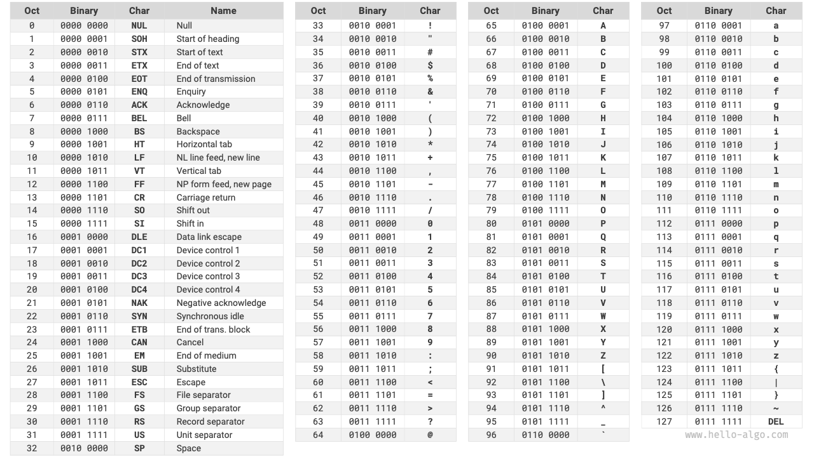
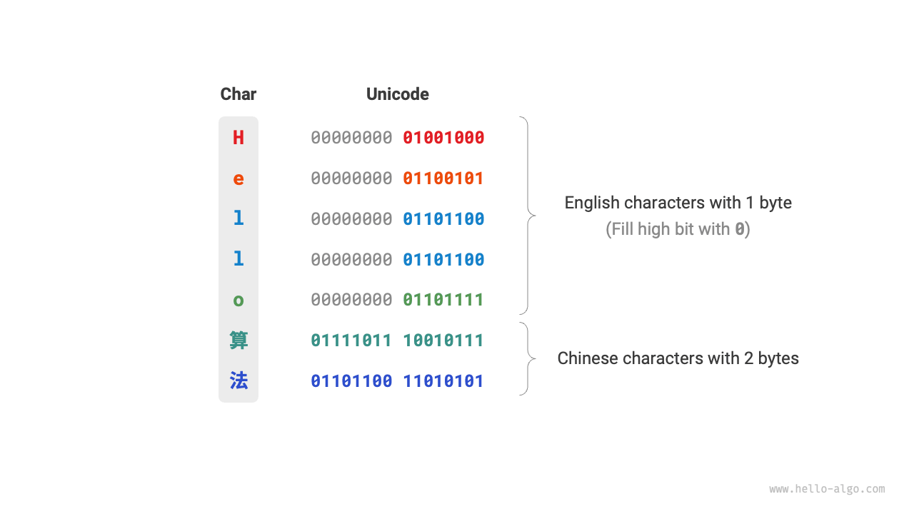
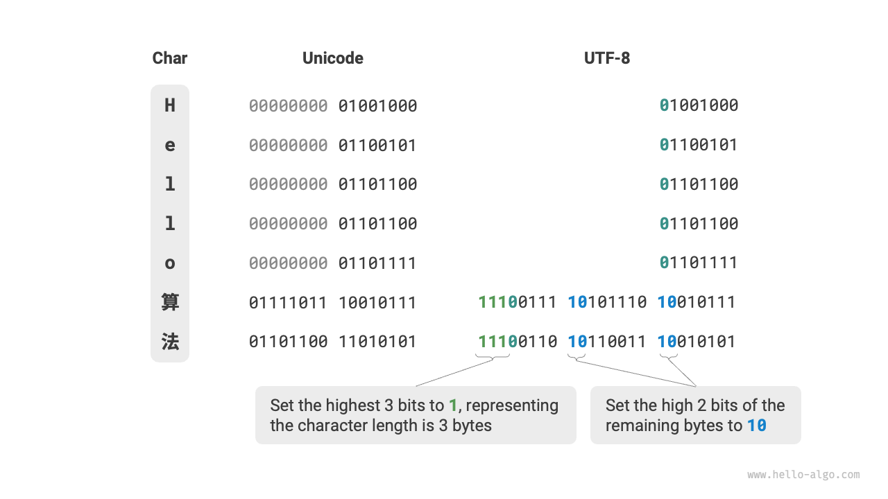

# 3.4 &nbsp; 文字エンコーディング *

コンピュータでは、すべてのデータは二進数の形で保存されており、文字 `char` も例外ではありません。文字を表すためには、「文字セット」を定義し、各文字と二進数の間の一対一の対応関係を定める必要があります。文字セットがあれば、コンピュータは対応表を参照して二進数から文字への変換を行えます。

## 3.4.1 &nbsp; ASCII 文字セット

<u>ASCII コード</u>は最も早く登場した文字セットで、その正式名称は American Standard Code for Information Interchange（米国標準情報交換コード）です。これは 7 ビットの二進数（1 バイトの下位 7 ビット）で 1 文字を表し、最大で 128 種類の異なる文字を表現できます。下図のように、ASCII コードには英字の大文字と小文字、数字 0 ~ 9、いくつかの句読点、そしていくつかの制御文字（改行やタブなど）が含まれます。

{ class="animation-figure" }

 図 3-6 &nbsp; ASCII コード 

しかし、**ASCII コードで表現できるのは英語だけです**。コンピュータのグローバル化に伴い、より多くの言語を表せる <u>EASCII</u> 文字セットが生まれました。これは ASCII の 7 ビットを 8 ビットへ拡張したもので、256 種類の異なる文字を表現できます。

世界では、さまざまな地域に適した EASCII 文字セットが次々に登場しました。これらの文字セットでは、前半の 128 文字は ASCII コードで統一され、後半の 128 文字は各言語の要件に合わせて個別に定義されています。

## 3.4.2 &nbsp; GBK 文字セット

その後、人々は**EASCII コードでも多くの言語に必要な文字数を満たせない**ことに気づきました。たとえば漢字は 10 万字近くあり、日常的に使うものだけでも数千字あります。中国国家標準総局は 1980 年に <u>GB2312</u> 文字セットを公開し、6763 字の漢字を収録して、漢字のコンピュータ処理の基本的な需要を満たしました。

しかし、GB2312 では一部の珍しい字や繁体字を扱えません。<u>GBK</u> 文字セットは GB2312 を基に拡張されたもので、合計 21886 字の漢字を収録しています。GBK のエンコーディング方式では、ASCII 文字は 1 バイト、漢字は 2 バイトで表されます。

## 3.4.3 &nbsp; Unicode 文字セット

コンピュータ技術が急速に発展するにつれて、文字セットと符号化規格は百花繚乱の状態となり、それに伴って多くの問題も生じました。一方では、これらの文字セットは通常、特定の言語の文字しか定義しておらず、多言語環境では正常に動作できませんでした。もう一方では、同じ言語にも複数の文字セット規格が存在し、2 台のコンピュータが異なる符号化規格を使っていると、情報伝達の際に文字化けが発生しました。

当時の研究者たちはこう考えました。**十分に完全な文字セットを打ち出して、世界中のあらゆる言語と記号をそこに収録すれば、多言語環境や文字化けの問題を解決できるのではないか**。この発想に後押しされて、大規模で包括的な文字セット Unicode が誕生しました。

<u>Unicode</u> の中国語名は「統一コード」であり、理論上は 100 万を超える文字を収容できます。Unicode は世界中の文字を 1 つの文字セットに統合することを目指し、さまざまな言語の文字を処理・表示できる汎用文字セットを提供することで、符号化規格の違いによる文字化けを減らそうとしています。

1991 年の公開以来、Unicode は新しい言語と文字を継続的に拡充してきました。2022 年 9 月時点で、Unicode にはすでに 149186 文字が含まれており、各種言語の文字、記号、さらには絵文字まで収録されています。巨大な Unicode 文字セットでは、よく使われる文字は 2 バイトを占め、一部の珍しい文字は 3 バイト、さらには 4 バイトを占めます。

Unicode は汎用文字セットであり、本質的には各文字に番号（「コードポイント」）を割り当てるものですが、**それらのコードポイントをコンピュータ内でどのように保存するかまでは規定していません**。ここで疑問が生じます。長さの異なる Unicode コードポイントが同じテキストに現れたとき、システムはどのように文字を解析するのでしょうか。たとえば長さ 2 バイトの符号が与えられたとき、それが 2 バイトの 1 文字なのか、1 バイトの 2 文字なのかをどう判定するのでしょうか。

この問題に対して、**すべての文字を固定長の符号として保存する**という直接的な解決策があります。下図のように、「Hello」の各文字は 1 バイト、「アルゴリズム」の各文字は 2 バイトを占めます。上位ビットを 0 で埋めることで、「Hello アルゴリズム」のすべての文字を 2 バイト長にエンコードできます。こうすれば、システムは 2 バイトごとに 1 文字を解析して、この語句の内容を復元できます。

{ class="animation-figure" }

 図 3-7 &nbsp; Unicode エンコーディングの例 

しかし ASCII コードはすでに、英語の符号化には 1 バイトで十分であることを示しています。上記の方式を採用すると、英語のテキストが占める空間は ASCII エンコーディング時の 2 倍になり、メモリ空間の浪費が大きくなります。そのため、より効率的な Unicode エンコーディング方式が必要です。

## 3.4.4 &nbsp; UTF-8 エンコーディング

現在、UTF-8 は国際的に最も広く使われている Unicode エンコーディング方式になっています。**これは可変長のエンコーディング**であり、1 文字を 1 〜 4 バイトで表し、文字の複雑さに応じて長さが変わります。ASCII 文字は 1 バイト、ラテン文字とギリシャ文字は 2 バイト、一般的な漢字は 3 バイト、そのほかの一部の珍しい文字は 4 バイト必要です。

UTF-8 の符号化規則はそれほど複雑ではなく、次の 2 つのケースに分けられます。

- 長さ 1 バイトの文字では、最上位ビットを $0$ にし、残りの 7 ビットを Unicode コードポイントに設定します。ここで注意すべきなのは、ASCII 文字が Unicode 文字セットの先頭 128 個のコードポイントを占めていることです。つまり、**UTF-8 エンコーディングは ASCII コードと下位互換性があります**。このため、UTF-8 を使って古い ASCII コードのテキストを解析できます。
- 長さ $n$ バイトの文字（ただし $n > 1$）では、先頭バイトの上位 $n$ ビットをすべて $1$ にし、第 $n + 1$ ビットを $0$ に設定します。2 バイト目以降では、各バイトの上位 2 ビットをいずれも $10$ にし、残りのすべてのビットで文字の Unicode コードポイントを埋めます。

下図は「Helloアルゴリズム」に対応する UTF-8 エンコーディングを示しています。観察すると、上位 $n$ ビットがすべて $1$ に設定されているため、システムは先頭から連続する $1$ の個数を読むことで、その文字の長さが $n$ であると解析できます。

では、なぜ残りのすべてのバイトの上位 2 ビットを $10$ にするのでしょうか。実は、この $10$ は検査用の印として機能します。システムが誤ったバイト位置からテキストを解析し始めたとしても、バイト先頭の $10$ によって異常を素早く判定できます。

この $10$ を検査用の印とする理由は、UTF-8 の符号化規則では上位 2 ビットが $10$ になる文字は存在しないからです。この結論は背理法で証明できます。ある文字の上位 2 ビットが $10$ だと仮定すると、その文字の長さは $1$ であり、ASCII コードに対応することになります。しかし ASCII コードの最上位ビットは $0$ であるはずなので、仮定と矛盾します。

{ class="animation-figure" }

 図 3-8 &nbsp; UTF-8 エンコーディングの例 

UTF-8 以外にも、一般的なエンコーディング方式として次の 2 つがあります。

- **UTF-16 エンコーディング**：1 文字を 2 バイトまたは 4 バイトで表します。すべての ASCII 文字と一般的な非英語文字は 2 バイトで表し、一部の文字だけが 4 バイトを必要とします。2 バイトの文字については、UTF-16 エンコーディングは Unicode コードポイントと等しくなります。
- **UTF-32 エンコーディング**：各文字を必ず 4 バイトで表します。つまり UTF-32 は UTF-8 や UTF-16 よりも多くの領域を消費し、とくに ASCII 文字の比率が高いテキストでその傾向が顕著です。

記憶領域の使用量という観点では、UTF-8 は英語文字の表現に非常に効率的で、必要なのは 1 バイトだけです。一方、UTF-16 は一部の非英語文字（たとえば中国語の文字）の符号化でより効率的になることがあり、必要なのは 2 バイトだけで、UTF-8 では 3 バイト必要になる場合があります。

互換性という観点では、UTF-8 の汎用性が最も高く、多くのツールやライブラリが UTF-8 を優先的にサポートしています。

## 3.4.5 &nbsp; プログラミング言語の文字エンコーディング

従来の多くのプログラミング言語では、実行中の文字列に UTF-16 や UTF-32 のような固定長エンコーディングが使われています。固定長エンコーディングでは、文字列を配列のように扱えるため、次のような利点があります。

- **ランダムアクセス**：UTF-16 で符号化された文字列はランダムアクセスが容易です。UTF-8 は可変長エンコーディングなので、第 $i$ 文字を見つけるには文字列の先頭から第 $i$ 文字まで走査する必要があり、$O(n)$ の時間がかかります。
- **文字数の計算**：ランダムアクセスと同様に、UTF-16 で符号化された文字列の長さを計算するのも $O(1)$ の操作です。しかし、UTF-8 で符号化された文字列の長さを計算するには、文字列全体を走査する必要があります。
- **文字列操作**：UTF-16 で符号化された文字列では、多くの文字列操作（分割、連結、挿入、削除など）をより簡単に行えます。UTF-8 で符号化された文字列では、これらの操作を行う際に、無効な UTF-8 エンコーディングを生じさせないための追加計算が通常必要になります。

実際、プログラミング言語における文字エンコーディング方式の設計は、とても興味深い話題であり、多くの要因が関わっています。

- Java の `String` 型は UTF-16 エンコーディングを使用し、各文字は 2 バイトを占めます。これは Java 言語の設計当初、人々が 16 ビットあればあらゆる文字を表現するのに十分だと考えていたためです。しかし、これは誤った判断でした。その後 Unicode 規格は 16 ビットを超える範囲へ拡張されたため、現在の Java では 1 文字が 16 ビット値の組（「サロゲートペア」）で表されることがあります。
- JavaScript と TypeScript の文字列が UTF-16 エンコーディングを使う理由も Java と似ています。1995 年に Netscape 社が初めて JavaScript 言語を公開した当時、Unicode はまだ発展初期にあり、16 ビットの符号化で十分すべての Unicode 文字を表せると考えられていました。
- C# が UTF-16 エンコーディングを使う主な理由は、.NET プラットフォームが Microsoft によって設計され、Microsoft の多くの技術（Windows オペレーティングシステムを含む）で UTF-16 エンコーディングが広く使われているためです。

以上のプログラミング言語は文字数を過小評価していたため、16 ビットを超える長さの Unicode 文字を表すために「サロゲートペア」を採用せざるを得ませんでした。これはやむを得ない妥協策です。一方では、サロゲートペアを含む文字列では、1 文字が 2 バイトまたは 4 バイトを占める可能性があり、固定長エンコーディングの利点が失われます。もう一方では、サロゲートペアの処理には追加のコードが必要となり、プログラミングの複雑さとデバッグの難しさが増します。

こうした理由から、一部のプログラミング言語では別のエンコーディング方式が採用されました。

- Python の `str` は Unicode エンコーディングを使用し、柔軟な文字列表現を採用しています。保存される文字の長さは、その文字列中で最大の Unicode コードポイントに依存します。文字列がすべて ASCII 文字であれば各文字は 1 バイト、ASCII の範囲を超える文字があってもすべてが基本多言語面（BMP）内であれば各文字は 2 バイト、BMP を超える文字があれば各文字は 4 バイトを占めます。
- Go 言語の `string` 型は内部で UTF-8 エンコーディングを使用します。Go 言語には単一の Unicode コードポイントを表す `rune` 型も用意されています。
- Rust 言語の `str` と `String` 型は内部で UTF-8 エンコーディングを使用します。Rust にも単一の Unicode コードポイントを表す `char` 型があります。

注意すべきなのは、ここまでの議論はすべて、プログラミング言語内での文字列の保存方法についてであり、**文字列をファイルに保存したりネットワークで転送したりする方法とは別の問題である**ということです。ファイル保存やネットワーク転送では、通常、互換性と空間効率を最適化するために文字列を UTF-8 形式にエンコードします。
