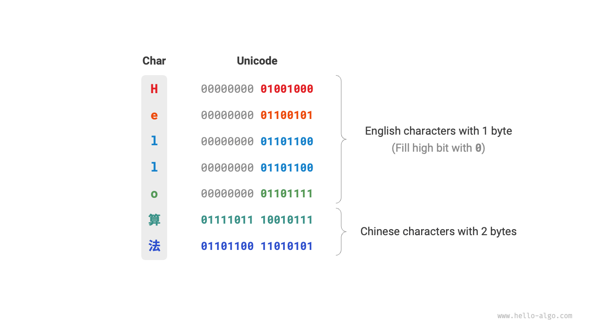
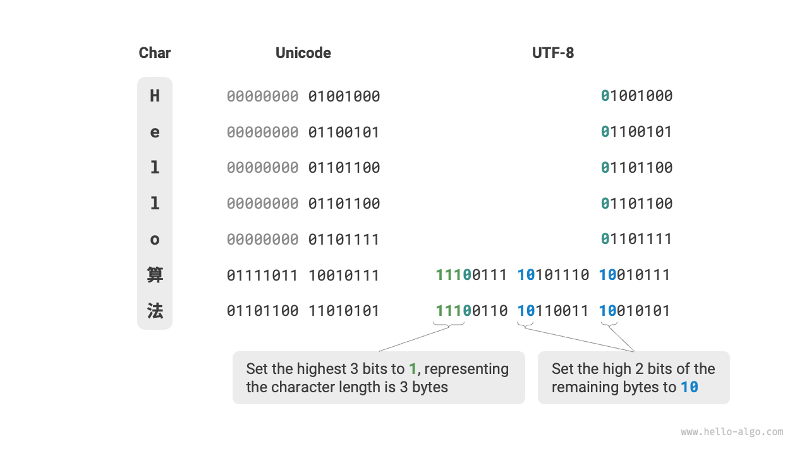

# 文字エンコーディング *

コンピュータシステムでは、すべてのデータが二進形式で格納され、`char`も例外ではありません。文字を表現するために、各文字と二進数の一対一のマッピングを定義する「文字セット」を開発する必要があります。文字セットがあれば、コンピュータは表を参照して二進数を文字に変換できます。

## ASCII文字セット

<u>ASCIIコード</u>は最も初期の文字セットの一つで、正式にはAmerican Standard Code for Information Interchangeとして知られています。7つの二進桁（1バイトの下位7ビット）を使用して文字を表現し、最大128種類の異なる文字を表現できます。以下の図に示すように、ASCIIには英語の大文字と小文字、0〜9の数字、様々な句読点、特定の制御文字（改行やタブなど）が含まれています。

しかし、**ASCIIは英語の文字のみを表現できます**。コンピュータのグローバル化に伴い、より多くの言語を表現するために<u>EASCII</u>と呼ばれる文字セットが開発されました。ASCIIの7ビット構造から8ビットに拡張し、256文字の表現を可能にしました。

世界的に、様々な地域固有のEASCII文字セットが導入されました。これらのセットの最初の128文字はASCIIと一致していますが、残りの128文字は異なる言語の要件に対応するために異なって定義されています。

## GBK文字セット

後に、**EASCIIでも多くの言語の文字要件を満たすことができない**ことが判明しました。例えば、中国語には約10万の漢字があり、そのうち数千が定期的に使用されています。1980年、中国標準化委員会は6763の中国語文字を含む<u>GB2312</u>文字セットを発表し、中国語のコンピュータ処理ニーズを本質的に満たしました。

しかし、GB2312は一部の稀少文字や繁体字を処理できませんでした。<u>GBK</u>文字セットはGB2312を拡張し、21886の中国語文字を含んでいます。GBKエンコーディングスキームでは、ASCII文字は1バイトで表現され、中国語文字は2バイトを使用します。

## Unicode文字セット

コンピュータ技術の急速な発展と多数の文字セットおよびエンコーディング標準により、数多くの問題が発生しました。一方では、これらの文字セットは一般的に特定の言語の文字のみを定義し、多言語環境では適切に機能できませんでした。他方では、同じ言語に対する複数の文字セット標準の存在により、異なるエンコーディング標準を使用するコンピュータ間で情報交換を行う際に文字化けが発生しました。

当時の研究者たちは考えました：**世界のすべての言語と記号を含む包括的な文字セットが開発されれば、言語横断環境と文字化けに関連する問題を解決できるのではないでしょうか？** このアイデアにインスパイアされて、広範囲な文字セットであるUnicodeが誕生しました。

<u>Unicode</u>は中国語で「统一码」（統一コード）と呼ばれ、理論的に100万文字以上を収容できます。世界中のすべての文字を単一のセットに組み込み、様々な言語の処理と表示のための汎用文字セットを提供し、異なるエンコーディング標準による文字化けの問題を減らすことを目指しています。

1991年のリリース以来、Unicodeは新しい言語と文字を含むよう継続的に拡張されています。2022年9月現在、Unicodeには149,186文字が含まれており、様々な言語の文字、記号、さらには絵文字も含まれています。広大なUnicode文字セットでは、一般的に使用される文字は2バイトを占有し、一部の稀少な文字は3バイトまたは4バイトを占有する場合があります。

Unicodeは各文字に数値（「コードポイント」と呼ばれる）を割り当てる汎用文字セットですが、**これらの文字コードポイントがコンピュータシステムにどのように格納されるべきかは指定していません**。疑問が生じるかもしれません：システムはテキスト内の異なる長さのUnicodeコードポイントをどのように解釈するのでしょうか？例えば、2バイトのコードが与えられた場合、システムはそれが単一の2バイト文字を表すのか、2つの1バイト文字を表すのかをどのように判断するのでしょうか？

**この問題に対する簡単な解決策は、すべての文字を等長エンコーディングとして格納することです**。以下の図に示すように、「Hello」の各文字は1バイトを占有し、「算法」（アルゴリズム）の各文字は2バイトを占有します。上位ビットをゼロで埋めることで、「Hello 算法」のすべての文字を2バイトとしてエンコードできます。この方法により、システムは2バイトごとに文字を解釈し、フレーズの内容を復元できます。

しかし、ASCIIが示したように、英語のエンコーディングには1バイトのみが必要です。上記のアプローチを使用すると、英語テキストが占有する空間がASCIIエンコーディングと比較して2倍になり、メモリ空間の無駄になります。したがって、より効率的なUnicodeエンコーディング方法が必要です。

## UTF-8エンコーディング

現在、UTF-8は国際的に最も広く使用されているUnicodeエンコーディング方法になっています。**これは可変長エンコーディング**で、文字の複雑さに応じて1〜4バイトを使用して文字を表現します。ASCII文字は1バイトのみが必要で、ラテン文字とギリシャ文字は2バイト、一般的に使用される中国語文字は3バイト、その他の稀少な文字は4バイトが必要です。

UTF-8のエンコーディング規則は複雑ではなく、2つのケースに分けることができます：

- 1バイト文字の場合、最上位ビットを$0$に設定し、残りの7ビットをUnicodeコードポイントに設定します。注目すべきは、ASCII文字がUnicodeセットの最初の128コードポイントを占有することです。これは**UTF-8エンコーディングがASCIIと後方互換性がある**ことを意味します。これは、UTF-8を使用して古いASCIIテキストを解析できることを意味します。
- 長さ$n$バイトの文字（$n > 1$）の場合、最初のバイトの最上位$n$ビットを$1$に設定し、$(n + 1)^{\text{th}}$ビットを$0$に設定します。2番目のバイトから、各バイトの最上位2ビットを$10$に設定します。残りのビットはUnicodeコードポイントを埋めるために使用されます。

以下の図は「Hello算法」のUTF-8エンコーディングを示しています。最上位$n$ビットが$1$に設定されているため、システムは最上位ビットで$1$に設定されたビット数を数えることで文字の長さを$n$として決定できることが観察できます。

しかし、なぜ残りのバイトの最上位2ビットを$10$に設定するのでしょうか？実際、この$10$は一種のチェックサムとして機能します。システムが間違ったバイトからテキストの解析を開始した場合、バイトの先頭の$10$によりシステムは異常を迅速に検出できます。

$10$をチェックサムとして使用する理由は、UTF-8エンコーディング規則の下では、文字の最上位2ビットが$10$になることは不可能だからです。これは矛盾により証明できます：文字の最上位2ビットが$10$の場合、文字の長さが$1$であることを示し、これはASCIIに対応します。しかし、ASCII文字の最上位ビットは$0$であるべきで、これは仮定と矛盾します。

UTF-8以外にも、他の一般的なエンコーディング方法には以下があります：

- **UTF-16エンコーディング**：2または4バイトを使用して文字を表現します。すべてのASCII文字と一般的に使用される非英語文字は2バイトで表現され、少数の文字は4バイトが必要です。2バイト文字の場合、UTF-16エンコーディングはUnicodeコードポイントと等しくなります。
- **UTF-32エンコーディング**：すべての文字が4バイトを使用します。これは、UTF-32がUTF-8やUTF-16よりも多くの空間を占有することを意味し、特にASCII文字の割合が高いテキストでは顕著です。

ストレージ空間の観点から、UTF-8を使用して英語文字を表現することは1バイトのみが必要なため非常に効率的です。UTF-16を使用して一部の非英語文字（中国語など）をエンコードすることは、2バイトのみが必要なためより効率的になる場合があります。一方、UTF-8では3バイトが必要になる場合があります。

互換性の観点から、UTF-8は最も汎用性があり、多くのツールとライブラリがUTF-8を優先的にサポートしています。

## プログラミング言語における文字エンコーディング

歴史的に、多くのプログラミング言語はプログラム実行中の文字列処理にUTF-16やUTF-32などの固定長エンコーディングを利用していました。これにより文字列を配列として処理でき、いくつかの利点があります：

- **ランダムアクセス**：UTF-16でエンコードされた文字列は簡単にランダムアクセスできます。可変長エンコーディングであるUTF-8の場合、$i^{th}$文字の位置を特定するには文字列の開始から$i^{th}$位置まで走査する必要があり、$O(n)$時間がかかります。
- **文字数カウント**：ランダムアクセスと同様に、UTF-16でエンコードされた文字列の文字数をカウントすることは$O(1)$操作です。しかし、UTF-8でエンコードされた文字列の文字数をカウントするには文字列全体を走査する必要があります。
- **文字列操作**：分割、連結、挿入、削除などの多くの文字列操作は、UTF-16でエンコードされた文字列で簡単です。これらの操作は一般的に、UTF-8エンコーディングの有効性を確保するためにUTF-8でエンコードされた文字列で追加の計算が必要です。

プログラミング言語における文字エンコーディングスキームの設計は、様々な要因を含む興味深いトピックです：

- Javaの`String`型はUTF-16エンコーディングを使用し、各文字が2バイトを占有します。これは、16ビットがすべての可能な文字を表現するのに十分であるという初期の信念に基づいており、後に間違いであることが証明されました。Unicode標準が16ビットを超えて拡張されると、Javaの文字は「サロゲートペア」として知られる16ビット値のペアで表現される場合があります。
- JavaScriptとTypeScriptは、Javaと同様の理由でUTF-16エンコーディングを使用します。JavaScriptが1995年にNetscapeによって最初に導入されたとき、Unicodeはまだ初期段階にあり、16ビットエンコーディングはすべてのUnicode文字を表現するのに十分でした。
- C#はUTF-16エンコーディングを使用し、これは主にMicrosoftによって設計された.NETプラットフォーム、および多くのMicrosoft技術（Windowsオペレーティングシステムを含む）がUTF-16エンコーディングを広範囲に使用しているためです。

文字数の過小評価により、これらの言語は16ビットを超えるUnicode文字を表現するために「サロゲートペア」を使用する必要がありました。このアプローチには欠点があります：サロゲートペアを含む文字列は2バイトまたは4バイトを占有する文字を持つ場合があり、固定長エンコーディングの利点を失います。さらに、サロゲートペアの処理はプログラミングに複雑さとデバッグの困難さを追加します。

これらの課題に対処するため、一部の言語は代替エンコーディング戦略を採用しています：

- Pythonの`str`型は、文字のストレージ長が文字列内の最大のUnicodeコードポイントに依存する柔軟な表現でUnicodeエンコーディングを使用します。すべての文字がASCIIの場合、各文字は1バイトを占有し、基本多言語面（BMP）内の文字は2バイト、BMPを超える文字は4バイトを占有します。
- Goの`string`型は内部的にUTF-8エンコーディングを使用します。Goは個別のUnicodeコードポイントを表現するための`rune`型も提供します。
- Rustの`str`と`String`型は内部的にUTF-8エンコーディングを使用します。Rustは個別のUnicodeコードポイント用の`char`型も提供します。

上記の議論は、プログラミング言語での文字列の格納方法に関するものであり、**ファイルでの文字列の格納方法やネットワーク上での送信方法とは異なる**ことに注意することが重要です。ファイルストレージやネットワーク送信では、文字列は通常、最適な互換性と空間効率のためにUTF-8形式でエンコードされます。
