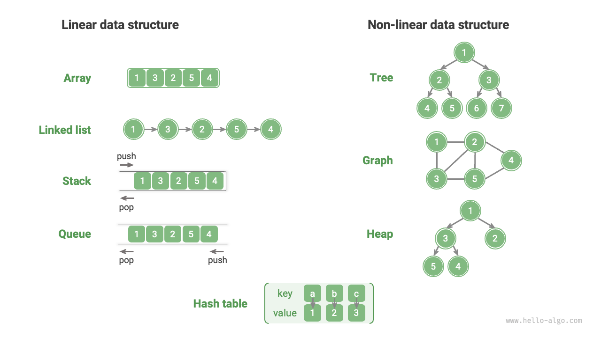
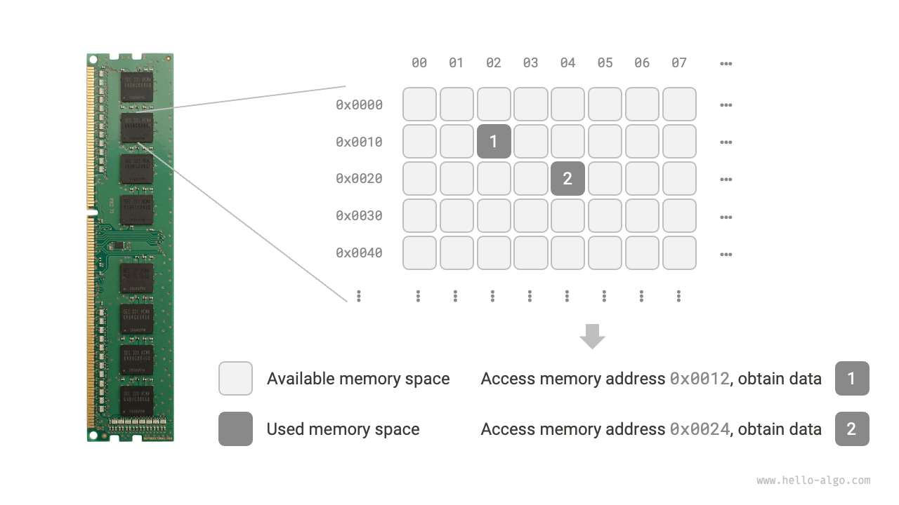
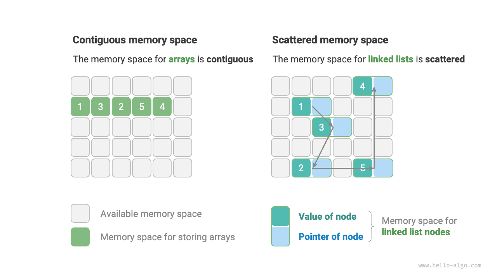

# データ構造の分類

代表的なデータ構造には、配列、連結リスト、スタック、キュー、ハッシュテーブル、木、ヒープ、グラフがあり、これらは「論理構造」と「物理構造」の 2 つの観点から分類できます。

## 論理構造：線形と非線形

**論理構造はデータ要素間の論理的な関係を示します**。配列と連結リストでは、データは一定の順序で並び、データ間の線形関係を表します。一方、木ではデータは上から下へ階層的に並び、「祖先」と「子孫」の派生関係を示します。グラフはノードと辺で構成され、複雑なネットワーク関係を反映します。

以下の図に示すように、論理構造は「線形」と「非線形」の 2 つに大別できます。線形構造は比較的直感的で、データが論理関係において線形に並ぶことを指します。非線形構造はその逆で、非線形に配置されます。

- **線形データ構造**：配列、連結リスト、スタック、キュー、ハッシュテーブルであり、要素間は 1 対 1 の順序関係です。
- **非線形データ構造**：木、ヒープ、グラフ、ハッシュテーブル。

非線形データ構造は、さらに木構造と網状構造に分けられます。

- **木構造**：木、ヒープ、ハッシュテーブルであり、要素間は 1 対多の関係です。
- **網状構造**：グラフであり、要素間は多対多の関係です。

## 物理構造：連続と分散

**アルゴリズムのプログラムが実行されるとき、処理中のデータは主にメモリに格納されます**。下図はコンピュータのメモリモジュールを示しており、各黒い四角はそれぞれ 1 つのメモリ空間を表しています。メモリは巨大な Excel の表のようなものだと考えることができ、各セルには一定量のデータを格納できます。

**システムはメモリアドレスを通じて目的の位置にあるデータへアクセスします**。下図に示すように、コンピュータは特定の規則に従って表内の各セルに番号を割り当て、各メモリ空間が一意のメモリアドレスを持つようにします。これらのアドレスがあれば、プログラムはメモリ内のデータにアクセスできます。

!!! tip

    補足すると、メモリを Excel の表にたとえるのは単純化した比喩であり、実際のメモリの動作機構はより複雑で、アドレス空間、メモリ管理、キャッシュ機構、仮想メモリ、物理メモリなどの概念が関わります。

メモリはすべてのプログラムで共有される資源であり、あるメモリ領域が 1 つのプログラムに占有されると、通常は他のプログラムが同時に利用できません。**したがって、データ構造とアルゴリズムの設計では、メモリ資源は重要な考慮要素です**。たとえば、アルゴリズムが使用するメモリ使用量のピークは、システムに残っている空きメモリを超えてはなりません。大きな連続メモリ領域が不足している場合、選択するデータ構造は分散したメモリ空間に格納できる必要があります。

下図に示すように、**物理構造はデータがコンピュータメモリ内にどのように格納されるかを表します**。これは連続空間への格納（配列）と分散空間への格納（連結リスト）に分けられます。物理構造は低レベルでデータのアクセス、更新、追加、削除などの操作方法を決定し、2 種類の物理構造は時間効率と空間効率の面で相補的な特徴を持ちます。

補足すると、**すべてのデータ構造は配列、連結リスト、またはその両者の組み合わせに基づいて実装されます**。たとえば、スタックとキューは配列でも連結リストでも実装できます。一方、ハッシュテーブルの実装には配列と連結リストの両方が含まれる場合があります。

- **配列に基づいて実装可能**：スタック、キュー、ハッシュテーブル、木、ヒープ、グラフ、行列、テンソル（次元 $\geq 3$ の配列）など。
- **連結リストに基づいて実装可能**：スタック、キュー、ハッシュテーブル、木、ヒープ、グラフなど。

連結リストは初期化後も、プログラムの実行中に長さを調整できるため、「動的データ構造」とも呼ばれます。配列は初期化後に長さを変更できないため、「静的データ構造」とも呼ばれます。なお、配列もメモリを再割り当てすることで長さを変更でき、ある程度の「動的性」を持たせることができます。

!!! tip

    物理構造の理解が難しいと感じる場合は、先に次の章を読んでから本節を振り返ることを勧めます。
