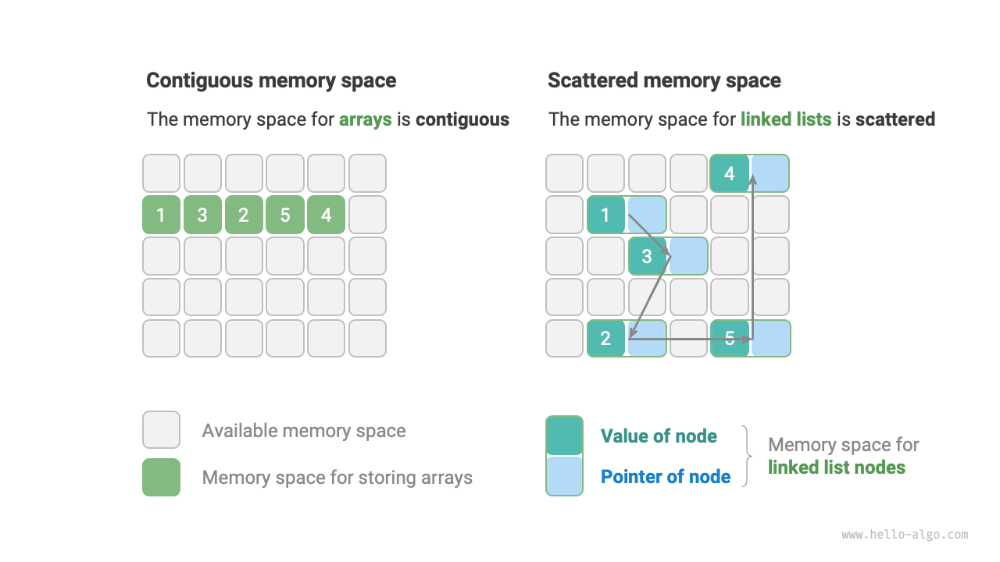

# データ構造の分類

一般的なデータ構造には、配列、連結リスト、スタック、キュー、ハッシュ表、木、ヒープ、グラフがあります。これらは「論理構造」と「物理構造」に分類できます。

## 論理構造：線形と非線形

**論理構造はデータ要素間の論理的関係を明らかにします**。配列と連結リストでは、データは特定の順序で配置され、データ間の線形関係を示しています。一方、木では、データは上から下へ階層的に配置され、「祖先」と「子孫」間の派生関係を示しています。そして、グラフはノードとエッジから構成され、複雑なネットワーク関係を反映しています。

下図に示されているように、論理構造は「線形」と「非線形」の2つの主要カテゴリに分けることができます。線形構造はより直感的で、データが論理関係において線形に配置されていることを示しています。非線形構造は、逆に非線形に配置されています。

- **線形データ構造**：配列、連結リスト、スタック、キュー、ハッシュ表。要素が一対一の順次関係を持ちます。
- **非線形データ構造**：木、ヒープ、グラフ、ハッシュ表。

非線形データ構造は、さらに木構造とネットワーク構造に分けることができます。

- **木構造**：木、ヒープ、ハッシュ表。要素が一対多の関係を持ちます。
- **ネットワーク構造**：グラフ。要素が多対多の関係を持ちます。

## 物理構造：連続と分散

**アルゴリズムの実行中、処理されるデータはメモリに格納されます**。下図はコンピュータのメモリスティックを示しており、各黒い正方形は物理メモリ空間です。メモリを巨大なExcelスプレッドシートと考えることができ、各セルは一定量のデータを格納できます。

**システムはメモリアドレスによって目標位置のデータにアクセスします**。下図に示されているように、コンピュータは特定のルールに従って表の各セルに一意の識別子を割り当て、各メモリ空間が一意のメモリアドレスを持つことを保証します。これらのアドレスにより、プログラムはメモリに格納されたデータにアクセスできます。

!!! tip

    メモリをExcelスプレッドシートに比較することは簡略化された類推であることに注意してください。メモリの実際の動作メカニズムはより複雑で、アドレス空間、メモリ管理、キャッシュメカニズム、仮想メモリ、物理メモリなどの概念が関係しています。

メモリはすべてのプログラムの共有リソースです。あるメモリブロックが1つのプログラムによって占有されると、他のプログラムが同時に使用することはできません。**したがって、メモリリソースはデータ構造とアルゴリズムの設計における重要な考慮事項です**。例えば、アルゴリズムのピークメモリ使用量は、システムの残り空きメモリを超えてはいけません。連続したメモリブロックが不足している場合は、非連続メモリブロックに格納できるデータ構造を選択する必要があります。

下図に示されているように、**物理構造はコンピュータメモリにおけるデータの格納方法を反映し**、連続空間格納（配列）と非連続空間格納（連結リスト）に分けることができます。2つのタイプの物理構造は、時間効率と空間効率の観点で補完的な特性を示します。

**すべてのデータ構造は配列、連結リスト、またはその組み合わせに基づいて実装されていることに注意してください**。例えば、スタックとキューは配列または連結リストのどちらでも実装できます。ハッシュ表の実装には配列と連結リストの両方が関係する場合があります。

- **配列ベースの実装**：スタック、キュー、ハッシュ表、木、ヒープ、グラフ、行列、テンソル（次元$\geq 3$の配列）。
- **連結リストベースの実装**：スタック、キュー、ハッシュ表、木、ヒープ、グラフなど。

配列に基づいて実装されたデータ構造は「静的データ構造」とも呼ばれ、初期化後に長さを変更できないことを意味します。逆に、連結リストに基づいたものは「動的データ構造」と呼ばれ、プログラム実行中にサイズを調整できます。

!!! tip

    物理構造を理解するのが困難な場合は、次の章「配列と連結リスト」を読んでから、この節に戻ることをお勧めします。
