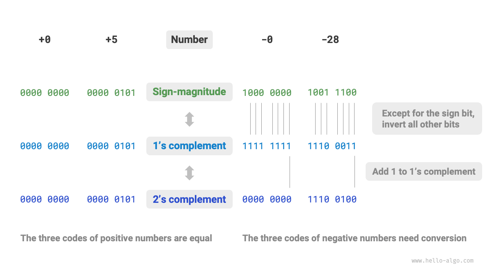
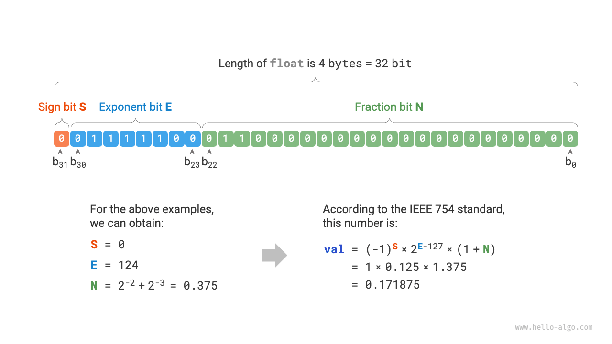

# 数値エンコーディング *

!!! tip

    本書では、アスタリスク「*」が付いた章は任意読書です。時間が不足している場合や難しいと感じる場合は、最初はこれらをスキップして、必須の章を完了した後に戻ることができます。

## 整数エンコーディング

前の節の表で、すべての整数型は正の数よりも1つ多い負の数を表現できることを観察しました。例えば、`byte`の範囲は$[-128, 127]$です。この現象は直感に反するように見え、その根本的な理由には符号絶対値、1の補数、2の補数エンコーディングの知識が関与しています。

まず重要なことは、**数値はコンピュータ内で2の補数形式で格納される**ということです。なぜそうなのかを分析する前に、これら3つのエンコーディング方法を定義しましょう：

- **符号絶対値**：数値の二進表現の最上位ビットを符号ビットとし、$0$は正の数、$1$は負の数を表します。残りのビットは数値の値を表します。
- **1の補数**：正の数の1の補数は符号絶対値と同じです。負の数の場合、符号ビット以外のすべてのビットを反転して得られます。
- **2の補数**：正の数の2の補数は符号絶対値と同じです。負の数の場合、その1の補数に$1$を加えて得られます。

以下の図は、符号絶対値、1の補数、2の補数間の変換を示しています：

<u>符号絶対値</u>は最も直感的ですが、制限があります。一つには、**符号絶対値の負の数は計算で直接使用できません**。例えば、符号絶対値で$1 + (-2)$を計算すると$-3$になり、これは正しくありません。

$$
\begin{aligned}
& 1 + (-2) \newline
& \rightarrow 0000 \; 0001 + 1000 \; 0010 \newline
& = 1000 \; 0011 \newline
& \rightarrow -3
\end{aligned}
$$

この問題に対処するため、コンピュータは<u>1の補数</u>を導入しました。1の補数に変換して$1 + (-2)$を計算し、結果を符号絶対値に戻すと、正しい結果$-1$が得られます。

$$
\begin{aligned}
& 1 + (-2) \newline
& \rightarrow 0000 \; 0001 \; \text{(符号絶対値)} + 1000 \; 0010 \; \text{(符号絶対値)} \newline
& = 0000 \; 0001 \; \text{(1の補数)} + 1111 \; 1101 \; \text{(1の補数)} \newline
& = 1111 \; 1110 \; \text{(1の補数)} \newline
& = 1000 \; 0001 \; \text{(符号絶対値)} \newline
& \rightarrow -1
\end{aligned}
$$

また、**符号絶対値では0に2つの表現があります**：$+0$と$-0$です。これは0に対して2つの異なる二進エンコーディングがあることを意味し、曖昧さを引き起こす可能性があります。例えば、条件チェックで正と負の0を区別しないと、正しくない結果になる可能性があります。この曖昧さに対処するには追加のチェックが必要で、計算効率が低下する可能性があります。

$$
\begin{aligned}
+0 & \rightarrow 0000 \; 0000 \newline
-0 & \rightarrow 1000 \; 0000
\end{aligned}
$$

符号絶対値と同様に、1の補数も正と負の0の曖昧さに悩まされます。そのため、コンピュータはさらに<u>2の補数</u>を導入しました。符号絶対値、1の補数、2の補数における負の0の変換過程を観察してみましょう：

$$
\begin{aligned}
-0 \rightarrow \; & 1000 \; 0000 \; \text{(符号絶対値)} \newline
= \; & 1111 \; 1111 \; \text{(1の補数)} \newline
= 1 \; & 0000 \; 0000 \; \text{(2の補数)} \newline
\end{aligned}
$$

負の0の1の補数に$1$を加えると桁上がりが発生しますが、`byte`の長さは8ビットのみのため、9番目のビットへの桁上がり$1$は破棄されます。したがって、**負の0の2の補数は$0000 \; 0000$**で、正の0と同じになり、曖昧さが解決されます。

最後の謎は、`byte`の$[-128, 127]$の範囲で、追加の負の数$-128$があることです。$[-127, +127]$の区間では、すべての整数に対応する符号絶対値、1の補数、2の補数があり、相互変換が可能であることを観察します。

しかし、**2の補数$1000 \; 0000$は対応する符号絶対値を持たない例外です**。変換方法によると、その符号絶対値は$0000 \; 0000$で、0を示します。これは矛盾を示しています。なぜなら、その2の補数は自分自身を表すべきだからです。コンピュータは、この特別な2の補数$1000 \; 0000$を$-128$を表すものとして指定しています。実際、2の補数での$(-1) + (-127)$の計算結果は$-128$になります。

$$
\begin{aligned}
& (-127) + (-1) \newline
& \rightarrow 1111 \; 1111 \; \text{(符号絶対値)} + 1000 \; 0001 \; \text{(符号絶対値)} \newline
& = 1000 \; 0000 \; \text{(1の補数)} + 1111 \; 1110 \; \text{(1の補数)} \newline
& = 1000 \; 0001 \; \text{(2の補数)} + 1111 \; 1111 \; \text{(2の補数)} \newline
& = 1000 \; 0000 \; \text{(2の補数)} \newline
& \rightarrow -128
\end{aligned}
$$

お気づきかもしれませんが、これらの計算はすべて加算であり、重要な事実を示唆しています：**コンピュータの内部ハードウェア回路は主に加算演算を中心に設計されています**。これは、加算が乗算、除算、減算などの他の演算と比較してハードウェアで実装しやすく、並列化が容易で高速計算が可能だからです。

これはコンピュータが加算のみを実行できることを意味するものではありません。**加算と基本的な論理演算を組み合わせることで、コンピュータは様々な他の数学演算を実行できます**。例えば、減算$a - b$は$a + (-b)$に変換でき、乗算と除算は複数の加算または減算に変換できます。

コンピュータで2の補数を使用する理由をまとめることができます：2の補数表現により、コンピュータは同じ回路と演算を使用して正と負の数の加算を処理でき、減算用の特別なハードウェア回路の必要性を排除し、正と負の0の曖昧さを回避できます。これによりハードウェア設計が大幅に簡素化され、計算効率が向上します。

2の補数の設計は非常に巧妙で、スペースの制約により、ここで停止します。興味のある読者はさらに探求することを奨励します。

## 浮動小数点数エンコーディング

興味深いことに気づいたかもしれません：同じ4バイトの長さにもかかわらず、なぜ`float`は`int`と比較してはるかに大きい値の範囲を持つのでしょうか？これは直感に反するように見えます。`float`は分数を表現する必要があるため、範囲が縮小すると予想されるからです。

実際、**これは浮動小数点数（`float`）で使用される異なる表現方法によるものです**。32ビットの二進数を次のように考えてみましょう：

$$
b_{31} b_{30} b_{29} \ldots b_2 b_1 b_0
$$

IEEE 754標準によると、32ビットの`float`は次の3つの部分で構成されます：

- 符号ビット$\mathrm{S}$：1ビットを占有し、$b_{31}$に対応します。
- 指数ビット$\mathrm{E}$：8ビットを占有し、$b_{30} b_{29} \ldots b_{23}$に対応します。
- 仮数ビット$\mathrm{N}$：23ビットを占有し、$b_{22} b_{21} \ldots b_0$に対応します。

二進`float`数の値は次のように計算されます：

$$
\text{val} = (-1)^{b_{31}} \times 2^{\left(b_{30} b_{29} \ldots b_{23}\right)_2 - 127} \times \left(1 . b_{22} b_{21} \ldots b_0\right)_2
$$

十進公式に変換すると、次のようになります：

$$
\text{val} = (-1)^{\mathrm{S}} \times 2^{\mathrm{E} - 127} \times (1 + \mathrm{N})
$$

各成分の範囲は：

$$
\begin{aligned}
\mathrm{S} \in & \{ 0, 1\}, \quad \mathrm{E} \in \{ 1, 2, \dots, 254 \} \newline
(1 + \mathrm{N}) = & (1 + \sum_{i=1}^{23} b_{23-i} \times 2^{-i}) \subset [1, 2 - 2^{-23}]
\end{aligned}
$$

上の図を観察すると、例のデータ$\mathrm{S} = 0$、$\mathrm{E} = 124$、$\mathrm{N} = 2^{-2} + 2^{-3} = 0.375$が与えられた場合：

$$
\text{val} = (-1)^0 \times 2^{124 - 127} \times (1 + 0.375) = 0.171875
$$

これで最初の質問に答えることができます：**`float`の表現には指数ビットが含まれているため、`int`よりもはるかに大きい範囲を持ちます**。上記の計算に基づくと、`float`で表現可能な最大正の数は約$2^{254 - 127} \times (2 - 2^{-23}) \approx 3.4 \times 10^{38}$で、最小負の数は符号ビットを切り替えることで得られます。

**しかし、`float`の拡張された範囲のトレードオフは精度の犠牲です**。整数型`int`は32ビットすべてを数値表現に使用し、値は均等に分布していますが、指数ビットのため、`float`の値が大きいほど、隣接する数値間の差が大きくなります。

以下の表に示すように、指数ビット$\mathrm{E} = 0$と$\mathrm{E} = 255$は特別な意味を持ち、**0、無限大、$\mathrm{NaN}$などを表現するために使用されます**。

 表 <id> &nbsp; 指数ビットの意味 

| 指数ビットE        | 仮数ビット$\mathrm{N} = 0$ | 仮数ビット$\mathrm{N} \ne 0$ | 計算公式                                                               |
| ------------------ | ----------------------------- | ------------------------------- | ---------------------------------------------------------------------- |
| $0$                | $\pm 0$                       | 非正規化数                      | $(-1)^{\mathrm{S}} \times 2^{-126} \times (0.\mathrm{N})$              |
| $1, 2, \dots, 254$ | 正規化数                      | 正規化数                        | $(-1)^{\mathrm{S}} \times 2^{(\mathrm{E} -127)} \times (1.\mathrm{N})$ |
| $255$              | $\pm \infty$                  | $\mathrm{NaN}$                  |                                                                        |

非正規化数は浮動小数点数の精度を大幅に向上させることは注目に値します。最小の正の正規化数は$2^{-126}$で、最小の正の非正規化数は$2^{-126} \times 2^{-23}$です。

倍精度`double`も`float`と同様の表現方法を使用しますが、簡潔さのためここでは詳述しません。
