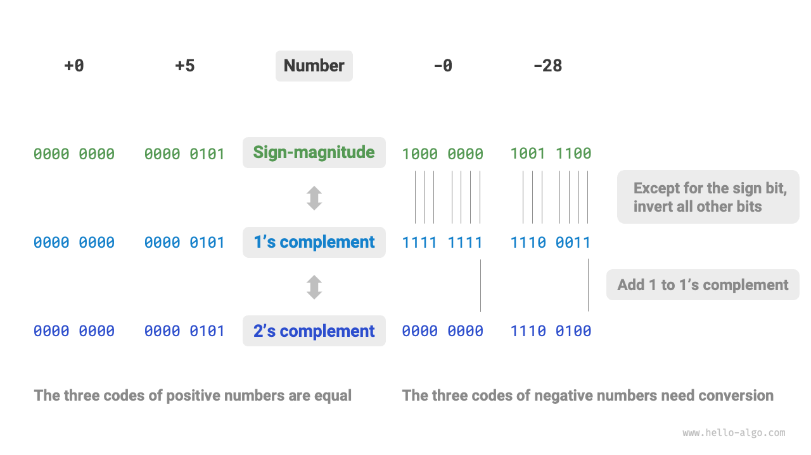
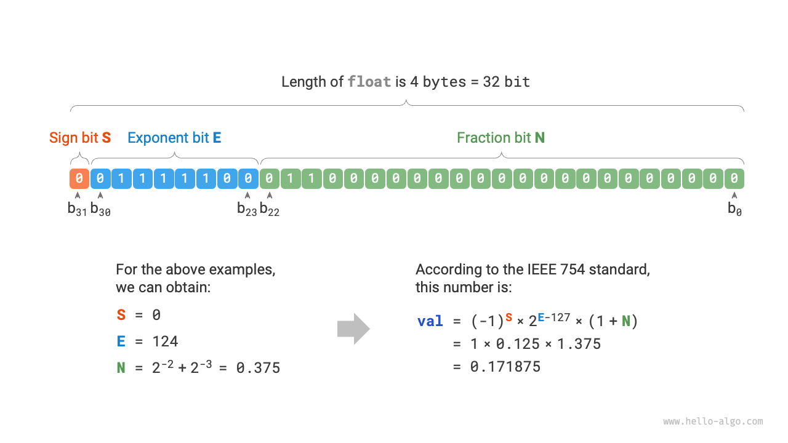

# 数値エンコーディング *

!!! tip

    本書では、タイトルに * 記号が付いている章は選読です。時間が限られている場合や理解が難しいと感じる場合は、いったん読み飛ばし、必読章を終えてから個別に取り組んでください。

## 符号付き絶対値表現、1 の補数、2 の補数

前節の表を見ると、すべての整数型で表せる負数の個数は正数より 1 つ多く、たとえば `byte` の値域は $[-128, 127]$ です。この現象は直感に反するように見えますが、その背景には符号付き絶対値表現、1 の補数、2 の補数に関する知識があります。

まず押さえておくべきなのは、**数値はコンピュータ内で「2 の補数」の形で保存される**ということです。その理由を説明する前に、まずはこの 3 つの定義を示します。

- **符号付き絶対値表現**：数値の二進表現の最上位ビットを符号ビットとみなし、$0$ は正数、$1$ は負数を表し、残りのビットが数値の値を表します。
- **1 の補数**：正数の 1 の補数は符号付き絶対値表現と同じで、負数の 1 の補数は符号ビットを除くすべてのビットを反転したものです。
- **2 の補数**：正数の 2 の補数は符号付き絶対値表現と同じで、負数の 2 の補数は 1 の補数に $1$ を加えたものです。

下図は、符号付き絶対値表現、1 の補数、2 の補数の変換方法を示しています。

<u>符号付き絶対値表現（sign-magnitude）</u>は最も直感的ですが、いくつかの制約があります。まず、**負数の符号付き絶対値表現はそのまま演算に使えません**。たとえば符号付き絶対値表現で $1 + (-2)$ を計算すると、結果は $-3$ になってしまい、これは明らかに誤りです。

$$
\begin{aligned}
& 1 + (-2) \newline
& \rightarrow 0000 \; 0001 + 1000 \; 0010 \newline
& = 1000 \; 0011 \newline
& \rightarrow -3
\end{aligned}
$$

この問題を解決するために、コンピュータには<u>1 の補数（1's complement）</u>が導入されました。まず符号付き絶対値表現を 1 の補数に変換し、1 の補数で $1 + (-2)$ を計算してから、結果を 1 の補数から符号付き絶対値表現へ戻すと、正しい結果 $-1$ が得られます。

$$
\begin{aligned}
& 1 + (-2) \newline
& \rightarrow 0000 \; 0001 \; \text{(符号付き絶対値表現)} + 1000 \; 0010 \; \text{(符号付き絶対値表現)} \newline
& = 0000 \; 0001 \; \text{(1 の補数)} + 1111  \; 1101 \; \text{(1 の補数)} \newline
& = 1111 \; 1110 \; \text{(1 の補数)} \newline
& = 1000 \; 0001 \; \text{(符号付き絶対値表現)} \newline
& \rightarrow -1
\end{aligned}
$$

一方、**数値 0 の符号付き絶対値表現には $+0$ と $-0$ の 2 つの表し方があります**。つまり、数値 0 に対して異なる 2 つの二進コードが対応しており、これは曖昧さの原因になります。たとえば条件判定で正のゼロと負のゼロを区別しないと、誤った判定結果になる可能性があります。また、この曖昧さを解消しようとすると追加の判定処理が必要になり、計算効率が下がるおそれがあります。

$$
\begin{aligned}
+0 & \rightarrow 0000 \; 0000 \newline
-0 & \rightarrow 1000 \; 0000
\end{aligned}
$$

符号付き絶対値表現と同様に、1 の補数にも正負のゼロの曖昧さがあります。そこでコンピュータはさらに<u>2 の補数（2's complement）</u>を導入しました。まずは負のゼロについて、符号付き絶対値表現、1 の補数、2 の補数の変換を見てみましょう。

$$
\begin{aligned}
-0 \rightarrow \; & 1000 \; 0000 \; \text{(符号付き絶対値表現)} \newline
= \; & 1111 \; 1111 \; \text{(1 の補数)} \newline
= 1 \; & 0000 \; 0000 \; \text{(2 の補数)} \newline
\end{aligned}
$$

負のゼロの 1 の補数に $1$ を加えると桁上がりが発生しますが、`byte` 型の長さは 8 ビットしかないため、第 9 ビットへあふれた $1$ は捨てられます。つまり、**負のゼロの 2 の補数は $0000 \; 0000$ であり、正のゼロの 2 の補数と同じです**。そのため、2 の補数表現ではゼロは 1 つしか存在せず、正負のゼロの曖昧さは解消されます。

最後にもう 1 つ疑問が残ります。`byte` 型の値域は $[-128, 127]$ ですが、余分にある負数 $-128$ はどのように得られるのでしょうか。区間 $[-127, +127]$ にあるすべての整数には、それぞれ対応する符号付き絶対値表現、1 の補数、2 の補数があり、符号付き絶対値表現と 2 の補数の間は相互に変換できます。

しかし、**2 の補数 $1000 \; 0000$ だけは例外で、対応する符号付き絶対値表現を持ちません**。変換規則に従うと、この 2 の補数に対応する符号付き絶対値表現は $0000 \; 0000$ になります。これは明らかに矛盾しています。なぜなら、この符号付き絶対値表現は数値 $0$ を表し、その 2 の補数は自分自身であるはずだからです。コンピュータでは、この特別な 2 の補数 $1000 \; 0000$ を $-128$ と定めています。実際、2 の補数での $(-1) + (-127)$ の計算結果はちょうど $-128$ になります。

$$
\begin{aligned}
& (-127) + (-1) \newline
& \rightarrow 1111 \; 1111 \; \text{(符号付き絶対値表現)} + 1000 \; 0001 \; \text{(符号付き絶対値表現)} \newline
& = 1000 \; 0000 \; \text{(1 の補数)} + 1111  \; 1110 \; \text{(1 の補数)} \newline
& = 1000 \; 0001 \; \text{(2 の補数)} + 1111  \; 1111 \; \text{(2 の補数)} \newline
& = 1000 \; 0000 \; \text{(2 の補数)} \newline
& \rightarrow -128
\end{aligned}
$$

すでにお気づきかもしれませんが、上の計算はすべて加算です。これは重要な事実を示しています。**コンピュータ内部のハードウェア回路は、主として加算を基準に設計されている**のです。なぜなら、加算はほかの演算（乗算、除算、減算など）に比べてハードウェアで実装しやすく、並列化もしやすく、演算速度も速いからです。

ただし、これはコンピュータが加算しかできないという意味ではありません。**加算といくつかの基本的な論理演算を組み合わせることで、コンピュータはさまざまな数学演算を実現できます**。たとえば減算 $a - b$ は加算 $a + (-b)$ に変換できますし、乗算や除算も繰り返しの加算または減算に変換できます。

これで、コンピュータが 2 の補数を使う理由をまとめられます。2 の補数表現に基づけば、コンピュータは同じ回路と操作で正数と負数の加算を扱うことができ、減算専用の特別なハードウェア回路を設計する必要がなく、正負のゼロの曖昧さも特別に処理しなくて済みます。これにより、ハードウェア設計は大幅に簡略化され、演算効率も向上します。

2 の補数の設計は非常に巧妙ですが、紙幅の都合上ここまでにします。興味のある読者は、さらに深く調べてみてください。

## 浮動小数点数のエンコーディング

注意深い人なら気づくかもしれません。`int` と `float` はどちらも長さが 4 バイトで同じなのに、なぜ `float` の値域は `int` よりはるかに広いのでしょうか。これはかなり直感に反します。というのも、`float` は小数を表す必要があるので、本来なら値域は狭くなるはずだからです。

実際には、**これは浮動小数点数 `float` が異なる表現方法を採用しているためです**。32 ビット長の二進数を次のように表します。

$$
b_{31} b_{30} b_{29} \ldots b_2 b_1 b_0
$$

IEEE 754 標準によれば、32-bit 長の `float` は次の 3 つの部分から構成されます。

- 符号部 $\mathrm{S}$ ：1 ビットを占め、$b_{31}$ に対応します。
- 指数部 $\mathrm{E}$ ：8 ビットを占め、$b_{30} b_{29} \ldots b_{23}$ に対応します。
- 仮数部 $\mathrm{N}$ ：23 ビットを占め、$b_{22} b_{21} \ldots b_0$ に対応します。

二進数 `float` に対応する値は次式で計算されます。

$$
\text {val} = (-1)^{b_{31}} \times 2^{\left(b_{30} b_{29} \ldots b_{23}\right)_2-127} \times\left(1 . b_{22} b_{21} \ldots b_0\right)_2
$$

十進数に直すと、計算式は次のようになります。

$$
\text {val}=(-1)^{\mathrm{S}} \times 2^{\mathrm{E} -127} \times (1 + \mathrm{N})
$$

各項の取り得る範囲は次のとおりです。

$$
\begin{aligned}
\mathrm{S} \in & \{ 0, 1\}, \quad \mathrm{E} \in \{ 1, 2, \dots, 254 \} \newline
(1 + \mathrm{N}) = & (1 + \sum_{i=1}^{23} b_{23-i} 2^{-i}) \subset [1, 2 - 2^{-23}]
\end{aligned}
$$

上図を見ると、例として $\mathrm{S} = 0$ 、 $\mathrm{E} = 124$ 、$\mathrm{N} = 2^{-2} + 2^{-3} = 0.375$ が与えられた場合、次のようになります。

$$
\text { val } = (-1)^0 \times 2^{124 - 127} \times (1 + 0.375) = 0.171875
$$

これで最初の疑問に答えられます。**`float` の表現方法には指数部が含まれているため、その値域は `int` よりはるかに広い**のです。上の計算より、`float` が表せる最大の正数は $2^{254 - 127} \times (2 - 2^{-23}) \approx 3.4 \times 10^{38}$ であり、符号ビットを切り替えれば最小の負数が得られます。

**浮動小数点数 `float` は値域を広げる一方で、その代償として精度を犠牲にしています**。整数型 `int` は 32 ビットすべてを数値の表現に使うため、数値は一様に分布します。しかし指数部があるため、浮動小数点数 `float` は値が大きくなるほど、隣り合う 2 つの数の差も大きくなる傾向があります。

次の表のとおり、指数部 $\mathrm{E} = 0$ と $\mathrm{E} = 255$ には特別な意味があり、**ゼロ、無限大、$\mathrm{NaN}$ などを表すために使われます**。

 表 <id> &nbsp; 指数部の意味 

| 指数部 E           | 仮数部 $\mathrm{N} = 0$ | 仮数部 $\mathrm{N} \ne 0$ | 計算式                                                                 |
| ------------------ | ----------------------- | ------------------------- | ---------------------------------------------------------------------- |
| $0$                | $\pm 0$                 | 非正規化数                | $(-1)^{\mathrm{S}} \times 2^{-126} \times (0.\mathrm{N})$              |
| $1, 2, \dots, 254$ | 正規化数                | 正規化数                  | $(-1)^{\mathrm{S}} \times 2^{(\mathrm{E} -127)} \times (1.\mathrm{N})$ |
| $255$              | $\pm \infty$            | $\mathrm{NaN}$            |                                                                        |

なお、非正規化数によって浮動小数点数の精度は大きく向上します。最小の正の正規化数は $2^{-126}$ であり、最小の正の非正規化数は $2^{-126} \times 2^{-23}$ です。

倍精度 `double` も `float` と同様の表現方法を採用しているため、ここでは詳述しません。
