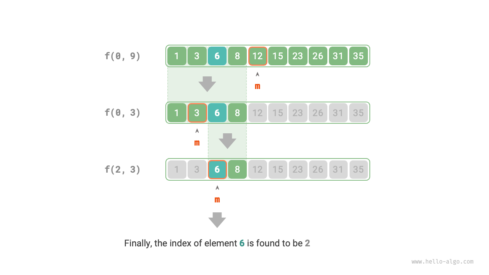

# 分割統治検索戦略

私たちは検索アルゴリズムが主に2つのカテゴリに分類されることを学びました。

- **総当たり検索**：データ構造を走査することで実装され、時間計算量は $O(n)$ です。
- **適応検索**：独特なデータ組織形式や事前情報を利用し、時間計算量は $O(\log n)$ または $O(1)$ に達することができます。

実際、**時間計算量が $O(\log n)$ の検索アルゴリズムは通常分割統治戦略に基づいています**。例えば、二分探索や木などです。

- 二分探索の各ステップは、問題（配列内でターゲット要素を検索する）をより小さな問題（配列の半分でターゲット要素を検索する）に分割し、配列が空になるかターゲット要素が見つかるまで続けます。
- 木は分割統治のアイデアを表現し、二分探索木、AVL木、ヒープなどのデータ構造では、様々な操作の時間計算量は $O(\log n)$ です。

二分探索の分割統治戦略は以下の通りです。

- **問題を分割できる**：二分探索は元の問題（配列内での検索）を部分問題（配列の半分での検索）に再帰的に分割し、中間要素とターゲット要素を比較することで実現されます。
- **部分問題は独立している**：二分探索では、各ラウンドで一つの部分問題を処理し、他の部分問題に影響されません。
- **部分問題の解をマージする必要がない**：二分探索は特定の要素を見つけることを目的としているため、部分問題の解をマージする必要がありません。部分問題が解決されると、元の問題も解決されます。

分割統治は検索効率を向上させることができます。なぜなら、総当たり検索はラウンドごとに1つの選択肢しか除去できませんが、**分割統治は選択肢の半分を除去できるからです**。

### 分割統治に基づく二分探索の実装

前の章では、二分探索は反復に基づいて実装されました。今度は、分割統治（再帰）に基づいて実装します。

!!! question

    長さ $n$ の順序付けられた配列 `nums` が与えられ、すべての要素が一意である場合、要素 `target` を見つけてください。

分割統治の観点から、検索区間 $[i, j]$ に対応する部分問題を $f(i, j)$ と表します。

元の問題 $f(0, n-1)$ から開始して、以下のステップで二分探索を実行します。

1. 検索区間 $[i, j]$ の中点 $m$ を計算し、それを使用して検索区間の半分を除去します。
2. 半分のサイズに縮小された部分問題を再帰的に解決します。これは $f(i, m-1)$ または $f(m+1, j)$ になる可能性があります。
3. `target` が見つかるか区間が空になってリターンするまで、ステップ `1.` と `2.` を繰り返します。

以下の図は、配列内で要素 $6$ を探す二分探索の分割統治過程を示しています。



実装コードでは、問題 $f(i, j)$ を解決するために再帰関数 `dfs()` を宣言します：

```src
[file]{binary_search_recur}-[class]{}-[func]{binary_search}
```
