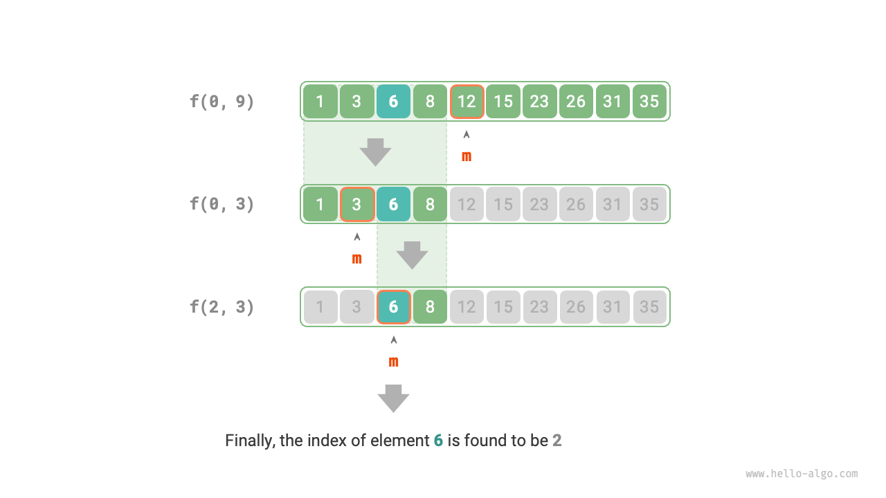

# 12.2 &nbsp; 分割統治探索戦略

私たちはすでに学んだように、探索アルゴリズムは大きく二つに分けられる。

- **力ずく探索**：データ構造を走査することで実現され、時間計算量は $O(n)$ である。
- **適応的探索**：固有のデータ構造や事前情報を利用し、時間計算量は $O(\log n)$ 、さらには $O(1)$ に達しうる。

実際、**時間計算量が $O(\log n)$ の探索アルゴリズムは通常、分割統治戦略に基づいて実装される**。たとえば二分探索や木構造である。

- 二分探索の各ステップでは、問題（配列内で目標要素を探索すること）を小さな問題（配列の半分で目標要素を探索すること）に分解し、この過程は配列が空になるか目標要素が見つかるまで続く。
- 木構造は分割統治の考え方を代表するものであり、二分探索木、AVL 木、ヒープなどのデータ構造では、さまざまな操作の時間計算量はいずれも $O(\log n)$ である。

二分探索の分割統治戦略は以下のとおりである。

- **問題は分解できる**：二分探索は、元の問題（配列内で探索すること）を部分問題（配列の半分で探索すること）へ再帰的に分解する。これは中央要素と目標要素を比較することで実現される。
- **部分問題は独立している**：二分探索では、各ラウンドで一つの部分問題だけを処理し、ほかの部分問題の影響を受けない。
- **部分問題の解を統合する必要はない**：二分探索は特定の要素を探すことを目的としているため、部分問題の解を統合する必要がない。部分問題が解決されると、元の問題も同時に解決される。

分割統治が探索効率を高められる本質的な理由は、力ずく探索では各ラウンドで一つの候補しか除外できないのに対し、**分割統治による探索では各ラウンドで候補の半分を除外できる**からである。

### 1. &nbsp; 分割統治に基づく二分探索

前の章では、二分探索を漸化式（反復）に基づいて実装した。ここでは分割統治（再帰）に基づいてこれを実装する。

!!! question

    長さ $n$ の昇順配列 `nums` が与えられ、そのすべての要素は一意である。要素 `target` を探索せよ。

分割統治の観点から、探索区間 $[i, j]$ に対応する部分問題を $f(i, j)$ と記す。

元の問題 $f(0, n-1)$ を出発点として、次の手順で二分探索を行う。

1. 探索区間 $[i, j]$ の中点 $m$ を計算し、それに基づいて探索区間の半分を除外する。
2. 規模が半分に縮小された部分問題を再帰的に解く。候補は $f(i, m-1)$ または $f(m+1, j)$ である。
3. `1.` と `2.` の手順を繰り返し、`target` が見つかるか区間が空になったら返す。

次の図は、配列内で要素 $6$ を二分探索する分割統治の過程を示している。

{ class="animation-figure" }

<p align="center"> 図 12-4 &nbsp; 二分探索の分割統治の過程 </p>

実装コードでは、再帰関数 `dfs()` を宣言して問題 $f(i, j)$ を解く。

=== "Python"

    ```python title="binary_search_recur.py"
    def dfs(nums: list[int], target: int, i: int, j: int) -> int:
        """二分探索：問題 f(i, j)"""
        # 区間が空なら対象要素は存在しないので -1 を返す
        if i > j:
            return -1
        # 中点インデックス m を計算
        m = (i + j) // 2
        if nums[m] < target:
            # 部分問題 f(m+1, j) を再帰的に解く
            return dfs(nums, target, m + 1, j)
        elif nums[m] > target:
            # 部分問題 f(i, m-1) を再帰的に解く
            return dfs(nums, target, i, m - 1)
        else:
            # 目標要素が見つかったらそのインデックスを返す
            return m

    def binary_search(nums: list[int], target: int) -> int:
        """二分探索"""
        n = len(nums)
        # 問題 f(0, n-1) を解く
        return dfs(nums, target, 0, n - 1)
    ```

=== "C++"

    ```cpp title="binary_search_recur.cpp"
    /* 二分探索：問題 f(i, j) */
    int dfs(vector<int> &nums, int target, int i, int j) {
        // 区間が空なら対象要素は存在しないので -1 を返す
        if (i > j) {
            return -1;
        }
        // 中点インデックス m を計算
        int m = (i + j) / 2;
        if (nums[m] < target) {
            // 部分問題 f(m+1, j) を再帰的に解く
            return dfs(nums, target, m + 1, j);
        } else if (nums[m] > target) {
            // 部分問題 f(i, m-1) を再帰的に解く
            return dfs(nums, target, i, m - 1);
        } else {
            // 目標要素が見つかったらそのインデックスを返す
            return m;
        }
    }

    /* 二分探索 */
    int binarySearch(vector<int> &nums, int target) {
        int n = nums.size();
        // 問題 f(0, n-1) を解く
        return dfs(nums, target, 0, n - 1);
    }
    ```

=== "Java"

    ```java title="binary_search_recur.java"
    /* 二分探索：問題 f(i, j) */
    int dfs(int[] nums, int target, int i, int j) {
        // 区間が空なら対象要素は存在しないので -1 を返す
        if (i > j) {
            return -1;
        }
        // 中点インデックス m を計算
        int m = (i + j) / 2;
        if (nums[m] < target) {
            // 部分問題 f(m+1, j) を再帰的に解く
            return dfs(nums, target, m + 1, j);
        } else if (nums[m] > target) {
            // 部分問題 f(i, m-1) を再帰的に解く
            return dfs(nums, target, i, m - 1);
        } else {
            // 目標要素が見つかったらそのインデックスを返す
            return m;
        }
    }

    /* 二分探索 */
    int binarySearch(int[] nums, int target) {
        int n = nums.length;
        // 問題 f(0, n-1) を解く
        return dfs(nums, target, 0, n - 1);
    }
    ```

=== "C#"

    ```csharp title="binary_search_recur.cs"
    /* 二分探索：問題 f(i, j) */
    int DFS(int[] nums, int target, int i, int j) {
        // 区間が空なら対象要素は存在しないので -1 を返す
        if (i > j) {
            return -1;
        }
        // 中点インデックス m を計算
        int m = (i + j) / 2;
        if (nums[m] < target) {
            // 部分問題 f(m+1, j) を再帰的に解く
            return DFS(nums, target, m + 1, j);
        } else if (nums[m] > target) {
            // 部分問題 f(i, m-1) を再帰的に解く
            return DFS(nums, target, i, m - 1);
        } else {
            // 目標要素が見つかったらそのインデックスを返す
            return m;
        }
    }

    /* 二分探索 */
    int BinarySearch(int[] nums, int target) {
        int n = nums.Length;
        // 問題 f(0, n-1) を解く
        return DFS(nums, target, 0, n - 1);
    }
    ```

=== "Go"

    ```go title="binary_search_recur.go"
    /* 二分探索：問題 f(i, j) */
    func dfs(nums []int, target, i, j int) int {
        // 区間が空なら対象要素は存在しないため、-1 を返す
        if i > j {
            return -1
        }
        // 中点インデックスを計算する
        m := i + ((j - i) >> 1)
        // 中点の要素と目標要素の大小を判定する
        if nums[m] < target {
            // 小さければ右半分の配列を再帰
            // 部分問題 f(m+1, j) を解く
            return dfs(nums, target, m+1, j)
        } else if nums[m] > target {
            // 大きければ左半分の配列を再帰
            // 部分問題 f(i, m-1) を解く
            return dfs(nums, target, i, m-1)
        } else {
            // 目標要素が見つかったらそのインデックスを返す
            return m
        }
    }

    /* 二分探索 */
    func binarySearch(nums []int, target int) int {
        n := len(nums)
        return dfs(nums, target, 0, n-1)
    }
    ```

=== "Swift"

    ```swift title="binary_search_recur.swift"
    /* 二分探索：問題 f(i, j) */
    func dfs(nums: [Int], target: Int, i: Int, j: Int) -> Int {
        // 区間が空なら対象要素は存在しないので -1 を返す
        if i > j {
            return -1
        }
        // 中点インデックス m を計算
        let m = (i + j) / 2
        if nums[m] < target {
            // 部分問題 f(m+1, j) を再帰的に解く
            return dfs(nums: nums, target: target, i: m + 1, j: j)
        } else if nums[m] > target {
            // 部分問題 f(i, m-1) を再帰的に解く
            return dfs(nums: nums, target: target, i: i, j: m - 1)
        } else {
            // 目標要素が見つかったらそのインデックスを返す
            return m
        }
    }

    /* 二分探索 */
    func binarySearch(nums: [Int], target: Int) -> Int {
        // 問題 f(0, n-1) を解く
        dfs(nums: nums, target: target, i: nums.startIndex, j: nums.endIndex - 1)
    }
    ```

=== "JS"

    ```javascript title="binary_search_recur.js"
    /* 二分探索：問題 f(i, j) */
    function dfs(nums, target, i, j) {
        // 区間が空なら対象要素は存在しないので -1 を返す
        if (i > j) {
            return -1;
        }
        // 中点インデックス m を計算
        const m = i + ((j - i) >> 1);
        if (nums[m] < target) {
            // 部分問題 f(m+1, j) を再帰的に解く
            return dfs(nums, target, m + 1, j);
        } else if (nums[m] > target) {
            // 部分問題 f(i, m-1) を再帰的に解く
            return dfs(nums, target, i, m - 1);
        } else {
            // 目標要素が見つかったらそのインデックスを返す
            return m;
        }
    }

    /* 二分探索 */
    function binarySearch(nums, target) {
        const n = nums.length;
        // 問題 f(0, n-1) を解く
        return dfs(nums, target, 0, n - 1);
    }
    ```

=== "TS"

    ```typescript title="binary_search_recur.ts"
    /* 二分探索：問題 f(i, j) */
    function dfs(nums: number[], target: number, i: number, j: number): number {
        // 区間が空なら対象要素は存在しないので -1 を返す
        if (i > j) {
            return -1;
        }
        // 中点インデックス m を計算
        const m = i + ((j - i) >> 1);
        if (nums[m] < target) {
            // 部分問題 f(m+1, j) を再帰的に解く
            return dfs(nums, target, m + 1, j);
        } else if (nums[m] > target) {
            // 部分問題 f(i, m-1) を再帰的に解く
            return dfs(nums, target, i, m - 1);
        } else {
            // 目標要素が見つかったらそのインデックスを返す
            return m;
        }
    }

    /* 二分探索 */
    function binarySearch(nums: number[], target: number): number {
        const n = nums.length;
        // 問題 f(0, n-1) を解く
        return dfs(nums, target, 0, n - 1);
    }
    ```

=== "Dart"

    ```dart title="binary_search_recur.dart"
    /* 二分探索：問題 f(i, j) */
    int dfs(List<int> nums, int target, int i, int j) {
      // 区間が空なら対象要素は存在しないので -1 を返す
      if (i > j) {
        return -1;
      }
      // 中点インデックス m を計算
      int m = (i + j) ~/ 2;
      if (nums[m] < target) {
        // 部分問題 f(m+1, j) を再帰的に解く
        return dfs(nums, target, m + 1, j);
      } else if (nums[m] > target) {
        // 部分問題 f(i, m-1) を再帰的に解く
        return dfs(nums, target, i, m - 1);
      } else {
        // 目標要素が見つかったらそのインデックスを返す
        return m;
      }
    }

    /* 二分探索 */
    int binarySearch(List<int> nums, int target) {
      int n = nums.length;
      // 問題 f(0, n-1) を解く
      return dfs(nums, target, 0, n - 1);
    }
    ```

=== "Rust"

    ```rust title="binary_search_recur.rs"
    /* 二分探索：問題 f(i, j) */
    fn dfs(nums: &[i32], target: i32, i: i32, j: i32) -> i32 {
        // 区間が空なら対象要素は存在しないので -1 を返す
        if i > j {
            return -1;
        }
        let m: i32 = i + (j - i) / 2;
        if nums[m as usize] < target {
            // 部分問題 f(m+1, j) を再帰的に解く
            return dfs(nums, target, m + 1, j);
        } else if nums[m as usize] > target {
            // 部分問題 f(i, m-1) を再帰的に解く
            return dfs(nums, target, i, m - 1);
        } else {
            // 目標要素が見つかったらそのインデックスを返す
            return m;
        }
    }

    /* 二分探索 */
    fn binary_search(nums: &[i32], target: i32) -> i32 {
        let n = nums.len() as i32;
        // 問題 f(0, n-1) を解く
        dfs(nums, target, 0, n - 1)
    }
    ```

=== "C"

    ```c title="binary_search_recur.c"
    /* 二分探索：問題 f(i, j) */
    int dfs(int nums[], int target, int i, int j) {
        // 区間が空なら対象要素は存在しないので -1 を返す
        if (i > j) {
            return -1;
        }
        // 中点インデックス m を計算
        int m = (i + j) / 2;
        if (nums[m] < target) {
            // 部分問題 f(m+1, j) を再帰的に解く
            return dfs(nums, target, m + 1, j);
        } else if (nums[m] > target) {
            // 部分問題 f(i, m-1) を再帰的に解く
            return dfs(nums, target, i, m - 1);
        } else {
            // 目標要素が見つかったらそのインデックスを返す
            return m;
        }
    }

    /* 二分探索 */
    int binarySearch(int nums[], int target, int numsSize) {
        int n = numsSize;
        // 問題 f(0, n-1) を解く
        return dfs(nums, target, 0, n - 1);
    }
    ```

=== "Kotlin"

    ```kotlin title="binary_search_recur.kt"
    /* 二分探索：問題 f(i, j) */
    fun dfs(
        nums: IntArray,
        target: Int,
        i: Int,
        j: Int
    ): Int {
        // 区間が空なら対象要素は存在しないので -1 を返す
        if (i > j) {
            return -1
        }
        // 中点インデックス m を計算
        val m = (i + j) / 2
        return if (nums[m] < target) {
            // 部分問題 f(m+1, j) を再帰的に解く
            dfs(nums, target, m + 1, j)
        } else if (nums[m] > target) {
            // 部分問題 f(i, m-1) を再帰的に解く
            dfs(nums, target, i, m - 1)
        } else {
            // 目標要素が見つかったらそのインデックスを返す
            m
        }
    }

    /* 二分探索 */
    fun binarySearch(nums: IntArray, target: Int): Int {
        val n = nums.size
        // 問題 f(0, n-1) を解く
        return dfs(nums, target, 0, n - 1)
    }
    ```

=== "Ruby"

    ```ruby title="binary_search_recur.rb"
    ### 二分探索: 問題 f(i, j) ###
    def dfs(nums, target, i, j)
      # 区間が空なら対象要素は存在しないので -1 を返す
      return -1 if i > j
      
      # 中点インデックス m を計算
      m = (i + j) / 2

      if nums[m] < target
        # 部分問題 f(m+1, j) を再帰的に解く
        return dfs(nums, target, m + 1, j)
      elsif nums[m] > target
        # 部分問題 f(i, m-1) を再帰的に解く
        return dfs(nums, target, i, m - 1)
      else
        # 目標要素が見つかったらそのインデックスを返す
        return m
      end
    end

    ### 二分探索 ###
    def binary_search(nums, target)
      n = nums.length
      # 問題 f(0, n-1) を解く
      dfs(nums, target, 0, n - 1)
    end
    ```

??? pythontutor "コードの可視化"

    <div style="height: 549px; width: 100%;"><iframe class="pythontutor-iframe" src="https://pythontutor.com/iframe-embed.html#code=def%20dfs%28nums%3A%20list%5Bint%5D%2C%20target%3A%20int%2C%20i%3A%20int%2C%20j%3A%20int%29%20-%3E%20int%3A%0A%20%20%20%20%22%22%22%E4%BA%8C%E5%88%86%E6%8E%A2%E7%B4%A2%EF%BC%9A%E5%95%8F%E9%A1%8C%20f%28i%2C%20j%29%22%22%22%0A%20%20%20%20%23%20%E5%8C%BA%E9%96%93%E3%81%8C%E7%A9%BA%E3%81%AA%E3%82%89%E5%AF%BE%E8%B1%A1%E8%A6%81%E7%B4%A0%E3%81%AF%E5%AD%98%E5%9C%A8%E3%81%97%E3%81%AA%E3%81%84%E3%81%AE%E3%81%A7%20-1%20%E3%82%92%E8%BF%94%E3%81%99%0A%20%20%20%20if%20i%20%3E%20j%3A%0A%20%20%20%20%20%20%20%20return%20-1%0A%20%20%20%20%23%20%E4%B8%AD%E7%82%B9%E3%82%A4%E3%83%B3%E3%83%87%E3%83%83%E3%82%AF%E3%82%B9%20m%20%E3%82%92%E8%A8%88%E7%AE%97%0A%20%20%20%20m%20%3D%20%28i%20%2B%20j%29%20%2F%2F%202%0A%20%20%20%20if%20nums%5Bm%5D%20%3C%20target%3A%0A%20%20%20%20%20%20%20%20%23%20%E9%83%A8%E5%88%86%E5%95%8F%E9%A1%8C%20f%28m%2B1%2C%20j%29%20%E3%82%92%E5%86%8D%E5%B8%B0%E7%9A%84%E3%81%AB%E8%A7%A3%E3%81%8F%0A%20%20%20%20%20%20%20%20return%20dfs%28nums%2C%20target%2C%20m%20%2B%201%2C%20j%29%0A%20%20%20%20elif%20nums%5Bm%5D%20%3E%20target%3A%0A%20%20%20%20%20%20%20%20%23%20%E9%83%A8%E5%88%86%E5%95%8F%E9%A1%8C%20f%28i%2C%20m-1%29%20%E3%82%92%E5%86%8D%E5%B8%B0%E7%9A%84%E3%81%AB%E8%A7%A3%E3%81%8F%0A%20%20%20%20%20%20%20%20return%20dfs%28nums%2C%20target%2C%20i%2C%20m%20-%201%29%0A%20%20%20%20else%3A%0A%20%20%20%20%20%20%20%20%23%20%E7%9B%AE%E6%A8%99%E8%A6%81%E7%B4%A0%E3%81%8C%E8%A6%8B%E3%81%A4%E3%81%8B%E3%81%A3%E3%81%9F%E3%82%89%E3%81%9D%E3%81%AE%E3%82%A4%E3%83%B3%E3%83%87%E3%83%83%E3%82%AF%E3%82%B9%E3%82%92%E8%BF%94%E3%81%99%0A%20%20%20%20%20%20%20%20return%20m%0A%0Adef%20binary_search%28nums%3A%20list%5Bint%5D%2C%20target%3A%20int%29%20-%3E%20int%3A%0A%20%20%20%20%22%22%22%E4%BA%8C%E5%88%86%E6%8E%A2%E7%B4%A2%22%22%22%0A%20%20%20%20n%20%3D%20len%28nums%29%0A%20%20%20%20%23%20%E5%95%8F%E9%A1%8C%20f%280%2C%20n-1%29%20%E3%82%92%E8%A7%A3%E3%81%8F%0A%20%20%20%20return%20dfs%28nums%2C%20target%2C%200%2C%20n%20-%201%29%0A%0Aif%20__name__%20%3D%3D%20%22__main__%22%3A%0A%20%20%20%20target%20%3D%206%0A%20%20%20%20nums%20%3D%20%5B1%2C%203%2C%206%2C%208%2C%2012%2C%2015%2C%2023%2C%2026%2C%2031%2C%2035%5D%0A%0A%20%20%20%20%23%20%E4%BA%8C%E5%88%86%E6%8E%A2%E7%B4%A2%EF%BC%88%E4%B8%A1%E9%96%89%E5%8C%BA%E9%96%93%EF%BC%89%0A%20%20%20%20index%20%3D%20binary_search%28nums%2C%20target%29%0A%20%20%20%20print%28%22%E5%AF%BE%E8%B1%A1%E8%A6%81%E7%B4%A0%206%20%E3%81%AE%E3%82%A4%E3%83%B3%E3%83%87%E3%83%83%E3%82%AF%E3%82%B9%20%3D%20%22%2C%20index%29&codeDivHeight=472&codeDivWidth=350&cumulative=false&curInstr=6&heapPrimitives=nevernest&origin=opt-frontend.js&py=311&rawInputLstJSON=%5B%5D&textReferences=false"> </iframe></div>
    <div style="margin-top: 5px;"><a href="https://pythontutor.com/iframe-embed.html#code=def%20dfs%28nums%3A%20list%5Bint%5D%2C%20target%3A%20int%2C%20i%3A%20int%2C%20j%3A%20int%29%20-%3E%20int%3A%0A%20%20%20%20%22%22%22%E4%BA%8C%E5%88%86%E6%8E%A2%E7%B4%A2%EF%BC%9A%E5%95%8F%E9%A1%8C%20f%28i%2C%20j%29%22%22%22%0A%20%20%20%20%23%20%E5%8C%BA%E9%96%93%E3%81%8C%E7%A9%BA%E3%81%AA%E3%82%89%E5%AF%BE%E8%B1%A1%E8%A6%81%E7%B4%A0%E3%81%AF%E5%AD%98%E5%9C%A8%E3%81%97%E3%81%AA%E3%81%84%E3%81%AE%E3%81%A7%20-1%20%E3%82%92%E8%BF%94%E3%81%99%0A%20%20%20%20if%20i%20%3E%20j%3A%0A%20%20%20%20%20%20%20%20return%20-1%0A%20%20%20%20%23%20%E4%B8%AD%E7%82%B9%E3%82%A4%E3%83%B3%E3%83%87%E3%83%83%E3%82%AF%E3%82%B9%20m%20%E3%82%92%E8%A8%88%E7%AE%97%0A%20%20%20%20m%20%3D%20%28i%20%2B%20j%29%20%2F%2F%202%0A%20%20%20%20if%20nums%5Bm%5D%20%3C%20target%3A%0A%20%20%20%20%20%20%20%20%23%20%E9%83%A8%E5%88%86%E5%95%8F%E9%A1%8C%20f%28m%2B1%2C%20j%29%20%E3%82%92%E5%86%8D%E5%B8%B0%E7%9A%84%E3%81%AB%E8%A7%A3%E3%81%8F%0A%20%20%20%20%20%20%20%20return%20dfs%28nums%2C%20target%2C%20m%20%2B%201%2C%20j%29%0A%20%20%20%20elif%20nums%5Bm%5D%20%3E%20target%3A%0A%20%20%20%20%20%20%20%20%23%20%E9%83%A8%E5%88%86%E5%95%8F%E9%A1%8C%20f%28i%2C%20m-1%29%20%E3%82%92%E5%86%8D%E5%B8%B0%E7%9A%84%E3%81%AB%E8%A7%A3%E3%81%8F%0A%20%20%20%20%20%20%20%20return%20dfs%28nums%2C%20target%2C%20i%2C%20m%20-%201%29%0A%20%20%20%20else%3A%0A%20%20%20%20%20%20%20%20%23%20%E7%9B%AE%E6%A8%99%E8%A6%81%E7%B4%A0%E3%81%8C%E8%A6%8B%E3%81%A4%E3%81%8B%E3%81%A3%E3%81%9F%E3%82%89%E3%81%9D%E3%81%AE%E3%82%A4%E3%83%B3%E3%83%87%E3%83%83%E3%82%AF%E3%82%B9%E3%82%92%E8%BF%94%E3%81%99%0A%20%20%20%20%20%20%20%20return%20m%0A%0Adef%20binary_search%28nums%3A%20list%5Bint%5D%2C%20target%3A%20int%29%20-%3E%20int%3A%0A%20%20%20%20%22%22%22%E4%BA%8C%E5%88%86%E6%8E%A2%E7%B4%A2%22%22%22%0A%20%20%20%20n%20%3D%20len%28nums%29%0A%20%20%20%20%23%20%E5%95%8F%E9%A1%8C%20f%280%2C%20n-1%29%20%E3%82%92%E8%A7%A3%E3%81%8F%0A%20%20%20%20return%20dfs%28nums%2C%20target%2C%200%2C%20n%20-%201%29%0A%0Aif%20__name__%20%3D%3D%20%22__main__%22%3A%0A%20%20%20%20target%20%3D%206%0A%20%20%20%20nums%20%3D%20%5B1%2C%203%2C%206%2C%208%2C%2012%2C%2015%2C%2023%2C%2026%2C%2031%2C%2035%5D%0A%0A%20%20%20%20%23%20%E4%BA%8C%E5%88%86%E6%8E%A2%E7%B4%A2%EF%BC%88%E4%B8%A1%E9%96%89%E5%8C%BA%E9%96%93%EF%BC%89%0A%20%20%20%20index%20%3D%20binary_search%28nums%2C%20target%29%0A%20%20%20%20print%28%22%E5%AF%BE%E8%B1%A1%E8%A6%81%E7%B4%A0%206%20%E3%81%AE%E3%82%A4%E3%83%B3%E3%83%87%E3%83%83%E3%82%AF%E3%82%B9%20%3D%20%22%2C%20index%29&codeDivHeight=800&codeDivWidth=600&cumulative=false&curInstr=6&heapPrimitives=nevernest&origin=opt-frontend.js&py=311&rawInputLstJSON=%5B%5D&textReferences=false" target="_blank" rel="noopener noreferrer">全画面で見る ></a></div>
