# 12.3 &nbsp; 二分木の構築問題

!!! question

    二分木の前順走査 `preorder` と中順走査 `inorder` が与えられたとき、これらから二分木を構築し、その根ノードを返してください。二分木には値が重複するノードが存在しないものとします（下図のとおり）。

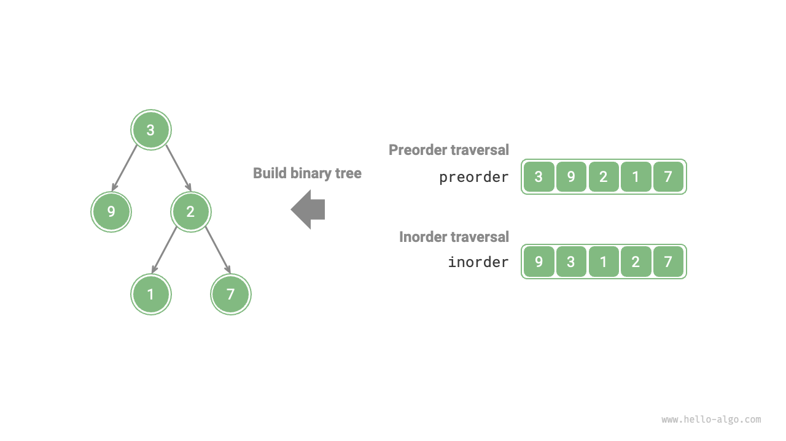{ class="animation-figure" }

<p align="center"> 図 12-5 &nbsp; 二分木を構築する例のデータ </p>

### 1. &nbsp; 分割統治問題かどうかを判断する

元の問題は `preorder` と `inorder` から二分木を構築することであり、典型的な分割統治問題です。

- **問題は分解できる**：分割統治の観点から見ると、元の問題は 2 つの部分問題、すなわち左部分木の構築と右部分木の構築に分けられ、さらに根ノードを初期化する 1 ステップが加わります。各部分木（部分問題）に対しても、同じ分割方法を再利用してより小さな部分木（部分問題）へと分けていき、最小の部分問題（空部分木）に達した時点で終了します。
- **部分問題は独立している**：左部分木と右部分木は互いに独立しており、両者の間に重なりはありません。左部分木を構築するときは、中順走査と前順走査のうち左部分木に対応する部分だけを見れば十分です。右部分木も同様です。
- **部分問題の解は統合できる**：左部分木と右部分木（部分問題の解）が得られたら、それらを根ノードに接続することで元の問題の解を得られます。

### 2. &nbsp; 部分木をどのように分割するか

以上の分析より、この問題は分割統治で解けます。**では、前順走査 `preorder` と中順走査 `inorder` を使って左部分木と右部分木をどのように分割すればよいのでしょうか**？

定義に従うと、`preorder` と `inorder` はいずれも 3 つの部分に分けられます。

- 前順走査：`[ 根ノード | 左部分木 | 右部分木 ]` ，例えば上図の木は `[ 3 | 9 | 2 1 7 ]` に対応します。
- 中順走査：`[ 左部分木 | 根ノード ｜ 右部分木 ]` ，例えば上図の木は `[ 9 | 3 | 1 2 7 ]` に対応します。

上図のデータを例にすると、下図の手順によって分割結果を得られます。

1. 前順走査の先頭要素 3 が根ノードの値です。
2. 根ノード 3 の `inorder` におけるインデックスを探すと、そのインデックスを用いて `inorder` を `[ 9 | 3 ｜ 1 2 7 ]` に分割できます。
3. `inorder` の分割結果から、左部分木と右部分木のノード数はそれぞれ 1 と 3 であることがわかり、したがって `preorder` を `[ 3 | 9 | 2 1 7 ]` に分割できます。

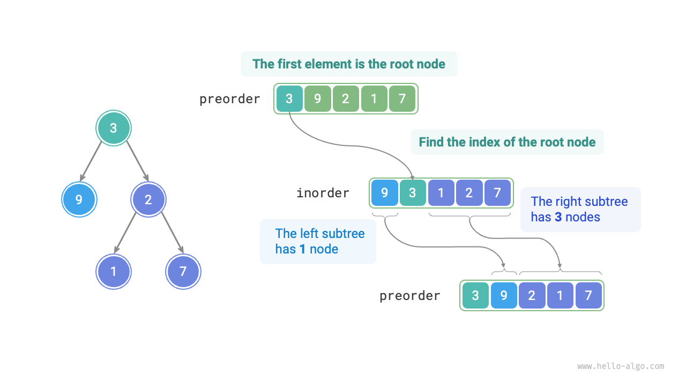{ class="animation-figure" }

<p align="center"> 図 12-6 &nbsp; 前順走査と中順走査で部分木を分割する </p>

### 3. &nbsp; 変数を用いて部分木区間を記述する

以上の分割方法により、**根ノード、左部分木、右部分木が `preorder` と `inorder` の中で占めるインデックス区間**が得られました。これらのインデックス区間を表すために、いくつかのポインタ変数を導入します。

- 現在の木の根ノードが `preorder` に現れるインデックスを $i$ とします。
- 現在の木の根ノードが `inorder` に現れるインデックスを $m$ とします。
- 現在の木が `inorder` において占めるインデックス区間を $[l, r]$ とします。

次の表のように、これらの変数を用いれば根ノードの `preorder` におけるインデックスと、部分木の `inorder` におけるインデックス区間を表せます。

<p align="center"> 表 12-1 &nbsp; 根ノードと部分木の前順走査・中順走査におけるインデックス </p>

<div class="center-table" markdown>

|        | 根ノードの `preorder` におけるインデックス | 部分木の `inorder` におけるインデックス区間 |
| ------ | ---------------------------- | ----------------------------- |
| 現在の木 | $i$                          | $[l, r]$                      |
| 左部分木 | $i + 1$                      | $[l, m-1]$                    |
| 右部分木 | $i + 1 + (m - l)$            | $[m+1, r]$                    |

</div>

右部分木の根ノードのインデックスにある $(m-l)$ は「左部分木のノード数」を意味します。下図と合わせて理解することを勧めます。

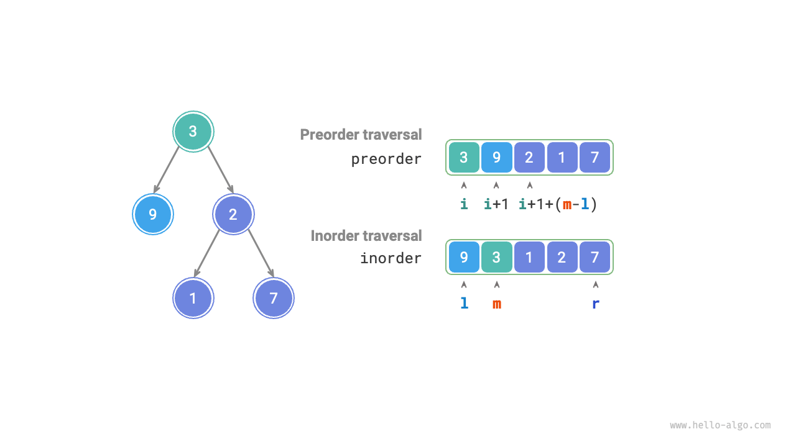{ class="animation-figure" }

<p align="center"> 図 12-7 &nbsp; 根ノードと左右部分木のインデックス区間の表し方 </p>

### 4. &nbsp; コードの実装

$m$ の検索効率を高めるために、ハッシュテーブル `hmap` を用いて配列 `inorder` の要素からインデックスへの対応を保存します。

=== "Python"

    ```python title="build_tree.py"
    def dfs(
        preorder: list[int],
        inorder_map: dict[int, int],
        i: int,
        l: int,
        r: int,
    ) -> TreeNode | None:
        """二分木を構築：分割統治"""
        # 部分木区間が空なら終了する
        if r - l < 0:
            return None
        # ルートノードを初期化する
        root = TreeNode(preorder[i])
        # m を求めて左右部分木を分割する
        m = inorder_map[preorder[i]]
        # 部分問題：左部分木を構築する
        root.left = dfs(preorder, inorder_map, i + 1, l, m - 1)
        # 部分問題：右部分木を構築する
        root.right = dfs(preorder, inorder_map, i + 1 + m - l, m + 1, r)
        # 根ノードを返す
        return root

    def build_tree(preorder: list[int], inorder: list[int]) -> TreeNode | None:
        """二分木を構築"""
        # inorder の要素からインデックスへの対応を格納するハッシュテーブルを初期化する
        inorder_map = {val: i for i, val in enumerate(inorder)}
        root = dfs(preorder, inorder_map, 0, 0, len(inorder) - 1)
        return root
    ```

=== "C++"

    ```cpp title="build_tree.cpp"
    /* 二分木を構築：分割統治 */
    TreeNode *dfs(vector<int> &preorder, unordered_map<int, int> &inorderMap, int i, int l, int r) {
        // 部分木区間が空なら終了する
        if (r - l < 0)
            return NULL;
        // ルートノードを初期化する
        TreeNode *root = new TreeNode(preorder[i]);
        // m を求めて左右部分木を分割する
        int m = inorderMap[preorder[i]];
        // 部分問題：左部分木を構築する
        root->left = dfs(preorder, inorderMap, i + 1, l, m - 1);
        // 部分問題：右部分木を構築する
        root->right = dfs(preorder, inorderMap, i + 1 + m - l, m + 1, r);
        // 根ノードを返す
        return root;
    }

    /* 二分木を構築 */
    TreeNode *buildTree(vector<int> &preorder, vector<int> &inorder) {
        // inorder の要素からインデックスへの対応を格納するハッシュテーブルを初期化する
        unordered_map<int, int> inorderMap;
        for (int i = 0; i < inorder.size(); i++) {
            inorderMap[inorder[i]] = i;
        }
        TreeNode *root = dfs(preorder, inorderMap, 0, 0, inorder.size() - 1);
        return root;
    }
    ```

=== "Java"

    ```java title="build_tree.java"
    /* 二分木を構築：分割統治 */
    TreeNode dfs(int[] preorder, Map<Integer, Integer> inorderMap, int i, int l, int r) {
        // 部分木区間が空なら終了する
        if (r - l < 0)
            return null;
        // ルートノードを初期化する
        TreeNode root = new TreeNode(preorder[i]);
        // m を求めて左右部分木を分割する
        int m = inorderMap.get(preorder[i]);
        // 部分問題：左部分木を構築する
        root.left = dfs(preorder, inorderMap, i + 1, l, m - 1);
        // 部分問題：右部分木を構築する
        root.right = dfs(preorder, inorderMap, i + 1 + m - l, m + 1, r);
        // 根ノードを返す
        return root;
    }

    /* 二分木を構築 */
    TreeNode buildTree(int[] preorder, int[] inorder) {
        // inorder の要素からインデックスへの対応を格納するハッシュテーブルを初期化する
        Map<Integer, Integer> inorderMap = new HashMap<>();
        for (int i = 0; i < inorder.length; i++) {
            inorderMap.put(inorder[i], i);
        }
        TreeNode root = dfs(preorder, inorderMap, 0, 0, inorder.length - 1);
        return root;
    }
    ```

=== "C#"

    ```csharp title="build_tree.cs"
    /* 二分木を構築：分割統治 */
    TreeNode? DFS(int[] preorder, Dictionary<int, int> inorderMap, int i, int l, int r) {
        // 部分木区間が空なら終了する
        if (r - l < 0)
            return null;
        // ルートノードを初期化する
        TreeNode root = new(preorder[i]);
        // m を求めて左右部分木を分割する
        int m = inorderMap[preorder[i]];
        // 部分問題：左部分木を構築する
        root.left = DFS(preorder, inorderMap, i + 1, l, m - 1);
        // 部分問題：右部分木を構築する
        root.right = DFS(preorder, inorderMap, i + 1 + m - l, m + 1, r);
        // 根ノードを返す
        return root;
    }

    /* 二分木を構築 */
    TreeNode? BuildTree(int[] preorder, int[] inorder) {
        // inorder の要素からインデックスへの対応を格納するハッシュテーブルを初期化する
        Dictionary<int, int> inorderMap = [];
        for (int i = 0; i < inorder.Length; i++) {
            inorderMap.TryAdd(inorder[i], i);
        }
        TreeNode? root = DFS(preorder, inorderMap, 0, 0, inorder.Length - 1);
        return root;
    }
    ```

=== "Go"

    ```go title="build_tree.go"
    /* 二分木を構築：分割統治 */
    func dfsBuildTree(preorder []int, inorderMap map[int]int, i, l, r int) *TreeNode {
        // 部分木区間が空なら終了する
        if r-l < 0 {
            return nil
        }
        // ルートノードを初期化する
        root := NewTreeNode(preorder[i])
        // m を求めて左右部分木を分割する
        m := inorderMap[preorder[i]]
        // 部分問題：左部分木を構築する
        root.Left = dfsBuildTree(preorder, inorderMap, i+1, l, m-1)
        // 部分問題：右部分木を構築する
        root.Right = dfsBuildTree(preorder, inorderMap, i+1+m-l, m+1, r)
        // 根ノードを返す
        return root
    }

    /* 二分木を構築 */
    func buildTree(preorder, inorder []int) *TreeNode {
        // inorder の要素からインデックスへの対応を格納するハッシュテーブルを初期化する
        inorderMap := make(map[int]int, len(inorder))
        for i := 0; i < len(inorder); i++ {
            inorderMap[inorder[i]] = i
        }

        root := dfsBuildTree(preorder, inorderMap, 0, 0, len(inorder)-1)
        return root
    }
    ```

=== "Swift"

    ```swift title="build_tree.swift"
    /* 二分木を構築：分割統治 */
    func dfs(preorder: [Int], inorderMap: [Int: Int], i: Int, l: Int, r: Int) -> TreeNode? {
        // 部分木区間が空なら終了する
        if r - l < 0 {
            return nil
        }
        // ルートノードを初期化する
        let root = TreeNode(x: preorder[i])
        // m を求めて左右部分木を分割する
        let m = inorderMap[preorder[i]]!
        // 部分問題：左部分木を構築する
        root.left = dfs(preorder: preorder, inorderMap: inorderMap, i: i + 1, l: l, r: m - 1)
        // 部分問題：右部分木を構築する
        root.right = dfs(preorder: preorder, inorderMap: inorderMap, i: i + 1 + m - l, l: m + 1, r: r)
        // 根ノードを返す
        return root
    }

    /* 二分木を構築 */
    func buildTree(preorder: [Int], inorder: [Int]) -> TreeNode? {
        // inorder の要素からインデックスへの対応を格納するハッシュテーブルを初期化する
        let inorderMap = inorder.enumerated().reduce(into: [:]) { $0[$1.element] = $1.offset }
        return dfs(preorder: preorder, inorderMap: inorderMap, i: inorder.startIndex, l: inorder.startIndex, r: inorder.endIndex - 1)
    }
    ```

=== "JS"

    ```javascript title="build_tree.js"
    /* 二分木を構築：分割統治 */
    function dfs(preorder, inorderMap, i, l, r) {
        // 部分木区間が空なら終了する
        if (r - l < 0) return null;
        // ルートノードを初期化する
        const root = new TreeNode(preorder[i]);
        // m を求めて左右部分木を分割する
        const m = inorderMap.get(preorder[i]);
        // 部分問題：左部分木を構築する
        root.left = dfs(preorder, inorderMap, i + 1, l, m - 1);
        // 部分問題：右部分木を構築する
        root.right = dfs(preorder, inorderMap, i + 1 + m - l, m + 1, r);
        // 根ノードを返す
        return root;
    }

    /* 二分木を構築 */
    function buildTree(preorder, inorder) {
        // inorder の要素からインデックスへの対応を格納するハッシュテーブルを初期化する
        let inorderMap = new Map();
        for (let i = 0; i < inorder.length; i++) {
            inorderMap.set(inorder[i], i);
        }
        const root = dfs(preorder, inorderMap, 0, 0, inorder.length - 1);
        return root;
    }
    ```

=== "TS"

    ```typescript title="build_tree.ts"
    /* 二分木を構築：分割統治 */
    function dfs(
        preorder: number[],
        inorderMap: Map<number, number>,
        i: number,
        l: number,
        r: number
    ): TreeNode | null {
        // 部分木区間が空なら終了する
        if (r - l < 0) return null;
        // ルートノードを初期化する
        const root: TreeNode = new TreeNode(preorder[i]);
        // m を求めて左右部分木を分割する
        const m = inorderMap.get(preorder[i]);
        // 部分問題：左部分木を構築する
        root.left = dfs(preorder, inorderMap, i + 1, l, m - 1);
        // 部分問題：右部分木を構築する
        root.right = dfs(preorder, inorderMap, i + 1 + m - l, m + 1, r);
        // 根ノードを返す
        return root;
    }

    /* 二分木を構築 */
    function buildTree(preorder: number[], inorder: number[]): TreeNode | null {
        // inorder の要素からインデックスへの対応を格納するハッシュテーブルを初期化する
        let inorderMap = new Map<number, number>();
        for (let i = 0; i < inorder.length; i++) {
            inorderMap.set(inorder[i], i);
        }
        const root = dfs(preorder, inorderMap, 0, 0, inorder.length - 1);
        return root;
    }
    ```

=== "Dart"

    ```dart title="build_tree.dart"
    /* 二分木を構築：分割統治 */
    TreeNode? dfs(
      List<int> preorder,
      Map<int, int> inorderMap,
      int i,
      int l,
      int r,
    ) {
      // 部分木区間が空なら終了する
      if (r - l < 0) {
        return null;
      }
      // ルートノードを初期化する
      TreeNode? root = TreeNode(preorder[i]);
      // m を求めて左右部分木を分割する
      int m = inorderMap[preorder[i]]!;
      // 部分問題：左部分木を構築する
      root.left = dfs(preorder, inorderMap, i + 1, l, m - 1);
      // 部分問題：右部分木を構築する
      root.right = dfs(preorder, inorderMap, i + 1 + m - l, m + 1, r);
      // 根ノードを返す
      return root;
    }

    /* 二分木を構築 */
    TreeNode? buildTree(List<int> preorder, List<int> inorder) {
      // inorder の要素からインデックスへの対応を格納するハッシュテーブルを初期化する
      Map<int, int> inorderMap = {};
      for (int i = 0; i < inorder.length; i++) {
        inorderMap[inorder[i]] = i;
      }
      TreeNode? root = dfs(preorder, inorderMap, 0, 0, inorder.length - 1);
      return root;
    }
    ```

=== "Rust"

    ```rust title="build_tree.rs"
    /* 二分木を構築：分割統治 */
    fn dfs(
        preorder: &[i32],
        inorder_map: &HashMap<i32, i32>,
        i: i32,
        l: i32,
        r: i32,
    ) -> Option<Rc<RefCell<TreeNode>>> {
        // 部分木区間が空なら終了する
        if r - l < 0 {
            return None;
        }
        // ルートノードを初期化する
        let root = TreeNode::new(preorder[i as usize]);
        // m を求めて左右部分木を分割する
        let m = inorder_map.get(&preorder[i as usize]).unwrap();
        // 部分問題：左部分木を構築する
        root.borrow_mut().left = dfs(preorder, inorder_map, i + 1, l, m - 1);
        // 部分問題：右部分木を構築する
        root.borrow_mut().right = dfs(preorder, inorder_map, i + 1 + m - l, m + 1, r);
        // 根ノードを返す
        Some(root)
    }

    /* 二分木を構築 */
    fn build_tree(preorder: &[i32], inorder: &[i32]) -> Option<Rc<RefCell<TreeNode>>> {
        // inorder の要素からインデックスへの対応を格納するハッシュテーブルを初期化する
        let mut inorder_map: HashMap<i32, i32> = HashMap::new();
        for i in 0..inorder.len() {
            inorder_map.insert(inorder[i], i as i32);
        }
        let root = dfs(preorder, &inorder_map, 0, 0, inorder.len() as i32 - 1);
        root
    }
    ```

=== "C"

    ```c title="build_tree.c"
    /* 二分木を構築：分割統治 */
    TreeNode *dfs(int *preorder, int *inorderMap, int i, int l, int r, int size) {
        // 部分木区間が空なら終了する
        if (r - l < 0)
            return NULL;
        // ルートノードを初期化する
        TreeNode *root = (TreeNode *)malloc(sizeof(TreeNode));
        root->val = preorder[i];
        root->left = NULL;
        root->right = NULL;
        // m を求めて左右部分木を分割する
        int m = inorderMap[preorder[i]];
        // 部分問題：左部分木を構築する
        root->left = dfs(preorder, inorderMap, i + 1, l, m - 1, size);
        // 部分問題：右部分木を構築する
        root->right = dfs(preorder, inorderMap, i + 1 + m - l, m + 1, r, size);
        // 根ノードを返す
        return root;
    }

    /* 二分木を構築 */
    TreeNode *buildTree(int *preorder, int preorderSize, int *inorder, int inorderSize) {
        // inorder の要素からインデックスへの対応を格納するハッシュテーブルを初期化する
        int *inorderMap = (int *)malloc(sizeof(int) * MAX_SIZE);
        for (int i = 0; i < inorderSize; i++) {
            inorderMap[inorder[i]] = i;
        }
        TreeNode *root = dfs(preorder, inorderMap, 0, 0, inorderSize - 1, inorderSize);
        free(inorderMap);
        return root;
    }
    ```

=== "Kotlin"

    ```kotlin title="build_tree.kt"
    /* 二分木を構築：分割統治 */
    fun dfs(
        preorder: IntArray,
        inorderMap: Map<Int?, Int?>,
        i: Int,
        l: Int,
        r: Int
    ): TreeNode? {
        // 部分木区間が空なら終了する
        if (r - l < 0) return null
        // ルートノードを初期化する
        val root = TreeNode(preorder[i])
        // m を求めて左右部分木を分割する
        val m = inorderMap[preorder[i]]!!
        // 部分問題：左部分木を構築する
        root.left = dfs(preorder, inorderMap, i + 1, l, m - 1)
        // 部分問題：右部分木を構築する
        root.right = dfs(preorder, inorderMap, i + 1 + m - l, m + 1, r)
        // 根ノードを返す
        return root
    }

    /* 二分木を構築 */
    fun buildTree(preorder: IntArray, inorder: IntArray): TreeNode? {
        // inorder の要素からインデックスへの対応を格納するハッシュテーブルを初期化する
        val inorderMap = HashMap<Int?, Int?>()
        for (i in inorder.indices) {
            inorderMap[inorder[i]] = i
        }
        val root = dfs(preorder, inorderMap, 0, 0, inorder.size - 1)
        return root
    }
    ```

=== "Ruby"

    ```ruby title="build_tree.rb"
    ### 二分木を構築：分割統治 ###
    def dfs(preorder, inorder_map, i, l, r)
      # 部分木区間が空なら終了する
      return if r - l < 0

      # ルートノードを初期化する
      root = TreeNode.new(preorder[i])
      # m を求めて左右部分木を分割する
      m = inorder_map[preorder[i]]
      # 部分問題：左部分木を構築する
      root.left = dfs(preorder, inorder_map, i + 1, l, m - 1)
      # 部分問題：右部分木を構築する
      root.right = dfs(preorder, inorder_map, i + 1 + m - l, m + 1, r)

      # 根ノードを返す
      root
    end

    ### 二分木を構築 ###
    def build_tree(preorder, inorder)
      # inorder の要素からインデックスへの対応を格納するハッシュテーブルを初期化する
      inorder_map = {}
      inorder.each_with_index { |val, i| inorder_map[val] = i }
      dfs(preorder, inorder_map, 0, 0, inorder.length - 1)
    end
    ```

??? pythontutor "コードの可視化"

    <div style="height: 549px; width: 100%;"><iframe class="pythontutor-iframe" src="https://pythontutor.com/iframe-embed.html#code=class%20TreeNode%3A%0A%20%20%20%20%22%22%22%E4%BA%8C%E5%88%86%E6%9C%A8%E3%83%8E%E3%83%BC%E3%83%89%E3%82%AF%E3%83%A9%E3%82%B9%22%22%22%0A%20%20%20%20def%20__init__%28self%2C%20val%3A%20int%20%3D%200%29%3A%0A%20%20%20%20%20%20%20%20self.val%3A%20int%20%3D%20val%20%20%23%20%E3%83%8E%E3%83%BC%E3%83%89%E5%80%A4%0A%20%20%20%20%20%20%20%20self.left%3A%20TreeNode%20%7C%20None%20%3D%20None%20%20%23%20%E5%B7%A6%E5%AD%90%E3%83%8E%E3%83%BC%E3%83%89%E3%81%B8%E3%81%AE%E5%8F%82%E7%85%A7%0A%20%20%20%20%20%20%20%20self.right%3A%20TreeNode%20%7C%20None%20%3D%20None%20%20%23%20%E5%8F%B3%E5%AD%90%E3%83%8E%E3%83%BC%E3%83%89%E3%81%B8%E3%81%AE%E5%8F%82%E7%85%A7%0A%0Adef%20dfs%28%0A%20%20%20%20preorder%3A%20list%5Bint%5D%2C%0A%20%20%20%20inorder_map%3A%20dict%5Bint%2C%20int%5D%2C%0A%20%20%20%20i%3A%20int%2C%0A%20%20%20%20l%3A%20int%2C%0A%20%20%20%20r%3A%20int%2C%0A%29%20-%3E%20TreeNode%20%7C%20None%3A%0A%20%20%20%20%22%22%22%E4%BA%8C%E5%88%86%E6%9C%A8%E3%82%92%E6%A7%8B%E7%AF%89%EF%BC%9A%E5%88%86%E5%89%B2%E7%B5%B1%E6%B2%BB%22%22%22%0A%20%20%20%20%23%20%E9%83%A8%E5%88%86%E6%9C%A8%E5%8C%BA%E9%96%93%E3%81%8C%E7%A9%BA%E3%81%AA%E3%82%89%E7%B5%82%E4%BA%86%E3%81%99%E3%82%8B%0A%20%20%20%20if%20r%20-%20l%20%3C%200%3A%0A%20%20%20%20%20%20%20%20return%20None%0A%20%20%20%20%23%20%E3%83%AB%E3%83%BC%E3%83%88%E3%83%8E%E3%83%BC%E3%83%89%E3%82%92%E5%88%9D%E6%9C%9F%E5%8C%96%E3%81%99%E3%82%8B%0A%20%20%20%20root%20%3D%20TreeNode%28preorder%5Bi%5D%29%0A%20%20%20%20%23%20m%20%E3%82%92%E6%B1%82%E3%82%81%E3%81%A6%E5%B7%A6%E5%8F%B3%E9%83%A8%E5%88%86%E6%9C%A8%E3%82%92%E5%88%86%E5%89%B2%E3%81%99%E3%82%8B%0A%20%20%20%20m%20%3D%20inorder_map%5Bpreorder%5Bi%5D%5D%0A%20%20%20%20%23%20%E9%83%A8%E5%88%86%E5%95%8F%E9%A1%8C%EF%BC%9A%E5%B7%A6%E9%83%A8%E5%88%86%E6%9C%A8%E3%82%92%E6%A7%8B%E7%AF%89%E3%81%99%E3%82%8B%0A%20%20%20%20root.left%20%3D%20dfs%28preorder%2C%20inorder_map%2C%20i%20%2B%201%2C%20l%2C%20m%20-%201%29%0A%20%20%20%20%23%20%E9%83%A8%E5%88%86%E5%95%8F%E9%A1%8C%EF%BC%9A%E5%8F%B3%E9%83%A8%E5%88%86%E6%9C%A8%E3%82%92%E6%A7%8B%E7%AF%89%E3%81%99%E3%82%8B%0A%20%20%20%20root.right%20%3D%20dfs%28preorder%2C%20inorder_map%2C%20i%20%2B%201%20%2B%20m%20-%20l%2C%20m%20%2B%201%2C%20r%29%0A%20%20%20%20%23%20%E6%A0%B9%E3%83%8E%E3%83%BC%E3%83%89%E3%82%92%E8%BF%94%E3%81%99%0A%20%20%20%20return%20root%0A%0A%0Adef%20build_tree%28preorder%3A%20list%5Bint%5D%2C%20inorder%3A%20list%5Bint%5D%29%20-%3E%20TreeNode%20%7C%20None%3A%0A%20%20%20%20%22%22%22%E4%BA%8C%E5%88%86%E6%9C%A8%E3%82%92%E6%A7%8B%E7%AF%89%22%22%22%0A%20%20%20%20%23%20inorder%20%E3%81%AE%E8%A6%81%E7%B4%A0%E3%81%8B%E3%82%89%E3%82%A4%E3%83%B3%E3%83%87%E3%83%83%E3%82%AF%E3%82%B9%E3%81%B8%E3%81%AE%E5%AF%BE%E5%BF%9C%E3%82%92%E6%A0%BC%E7%B4%8D%E3%81%99%E3%82%8B%E3%83%8F%E3%83%83%E3%82%B7%E3%83%A5%E3%83%86%E3%83%BC%E3%83%96%E3%83%AB%E3%82%92%E5%88%9D%E6%9C%9F%E5%8C%96%E3%81%99%E3%82%8B%0A%20%20%20%20inorder_map%20%3D%20%7Bval%3A%20i%20for%20i%2C%20val%20in%20enumerate%28inorder%29%7D%0A%20%20%20%20root%20%3D%20dfs%28preorder%2C%20inorder_map%2C%200%2C%200%2C%20len%28inorder%29%20-%201%29%0A%20%20%20%20return%20root%0A%0A%0Aif%20__name__%20%3D%3D%20%22__main__%22%3A%0A%20%20%20%20preorder%20%3D%20%5B3%2C%209%2C%202%2C%201%2C%207%5D%0A%20%20%20%20inorder%20%3D%20%5B9%2C%203%2C%201%2C%202%2C%207%5D%0A%20%20%20%20print%28f%22%E5%89%8D%E9%A0%86%E8%B5%B0%E6%9F%BB%20%3D%20%7Bpreorder%7D%22%29%0A%20%20%20%20print%28f%22%E4%B8%AD%E9%A0%86%E8%B5%B0%E6%9F%BB%20%3D%20%7Binorder%7D%22%29%0A%20%20%20%20root%20%3D%20build_tree%28preorder%2C%20inorder%29&codeDivHeight=472&codeDivWidth=350&cumulative=false&curInstr=21&heapPrimitives=nevernest&origin=opt-frontend.js&py=311&rawInputLstJSON=%5B%5D&textReferences=false"> </iframe></div>
    <div style="margin-top: 5px;"><a href="https://pythontutor.com/iframe-embed.html#code=class%20TreeNode%3A%0A%20%20%20%20%22%22%22%E4%BA%8C%E5%88%86%E6%9C%A8%E3%83%8E%E3%83%BC%E3%83%89%E3%82%AF%E3%83%A9%E3%82%B9%22%22%22%0A%20%20%20%20def%20__init__%28self%2C%20val%3A%20int%20%3D%200%29%3A%0A%20%20%20%20%20%20%20%20self.val%3A%20int%20%3D%20val%20%20%23%20%E3%83%8E%E3%83%BC%E3%83%89%E5%80%A4%0A%20%20%20%20%20%20%20%20self.left%3A%20TreeNode%20%7C%20None%20%3D%20None%20%20%23%20%E5%B7%A6%E5%AD%90%E3%83%8E%E3%83%BC%E3%83%89%E3%81%B8%E3%81%AE%E5%8F%82%E7%85%A7%0A%20%20%20%20%20%20%20%20self.right%3A%20TreeNode%20%7C%20None%20%3D%20None%20%20%23%20%E5%8F%B3%E5%AD%90%E3%83%8E%E3%83%BC%E3%83%89%E3%81%B8%E3%81%AE%E5%8F%82%E7%85%A7%0A%0Adef%20dfs%28%0A%20%20%20%20preorder%3A%20list%5Bint%5D%2C%0A%20%20%20%20inorder_map%3A%20dict%5Bint%2C%20int%5D%2C%0A%20%20%20%20i%3A%20int%2C%0A%20%20%20%20l%3A%20int%2C%0A%20%20%20%20r%3A%20int%2C%0A%29%20-%3E%20TreeNode%20%7C%20None%3A%0A%20%20%20%20%22%22%22%E4%BA%8C%E5%88%86%E6%9C%A8%E3%82%92%E6%A7%8B%E7%AF%89%EF%BC%9A%E5%88%86%E5%89%B2%E7%B5%B1%E6%B2%BB%22%22%22%0A%20%20%20%20%23%20%E9%83%A8%E5%88%86%E6%9C%A8%E5%8C%BA%E9%96%93%E3%81%8C%E7%A9%BA%E3%81%AA%E3%82%89%E7%B5%82%E4%BA%86%E3%81%99%E3%82%8B%0A%20%20%20%20if%20r%20-%20l%20%3C%200%3A%0A%20%20%20%20%20%20%20%20return%20None%0A%20%20%20%20%23%20%E3%83%AB%E3%83%BC%E3%83%88%E3%83%8E%E3%83%BC%E3%83%89%E3%82%92%E5%88%9D%E6%9C%9F%E5%8C%96%E3%81%99%E3%82%8B%0A%20%20%20%20root%20%3D%20TreeNode%28preorder%5Bi%5D%29%0A%20%20%20%20%23%20m%20%E3%82%92%E6%B1%82%E3%82%81%E3%81%A6%E5%B7%A6%E5%8F%B3%E9%83%A8%E5%88%86%E6%9C%A8%E3%82%92%E5%88%86%E5%89%B2%E3%81%99%E3%82%8B%0A%20%20%20%20m%20%3D%20inorder_map%5Bpreorder%5Bi%5D%5D%0A%20%20%20%20%23%20%E9%83%A8%E5%88%86%E5%95%8F%E9%A1%8C%EF%BC%9A%E5%B7%A6%E9%83%A8%E5%88%86%E6%9C%A8%E3%82%92%E6%A7%8B%E7%AF%89%E3%81%99%E3%82%8B%0A%20%20%20%20root.left%20%3D%20dfs%28preorder%2C%20inorder_map%2C%20i%20%2B%201%2C%20l%2C%20m%20-%201%29%0A%20%20%20%20%23%20%E9%83%A8%E5%88%86%E5%95%8F%E9%A1%8C%EF%BC%9A%E5%8F%B3%E9%83%A8%E5%88%86%E6%9C%A8%E3%82%92%E6%A7%8B%E7%AF%89%E3%81%99%E3%82%8B%0A%20%20%20%20root.right%20%3D%20dfs%28preorder%2C%20inorder_map%2C%20i%20%2B%201%20%2B%20m%20-%20l%2C%20m%20%2B%201%2C%20r%29%0A%20%20%20%20%23%20%E6%A0%B9%E3%83%8E%E3%83%BC%E3%83%89%E3%82%92%E8%BF%94%E3%81%99%0A%20%20%20%20return%20root%0A%0A%0Adef%20build_tree%28preorder%3A%20list%5Bint%5D%2C%20inorder%3A%20list%5Bint%5D%29%20-%3E%20TreeNode%20%7C%20None%3A%0A%20%20%20%20%22%22%22%E4%BA%8C%E5%88%86%E6%9C%A8%E3%82%92%E6%A7%8B%E7%AF%89%22%22%22%0A%20%20%20%20%23%20inorder%20%E3%81%AE%E8%A6%81%E7%B4%A0%E3%81%8B%E3%82%89%E3%82%A4%E3%83%B3%E3%83%87%E3%83%83%E3%82%AF%E3%82%B9%E3%81%B8%E3%81%AE%E5%AF%BE%E5%BF%9C%E3%82%92%E6%A0%BC%E7%B4%8D%E3%81%99%E3%82%8B%E3%83%8F%E3%83%83%E3%82%B7%E3%83%A5%E3%83%86%E3%83%BC%E3%83%96%E3%83%AB%E3%82%92%E5%88%9D%E6%9C%9F%E5%8C%96%E3%81%99%E3%82%8B%0A%20%20%20%20inorder_map%20%3D%20%7Bval%3A%20i%20for%20i%2C%20val%20in%20enumerate%28inorder%29%7D%0A%20%20%20%20root%20%3D%20dfs%28preorder%2C%20inorder_map%2C%200%2C%200%2C%20len%28inorder%29%20-%201%29%0A%20%20%20%20return%20root%0A%0A%0Aif%20__name__%20%3D%3D%20%22__main__%22%3A%0A%20%20%20%20preorder%20%3D%20%5B3%2C%209%2C%202%2C%201%2C%207%5D%0A%20%20%20%20inorder%20%3D%20%5B9%2C%203%2C%201%2C%202%2C%207%5D%0A%20%20%20%20print%28f%22%E5%89%8D%E9%A0%86%E8%B5%B0%E6%9F%BB%20%3D%20%7Bpreorder%7D%22%29%0A%20%20%20%20print%28f%22%E4%B8%AD%E9%A0%86%E8%B5%B0%E6%9F%BB%20%3D%20%7Binorder%7D%22%29%0A%20%20%20%20root%20%3D%20build_tree%28preorder%2C%20inorder%29&codeDivHeight=800&codeDivWidth=600&cumulative=false&curInstr=21&heapPrimitives=nevernest&origin=opt-frontend.js&py=311&rawInputLstJSON=%5B%5D&textReferences=false" target="_blank" rel="noopener noreferrer">全画面で見る ></a></div>

下図は二分木を構築する再帰過程を示しています。各ノードは下向きに「再帰していく」過程で生成され、各辺（参照）は上向きに「戻る」過程で張られます。

=== "<1>"
    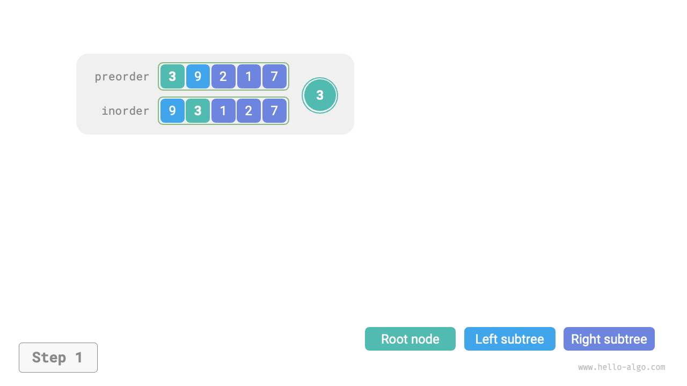{ class="animation-figure" }

=== "<2>"
    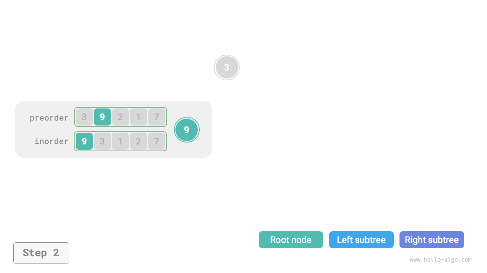{ class="animation-figure" }

=== "<3>"
    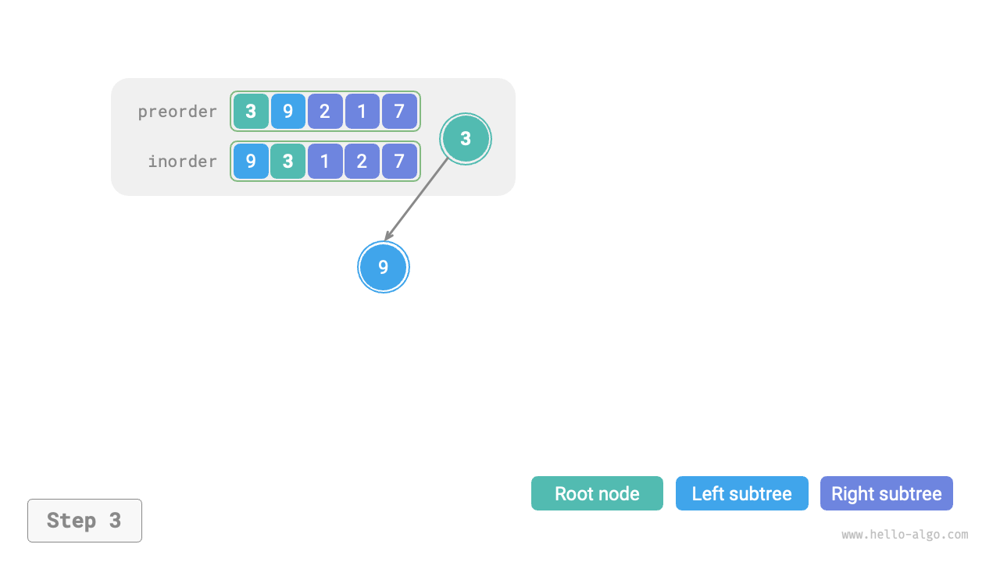{ class="animation-figure" }

=== "<4>"
    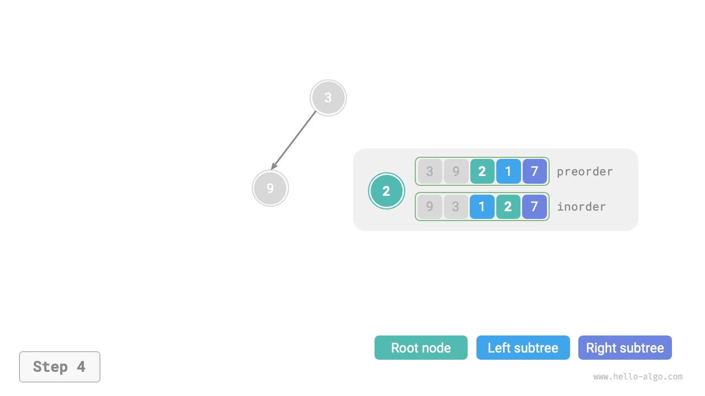{ class="animation-figure" }

=== "<5>"
    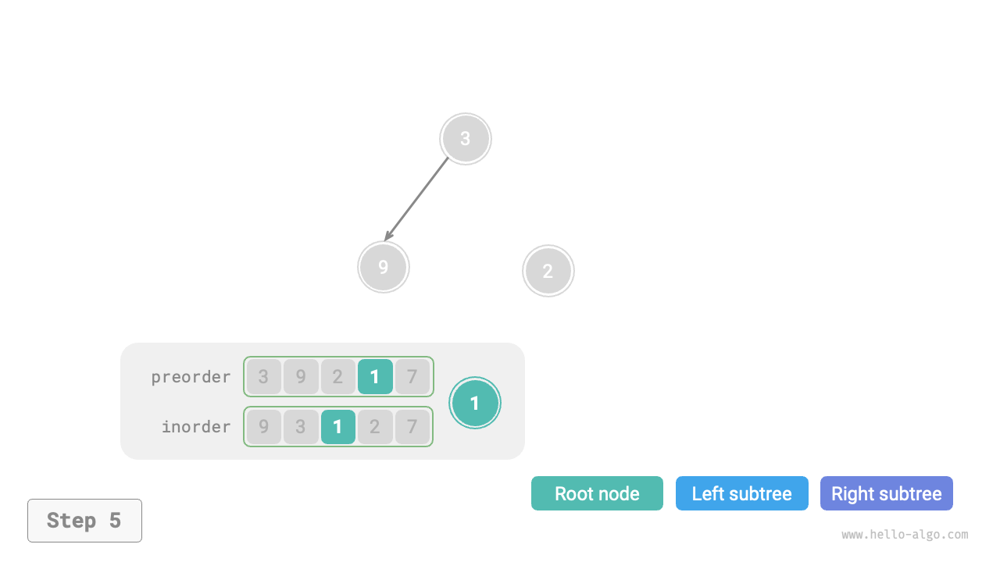{ class="animation-figure" }

=== "<6>"
    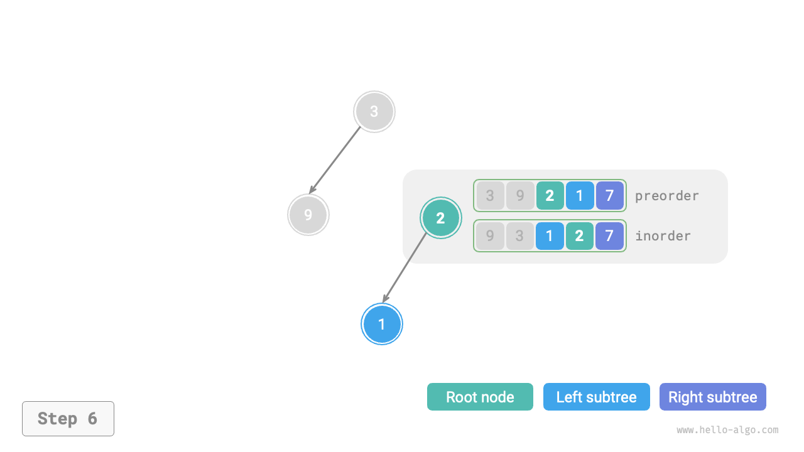{ class="animation-figure" }

=== "<7>"
    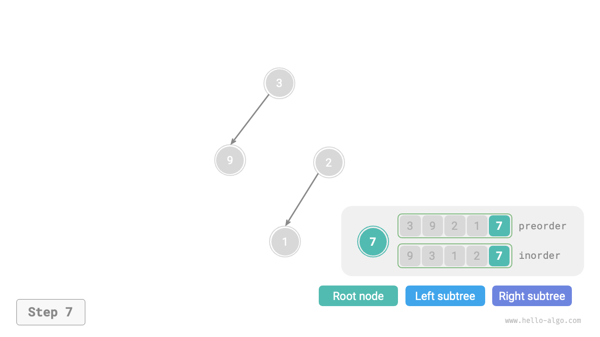{ class="animation-figure" }

=== "<8>"
    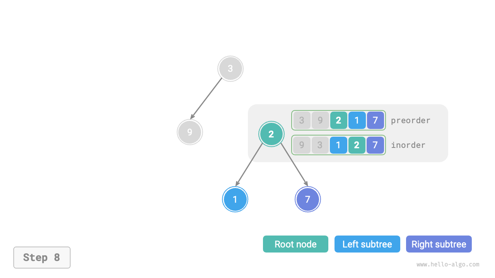{ class="animation-figure" }

=== "<9>"
    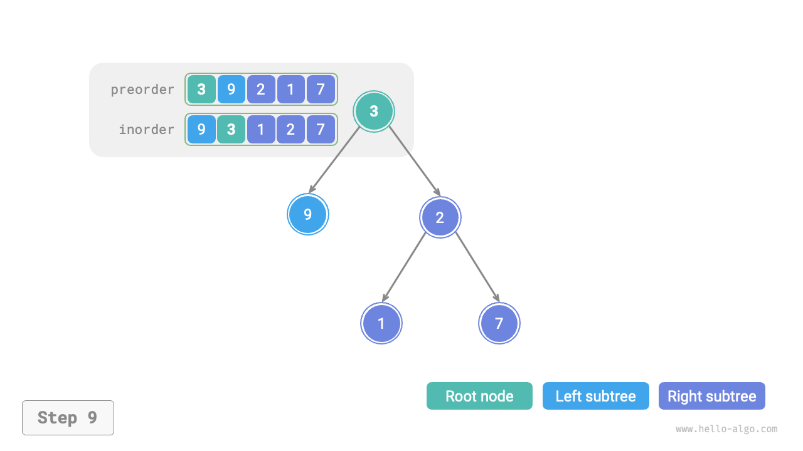{ class="animation-figure" }

<p align="center"> 図 12-8 &nbsp; 二分木を構築する再帰過程 </p>

各再帰関数における前順走査 `preorder` と中順走査 `inorder` の分割結果を下図に示します。

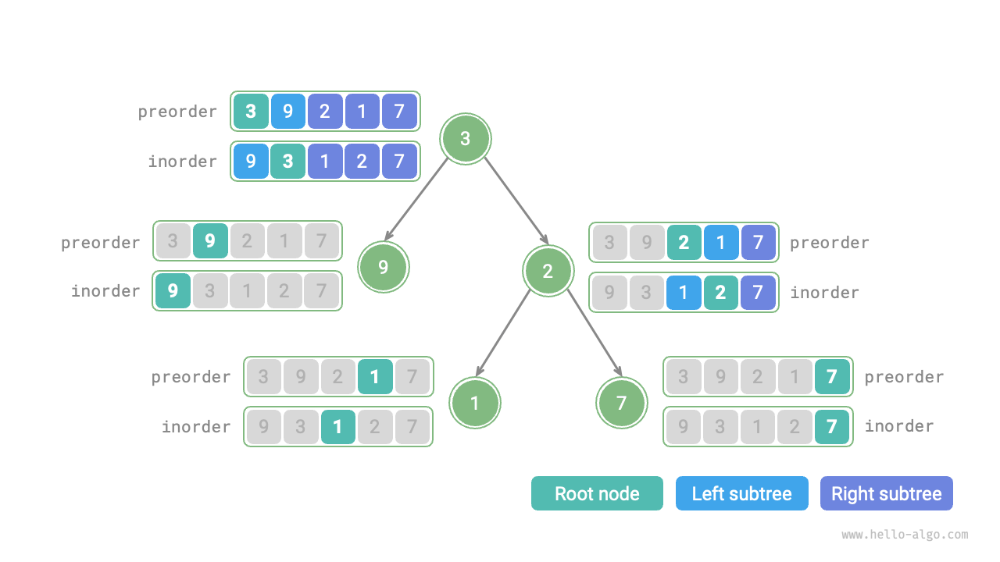{ class="animation-figure" }

<p align="center"> 図 12-9 &nbsp; 各再帰関数での分割結果 </p>

木のノード数を $n$ とすると、各ノードの初期化（再帰関数 `dfs()` の 1 回の実行）には $O(1)$ 時間かかります。**したがって、全体の時間計算量は $O(n)$** です。

ハッシュテーブルには `inorder` の要素からインデックスへの対応を保存するため、空間計算量は $O(n)$ です。最悪の場合、すなわち二分木が連結リストに退化すると、再帰の深さは $n$ に達し、$O(n)$ のスタックフレーム空間を使用します。**したがって、全体の空間計算量は $O(n)$** です。
