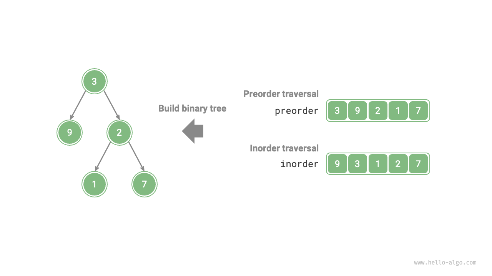

# 二分木構築問題

!!! question

    二分木の前順走査 `preorder` シーケンスと中順走査 `inorder` シーケンスが与えられた場合、二分木を構築してそのルートノードを返してください。二分木に重複するノード値がないと仮定します（以下の図に示すように）。



### 分割統治問題かどうかの判定

`preorder` と `inorder` シーケンスから二分木を構築する元の問題は、典型的な分割統治問題です。

- **問題を分解できる**：分割統治の観点から、元の問題を2つの部分問題（左の部分木の構築と右の部分木の構築）とルートノードの初期化という1つの操作に分割できます。各部分木（部分問題）について、同じアプローチを継続的に適用し、より小さな部分木（部分問題）に分割し、最小の部分問題（空の部分木）に到達するまで続けます。
- **部分問題は独立している**：左と右の部分木は重複しません。左の部分木を構築する際、左の部分木に対応する中順走査と前順走査のセグメントのみが必要です。右の部分木にも同じアプローチが適用されます。
- **部分問題の解を組み合わせることができる**：左と右の部分木（部分問題の解）を構築したら、それらをルートノードに接続して元の問題の解を取得できます。

### 部分木の分割方法

上記の分析に基づいて、この問題は分割統治を使用して解決できます。**しかし、前順走査 `preorder` シーケンスと中順走査 `inorder` シーケンスを使用して左と右の部分木をどのように分割すればよいでしょうか？**

定義により、`preorder` と `inorder` シーケンスの両方を3つの部分に分割できます：

- 前順走査：`[ ルート | 左の部分木 | 右の部分木 ]`。例えば、図では、木は `[ 3 | 9 | 2 1 7 ]` に対応します。
- 中順走査：`[ 左の部分木 | ルート | 右の部分木 ]`。例えば、図では、木は `[ 9 | 3 | 1 2 7 ]` に対応します。

前の図のデータを使用して、次の図に示すステップに従って分割結果を取得できます：

1. 前順走査の最初の要素3がルートノードの値です。
2. `inorder` シーケンス内でルートノード3のインデックスを見つけ、このインデックスを使用して `inorder` を `[ 9 | 3 ｜ 1 2 7 ]` に分割します。
3. `inorder` シーケンスの分割に従って、左と右の部分木がそれぞれ1個と3個のノードを含むことが簡単に決定できるため、`preorder` シーケンスを `[ 3 | 9 | 2 1 7 ]` に対応して分割できます。


### 変数に基づく部分木範囲の記述

上記の分割方法に基づいて、**`preorder` と `inorder` シーケンスにおけるルート、左の部分木、右の部分木のインデックス範囲を取得しました**。これらのインデックス範囲を記述するために、いくつかのポインタ変数を使用します。

- 現在の木のルートノードの `preorder` シーケンスでのインデックスを $i$ とします。
- 現在の木のルートノードの `inorder` シーケンスでのインデックスを $m$ とします。
- 現在の木の `inorder` シーケンスでのインデックス範囲を $[l, r]$ とします。

以下の表に示すように、これらの変数は `preorder` シーケンスでのルートノードのインデックスと `inorder` シーケンスでの部分木のインデックス範囲を表します。

<p align="center"> 表 <id> &nbsp; 前順走査と中順走査でのルートノードと部分木のインデックス </p>

|               | `preorder` でのルートノードインデックス | `inorder` での部分木インデックス範囲 |
| ------------- | ------------------------------------- | ----------------------------------- |
| 現在の木      | $i$                                   | $[l, r]$                            |
| 左の部分木    | $i + 1$                               | $[l, m-1]$                          |
| 右の部分木    | $i + 1 + (m - l)$                     | $[m+1, r]$                          |

右の部分木のルートインデックスの $(m-l)$ は「左の部分木のノード数」を表すことに注意してください。より明確な理解のために、以下の図を参照することが役立つ場合があります。


### コード実装

$m$ の問い合わせの効率を向上させるために、ハッシュテーブル `hmap` を使用して `inorder` シーケンスの要素からそのインデックスへのマッピングを格納します：

```src
[file]{build_tree}-[class]{}-[func]{build_tree}
```

以下の図は、二分木を構築する再帰過程を示しています。各ノードは再帰の「下降」段階で作成され、各エッジ（参照）は「上昇」段階で形成されます。

=== "<1>"
    

=== "<2>"
    

=== "<3>"
    

=== "<4>"
    

=== "<5>"
    

=== "<6>"
    

=== "<7>"
    

=== "<8>"
    

=== "<9>"
    

各再帰関数の `preorder` と `inorder` シーケンスの分割は以下の図に示されています。


二分木が $n$ 個のノードを持つと仮定すると、各ノードの初期化（再帰関数 `dfs()` の呼び出し）には $O(1)$ 時間がかかります。**したがって、全体の時間計算量は $O(n)$ です**。

ハッシュテーブルは `inorder` 要素からそのインデックスへのマッピングを格納するため、$O(n)$ スペースが必要です。最悪の場合、二分木が連結リストに退化すると、再帰の深さは $n$ に達し、$O(n)$ のスタックスペースを消費する可能性があります。**したがって、全体の空間計算量は $O(n)$ です**。
