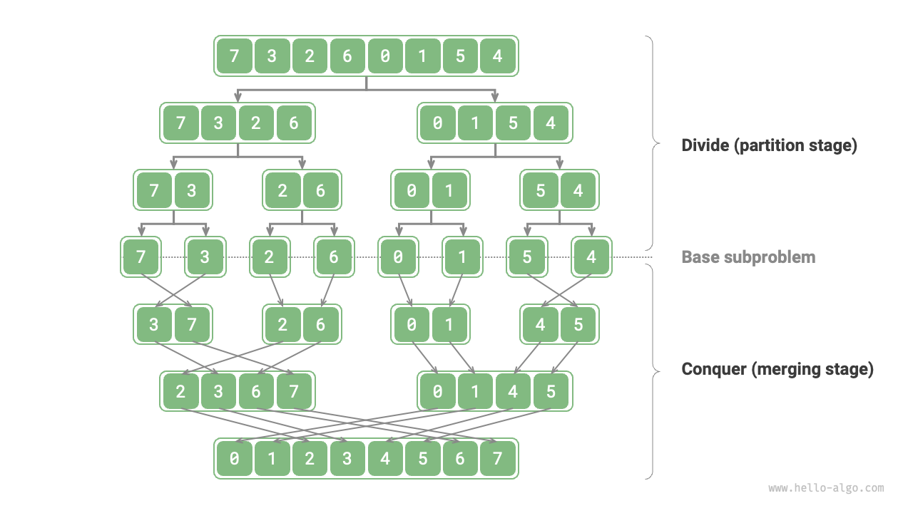
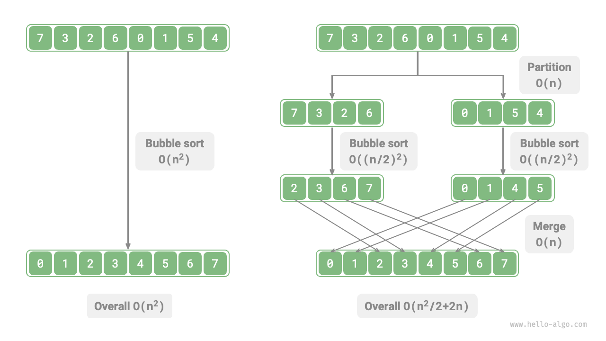
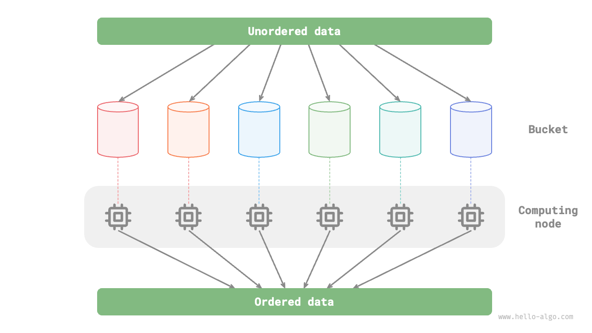

# 分割統治アルゴリズム

<u>分割統治</u>は重要で人気のあるアルゴリズム戦略です。名前が示すように、アルゴリズムは通常再帰的に実装され、「分割」と「統治」の2つのステップから構成されます。

1. **分割（分割段階）**：元の問題を再帰的に2つ以上の小さな部分問題に分解し、最小の部分問題に到達するまで続けます。
2. **統治（マージ段階）**：解決方法が既知の最小の部分問題から開始し、部分問題の解をボトムアップ方式でマージして元の問題の解を構築します。

以下の図に示すように、「マージソート」は分割統治戦略の典型的な応用の一つです。

1. **分割**：元の配列（元の問題）を再帰的に2つの副配列（部分問題）に分割し、副配列が1つの要素のみになるまで（最小の部分問題）続けます。
2. **統治**：順序付けられた副配列（部分問題の解）をボトムアップでマージして、順序付けられた元の配列（元の問題の解）を取得します。

## 分割統治問題を特定する方法

問題が分割統治解決に適しているかどうかは、通常以下の基準に基づいて決定できます。

1. **問題をより小さなものに分解できる**：元の問題をより小さく類似した部分問題に分割でき、そのような過程を同じ方法で再帰的に実行できます。
2. **部分問題は独立している**：部分問題間に重複がなく、独立しており、個別に解決できます。
3. **部分問題の解をマージできる**：元の問題の解は、部分問題の解を組み合わせることで導出されます。

明らかに、マージソートはこれら3つの基準を満たしています。

1. **問題をより小さなものに分解できる**：配列（元の問題）を再帰的に2つの副配列（部分問題）に分割します。
2. **部分問題は独立している**：各副配列は独立してソートできます（部分問題は独立して解決できます）。
3. **部分問題の解をマージできる**：2つの順序付けられた副配列（部分問題の解）を1つの順序付けられた配列（元の問題の解）にマージできます。

## 分割統治による効率の向上

**分割統治戦略はアルゴリズム問題を効果的に解決するだけでなく、しばしば効率を向上させます**。ソートアルゴリズムでは、クイックソート、マージソート、ヒープソートは、分割統治戦略を適用しているため、選択ソート、バブルソート、挿入ソートよりも高速です。

私たちの心には疑問があるかもしれません：**なぜ分割統治はアルゴリズムの効率を向上させることができ、その根本的な論理は何ですか？** つまり、問題を部分問題に分解し、それらを解決し、それらの解を組み合わせて元の問題に対処することが、元の問題を直接解決するよりも効率的である理由は何ですか？この質問は2つの側面から分析できます：操作数と並列計算。

### 操作数の最適化

「バブルソート」を例にとると、長さ $n$ の配列を処理するのに $O(n^2)$ 時間が必要です。以下の図に示すように、配列を中点から2つの副配列に分割するとします。そのような分割には $O(n)$ 時間が必要です。各副配列のソートには $O((n / 2)^2)$ 時間が必要です。そして2つの副配列のマージには $O(n)$ 時間が必要です。したがって、全体の時間計算量は：

$$
O(n + (\frac{n}{2})^2 \times 2 + n) = O(\frac{n^2}{2} + 2n)
$$

以下の不等式を計算してみましょう。左側は分割前の総操作数を表し、右側は分割後の総操作数をそれぞれ表します：

$$
\begin{aligned}
n^2 & > \frac{n^2}{2} + 2n \newline
n^2 - \frac{n^2}{2} - 2n & > 0 \newline
n(n - 4) & > 0
\end{aligned}
$$

**これは $n > 4$ の場合、分割後の操作数が少なく、より良いパフォーマンスにつながることを意味します**。分割後の時間計算量は依然として二次 $O(n^2)$ ですが、計算量の定数係数が減少していることに注意してください。

さらに進むことができます。**副配列をその中点からさらに2つの副配列に分割し続けて、副配列が1つの要素のみになるまで続けたらどうでしょうか？** このアイデアは実際には「マージソート」で、時間計算量は $O(n \log n)$ です。

少し違うことを試してみましょう。**2つではなく、より多くの分割に分割したらどうでしょうか？** 例えば、元の配列を $k$ 個の副配列に均等に分割しますか？このアプローチは「バケットソート」と非常に似ており、大量のデータのソートに非常に適しています。理論的には、時間計算量は $O(n + k)$ に達することができます。

### 並列計算による最適化

分割統治によって生成される部分問題は互いに独立していることが分かっています。**これは、それらを並列で解決できることを意味します。** その結果、分割統治はアルゴリズムの時間計算量を減らすだけでなく、**現代のオペレーティングシステムによる並列最適化も促進します。**

並列最適化は、複数のコアやプロセッサを持つ環境で特に効果的です。システムが複数の部分問題を同時に処理できるため、計算リソースを完全に活用し、全体的な実行時間が大幅に短縮されます。

例えば、以下の図に示す「バケットソート」では、大量のデータを様々なバケットに均等に分解します。各バケットのソート作業は、利用可能な計算ユニットに割り当てることができます。すべての作業が完了すると、すべてのソートされたバケットがマージされて最終結果が生成されます。

## 分割統治の一般的な応用

分割統治は多くの古典的なアルゴリズム問題を解決するために使用できます。

- **最近点対の発見**：このアルゴリズムは点の集合を2つの半分に分割することで動作します。そして各半分で再帰的に最近点対を見つけます。最後に、2つの半分にまたがるペアを考慮して、全体の最近点対を見つけます。
- **大整数の乗算**：一つのアルゴリズムはKaratsubaと呼ばれます。大整数の乗算をいくつかの小さな整数の乗算と加算に分解します。
- **行列の乗算**：一例はStrassenアルゴリズムです。大きな行列の乗算を複数の小さな行列の乗算と加算に分解します。
- **ハノイの塔問題**：ハノイの塔問題は再帰的に解決でき、分割統治戦略の典型的な応用です。
- **転倒対の解決**：シーケンスで、前の数が後の数より大きい場合、これら2つの数は転倒対を構成します。転倒対問題の解決は、マージソートの助けを借りて、分割統治のアイデアを利用できます。

分割統治はアルゴリズムとデータ構造の設計にも広く応用されています。

- **二分探索**：二分探索は、ソート済み配列を中点インデックスから2つの半分に分割します。そして、ターゲット値と中間要素値の比較結果に基づいて、一方の半分が破棄されます。同じプロセスで残りの半分で検索が続行され、ターゲットが見つかるか残りの要素がなくなるまで続きます。
- **マージソート**：この節の冒頭ですでに紹介したため、さらなる詳述は不要です。
- **クイックソート**：クイックソートはピボット値を選択して配列を2つの副配列に分割し、一方はピボットより小さい要素、もう一方はピボットより大きい要素を持ちます。このプロセスは、これら2つの副配列のそれぞれに対して、1つの要素のみを保持するまで続きます。
- **バケットソート**：バケットソートの基本的なアイデアは、データを複数のバケットに分散させることです。各バケット内の要素をソートした後、バケットから順序よく要素を取得して順序付けられた配列を取得します。
- **木**：例えば、二分探索木、AVL木、赤黒木、B木、B+木など。その操作（検索、挿入、削除）はすべて分割統治戦略の応用と見なすことができます。
- **ヒープ**：ヒープは特別なタイプの完全二分木です。その様々な操作（挿入、削除、ヒープ化）は、実際に分割統治のアイデアを含意しています。
- **ハッシュテーブル**：ハッシュテーブルは直接分割統治を適用しませんが、一部のハッシュ衝突解決ソリューションは間接的にこの戦略を適用します。例えば、チェイン法の長いリストは、クエリ効率を向上させるために赤黒木に変換される場合があります。

**分割統治は巧妙に浸透するアルゴリズムアイデア**であり、様々なアルゴリズムとデータ構造に組み込まれていることが分かります。
