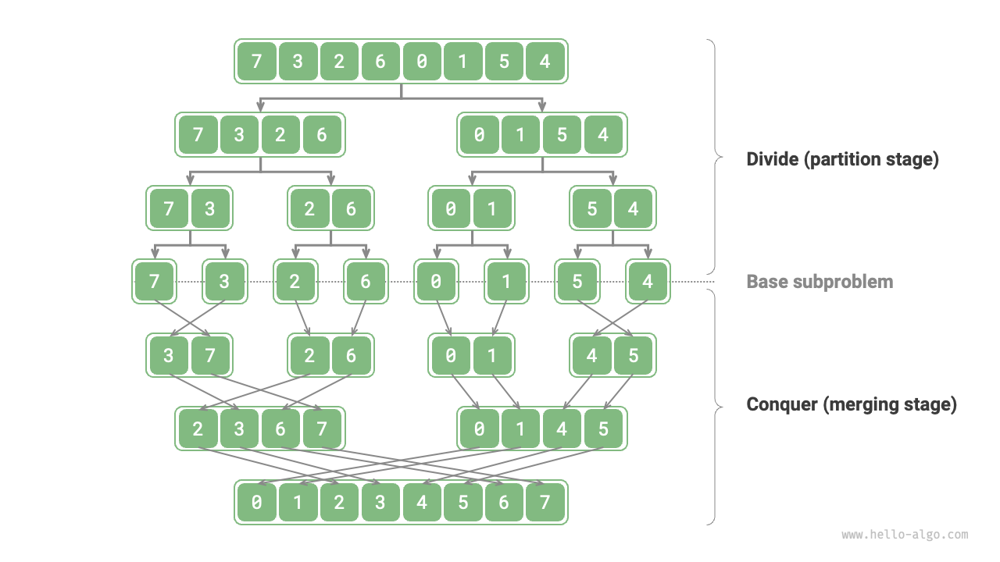
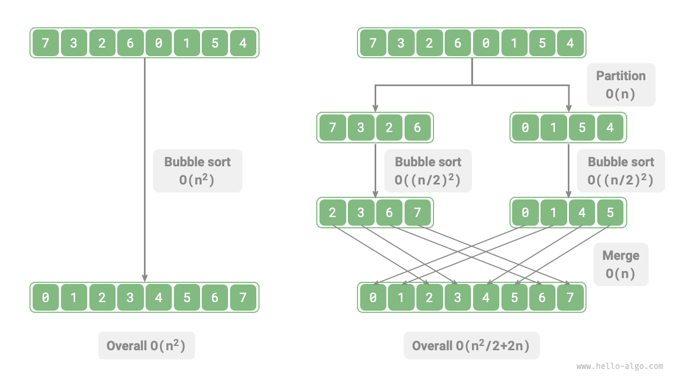
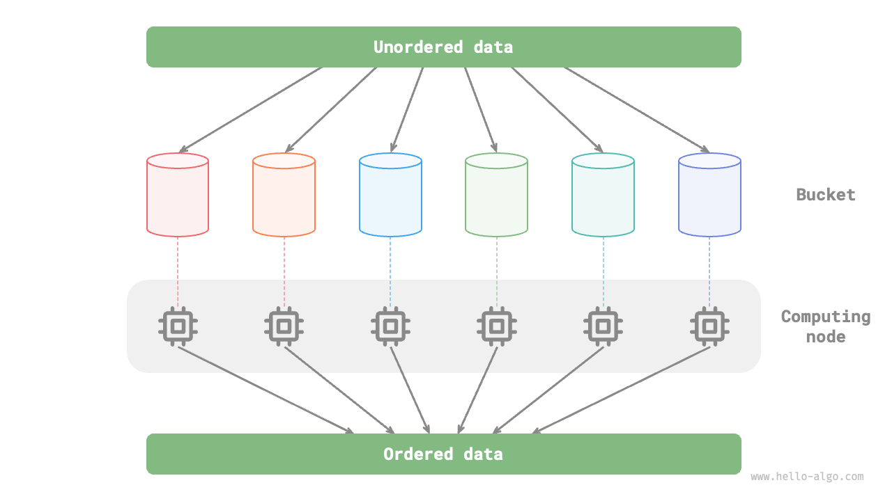

# 12.1 &nbsp; 分割統治法

<u>分割統治法（divide and conquer）</u>は、問題を分けて統べるという意味であり、非常に重要で一般的なアルゴリズム戦略です。分割統治法は通常、再帰に基づいて実装され、「分」と「治」の 2 つのステップから構成されます。

1. **分（分割段階）**：元の問題を 2 つ以上の部分問題へ再帰的に分解し、最小の部分問題に到達した時点で停止します。
2. **治（統合段階）**：解が既知である最小の部分問題から始めて、部分問題の解を下から上へ統合し、元の問題の解を構築します。

以下の図に示すように、「マージソート」は分割統治戦略の典型的な応用の一つです。

1. **分**：元の配列（元の問題）を 2 つの部分配列（部分問題）へ再帰的に分割し、部分配列に要素が 1 つだけ残るまで続けます。
2. **治**：整列済みの部分配列（部分問題の解）を下から上へ統合し、整列済みの元の配列（元の問題の解）を得ます。

{ class="animation-figure" }

 図 12-1 &nbsp; マージソートの分割統治戦略 

## 12.1.1 &nbsp; 分割統治法の問題を見極めるには

ある問題が分割統治法で解くのに適しているかどうかは、通常、次の判断基準を参考にできます。

1. **問題は分解できる**：元の問題は、より小さく類似した部分問題に分解でき、同じ方法で再帰的に分割できます。
2. **部分問題は独立している**：部分問題同士に重複がなく、相互依存もないため、独立して解決できます。
3. **部分問題の解は統合できる**：元の問題の解は、部分問題の解を統合することで得られます。

明らかに、マージソートは以上の 3 つの判断基準を満たしています。

1. **問題は分解できる**：配列（元の問題）を 2 つの部分配列（部分問題）へ再帰的に分割します。
2. **部分問題は独立している**：各部分配列は独立にソートできます（部分問題は独立に解けます）。
3. **部分問題の解は統合できる**：2 つの整列済み部分配列（部分問題の解）は、1 つの整列済み配列（元の問題の解）に統合できます。

## 12.1.2 &nbsp; 分割統治法で効率を高める

**分割統治法はアルゴリズムの問題を効果的に解けるだけでなく、多くの場合アルゴリズムの効率も高められます**。ソートアルゴリズムでは、クイックソート、マージソート、ヒープソートが選択ソート、バブルソート、挿入ソートより高速ですが、これは分割統治戦略を適用しているためです。

ここで次の疑問が生じます。**なぜ分割統治法はアルゴリズム効率を高められるのでしょうか。その根本的な仕組みは何でしょうか**？言い換えると、大きな問題を複数の部分問題に分解し、部分問題を解き、それらの解を統合して元の問題の解にするという手順は、なぜ元の問題を直接解くより効率的なのでしょうか。この問題は、操作回数と並列計算の 2 つの観点から議論できます。

### 1. &nbsp; 操作回数の最適化

「バブルソート」を例に取ると、長さ $n$ の配列を処理するのに $O(n^2)$ の時間がかかります。以下の図のように、配列を中央で 2 つの部分配列に分けると仮定すると、分割には $O(n)$ の時間、各部分配列のソートには $O((n / 2)^2)$ の時間、2 つの部分配列の統合には $O(n)$ の時間が必要で、全体の時間計算量は次のようになります：

$$
O(n + (\frac{n}{2})^2 \times 2 + n) = O(\frac{n^2}{2} + 2n)
$$

{ class="animation-figure" }

 図 12-2 &nbsp; 配列分割前後のバブルソート 

次に、以下の不等式を計算します。左辺と右辺はそれぞれ、分割前と分割後の操作総数です：

$$
\begin{aligned}
n^2 & > \frac{n^2}{2} + 2n \newline
n^2 - \frac{n^2}{2} - 2n & > 0 \newline
n(n - 4) & > 0
\end{aligned}
$$

**これは、$n > 4$ のときに分割後の操作回数の方が少なくなり、ソート効率が高くなることを意味します**。ただし、分割後の時間計算量は依然として 2 次の $O(n^2)$ であり、計算量の定数項が小さくなっただけです。

さらに考えると、**部分配列を中央からさらに 2 つの部分配列へと分割し続け**、部分配列に要素が 1 つだけ残るまで分割を止めないとしたらどうでしょうか。この考え方がまさに「マージソート」であり、時間計算量は $O(n \log n)$ です。

さらに、**分割点をいくつか増やして**、元の配列を平均的に $k$ 個の部分配列に分けるとしたらどうでしょうか。この状況は「バケットソート」と非常によく似ており、大量データのソートに非常に適しています。理論上の時間計算量は $O(n + k)$ に達します。

### 2. &nbsp; 並列計算の最適化

分割統治法で生成される部分問題は互いに独立しているため、**通常は並列に解くことができます**。つまり、分割統治法はアルゴリズムの時間計算量を下げられるだけでなく、**オペレーティングシステムの並列最適化にも有利です**。

並列最適化は、マルチコアまたはマルチプロセッサ環境で特に有効です。システムが複数の部分問題を同時に処理でき、計算資源をより十分に活用できるため、全体の実行時間を大幅に短縮できます。

たとえば、以下の図に示す「バケットソート」では、大量のデータを各バケットに均等に割り当てることで、すべてのバケットのソート処理を各計算ユニットに分散し、完了後に結果を統合できます。

{ class="animation-figure" }

 図 12-3 &nbsp; バケットソートの並列計算 

## 12.1.3 &nbsp; 分割統治法の代表的な応用

一方では、分割統治法は多くの古典的なアルゴリズム問題を解くのに使えます。

- **最近点対探索**：このアルゴリズムは、まず点集合を 2 つに分け、それぞれの部分における最近点対を求め、最後に 2 つの部分をまたぐ最近点対を求めます。
- **大整数乗算**：たとえば Karatsuba 法では、大整数の乗算を、より小さな整数どうしのいくつかの乗算と加算に分解します。
- **行列乗算**：たとえば Strassen 法では、大きな行列の乗算を、複数の小さな行列の乗算と加算に分解します。
- **ハノイの塔問題**：ハノイの塔問題は再帰によって解くことができ、これは典型的な分割統治戦略の応用です。
- **反転対の計算**：ある数列で前の数が後ろの数より大きい場合、その 2 つの数は反転対を構成します。反転対の問題は、分割統治の考え方を利用し、マージソートを用いて解けます。

他方で、分割統治法はアルゴリズムとデータ構造の設計にも非常に広く応用されています。

- **二分探索**：二分探索では、整列済み配列を中央のインデックスで 2 つに分け、目標値と中央要素の比較結果に基づいてどちらの半区間を除外するかを決め、残った区間で同じ二分操作を行います。
- **マージソート**：本節の冒頭で紹介したため、ここでは繰り返しません。
- **クイックソート**：クイックソートは基準値を 1 つ選び、配列を、基準値より小さい要素の部分配列と、基準値より大きい要素の部分配列に分け、その後それぞれに対して同じ分割操作を行い、部分配列に要素が 1 つだけ残るまで続けます。
- **バケットソート**：バケットソートの基本的な考え方は、データを複数のバケットに分散し、各バケット内の要素をソートしたうえで、各バケットの要素を順に取り出して整列済み配列を得ることです。
- **木構造**：たとえば二分探索木、AVL 木、赤黒木、B 木、B+ 木などでは、探索・挿入・削除などの操作をいずれも分割統治戦略の応用とみなせます。
- **ヒープ**：ヒープは特殊な完全二分木であり、挿入、削除、ヒープ化などの各種操作には、実際には分割統治の考え方が含まれています。
- **ハッシュテーブル**：ハッシュテーブル自体は分割統治を直接適用しているわけではありませんが、いくつかのハッシュ衝突解決法では間接的に分割統治戦略が使われています。たとえば、連鎖アドレス法における長い連結リストは、検索効率を高めるために赤黒木へ変換されます。

このように、**分割統治法は「静かに物を潤す」ようなアルゴリズム思想**であり、さまざまなアルゴリズムやデータ構造の中に潜んでいます。
