# ハノイの塔問題

マージソートと二分木構築の両方で、元の問題を2つの部分問題に分解し、それぞれが元の問題のサイズの半分でした。しかし、ハノイの塔では、異なる分解戦略を採用します。

!!! question

    3つの柱があり、それぞれ `A`、`B`、`C` と表記されます。最初、柱 `A` には $n$ 枚の円盤があり、上から下に向かって昇順のサイズで配置されています。私たちのタスクは、これらの $n$ 枚の円盤を柱 `C` に移動し、元の順序を維持することです（以下の図に示すように）。移動中には以下のルールが適用されます：

    1. 円盤は柱の上部からのみ取り除くことができ、別の柱の上部に置く必要があります。
    2. 一度に移動できるのは1枚の円盤のみです。
    3. 小さい円盤は常に大きい円盤の上にある必要があります。

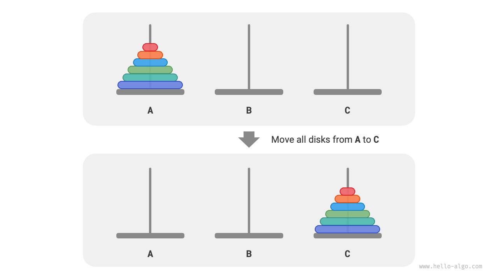

**サイズ $i$ のハノイの塔問題を $f(i)$ と表記します**。例えば、$f(3)$ は3枚の円盤を柱 `A` から柱 `C` に移動することを表します。

### 基本ケースを考える

以下の図に示すように、問題 $f(1)$（円盤が1枚のみ）については、`A` から `C` に直接移動できます。

=== "<1>"
    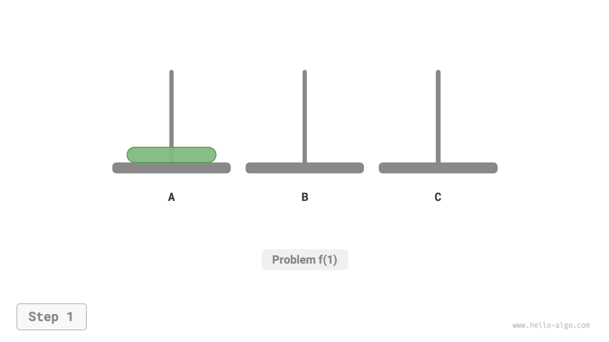

=== "<2>"
    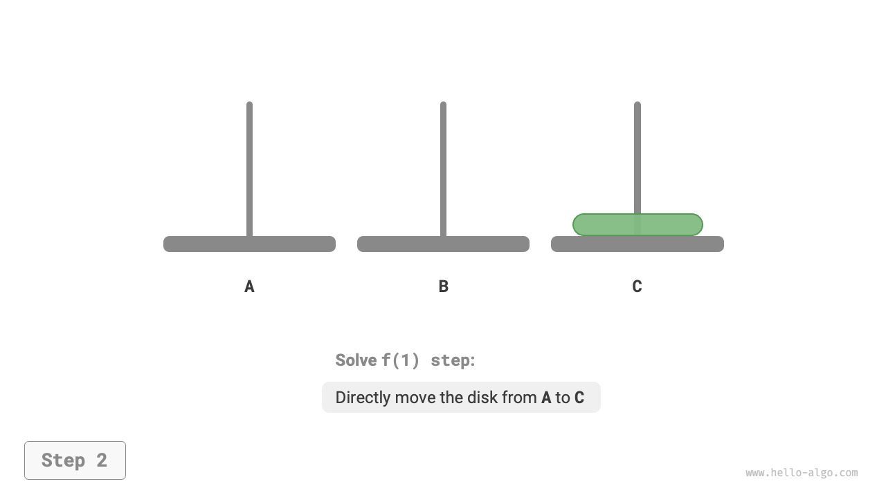

$f(2)$（円盤が2枚）については、**柱 `B` の助けを借りて小さい円盤を大きい円盤の上に保つ**必要があります。以下の図に示すように：

1. まず、小さい円盤を `A` から `B` に移動します。
2. 次に、大きい円盤を `A` から `C` に移動します。
3. 最後に、小さい円盤を `B` から `C` に移動します。

=== "<1>"
    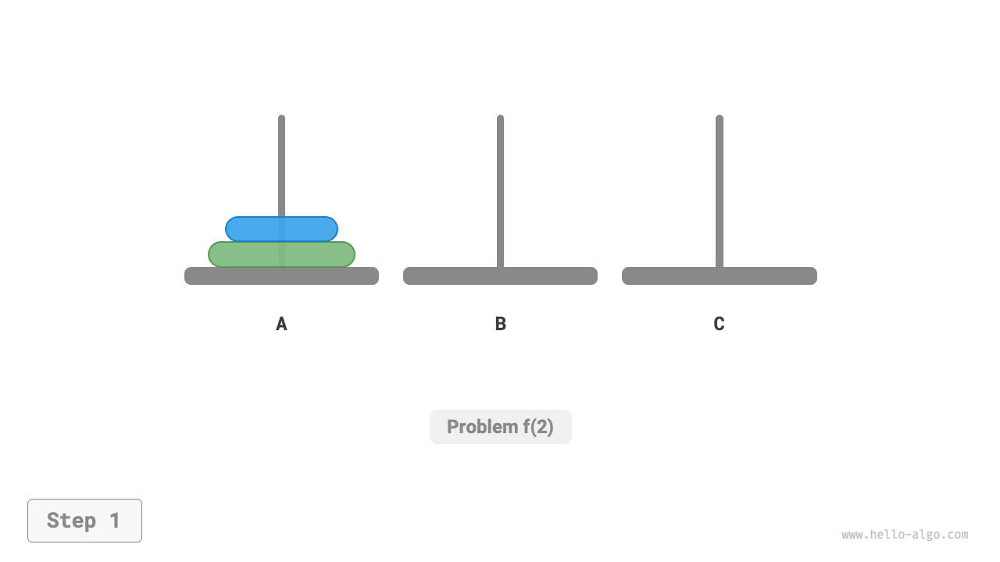

=== "<2>"
    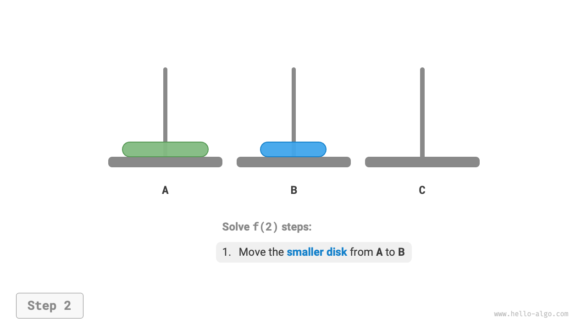

=== "<3>"
    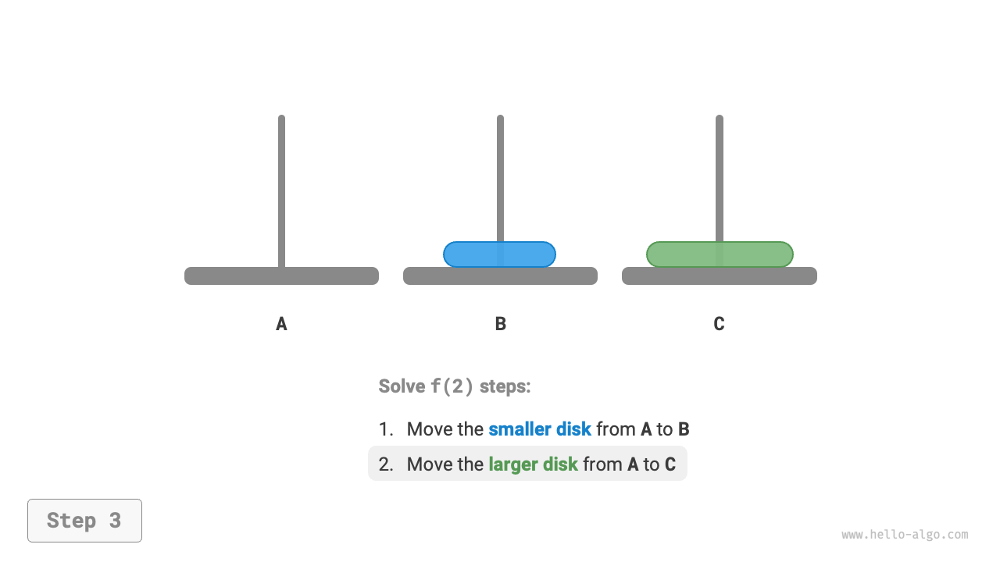

=== "<4>"
    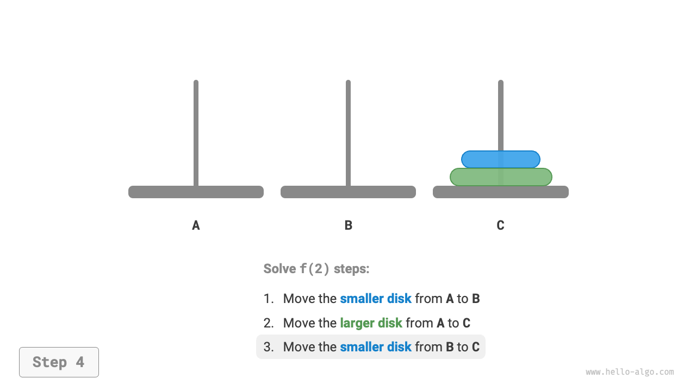

$f(2)$ を解決する過程は次のように要約できます：**`B` の助けを借りて2枚の円盤を `A` から `C` に移動する**。ここで、`C` をターゲット柱、`B` をバッファ柱と呼びます。

### 部分問題の分解

問題 $f(3)$（つまり、円盤が3枚の場合）については、状況がやや複雑になります。

すでに $f(1)$ と $f(2)$ の解が分かっているので、分割統治の観点を採用し、**`A` の上の2枚の円盤を1つの単位として扱い**、以下の図に示すステップを実行できます。これにより、3枚の円盤を `A` から `C` に正常に移動できます。

1. `B` をターゲット柱、`C` をバッファ柱として、2枚の円盤を `A` から `B` に移動します。
2. 残りの円盤を `A` から直接 `C` に移動します。
3. `C` をターゲット柱、`A` をバッファ柱として、2枚の円盤を `B` から `C` に移動します。

=== "<1>"
    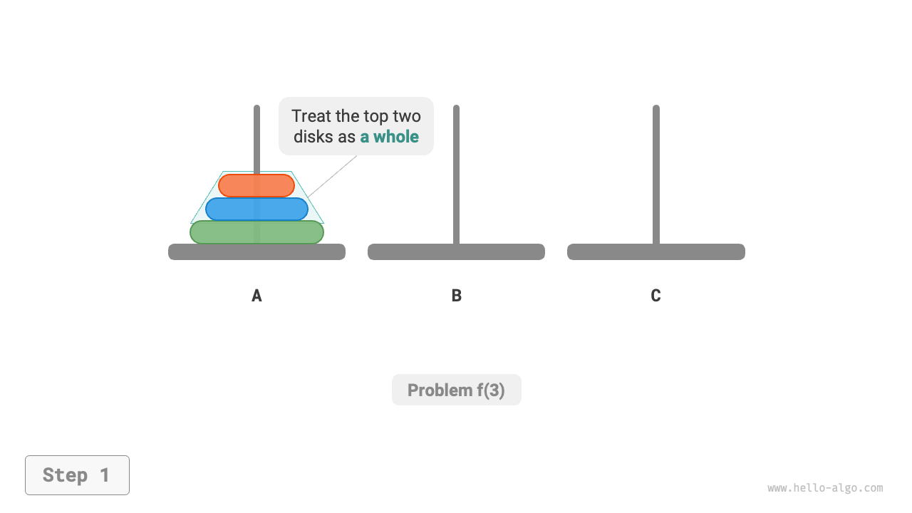

=== "<2>"
    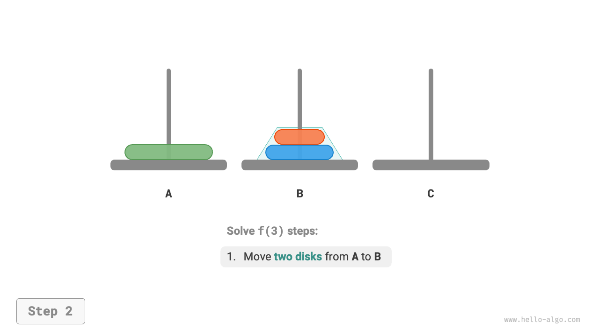

=== "<3>"
    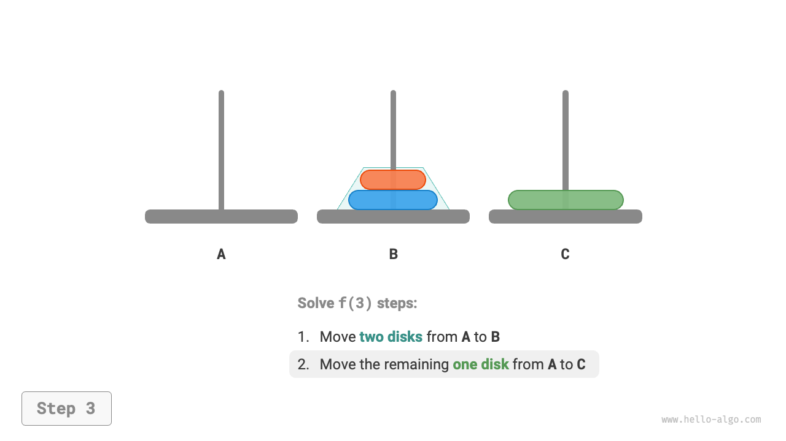

=== "<4>"
    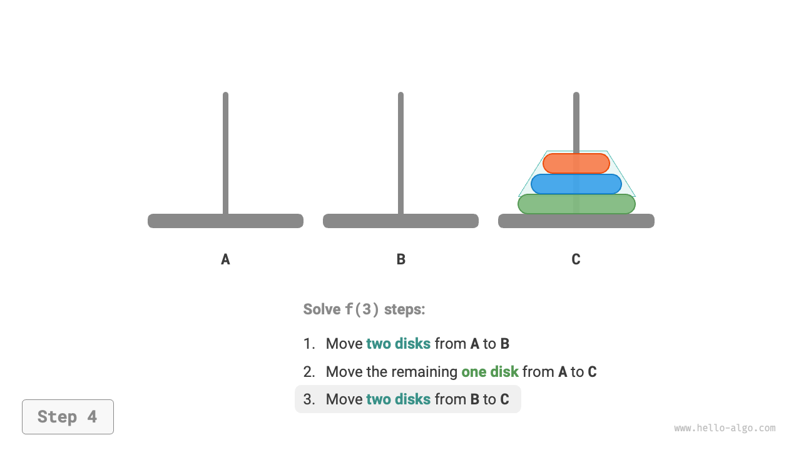

本質的に、**$f(3)$ を2つの $f(2)$ 部分問題と1つの $f(1)$ 部分問題に分解します**。これら3つの部分問題を順次解決することで、元の問題が解決され、部分問題が独立しており、それらの解をマージできることを示しています。

ここから、以下の図に示すハノイの塔の分割統治戦略を要約できます。元の問題 $f(n)$ を2つの部分問題 $f(n-1)$ と1つの部分問題 $f(1)$ に分割し、以下の順序でこれら3つの部分問題を解決します：

1. `C` をバッファとして使用し、$n-1$ 枚の円盤を `A` から `B` に移動します。
2. 残りの円盤を `A` から直接 `C` に移動します。
3. `A` をバッファとして使用し、$n-1$ 枚の円盤を `B` から `C` に移動します。

各 $f(n-1)$ 部分問題について、**同じ再帰分割を適用でき**、最小の部分問題 $f(1)$ に到達するまで続けます。$f(1)$ は単一の移動のみが必要であることがすでに分かっているため、解決するのは簡単です。

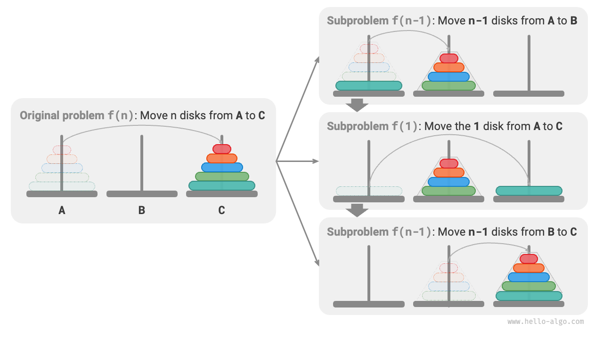

### コード実装

コードでは、再帰関数 `dfs(i, src, buf, tar)` を定義します。これは柱 `src` から上の $i$ 枚の円盤を柱 `tar` に移動し、柱 `buf` をバッファとして使用します：

```src
[file]{hanota}-[class]{}-[func]{solve_hanota}
```

以下の図に示すように、ハノイの塔問題は高さ $n$ の再帰木として視覚化できます。各ノードは部分問題を表し、`dfs()` の呼び出しに対応します。**したがって、時間計算量は $O(2^n)$、空間計算量は $O(n)$ です。**

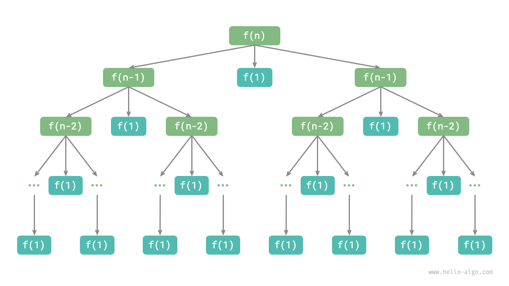

!!! quote

    ハノイの塔は古代の伝説に由来します。古代インドの寺院で、僧侶たちは3本の高いダイヤモンドの柱と、異なるサイズの $64$ 枚の金の円盤を持っていました。彼らは、最後の円盤が正しく置かれたとき、世界が終わると信じていました。

    しかし、僧侶たちが1秒に1枚の円盤を移動したとしても、約 $2^{64} \approx 1.84×10^{19}$ —約5850億年—かかり、宇宙の年齢の現在の推定をはるかに超えています。したがって、この伝説が真実であれば、世界の終わりについて心配する必要はおそらくないでしょう。
