# ハノイの塔の問題

マージソートや二分木の構築では、いずれも元の問題を元問題の半分の規模をもつ 2 つの部分問題に分解していました。しかし、ハノイの塔の問題では、異なる分解戦略を採用します。

!!! question

    3 本の柱があり、それぞれを `A`、`B`、`C` とします。初期状態では、柱 `A` に $n$ 枚の円盤が通されており、上から下へ小さい順に並んでいます。私たちの課題は、この $n$ 枚の円盤を柱 `C` に移し、元の順序を保つことです（以下の図のとおり）。円盤を移動する際には、次のルールに従う必要があります。
    
    1. 円盤は 1 本の柱の頂上から取り出し、別の柱の頂上に置くことしかできません。
    2. 1 回に移動できる円盤は 1 枚だけです。
    3. 小さい円盤は常に大きい円盤の上になければなりません。

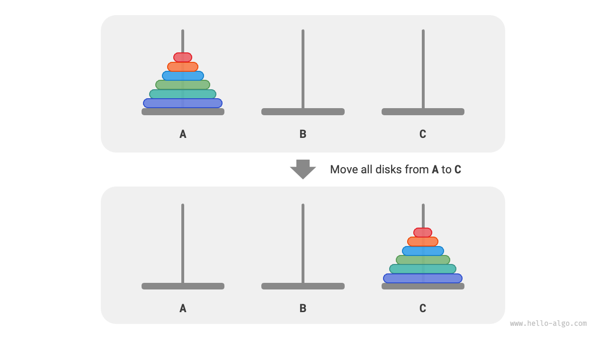

**規模が $i$ のハノイの塔の問題を $f(i)$ と表します** 。たとえば $f(3)$ は、$3$ 枚の円盤を `A` から `C` へ移動するハノイの塔の問題を表します。

### 基本ケースを考える

以下の図に示すように、問題 $f(1)$ 、すなわち円盤が 1 枚だけの場合は、それを `A` から `C` へ直接移動すれば済みます。

=== "<1>"
    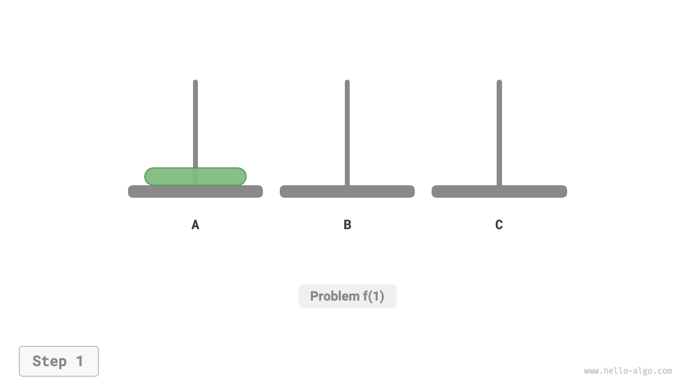

=== "<2>"
    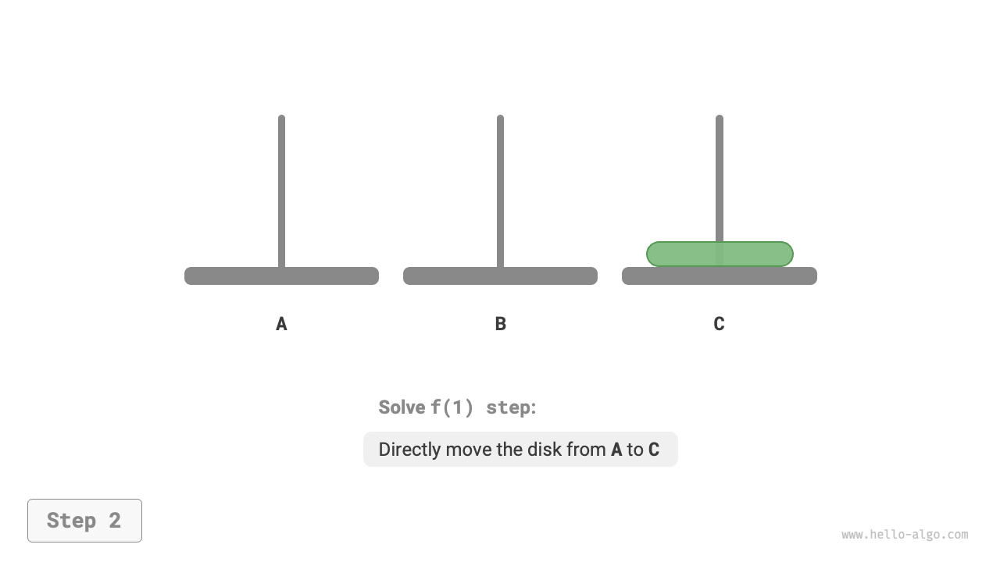

以下の図に示すように、問題 $f(2)$ 、すなわち円盤が 2 枚ある場合は、**小さい円盤が常に大きい円盤の上にある条件を満たすため、`B` を借りて移動を行う必要があります**。

1. まず上の小さい円盤を `A` から `B` へ移します。
2. 次に大きい円盤を `A` から `C` へ移します。
3. 最後に小さい円盤を `B` から `C` へ移します。

=== "<1>"
    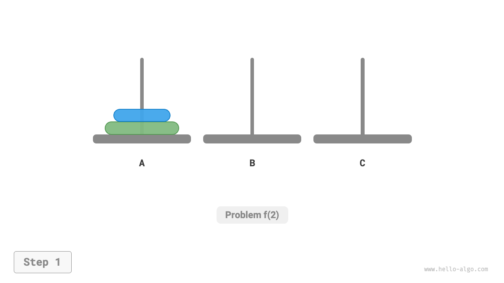

=== "<2>"
    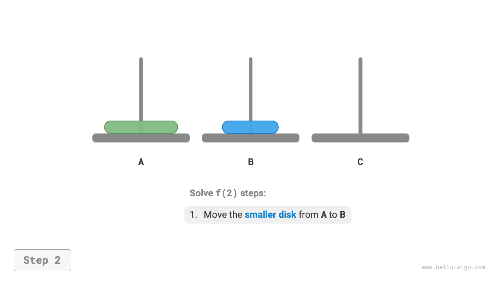

=== "<3>"
    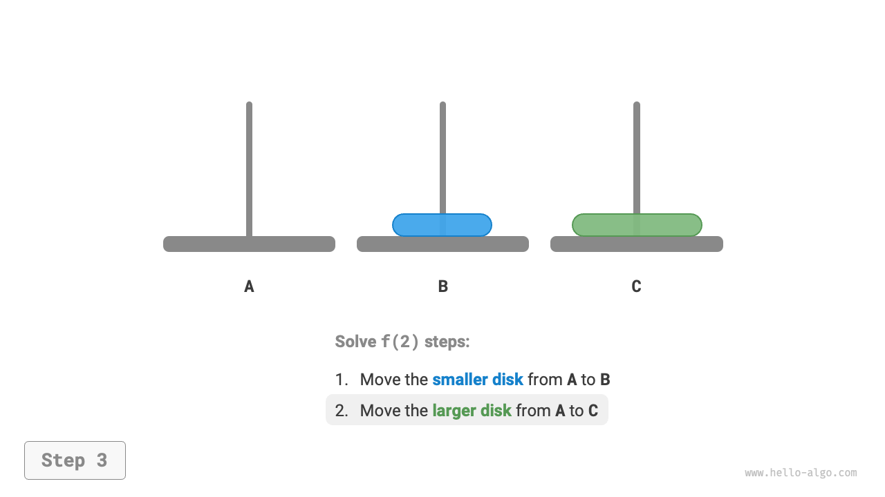

=== "<4>"
    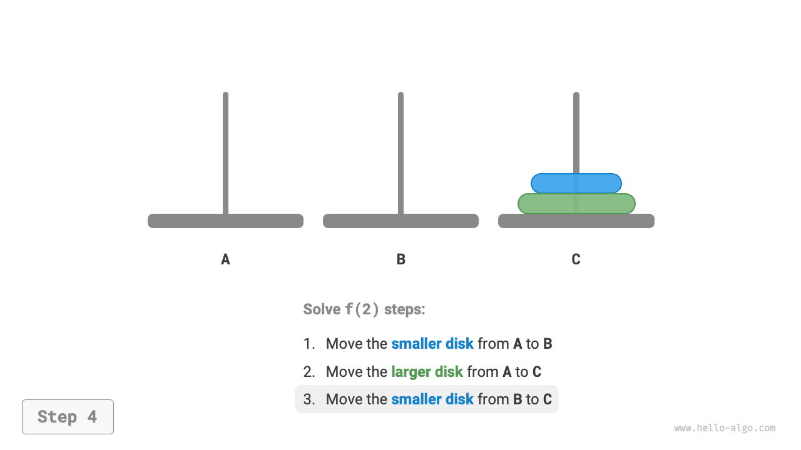

問題 $f(2)$ を解く過程は、**2 枚の円盤を `B` を介して `A` から `C` へ移す**と要約できます。このとき、`C` を目標の柱、`B` を補助の柱と呼びます。

### 部分問題への分解

問題 $f(3)$ 、すなわち円盤が 3 枚ある場合になると、状況はやや複雑になります。

$f(1)$ と $f(2)$ の解が既知なので、分割統治の観点から、**`A` の上部にある 2 枚の円盤をひとまとまりとみなして**、次の図の手順を実行できます。こうして 3 枚の円盤を `A` から `C` へ順調に移動できます。

1. `B` を目標の柱、`C` を補助の柱として、2 枚の円盤を `A` から `B` へ移します。
2. `A` に残った 1 枚の円盤を `A` から `C` へ直接移動します。
3. `C` を目標の柱、`A` を補助の柱として、2 枚の円盤を `B` から `C` へ移します。

=== "<1>"
    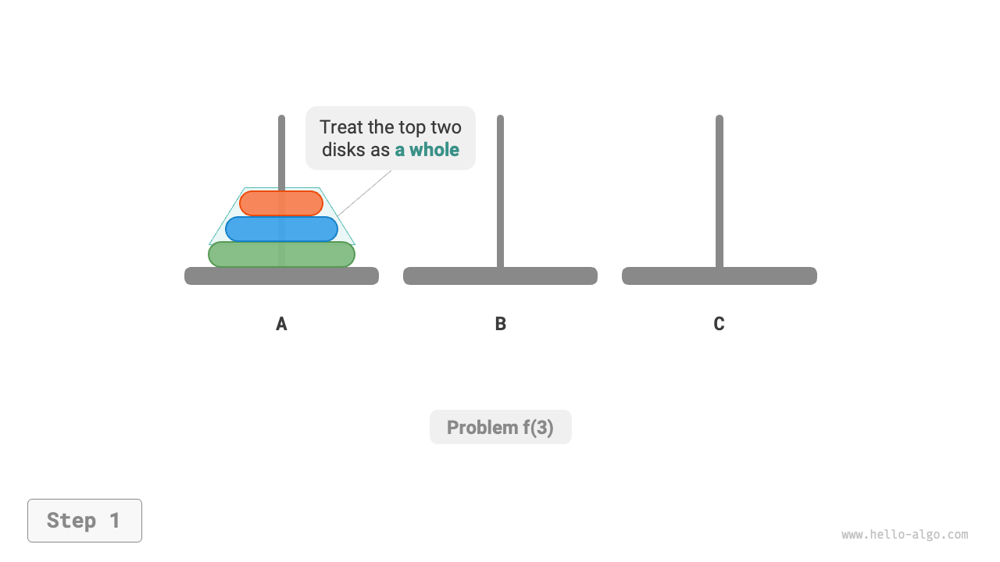

=== "<2>"
    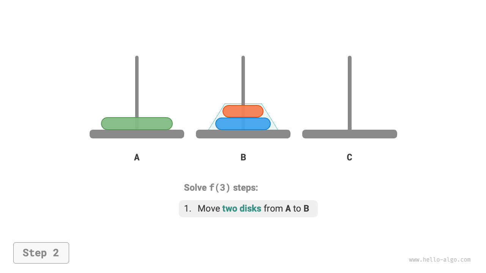

=== "<3>"
    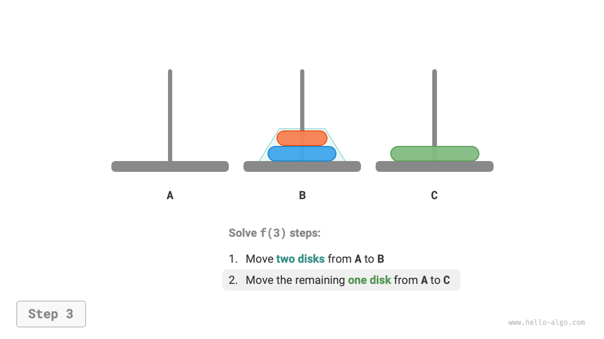

=== "<4>"
    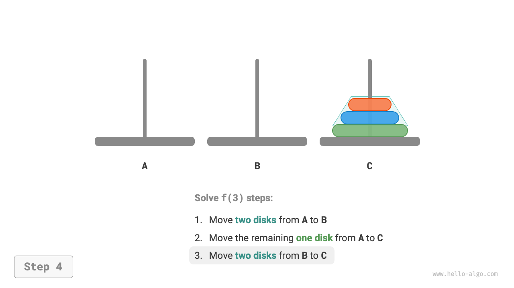

本質的には、**問題 $f(3)$ を 2 つの部分問題 $f(2)$ と 1 つの部分問題 $f(1)$ に分けています** 。この 3 つの部分問題を順に解けば、元の問題も解決されます。これは、部分問題が独立しており、解を組み合わせられることを示しています。

ここまでで、次の図に示すハノイの塔の問題を解く分割統治戦略をまとめられます。元の問題 $f(n)$ を 2 つの部分問題 $f(n-1)$ と 1 つの部分問題 $f(1)$ に分け、次の順序でこの 3 つの部分問題を解きます。

1. $n-1$ 枚の円盤を `C` を介して `A` から `B` へ移します。
2. 残り $1$ 枚の円盤を `A` から `C` へ直接移します。
3. $n-1$ 枚の円盤を `A` を介して `B` から `C` へ移します。

この 2 つの部分問題 $f(n-1)$ は、**同じ方法で再帰的に分割できます**。最小の部分問題 $f(1)$ に到達するまでこれを続けます。一方、$f(1)$ の解は既知であり、1 回の移動操作だけで済みます。

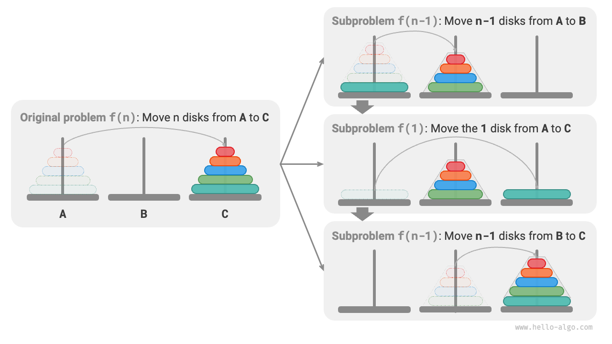

### コードの実装

コードでは、再帰関数 `dfs(i, src, buf, tar)` を定義します。その役割は、柱 `src` の上部にある $i$ 枚の円盤を、補助の柱 `buf` を使って目標の柱 `tar` へ移動することです：

```src
[file]{hanota}-[class]{}-[func]{solve_hanota}
```

以下の図に示すように、ハノイの塔の問題は高さ $n$ の再帰木を形成し、各ノードは 1 つの部分問題、すなわち 1 つ起動された `dfs()` 関数に対応します。**したがって時間計算量は $O(2^n)$ 、空間計算量は $O(n)$** です。

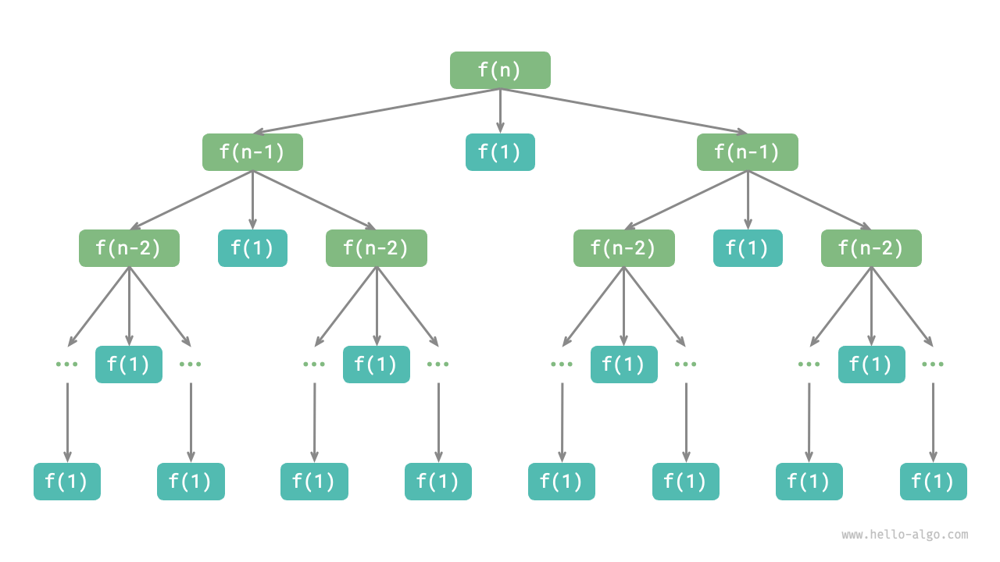

!!! quote

    ハノイの塔の問題は古い伝説に由来します。古代インドのある寺院で、僧侶たちは 3 本の高いダイヤモンドの柱と、$64$ 枚の大きさの異なる金の円盤を持っていました。僧侶たちは絶えず円盤を動かし、最後の 1 枚が正しく置かれた瞬間に世界が終わると信じていました。

    しかし、たとえ僧侶たちが 1 秒に 1 回移動するとしても、合計でおよそ $2^{64} \approx 1.84×10^{19}$ 秒、約 $5850$ 億年が必要で、現在推定されている宇宙の年齢をはるかに上回ります。したがって、この伝説が本当だったとしても、世界の終わりを心配する必要はなさそうです。
