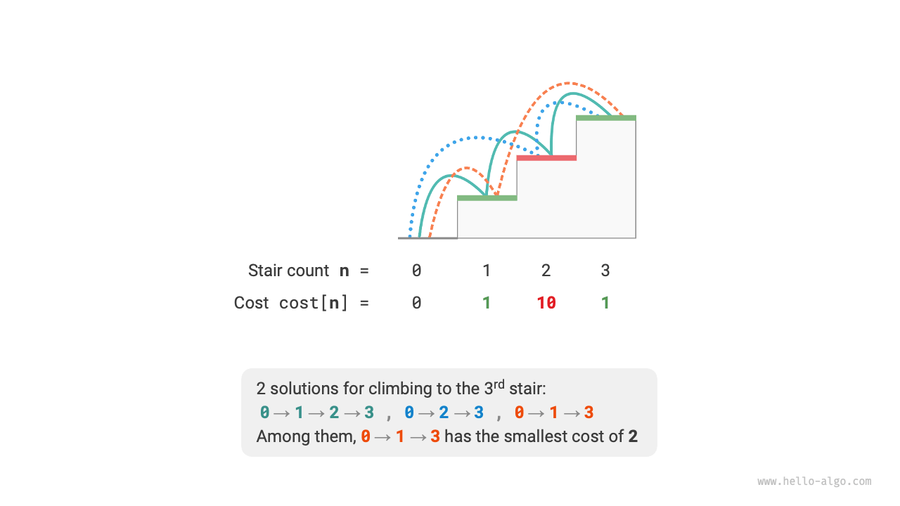
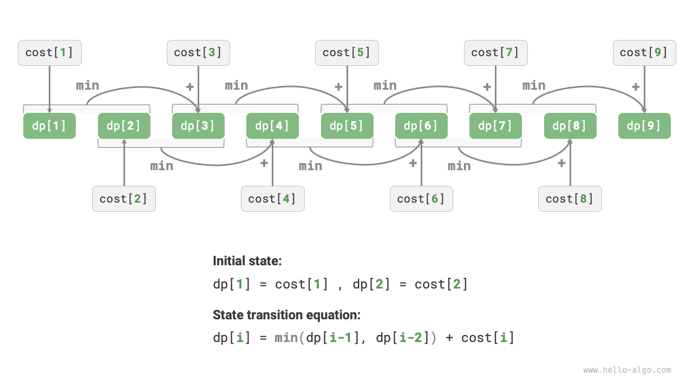
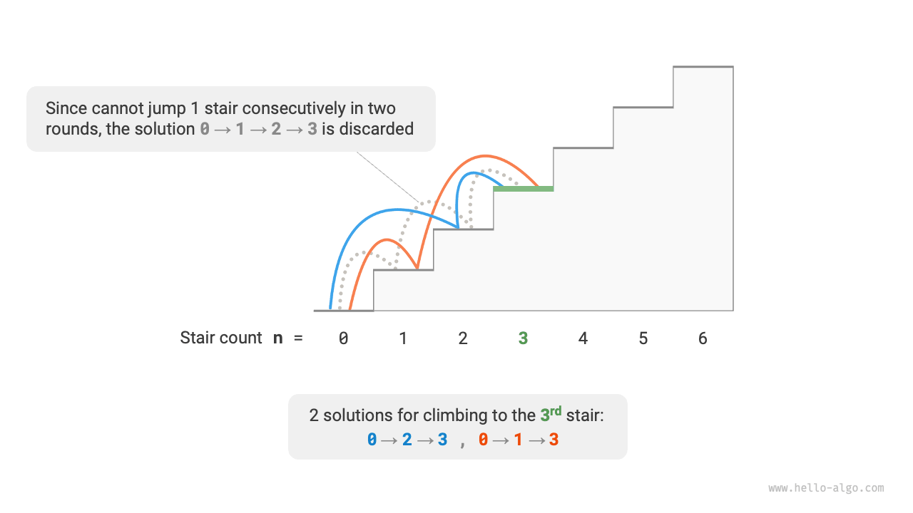
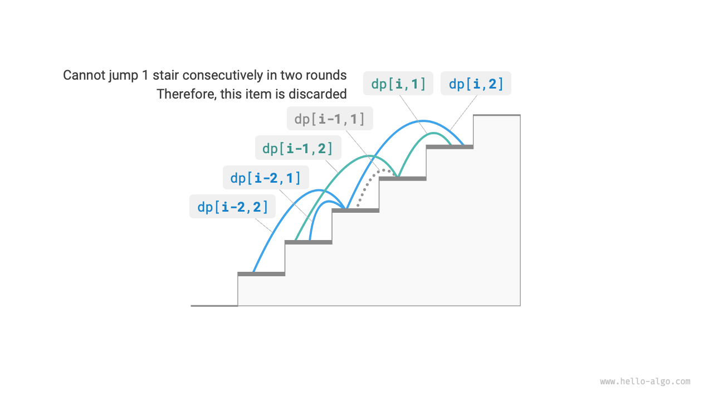

# 動的プログラミング問題の特徴

前のセクションでは、動的プログラミングが問題を部分問題に分解することで元の問題を解決する方法を学びました。実際、部分問題の分解は一般的なアルゴリズムアプローチであり、分割統治法、動的プログラミング、バックトラッキングでは異なる重点があります。

- 分割統治法アルゴリズムは元の問題を複数の独立した部分問題に再帰的に分割し、最小の部分問題に到達するまで続け、バックトラッキング時に部分問題の解を組み合わせて最終的に元の問題の解を得ます。
- 動的プログラミングも問題を再帰的に分解しますが、分割統治法アルゴリズムとの主な違いは、動的プログラミングの部分問題が相互依存的であり、分解プロセス中に多くの重複する部分問題が現れることです。
- バックトラッキングアルゴリズムは試行錯誤によってすべての可能な解を網羅し、枝刈りによって不必要な探索分岐を避けます。元の問題の解は一連の決定ステップから構成され、各決定ステップ前の各部分シーケンスを部分問題として考えることができます。

実際、動的プログラミングは最適化問題を解決するためによく使用され、これらは重複する部分問題を含むだけでなく、他に2つの主要な特徴があります：最適部分構造と無記憶性です。

## 最適部分構造

階段登り問題を少し修正して、最適部分構造の概念を実証するのにより適したものにします。

!!! question "階段登りの最小コスト"

    階段があり、一度に1段または2段上ることができ、階段の各段にはその段で支払う必要があるコストを表す非負の整数があります。非負の整数配列 $cost$ が与えられ、$cost[i]$ は $i$ 段目で支払う必要があるコストを表し、$cost[0]$ は地面（開始点）です。頂上に到達するために必要な最小コストは何ですか？

下の図に示すように、1段目、2段目、3段目のコストがそれぞれ $1$、$10$、$1$ の場合、地面から3段目に登る最小コストは $2$ です。



$dp[i]$ を $i$ 段目に登る累積コストとします。$i$ 段目は $i-1$ 段目または $i-2$ 段目からのみ来ることができるため、$dp[i]$ は $dp[i-1] + cost[i]$ または $dp[i-2] + cost[i]$ のいずれかしかありえません。コストを最小化するために、2つのうち小さい方を選択すべきです：

$$
dp[i] = \min(dp[i-1], dp[i-2]) + cost[i]
$$

これにより最適部分構造の意味がわかります：**元の問題の最適解は部分問題の最適解から構築される**。

この問題は明らかに最適部分構造を持っています：2つの部分問題 $dp[i-1]$ と $dp[i-2]$ の最適解からより良い方を選択し、それを使用して元の問題 $dp[i]$ の最適解を構築します。

では、前のセクションの階段登り問題は最適部分構造を持っているでしょうか？その目標は解の数を求めることで、これは数え上げ問題のようですが、別の方法で尋ねてみましょう：「解の最大数を求める」。驚くことに、**問題が変わったにもかかわらず、最適部分構造が現れた**ことがわかります：$n$ 段目での解の最大数は、$n-1$ 段目と $n-2$ 段目での解の最大数の和に等しいです。したがって、最適部分構造の解釈は非常に柔軟で、異なる問題では異なる意味を持ちます。

状態遷移方程式と初期状態 $dp[1] = cost[1]$ および $dp[2] = cost[2]$ に従って、動的プログラミングコードを得ることができます：

```src
[file]{min_cost_climbing_stairs_dp}-[class]{}-[func]{min_cost_climbing_stairs_dp}
```

下の図は上記コードの動的プログラミングプロセスを示しています。



この問題も空間最適化が可能で、1次元を0に圧縮し、空間計算量を $O(n)$ から $O(1)$ に削減できます：

```src
[file]{min_cost_climbing_stairs_dp}-[class]{}-[func]{min_cost_climbing_stairs_dp_comp}
```

## 無記憶性

無記憶性は動的プログラミングが問題解決に効果的であることを可能にする重要な特徴の1つです。その定義は：**特定の状態が与えられたとき、その将来の発展は現在の状態のみに関連し、過去に経験したすべての状態とは無関係である**。

階段登り問題を例に取ると、状態 $i$ が与えられたとき、それは状態 $i+1$ と $i+2$ に発展し、それぞれ1段ジャンプと2段ジャンプに対応します。これら2つの選択をするとき、状態 $i$ より前の状態を考慮する必要はありません。なぜなら、それらは状態 $i$ の将来に影響しないからです。

しかし、階段登り問題に制約を追加すると、状況が変わります。

!!! question "制約付き階段登り"

    $n$ 段の階段があり、毎回1段または2段上ることができますが、**1段を2回連続でジャンプすることはできません**。頂上に登る方法は何通りありますか？

下の図に示すように、3段目に登る実行可能な選択肢は2つだけで、1段を3回連続でジャンプする選択肢は制約条件を満たさないため破棄されます。



この問題では、前回が1段ジャンプだった場合、次回は必ず2段ジャンプでなければなりません。これは**次のステップの選択が現在の状態（現在の階段段数）だけでは独立して決定できず、前の状態（前回の階段段数）にも依存する**ことを意味します。

この問題がもはや無記憶性を満たさず、状態遷移方程式 $dp[i] = dp[i-1] + dp[i-2]$ も失敗することは容易にわかります。なぜなら $dp[i-1]$ は今回の1段ジャンプを表しますが、多くの「前回が1段ジャンプだった」選択肢を含んでおり、制約を満たすためにはこれらを直接 $dp[i]$ に含めることはできません。

このため、状態定義を拡張する必要があります：**状態 $[i, j]$ は $i$ 段目にいて、前回が $j$ 段ジャンプだったことを表す**。ここで $j \in \{1, 2\}$ です。この状態定義は前回が1段ジャンプだったか2段ジャンプだったかを効果的に区別し、現在の状態がどこから来たかを適切に判断できます。

- 前回が1段ジャンプだった場合、前々回は必ず2段ジャンプを選択していたはずです。つまり、$dp[i, 1]$ は $dp[i-1, 2]$ からのみ遷移できます。
- 前回が2段ジャンプだった場合、前々回は1段ジャンプまたは2段ジャンプを選択できました。つまり、$dp[i, 2]$ は $dp[i-2, 1]$ または $dp[i-2, 2]$ から遷移できます。

下の図に示すように、$dp[i, j]$ は状態 $[i, j]$ の解の数を表します。この時点で、状態遷移方程式は次のようになります：

$$
\begin{cases}
dp[i, 1] = dp[i-1, 2] \\
dp[i, 2] = dp[i-2, 1] + dp[i-2, 2]
\end{cases}
$$



最終的に、$dp[n, 1] + dp[n, 2]$ を返せばよく、この2つの合計が $n$ 段目に登る解の総数を表します：

```src
[file]{climbing_stairs_constraint_dp}-[class]{}-[func]{climbing_stairs_constraint_dp}
```

上記のケースでは、前の状態のみを考慮すればよいため、状態定義を拡張することで依然として無記憶性を満たすことができます。しかし、一部の問題では非常に深刻な「状態効果」があります。

!!! question "障害物生成付き階段登り"

    $n$ 段の階段があり、毎回1段または2段上ることができます。**$i$ 段目に登ったとき、システムが自動的に $2i$ 段目に障害物を置き、その後のすべてのラウンドで $2i$ 段目にジャンプすることが禁止される**と規定されています。例えば、最初の2ラウンドで2段目と3段目にジャンプした場合、その後は4段目と6段目にジャンプできません。頂上に登る方法は何通りありますか？

この問題では、次のジャンプはすべての過去の状態に依存します。各ジャンプがより高い段に障害物を置き、将来のジャンプに影響するからです。このような問題では、動的プログラミングはしばしば解決に苦労します。

実際、多くの複雑な組み合わせ最適化問題（巡回セールスマン問題など）は無記憶性を満たしません。このような問題に対しては、通常、ヒューリスティック探索、遺伝的アルゴリズム、強化学習などの他の方法を選択して、限られた時間内に使用可能な局所最適解を得ます。
