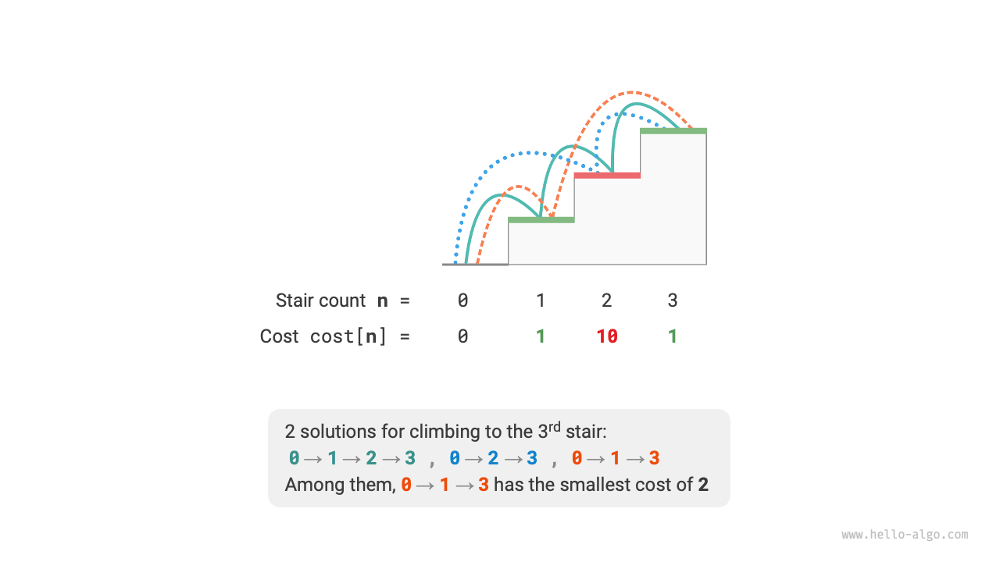
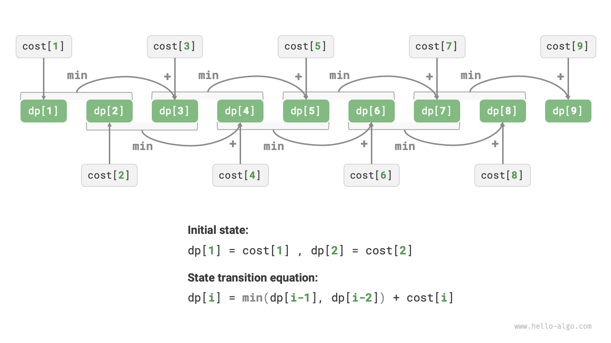
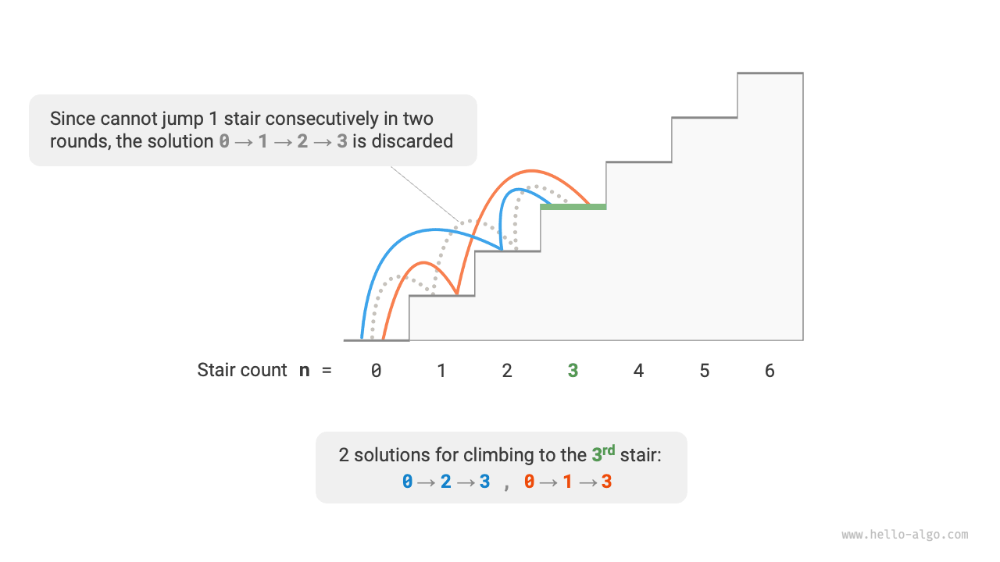
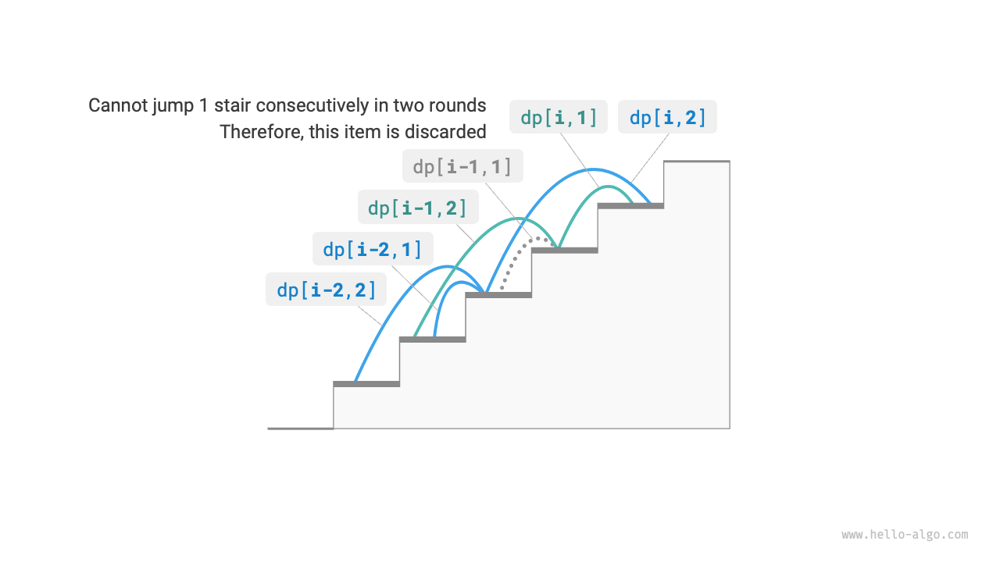

# 14.2 &nbsp; 動的計画法の問題特性

前節では、動的計画法が部分問題への分解によってどのように元の問題を解くのかを学びました。実際、部分問題への分解は汎用的なアルゴリズムの考え方であり、分割統治法、動的計画法、バックトラッキングでは重視点が異なります。

- 分割統治法は、元の問題を再帰的に複数の互いに独立した部分問題へ分割し、最小の部分問題に至るまで分解したうえで、バックトラック時に部分問題の解を統合し、最終的に元の問題の解を得ます。
- 動的計画法も問題を再帰的に分解しますが、分割統治法との主な違いは、動的計画法における部分問題が相互依存しており、分解の過程で多数の重複部分問題が現れることです。
- バックトラッキング法は、試行と巻き戻しの中ですべての可能な解を列挙し、枝刈りによって不要な探索分岐を避けます。元の問題の解は一連の意思決定ステップから構成されるため、各決定ステップ以前の部分系列を一つの部分問題と見なせます。

実際、動的計画法は最適化問題を解くためによく用いられます。これらは重複部分問題を含むだけでなく、さらに二つの大きな特性、すなわち最適部分構造と無後効性を備えています。

## 14.2.1 &nbsp; 最適部分構造

階段昇り問題を少し変更し、最適部分構造の概念をより示しやすくします。

!!! question "階段昇りの最小コスト"

    階段が与えられ、各ステップで $1$ 段または $2$ 段上ることができます。各段には非負整数が貼られており、その段に到達するために支払う必要があるコストを表します。非負整数配列 $cost$ が与えられ、$cost[i]$ は第 $i$ 段で支払うコストを表し、$cost[0]$ は地面（開始地点）です。頂上に到達するために必要な最小コストを求めてください。

下図に示すように、第 $1$、$2$、$3$ 段のコストがそれぞれ $1$、$10$、$1$ である場合、地面から第 $3$ 段まで上る最小コストは $2$ です。

{ class="animation-figure" }

<p align="center"> 図 14-6 &nbsp; 第 3 段まで上る最小コスト </p>

$dp[i]$ を第 $i$ 段まで上るのに累積して支払ったコストとします。第 $i$ 段には $i - 1$ 段または $i - 2$ 段からしか到達できないため、$dp[i]$ は $dp[i - 1] + cost[i]$ または $dp[i - 2] + cost[i]$ のいずれかになります。コストをできるだけ小さくするには、この二つのうち小さいほうを選べばよいです。

$$
dp[i] = \min(dp[i-1], dp[i-2]) + cost[i]
$$

ここから最適部分構造の意味を導けます。**元の問題の最適解は、部分問題の最適解から構築される**ということです。

この問題が最適部分構造を持つことは明らかです。二つの部分問題の最適解 $dp[i-1]$ と $dp[i-2]$ からより良いほうを選び、それを用いて元の問題 $dp[i]$ の最適解を構築しています。

では、前節の階段昇り問題には最適部分構造があるのでしょうか。その目的は方法数を求めることで、一見すると計数問題です。しかし問い方を変えて「最大の方法数を求める」とすると、意外にも、**問題の変更前後は等価であるにもかかわらず、最適部分構造が現れます**。すなわち、第 $n$ 段の最大方法数は第 $n-1$ 段と第 $n-2$ 段の最大方法数の和に等しいのです。このように、最適部分構造の解釈は比較的柔軟であり、問題によって意味合いが異なります。

状態遷移方程式と初期状態 $dp[1] = cost[1]$ および $dp[2] = cost[2]$ に基づいて、次の動的計画法コードが得られます。

=== "Python"

    ```python title="min_cost_climbing_stairs_dp.py"
    def min_cost_climbing_stairs_dp(cost: list[int]) -> int:
        """階段登りの最小コスト：動的計画法"""
        n = len(cost) - 1
        if n == 1 or n == 2:
            return cost[n]
        # 部分問題の解を保存するために dp テーブルを初期化
        dp = [0] * (n + 1)
        # 初期状態：最小部分問題の解をあらかじめ設定
        dp[1], dp[2] = cost[1], cost[2]
        # 状態遷移：小さい部分問題から大きい部分問題へ順に解く
        for i in range(3, n + 1):
            dp[i] = min(dp[i - 1], dp[i - 2]) + cost[i]
        return dp[n]
    ```

=== "C++"

    ```cpp title="min_cost_climbing_stairs_dp.cpp"
    /* 階段登りの最小コスト：動的計画法 */
    int minCostClimbingStairsDP(vector<int> &cost) {
        int n = cost.size() - 1;
        if (n == 1 || n == 2)
            return cost[n];
        // 部分問題の解を保存するために dp テーブルを初期化
        vector<int> dp(n + 1);
        // 初期状態：最小部分問題の解をあらかじめ設定
        dp[1] = cost[1];
        dp[2] = cost[2];
        // 状態遷移：小さい部分問題から大きい部分問題へ順に解く
        for (int i = 3; i <= n; i++) {
            dp[i] = min(dp[i - 1], dp[i - 2]) + cost[i];
        }
        return dp[n];
    }
    ```

=== "Java"

    ```java title="min_cost_climbing_stairs_dp.java"
    /* 階段登りの最小コスト：動的計画法 */
    int minCostClimbingStairsDP(int[] cost) {
        int n = cost.length - 1;
        if (n == 1 || n == 2)
            return cost[n];
        // 部分問題の解を保存するために dp テーブルを初期化
        int[] dp = new int[n + 1];
        // 初期状態：最小部分問題の解をあらかじめ設定
        dp[1] = cost[1];
        dp[2] = cost[2];
        // 状態遷移：小さい部分問題から大きい部分問題へ順に解く
        for (int i = 3; i <= n; i++) {
            dp[i] = Math.min(dp[i - 1], dp[i - 2]) + cost[i];
        }
        return dp[n];
    }
    ```

=== "C#"

    ```csharp title="min_cost_climbing_stairs_dp.cs"
    /* 階段登りの最小コスト：動的計画法 */
    int MinCostClimbingStairsDP(int[] cost) {
        int n = cost.Length - 1;
        if (n == 1 || n == 2)
            return cost[n];
        // 部分問題の解を保存するために dp テーブルを初期化
        int[] dp = new int[n + 1];
        // 初期状態：最小部分問題の解をあらかじめ設定
        dp[1] = cost[1];
        dp[2] = cost[2];
        // 状態遷移：小さい部分問題から大きい部分問題へ順に解く
        for (int i = 3; i <= n; i++) {
            dp[i] = Math.Min(dp[i - 1], dp[i - 2]) + cost[i];
        }
        return dp[n];
    }
    ```

=== "Go"

    ```go title="min_cost_climbing_stairs_dp.go"
    /* 階段登りの最小コスト：動的計画法 */
    func minCostClimbingStairsDP(cost []int) int {
        n := len(cost) - 1
        if n == 1 || n == 2 {
            return cost[n]
        }
        min := func(a, b int) int {
            if a < b {
                return a
            }
            return b
        }
        // 部分問題の解を保存するために dp テーブルを初期化
        dp := make([]int, n+1)
        // 初期状態：最小部分問題の解をあらかじめ設定
        dp[1] = cost[1]
        dp[2] = cost[2]
        // 状態遷移：小さい部分問題から大きい部分問題へ順に解く
        for i := 3; i <= n; i++ {
            dp[i] = min(dp[i-1], dp[i-2]) + cost[i]
        }
        return dp[n]
    }
    ```

=== "Swift"

    ```swift title="min_cost_climbing_stairs_dp.swift"
    /* 階段登りの最小コスト：動的計画法 */
    func minCostClimbingStairsDP(cost: [Int]) -> Int {
        let n = cost.count - 1
        if n == 1 || n == 2 {
            return cost[n]
        }
        // 部分問題の解を保存するために dp テーブルを初期化
        var dp = Array(repeating: 0, count: n + 1)
        // 初期状態：最小部分問題の解をあらかじめ設定
        dp[1] = cost[1]
        dp[2] = cost[2]
        // 状態遷移：小さい部分問題から大きい部分問題へ順に解く
        for i in 3 ... n {
            dp[i] = min(dp[i - 1], dp[i - 2]) + cost[i]
        }
        return dp[n]
    }
    ```

=== "JS"

    ```javascript title="min_cost_climbing_stairs_dp.js"
    /* 階段登りの最小コスト：動的計画法 */
    function minCostClimbingStairsDP(cost) {
        const n = cost.length - 1;
        if (n === 1 || n === 2) {
            return cost[n];
        }
        // 部分問題の解を保存するために dp テーブルを初期化
        const dp = new Array(n + 1);
        // 初期状態：最小部分問題の解をあらかじめ設定
        dp[1] = cost[1];
        dp[2] = cost[2];
        // 状態遷移：小さい部分問題から大きい部分問題へ順に解く
        for (let i = 3; i <= n; i++) {
            dp[i] = Math.min(dp[i - 1], dp[i - 2]) + cost[i];
        }
        return dp[n];
    }
    ```

=== "TS"

    ```typescript title="min_cost_climbing_stairs_dp.ts"
    /* 階段登りの最小コスト：動的計画法 */
    function minCostClimbingStairsDP(cost: Array<number>): number {
        const n = cost.length - 1;
        if (n === 1 || n === 2) {
            return cost[n];
        }
        // 部分問題の解を保存するために dp テーブルを初期化
        const dp = new Array(n + 1);
        // 初期状態：最小部分問題の解をあらかじめ設定
        dp[1] = cost[1];
        dp[2] = cost[2];
        // 状態遷移：小さい部分問題から大きい部分問題へ順に解く
        for (let i = 3; i <= n; i++) {
            dp[i] = Math.min(dp[i - 1], dp[i - 2]) + cost[i];
        }
        return dp[n];
    }
    ```

=== "Dart"

    ```dart title="min_cost_climbing_stairs_dp.dart"
    /* 階段登りの最小コスト：動的計画法 */
    int minCostClimbingStairsDP(List<int> cost) {
      int n = cost.length - 1;
      if (n == 1 || n == 2) return cost[n];
      // 部分問題の解を保存するために dp テーブルを初期化
      List<int> dp = List.filled(n + 1, 0);
      // 初期状態：最小部分問題の解をあらかじめ設定
      dp[1] = cost[1];
      dp[2] = cost[2];
      // 状態遷移：小さい部分問題から大きい部分問題へ順に解く
      for (int i = 3; i <= n; i++) {
        dp[i] = min(dp[i - 1], dp[i - 2]) + cost[i];
      }
      return dp[n];
    }
    ```

=== "Rust"

    ```rust title="min_cost_climbing_stairs_dp.rs"
    /* 階段登りの最小コスト：動的計画法 */
    fn min_cost_climbing_stairs_dp(cost: &[i32]) -> i32 {
        let n = cost.len() - 1;
        if n == 1 || n == 2 {
            return cost[n];
        }
        // 部分問題の解を保存するために dp テーブルを初期化
        let mut dp = vec![-1; n + 1];
        // 初期状態：最小部分問題の解をあらかじめ設定
        dp[1] = cost[1];
        dp[2] = cost[2];
        // 状態遷移：小さい部分問題から大きい部分問題へ順に解く
        for i in 3..=n {
            dp[i] = cmp::min(dp[i - 1], dp[i - 2]) + cost[i];
        }
        dp[n]
    }
    ```

=== "C"

    ```c title="min_cost_climbing_stairs_dp.c"
    /* 階段登りの最小コスト：動的計画法 */
    int minCostClimbingStairsDP(int cost[], int costSize) {
        int n = costSize - 1;
        if (n == 1 || n == 2)
            return cost[n];
        // 部分問題の解を保存するために dp テーブルを初期化
        int *dp = calloc(n + 1, sizeof(int));
        // 初期状態：最小部分問題の解をあらかじめ設定
        dp[1] = cost[1];
        dp[2] = cost[2];
        // 状態遷移：小さい部分問題から大きい部分問題へ順に解く
        for (int i = 3; i <= n; i++) {
            dp[i] = myMin(dp[i - 1], dp[i - 2]) + cost[i];
        }
        int res = dp[n];
        // メモリを解放する
        free(dp);
        return res;
    }
    ```

=== "Kotlin"

    ```kotlin title="min_cost_climbing_stairs_dp.kt"
    /* 階段登りの最小コスト：動的計画法 */
    fun minCostClimbingStairsDP(cost: IntArray): Int {
        val n = cost.size - 1
        if (n == 1 || n == 2) return cost[n]
        // 部分問題の解を保存するために dp テーブルを初期化
        val dp = IntArray(n + 1)
        // 初期状態：最小部分問題の解をあらかじめ設定
        dp[1] = cost[1]
        dp[2] = cost[2]
        // 状態遷移：小さい部分問題から大きい部分問題へ順に解く
        for (i in 3..n) {
            dp[i] = min(dp[i - 1], dp[i - 2]) + cost[i]
        }
        return dp[n]
    }
    ```

=== "Ruby"

    ```ruby title="min_cost_climbing_stairs_dp.rb"
    ### 階段登りの最小コスト：動的計画法 ###
    def min_cost_climbing_stairs_dp(cost)
      n = cost.length - 1
      return cost[n] if n == 1 || n == 2
      # 部分問題の解を保存するために dp テーブルを初期化
      dp = Array.new(n + 1, 0)
      # 初期状態：最小部分問題の解をあらかじめ設定
      dp[1], dp[2] = cost[1], cost[2]
      # 状態遷移：小さい部分問題から大きい部分問題へ順に解く
      (3...(n + 1)).each { |i| dp[i] = [dp[i - 1], dp[i - 2]].min + cost[i] }
      dp[n]
    end
    ```

??? pythontutor "コードの可視化"

    <div style="height: 549px; width: 100%;"><iframe class="pythontutor-iframe" src="https://pythontutor.com/iframe-embed.html#code=def%20min_cost_climbing_stairs_dp%28cost%3A%20list%5Bint%5D%29%20-%3E%20int%3A%0A%20%20%20%20%22%22%22%E9%9A%8E%E6%AE%B5%E7%99%BB%E3%82%8A%E3%81%AE%E6%9C%80%E5%B0%8F%E3%82%B3%E3%82%B9%E3%83%88%EF%BC%9A%E5%8B%95%E7%9A%84%E8%A8%88%E7%94%BB%E6%B3%95%22%22%22%0A%20%20%20%20n%20%3D%20len%28cost%29%20-%201%0A%20%20%20%20if%20n%20%3D%3D%201%20or%20n%20%3D%3D%202%3A%0A%20%20%20%20%20%20%20%20return%20cost%5Bn%5D%0A%20%20%20%20%23%20%E9%83%A8%E5%88%86%E5%95%8F%E9%A1%8C%E3%81%AE%E8%A7%A3%E3%82%92%E4%BF%9D%E5%AD%98%E3%81%99%E3%82%8B%E3%81%9F%E3%82%81%E3%81%AB%20dp%20%E3%83%86%E3%83%BC%E3%83%96%E3%83%AB%E3%82%92%E5%88%9D%E6%9C%9F%E5%8C%96%0A%20%20%20%20dp%20%3D%20%5B0%5D%20%2A%20%28n%20%2B%201%29%0A%20%20%20%20%23%20%E5%88%9D%E6%9C%9F%E7%8A%B6%E6%85%8B%EF%BC%9A%E6%9C%80%E5%B0%8F%E9%83%A8%E5%88%86%E5%95%8F%E9%A1%8C%E3%81%AE%E8%A7%A3%E3%82%92%E3%81%82%E3%82%89%E3%81%8B%E3%81%98%E3%82%81%E8%A8%AD%E5%AE%9A%0A%20%20%20%20dp%5B1%5D%2C%20dp%5B2%5D%20%3D%20cost%5B1%5D%2C%20cost%5B2%5D%0A%20%20%20%20%23%20%E7%8A%B6%E6%85%8B%E9%81%B7%E7%A7%BB%EF%BC%9A%E5%B0%8F%E3%81%95%E3%81%84%E9%83%A8%E5%88%86%E5%95%8F%E9%A1%8C%E3%81%8B%E3%82%89%E5%A4%A7%E3%81%8D%E3%81%84%E9%83%A8%E5%88%86%E5%95%8F%E9%A1%8C%E3%81%B8%E9%A0%86%E3%81%AB%E8%A7%A3%E3%81%8F%0A%20%20%20%20for%20i%20in%20range%283%2C%20n%20%2B%201%29%3A%0A%20%20%20%20%20%20%20%20dp%5Bi%5D%20%3D%20min%28dp%5Bi%20-%201%5D%2C%20dp%5Bi%20-%202%5D%29%20%2B%20cost%5Bi%5D%0A%20%20%20%20return%20dp%5Bn%5D%0A%0A%0Aif%20__name__%20%3D%3D%20%22__main__%22%3A%0A%20%20%20%20cost%20%3D%20%5B0%2C%201%2C%2010%2C%201%2C%201%2C%201%2C%2010%2C%201%2C%201%2C%2010%2C%201%5D%0A%20%20%20%20print%28f%22%E5%85%A5%E5%8A%9B%E3%81%95%E3%82%8C%E3%81%9F%E9%9A%8E%E6%AE%B5%E3%82%B3%E3%82%B9%E3%83%88%E3%81%AE%E3%83%AA%E3%82%B9%E3%83%88%E3%81%AF%20%7Bcost%7D%22%29%0A%0A%20%20%20%20res%20%3D%20min_cost_climbing_stairs_dp%28cost%29%0A%20%20%20%20print%28f%22%E9%9A%8E%E6%AE%B5%E3%82%92%E4%B8%8A%E3%82%8A%E5%88%87%E3%82%8B%E6%9C%80%E5%B0%8F%E3%82%B3%E3%82%B9%E3%83%88%E3%81%AF%20%7Bres%7D%22%29&codeDivHeight=472&codeDivWidth=350&cumulative=false&curInstr=4&heapPrimitives=nevernest&origin=opt-frontend.js&py=311&rawInputLstJSON=%5B%5D&textReferences=false"> </iframe></div>
    <div style="margin-top: 5px;"><a href="https://pythontutor.com/iframe-embed.html#code=def%20min_cost_climbing_stairs_dp%28cost%3A%20list%5Bint%5D%29%20-%3E%20int%3A%0A%20%20%20%20%22%22%22%E9%9A%8E%E6%AE%B5%E7%99%BB%E3%82%8A%E3%81%AE%E6%9C%80%E5%B0%8F%E3%82%B3%E3%82%B9%E3%83%88%EF%BC%9A%E5%8B%95%E7%9A%84%E8%A8%88%E7%94%BB%E6%B3%95%22%22%22%0A%20%20%20%20n%20%3D%20len%28cost%29%20-%201%0A%20%20%20%20if%20n%20%3D%3D%201%20or%20n%20%3D%3D%202%3A%0A%20%20%20%20%20%20%20%20return%20cost%5Bn%5D%0A%20%20%20%20%23%20%E9%83%A8%E5%88%86%E5%95%8F%E9%A1%8C%E3%81%AE%E8%A7%A3%E3%82%92%E4%BF%9D%E5%AD%98%E3%81%99%E3%82%8B%E3%81%9F%E3%82%81%E3%81%AB%20dp%20%E3%83%86%E3%83%BC%E3%83%96%E3%83%AB%E3%82%92%E5%88%9D%E6%9C%9F%E5%8C%96%0A%20%20%20%20dp%20%3D%20%5B0%5D%20%2A%20%28n%20%2B%201%29%0A%20%20%20%20%23%20%E5%88%9D%E6%9C%9F%E7%8A%B6%E6%85%8B%EF%BC%9A%E6%9C%80%E5%B0%8F%E9%83%A8%E5%88%86%E5%95%8F%E9%A1%8C%E3%81%AE%E8%A7%A3%E3%82%92%E3%81%82%E3%82%89%E3%81%8B%E3%81%98%E3%82%81%E8%A8%AD%E5%AE%9A%0A%20%20%20%20dp%5B1%5D%2C%20dp%5B2%5D%20%3D%20cost%5B1%5D%2C%20cost%5B2%5D%0A%20%20%20%20%23%20%E7%8A%B6%E6%85%8B%E9%81%B7%E7%A7%BB%EF%BC%9A%E5%B0%8F%E3%81%95%E3%81%84%E9%83%A8%E5%88%86%E5%95%8F%E9%A1%8C%E3%81%8B%E3%82%89%E5%A4%A7%E3%81%8D%E3%81%84%E9%83%A8%E5%88%86%E5%95%8F%E9%A1%8C%E3%81%B8%E9%A0%86%E3%81%AB%E8%A7%A3%E3%81%8F%0A%20%20%20%20for%20i%20in%20range%283%2C%20n%20%2B%201%29%3A%0A%20%20%20%20%20%20%20%20dp%5Bi%5D%20%3D%20min%28dp%5Bi%20-%201%5D%2C%20dp%5Bi%20-%202%5D%29%20%2B%20cost%5Bi%5D%0A%20%20%20%20return%20dp%5Bn%5D%0A%0A%0Aif%20__name__%20%3D%3D%20%22__main__%22%3A%0A%20%20%20%20cost%20%3D%20%5B0%2C%201%2C%2010%2C%201%2C%201%2C%201%2C%2010%2C%201%2C%201%2C%2010%2C%201%5D%0A%20%20%20%20print%28f%22%E5%85%A5%E5%8A%9B%E3%81%95%E3%82%8C%E3%81%9F%E9%9A%8E%E6%AE%B5%E3%82%B3%E3%82%B9%E3%83%88%E3%81%AE%E3%83%AA%E3%82%B9%E3%83%88%E3%81%AF%20%7Bcost%7D%22%29%0A%0A%20%20%20%20res%20%3D%20min_cost_climbing_stairs_dp%28cost%29%0A%20%20%20%20print%28f%22%E9%9A%8E%E6%AE%B5%E3%82%92%E4%B8%8A%E3%82%8A%E5%88%87%E3%82%8B%E6%9C%80%E5%B0%8F%E3%82%B3%E3%82%B9%E3%83%88%E3%81%AF%20%7Bres%7D%22%29&codeDivHeight=800&codeDivWidth=600&cumulative=false&curInstr=4&heapPrimitives=nevernest&origin=opt-frontend.js&py=311&rawInputLstJSON=%5B%5D&textReferences=false" target="_blank" rel="noopener noreferrer">全画面で見る ></a></div>

下図は上記コードの動的計画法の過程を示しています。

{ class="animation-figure" }

<p align="center"> 図 14-7 &nbsp; 階段昇り最小コストの動的計画法の過程 </p>

この問題では空間最適化も可能であり、一次元をゼロ次元まで圧縮することで、空間計算量を $O(n)$ から $O(1)$ に削減できます。

=== "Python"

    ```python title="min_cost_climbing_stairs_dp.py"
    def min_cost_climbing_stairs_dp_comp(cost: list[int]) -> int:
        """階段昇りの最小コスト：空間最適化後の動的計画法"""
        n = len(cost) - 1
        if n == 1 or n == 2:
            return cost[n]
        a, b = cost[1], cost[2]
        for i in range(3, n + 1):
            a, b = b, min(a, b) + cost[i]
        return b
    ```

=== "C++"

    ```cpp title="min_cost_climbing_stairs_dp.cpp"
    /* 階段昇りの最小コスト：空間最適化後の動的計画法 */
    int minCostClimbingStairsDPComp(vector<int> &cost) {
        int n = cost.size() - 1;
        if (n == 1 || n == 2)
            return cost[n];
        int a = cost[1], b = cost[2];
        for (int i = 3; i <= n; i++) {
            int tmp = b;
            b = min(a, tmp) + cost[i];
            a = tmp;
        }
        return b;
    }
    ```

=== "Java"

    ```java title="min_cost_climbing_stairs_dp.java"
    /* 階段昇りの最小コスト：空間最適化後の動的計画法 */
    int minCostClimbingStairsDPComp(int[] cost) {
        int n = cost.length - 1;
        if (n == 1 || n == 2)
            return cost[n];
        int a = cost[1], b = cost[2];
        for (int i = 3; i <= n; i++) {
            int tmp = b;
            b = Math.min(a, tmp) + cost[i];
            a = tmp;
        }
        return b;
    }
    ```

=== "C#"

    ```csharp title="min_cost_climbing_stairs_dp.cs"
    /* 階段昇りの最小コスト：空間最適化後の動的計画法 */
    int MinCostClimbingStairsDPComp(int[] cost) {
        int n = cost.Length - 1;
        if (n == 1 || n == 2)
            return cost[n];
        int a = cost[1], b = cost[2];
        for (int i = 3; i <= n; i++) {
            int tmp = b;
            b = Math.Min(a, tmp) + cost[i];
            a = tmp;
        }
        return b;
    }
    ```

=== "Go"

    ```go title="min_cost_climbing_stairs_dp.go"
    /* 階段昇りの最小コスト：空間最適化後の動的計画法 */
    func minCostClimbingStairsDPComp(cost []int) int {
        n := len(cost) - 1
        if n == 1 || n == 2 {
            return cost[n]
        }
        min := func(a, b int) int {
            if a < b {
                return a
            }
            return b
        }
        // 初期状態：最小部分問題の解をあらかじめ設定
        a, b := cost[1], cost[2]
        // 状態遷移：小さい部分問題から大きい部分問題へ順に解く
        for i := 3; i <= n; i++ {
            tmp := b
            b = min(a, tmp) + cost[i]
            a = tmp
        }
        return b
    }
    ```

=== "Swift"

    ```swift title="min_cost_climbing_stairs_dp.swift"
    /* 階段昇りの最小コスト：空間最適化後の動的計画法 */
    func minCostClimbingStairsDPComp(cost: [Int]) -> Int {
        let n = cost.count - 1
        if n == 1 || n == 2 {
            return cost[n]
        }
        var (a, b) = (cost[1], cost[2])
        for i in 3 ... n {
            (a, b) = (b, min(a, b) + cost[i])
        }
        return b
    }
    ```

=== "JS"

    ```javascript title="min_cost_climbing_stairs_dp.js"
    /* 階段昇りの最小コスト：空間最適化後の動的計画法 */
    function minCostClimbingStairsDPComp(cost) {
        const n = cost.length - 1;
        if (n === 1 || n === 2) {
            return cost[n];
        }
        let a = cost[1],
            b = cost[2];
        for (let i = 3; i <= n; i++) {
            const tmp = b;
            b = Math.min(a, tmp) + cost[i];
            a = tmp;
        }
        return b;
    }
    ```

=== "TS"

    ```typescript title="min_cost_climbing_stairs_dp.ts"
    /* 階段昇りの最小コスト：空間最適化後の動的計画法 */
    function minCostClimbingStairsDPComp(cost: Array<number>): number {
        const n = cost.length - 1;
        if (n === 1 || n === 2) {
            return cost[n];
        }
        let a = cost[1],
            b = cost[2];
        for (let i = 3; i <= n; i++) {
            const tmp = b;
            b = Math.min(a, tmp) + cost[i];
            a = tmp;
        }
        return b;
    }
    ```

=== "Dart"

    ```dart title="min_cost_climbing_stairs_dp.dart"
    /* 階段昇りの最小コスト：空間最適化後の動的計画法 */
    int minCostClimbingStairsDPComp(List<int> cost) {
      int n = cost.length - 1;
      if (n == 1 || n == 2) return cost[n];
      int a = cost[1], b = cost[2];
      for (int i = 3; i <= n; i++) {
        int tmp = b;
        b = min(a, tmp) + cost[i];
        a = tmp;
      }
      return b;
    }
    ```

=== "Rust"

    ```rust title="min_cost_climbing_stairs_dp.rs"
    /* 階段昇りの最小コスト：空間最適化後の動的計画法 */
    fn min_cost_climbing_stairs_dp_comp(cost: &[i32]) -> i32 {
        let n = cost.len() - 1;
        if n == 1 || n == 2 {
            return cost[n];
        };
        let (mut a, mut b) = (cost[1], cost[2]);
        for i in 3..=n {
            let tmp = b;
            b = cmp::min(a, tmp) + cost[i];
            a = tmp;
        }
        b
    }
    ```

=== "C"

    ```c title="min_cost_climbing_stairs_dp.c"
    /* 階段昇りの最小コスト：空間最適化後の動的計画法 */
    int minCostClimbingStairsDPComp(int cost[], int costSize) {
        int n = costSize - 1;
        if (n == 1 || n == 2)
            return cost[n];
        int a = cost[1], b = cost[2];
        for (int i = 3; i <= n; i++) {
            int tmp = b;
            b = myMin(a, tmp) + cost[i];
            a = tmp;
        }
        return b;
    }
    ```

=== "Kotlin"

    ```kotlin title="min_cost_climbing_stairs_dp.kt"
    /* 階段昇りの最小コスト：空間最適化後の動的計画法 */
    fun minCostClimbingStairsDPComp(cost: IntArray): Int {
        val n = cost.size - 1
        if (n == 1 || n == 2) return cost[n]
        var a = cost[1]
        var b = cost[2]
        for (i in 3..n) {
            val tmp = b
            b = min(a, tmp) + cost[i]
            a = tmp
        }
        return b
    }
    ```

=== "Ruby"

    ```ruby title="min_cost_climbing_stairs_dp.rb"
    ### 階段登りの最小コスト：動的計画法 ###
    def min_cost_climbing_stairs_dp(cost)
      n = cost.length - 1
      return cost[n] if n == 1 || n == 2
      # 部分問題の解を保存するために dp テーブルを初期化
      dp = Array.new(n + 1, 0)
      # 初期状態：最小部分問題の解をあらかじめ設定
      dp[1], dp[2] = cost[1], cost[2]
      # 状態遷移：小さい部分問題から大きい部分問題へ順に解く
      (3...(n + 1)).each { |i| dp[i] = [dp[i - 1], dp[i - 2]].min + cost[i] }
      dp[n]
    end

    # 階段昇りの最小コスト：空間最適化後の動的計画法
    def min_cost_climbing_stairs_dp_comp(cost)
      n = cost.length - 1
      return cost[n] if n == 1 || n == 2
      a, b = cost[1], cost[2]
      (3...(n + 1)).each { |i| a, b = b, [a, b].min + cost[i] }
      b
    end
    ```

??? pythontutor "コードの可視化"

    <div style="height: 495px; width: 100%;"><iframe class="pythontutor-iframe" src="https://pythontutor.com/iframe-embed.html#code=def%20min_cost_climbing_stairs_dp_comp%28cost%3A%20list%5Bint%5D%29%20-%3E%20int%3A%0A%20%20%20%20%22%22%22%E9%9A%8E%E6%AE%B5%E6%98%87%E3%82%8A%E3%81%AE%E6%9C%80%E5%B0%8F%E3%82%B3%E3%82%B9%E3%83%88%EF%BC%9A%E7%A9%BA%E9%96%93%E6%9C%80%E9%81%A9%E5%8C%96%E5%BE%8C%E3%81%AE%E5%8B%95%E7%9A%84%E8%A8%88%E7%94%BB%E6%B3%95%22%22%22%0A%20%20%20%20n%20%3D%20len%28cost%29%20-%201%0A%20%20%20%20if%20n%20%3D%3D%201%20or%20n%20%3D%3D%202%3A%0A%20%20%20%20%20%20%20%20return%20cost%5Bn%5D%0A%20%20%20%20a%2C%20b%20%3D%20cost%5B1%5D%2C%20cost%5B2%5D%0A%20%20%20%20for%20i%20in%20range%283%2C%20n%20%2B%201%29%3A%0A%20%20%20%20%20%20%20%20a%2C%20b%20%3D%20b%2C%20min%28a%2C%20b%29%20%2B%20cost%5Bi%5D%0A%20%20%20%20return%20b%0A%0A%0Aif%20__name__%20%3D%3D%20%22__main__%22%3A%0A%20%20%20%20cost%20%3D%20%5B0%2C%201%2C%2010%2C%201%2C%201%2C%201%2C%2010%2C%201%2C%201%2C%2010%2C%201%5D%0A%20%20%20%20print%28f%22%E5%85%A5%E5%8A%9B%E3%81%95%E3%82%8C%E3%81%9F%E9%9A%8E%E6%AE%B5%E3%82%B3%E3%82%B9%E3%83%88%E3%81%AE%E3%83%AA%E3%82%B9%E3%83%88%E3%81%AF%20%7Bcost%7D%22%29%0A%0A%20%20%20%20res%20%3D%20min_cost_climbing_stairs_dp_comp%28cost%29%0A%20%20%20%20print%28f%22%E9%9A%8E%E6%AE%B5%E3%82%92%E4%B8%8A%E3%82%8A%E5%88%87%E3%82%8B%E6%9C%80%E5%B0%8F%E3%82%B3%E3%82%B9%E3%83%88%E3%81%AF%20%7Bres%7D%22%29&codeDivHeight=472&codeDivWidth=350&cumulative=false&curInstr=5&heapPrimitives=nevernest&origin=opt-frontend.js&py=311&rawInputLstJSON=%5B%5D&textReferences=false"> </iframe></div>
    <div style="margin-top: 5px;"><a href="https://pythontutor.com/iframe-embed.html#code=def%20min_cost_climbing_stairs_dp_comp%28cost%3A%20list%5Bint%5D%29%20-%3E%20int%3A%0A%20%20%20%20%22%22%22%E9%9A%8E%E6%AE%B5%E6%98%87%E3%82%8A%E3%81%AE%E6%9C%80%E5%B0%8F%E3%82%B3%E3%82%B9%E3%83%88%EF%BC%9A%E7%A9%BA%E9%96%93%E6%9C%80%E9%81%A9%E5%8C%96%E5%BE%8C%E3%81%AE%E5%8B%95%E7%9A%84%E8%A8%88%E7%94%BB%E6%B3%95%22%22%22%0A%20%20%20%20n%20%3D%20len%28cost%29%20-%201%0A%20%20%20%20if%20n%20%3D%3D%201%20or%20n%20%3D%3D%202%3A%0A%20%20%20%20%20%20%20%20return%20cost%5Bn%5D%0A%20%20%20%20a%2C%20b%20%3D%20cost%5B1%5D%2C%20cost%5B2%5D%0A%20%20%20%20for%20i%20in%20range%283%2C%20n%20%2B%201%29%3A%0A%20%20%20%20%20%20%20%20a%2C%20b%20%3D%20b%2C%20min%28a%2C%20b%29%20%2B%20cost%5Bi%5D%0A%20%20%20%20return%20b%0A%0A%0Aif%20__name__%20%3D%3D%20%22__main__%22%3A%0A%20%20%20%20cost%20%3D%20%5B0%2C%201%2C%2010%2C%201%2C%201%2C%201%2C%2010%2C%201%2C%201%2C%2010%2C%201%5D%0A%20%20%20%20print%28f%22%E5%85%A5%E5%8A%9B%E3%81%95%E3%82%8C%E3%81%9F%E9%9A%8E%E6%AE%B5%E3%82%B3%E3%82%B9%E3%83%88%E3%81%AE%E3%83%AA%E3%82%B9%E3%83%88%E3%81%AF%20%7Bcost%7D%22%29%0A%0A%20%20%20%20res%20%3D%20min_cost_climbing_stairs_dp_comp%28cost%29%0A%20%20%20%20print%28f%22%E9%9A%8E%E6%AE%B5%E3%82%92%E4%B8%8A%E3%82%8A%E5%88%87%E3%82%8B%E6%9C%80%E5%B0%8F%E3%82%B3%E3%82%B9%E3%83%88%E3%81%AF%20%7Bres%7D%22%29&codeDivHeight=800&codeDivWidth=600&cumulative=false&curInstr=5&heapPrimitives=nevernest&origin=opt-frontend.js&py=311&rawInputLstJSON=%5B%5D&textReferences=false" target="_blank" rel="noopener noreferrer">全画面で見る ></a></div>

## 14.2.2 &nbsp; 無後効性

無後効性は、動的計画法が問題を効率よく解ける重要な特性の一つであり、その定義は次のとおりです。**ある確定した状態が与えられたとき、その後の発展は現在の状態のみに依存し、過去に経たすべての状態には依存しない**。

階段昇り問題を例にすると、状態 $i$ が与えられたとき、そこから状態 $i+1$ と状態 $i+2$ へ発展し、それぞれ $1$ 段進む場合と $2$ 段進む場合に対応します。この二つの選択を行う際、状態 $i$ より前の状態を考慮する必要はなく、それらは状態 $i$ の将来に影響を与えません。

しかし、階段昇り問題に制約を一つ追加すると、状況は変わります。

!!! question "制約付き階段昇り"

    全部で $n$ 段ある階段が与えられ、各ステップで $1$ 段または $2$ 段上ることができます。**ただし、連続する 2 回で $1$ 段ずつ上ることはできません**。頂上まで上る方法は何通りあるでしょうか。

下図に示すように、第 $3$ 段まで上る実行可能な方法は $2$ 通りしか残りません。そのうち、$1$ 段ずつ 3 回連続で上る方法は制約を満たさないため除外されます。

{ class="animation-figure" }

<p align="center"> 図 14-8 &nbsp; 制約付きで第 3 段まで上る方法数 </p>

この問題では、前回が $1$ 段上りだった場合、次回は必ず $2$ 段上らなければなりません。これは、**次の一手が現在の状態（現在いる階段の段数）だけでは独立に決まらず、一つ前の状態（前回いた段数）にも関係する**ことを意味します。

容易に分かるように、この問題はもはや無後効性を満たしておらず、状態遷移方程式 $dp[i] = dp[i-1] + dp[i-2]$ も成立しません。というのも、$dp[i-1]$ は今回 $1$ 段上る場合を表しますが、その中には「前回も $1$ 段上ってきた」方法が多数含まれており、制約を満たすためには $dp[i-1]$ をそのまま $dp[i]$ に加えることができないからです。

このため、状態定義を拡張する必要があります。**状態 $[i, j]$ は、第 $i$ 段にいて前回に $j$ 段上ったことを表す**とし、ここで $j \in \{1, 2\}$ です。この状態定義により、前回が $1$ 段上りか $2$ 段上りかを有効に区別でき、現在の状態がどこから来たのかを判断できます。

- 前回に $1$ 段上った場合、その前の回は $2$ 段上りしか選べないため、$dp[i, 1]$ は $dp[i-1, 2]$ からのみ遷移できます。
- 前回に $2$ 段上った場合、その前の回は $1$ 段上りまたは $2$ 段上りを選べるため、$dp[i, 2]$ は $dp[i-2, 1]$ または $dp[i-2, 2]$ から遷移できます。

下図に示すように、この定義のもとでは $dp[i, j]$ は状態 $[i, j]$ に対応する方法数を表します。このとき状態遷移方程式は次のようになります。

$$
\begin{cases}
dp[i, 1] = dp[i-1, 2] \\
dp[i, 2] = dp[i-2, 1] + dp[i-2, 2]
\end{cases}
$$

{ class="animation-figure" }

<p align="center"> 図 14-9 &nbsp; 制約を考慮した漸化関係 </p>

最終的に、$dp[n, 1] + dp[n, 2]$ を返せば十分であり、その和が第 $n$ 段まで上る方法の総数を表します。

=== "Python"

    ```python title="climbing_stairs_constraint_dp.py"
    def climbing_stairs_constraint_dp(n: int) -> int:
        """制約付き階段登り：動的計画法"""
        if n == 1 or n == 2:
            return 1
        # 部分問題の解を保存するために dp テーブルを初期化
        dp = [[0] * 3 for _ in range(n + 1)]
        # 初期状態：最小部分問題の解をあらかじめ設定
        dp[1][1], dp[1][2] = 1, 0
        dp[2][1], dp[2][2] = 0, 1
        # 状態遷移：小さい部分問題から大きい部分問題へ順に解く
        for i in range(3, n + 1):
            dp[i][1] = dp[i - 1][2]
            dp[i][2] = dp[i - 2][1] + dp[i - 2][2]
        return dp[n][1] + dp[n][2]
    ```

=== "C++"

    ```cpp title="climbing_stairs_constraint_dp.cpp"
    /* 制約付き階段登り：動的計画法 */
    int climbingStairsConstraintDP(int n) {
        if (n == 1 || n == 2) {
            return 1;
        }
        // 部分問題の解を保存するために dp テーブルを初期化
        vector<vector<int>> dp(n + 1, vector<int>(3, 0));
        // 初期状態：最小部分問題の解をあらかじめ設定
        dp[1][1] = 1;
        dp[1][2] = 0;
        dp[2][1] = 0;
        dp[2][2] = 1;
        // 状態遷移：小さい部分問題から大きい部分問題へ順に解く
        for (int i = 3; i <= n; i++) {
            dp[i][1] = dp[i - 1][2];
            dp[i][2] = dp[i - 2][1] + dp[i - 2][2];
        }
        return dp[n][1] + dp[n][2];
    }
    ```

=== "Java"

    ```java title="climbing_stairs_constraint_dp.java"
    /* 制約付き階段登り：動的計画法 */
    int climbingStairsConstraintDP(int n) {
        if (n == 1 || n == 2) {
            return 1;
        }
        // 部分問題の解を保存するために dp テーブルを初期化
        int[][] dp = new int[n + 1][3];
        // 初期状態：最小部分問題の解をあらかじめ設定
        dp[1][1] = 1;
        dp[1][2] = 0;
        dp[2][1] = 0;
        dp[2][2] = 1;
        // 状態遷移：小さい部分問題から大きい部分問題へ順に解く
        for (int i = 3; i <= n; i++) {
            dp[i][1] = dp[i - 1][2];
            dp[i][2] = dp[i - 2][1] + dp[i - 2][2];
        }
        return dp[n][1] + dp[n][2];
    }
    ```

=== "C#"

    ```csharp title="climbing_stairs_constraint_dp.cs"
    /* 制約付き階段登り：動的計画法 */
    int ClimbingStairsConstraintDP(int n) {
        if (n == 1 || n == 2) {
            return 1;
        }
        // 部分問題の解を保存するために dp テーブルを初期化
        int[,] dp = new int[n + 1, 3];
        // 初期状態：最小部分問題の解をあらかじめ設定
        dp[1, 1] = 1;
        dp[1, 2] = 0;
        dp[2, 1] = 0;
        dp[2, 2] = 1;
        // 状態遷移：小さい部分問題から大きい部分問題へ順に解く
        for (int i = 3; i <= n; i++) {
            dp[i, 1] = dp[i - 1, 2];
            dp[i, 2] = dp[i - 2, 1] + dp[i - 2, 2];
        }
        return dp[n, 1] + dp[n, 2];
    }
    ```

=== "Go"

    ```go title="climbing_stairs_constraint_dp.go"
    /* 制約付き階段登り：動的計画法 */
    func climbingStairsConstraintDP(n int) int {
        if n == 1 || n == 2 {
            return 1
        }
        // 部分問題の解を保存するために dp テーブルを初期化
        dp := make([][3]int, n+1)
        // 初期状態：最小部分問題の解をあらかじめ設定
        dp[1][1] = 1
        dp[1][2] = 0
        dp[2][1] = 0
        dp[2][2] = 1
        // 状態遷移：小さい部分問題から大きい部分問題へ順に解く
        for i := 3; i <= n; i++ {
            dp[i][1] = dp[i-1][2]
            dp[i][2] = dp[i-2][1] + dp[i-2][2]
        }
        return dp[n][1] + dp[n][2]
    }
    ```

=== "Swift"

    ```swift title="climbing_stairs_constraint_dp.swift"
    /* 制約付き階段登り：動的計画法 */
    func climbingStairsConstraintDP(n: Int) -> Int {
        if n == 1 || n == 2 {
            return 1
        }
        // 部分問題の解を保存するために dp テーブルを初期化
        var dp = Array(repeating: Array(repeating: 0, count: 3), count: n + 1)
        // 初期状態：最小部分問題の解をあらかじめ設定
        dp[1][1] = 1
        dp[1][2] = 0
        dp[2][1] = 0
        dp[2][2] = 1
        // 状態遷移：小さい部分問題から大きい部分問題へ順に解く
        for i in 3 ... n {
            dp[i][1] = dp[i - 1][2]
            dp[i][2] = dp[i - 2][1] + dp[i - 2][2]
        }
        return dp[n][1] + dp[n][2]
    }
    ```

=== "JS"

    ```javascript title="climbing_stairs_constraint_dp.js"
    /* 制約付き階段登り：動的計画法 */
    function climbingStairsConstraintDP(n) {
        if (n === 1 || n === 2) {
            return 1;
        }
        // 部分問題の解を保存するために dp テーブルを初期化
        const dp = Array.from(new Array(n + 1), () => new Array(3));
        // 初期状態：最小部分問題の解をあらかじめ設定
        dp[1][1] = 1;
        dp[1][2] = 0;
        dp[2][1] = 0;
        dp[2][2] = 1;
        // 状態遷移：小さい部分問題から大きい部分問題へ順に解く
        for (let i = 3; i <= n; i++) {
            dp[i][1] = dp[i - 1][2];
            dp[i][2] = dp[i - 2][1] + dp[i - 2][2];
        }
        return dp[n][1] + dp[n][2];
    }
    ```

=== "TS"

    ```typescript title="climbing_stairs_constraint_dp.ts"
    /* 制約付き階段登り：動的計画法 */
    function climbingStairsConstraintDP(n: number): number {
        if (n === 1 || n === 2) {
            return 1;
        }
        // 部分問題の解を保存するために dp テーブルを初期化
        const dp = Array.from({ length: n + 1 }, () => new Array(3));
        // 初期状態：最小部分問題の解をあらかじめ設定
        dp[1][1] = 1;
        dp[1][2] = 0;
        dp[2][1] = 0;
        dp[2][2] = 1;
        // 状態遷移：小さい部分問題から大きい部分問題へ順に解く
        for (let i = 3; i <= n; i++) {
            dp[i][1] = dp[i - 1][2];
            dp[i][2] = dp[i - 2][1] + dp[i - 2][2];
        }
        return dp[n][1] + dp[n][2];
    }
    ```

=== "Dart"

    ```dart title="climbing_stairs_constraint_dp.dart"
    /* 制約付き階段登り：動的計画法 */
    int climbingStairsConstraintDP(int n) {
      if (n == 1 || n == 2) {
        return 1;
      }
      // 部分問題の解を保存するために dp テーブルを初期化
      List<List<int>> dp = List.generate(n + 1, (index) => List.filled(3, 0));
      // 初期状態：最小部分問題の解をあらかじめ設定
      dp[1][1] = 1;
      dp[1][2] = 0;
      dp[2][1] = 0;
      dp[2][2] = 1;
      // 状態遷移：小さい部分問題から大きい部分問題へ順に解く
      for (int i = 3; i <= n; i++) {
        dp[i][1] = dp[i - 1][2];
        dp[i][2] = dp[i - 2][1] + dp[i - 2][2];
      }
      return dp[n][1] + dp[n][2];
    }
    ```

=== "Rust"

    ```rust title="climbing_stairs_constraint_dp.rs"
    /* 制約付き階段登り：動的計画法 */
    fn climbing_stairs_constraint_dp(n: usize) -> i32 {
        if n == 1 || n == 2 {
            return 1;
        };
        // 部分問題の解を保存するために dp テーブルを初期化
        let mut dp = vec![vec![-1; 3]; n + 1];
        // 初期状態：最小部分問題の解をあらかじめ設定
        dp[1][1] = 1;
        dp[1][2] = 0;
        dp[2][1] = 0;
        dp[2][2] = 1;
        // 状態遷移：小さい部分問題から大きい部分問題へ順に解く
        for i in 3..=n {
            dp[i][1] = dp[i - 1][2];
            dp[i][2] = dp[i - 2][1] + dp[i - 2][2];
        }
        dp[n][1] + dp[n][2]
    }
    ```

=== "C"

    ```c title="climbing_stairs_constraint_dp.c"
    /* 制約付き階段登り：動的計画法 */
    int climbingStairsConstraintDP(int n) {
        if (n == 1 || n == 2) {
            return 1;
        }
        // 部分問題の解を保存するために dp テーブルを初期化
        int **dp = malloc((n + 1) * sizeof(int *));
        for (int i = 0; i <= n; i++) {
            dp[i] = calloc(3, sizeof(int));
        }
        // 初期状態：最小部分問題の解をあらかじめ設定
        dp[1][1] = 1;
        dp[1][2] = 0;
        dp[2][1] = 0;
        dp[2][2] = 1;
        // 状態遷移：小さい部分問題から大きい部分問題へ順に解く
        for (int i = 3; i <= n; i++) {
            dp[i][1] = dp[i - 1][2];
            dp[i][2] = dp[i - 2][1] + dp[i - 2][2];
        }
        int res = dp[n][1] + dp[n][2];
        // メモリを解放する
        for (int i = 0; i <= n; i++) {
            free(dp[i]);
        }
        free(dp);
        return res;
    }
    ```

=== "Kotlin"

    ```kotlin title="climbing_stairs_constraint_dp.kt"
    /* 制約付き階段登り：動的計画法 */
    fun climbingStairsConstraintDP(n: Int): Int {
        if (n == 1 || n == 2) {
            return 1
        }
        // 部分問題の解を保存するために dp テーブルを初期化
        val dp = Array(n + 1) { IntArray(3) }
        // 初期状態：最小部分問題の解をあらかじめ設定
        dp[1][1] = 1
        dp[1][2] = 0
        dp[2][1] = 0
        dp[2][2] = 1
        // 状態遷移：小さい部分問題から大きい部分問題へ順に解く
        for (i in 3..n) {
            dp[i][1] = dp[i - 1][2]
            dp[i][2] = dp[i - 2][1] + dp[i - 2][2]
        }
        return dp[n][1] + dp[n][2]
    }
    ```

=== "Ruby"

    ```ruby title="climbing_stairs_constraint_dp.rb"
    ### 制約付き階段登り：動的計画法 ###
    def climbing_stairs_constraint_dp(n)
      return 1 if n == 1 || n == 2

      # 部分問題の解を保存するために dp テーブルを初期化
      dp = Array.new(n + 1) { Array.new(3, 0) }
      # 初期状態：最小部分問題の解をあらかじめ設定
      dp[1][1], dp[1][2] = 1, 0
      dp[2][1], dp[2][2] = 0, 1
      # 状態遷移：小さい部分問題から大きい部分問題へ順に解く
      for i in 3...(n + 1)
        dp[i][1] = dp[i - 1][2]
        dp[i][2] = dp[i - 2][1] + dp[i - 2][2]
      end

      dp[n][1] + dp[n][2]
    end
    ```

??? pythontutor "コードの可視化"

    <div style="height: 549px; width: 100%;"><iframe class="pythontutor-iframe" src="https://pythontutor.com/iframe-embed.html#code=def%20climbing_stairs_constraint_dp%28n%3A%20int%29%20-%3E%20int%3A%0A%20%20%20%20%22%22%22%E5%88%B6%E7%B4%84%E4%BB%98%E3%81%8D%E9%9A%8E%E6%AE%B5%E7%99%BB%E3%82%8A%EF%BC%9A%E5%8B%95%E7%9A%84%E8%A8%88%E7%94%BB%E6%B3%95%22%22%22%0A%20%20%20%20if%20n%20%3D%3D%201%20or%20n%20%3D%3D%202%3A%0A%20%20%20%20%20%20%20%20return%201%0A%20%20%20%20%23%20%E9%83%A8%E5%88%86%E5%95%8F%E9%A1%8C%E3%81%AE%E8%A7%A3%E3%82%92%E4%BF%9D%E5%AD%98%E3%81%99%E3%82%8B%E3%81%9F%E3%82%81%E3%81%AB%20dp%20%E3%83%86%E3%83%BC%E3%83%96%E3%83%AB%E3%82%92%E5%88%9D%E6%9C%9F%E5%8C%96%0A%20%20%20%20dp%20%3D%20%5B%5B0%5D%20%2A%203%20for%20_%20in%20range%28n%20%2B%201%29%5D%0A%20%20%20%20%23%20%E5%88%9D%E6%9C%9F%E7%8A%B6%E6%85%8B%EF%BC%9A%E6%9C%80%E5%B0%8F%E9%83%A8%E5%88%86%E5%95%8F%E9%A1%8C%E3%81%AE%E8%A7%A3%E3%82%92%E3%81%82%E3%82%89%E3%81%8B%E3%81%98%E3%82%81%E8%A8%AD%E5%AE%9A%0A%20%20%20%20dp%5B1%5D%5B1%5D%2C%20dp%5B1%5D%5B2%5D%20%3D%201%2C%200%0A%20%20%20%20dp%5B2%5D%5B1%5D%2C%20dp%5B2%5D%5B2%5D%20%3D%200%2C%201%0A%20%20%20%20%23%20%E7%8A%B6%E6%85%8B%E9%81%B7%E7%A7%BB%EF%BC%9A%E5%B0%8F%E3%81%95%E3%81%84%E9%83%A8%E5%88%86%E5%95%8F%E9%A1%8C%E3%81%8B%E3%82%89%E5%A4%A7%E3%81%8D%E3%81%84%E9%83%A8%E5%88%86%E5%95%8F%E9%A1%8C%E3%81%B8%E9%A0%86%E3%81%AB%E8%A7%A3%E3%81%8F%0A%20%20%20%20for%20i%20in%20range%283%2C%20n%20%2B%201%29%3A%0A%20%20%20%20%20%20%20%20dp%5Bi%5D%5B1%5D%20%3D%20dp%5Bi%20-%201%5D%5B2%5D%0A%20%20%20%20%20%20%20%20dp%5Bi%5D%5B2%5D%20%3D%20dp%5Bi%20-%202%5D%5B1%5D%20%2B%20dp%5Bi%20-%202%5D%5B2%5D%0A%20%20%20%20return%20dp%5Bn%5D%5B1%5D%20%2B%20dp%5Bn%5D%5B2%5D%0A%0A%0Aif%20__name__%20%3D%3D%20%22__main__%22%3A%0A%20%20%20%20n%20%3D%209%0A%0A%20%20%20%20res%20%3D%20climbing_stairs_constraint_dp%28n%29%0A%20%20%20%20print%28f%22%7Bn%7D%20%E6%AE%B5%E3%81%AE%E9%9A%8E%E6%AE%B5%E3%82%92%E4%B8%8A%E3%82%8B%E6%96%B9%E6%B3%95%E3%81%AF%E5%85%A8%E9%83%A8%E3%81%A7%20%7Bres%7D%20%E9%80%9A%E3%82%8A%E3%81%A7%E3%81%99%22%29&codeDivHeight=472&codeDivWidth=350&cumulative=false&curInstr=4&heapPrimitives=nevernest&origin=opt-frontend.js&py=311&rawInputLstJSON=%5B%5D&textReferences=false"> </iframe></div>
    <div style="margin-top: 5px;"><a href="https://pythontutor.com/iframe-embed.html#code=def%20climbing_stairs_constraint_dp%28n%3A%20int%29%20-%3E%20int%3A%0A%20%20%20%20%22%22%22%E5%88%B6%E7%B4%84%E4%BB%98%E3%81%8D%E9%9A%8E%E6%AE%B5%E7%99%BB%E3%82%8A%EF%BC%9A%E5%8B%95%E7%9A%84%E8%A8%88%E7%94%BB%E6%B3%95%22%22%22%0A%20%20%20%20if%20n%20%3D%3D%201%20or%20n%20%3D%3D%202%3A%0A%20%20%20%20%20%20%20%20return%201%0A%20%20%20%20%23%20%E9%83%A8%E5%88%86%E5%95%8F%E9%A1%8C%E3%81%AE%E8%A7%A3%E3%82%92%E4%BF%9D%E5%AD%98%E3%81%99%E3%82%8B%E3%81%9F%E3%82%81%E3%81%AB%20dp%20%E3%83%86%E3%83%BC%E3%83%96%E3%83%AB%E3%82%92%E5%88%9D%E6%9C%9F%E5%8C%96%0A%20%20%20%20dp%20%3D%20%5B%5B0%5D%20%2A%203%20for%20_%20in%20range%28n%20%2B%201%29%5D%0A%20%20%20%20%23%20%E5%88%9D%E6%9C%9F%E7%8A%B6%E6%85%8B%EF%BC%9A%E6%9C%80%E5%B0%8F%E9%83%A8%E5%88%86%E5%95%8F%E9%A1%8C%E3%81%AE%E8%A7%A3%E3%82%92%E3%81%82%E3%82%89%E3%81%8B%E3%81%98%E3%82%81%E8%A8%AD%E5%AE%9A%0A%20%20%20%20dp%5B1%5D%5B1%5D%2C%20dp%5B1%5D%5B2%5D%20%3D%201%2C%200%0A%20%20%20%20dp%5B2%5D%5B1%5D%2C%20dp%5B2%5D%5B2%5D%20%3D%200%2C%201%0A%20%20%20%20%23%20%E7%8A%B6%E6%85%8B%E9%81%B7%E7%A7%BB%EF%BC%9A%E5%B0%8F%E3%81%95%E3%81%84%E9%83%A8%E5%88%86%E5%95%8F%E9%A1%8C%E3%81%8B%E3%82%89%E5%A4%A7%E3%81%8D%E3%81%84%E9%83%A8%E5%88%86%E5%95%8F%E9%A1%8C%E3%81%B8%E9%A0%86%E3%81%AB%E8%A7%A3%E3%81%8F%0A%20%20%20%20for%20i%20in%20range%283%2C%20n%20%2B%201%29%3A%0A%20%20%20%20%20%20%20%20dp%5Bi%5D%5B1%5D%20%3D%20dp%5Bi%20-%201%5D%5B2%5D%0A%20%20%20%20%20%20%20%20dp%5Bi%5D%5B2%5D%20%3D%20dp%5Bi%20-%202%5D%5B1%5D%20%2B%20dp%5Bi%20-%202%5D%5B2%5D%0A%20%20%20%20return%20dp%5Bn%5D%5B1%5D%20%2B%20dp%5Bn%5D%5B2%5D%0A%0A%0Aif%20__name__%20%3D%3D%20%22__main__%22%3A%0A%20%20%20%20n%20%3D%209%0A%0A%20%20%20%20res%20%3D%20climbing_stairs_constraint_dp%28n%29%0A%20%20%20%20print%28f%22%7Bn%7D%20%E6%AE%B5%E3%81%AE%E9%9A%8E%E6%AE%B5%E3%82%92%E4%B8%8A%E3%82%8B%E6%96%B9%E6%B3%95%E3%81%AF%E5%85%A8%E9%83%A8%E3%81%A7%20%7Bres%7D%20%E9%80%9A%E3%82%8A%E3%81%A7%E3%81%99%22%29&codeDivHeight=800&codeDivWidth=600&cumulative=false&curInstr=4&heapPrimitives=nevernest&origin=opt-frontend.js&py=311&rawInputLstJSON=%5B%5D&textReferences=false" target="_blank" rel="noopener noreferrer">全画面で見る ></a></div>

上の例では、追加で考慮すべきなのは一つ前の状態だけであるため、状態定義を拡張することで問題を再び無後効性に適合させることができます。しかし、問題によっては非常に強い「後効性」があります。

!!! question "階段昇りと障害物生成"

    全部で $n$ 段ある階段が与えられ、各ステップで $1$ 段または $2$ 段上ることができます。**第 $i$ 段に到達すると、システムは自動的に第 $2i$ 段に障害物を置き、それ以降はどの回でも第 $2i$ 段へ跳ぶことができない**とします。例えば、最初の 2 回でそれぞれ第 $2$ 段、第 $3$ 段に到達した場合、その後は第 $4$ 段と第 $6$ 段に跳ぶことはできません。頂上まで上る方法は何通りあるでしょうか。

この問題では、次の跳躍が過去のすべての状態に依存します。なぜなら、各跳躍がより高い段に障害物を設置し、将来の跳躍に影響するからです。この種の問題は、動的計画法では解きにくいことが多いです。

実際、多くの複雑な組合せ最適化問題（例えば巡回セールスマン問題）は無後効性を満たしません。このような問題に対しては、通常、ヒューリスティック探索、遺伝的アルゴリズム、強化学習などの他の方法を用いて、限られた時間内に実用的な局所最適解を得ます。
