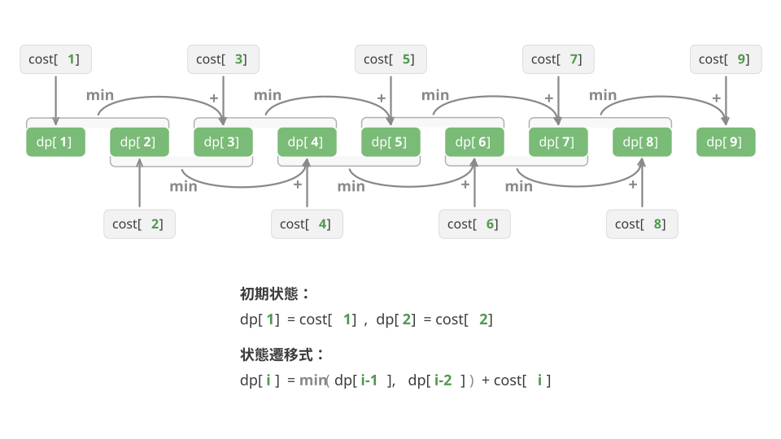

# 動的計画法で解ける問題の特徴

前節では、動的計画法が元の問題を部分問題に分けて解く仕組みを学びました。部分問題への分解は広く使われる考え方で、分割統治法、動的計画法、バックトラックでは着目する点が異なります。

- 分割統治法では、互いに独立した複数の部分問題に元の問題を再帰的に分け、最小の部分問題に到達します。再帰から戻る際に部分問題の解を組み合わせ、最終的に元の問題の解を得ます。
- 動的計画法でも問題を再帰的に分解します。分割統治法との主な違いは、部分問題が互いに依存し、分解の途中で同じ部分問題が何度も現れることです。
- バックトラックでは、選択を試しては取り消し、可能な解を網羅します。不要な分岐の探索は枝刈りで省きます。元の問題の解は一連の選択で構成され、各選択の直前までの列を 1 つの部分問題とみなせます。

動的計画法は、最適化問題を解くためによく使われます。そのような問題には部分問題の重複に加え、最適部分構造と、過去の経緯が以後の選択に影響しないという 2 つの特徴があります。

## 最適部分構造

最適部分構造の考え方が見えやすくなるように、階段の問題を少し変えてみましょう。

!!! question "階段を登る最小コスト"

    1 歩で $1$ 段または $2$ 段登れる階段があります。各段には非負整数が書かれており、その段を踏むときに支払うコストを表します。非負整数配列 $cost$ が与えられ、$cost[i]$ は $i$ 段目を踏むコスト、$cost[0]$ は地面（出発点）を表します。最上段に着くまでに支払うコストの最小値を求めてください。

下図のように、$1$、$2$、$3$ 段目のコストがそれぞれ $1$、$10$、$1$ なら、地面から $3$ 段目まで登る最小コストは $2$ です。


$dp[i]$ を $i$ 段目までに支払う累積コストとします。$i$ 段目に来る直前にいたのは $i - 1$ 段目か $i - 2$ 段目なので、$dp[i]$ は $dp[i - 1] + cost[i]$ か $dp[i - 2] + cost[i]$ のどちらかです。コストを最小にするには、小さい方を選びます。

$$
dp[i] = \min(dp[i-1], dp[i-2]) + cost[i]
$$

ここから最適部分構造の意味がわかります。**元の問題の最適解を、部分問題の最適解から組み立てられる**という性質です。

この問題には最適部分構造があります。2 つの部分問題の最適解 $dp[i-1]$ と $dp[i-2]$ のうち、よりよい方を選び、元の問題 $dp[i]$ の最適解を構成できるからです。

では、前節の階段の問題にも最適部分構造はあるでしょうか。登り方の数を求めるので、一見すると単なる数え上げです。ところが「登り方を最大で何通り数えられるか」と問い直すと、**問題の意味は同じまま、最適部分構造が見えてきます**。$n$ 段目までの登り方の最大数は、$n-1$ 段目と $n-2$ 段目までの登り方の最大数の和です。このように最適部分構造の捉え方には幅があり、問題に応じて意味合いが変わります。

状態遷移式と初期状態 $dp[1] = cost[1]$、$dp[2] = cost[2]$ から、動的計画法を次のように実装できます。

```src
[file]{min_cost_climbing_stairs_dp}-[class]{}-[func]{min_cost_climbing_stairs_dp}
```

このコードによる動的計画法の手順を下図に示します。



この問題でも使用メモリを削減できます。1 次元配列を個々の変数に置き換えると、空間計算量は $O(n)$ から $O(1)$ に下がります。

```src
[file]{min_cost_climbing_stairs_dp}-[class]{}-[func]{min_cost_climbing_stairs_dp_comp}
```

## 過去の経緯に依存しない性質

動的計画法を有効に使うための重要な性質の 1 つに、過去の経緯に依存しないことがあります。つまり、**ある状態が決まれば、その先の展開は現在の状態だけで決まり、そこに至るまでにどの状態を経たかには依存しません**。

階段の問題では、状態 $i$ から $i+1$ または $i+2$ に進めます。それぞれ $1$ 段、$2$ 段登る場合です。この 2 つの選択を考える際、$i$ より前の状態を調べる必要はありません。それらは $i$ から先の展開に影響しないからです。

ところが、階段の問題に制約を加えると事情が変わります。

!!! question "制約付きの階段の登り方"

    $n$ 段の階段があります。1 歩で $1$ 段または $2$ 段登れますが、**$1$ 段ずつ 2 回続けて登ることはできません**。最上段までの登り方は何通りありますか。

下図のように、$3$ 段目までの登り方は $2$ 通りだけです。$1$ 段ずつ 3 回続けて登る方法は制約に反するため除外します。


直前の 1 歩で $1$ 段登った場合、次は必ず $2$ 段登らなければなりません。つまり、**次の選択は現在の状態（今いる段）だけでは決まらず、1 つ前の状態（直前にいた段）にも依存します**。

この定義では、過去の経緯に依存しないという性質が失われ、状態遷移式 $dp[i] = dp[i-1] + dp[i-2]$ も成り立ちません。$dp[i-1]$ は今回 $1$ 段登る場合に対応しますが、その中には「直前に $1$ 段登ってきた」場合が多数含まれます。制約を守るには、$dp[i-1]$ をそのまま $dp[i]$ に加えることはできません。

そこで状態の定義を拡張します。**状態 $[i, j]$ は、$i$ 段目にいて、直前の 1 歩で $j$ 段登ったことを表します**。ここで $j \in \{1, 2\}$ です。これなら直前に $1$ 段登ったのか $2$ 段登ったのかを区別でき、現在の状態にどこから到達できるかを判断できます。

- 直前に $1$ 段登った場合、その 1 歩前に選べたのは $2$ 段だけです。したがって、$dp[i, 1]$ へは $dp[i-1, 2]$ からしか遷移できません。
- 直前に $2$ 段登った場合、その 1 歩前には $1$ 段と $2$ 段のどちらも選べます。したがって、$dp[i, 2]$ へは $dp[i-2, 1]$ または $dp[i-2, 2]$ から遷移できます。

下図のように、この定義では $dp[i, j]$ が状態 $[i, j]$ に対応する登り方の数を表します。状態遷移式は次のようになります。

$$
\begin{cases}
dp[i, 1] = dp[i-1, 2] \\
dp[i, 2] = dp[i-2, 1] + dp[i-2, 2]
\end{cases}
$$


最後に $dp[n, 1] + dp[n, 2]$ を返します。この 2 つの値の和が $n$ 段目までの登り方の総数です。

```src
[file]{climbing_stairs_constraint_dp}-[class]{}-[func]{climbing_stairs_constraint_dp}
```

この例で余分に考慮する必要があったのは 1 つ前の状態だけでした。状態の定義を拡張すれば、以後の選択を再び現在の状態だけで決められます。しかし、過去の経緯が強く影響する問題もあります。

!!! question "障害物が現れる階段"

    $n$ 段の階段を、1 歩で $1$ 段または $2$ 段登れます。**登って $i$ 段目に着くと、自動的に $2i$ 段目に障害物が置かれ、それ以降は $2i$ 段目に着地できません**。たとえば、最初の 2 歩で順に $2$ 段目と $3$ 段目に着いたら、その後は $4$ 段目と $6$ 段目には着地できません。最上段までの登り方は何通りですか。

この問題では、次の 1 歩が過去のすべての状態に依存します。1 歩進むたびに上の方の段に障害物が置かれ、その先の選択に影響するからです。このような問題は、動的計画法では解きにくいことがよくあります。

巡回セールスマン問題など、複雑な組合せ最適化問題の多くは、過去の経緯に依存しないという性質を満たしません。このような問題では、ヒューリスティック探索、遺伝的アルゴリズム、強化学習などの別の手法を使い、限られた時間で実用に足る局所最適解を求めるのが一般的です。
