# 動的プログラミング問題解決アプローチ

前の2つのセクションでは、動的プログラミング問題の主要な特徴を紹介しました。次に、より実用的な2つの問題を一緒に探索しましょう。

1. 問題が動的プログラミング問題かどうかをどのように判断するか？
2. 動的プログラミング問題を解決する完全なステップは何か？

## 問題の判定

一般的に言えば、問題が重複する部分問題、最適部分構造を含み、無記憶性を示す場合、通常動的プログラミング解法に適しています。しかし、問題の説明から直接これらの特徴を抽出することはしばしば困難です。したがって、通常は条件を緩和し、**まず問題がバックトラッキング（全探索）を使用した解決に適しているかどうかを観察**します。

**バックトラッキングに適した問題は通常「決定木モデル」に適合**し、これは木構造を使用して記述でき、各ノードは決定を表し、各パスは決定のシーケンスを表します。

言い換えると、問題が明示的な決定概念を含み、解が一連の決定を通じて生成される場合、それは決定木モデルに適合し、通常バックトラッキングを使用して解決できます。

この基礎の上で、動的プログラミング問題を判定するための「ボーナスポイント」があります。

- 問題に最大化（最小化）または最も（最も少ない）最適な解を見つけるという記述が含まれている。
- 問題の状態がリスト、多次元行列、または木を使用して表現でき、状態がその周囲の状態と再帰関係を持っている。

対応して、「ペナルティポイント」もあります。

- 問題の目標は最適解だけでなく、すべての可能な解を見つけることである。
- 問題の説明に順列と組み合わせの明らかな特徴があり、特定の複数の解を返す必要がある。

問題が決定木モデルに適合し、比較的明らかな「ボーナスポイント」を持つ場合、それが動的プログラミング問題であると仮定し、解決プロセス中に検証できます。

## 問題解決ステップ

動的プログラミング問題解決プロセスは問題の性質と難易度によって異なりますが、一般的に次のステップに従います：決定の記述、状態の定義、$dp$ テーブルの確立、状態遷移方程式の導出、境界条件の決定など。

問題解決ステップをより具体的に説明するために、古典的な問題「最小経路和」を例として使用します。

!!! question

    $n \times m$ の二次元グリッド `grid` が与えられ、グリッドの各セルには負でない整数が含まれ、そのセルのコストを表します。ロボットは左上のセルから始まり、各ステップで下または右にのみ移動でき、右下のセルに到達するまで続けます。左上から右下への最小経路和を返してください。

下の図は例を示しており、与えられたグリッドの最小経路和は $13$ です。

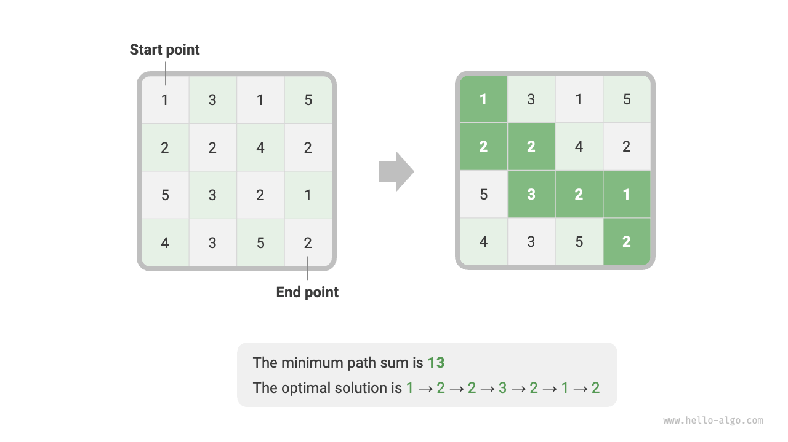

**第1ステップ：各ラウンドの決定を考え、状態を定義し、それにより $dp$ テーブルを得る**

この問題の各ラウンドの決定は、現在のセルから下または右に1ステップ移動することです。現在のセルの行と列のインデックスが $[i, j]$ であると仮定すると、下または右に移動した後、インデックスは $[i+1, j]$ または $[i, j+1]$ になります。したがって、状態には2つの変数が含まれるべきです：行インデックスと列インデックス、$[i, j]$ と表記されます。

状態 $[i, j]$ は部分問題に対応します：開始点 $[0, 0]$ から $[i, j]$ への最小経路和、$dp[i, j]$ と表記されます。

このようにして、下の図に示す二次元 $dp$ 行列を得ます。そのサイズは入力グリッド $grid$ と同じです。

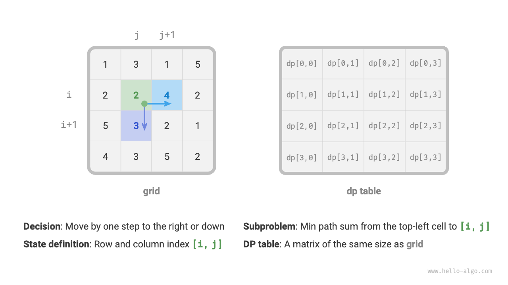

!!! note

    動的プログラミングとバックトラッキングは決定のシーケンスとして記述でき、状態はすべての決定変数から構成されます。問題解決の進行を記述するすべての変数を含むべきで、次の状態を導出するのに十分な情報を含んでいる必要があります。

    各状態は部分問題に対応し、すべての部分問題の解を保存するための $dp$ テーブルを定義します。状態の各独立変数は $dp$ テーブルの次元です。本質的に、$dp$ テーブルは状態と部分問題の解の間のマッピングです。

**第2ステップ：最適部分構造を特定し、状態遷移方程式を導出する**

状態 $[i, j]$ について、それは上のセル $[i-1, j]$ または左のセル $[i, j-1]$ からのみ導出できます。したがって、最適部分構造は：$[i, j]$ に到達する最小経路和は、$[i, j-1]$ と $[i-1, j]$ の最小経路和の小さい方によって決定されます。

上記の分析に基づいて、下の図に示す状態遷移方程式を導出できます：

$$
dp[i, j] = \min(dp[i-1, j], dp[i, j-1]) + grid[i, j]
$$

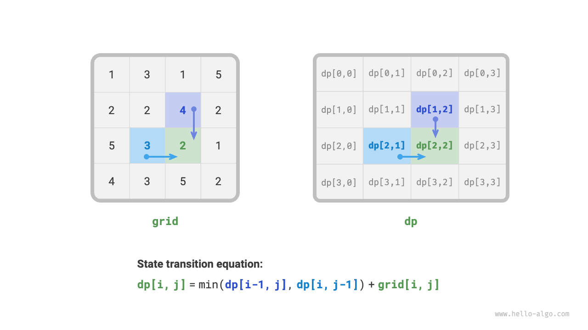

!!! note

    定義された $dp$ テーブルに基づいて、元の問題と部分問題の関係を考え、部分問題の最適解から元の問題の最適解をどのように構築するか、つまり最適部分構造を見つけます。

    最適部分構造を特定したら、それを使用して状態遷移方程式を構築できます。

**第3ステップ：境界条件と状態遷移順序を決定する**

この問題では、最初の行の状態は左の状態からのみ来ることができ、最初の列の状態は上の状態からのみ来ることができるため、最初の行 $i = 0$ と最初の列 $j = 0$ が境界条件です。

下の図に示すように、各セルは左のセルと上のセルから導出されるため、ループを使用して行列を走査し、外側のループは行を反復し、内側のループは列を反復します。

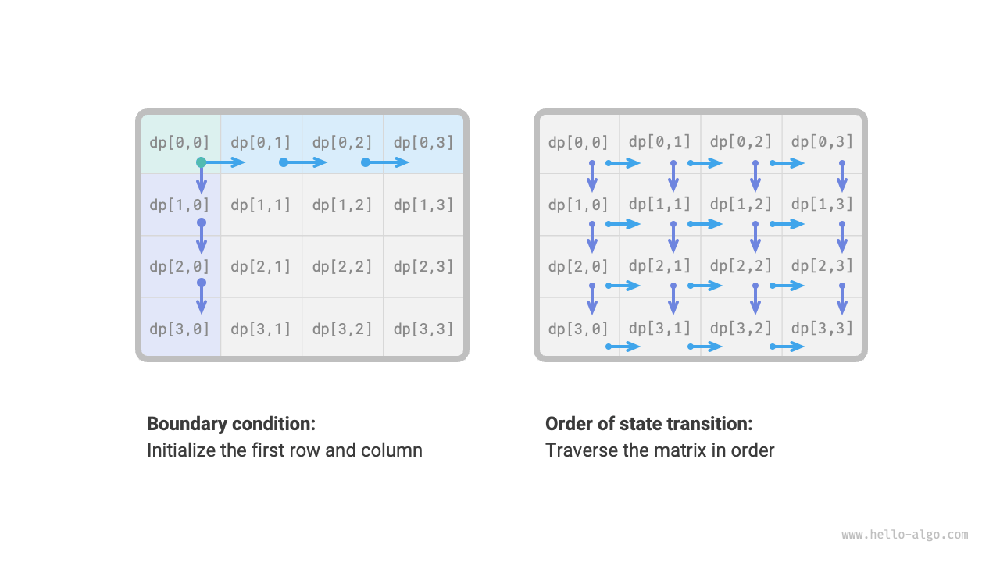

!!! note

    境界条件は動的プログラミングで $dp$ テーブルを初期化するために使用され、探索では枝刈りに使用されます。

    状態遷移順序の核心は、現在の問題の解を計算するとき、それが依存するすべての小さな部分問題が既に正しく計算されていることを確保することです。

上記の分析に基づいて、動的プログラミングコードを直接書くことができます。しかし、部分問題の分解はトップダウンアプローチであるため、「力任せ探索 → メモ化探索 → 動的プログラミング」の順序で実装することが習慣的な思考により適合します。

### 方法1：力任せ探索

状態 $[i, j]$ から探索を開始し、それを常により小さな状態 $[i-1, j]$ と $[i, j-1]$ に分解します。再帰関数には以下の要素が含まれます。

- **再帰パラメータ**：状態 $[i, j]$。
- **戻り値**：$[0, 0]$ から $[i, j]$ への最小経路和 $dp[i, j]$。
- **終了条件**：$i = 0$ かつ $j = 0$ のとき、コスト $grid[0, 0]$ を返す。
- **枝刈り**：$i < 0$ または $j < 0$ でインデックスが範囲外のとき、コスト $+\infty$ を返し、実行不可能性を表す。

実装コードは以下の通りです：

```src
[file]{min_path_sum}-[class]{}-[func]{min_path_sum_dfs}
```

下の図は $dp[2, 1]$ を根とする再帰木を示しており、いくつかの重複する部分問題を含み、その数はグリッド `grid` のサイズが増加すると急激に増加します。

本質的に、重複する部分問題の理由は：**左上隅から特定のセルに到達する複数のパスが存在する**ことです。

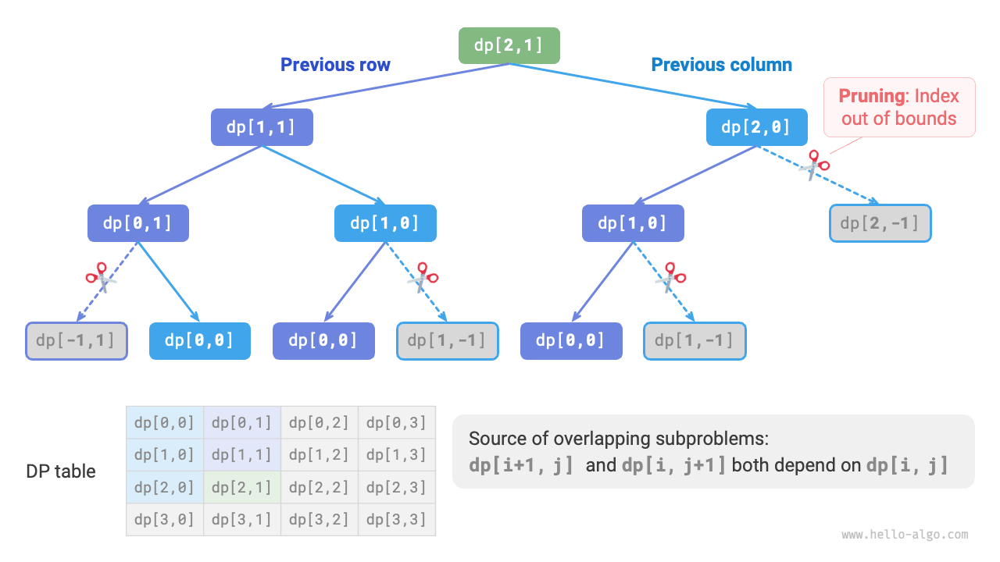

各状態には下と右の2つの選択があるため、左上隅から右下隅までの総ステップ数は $m + n - 2$ で、最悪時間計算量は $O(2^{m + n})$ です。この計算方法はグリッドエッジ近くの状況を考慮していないことに注意してください。ネットワークエッジに到達したとき、選択肢が1つしか残らないため、実際のパス数はより少なくなります。

### 方法2：メモ化探索

グリッド `grid` と同じサイズのメモリスト `mem` を導入し、様々な部分問題の解を記録し、重複する部分問題を枝刈りします：

```src
[file]{min_path_sum}-[class]{}-[func]{min_path_sum_dfs_mem}
```

下の図に示すように、メモ化を導入した後、すべての部分問題の解は一度だけ計算される必要があるため、時間計算量は状態の総数、つまりグリッドサイズ $O(nm)$ に依存します。

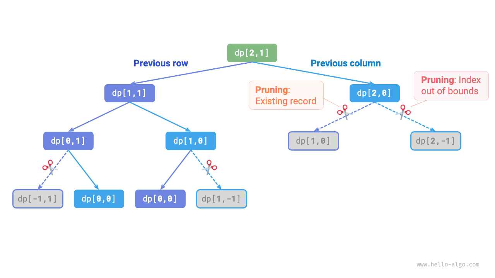

### 方法3：動的プログラミング

動的プログラミング解法を反復的に実装します。コードは以下の通りです：

```src
[file]{min_path_sum}-[class]{}-[func]{min_path_sum_dp}
```

下の図は最小経路和の状態遷移プロセスを示し、グリッド全体を走査するため、**時間計算量は $O(nm)$** です。

配列 `dp` のサイズは $n \times m$ であるため、**空間計算量は $O(nm)$** です。

=== "<1>"
    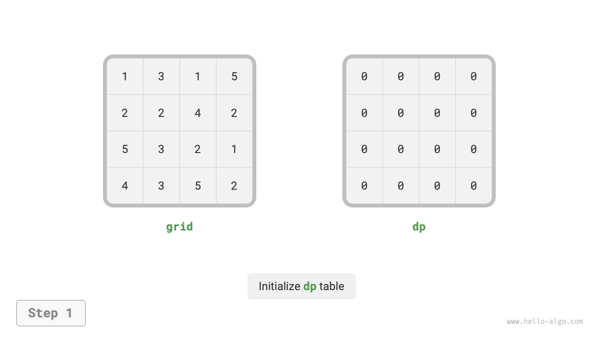

=== "<2>"
    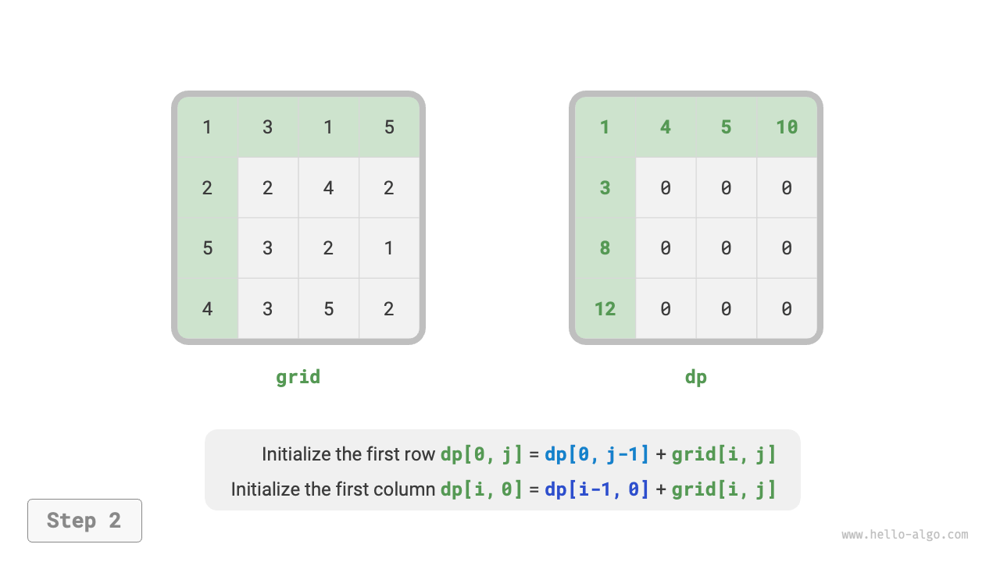

=== "<3>"
    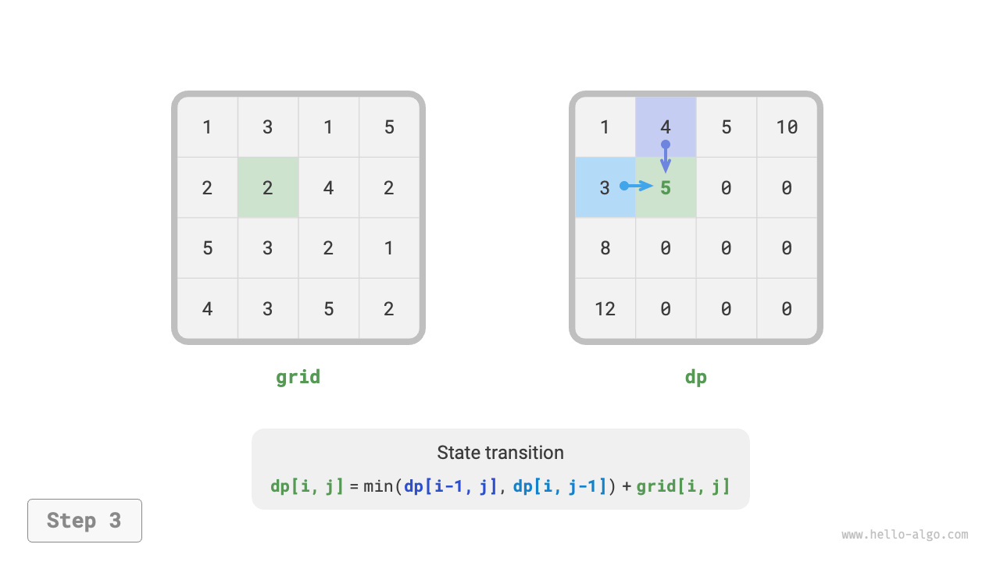

=== "<4>"
    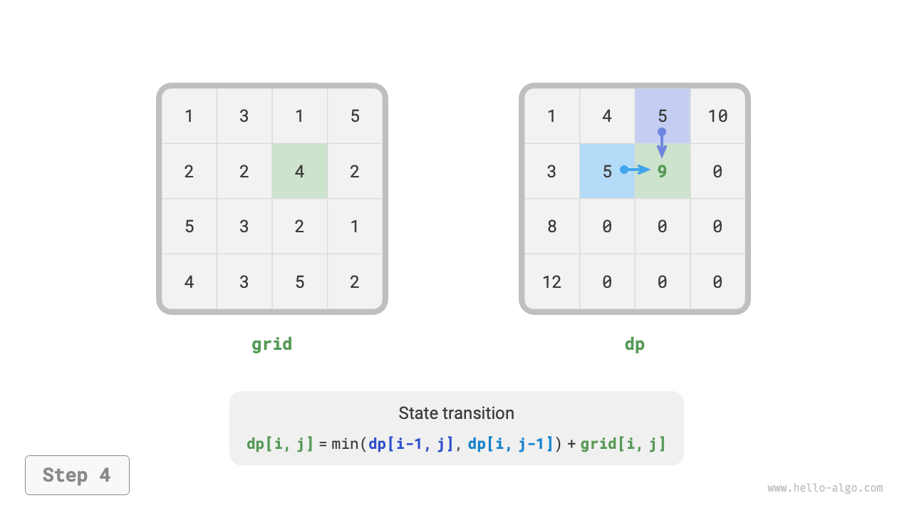

=== "<5>"
    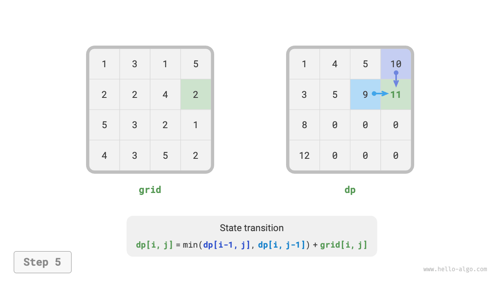

=== "<6>"
    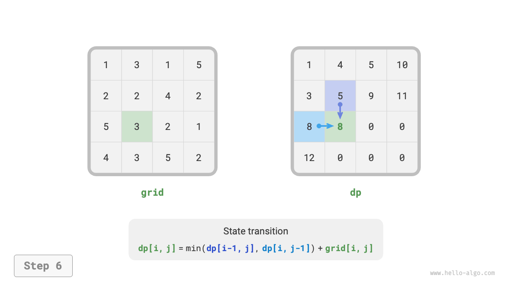

=== "<7>"
    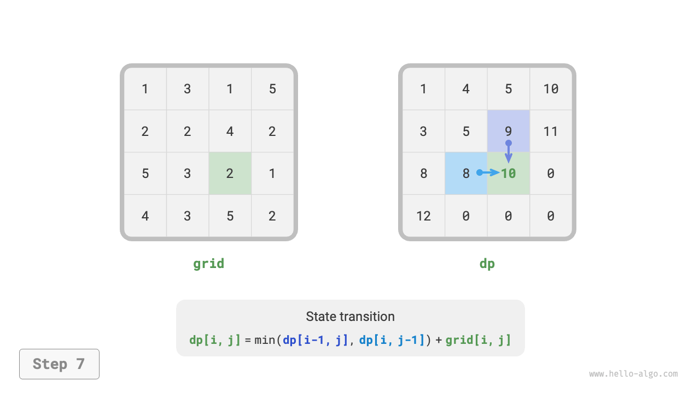

=== "<8>"
    

=== "<9>"
    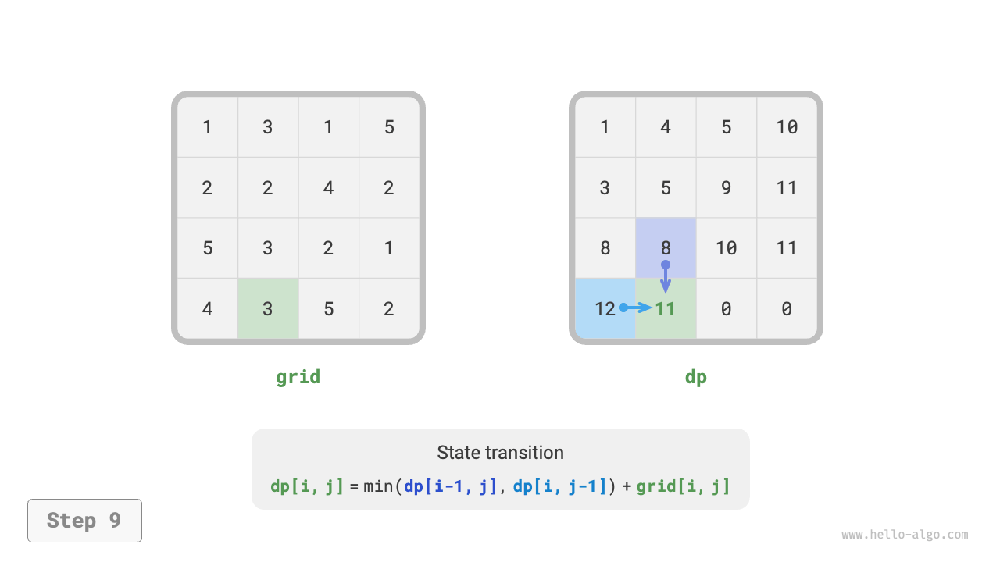

=== "<10>"
    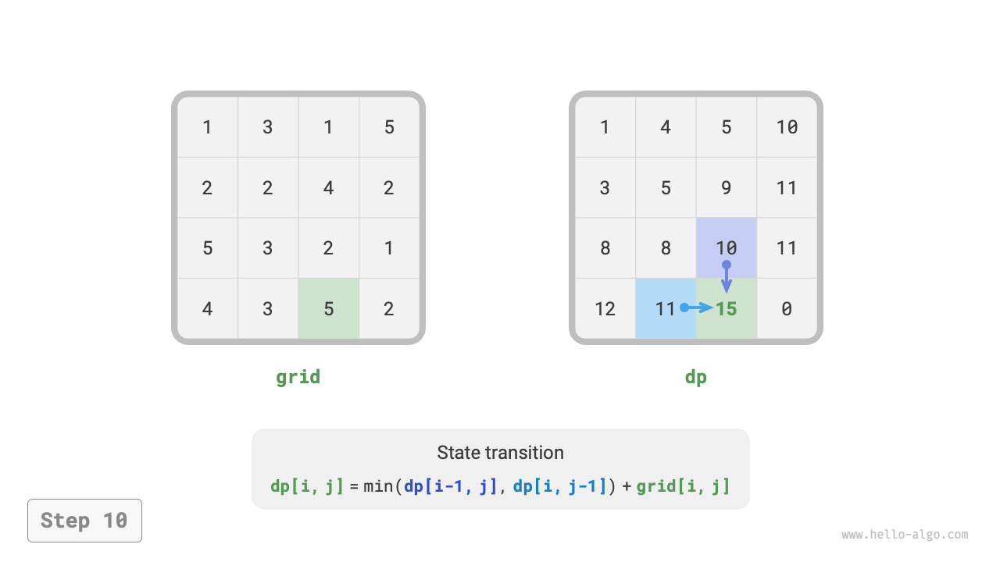

=== "<11>"
    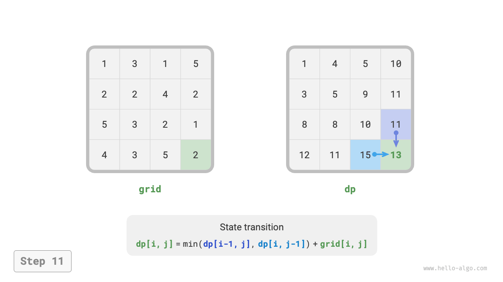

=== "<12>"
    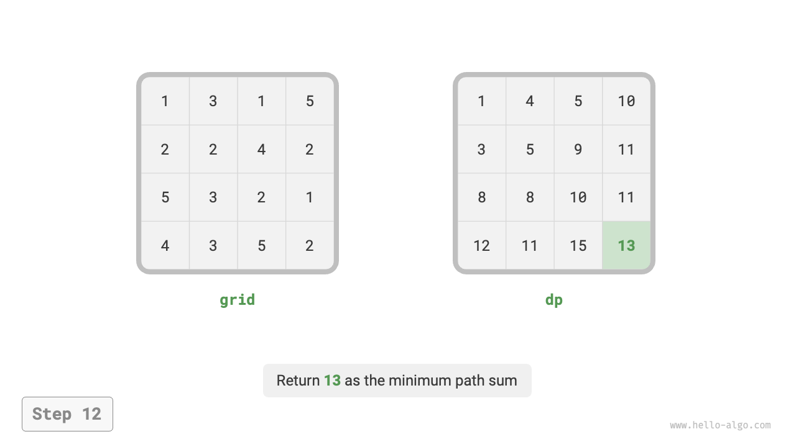

### 空間最適化

各セルは左と上のセルのみに関連するため、単一行配列を使用して $dp$ テーブルを実装できます。

配列 `dp` は1行の状態のみを表現できるため、最初の列の状態を事前に初期化できず、各行を走査するときに更新することに注意してください：

```src
[file]{min_path_sum}-[class]{}-[func]{min_path_sum_dp_comp}
```
