# 動的計画法の問題解決の考え方

前の 2 節では動的計画法の問題の主要な特徴を紹介しました。ここからは、さらに実用的な 2 つの問題を一緒に考えていきます。

1. ある問題が動的計画法の問題かどうかを、どのように判断すればよいでしょうか？
2. 動的計画法の問題を解くには、どこから着手し、完全な手順はどのようなものでしょうか？

## 問題の判定

一般に、ある問題が重複部分問題と最適部分構造を含み、さらに無後效性を満たしているなら、通常は動的計画法で解くのに適しています。しかし、問題文からこれらの性質を直接読み取るのは簡単ではありません。そのため通常は条件を少し緩めて、**まずその問題がバックトラッキング（全探索）で解くのに適しているか**を観察します。

**バックトラッキングで解くのに適した問題は、通常「決定木モデル」を満たします**。この種の問題は木構造で表現でき、各ノードは 1 つの決定を表し、各経路は 1 つの決定列を表します。

言い換えると、問題に明確な決定の概念が含まれており、解が一連の決定によって生成されるなら、その問題は決定木モデルを満たし、通常はバックトラッキングで解くことができます。

これに加えて、動的計画法の問題には判定のための「加点要素」もあります。

- 問題文に最大（最小）や最多（最少）などの最適化に関する記述がある。
- 問題の状態が配列、多次元行列、または木で表現でき、ある状態とその周辺の状態の間に漸化的な関係がある。

反対に、「減点要素」もあります。

- 問題の目的が最適解を求めることではなく、あり得るすべての解を列挙することである。
- 問題文に明確な順列・組合せの特徴があり、具体的な複数の解を返す必要がある。

ある問題が決定木モデルを満たし、さらに比較的明確な「加点要素」を備えているなら、その問題は動的計画法の問題であると仮定し、解く過程でそれを検証できます。

## 問題を解く手順

動的計画法の解法の流れは問題の性質や難易度によって異なりますが、通常は次の手順に従います。すなわち、決定を記述し、状態を定義し、$dp$ テーブルを構築し、状態遷移方程式を導出し、境界条件を定めます。

解法の手順をより具体的に示すために、ここでは古典的な問題である「最小経路和」を例にします。

!!! question

    $n \times m$ の 2 次元グリッド `grid` が与えられます。グリッドの各セルには非負整数が格納されており、そのセルのコストを表します。ロボットは左上のセルを始点とし、毎回下または右に 1 マスだけ移動して、右下のセルまで進みます。左上から右下までの最小経路和を返してください。

次の図は 1 つの例を示しており、このグリッドの最小経路和は $13$ です。

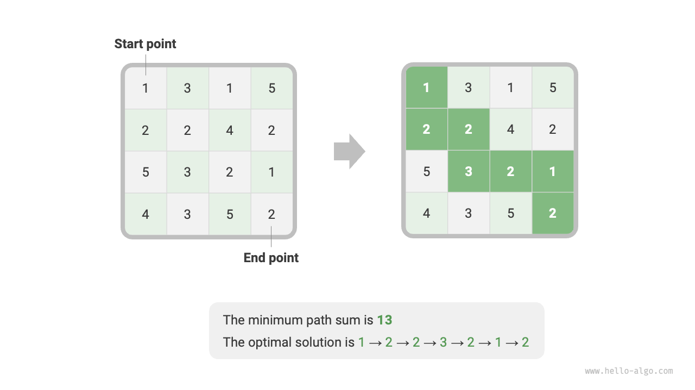

**ステップ 1：各ラウンドの決定を考え、状態を定義して、$dp$ テーブルを得る**

この問題における各ラウンドの決定は、現在のマスから下または右へ 1 マス進むことです。現在のマスの行・列インデックスを $[i, j]$ とすると、下または右へ 1 マス進んだ後のインデックスは $[i+1, j]$ または $[i, j+1]$ になります。したがって、状態には行インデックスと列インデックスの 2 つの変数を含め、$[i, j]$ と表します。

状態 $[i, j]$ に対応する部分問題は、始点 $[0, 0]$ から $[i, j]$ まで進む最小経路和であり、その解を $dp[i, j]$ と記します。

これで、次の図に示す 2 次元の $dp$ 行列が得られます。そのサイズは入力グリッド $grid$ と同じです。

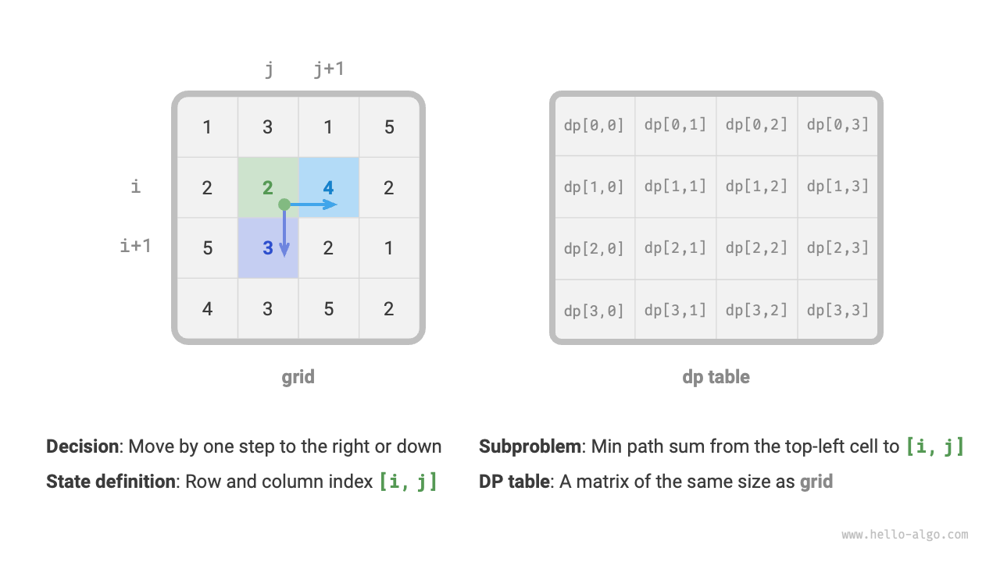

!!! note

    動的計画法とバックトラッキングの過程は、いずれも 1 つの決定列として記述できます。そして状態は、すべての決定変数から構成されます。状態には解法の進行状況を表すすべての変数が含まれているべきであり、次の状態を導くのに十分な情報を持っている必要があります。
    
    各状態は 1 つの部分問題に対応しており、すべての部分問題の解を保存するために $dp$ テーブルを定義します。状態の各独立変数は、$dp$ テーブルの 1 つの次元に対応します。本質的に、$dp$ テーブルは状態と部分問題の解との対応関係です。

**ステップ 2：最適部分構造を見つけ、状態遷移方程式を導出する**

状態 $[i, j]$ は、上のマス $[i-1, j]$ または左のマス $[i, j-1]$ からしか遷移してきません。したがって最適部分構造は、$[i, j]$ に到達する最小経路和が、$[i, j-1]$ の最小経路和と $[i-1, j]$ の最小経路和のうち小さい方によって決まる、ということです。

以上の分析から、次の図に示す状態遷移方程式を導くことができます。

$$
dp[i, j] = \min(dp[i-1, j], dp[i, j-1]) + grid[i, j]
$$

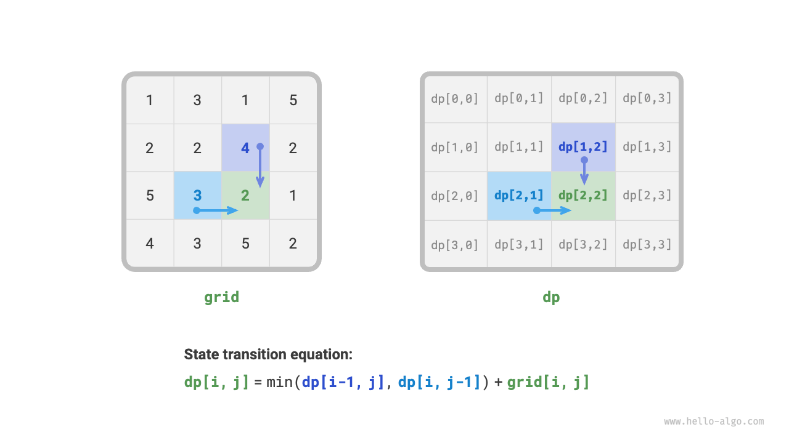

!!! note

    定義済みの $dp$ テーブルに基づいて、元の問題と部分問題の関係を考え、部分問題の最適解から元の問題の最適解を構成する方法、すなわち最適部分構造を見つけます。

    ひとたび最適部分構造が見つかれば、それを使って状態遷移方程式を構築できます。

**ステップ 3：境界条件と状態遷移の順序を決める**

この問題では、先頭行にある状態は左の状態からしか得られず、先頭列にある状態は上の状態からしか得られません。したがって、先頭行 $i = 0$ と先頭列 $j = 0$ が境界条件になります。

次の図に示すように、各マスは左のマスと上のマスから遷移してくるため、ループを用いて行列を走査します。外側のループで各行を、内側のループで各列を走査します。

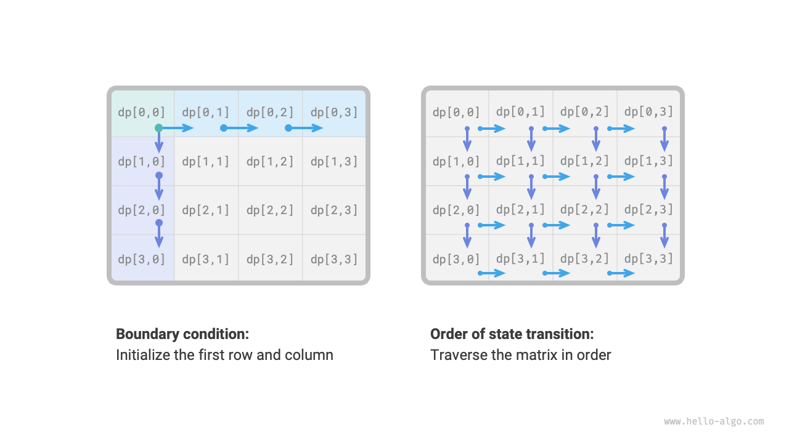

!!! note

    境界条件は、動的計画法では $dp$ テーブルの初期化に使われ、探索では枝刈りに使われます。
    
    状態遷移の順序で重要なのは、現在の問題の解を計算するときに、それが依存するより小さな部分問題の解がすべてすでに正しく計算済みであることを保証する点です。

以上の分析により、すでに動的計画法のコードを直接書くことができます。しかし、部分問題への分解はトップダウンの考え方であるため、「力任せ探索 $\rightarrow$ メモ化探索 $\rightarrow$ 動的計画法」の順に実装するほうが、思考の流れにはより自然です。

### 方法 1：力任せ探索

状態 $[i, j]$ から探索を開始し、より小さな状態 $[i-1, j]$ と $[i, j-1]$ へと分解していきます。再帰関数には次の要素が含まれます。

- **再帰引数**：状態 $[i, j]$ 。
- **戻り値**：$[0, 0]$ から $[i, j]$ までの最小経路和 $dp[i, j]$ 。
- **終了条件**：$i = 0$ かつ $j = 0$ のとき、コスト $grid[0, 0]$ を返す。
- **枝刈り**：$i < 0$ または $j < 0$ でインデックスが範囲外になった場合、コスト $+\infty$ を返し、実行不可能であることを表す。

実装コードは次のとおりです。

```src
[file]{min_path_sum}-[class]{}-[func]{min_path_sum_dfs}
```

次の図は、$dp[2, 1]$ を根ノードとする再帰木を示しています。この中にはいくつかの重複部分問題が含まれており、その数はグリッド `grid` のサイズが大きくなるにつれて急激に増加します。

本質的に、重複部分問題が生じる理由は、**左上からあるセルへ到達する経路が複数存在すること**にあります。

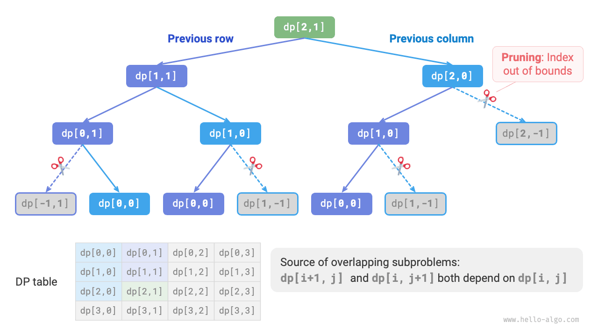

各状態には下と右の 2 通りの選択肢があり、左上から右下まで進むには合計で $m + n - 2$ 歩必要です。したがって最悪時間計算量は $O(2^{m + n})$ です。ここで、$n$ と $m$ はそれぞれグリッドの行数と列数を表します。なお、この見積もりではグリッド境界付近の状況を考慮していません。境界に達すると選択肢は 1 つだけになるため、実際の経路数はこれより少なくなります。

### 方法 2：メモ化探索

グリッド `grid` と同じサイズのメモ配列 `mem` を導入し、各部分問題の解を記録して、重複部分問題を枝刈りします。

```src
[file]{min_path_sum}-[class]{}-[func]{min_path_sum_dfs_mem}
```

次の図に示すように、メモ化を導入すると、すべての部分問題の解は 1 回だけ計算すればよくなります。したがって時間計算量は状態総数、すなわちグリッドサイズの $O(nm)$ に依存します。

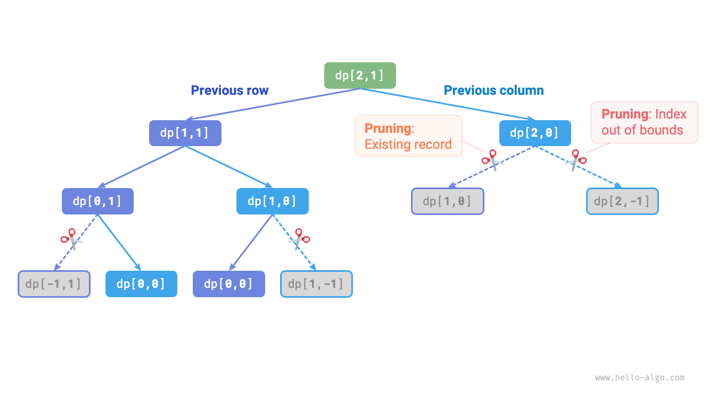

### 方法 3：動的計画法

反復に基づいて動的計画法の解法を実装すると、コードは次のようになります。

```src
[file]{min_path_sum}-[class]{}-[func]{min_path_sum_dp}
```

次の図は最小経路和の状態遷移の過程を示しています。グリッド全体を走査するため、**時間計算量は $O(nm)$** です。

配列 `dp` のサイズは $n \times m$ であるため、**空間計算量は $O(nm)$** です。

=== "<1>"
    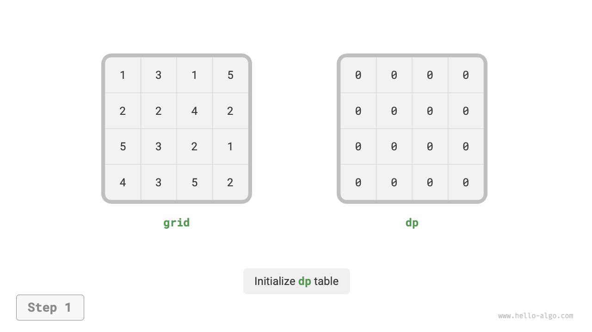

=== "<2>"
    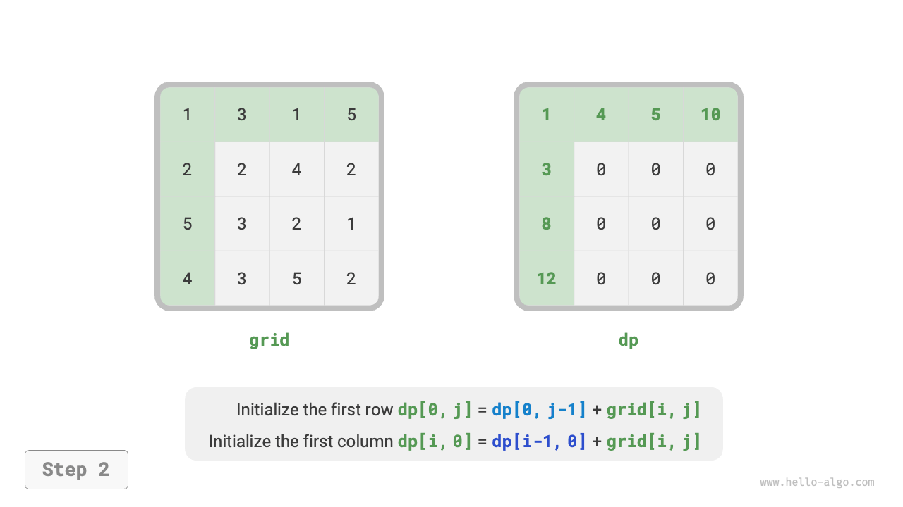

=== "<3>"
    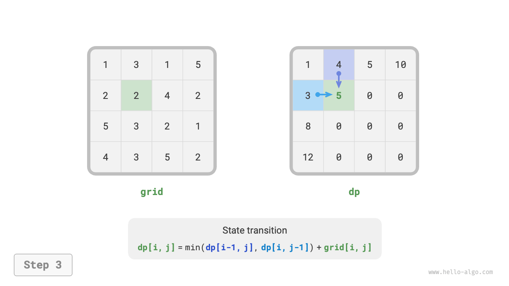

=== "<4>"
    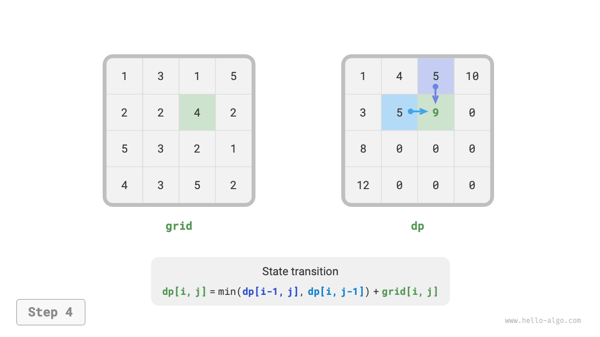

=== "<5>"
    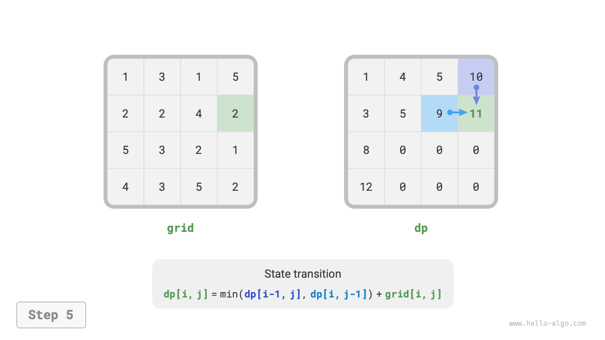

=== "<6>"
    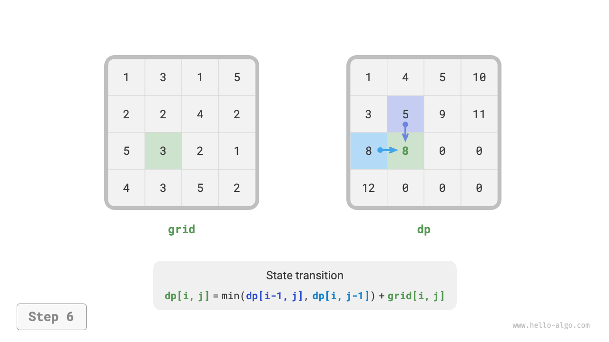

=== "<7>"
    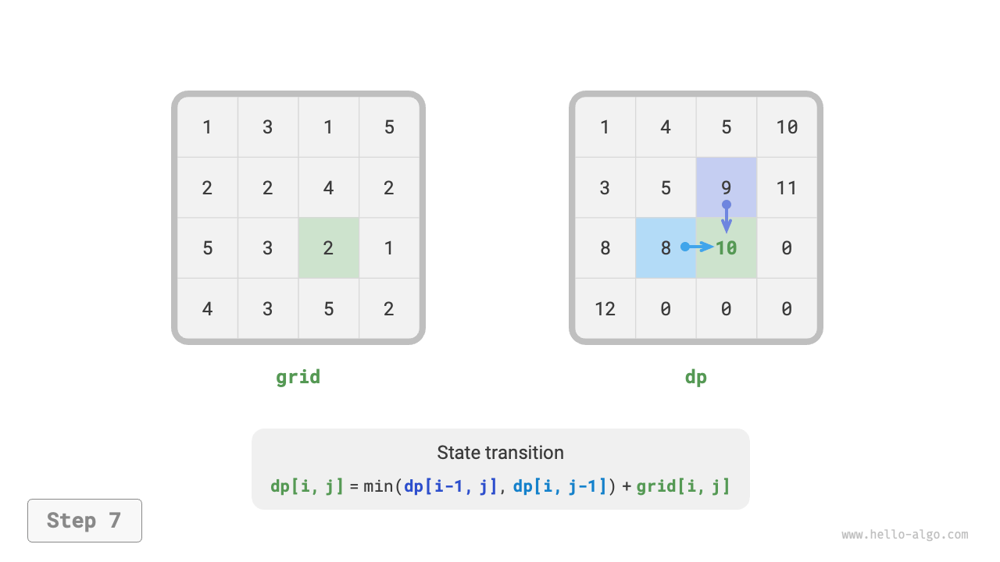

=== "<8>"
    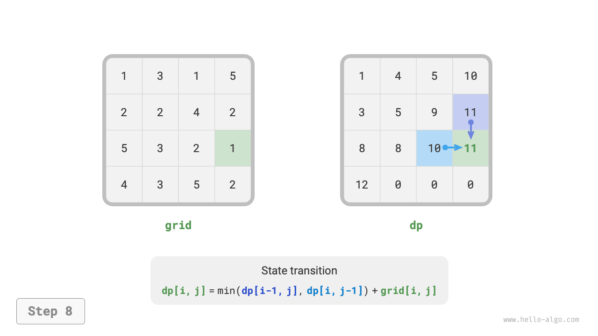

=== "<9>"
    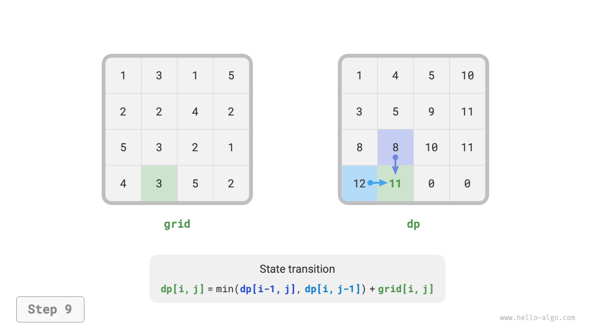

=== "<10>"
    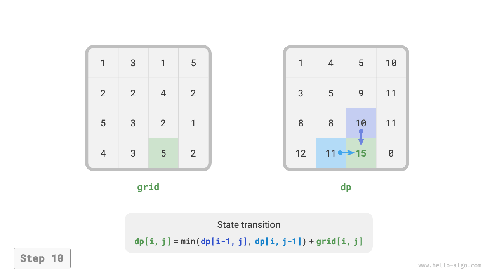

=== "<11>"
    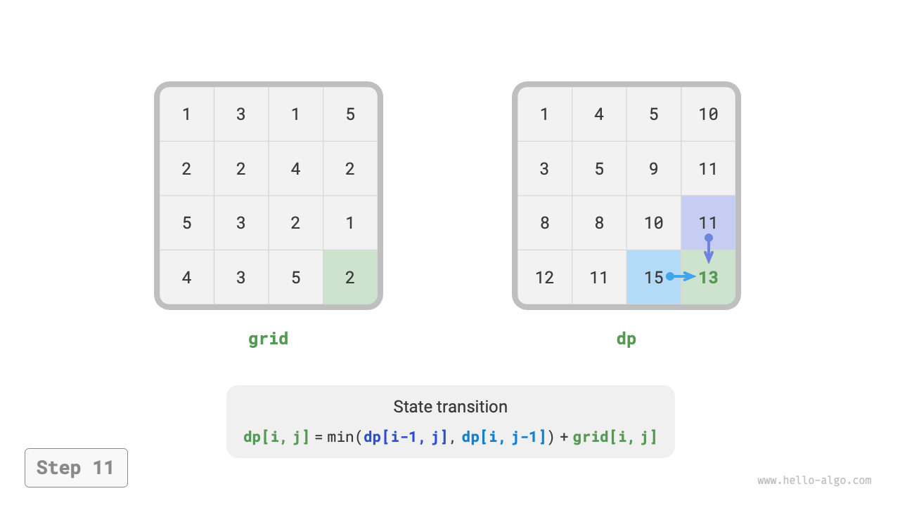

=== "<12>"
    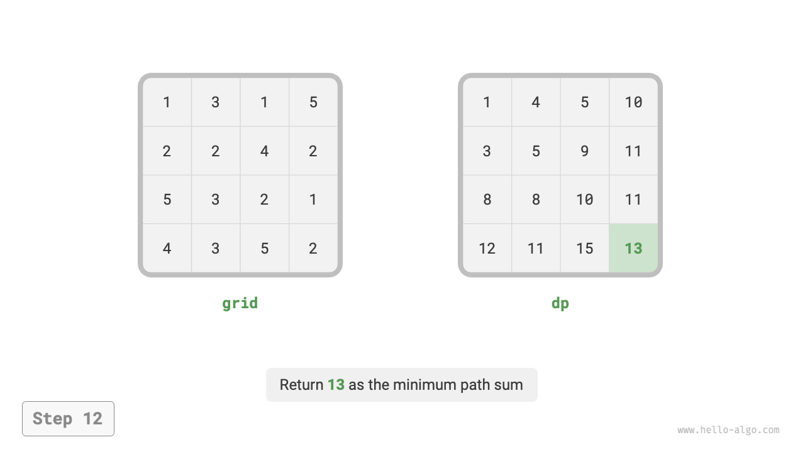

### 空間最適化

各マスは左のマスと上のマスにのみ関係するため、1 行の配列だけを使って $dp$ テーブルを実装できます。

ただし、配列 `dp` は 1 行分の状態しか表せないため、先頭列の状態を事前に初期化することはできず、各行を走査するときに更新する必要があります。

```src
[file]{min_path_sum}-[class]{}-[func]{min_path_sum_dp_comp}
```
