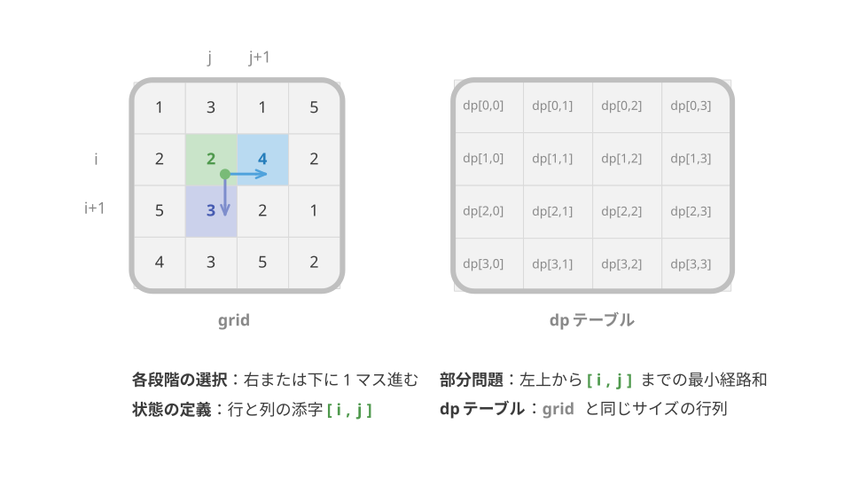
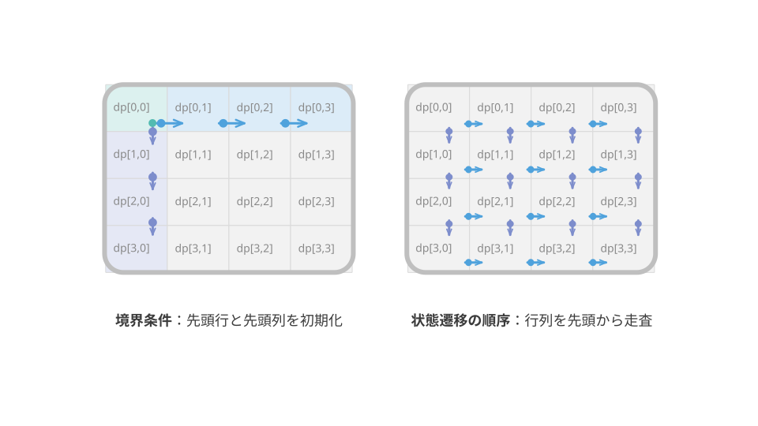
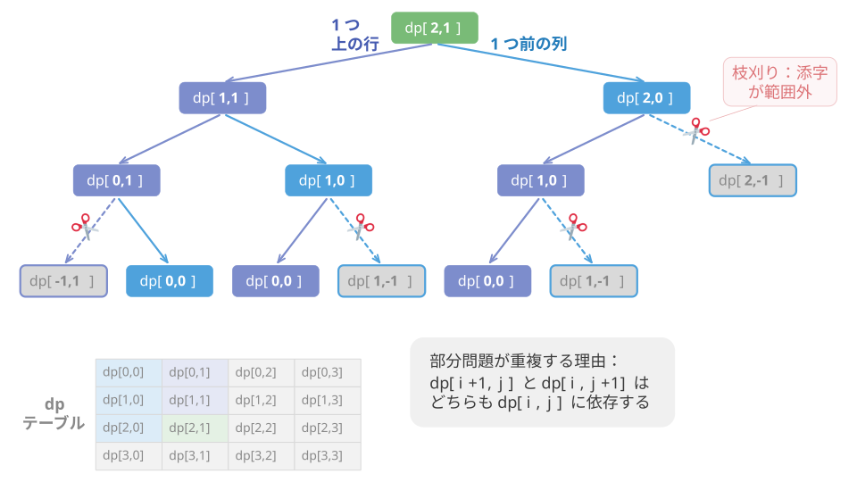
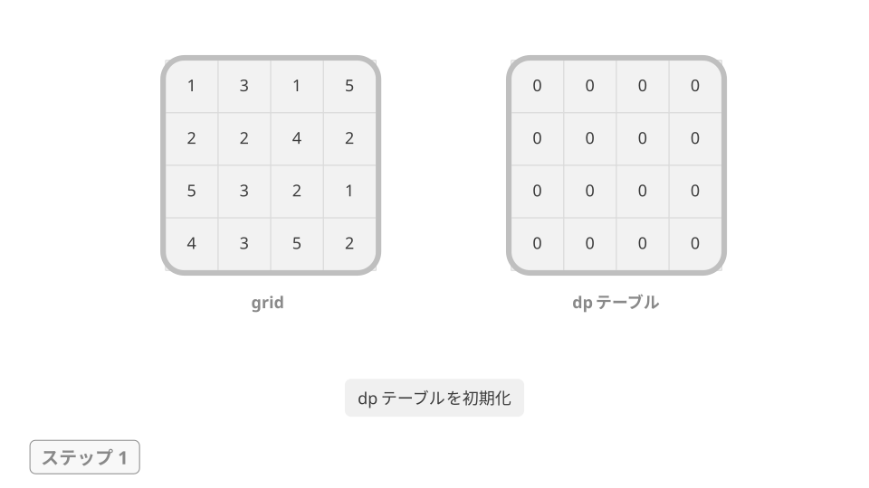
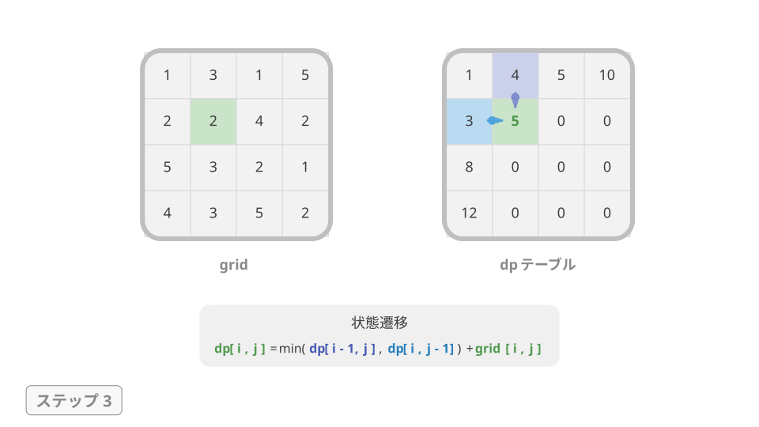
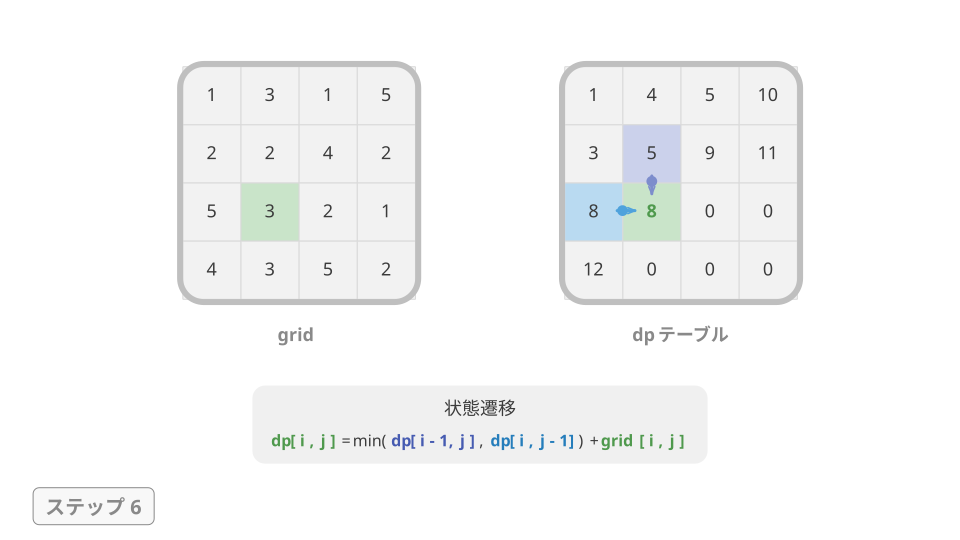
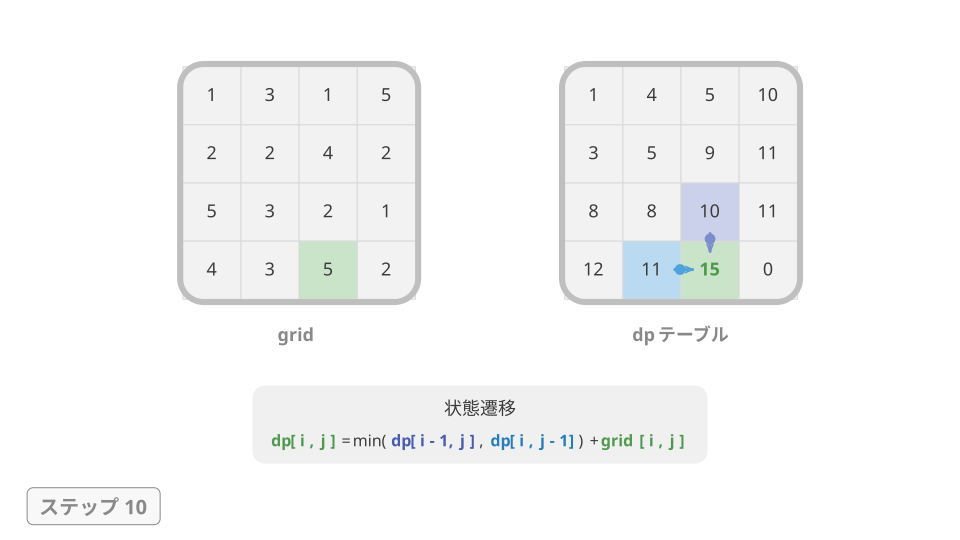
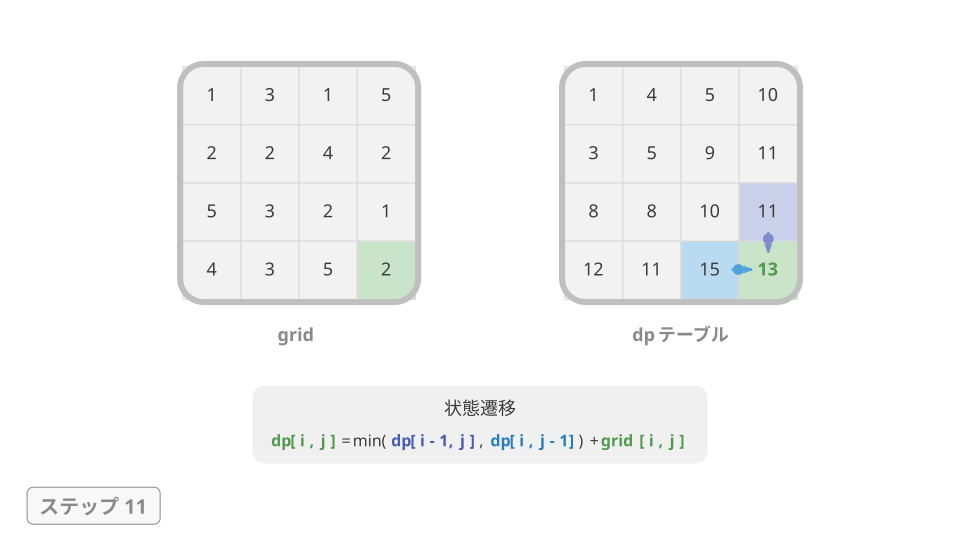

# 動的計画法で解くための考え方

前の 2 節では、動的計画法で解ける問題の主な特徴を学びました。ここからは、実際に解くときに役立つ 2 つの問いを考えます。

1. 動的計画法に適した問題かどうかを、どのように判断すればよいでしょうか。
2. 動的計画法で解くにはどこから始め、どのような手順で進めればよいでしょうか。

## 問題の見極め方

一般に、部分問題の重複と最適部分構造があり、以後の選択が過去の経緯に依存しない問題は、動的計画法で解くのに適しています。ただし、問題文からこれらを直接読み取るのは難しいため、条件を緩めて、**まずはバックトラック（全探索）で解きやすいかを考えます**。

**バックトラックに適した問題は、多くの場合「決定木」で表せます**。各ノードが 1 回の選択を表し、各経路が一連の選択を表す木構造です。

言い換えると、何を選ぶかが明確で、一連の選択によって解が得られる問題なら、決定木で表すことができ、通常はバックトラックで解けます。

そのうえで、次の特徴があれば動的計画法に向いている可能性が高まります。

- 最大値や最小値、最多や最少といった最適化が求められています。
- 状態をリスト、多次元配列、あるいは木で表せて、ある状態とその周囲の状態の間に漸化式が成り立ちます。

逆に、次の特徴があると動的計画法には向かない可能性があります。

- 目的が最適解を求めることではなく、考えられるすべての解を求めることです。
- 順列や組合せを扱うことが問題文から明らかで、具体的な解を複数返す必要があります。

決定木で表せて、動的計画法に向いている特徴がはっきりしていれば、まずは動的計画法が使えると仮定し、解く過程で確かめられます。

## 問題を解く手順

動的計画法で解く手順は問題の性質や難しさによって異なりますが、通常は、各段階の選択を整理し、状態を定義し、$dp$ テーブルを作り、状態遷移式を導き、境界条件を決める、という流れになります。

具体的な手順を、代表的な「最小経路和」の問題で見ていきましょう。

!!! question

    $n \times m$ の 2 次元グリッド `grid` が与えられます。各マスには、そのマスのコストを表す非負整数が入っています。ロボットは左上のマスから出発し、1 歩で下か右に 1 マスずつ進んで右下のマスを目指します。左上から右下までの経路和の最小値を返してください。

下図の例では、与えられたグリッドの最小経路和は $13$ です。


**手順 1：各段階の選択を考え、状態を定義して $dp$ テーブルを作る**

各段階での選択は、今いるマスから下に 1 マス進むか、右に 1 マス進むかです。現在の行と列の添字を $[i, j]$ とすると、下に進めば $[i+1, j]$、右に進めば $[i, j+1]$ になります。そこで状態には行と列の添字という 2 つの変数を含め、$[i, j]$ と表します。

状態 $[i, j]$ に対応する部分問題は、始点 $[0, 0]$ から $[i, j]$ までの最小経路和を求めることです。その解を $dp[i, j]$ と書きます。

こうして下図の 2 次元の $dp$ 行列が得られます。大きさは入力グリッド $grid$ と同じです。



!!! note

    動的計画法もバックトラックも、一連の選択として表せます。状態を構成するのは選択に関わる変数です。どこまで解き進めたかを表す変数をすべて含めることで、次の状態を導くために十分な情報がそろいます。
    
    各状態には部分問題が 1 つ対応します。すべての部分問題の解を保存する $dp$ テーブルを定義すると、状態に含まれる独立した変数がそれぞれ $dp$ テーブルの 1 つの次元に対応します。つまり、$dp$ テーブルは状態と部分問題の解の対応表です。

**手順 2：最適部分構造を見つけ、状態遷移式を導く**

状態 $[i, j]$ に遷移できるのは、上のマス $[i-1, j]$ と左のマス $[i, j-1]$ だけです。したがって、$[i, j]$ までの最小経路和は、$[i, j-1]$ までの最小経路和と $[i-1, j]$ までの最小経路和のうち小さい方で決まります。これが最適部分構造です。

以上から、下図の状態遷移式が得られます。

$$
dp[i, j] = \min(dp[i-1, j], dp[i, j-1]) + grid[i, j]
$$


!!! note

    定義した $dp$ テーブルをもとに、元の問題と部分問題の関係を考えます。部分問題の最適解から元の問題の最適解を組み立てる方法、すなわち最適部分構造を見つけましょう。

    最適部分構造がわかれば、それをもとに状態遷移式を組み立てられます。

**手順 3：境界条件と状態遷移の順序を決める**

先頭行の状態には左の状態からしか到達できず、先頭列の状態には上の状態からしか到達できません。そこで、先頭行 $i = 0$ と先頭列 $j = 0$ が境界条件になります。

下図のように各マスへは左と上のマスから遷移するので、行列を二重ループで走査し、外側のループで行を、内側のループで列を順にたどります。



!!! note

    境界条件は、動的計画法では $dp$ テーブルの初期化に、探索では枝刈りに使います。
    
    状態遷移の順序を決める際に大切なのは、ある問題の解を求める時点で、その計算に必要な小さい部分問題がすべて正しく解けていることです。

ここまでの考察から、動的計画法のコードを直接書くこともできます。ただ、部分問題への分解はトップダウンの発想なので、「全探索 $\rightarrow$ メモ化探索 $\rightarrow$ 動的計画法」の順に実装すると自然に考えを進められます。

### 方法 1：全探索

状態 $[i, j]$ から探索を始め、より小さい状態 $[i-1, j]$ と $[i, j-1]$ に繰り返し分解します。再帰関数を構成する要素は次のとおりです。

- **再帰関数の引数**：状態 $[i, j]$ です。
- **戻り値**：$[0, 0]$ から $[i, j]$ までの最小経路和 $dp[i, j]$ です。
- **終了条件**：$i = 0$ かつ $j = 0$ なら、コスト $grid[0, 0]$ を返します。
- **枝刈り**：$i < 0$ または $j < 0$ なら添字が範囲外です。その経路を使えないことを示すコスト $+\infty$ を返します。

実装は次のとおりです。

```src
[file]{min_path_sum}-[class]{}-[func]{min_path_sum_dfs}
```

下図は $dp[2, 1]$ を根とする再帰木です。部分問題に重複があり、その数はグリッド `grid` が大きくなるにつれて急増します。

部分問題が重複する根本的な理由は、**左上から同じマスに到達する経路が複数あること**です。



各状態では下か右の 2 方向を選べます。左上から右下までは合計 $m + n - 2$ 歩なので、最悪時間計算量は $O(2^{m + n})$ です。ここで $n$ と $m$ はそれぞれ行数と列数です。この見積もりでは境界付近の事情を考慮していません。グリッドの端に着くと選択肢は 1 つになるため、実際の経路数はもう少し少なくなります。

### 方法 2：メモ化探索

グリッド `grid` と同じ大きさのメモ用配列 `mem` に各部分問題の解を記録し、重複する部分問題の探索を枝刈りします。

```src
[file]{min_path_sum}-[class]{}-[func]{min_path_sum_dfs_mem}
```

下図のように、メモ化すると各部分問題の解を 1 回ずつ計算するだけで済みます。時間計算量は状態の総数、すなわちグリッドの大きさ $O(nm)$ で決まります。


### 方法 3：動的計画法

反復による動的計画法の実装を以下に示します。

```src
[file]{min_path_sum}-[class]{}-[func]{min_path_sum_dp}
```

下図は最小経路和を求める状態遷移の過程です。グリッド全体を走査するので、**時間計算量は $O(nm)$ です**。

配列 `dp` の大きさは $n \times m$ なので、**空間計算量は $O(nm)$ です**。

=== "<1>"
    

=== "<2>"
    

=== "<3>"
    

=== "<4>"
    

=== "<5>"
    

=== "<6>"
    

=== "<7>"
    

=== "<8>"
    

=== "<9>"
    

=== "<10>"
    

=== "<11>"
    

=== "<12>"
    

### 使用メモリの削減

各マスが依存するのは左と上のマスだけなので、$dp$ テーブルは 1 行分の配列だけで表せます。

配列 `dp` で表現できる状態は 1 行分だけです。先頭列をあらかじめすべて初期化できないため、各行を走査するときに更新します。

```src
[file]{min_path_sum}-[class]{}-[func]{min_path_sum_dp_comp}
```
