# 14.6 &nbsp; 編集距離問題

編集距離は、レーベンシュタイン距離とも呼ばれ、一つの文字列を別の文字列に変換するために必要な最小修正回数を指し、情報検索や自然言語処理で2つのシーケンス間の類似度を測定するためによく使用されます。

!!! question

    2つの文字列 $s$ と $t$ が与えられたとき、$s$ を $t$ に変換するために必要な最小編集回数を返してください。

    文字列に対して3種類の編集を実行できます：文字の挿入、文字の削除、または文字を他の任意の文字に置換。

下の図に示すように、`kitten` を `sitting` に変換するには3回の編集が必要で、2回の置換と1回の挿入を含みます。`hello` を `algo` に変換するには3ステップが必要で、2回の置換と1回の削除を含みます。

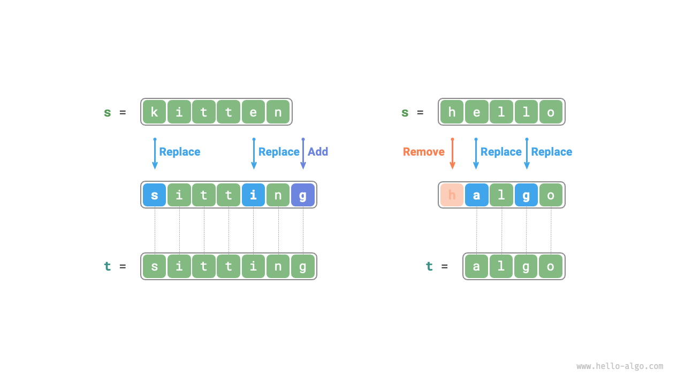{ class="animation-figure" }

<p align="center"> 図 14-27 &nbsp; 編集距離の例データ </p>

**編集距離問題は決定木モデルで自然に説明できます**。文字列は木のノードに対応し、1ラウンドの決定（編集操作）は木のエッジに対応します。

下の図に示すように、操作に制限がない場合、各ノードは多くのエッジを導出でき、それぞれが1つの操作に対応するため、`hello` を `algo` に変換する可能な経路は多数あります。

決定木の観点から、この問題の目標は、ノード `hello` とノード `algo` の間の最短経路を見つけることです。

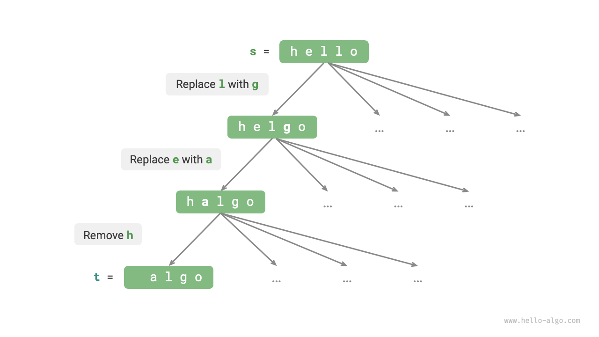{ class="animation-figure" }

<p align="center"> 図 14-28 &nbsp; 決定木モデルに基づいて表現された編集距離問題 </p>

### 1. &nbsp; 動的プログラミングアプローチ

**ステップ1：各ラウンドの決定を考え、状態を定義し、それにより $dp$ テーブルを得る**

各ラウンドの決定は、文字列 $s$ に対して1つの編集操作を実行することを含みます。

編集プロセス中に問題のサイズを段階的に縮小することを目指し、これにより部分問題を構築できます。文字列 $s$ と $t$ の長さをそれぞれ $n$ と $m$ とします。まず、両方の文字列の末尾文字 $s[n-1]$ と $t[m-1]$ を考慮します。

- $s[n-1]$ と $t[m-1]$ が同じ場合、それらをスキップして直接 $s[n-2]$ と $t[m-2]$ を考慮できます。
- $s[n-1]$ と $t[m-1]$ が異なる場合、$s$ に対して1つの編集（挿入、削除、置換）を実行して、2つの文字列の末尾文字を一致させ、それらをスキップしてより小規模な問題を考慮できるようにする必要があります。

したがって、文字列 $s$ での各ラウンドの決定（編集操作）は、$s$ と $t$ でマッチされる残りの文字を変更します。したがって、状態は $s$ と $t$ で現在考慮されている $i$ 番目と $j$ 番目の文字であり、$[i, j]$ と表記されます。

状態 $[i, j]$ は部分問題に対応します：**$s$ の最初の $i$ 文字を $t$ の最初の $j$ 文字に変更するために必要な最小編集回数**。

これから、サイズ $(i+1) \times (j+1)$ の二次元 $dp$ テーブルを得ます。

**ステップ2：最適部分構造を特定し、状態遷移方程式を導出する**

部分問題 $dp[i, j]$ を考慮すると、これに対応する2つの文字列の末尾文字は $s[i-1]$ と $t[j-1]$ であり、下の図に示すように3つのシナリオに分けることができます。

1. $s[i-1]$ の後に $t[j-1]$ を追加すると、残りの部分問題は $dp[i, j-1]$ です。
2. $s[i-1]$ を削除すると、残りの部分問題は $dp[i-1, j]$ です。
3. $s[i-1]$ を $t[j-1]$ に置換すると、残りの部分問題は $dp[i-1, j-1]$ です。

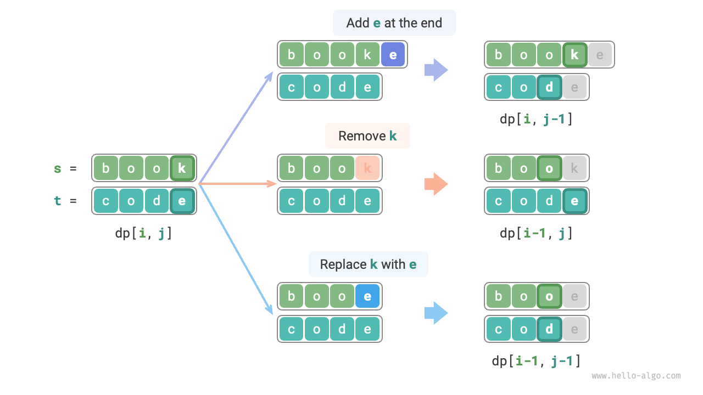{ class="animation-figure" }

<p align="center"> 図 14-29 &nbsp; 編集距離の状態遷移 </p>

上記の分析に基づいて、最適部分構造を決定できます：$dp[i, j]$ の最小編集回数は、$dp[i, j-1]$、$dp[i-1, j]$、$dp[i-1, j-1]$ の中の最小値に編集ステップ $1$ を加えたものです。対応する状態遷移方程式は：

$$
dp[i, j] = \min(dp[i, j-1], dp[i-1, j], dp[i-1, j-1]) + 1
$$

注意してください。**$s[i-1]$ と $t[j-1]$ が同じ場合、現在の文字に対して編集は必要ありません**。この場合、状態遷移方程式は：

$$
dp[i, j] = dp[i-1, j-1]
$$

**ステップ3：境界条件と状態遷移の順序を決定する**

両方の文字列が空の場合、編集回数は $0$ です。つまり、$dp[0, 0] = 0$ です。$s$ が空で $t$ が空でない場合、最小編集回数は $t$ の長さに等しく、つまり最初の行 $dp[0, j] = j$ です。$s$ が空でなく $t$ が空の場合、最小編集回数は $s$ の長さに等しく、つまり最初の列 $dp[i, 0] = i$ です。

状態遷移方程式を観察すると、$dp[i, j]$ の解決は左、上、左上の解に依存するため、二重ループを使用して正しい順序で $dp$ テーブル全体を走査できます。

### 2. &nbsp; コード実装

=== "Python"

    ```python title="edit_distance.py"
    def edit_distance_dp(s: str, t: str) -> int:
        """編集距離：動的プログラミング"""
        n, m = len(s), len(t)
        dp = [[0] * (m + 1) for _ in range(n + 1)]
        # 状態遷移：最初の行と最初の列
        for i in range(1, n + 1):
            dp[i][0] = i
        for j in range(1, m + 1):
            dp[0][j] = j
        # 状態遷移：残りの行と列
        for i in range(1, n + 1):
            for j in range(1, m + 1):
                if s[i - 1] == t[j - 1]:
                    # 2 つの文字が等しい場合、これら 2 つの文字をスキップ
                    dp[i][j] = dp[i - 1][j - 1]
                else:
                    # 最小編集数 = 3 つの操作（挿入、削除、置換）からの最小編集数 + 1
                    dp[i][j] = min(dp[i][j - 1], dp[i - 1][j], dp[i - 1][j - 1]) + 1
        return dp[n][m]
    ```

=== "C++"

    ```cpp title="edit_distance.cpp"
    /* 編集距離：動的プログラミング */
    int editDistanceDP(string s, string t) {
        int n = s.length(), m = t.length();
        vector<vector<int>> dp(n + 1, vector<int>(m + 1, 0));
        // 状態遷移：最初の行と最初の列
        for (int i = 1; i <= n; i++) {
            dp[i][0] = i;
        }
        for (int j = 1; j <= m; j++) {
            dp[0][j] = j;
        }
        // 状態遷移：残りの行と列
        for (int i = 1; i <= n; i++) {
            for (int j = 1; j <= m; j++) {
                if (s[i - 1] == t[j - 1]) {
                    // 2つの文字が等しい場合、これら2つの文字をスキップ
                    dp[i][j] = dp[i - 1][j - 1];
                } else {
                    // 最小編集数 = 3つの操作（挿入、削除、置換）からの最小編集数 + 1
                    dp[i][j] = min(min(dp[i][j - 1], dp[i - 1][j]), dp[i - 1][j - 1]) + 1;
                }
            }
        }
        return dp[n][m];
    }
    ```

=== "Java"

    ```java title="edit_distance.java"
    /* 編集距離：動的プログラミング */
    int editDistanceDP(String s, String t) {
        int n = s.length(), m = t.length();
        int[][] dp = new int[n + 1][m + 1];
        // 状態遷移：最初の行と最初の列
        for (int i = 1; i <= n; i++) {
            dp[i][0] = i;
        }
        for (int j = 1; j <= m; j++) {
            dp[0][j] = j;
        }
        // 状態遷移：残りの行と列
        for (int i = 1; i <= n; i++) {
            for (int j = 1; j <= m; j++) {
                if (s.charAt(i - 1) == t.charAt(j - 1)) {
                    // 2つの文字が等しい場合、これら2つの文字をスキップ
                    dp[i][j] = dp[i - 1][j - 1];
                } else {
                    // 最小編集数 = 3つの操作（挿入、削除、置換）からの最小編集数 + 1
                    dp[i][j] = Math.min(Math.min(dp[i][j - 1], dp[i - 1][j]), dp[i - 1][j - 1]) + 1;
                }
            }
        }
        return dp[n][m];
    }
    ```

=== "C#"

    ```csharp title="edit_distance.cs"
    [class]{edit_distance}-[func]{EditDistanceDP}
    ```

=== "Go"

    ```go title="edit_distance.go"
    [class]{}-[func]{editDistanceDP}
    ```

=== "Swift"

    ```swift title="edit_distance.swift"
    [class]{}-[func]{editDistanceDP}
    ```

=== "JS"

    ```javascript title="edit_distance.js"
    [class]{}-[func]{editDistanceDP}
    ```

=== "TS"

    ```typescript title="edit_distance.ts"
    [class]{}-[func]{editDistanceDP}
    ```

=== "Dart"

    ```dart title="edit_distance.dart"
    [class]{}-[func]{editDistanceDP}
    ```

=== "Rust"

    ```rust title="edit_distance.rs"
    [class]{}-[func]{edit_distance_dp}
    ```

=== "C"

    ```c title="edit_distance.c"
    [class]{}-[func]{editDistanceDP}
    ```

=== "Kotlin"

    ```kotlin title="edit_distance.kt"
    [class]{}-[func]{editDistanceDP}
    ```

=== "Ruby"

    ```ruby title="edit_distance.rb"
    [class]{}-[func]{edit_distance_dp}
    ```

下の図に示すように、編集距離問題の状態遷移プロセスはナップサック問題と非常に似ており、二次元グリッドを埋めることと見なすことができます。

=== "<1>"
    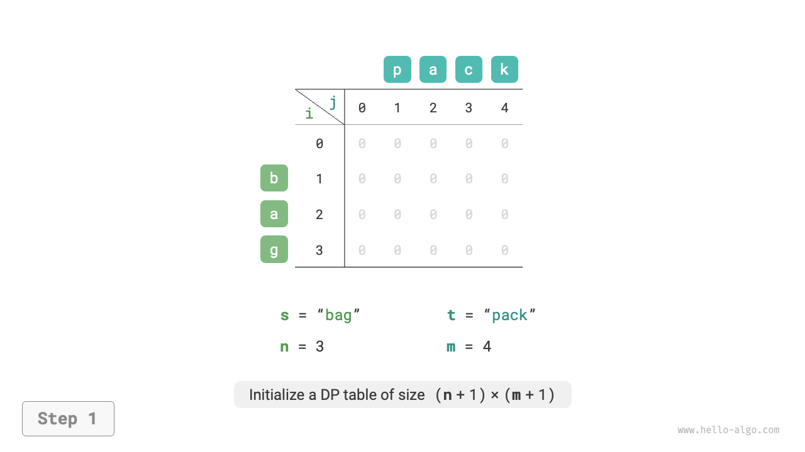{ class="animation-figure" }

=== "<2>"
    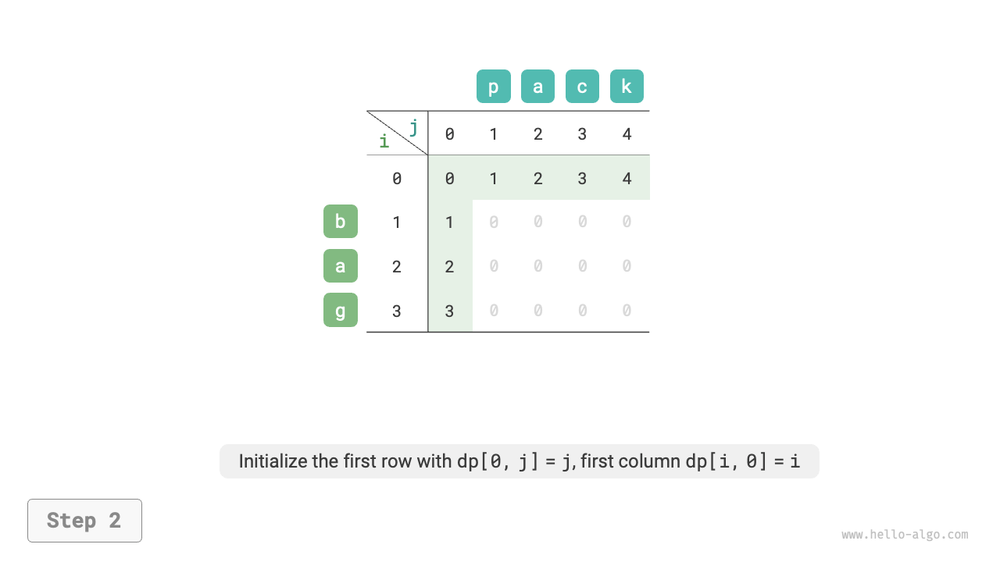{ class="animation-figure" }

=== "<3>"
    { class="animation-figure" }

=== "<4>"
    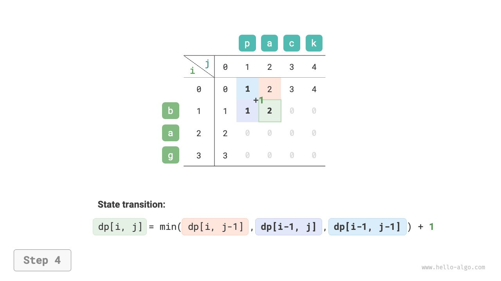{ class="animation-figure" }

=== "<5>"
    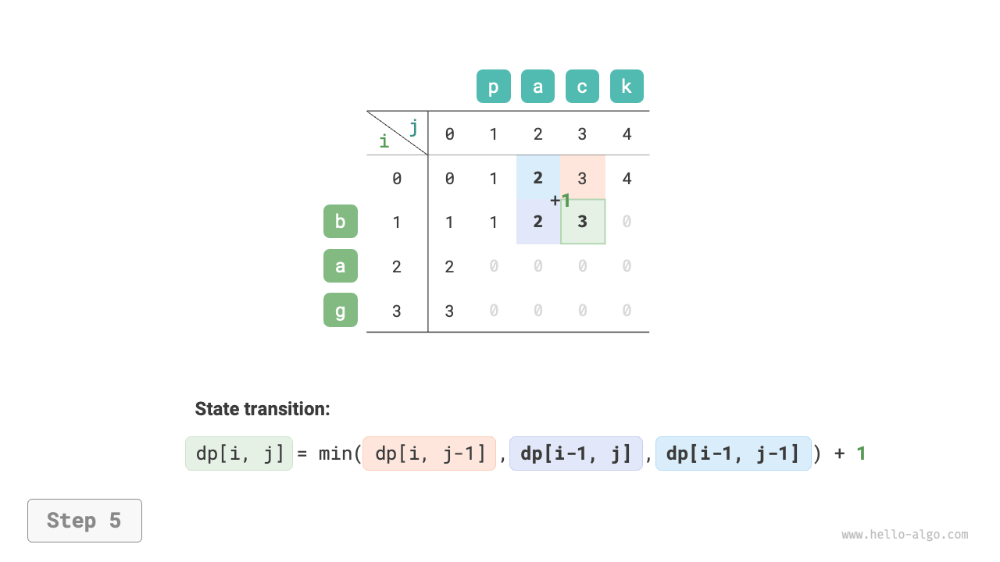{ class="animation-figure" }

=== "<6>"
    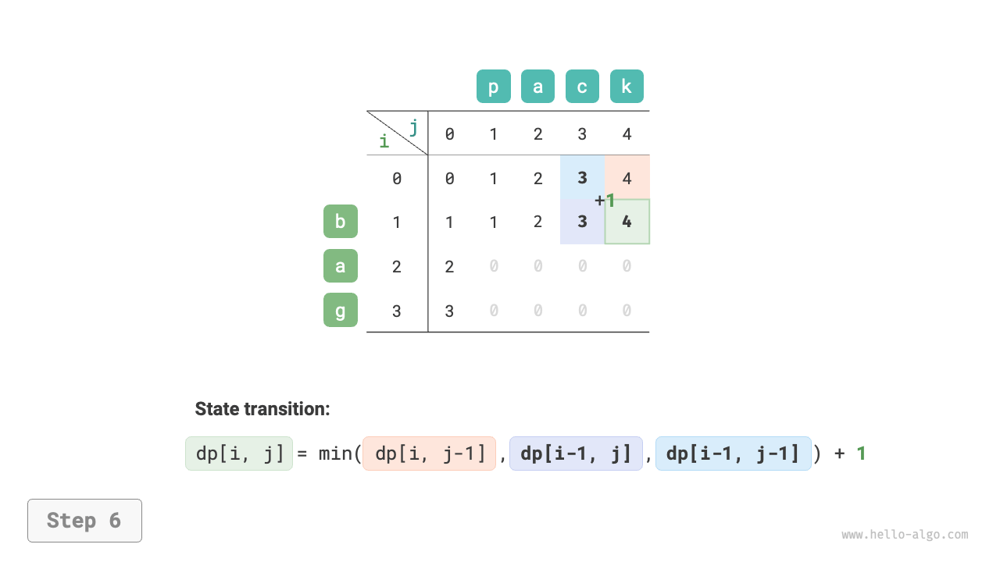{ class="animation-figure" }

=== "<7>"
    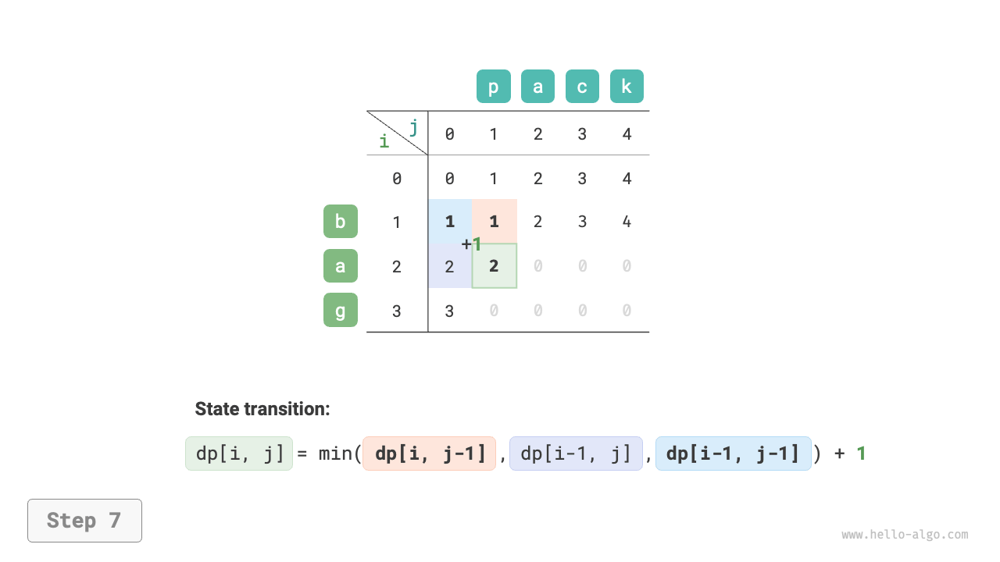{ class="animation-figure" }

=== "<8>"
    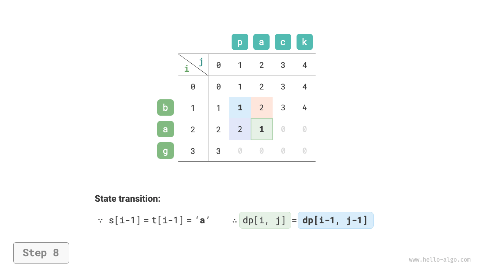{ class="animation-figure" }

=== "<9>"
    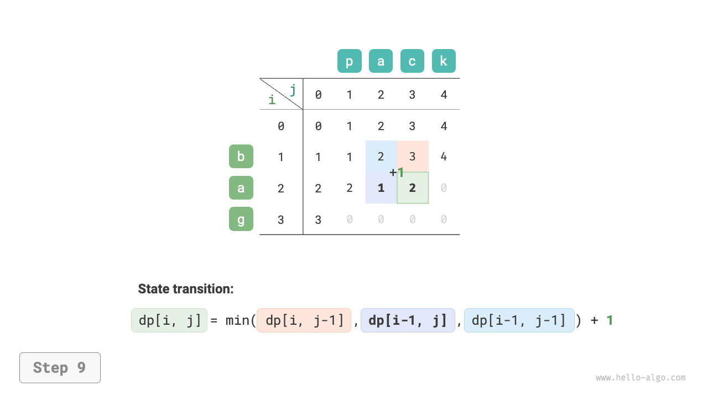{ class="animation-figure" }

=== "<10>"
    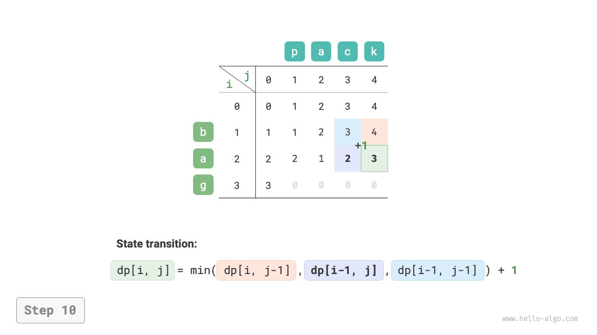{ class="animation-figure" }

=== "<11>"
    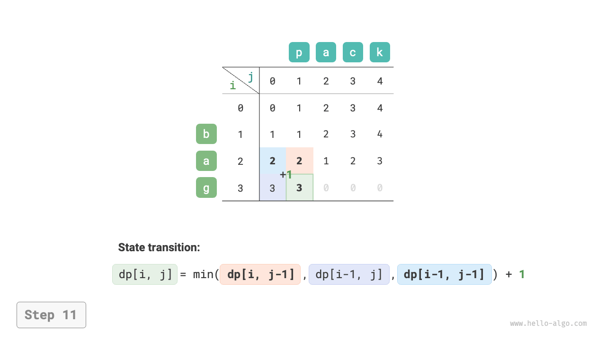{ class="animation-figure" }

=== "<12>"
    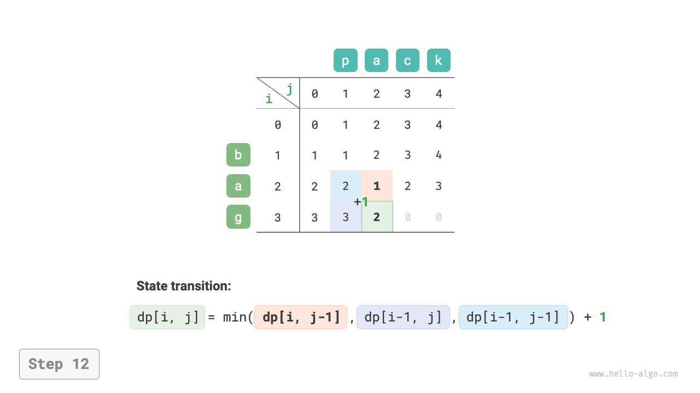{ class="animation-figure" }

=== "<13>"
    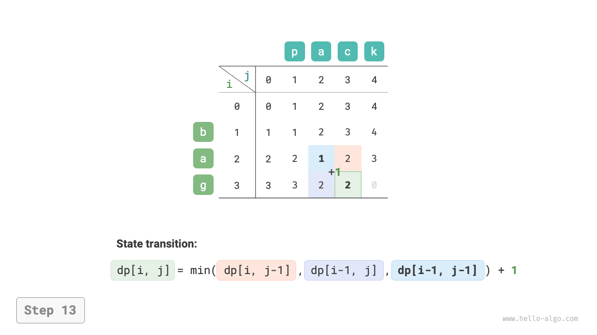{ class="animation-figure" }

=== "<14>"
    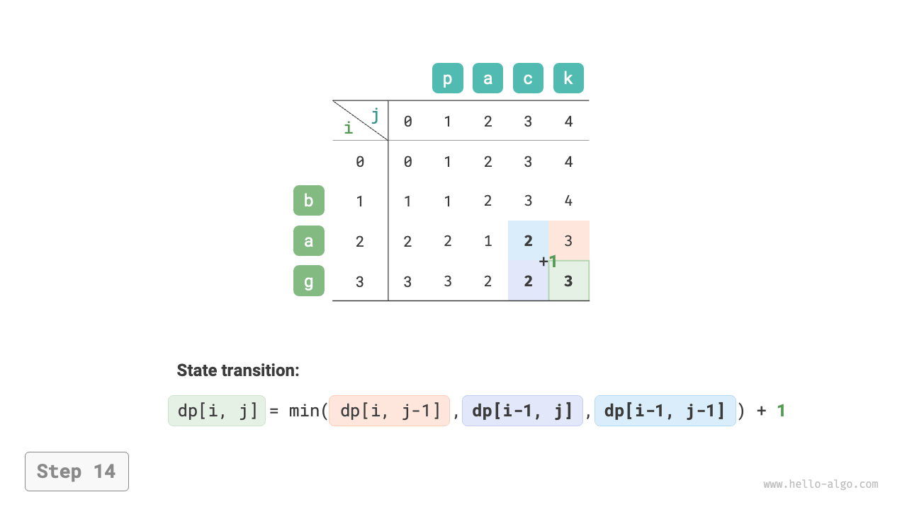{ class="animation-figure" }

=== "<15>"
    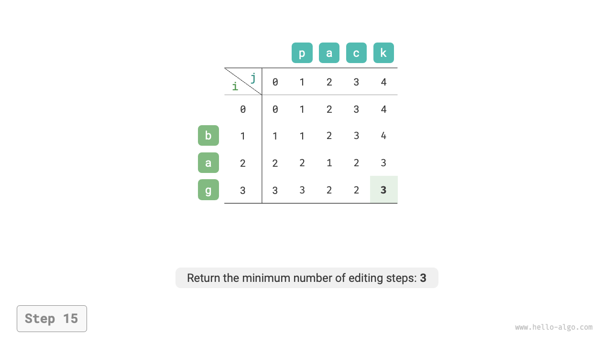{ class="animation-figure" }

<p align="center"> 図 14-30 &nbsp; 編集距離の動的プログラミングプロセス </p>

### 3. &nbsp; 空間最適化

$dp[i, j]$ は上の $dp[i-1, j]$、左の $dp[i, j-1]$、左上の $dp[i-1, j-1]$ の解から導出され、直接走査では左上の解 $dp[i-1, j-1]$ が失われ、逆走査では事前に $dp[i, j-1]$ を構築できないため、どちらの走査順序も実行可能ではありません。

この理由で、変数 `leftup` を使用して左上の $dp[i-1, j-1]$ からの解を一時的に保存し、左と上の解のみを考慮すればよくなります。この状況は無制限ナップサック問題と似ており、直接走査が可能です。コードは以下の通りです：

=== "Python"

    ```python title="edit_distance.py"
    def edit_distance_dp_comp(s: str, t: str) -> int:
        """編集距離：空間最適化動的プログラミング"""
        n, m = len(s), len(t)
        dp = [0] * (m + 1)
        # 状態遷移：最初の行
        for j in range(1, m + 1):
            dp[j] = j
        # 状態遷移：残りの行
        for i in range(1, n + 1):
            # 状態遷移：最初の列
            leftup = dp[0]  # dp[i-1, j-1] を一時的に保存
            dp[0] += 1
            # 状態遷移：残りの列
            for j in range(1, m + 1):
                temp = dp[j]
                if s[i - 1] == t[j - 1]:
                    # 2 つの文字が等しい場合、これら 2 つの文字をスキップ
                    dp[j] = leftup
                else:
                    # 最小編集数 = 3 つの操作（挿入、削除、置換）からの最小編集数 + 1
                    dp[j] = min(dp[j - 1], dp[j], leftup) + 1
                leftup = temp  # 次の dp[i-1, j-1] のために更新
        return dp[m]
    ```

=== "C++"

    ```cpp title="edit_distance.cpp"
    [class]{}-[func]{editDistanceDPComp}
    ```

=== "Java"

    ```java title="edit_distance.java"
    /* 編集距離：空間最適化動的プログラミング */
    int editDistanceDPComp(String s, String t) {
        int n = s.length(), m = t.length();
        int[] dp = new int[m + 1];
        // 状態遷移：最初の行
        for (int j = 1; j <= m; j++) {
            dp[j] = j;
        }
        // 状態遷移：残りの行
        for (int i = 1; i <= n; i++) {
            // 状態遷移：最初の列
            int leftup = dp[0]; // dp[i-1, j-1] を一時的に格納
            dp[0] = i;
            // 状態遷移：残りの列
            for (int j = 1; j <= m; j++) {
                int temp = dp[j];
                if (s.charAt(i - 1) == t.charAt(j - 1)) {
                    // 2つの文字が等しい場合、これら2つの文字をスキップ
                    dp[j] = leftup;
                } else {
                    // 最小編集数 = 3つの操作（挿入、削除、置換）からの最小編集数 + 1
                    dp[j] = Math.min(Math.min(dp[j - 1], dp[j]), leftup) + 1;
                }
                leftup = temp; // 次のラウンドの dp[i-1, j-1] のために更新
            }
        }
        return dp[m];
    }
    ```

=== "C#"

    ```csharp title="edit_distance.cs"
    [class]{edit_distance}-[func]{EditDistanceDPComp}
    ```

=== "Go"

    ```go title="edit_distance.go"
    [class]{}-[func]{editDistanceDPComp}
    ```

=== "Swift"

    ```swift title="edit_distance.swift"
    [class]{}-[func]{editDistanceDPComp}
    ```

=== "JS"

    ```javascript title="edit_distance.js"
    [class]{}-[func]{editDistanceDPComp}
    ```

=== "TS"

    ```typescript title="edit_distance.ts"
    [class]{}-[func]{editDistanceDPComp}
    ```

=== "Dart"

    ```dart title="edit_distance.dart"
    [class]{}-[func]{editDistanceDPComp}
    ```

=== "Rust"

    ```rust title="edit_distance.rs"
    [class]{}-[func]{edit_distance_dp_comp}
    ```

=== "C"

    ```c title="edit_distance.c"
    [class]{}-[func]{editDistanceDPComp}
    ```

=== "Kotlin"

    ```kotlin title="edit_distance.kt"
    [class]{}-[func]{editDistanceDPComp}
    ```

=== "Ruby"

    ```ruby title="edit_distance.rb"
    [class]{}-[func]{edit_distance_dp_comp}
    ```
