# 14.6 &nbsp; 編集距離問題

編集距離は、Levenshtein 距離とも呼ばれ、2つの文字列の相互変換に必要な最小の編集回数を指し、通常は情報検索や自然言語処理において2つの系列の類似度を測るために用いられます。

!!! question

    2つの文字列 $s$ と $t$ を入力し、$s$ を $t$ に変換するのに必要な最小編集回数を返してください。
    
    1つの文字列に対して3種類の編集操作を行えます。1文字の挿入、1文字の削除、任意の文字への置換です。

下図に示すように、`kitten` を `sitting` に変換するには 3 回の編集が必要で、内訳は 2 回の置換と 1 回の挿入です。`hello` を `algo` に変換する場合も 3 回必要で、内訳は 2 回の置換と 1 回の削除です。

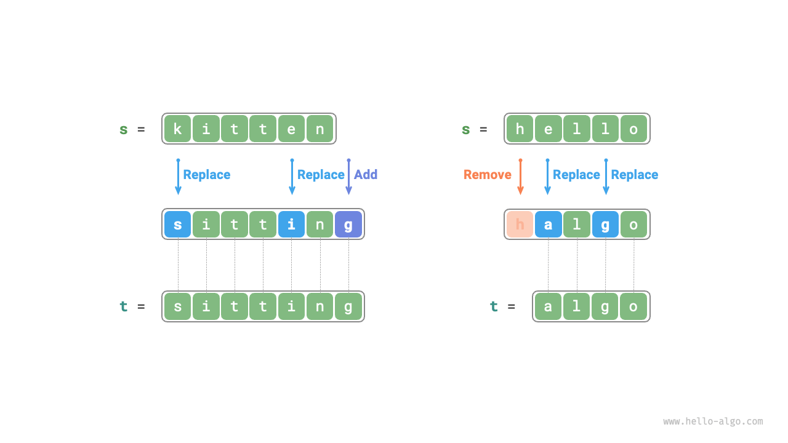{ class="animation-figure" }

<p align="center"> 図 14-27 &nbsp; 編集距離のサンプルデータ </p>

**編集距離問題は決定木モデルで自然に説明できます**。文字列が木のノードに対応し、1回の決定（1回の編集操作）が木の1本の辺に対応します。

下図に示すように、操作に制限がない場合、各ノードからは多くの辺を派生でき、それぞれの辺が1種類の操作に対応します。これは `hello` から `algo` への変換に多くの経路があり得ることを意味します。

決定木の観点から見ると、本問の目標はノード `hello` とノード `algo` の間の最短経路を求めることです。

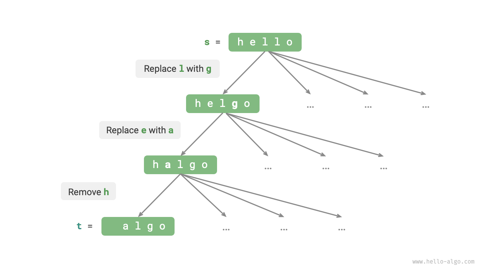{ class="animation-figure" }

<p align="center"> 図 14-28 &nbsp; 決定木モデルに基づく編集距離問題の表現 </p>

### 1. &nbsp; 動的計画法の考え方

**第1ステップ：各ラウンドの決定を考え、状態を定義して、$dp$ テーブルを得る**

各ラウンドの決定は、文字列 $s$ に対して1回の編集操作を行うことです。

編集操作の過程で問題の規模が徐々に小さくなることを期待します。そうして初めて部分問題を構築できます。文字列 $s$ と $t$ の長さをそれぞれ $n$ と $m$ とし、まず両文字列の末尾の文字 $s[n-1]$ と $t[m-1]$ を考えます。

- $s[n-1]$ と $t[m-1]$ が同じなら、それらをスキップして、直接 $s[n-2]$ と $t[m-2]$ を考えます。
- $s[n-1]$ と $t[m-1]$ が異なるなら、$s$ に対して1回の編集（挿入、削除、置換）を行い、両文字列の末尾の文字を同じにします。そうすることでそれらをスキップし、より小さい問題を考えられます。

つまり、文字列 $s$ に対する各ラウンドの決定（編集操作）は、$s$ と $t$ における残りの未一致文字を変化させます。したがって、状態は現在 $s$ と $t$ で考えている第 $i$ と第 $j$ 文字とし、$[i, j]$ と記します。

状態 $[i, j]$ に対応する部分問題は、**$s$ の先頭 $i$ 文字を $t$ の先頭 $j$ 文字に変換するのに必要な最小編集回数**です。

これにより、サイズが $(i+1) \times (j+1)$ の2次元 $dp$ テーブルが得られます。

**第2ステップ：最適部分構造を見つけ、状態遷移方程式を導く**

部分問題 $dp[i, j]$ を考えます。これに対応する2つの文字列の末尾文字は $s[i-1]$ と $t[j-1]$ であり、編集操作の違いに応じて下図の3つの場合に分けられます。

1. $s[i-1]$ の後ろに $t[j-1]$ を追加する。このとき残る部分問題は $dp[i, j-1]$ です。
2. $s[i-1]$ を削除する。このとき残る部分問題は $dp[i-1, j]$ です。
3. $s[i-1]$ を $t[j-1]$ に置き換える。このとき残る部分問題は $dp[i-1, j-1]$ です。

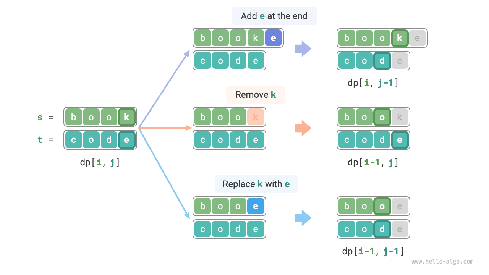{ class="animation-figure" }

<p align="center"> 図 14-29 &nbsp; 編集距離の状態遷移 </p>

以上の分析から、最適部分構造は次のように得られます。$dp[i, j]$ の最小編集回数は、$dp[i, j-1]$、$dp[i-1, j]$、$dp[i-1, j-1]$ の3つのうち最小の編集回数に、今回の編集回数 $1$ を加えたものです。対応する状態遷移方程式は次のとおりです：

$$
dp[i, j] = \min(dp[i, j-1], dp[i-1, j], dp[i-1, j-1]) + 1
$$

注意すべき点として、**$s[i-1]$ と $t[j-1]$ が同じ場合、現在の文字を編集する必要はありません**。この場合の状態遷移方程式は次のとおりです：

$$
dp[i, j] = dp[i-1, j-1]
$$

**第3ステップ：境界条件と状態遷移の順序を決める**

2つの文字列がともに空のとき、編集回数は $0$、すなわち $dp[0, 0] = 0$ です。$s$ が空で $t$ が空でないとき、最小編集回数は $t$ の長さに等しいため、先頭行は $dp[0, j] = j$ です。$s$ が空でなく $t$ が空のとき、最小編集回数は $s$ の長さに等しいため、先頭列は $dp[i, 0] = i$ です。

状態遷移方程式を観察すると、$dp[i, j]$ の解は左、上、左上の解に依存します。そのため、2重ループで $dp$ テーブル全体を順方向に走査すれば十分です。

### 2. &nbsp; コードの実装

=== "Python"

    ```python title="edit_distance.py"
    def edit_distance_dp(s: str, t: str) -> int:
        """編集距離：動的計画法"""
        n, m = len(s), len(t)
        dp = [[0] * (m + 1) for _ in range(n + 1)]
        # 状態遷移：先頭行と先頭列
        for i in range(1, n + 1):
            dp[i][0] = i
        for j in range(1, m + 1):
            dp[0][j] = j
        # 状態遷移: 残りの行と列
        for i in range(1, n + 1):
            for j in range(1, m + 1):
                if s[i - 1] == t[j - 1]:
                    # 2 つの文字が等しければ、その 2 文字をそのままスキップする
                    dp[i][j] = dp[i - 1][j - 1]
                else:
                    # 最小編集回数 = 挿入・削除・置換の 3 操作における最小編集回数 + 1
                    dp[i][j] = min(dp[i][j - 1], dp[i - 1][j], dp[i - 1][j - 1]) + 1
        return dp[n][m]
    ```

=== "C++"

    ```cpp title="edit_distance.cpp"
    /* 編集距離：動的計画法 */
    int editDistanceDP(string s, string t) {
        int n = s.length(), m = t.length();
        vector<vector<int>> dp(n + 1, vector<int>(m + 1, 0));
        // 状態遷移：先頭行と先頭列
        for (int i = 1; i <= n; i++) {
            dp[i][0] = i;
        }
        for (int j = 1; j <= m; j++) {
            dp[0][j] = j;
        }
        // 状態遷移: 残りの行と列
        for (int i = 1; i <= n; i++) {
            for (int j = 1; j <= m; j++) {
                if (s[i - 1] == t[j - 1]) {
                    // 2 つの文字が等しければ、その 2 文字をそのままスキップする
                    dp[i][j] = dp[i - 1][j - 1];
                } else {
                    // 最小編集回数 = 挿入・削除・置換の 3 操作における最小編集回数 + 1
                    dp[i][j] = min(min(dp[i][j - 1], dp[i - 1][j]), dp[i - 1][j - 1]) + 1;
                }
            }
        }
        return dp[n][m];
    }
    ```

=== "Java"

    ```java title="edit_distance.java"
    /* 編集距離：動的計画法 */
    int editDistanceDP(String s, String t) {
        int n = s.length(), m = t.length();
        int[][] dp = new int[n + 1][m + 1];
        // 状態遷移：先頭行と先頭列
        for (int i = 1; i <= n; i++) {
            dp[i][0] = i;
        }
        for (int j = 1; j <= m; j++) {
            dp[0][j] = j;
        }
        // 状態遷移: 残りの行と列
        for (int i = 1; i <= n; i++) {
            for (int j = 1; j <= m; j++) {
                if (s.charAt(i - 1) == t.charAt(j - 1)) {
                    // 2 つの文字が等しければ、その 2 文字をそのままスキップする
                    dp[i][j] = dp[i - 1][j - 1];
                } else {
                    // 最小編集回数 = 挿入・削除・置換の 3 操作における最小編集回数 + 1
                    dp[i][j] = Math.min(Math.min(dp[i][j - 1], dp[i - 1][j]), dp[i - 1][j - 1]) + 1;
                }
            }
        }
        return dp[n][m];
    }
    ```

=== "C#"

    ```csharp title="edit_distance.cs"
    /* 編集距離：動的計画法 */
    int EditDistanceDP(string s, string t) {
        int n = s.Length, m = t.Length;
        int[,] dp = new int[n + 1, m + 1];
        // 状態遷移：先頭行と先頭列
        for (int i = 1; i <= n; i++) {
            dp[i, 0] = i;
        }
        for (int j = 1; j <= m; j++) {
            dp[0, j] = j;
        }
        // 状態遷移: 残りの行と列
        for (int i = 1; i <= n; i++) {
            for (int j = 1; j <= m; j++) {
                if (s[i - 1] == t[j - 1]) {
                    // 2 つの文字が等しければ、その 2 文字をそのままスキップする
                    dp[i, j] = dp[i - 1, j - 1];
                } else {
                    // 最小編集回数 = 挿入・削除・置換の 3 操作における最小編集回数 + 1
                    dp[i, j] = Math.Min(Math.Min(dp[i, j - 1], dp[i - 1, j]), dp[i - 1, j - 1]) + 1;
                }
            }
        }
        return dp[n, m];
    }
    ```

=== "Go"

    ```go title="edit_distance.go"
    /* 編集距離：動的計画法 */
    func editDistanceDP(s string, t string) int {
        n := len(s)
        m := len(t)
        dp := make([][]int, n+1)
        for i := 0; i <= n; i++ {
            dp[i] = make([]int, m+1)
        }
        // 状態遷移：先頭行と先頭列
        for i := 1; i <= n; i++ {
            dp[i][0] = i
        }
        for j := 1; j <= m; j++ {
            dp[0][j] = j
        }
        // 状態遷移: 残りの行と列
        for i := 1; i <= n; i++ {
            for j := 1; j <= m; j++ {
                if s[i-1] == t[j-1] {
                    // 2 つの文字が等しければ、その 2 文字をそのままスキップする
                    dp[i][j] = dp[i-1][j-1]
                } else {
                    // 最小編集回数 = 挿入・削除・置換の 3 操作における最小編集回数 + 1
                    dp[i][j] = MinInt(MinInt(dp[i][j-1], dp[i-1][j]), dp[i-1][j-1]) + 1
                }
            }
        }
        return dp[n][m]
    }
    ```

=== "Swift"

    ```swift title="edit_distance.swift"
    /* 編集距離：動的計画法 */
    func editDistanceDP(s: String, t: String) -> Int {
        let n = s.utf8CString.count
        let m = t.utf8CString.count
        var dp = Array(repeating: Array(repeating: 0, count: m + 1), count: n + 1)
        // 状態遷移：先頭行と先頭列
        for i in 1 ... n {
            dp[i][0] = i
        }
        for j in 1 ... m {
            dp[0][j] = j
        }
        // 状態遷移: 残りの行と列
        for i in 1 ... n {
            for j in 1 ... m {
                if s.utf8CString[i - 1] == t.utf8CString[j - 1] {
                    // 2 つの文字が等しければ、その 2 文字をそのままスキップする
                    dp[i][j] = dp[i - 1][j - 1]
                } else {
                    // 最小編集回数 = 挿入・削除・置換の 3 操作における最小編集回数 + 1
                    dp[i][j] = min(min(dp[i][j - 1], dp[i - 1][j]), dp[i - 1][j - 1]) + 1
                }
            }
        }
        return dp[n][m]
    }
    ```

=== "JS"

    ```javascript title="edit_distance.js"
    /* 編集距離：動的計画法 */
    function editDistanceDP(s, t) {
        const n = s.length,
            m = t.length;
        const dp = Array.from({ length: n + 1 }, () => new Array(m + 1).fill(0));
        // 状態遷移：先頭行と先頭列
        for (let i = 1; i <= n; i++) {
            dp[i][0] = i;
        }
        for (let j = 1; j <= m; j++) {
            dp[0][j] = j;
        }
        // 状態遷移: 残りの行と列
        for (let i = 1; i <= n; i++) {
            for (let j = 1; j <= m; j++) {
                if (s.charAt(i - 1) === t.charAt(j - 1)) {
                    // 2 つの文字が等しければ、その 2 文字をそのままスキップする
                    dp[i][j] = dp[i - 1][j - 1];
                } else {
                    // 最小編集回数 = 挿入・削除・置換の 3 操作における最小編集回数 + 1
                    dp[i][j] =
                        Math.min(dp[i][j - 1], dp[i - 1][j], dp[i - 1][j - 1]) + 1;
                }
            }
        }
        return dp[n][m];
    }
    ```

=== "TS"

    ```typescript title="edit_distance.ts"
    /* 編集距離：動的計画法 */
    function editDistanceDP(s: string, t: string): number {
        const n = s.length,
            m = t.length;
        const dp = Array.from({ length: n + 1 }, () =>
            Array.from({ length: m + 1 }, () => 0)
        );
        // 状態遷移：先頭行と先頭列
        for (let i = 1; i <= n; i++) {
            dp[i][0] = i;
        }
        for (let j = 1; j <= m; j++) {
            dp[0][j] = j;
        }
        // 状態遷移: 残りの行と列
        for (let i = 1; i <= n; i++) {
            for (let j = 1; j <= m; j++) {
                if (s.charAt(i - 1) === t.charAt(j - 1)) {
                    // 2 つの文字が等しければ、その 2 文字をそのままスキップする
                    dp[i][j] = dp[i - 1][j - 1];
                } else {
                    // 最小編集回数 = 挿入・削除・置換の 3 操作における最小編集回数 + 1
                    dp[i][j] =
                        Math.min(dp[i][j - 1], dp[i - 1][j], dp[i - 1][j - 1]) + 1;
                }
            }
        }
        return dp[n][m];
    }
    ```

=== "Dart"

    ```dart title="edit_distance.dart"
    /* 編集距離：動的計画法 */
    int editDistanceDP(String s, String t) {
      int n = s.length, m = t.length;
      List<List<int>> dp = List.generate(n + 1, (_) => List.filled(m + 1, 0));
      // 状態遷移：先頭行と先頭列
      for (int i = 1; i <= n; i++) {
        dp[i][0] = i;
      }
      for (int j = 1; j <= m; j++) {
        dp[0][j] = j;
      }
      // 状態遷移: 残りの行と列
      for (int i = 1; i <= n; i++) {
        for (int j = 1; j <= m; j++) {
          if (s[i - 1] == t[j - 1]) {
            // 2 つの文字が等しければ、その 2 文字をそのままスキップする
            dp[i][j] = dp[i - 1][j - 1];
          } else {
            // 最小編集回数 = 挿入・削除・置換の 3 操作における最小編集回数 + 1
            dp[i][j] = min(min(dp[i][j - 1], dp[i - 1][j]), dp[i - 1][j - 1]) + 1;
          }
        }
      }
      return dp[n][m];
    }
    ```

=== "Rust"

    ```rust title="edit_distance.rs"
    /* 編集距離：動的計画法 */
    fn edit_distance_dp(s: &str, t: &str) -> i32 {
        let (n, m) = (s.len(), t.len());
        let mut dp = vec![vec![0; m + 1]; n + 1];
        // 状態遷移：先頭行と先頭列
        for i in 1..=n {
            dp[i][0] = i as i32;
        }
        for j in 1..m {
            dp[0][j] = j as i32;
        }
        // 状態遷移: 残りの行と列
        for i in 1..=n {
            for j in 1..=m {
                if s.chars().nth(i - 1) == t.chars().nth(j - 1) {
                    // 2 つの文字が等しければ、その 2 文字をそのままスキップする
                    dp[i][j] = dp[i - 1][j - 1];
                } else {
                    // 最小編集回数 = 挿入・削除・置換の 3 操作における最小編集回数 + 1
                    dp[i][j] =
                        std::cmp::min(std::cmp::min(dp[i][j - 1], dp[i - 1][j]), dp[i - 1][j - 1]) + 1;
                }
            }
        }
        dp[n][m]
    }
    ```

=== "C"

    ```c title="edit_distance.c"
    /* 編集距離：動的計画法 */
    int editDistanceDP(char *s, char *t, int n, int m) {
        int **dp = malloc((n + 1) * sizeof(int *));
        for (int i = 0; i <= n; i++) {
            dp[i] = calloc(m + 1, sizeof(int));
        }
        // 状態遷移：先頭行と先頭列
        for (int i = 1; i <= n; i++) {
            dp[i][0] = i;
        }
        for (int j = 1; j <= m; j++) {
            dp[0][j] = j;
        }
        // 状態遷移: 残りの行と列
        for (int i = 1; i <= n; i++) {
            for (int j = 1; j <= m; j++) {
                if (s[i - 1] == t[j - 1]) {
                    // 2 つの文字が等しければ、その 2 文字をそのままスキップする
                    dp[i][j] = dp[i - 1][j - 1];
                } else {
                    // 最小編集回数 = 挿入・削除・置換の 3 操作における最小編集回数 + 1
                    dp[i][j] = myMin(myMin(dp[i][j - 1], dp[i - 1][j]), dp[i - 1][j - 1]) + 1;
                }
            }
        }
        int res = dp[n][m];
        // メモリを解放する
        for (int i = 0; i <= n; i++) {
            free(dp[i]);
        }
        return res;
    }
    ```

=== "Kotlin"

    ```kotlin title="edit_distance.kt"
    /* 編集距離：動的計画法 */
    fun editDistanceDP(s: String, t: String): Int {
        val n = s.length
        val m = t.length
        val dp = Array(n + 1) { IntArray(m + 1) }
        // 状態遷移：先頭行と先頭列
        for (i in 1..n) {
            dp[i][0] = i
        }
        for (j in 1..m) {
            dp[0][j] = j
        }
        // 状態遷移: 残りの行と列
        for (i in 1..n) {
            for (j in 1..m) {
                if (s[i - 1] == t[j - 1]) {
                    // 2 つの文字が等しければ、その 2 文字をそのままスキップする
                    dp[i][j] = dp[i - 1][j - 1]
                } else {
                    // 最小編集回数 = 挿入・削除・置換の 3 操作における最小編集回数 + 1
                    dp[i][j] = min(min(dp[i][j - 1], dp[i - 1][j]), dp[i - 1][j - 1]) + 1
                }
            }
        }
        return dp[n][m]
    }
    ```

=== "Ruby"

    ```ruby title="edit_distance.rb"
    ### 編集距離：動的計画法 ###
    def edit_distance_dp(s, t)
      n, m = s.length, t.length
      dp = Array.new(n + 1) { Array.new(m + 1, 0) }
      # 状態遷移：先頭行と先頭列
      (1...(n + 1)).each { |i| dp[i][0] = i }
      (1...(m + 1)).each { |j| dp[0][j] = j }
      # 状態遷移: 残りの行と列
      for i in 1...(n + 1)
        for j in 1...(m +1)
          if s[i - 1] == t[j - 1]
            # 2 つの文字が等しければ、その 2 文字をそのままスキップする
            dp[i][j] = dp[i - 1][j - 1]
          else
            # 最小編集回数 = 挿入・削除・置換の 3 操作における最小編集回数 + 1
            dp[i][j] = [dp[i][j - 1], dp[i - 1][j], dp[i - 1][j - 1]].min + 1
          end
        end
      end
      dp[n][m]
    end
    ```

??? pythontutor "コードの可視化"

    <div style="height: 549px; width: 100%;"><iframe class="pythontutor-iframe" src="https://pythontutor.com/iframe-embed.html#code=def%20edit_distance_dp%28s%3A%20str%2C%20t%3A%20str%29%20-%3E%20int%3A%0A%20%20%20%20%22%22%22%E7%B7%A8%E9%9B%86%E8%B7%9D%E9%9B%A2%EF%BC%9A%E5%8B%95%E7%9A%84%E8%A8%88%E7%94%BB%E6%B3%95%22%22%22%0A%20%20%20%20n%2C%20m%20%3D%20len%28s%29%2C%20len%28t%29%0A%20%20%20%20dp%20%3D%20%5B%5B0%5D%20%2A%20%28m%20%2B%201%29%20for%20_%20in%20range%28n%20%2B%201%29%5D%0A%20%20%20%20%23%20%E7%8A%B6%E6%85%8B%E9%81%B7%E7%A7%BB%EF%BC%9A%E5%85%88%E9%A0%AD%E8%A1%8C%E3%81%A8%E5%85%88%E9%A0%AD%E5%88%97%0A%20%20%20%20for%20i%20in%20range%281%2C%20n%20%2B%201%29%3A%0A%20%20%20%20%20%20%20%20dp%5Bi%5D%5B0%5D%20%3D%20i%0A%20%20%20%20for%20j%20in%20range%281%2C%20m%20%2B%201%29%3A%0A%20%20%20%20%20%20%20%20dp%5B0%5D%5Bj%5D%20%3D%20j%0A%20%20%20%20%23%20%E7%8A%B6%E6%85%8B%E9%81%B7%E7%A7%BB%3A%20%E6%AE%8B%E3%82%8A%E3%81%AE%E8%A1%8C%E3%81%A8%E5%88%97%0A%20%20%20%20for%20i%20in%20range%281%2C%20n%20%2B%201%29%3A%0A%20%20%20%20%20%20%20%20for%20j%20in%20range%281%2C%20m%20%2B%201%29%3A%0A%20%20%20%20%20%20%20%20%20%20%20%20if%20s%5Bi%20-%201%5D%20%3D%3D%20t%5Bj%20-%201%5D%3A%0A%20%20%20%20%20%20%20%20%20%20%20%20%20%20%20%20%23%202%20%E3%81%A4%E3%81%AE%E6%96%87%E5%AD%97%E3%81%8C%E7%AD%89%E3%81%97%E3%81%91%E3%82%8C%E3%81%B0%E3%80%81%E3%81%9D%E3%81%AE%202%20%E6%96%87%E5%AD%97%E3%82%92%E3%81%9D%E3%81%AE%E3%81%BE%E3%81%BE%E3%82%B9%E3%82%AD%E3%83%83%E3%83%97%E3%81%99%E3%82%8B%0A%20%20%20%20%20%20%20%20%20%20%20%20%20%20%20%20dp%5Bi%5D%5Bj%5D%20%3D%20dp%5Bi%20-%201%5D%5Bj%20-%201%5D%0A%20%20%20%20%20%20%20%20%20%20%20%20else%3A%0A%20%20%20%20%20%20%20%20%20%20%20%20%20%20%20%20%23%20%E6%9C%80%E5%B0%8F%E7%B7%A8%E9%9B%86%E5%9B%9E%E6%95%B0%20%3D%20%E6%8C%BF%E5%85%A5%E3%83%BB%E5%89%8A%E9%99%A4%E3%83%BB%E7%BD%AE%E6%8F%9B%E3%81%AE%203%20%E6%93%8D%E4%BD%9C%E3%81%AB%E3%81%8A%E3%81%91%E3%82%8B%E6%9C%80%E5%B0%8F%E7%B7%A8%E9%9B%86%E5%9B%9E%E6%95%B0%20%2B%201%0A%20%20%20%20%20%20%20%20%20%20%20%20%20%20%20%20dp%5Bi%5D%5Bj%5D%20%3D%20min%28dp%5Bi%5D%5Bj%20-%201%5D%2C%20dp%5Bi%20-%201%5D%5Bj%5D%2C%20dp%5Bi%20-%201%5D%5Bj%20-%201%5D%29%20%2B%201%0A%20%20%20%20return%20dp%5Bn%5D%5Bm%5D%0A%0A%0Aif%20__name__%20%3D%3D%20%22__main__%22%3A%0A%20%20%20%20s%20%3D%20%22bag%22%0A%20%20%20%20t%20%3D%20%22pack%22%0A%20%20%20%20n%2C%20m%20%3D%20len%28s%29%2C%20len%28t%29%0A%0A%20%20%20%20%23%20%E5%8B%95%E7%9A%84%E8%A8%88%E7%94%BB%E6%B3%95%0A%20%20%20%20res%20%3D%20edit_distance_dp%28s%2C%20t%29%0A%20%20%20%20print%28f%22%7Bs%7D%20%E3%82%92%20%7Bt%7D%20%E3%81%AB%E5%A4%89%E6%9B%B4%E3%81%99%E3%82%8B%E3%81%AB%E3%81%AF%E6%9C%80%E5%B0%8F%E3%81%A7%20%7Bres%7D%20%E5%9B%9E%E3%81%AE%E7%B7%A8%E9%9B%86%E3%81%8C%E5%BF%85%E8%A6%81%E3%81%A7%E3%81%99%22%29&codeDivHeight=472&codeDivWidth=350&cumulative=false&curInstr=6&heapPrimitives=nevernest&origin=opt-frontend.js&py=311&rawInputLstJSON=%5B%5D&textReferences=false"> </iframe></div>
    <div style="margin-top: 5px;"><a href="https://pythontutor.com/iframe-embed.html#code=def%20edit_distance_dp%28s%3A%20str%2C%20t%3A%20str%29%20-%3E%20int%3A%0A%20%20%20%20%22%22%22%E7%B7%A8%E9%9B%86%E8%B7%9D%E9%9B%A2%EF%BC%9A%E5%8B%95%E7%9A%84%E8%A8%88%E7%94%BB%E6%B3%95%22%22%22%0A%20%20%20%20n%2C%20m%20%3D%20len%28s%29%2C%20len%28t%29%0A%20%20%20%20dp%20%3D%20%5B%5B0%5D%20%2A%20%28m%20%2B%201%29%20for%20_%20in%20range%28n%20%2B%201%29%5D%0A%20%20%20%20%23%20%E7%8A%B6%E6%85%8B%E9%81%B7%E7%A7%BB%EF%BC%9A%E5%85%88%E9%A0%AD%E8%A1%8C%E3%81%A8%E5%85%88%E9%A0%AD%E5%88%97%0A%20%20%20%20for%20i%20in%20range%281%2C%20n%20%2B%201%29%3A%0A%20%20%20%20%20%20%20%20dp%5Bi%5D%5B0%5D%20%3D%20i%0A%20%20%20%20for%20j%20in%20range%281%2C%20m%20%2B%201%29%3A%0A%20%20%20%20%20%20%20%20dp%5B0%5D%5Bj%5D%20%3D%20j%0A%20%20%20%20%23%20%E7%8A%B6%E6%85%8B%E9%81%B7%E7%A7%BB%3A%20%E6%AE%8B%E3%82%8A%E3%81%AE%E8%A1%8C%E3%81%A8%E5%88%97%0A%20%20%20%20for%20i%20in%20range%281%2C%20n%20%2B%201%29%3A%0A%20%20%20%20%20%20%20%20for%20j%20in%20range%281%2C%20m%20%2B%201%29%3A%0A%20%20%20%20%20%20%20%20%20%20%20%20if%20s%5Bi%20-%201%5D%20%3D%3D%20t%5Bj%20-%201%5D%3A%0A%20%20%20%20%20%20%20%20%20%20%20%20%20%20%20%20%23%202%20%E3%81%A4%E3%81%AE%E6%96%87%E5%AD%97%E3%81%8C%E7%AD%89%E3%81%97%E3%81%91%E3%82%8C%E3%81%B0%E3%80%81%E3%81%9D%E3%81%AE%202%20%E6%96%87%E5%AD%97%E3%82%92%E3%81%9D%E3%81%AE%E3%81%BE%E3%81%BE%E3%82%B9%E3%82%AD%E3%83%83%E3%83%97%E3%81%99%E3%82%8B%0A%20%20%20%20%20%20%20%20%20%20%20%20%20%20%20%20dp%5Bi%5D%5Bj%5D%20%3D%20dp%5Bi%20-%201%5D%5Bj%20-%201%5D%0A%20%20%20%20%20%20%20%20%20%20%20%20else%3A%0A%20%20%20%20%20%20%20%20%20%20%20%20%20%20%20%20%23%20%E6%9C%80%E5%B0%8F%E7%B7%A8%E9%9B%86%E5%9B%9E%E6%95%B0%20%3D%20%E6%8C%BF%E5%85%A5%E3%83%BB%E5%89%8A%E9%99%A4%E3%83%BB%E7%BD%AE%E6%8F%9B%E3%81%AE%203%20%E6%93%8D%E4%BD%9C%E3%81%AB%E3%81%8A%E3%81%91%E3%82%8B%E6%9C%80%E5%B0%8F%E7%B7%A8%E9%9B%86%E5%9B%9E%E6%95%B0%20%2B%201%0A%20%20%20%20%20%20%20%20%20%20%20%20%20%20%20%20dp%5Bi%5D%5Bj%5D%20%3D%20min%28dp%5Bi%5D%5Bj%20-%201%5D%2C%20dp%5Bi%20-%201%5D%5Bj%5D%2C%20dp%5Bi%20-%201%5D%5Bj%20-%201%5D%29%20%2B%201%0A%20%20%20%20return%20dp%5Bn%5D%5Bm%5D%0A%0A%0Aif%20__name__%20%3D%3D%20%22__main__%22%3A%0A%20%20%20%20s%20%3D%20%22bag%22%0A%20%20%20%20t%20%3D%20%22pack%22%0A%20%20%20%20n%2C%20m%20%3D%20len%28s%29%2C%20len%28t%29%0A%0A%20%20%20%20%23%20%E5%8B%95%E7%9A%84%E8%A8%88%E7%94%BB%E6%B3%95%0A%20%20%20%20res%20%3D%20edit_distance_dp%28s%2C%20t%29%0A%20%20%20%20print%28f%22%7Bs%7D%20%E3%82%92%20%7Bt%7D%20%E3%81%AB%E5%A4%89%E6%9B%B4%E3%81%99%E3%82%8B%E3%81%AB%E3%81%AF%E6%9C%80%E5%B0%8F%E3%81%A7%20%7Bres%7D%20%E5%9B%9E%E3%81%AE%E7%B7%A8%E9%9B%86%E3%81%8C%E5%BF%85%E8%A6%81%E3%81%A7%E3%81%99%22%29&codeDivHeight=800&codeDivWidth=600&cumulative=false&curInstr=6&heapPrimitives=nevernest&origin=opt-frontend.js&py=311&rawInputLstJSON=%5B%5D&textReferences=false" target="_blank" rel="noopener noreferrer">全画面で見る ></a></div>

下図に示すように、編集距離問題の状態遷移の過程はナップサック問題と非常によく似ており、どちらも2次元グリッドを埋めていく過程とみなせます。

=== "<1>"
    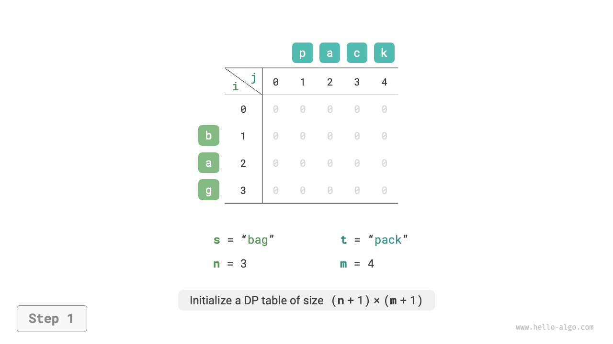{ class="animation-figure" }

=== "<2>"
    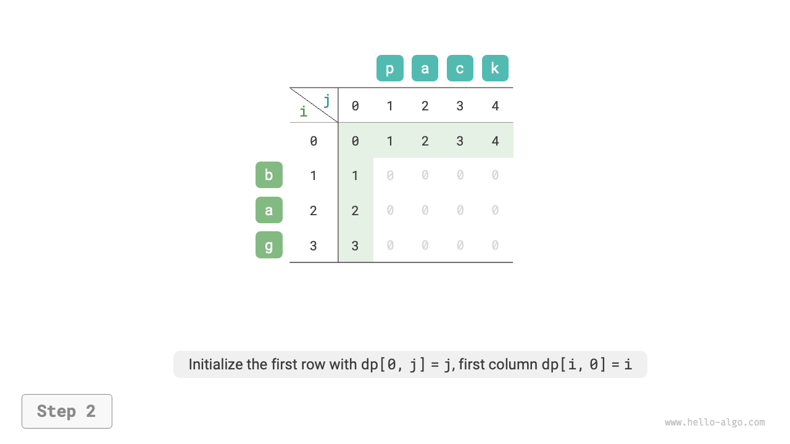{ class="animation-figure" }

=== "<3>"
    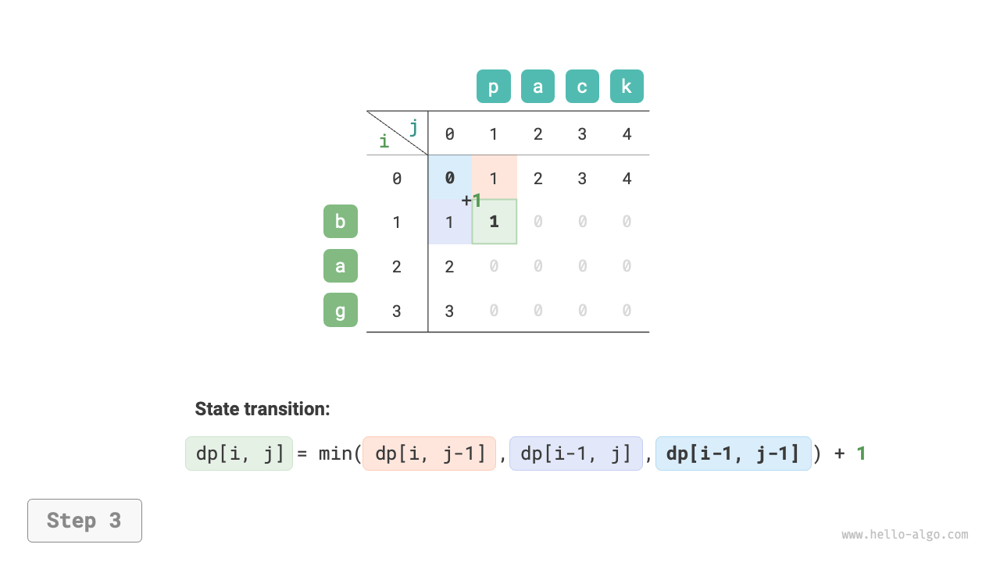{ class="animation-figure" }

=== "<4>"
    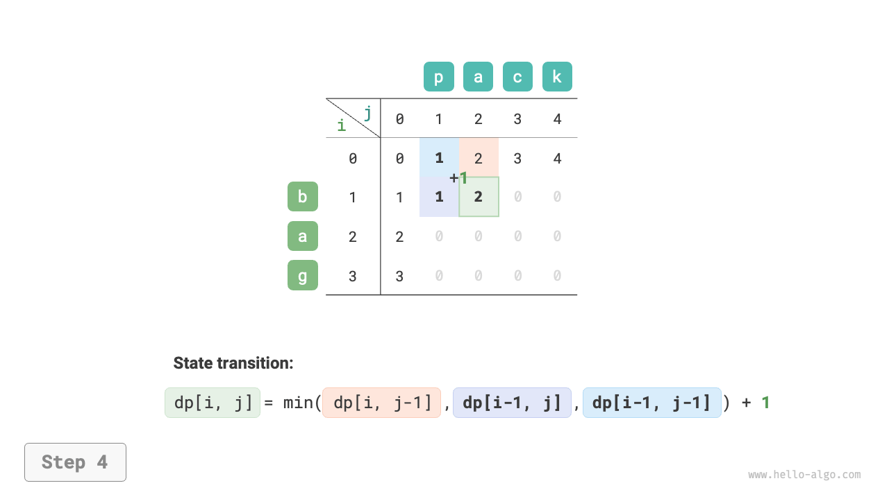{ class="animation-figure" }

=== "<5>"
    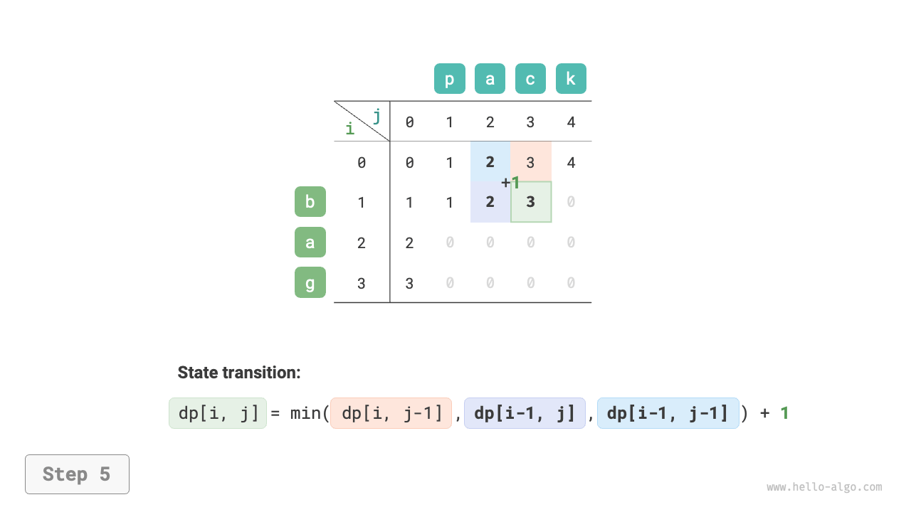{ class="animation-figure" }

=== "<6>"
    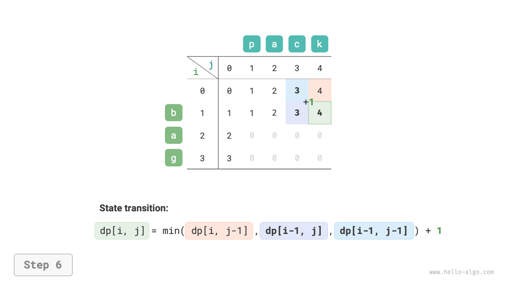{ class="animation-figure" }

=== "<7>"
    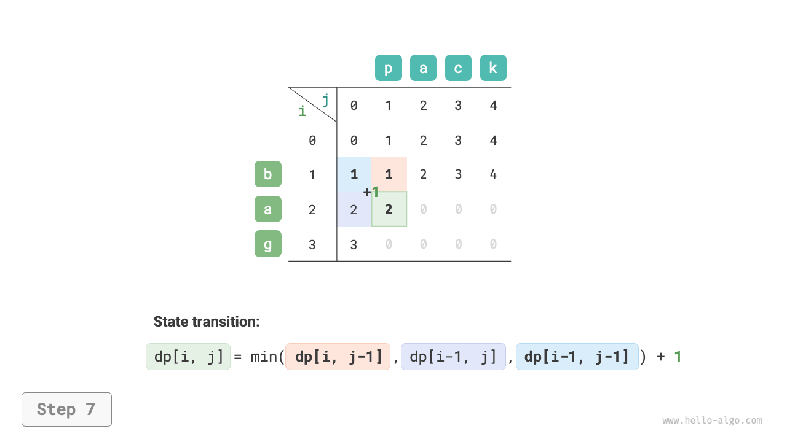{ class="animation-figure" }

=== "<8>"
    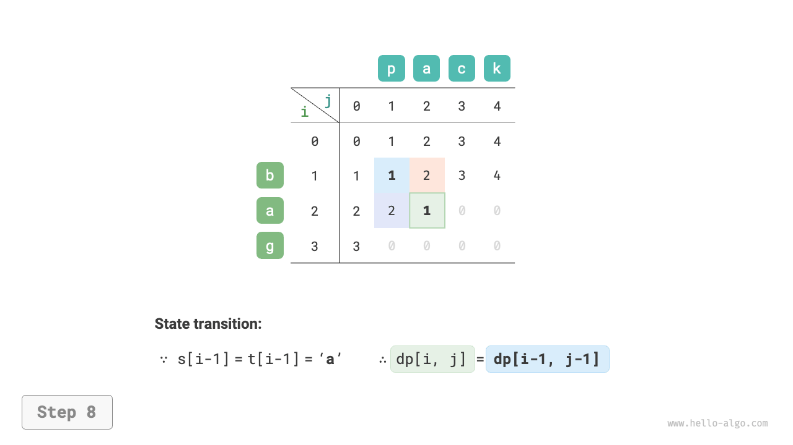{ class="animation-figure" }

=== "<9>"
    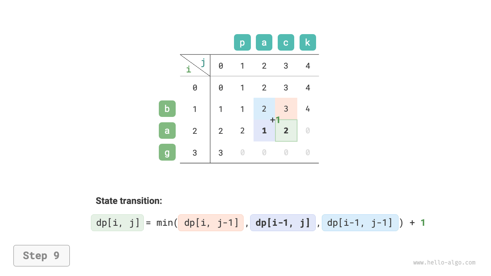{ class="animation-figure" }

=== "<10>"
    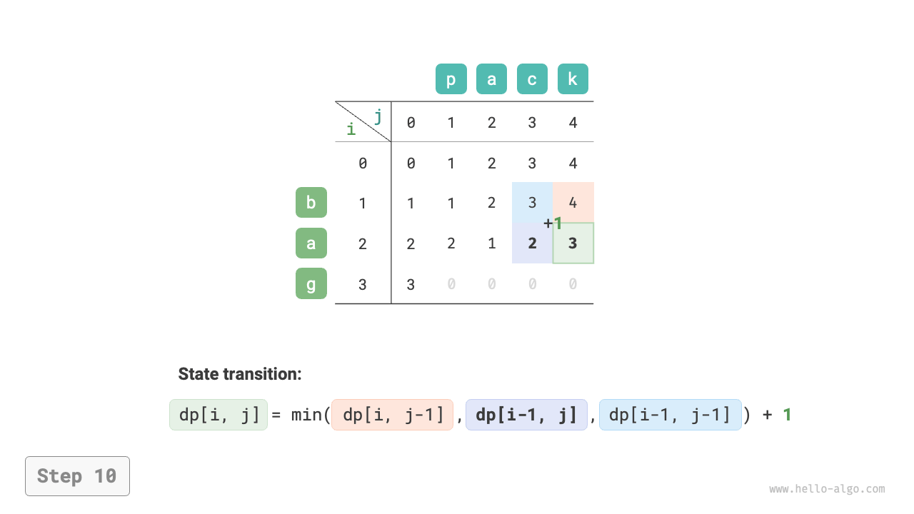{ class="animation-figure" }

=== "<11>"
    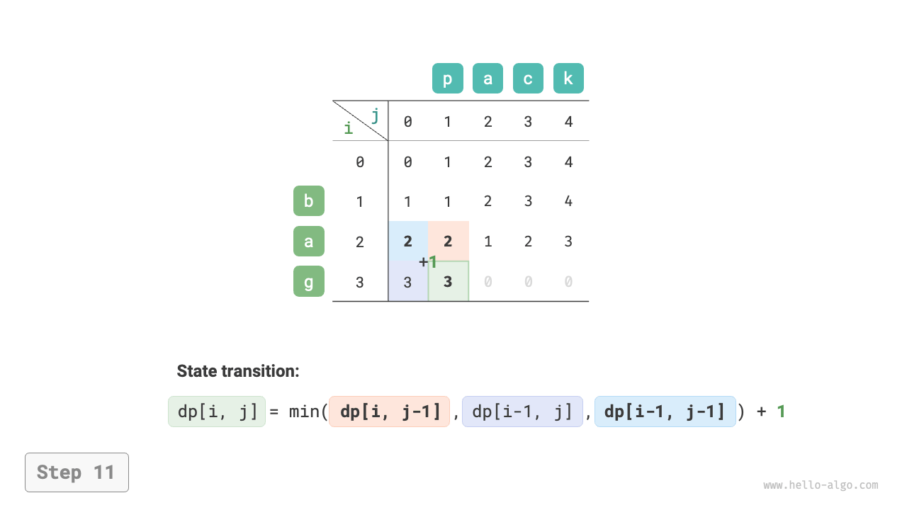{ class="animation-figure" }

=== "<12>"
    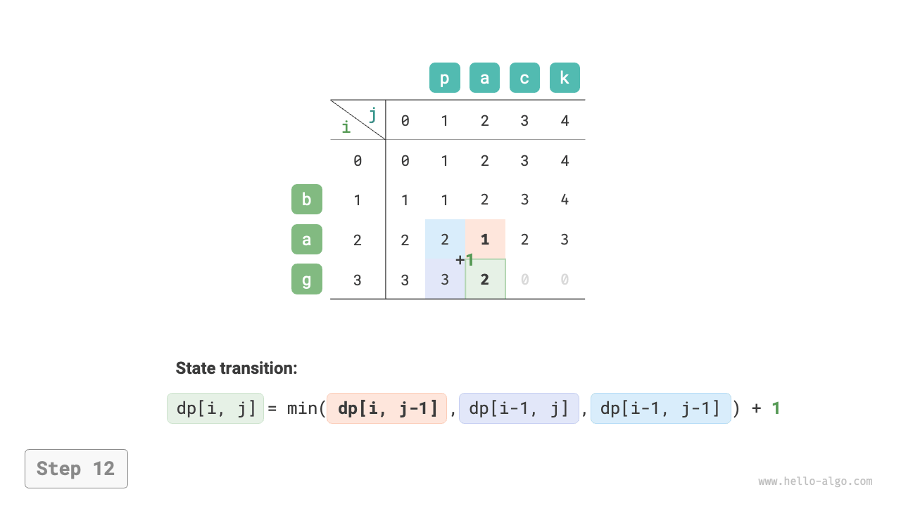{ class="animation-figure" }

=== "<13>"
    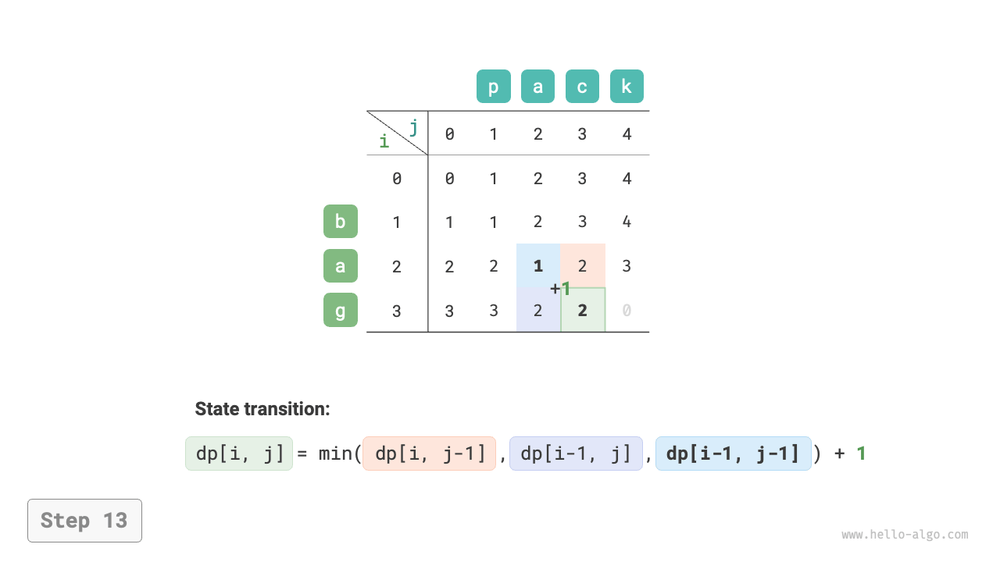{ class="animation-figure" }

=== "<14>"
    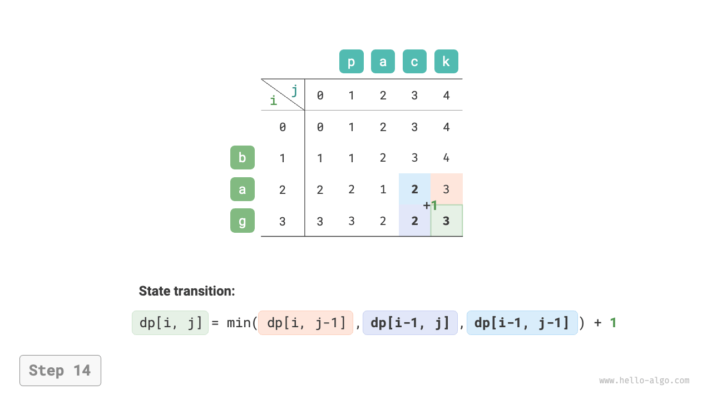{ class="animation-figure" }

=== "<15>"
    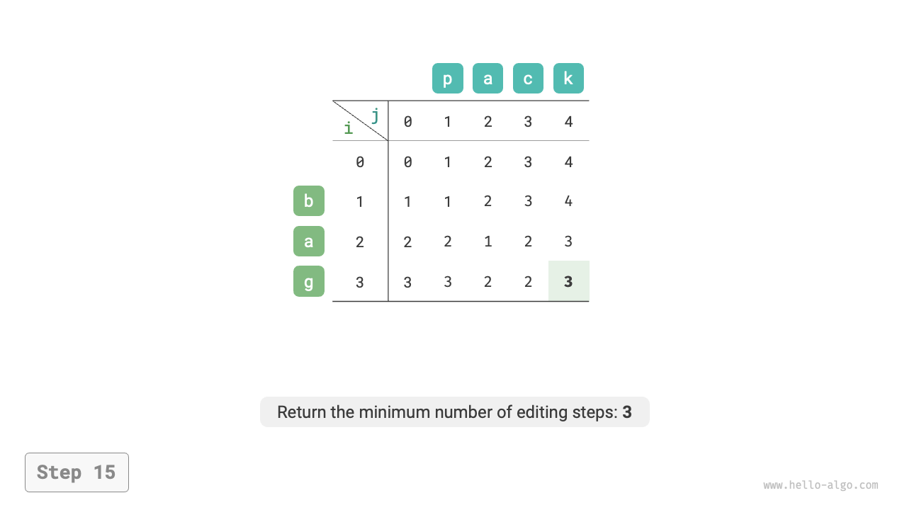{ class="animation-figure" }

<p align="center"> 図 14-30 &nbsp; 編集距離の動的計画法の過程 </p>

### 3. &nbsp; 空間最適化

$dp[i,j]$ は上の $dp[i-1, j]$、左の $dp[i, j-1]$、左上の $dp[i-1, j-1]$ から遷移されますが、順方向走査では左上の $dp[i-1, j-1]$ を失い、逆方向走査では $dp[i, j-1]$ を事前に構築できません。そのため、どちらの走査順序も適切ではありません。

そのため、変数 `leftup` を用いて左上の解 $dp[i-1, j-1]$ を一時保存し、左と上の解だけを考えればよくなります。このときの状況は完全ナップサック問題と同じであり、順方向走査を用いることができます。コードは次のとおりです：

=== "Python"

    ```python title="edit_distance.py"
    def edit_distance_dp_comp(s: str, t: str) -> int:
        """編集距離：空間最適化した動的計画法"""
        n, m = len(s), len(t)
        dp = [0] * (m + 1)
        # 状態遷移：先頭行
        for j in range(1, m + 1):
            dp[j] = j
        # 状態遷移：残りの行
        for i in range(1, n + 1):
            # 状態遷移：先頭列
            leftup = dp[0]  # dp[i-1, j-1] を一時保存する
            dp[0] += 1
            # 状態遷移：残りの列
            for j in range(1, m + 1):
                temp = dp[j]
                if s[i - 1] == t[j - 1]:
                    # 2 つの文字が等しければ、その 2 文字をそのままスキップする
                    dp[j] = leftup
                else:
                    # 最小編集回数 = 挿入・削除・置換の 3 操作における最小編集回数 + 1
                    dp[j] = min(dp[j - 1], dp[j], leftup) + 1
                leftup = temp  # 次の反復の dp[i-1, j-1] に更新する
        return dp[m]
    ```

=== "C++"

    ```cpp title="edit_distance.cpp"
    /* 編集距離：空間最適化した動的計画法 */
    int editDistanceDPComp(string s, string t) {
        int n = s.length(), m = t.length();
        vector<int> dp(m + 1, 0);
        // 状態遷移：先頭行
        for (int j = 1; j <= m; j++) {
            dp[j] = j;
        }
        // 状態遷移：残りの行
        for (int i = 1; i <= n; i++) {
            // 状態遷移：先頭列
            int leftup = dp[0]; // dp[i-1, j-1] を一時保存する
            dp[0] = i;
            // 状態遷移：残りの列
            for (int j = 1; j <= m; j++) {
                int temp = dp[j];
                if (s[i - 1] == t[j - 1]) {
                    // 2 つの文字が等しければ、その 2 文字をそのままスキップする
                    dp[j] = leftup;
                } else {
                    // 最小編集回数 = 挿入・削除・置換の 3 操作における最小編集回数 + 1
                    dp[j] = min(min(dp[j - 1], dp[j]), leftup) + 1;
                }
                leftup = temp; // 次の反復の dp[i-1, j-1] に更新する
            }
        }
        return dp[m];
    }
    ```

=== "Java"

    ```java title="edit_distance.java"
    /* 編集距離：空間最適化した動的計画法 */
    int editDistanceDPComp(String s, String t) {
        int n = s.length(), m = t.length();
        int[] dp = new int[m + 1];
        // 状態遷移：先頭行
        for (int j = 1; j <= m; j++) {
            dp[j] = j;
        }
        // 状態遷移：残りの行
        for (int i = 1; i <= n; i++) {
            // 状態遷移：先頭列
            int leftup = dp[0]; // dp[i-1, j-1] を一時保存する
            dp[0] = i;
            // 状態遷移：残りの列
            for (int j = 1; j <= m; j++) {
                int temp = dp[j];
                if (s.charAt(i - 1) == t.charAt(j - 1)) {
                    // 2 つの文字が等しければ、その 2 文字をそのままスキップする
                    dp[j] = leftup;
                } else {
                    // 最小編集回数 = 挿入・削除・置換の 3 操作における最小編集回数 + 1
                    dp[j] = Math.min(Math.min(dp[j - 1], dp[j]), leftup) + 1;
                }
                leftup = temp; // 次の反復の dp[i-1, j-1] に更新する
            }
        }
        return dp[m];
    }
    ```

=== "C#"

    ```csharp title="edit_distance.cs"
    /* 編集距離：空間最適化した動的計画法 */
    int EditDistanceDPComp(string s, string t) {
        int n = s.Length, m = t.Length;
        int[] dp = new int[m + 1];
        // 状態遷移：先頭行
        for (int j = 1; j <= m; j++) {
            dp[j] = j;
        }
        // 状態遷移：残りの行
        for (int i = 1; i <= n; i++) {
            // 状態遷移：先頭列
            int leftup = dp[0]; // dp[i-1, j-1] を一時保存する
            dp[0] = i;
            // 状態遷移：残りの列
            for (int j = 1; j <= m; j++) {
                int temp = dp[j];
                if (s[i - 1] == t[j - 1]) {
                    // 2 つの文字が等しければ、その 2 文字をそのままスキップする
                    dp[j] = leftup;
                } else {
                    // 最小編集回数 = 挿入・削除・置換の 3 操作における最小編集回数 + 1
                    dp[j] = Math.Min(Math.Min(dp[j - 1], dp[j]), leftup) + 1;
                }
                leftup = temp; // 次の反復の dp[i-1, j-1] に更新する
            }
        }
        return dp[m];
    }
    ```

=== "Go"

    ```go title="edit_distance.go"
    /* 編集距離：空間最適化した動的計画法 */
    func editDistanceDPComp(s string, t string) int {
        n := len(s)
        m := len(t)
        dp := make([]int, m+1)
        // 状態遷移：先頭行
        for j := 1; j <= m; j++ {
            dp[j] = j
        }
        // 状態遷移：残りの行
        for i := 1; i <= n; i++ {
            // 状態遷移：先頭列
            leftUp := dp[0] // dp[i-1, j-1] を一時保存する
            dp[0] = i
            // 状態遷移：残りの列
            for j := 1; j <= m; j++ {
                temp := dp[j]
                if s[i-1] == t[j-1] {
                    // 2 つの文字が等しければ、その 2 文字をそのままスキップする
                    dp[j] = leftUp
                } else {
                    // 最小編集回数 = 挿入・削除・置換の 3 操作における最小編集回数 + 1
                    dp[j] = MinInt(MinInt(dp[j-1], dp[j]), leftUp) + 1
                }
                leftUp = temp // 次の反復の dp[i-1, j-1] に更新する
            }
        }
        return dp[m]
    }
    ```

=== "Swift"

    ```swift title="edit_distance.swift"
    /* 編集距離：空間最適化した動的計画法 */
    func editDistanceDPComp(s: String, t: String) -> Int {
        let n = s.utf8CString.count
        let m = t.utf8CString.count
        var dp = Array(repeating: 0, count: m + 1)
        // 状態遷移：先頭行
        for j in 1 ... m {
            dp[j] = j
        }
        // 状態遷移：残りの行
        for i in 1 ... n {
            // 状態遷移：先頭列
            var leftup = dp[0] // dp[i-1, j-1] を一時保存する
            dp[0] = i
            // 状態遷移：残りの列
            for j in 1 ... m {
                let temp = dp[j]
                if s.utf8CString[i - 1] == t.utf8CString[j - 1] {
                    // 2 つの文字が等しければ、その 2 文字をそのままスキップする
                    dp[j] = leftup
                } else {
                    // 最小編集回数 = 挿入・削除・置換の 3 操作における最小編集回数 + 1
                    dp[j] = min(min(dp[j - 1], dp[j]), leftup) + 1
                }
                leftup = temp // 次の反復の dp[i-1, j-1] に更新する
            }
        }
        return dp[m]
    }
    ```

=== "JS"

    ```javascript title="edit_distance.js"
    /* 編集距離：空間最適化した動的計画法 */
    function editDistanceDPComp(s, t) {
        const n = s.length,
            m = t.length;
        const dp = new Array(m + 1).fill(0);
        // 状態遷移：先頭行
        for (let j = 1; j <= m; j++) {
            dp[j] = j;
        }
        // 状態遷移：残りの行
        for (let i = 1; i <= n; i++) {
            // 状態遷移：先頭列
            let leftup = dp[0]; // dp[i-1, j-1] を一時保存する
            dp[0] = i;
            // 状態遷移：残りの列
            for (let j = 1; j <= m; j++) {
                const temp = dp[j];
                if (s.charAt(i - 1) === t.charAt(j - 1)) {
                    // 2 つの文字が等しければ、その 2 文字をそのままスキップする
                    dp[j] = leftup;
                } else {
                    // 最小編集回数 = 挿入・削除・置換の 3 操作における最小編集回数 + 1
                    dp[j] = Math.min(dp[j - 1], dp[j], leftup) + 1;
                }
                leftup = temp; // 次の反復の dp[i-1, j-1] に更新する
            }
        }
        return dp[m];
    }
    ```

=== "TS"

    ```typescript title="edit_distance.ts"
    /* 編集距離：空間最適化した動的計画法 */
    function editDistanceDPComp(s: string, t: string): number {
        const n = s.length,
            m = t.length;
        const dp = new Array(m + 1).fill(0);
        // 状態遷移：先頭行
        for (let j = 1; j <= m; j++) {
            dp[j] = j;
        }
        // 状態遷移：残りの行
        for (let i = 1; i <= n; i++) {
            // 状態遷移：先頭列
            let leftup = dp[0]; // dp[i-1, j-1] を一時保存する
            dp[0] = i;
            // 状態遷移：残りの列
            for (let j = 1; j <= m; j++) {
                const temp = dp[j];
                if (s.charAt(i - 1) === t.charAt(j - 1)) {
                    // 2 つの文字が等しければ、その 2 文字をそのままスキップする
                    dp[j] = leftup;
                } else {
                    // 最小編集回数 = 挿入・削除・置換の 3 操作における最小編集回数 + 1
                    dp[j] = Math.min(dp[j - 1], dp[j], leftup) + 1;
                }
                leftup = temp; // 次の反復の dp[i-1, j-1] に更新する
            }
        }
        return dp[m];
    }
    ```

=== "Dart"

    ```dart title="edit_distance.dart"
    /* 編集距離：空間最適化した動的計画法 */
    int editDistanceDPComp(String s, String t) {
      int n = s.length, m = t.length;
      List<int> dp = List.filled(m + 1, 0);
      // 状態遷移：先頭行
      for (int j = 1; j <= m; j++) {
        dp[j] = j;
      }
      // 状態遷移：残りの行
      for (int i = 1; i <= n; i++) {
        // 状態遷移：先頭列
        int leftup = dp[0]; // dp[i-1, j-1] を一時保存する
        dp[0] = i;
        // 状態遷移：残りの列
        for (int j = 1; j <= m; j++) {
          int temp = dp[j];
          if (s[i - 1] == t[j - 1]) {
            // 2 つの文字が等しければ、その 2 文字をそのままスキップする
            dp[j] = leftup;
          } else {
            // 最小編集回数 = 挿入・削除・置換の 3 操作における最小編集回数 + 1
            dp[j] = min(min(dp[j - 1], dp[j]), leftup) + 1;
          }
          leftup = temp; // 次の反復の dp[i-1, j-1] に更新する
        }
      }
      return dp[m];
    }
    ```

=== "Rust"

    ```rust title="edit_distance.rs"
    /* 編集距離：空間最適化した動的計画法 */
    fn edit_distance_dp_comp(s: &str, t: &str) -> i32 {
        let (n, m) = (s.len(), t.len());
        let mut dp = vec![0; m + 1];
        // 状態遷移：先頭行
        for j in 1..m {
            dp[j] = j as i32;
        }
        // 状態遷移：残りの行
        for i in 1..=n {
            // 状態遷移：先頭列
            let mut leftup = dp[0]; // dp[i-1, j-1] を一時保存する
            dp[0] = i as i32;
            // 状態遷移：残りの列
            for j in 1..=m {
                let temp = dp[j];
                if s.chars().nth(i - 1) == t.chars().nth(j - 1) {
                    // 2 つの文字が等しければ、その 2 文字をそのままスキップする
                    dp[j] = leftup;
                } else {
                    // 最小編集回数 = 挿入・削除・置換の 3 操作における最小編集回数 + 1
                    dp[j] = std::cmp::min(std::cmp::min(dp[j - 1], dp[j]), leftup) + 1;
                }
                leftup = temp; // 次の反復の dp[i-1, j-1] に更新する
            }
        }
        dp[m]
    }
    ```

=== "C"

    ```c title="edit_distance.c"
    /* 編集距離：空間最適化した動的計画法 */
    int editDistanceDPComp(char *s, char *t, int n, int m) {
        int *dp = calloc(m + 1, sizeof(int));
        // 状態遷移：先頭行
        for (int j = 1; j <= m; j++) {
            dp[j] = j;
        }
        // 状態遷移：残りの行
        for (int i = 1; i <= n; i++) {
            // 状態遷移：先頭列
            int leftup = dp[0]; // dp[i-1, j-1] を一時保存する
            dp[0] = i;
            // 状態遷移：残りの列
            for (int j = 1; j <= m; j++) {
                int temp = dp[j];
                if (s[i - 1] == t[j - 1]) {
                    // 2 つの文字が等しければ、その 2 文字をそのままスキップする
                    dp[j] = leftup;
                } else {
                    // 最小編集回数 = 挿入・削除・置換の 3 操作における最小編集回数 + 1
                    dp[j] = myMin(myMin(dp[j - 1], dp[j]), leftup) + 1;
                }
                leftup = temp; // 次の反復の dp[i-1, j-1] に更新する
            }
        }
        int res = dp[m];
        // メモリを解放する
        free(dp);
        return res;
    }
    ```

=== "Kotlin"

    ```kotlin title="edit_distance.kt"
    /* 編集距離：空間最適化した動的計画法 */
    fun editDistanceDPComp(s: String, t: String): Int {
        val n = s.length
        val m = t.length
        val dp = IntArray(m + 1)
        // 状態遷移：先頭行
        for (j in 1..m) {
            dp[j] = j
        }
        // 状態遷移：残りの行
        for (i in 1..n) {
            // 状態遷移：先頭列
            var leftup = dp[0] // dp[i-1, j-1] を一時保存する
            dp[0] = i
            // 状態遷移：残りの列
            for (j in 1..m) {
                val temp = dp[j]
                if (s[i - 1] == t[j - 1]) {
                    // 2 つの文字が等しければ、その 2 文字をそのままスキップする
                    dp[j] = leftup
                } else {
                    // 最小編集回数 = 挿入・削除・置換の 3 操作における最小編集回数 + 1
                    dp[j] = min(min(dp[j - 1], dp[j]), leftup) + 1
                }
                leftup = temp // 次の反復の dp[i-1, j-1] に更新する
            }
        }
        return dp[m]
    }
    ```

=== "Ruby"

    ```ruby title="edit_distance.rb"
    ### 編集距離：空間最適化した動的計画法 ###
    def edit_distance_dp_comp(s, t)
      n, m = s.length, t.length
      dp = Array.new(m + 1, 0)
      # 状態遷移：先頭行
      (1...(m + 1)).each { |j| dp[j] = j }
      # 状態遷移：残りの行
      for i in 1...(n + 1)
        # 状態遷移：先頭列
        leftup = dp.first # dp[i-1, j-1] を一時保存する
        dp[0] += 1
        # 状態遷移：残りの列
        for j in 1...(m + 1)
          temp = dp[j]
          if s[i - 1] == t[j - 1]
            # 2 つの文字が等しければ、その 2 文字をそのままスキップする
            dp[j] = leftup
          else
            # 最小編集回数 = 挿入・削除・置換の 3 操作における最小編集回数 + 1
            dp[j] = [dp[j - 1], dp[j], leftup].min + 1
          end
          leftup = temp # 次の反復の dp[i-1, j-1] に更新する
        end
      end
      dp[m]
    end
    ```

??? pythontutor "コードの可視化"

    <div style="height: 549px; width: 100%;"><iframe class="pythontutor-iframe" src="https://pythontutor.com/iframe-embed.html#code=def%20edit_distance_dp_comp%28s%3A%20str%2C%20t%3A%20str%29%20-%3E%20int%3A%0A%20%20%20%20%22%22%22%E7%B7%A8%E9%9B%86%E8%B7%9D%E9%9B%A2%EF%BC%9A%E7%A9%BA%E9%96%93%E6%9C%80%E9%81%A9%E5%8C%96%E3%81%97%E3%81%9F%E5%8B%95%E7%9A%84%E8%A8%88%E7%94%BB%E6%B3%95%22%22%22%0A%20%20%20%20n%2C%20m%20%3D%20len%28s%29%2C%20len%28t%29%0A%20%20%20%20dp%20%3D%20%5B0%5D%20%2A%20%28m%20%2B%201%29%0A%20%20%20%20%23%20%E7%8A%B6%E6%85%8B%E9%81%B7%E7%A7%BB%EF%BC%9A%E5%85%88%E9%A0%AD%E8%A1%8C%0A%20%20%20%20for%20j%20in%20range%281%2C%20m%20%2B%201%29%3A%0A%20%20%20%20%20%20%20%20dp%5Bj%5D%20%3D%20j%0A%20%20%20%20%23%20%E7%8A%B6%E6%85%8B%E9%81%B7%E7%A7%BB%EF%BC%9A%E6%AE%8B%E3%82%8A%E3%81%AE%E8%A1%8C%0A%20%20%20%20for%20i%20in%20range%281%2C%20n%20%2B%201%29%3A%0A%20%20%20%20%20%20%20%20%23%20%E7%8A%B6%E6%85%8B%E9%81%B7%E7%A7%BB%EF%BC%9A%E5%85%88%E9%A0%AD%E5%88%97%0A%20%20%20%20%20%20%20%20leftup%20%3D%20dp%5B0%5D%20%20%23%20dp%5Bi-1%2C%20j-1%5D%20%E3%82%92%E4%B8%80%E6%99%82%E4%BF%9D%E5%AD%98%E3%81%99%E3%82%8B%0A%20%20%20%20%20%20%20%20dp%5B0%5D%20%2B%3D%201%0A%20%20%20%20%20%20%20%20%23%20%E7%8A%B6%E6%85%8B%E9%81%B7%E7%A7%BB%EF%BC%9A%E6%AE%8B%E3%82%8A%E3%81%AE%E5%88%97%0A%20%20%20%20%20%20%20%20for%20j%20in%20range%281%2C%20m%20%2B%201%29%3A%0A%20%20%20%20%20%20%20%20%20%20%20%20temp%20%3D%20dp%5Bj%5D%0A%20%20%20%20%20%20%20%20%20%20%20%20if%20s%5Bi%20-%201%5D%20%3D%3D%20t%5Bj%20-%201%5D%3A%0A%20%20%20%20%20%20%20%20%20%20%20%20%20%20%20%20%23%202%20%E3%81%A4%E3%81%AE%E6%96%87%E5%AD%97%E3%81%8C%E7%AD%89%E3%81%97%E3%81%91%E3%82%8C%E3%81%B0%E3%80%81%E3%81%9D%E3%81%AE%202%20%E6%96%87%E5%AD%97%E3%82%92%E3%81%9D%E3%81%AE%E3%81%BE%E3%81%BE%E3%82%B9%E3%82%AD%E3%83%83%E3%83%97%E3%81%99%E3%82%8B%0A%20%20%20%20%20%20%20%20%20%20%20%20%20%20%20%20dp%5Bj%5D%20%3D%20leftup%0A%20%20%20%20%20%20%20%20%20%20%20%20else%3A%0A%20%20%20%20%20%20%20%20%20%20%20%20%20%20%20%20%23%20%E6%9C%80%E5%B0%8F%E7%B7%A8%E9%9B%86%E5%9B%9E%E6%95%B0%20%3D%20%E6%8C%BF%E5%85%A5%E3%83%BB%E5%89%8A%E9%99%A4%E3%83%BB%E7%BD%AE%E6%8F%9B%E3%81%AE%203%20%E6%93%8D%E4%BD%9C%E3%81%AB%E3%81%8A%E3%81%91%E3%82%8B%E6%9C%80%E5%B0%8F%E7%B7%A8%E9%9B%86%E5%9B%9E%E6%95%B0%20%2B%201%0A%20%20%20%20%20%20%20%20%20%20%20%20%20%20%20%20dp%5Bj%5D%20%3D%20min%28dp%5Bj%20-%201%5D%2C%20dp%5Bj%5D%2C%20leftup%29%20%2B%201%0A%20%20%20%20%20%20%20%20%20%20%20%20leftup%20%3D%20temp%20%20%23%20%E6%AC%A1%E3%81%AE%E5%8F%8D%E5%BE%A9%E3%81%AE%20dp%5Bi-1%2C%20j-1%5D%20%E3%81%AB%E6%9B%B4%E6%96%B0%E3%81%99%E3%82%8B%0A%20%20%20%20return%20dp%5Bm%5D%0A%0A%0Aif%20__name__%20%3D%3D%20%22__main__%22%3A%0A%20%20%20%20s%20%3D%20%22bag%22%0A%20%20%20%20t%20%3D%20%22pack%22%0A%20%20%20%20n%2C%20m%20%3D%20len%28s%29%2C%20len%28t%29%0A%0A%20%20%20%20%23%20%E7%A9%BA%E9%96%93%E6%9C%80%E9%81%A9%E5%8C%96%E5%BE%8C%E3%81%AE%E5%8B%95%E7%9A%84%E8%A8%88%E7%94%BB%E6%B3%95%0A%20%20%20%20res%20%3D%20edit_distance_dp_comp%28s%2C%20t%29%0A%20%20%20%20print%28f%22%7Bs%7D%20%E3%82%92%20%7Bt%7D%20%E3%81%AB%E5%A4%89%E6%9B%B4%E3%81%99%E3%82%8B%E3%81%AB%E3%81%AF%E6%9C%80%E5%B0%8F%E3%81%A7%20%7Bres%7D%20%E5%9B%9E%E3%81%AE%E7%B7%A8%E9%9B%86%E3%81%8C%E5%BF%85%E8%A6%81%E3%81%A7%E3%81%99%22%29&codeDivHeight=472&codeDivWidth=350&cumulative=false&curInstr=6&heapPrimitives=nevernest&origin=opt-frontend.js&py=311&rawInputLstJSON=%5B%5D&textReferences=false"> </iframe></div>
    <div style="margin-top: 5px;"><a href="https://pythontutor.com/iframe-embed.html#code=def%20edit_distance_dp_comp%28s%3A%20str%2C%20t%3A%20str%29%20-%3E%20int%3A%0A%20%20%20%20%22%22%22%E7%B7%A8%E9%9B%86%E8%B7%9D%E9%9B%A2%EF%BC%9A%E7%A9%BA%E9%96%93%E6%9C%80%E9%81%A9%E5%8C%96%E3%81%97%E3%81%9F%E5%8B%95%E7%9A%84%E8%A8%88%E7%94%BB%E6%B3%95%22%22%22%0A%20%20%20%20n%2C%20m%20%3D%20len%28s%29%2C%20len%28t%29%0A%20%20%20%20dp%20%3D%20%5B0%5D%20%2A%20%28m%20%2B%201%29%0A%20%20%20%20%23%20%E7%8A%B6%E6%85%8B%E9%81%B7%E7%A7%BB%EF%BC%9A%E5%85%88%E9%A0%AD%E8%A1%8C%0A%20%20%20%20for%20j%20in%20range%281%2C%20m%20%2B%201%29%3A%0A%20%20%20%20%20%20%20%20dp%5Bj%5D%20%3D%20j%0A%20%20%20%20%23%20%E7%8A%B6%E6%85%8B%E9%81%B7%E7%A7%BB%EF%BC%9A%E6%AE%8B%E3%82%8A%E3%81%AE%E8%A1%8C%0A%20%20%20%20for%20i%20in%20range%281%2C%20n%20%2B%201%29%3A%0A%20%20%20%20%20%20%20%20%23%20%E7%8A%B6%E6%85%8B%E9%81%B7%E7%A7%BB%EF%BC%9A%E5%85%88%E9%A0%AD%E5%88%97%0A%20%20%20%20%20%20%20%20leftup%20%3D%20dp%5B0%5D%20%20%23%20dp%5Bi-1%2C%20j-1%5D%20%E3%82%92%E4%B8%80%E6%99%82%E4%BF%9D%E5%AD%98%E3%81%99%E3%82%8B%0A%20%20%20%20%20%20%20%20dp%5B0%5D%20%2B%3D%201%0A%20%20%20%20%20%20%20%20%23%20%E7%8A%B6%E6%85%8B%E9%81%B7%E7%A7%BB%EF%BC%9A%E6%AE%8B%E3%82%8A%E3%81%AE%E5%88%97%0A%20%20%20%20%20%20%20%20for%20j%20in%20range%281%2C%20m%20%2B%201%29%3A%0A%20%20%20%20%20%20%20%20%20%20%20%20temp%20%3D%20dp%5Bj%5D%0A%20%20%20%20%20%20%20%20%20%20%20%20if%20s%5Bi%20-%201%5D%20%3D%3D%20t%5Bj%20-%201%5D%3A%0A%20%20%20%20%20%20%20%20%20%20%20%20%20%20%20%20%23%202%20%E3%81%A4%E3%81%AE%E6%96%87%E5%AD%97%E3%81%8C%E7%AD%89%E3%81%97%E3%81%91%E3%82%8C%E3%81%B0%E3%80%81%E3%81%9D%E3%81%AE%202%20%E6%96%87%E5%AD%97%E3%82%92%E3%81%9D%E3%81%AE%E3%81%BE%E3%81%BE%E3%82%B9%E3%82%AD%E3%83%83%E3%83%97%E3%81%99%E3%82%8B%0A%20%20%20%20%20%20%20%20%20%20%20%20%20%20%20%20dp%5Bj%5D%20%3D%20leftup%0A%20%20%20%20%20%20%20%20%20%20%20%20else%3A%0A%20%20%20%20%20%20%20%20%20%20%20%20%20%20%20%20%23%20%E6%9C%80%E5%B0%8F%E7%B7%A8%E9%9B%86%E5%9B%9E%E6%95%B0%20%3D%20%E6%8C%BF%E5%85%A5%E3%83%BB%E5%89%8A%E9%99%A4%E3%83%BB%E7%BD%AE%E6%8F%9B%E3%81%AE%203%20%E6%93%8D%E4%BD%9C%E3%81%AB%E3%81%8A%E3%81%91%E3%82%8B%E6%9C%80%E5%B0%8F%E7%B7%A8%E9%9B%86%E5%9B%9E%E6%95%B0%20%2B%201%0A%20%20%20%20%20%20%20%20%20%20%20%20%20%20%20%20dp%5Bj%5D%20%3D%20min%28dp%5Bj%20-%201%5D%2C%20dp%5Bj%5D%2C%20leftup%29%20%2B%201%0A%20%20%20%20%20%20%20%20%20%20%20%20leftup%20%3D%20temp%20%20%23%20%E6%AC%A1%E3%81%AE%E5%8F%8D%E5%BE%A9%E3%81%AE%20dp%5Bi-1%2C%20j-1%5D%20%E3%81%AB%E6%9B%B4%E6%96%B0%E3%81%99%E3%82%8B%0A%20%20%20%20return%20dp%5Bm%5D%0A%0A%0Aif%20__name__%20%3D%3D%20%22__main__%22%3A%0A%20%20%20%20s%20%3D%20%22bag%22%0A%20%20%20%20t%20%3D%20%22pack%22%0A%20%20%20%20n%2C%20m%20%3D%20len%28s%29%2C%20len%28t%29%0A%0A%20%20%20%20%23%20%E7%A9%BA%E9%96%93%E6%9C%80%E9%81%A9%E5%8C%96%E5%BE%8C%E3%81%AE%E5%8B%95%E7%9A%84%E8%A8%88%E7%94%BB%E6%B3%95%0A%20%20%20%20res%20%3D%20edit_distance_dp_comp%28s%2C%20t%29%0A%20%20%20%20print%28f%22%7Bs%7D%20%E3%82%92%20%7Bt%7D%20%E3%81%AB%E5%A4%89%E6%9B%B4%E3%81%99%E3%82%8B%E3%81%AB%E3%81%AF%E6%9C%80%E5%B0%8F%E3%81%A7%20%7Bres%7D%20%E5%9B%9E%E3%81%AE%E7%B7%A8%E9%9B%86%E3%81%8C%E5%BF%85%E8%A6%81%E3%81%A7%E3%81%99%22%29&codeDivHeight=800&codeDivWidth=600&cumulative=false&curInstr=6&heapPrimitives=nevernest&origin=opt-frontend.js&py=311&rawInputLstJSON=%5B%5D&textReferences=false" target="_blank" rel="noopener noreferrer">全画面で見る ></a></div>
