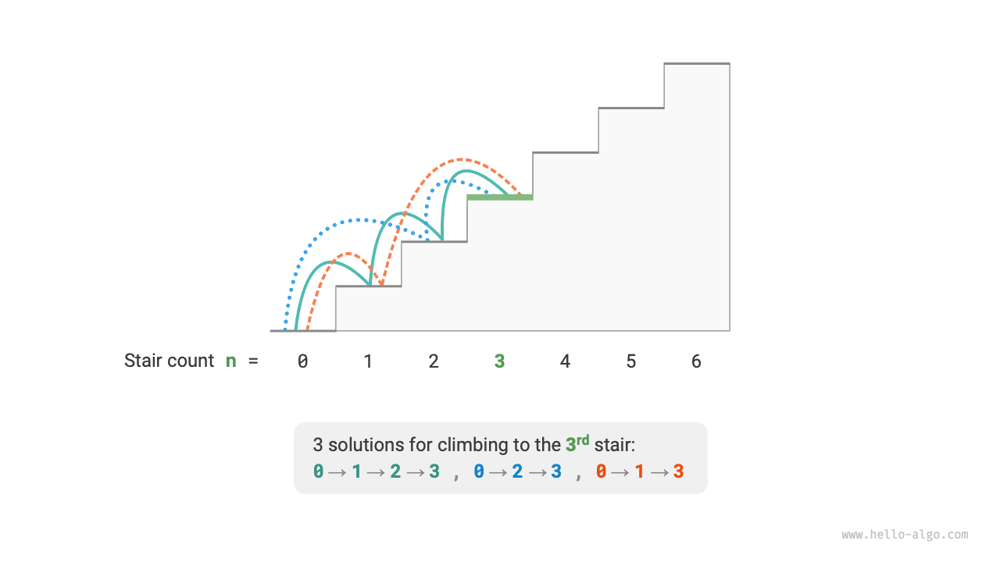
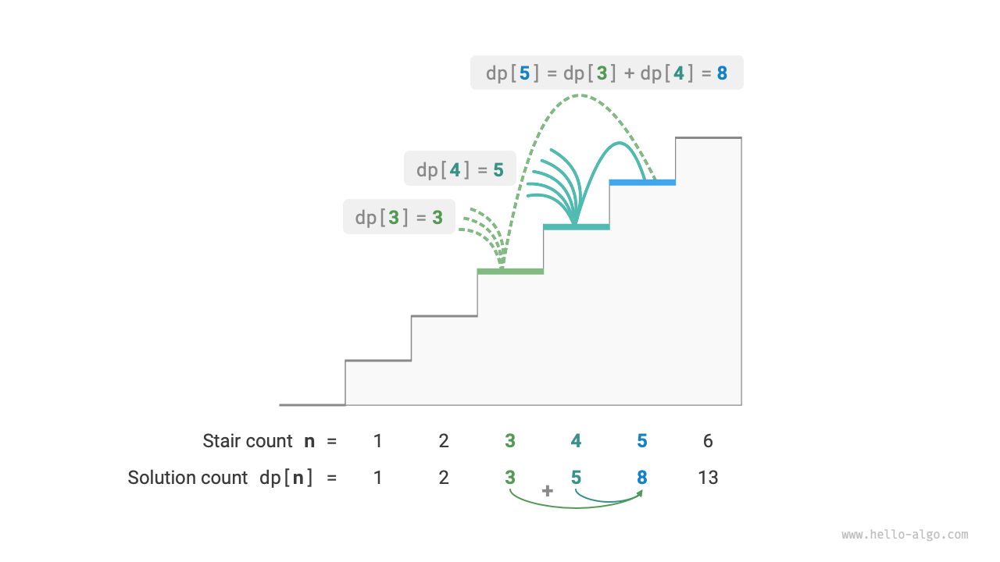
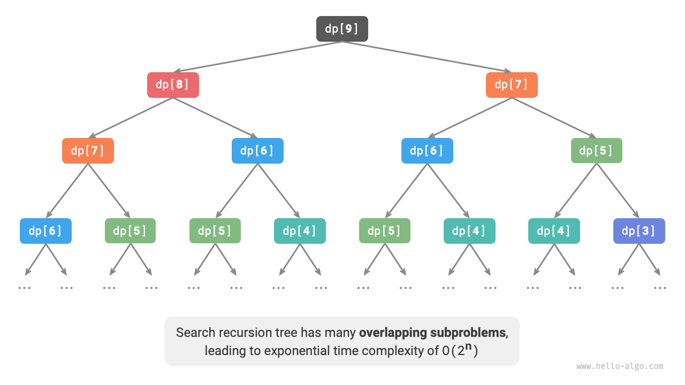
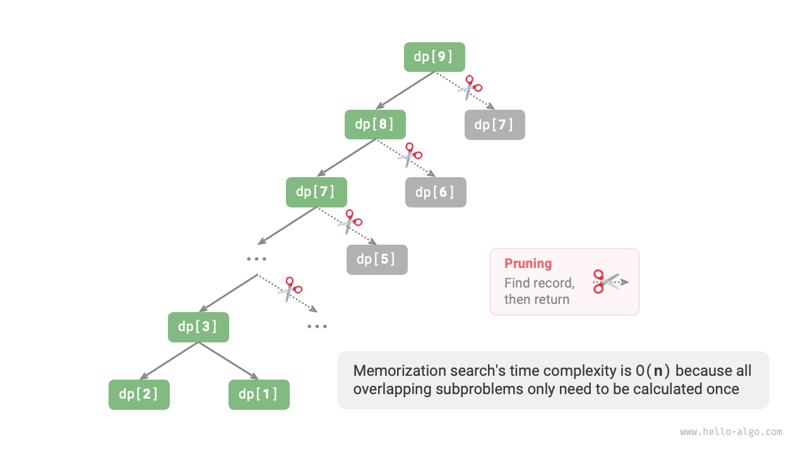
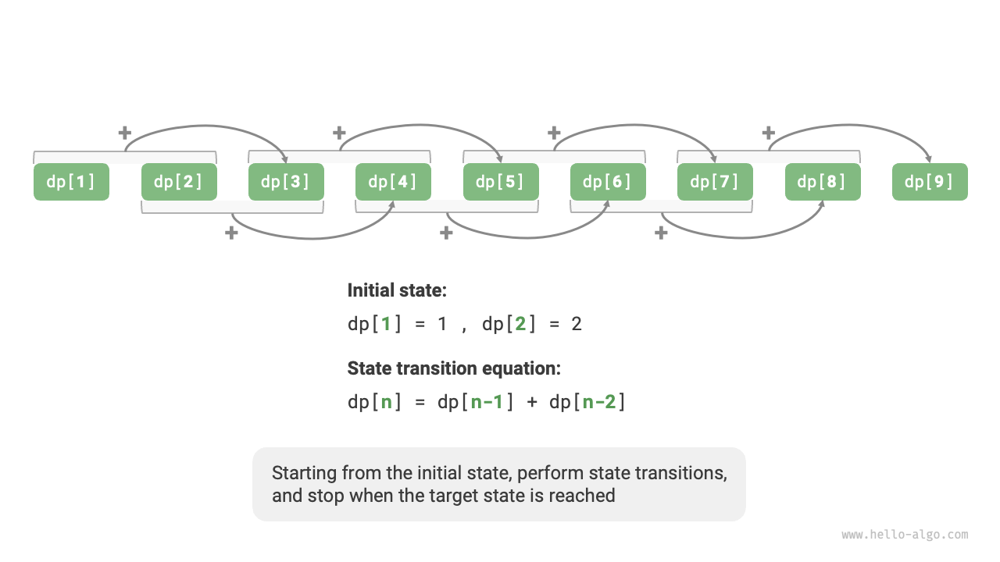

# 動的プログラミングの紹介

<u>動的プログラミング</u>は重要なアルゴリズムパラダイムであり、問題を一連の小さな部分問題に分解し、これらの部分問題の解を保存することで冗長な計算を避け、時間効率を大幅に向上させます。

このセクションでは、古典的な問題から始めて、まず力任せの探索法による解法を提示し、重複する部分問題を特定してから、より効率的な動的プログラミング解法を段階的に導出します。

!!! question "階段登り"

    $n$ 段の階段があり、一度に $1$ 段または $2$ 段上ることができます。頂上に到達する方法は何通りありますか？

下の図に示すように、$3$ 段の階段の頂上に到達する方法は $3$ 通りあります。



この問題は**バックトラッキングを用いてすべての可能性を網羅**することで方法の数を計算することを目的としています。具体的には、階段登りの問題を多段階選択プロセスとして考えます：地面から始めて、毎回 $1$ 段または $2$ 段上るかを選択し、階段の頂上に到達したら方法の数をカウントし、頂上を超えた場合はプルーニング（枝刈り）を行います。コードは以下の通りです：

```src
[file]{climbing_stairs_backtrack}-[class]{}-[func]{climbing_stairs_backtrack}
```

## 方法1：力任せ探索

バックトラッキングアルゴリズムは問題を明示的に部分問題に分解しません。代わりに、問題を一連の決定ステップとして扱い、試行と枝刈りを通じてすべての可能性を探索します。

この問題を分解アプローチを使って分析できます。$dp[i]$ を $i$ 段目に到達する方法の数とします。この場合、$dp[i]$ が元の問題であり、その部分問題は次のようになります：

$$
dp[i-1], dp[i-2], \dots, dp[2], dp[1]
$$

各移動は $1$ 段または $2$ 段しか進めないため、$i$ 段目に立っているとき、前のステップは $i-1$ 段目または $i-2$ 段目のいずれかにいたはずです。つまり、$i$ 段目には $i-1$ 段目または $i-2$ 段目からしか到達できません。

これにより重要な結論が得られます：**$i-1$ 段目に到達する方法の数に $i-2$ 段目に到達する方法の数を加えたものが、$i$ 段目に到達する方法の数に等しい**。式は以下の通りです：

$$
dp[i] = dp[i-1] + dp[i-2]
$$

これは、階段登り問題において部分問題間に再帰関係があることを意味し、**元の問題の解は部分問題の解から構築できます**。下の図はこの再帰関係を示しています。



再帰式に従って力任せ探索解法を得ることができます。$dp[n]$ から始めて、**より大きな問題を再帰的に2つの小さな部分問題の和に分解**し、解が既知の最小の部分問題 $dp[1]$ と $dp[2]$ に到達するまで続けます。$dp[1] = 1$ と $dp[2] = 2$ で、それぞれ1段目と2段目に登る方法が $1$ 通りと $2$ 通りあることを表します。

以下のコードを観察すると、標準的なバックトラッキングコードと同様に深さ優先探索に属しますが、より簡潔です：

```src
[file]{climbing_stairs_dfs}-[class]{}-[func]{climbing_stairs_dfs}
```

下の図は力任せ探索によって形成される再帰木を示しています。問題 $dp[n]$ について、その再帰木の深さは $n$ で、時間計算量は $O(2^n)$ です。この指数的増加により、$n$ が大きいとプログラムの実行がはるかに遅くなり、長い待機時間が生じます。



上の図を観察すると、**指数時間計算量は「重複する部分問題」によって引き起こされる**ことがわかります。例えば、$dp[9]$ は $dp[8]$ と $dp[7]$ に分解され、$dp[8]$ はさらに $dp[7]$ と $dp[6]$ に分解され、両方とも部分問題 $dp[7]$ を含んでいます。

このように、部分問題にはさらに小さな重複する部分問題が含まれ、これは無限に続きます。計算リソースの大部分がこれらの重複する部分問題に浪費されています。

## 方法2：メモ化探索

アルゴリズムの効率を向上させるため、**すべての重複する部分問題を一度だけ計算したい**と考えます。この目的のため、各部分問題の解を記録する配列 `mem` を宣言し、探索プロセス中に重複する部分問題を枝刈りします。

1. $dp[i]$ が初めて計算されるとき、後で使用するために `mem[i]` に記録します。
2. $dp[i]$ を再度計算する必要があるとき、`mem[i]` から直接結果を取得でき、その部分問題の冗長な計算を避けられます。

コードは以下の通りです：

```src
[file]{climbing_stairs_dfs_mem}-[class]{}-[func]{climbing_stairs_dfs_mem}
```

下の図を観察すると、**メモ化後、すべての重複する部分問題は一度だけ計算される必要があり、時間計算量を $O(n)$ に最適化**します。これは大幅な改善です。



## 方法3：動的プログラミング

**メモ化探索は「トップダウン」方式**です：元の問題（根ノード）から始めて、より大きな部分問題をより小さなものに再帰的に分解し、最小の既知の部分問題（葉ノード）の解に到達するまで続けます。その後、バックトラッキングにより部分問題の解を収集し、元の問題の解を構築します。

一方、**動的プログラミングは「ボトムアップ」方式**です：最小の部分問題の解から始めて、元の問題が解決されるまで、より大きな部分問題の解を反復的に構築します。

動的プログラミングはバックトラッキングを必要としないため、ループを使った反復のみが必要で、再帰は不要です。以下のコードでは、配列 `dp` を初期化して部分問題の解を保存し、メモ化探索の配列 `mem` と同じ記録機能を果たします：

```src
[file]{climbing_stairs_dp}-[class]{}-[func]{climbing_stairs_dp}
```

下の図は上記コードの実行プロセスをシミュレートしています。



バックトラッキングアルゴリズムと同様に、動的プログラミングも「状態」の概念を使用して問題解決の特定の段階を表現し、各状態は部分問題とその局所最適解に対応します。例えば、階段登り問題の状態は現在のステップ番号 $i$ として定義されます。

上記の内容に基づいて、動的プログラミングでよく使用される用語をまとめることができます。

- 配列 `dp` は<u>DPテーブル</u>と呼ばれ、$dp[i]$ は状態 $i$ に対応する部分問題の解を表します。
- 最小の部分問題（ステップ $1$ と $2$）に対応する状態は<u>初期状態</u>と呼ばれます。
- 再帰式 $dp[i] = dp[i-1] + dp[i-2]$ は<u>状態遷移方程式</u>と呼ばれます。

## 空間最適化

注意深い読者は**$dp[i]$ は $dp[i-1]$ と $dp[i-2]$ のみに関連するため、すべての部分問題の解を保存するために配列 `dp` を使用する必要がない**ことに気づくでしょう。単に2つの変数を使って反復的に進めることができます。コードは以下の通りです：

```src
[file]{climbing_stairs_dp}-[class]{}-[func]{climbing_stairs_dp_comp}
```

上記のコードを観察すると、配列 `dp` が占有していた空間が削除されるため、空間計算量は $O(n)$ から $O(1)$ に削減されます。

多くの動的プログラミング問題では、現在の状態は限られた数の前の状態のみに依存するため、必要な状態のみを保持し、「次元削減」によってメモリ空間を節約できます。**この空間最適化技術は「ローリング変数」または「ローリング配列」として知られています**。
