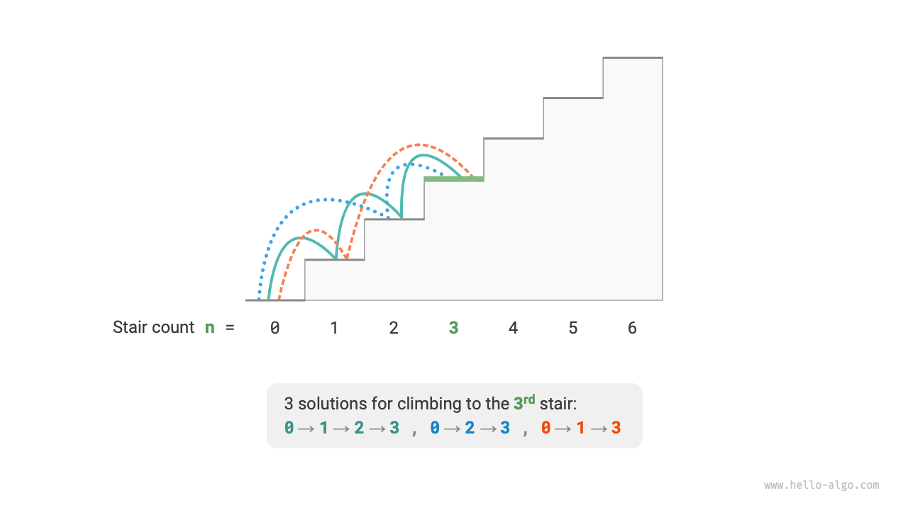
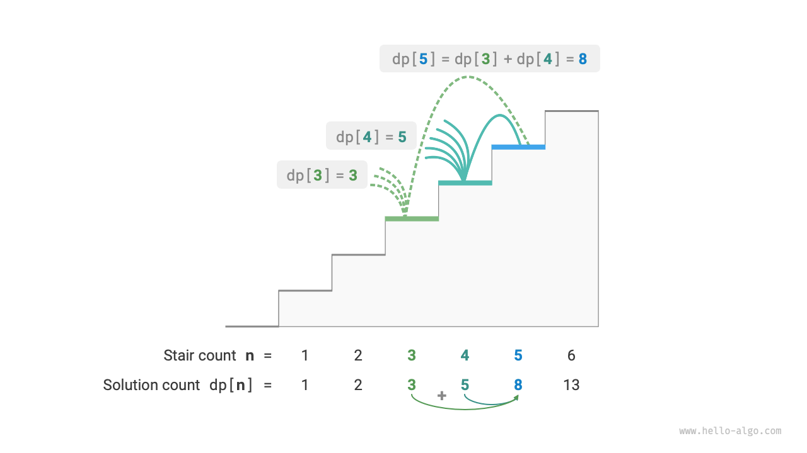
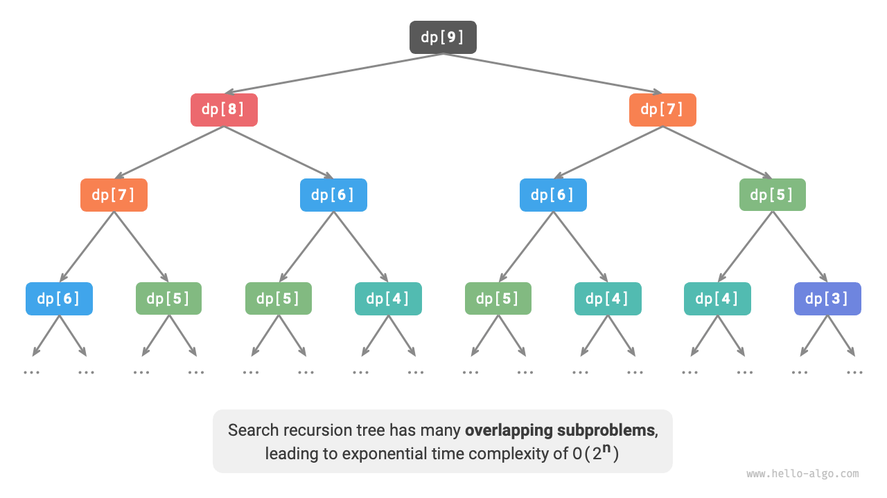
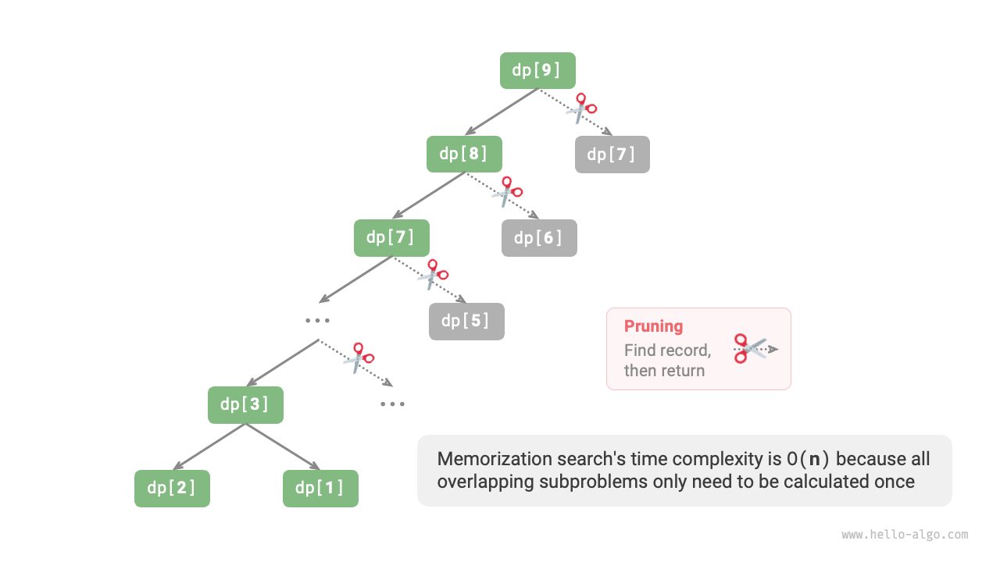
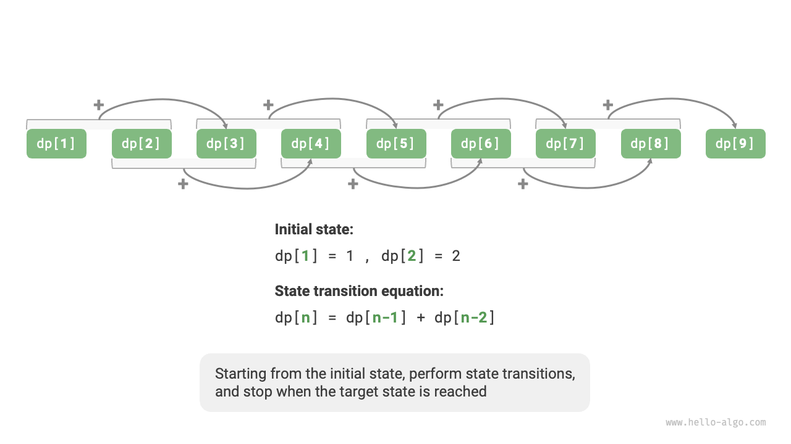

# 動的計画法入門

<u>動的計画法（dynamic programming）</u>は重要なアルゴリズムパラダイムであり、問題をより小さな部分問題の列に分解し、それらの解を保存して重複計算を避けることで、時間効率を大幅に向上させます。

本節では、古典的な例題から始めて、まずその力任せのバックトラッキング解法を示し、そこに含まれる重複部分問題を観察したうえで、より効率的な動的計画法の解法を段階的に導きます。

!!! question "階段を上る"

    全体で $n$ 段ある階段が与えられ、各ステップで $1$ 段または $2$ 段上ることができます。頂上まで到達する方法は何通りあるでしょうか？

次の図に示すように、$3$ 段の階段では、頂上まで到達する方法は全部で $3$ 通りあります。



この問題の目的は方法の総数を求めることです。**考えられるすべての可能性をバックトラッキングで総当たりすることができます**。具体的には、階段を上ることを複数ラウンドの選択過程とみなし、地面から出発して各ラウンドで $1$ 段または $2$ 段上ります。階段の頂上に到達するたびに方法数を $1$ 増やし、頂上を越えた場合は枝刈りします。コードは次のとおりです：

```src
[file]{climbing_stairs_backtrack}-[class]{}-[func]{climbing_stairs_backtrack}
```

## 方法 1：総当たり探索

バックトラッキング法は通常、問題を明示的に分解するのではなく、問題解決を一連の意思決定ステップとみなし、試行と枝刈りによってあらゆる可能な解を探索します。

この問題を問題分解の観点から分析してみましょう。$i$ 段目まで上る方法が全部で $dp[i]$ 通りあるとすると、$dp[i]$ が元の問題であり、その部分問題には次が含まれます：

$$
dp[i-1], dp[i-2], \dots, dp[2], dp[1]
$$

各ラウンドでは $1$ 段または $2$ 段しか上れないため、$i$ 段目の階段に立っているとき、直前のラウンドでは $i - 1$ 段目または $i - 2$ 段目にしか立てません。言い換えると、$i -1$ 段目または $i - 2$ 段目からしか $i$ 段目へ進めません。

ここから重要な帰結が得られます。**$i - 1$ 段目まで上る方法数と $i - 2$ 段目まで上る方法数の和が、$i$ 段目まで上る方法数に等しい**のです。式は次のとおりです：

$$
dp[i] = dp[i-1] + dp[i-2]
$$

これは、階段を上る問題では各部分問題の間に漸化関係があり、**元の問題の解は部分問題の解から構築できる**ことを意味します。次の図はこの漸化関係を示しています。



漸化式に基づいて総当たり探索の解法を得ることができます。$dp[n]$ を出発点とし、**より大きな問題を再帰的に 2 つのより小さな問題の和へ分解**していき、最小部分問題 $dp[1]$ と $dp[2]$ に到達したら返します。ここで最小部分問題の解は既知であり、$dp[1] = 1$、$dp[2] = 2$ です。これは、第 $1$ 段目と第 $2$ 段目まで上る方法がそれぞれ $1$ 通り、$2$ 通りであることを表します。

次のコードを見ると、標準的なバックトラッキングコードと同じく深さ優先探索に属しますが、より簡潔です：

```src
[file]{climbing_stairs_dfs}-[class]{}-[func]{climbing_stairs_dfs}
```

次の図は総当たり探索によって形成される再帰木を示しています。問題 $dp[n]$ に対して、その再帰木の深さは $n$、時間計算量は $O(2^n)$ です。指数オーダーは爆発的に増加するため、比較的大きな $n$ を入力すると長時間待たされることになります。



上の図を見ると、**指数オーダーの時間計算量は「重複部分問題」によって生じています**。たとえば $dp[9]$ は $dp[8]$ と $dp[7]$ に分解され、$dp[8]$ は $dp[7]$ と $dp[6]$ に分解されるため、どちらにも部分問題 $dp[7]$ が含まれています。

このように、部分問題の中にはさらに小さな重複部分問題が含まれ、それが際限なく続いていきます。計算資源の大部分は、こうした重複部分問題に浪費されています。

## 方法 2：メモ化探索

アルゴリズム効率を高めるため、**すべての重複部分問題を 1 回だけ計算したい**と考えます。そのために、各部分問題の解を記録する配列 `mem` を宣言し、探索の過程で重複部分問題を枝刈りします。

1. $dp[i]$ を初めて計算したとき、その結果を `mem[i]` に記録して後で使えるようにします。
2. 再び $dp[i]$ を計算する必要が生じたときは、`mem[i]` から直接結果を取得し、その部分問題の重複計算を避けます。

コードは次のとおりです：

```src
[file]{climbing_stairs_dfs_mem}-[class]{}-[func]{climbing_stairs_dfs_mem}
```

次の図を見ると、**メモ化を行うことで、すべての重複部分問題は 1 回だけ計算すればよくなり、時間計算量は $O(n)$ まで改善されます**。これは大きな飛躍です。



## 方法 3：動的計画法

**メモ化探索は「トップダウン」の方法**です。元の問題（根ノード）から始めて、より大きな部分問題を再帰的により小さな部分問題へ分解し、解が既知である最小部分問題（葉ノード）に至ります。その後、バックトラックしながら各層で部分問題の解を集め、元の問題の解を構築します。

これとは対照的に、**動的計画法は「ボトムアップ」の方法**です。最小部分問題の解から始めて、より大きな部分問題の解を反復的に構築し、最終的に元の問題の解を得ます。

動的計画法にはバックトラックの過程が含まれないため、再帰を使う必要はなく、ループによる反復だけで実装できます。次のコードでは、部分問題の解を保存する配列 `dp` を初期化しており、これはメモ化探索における配列 `mem` と同じ記録の役割を果たします：

```src
[file]{climbing_stairs_dp}-[class]{}-[func]{climbing_stairs_dp}
```

次の図は、以上のコードの実行過程をシミュレートしたものです。



バックトラッキング法と同様に、動的計画法でも問題解決の特定段階を表すために「状態」という概念を用います。各状態は 1 つの部分問題と、それに対応する局所最適解に対応します。たとえば、階段を上る問題では、状態は現在いる階段の段数 $i$ と定義されます。

以上を踏まえると、動的計画法のよく使われる用語を次のようにまとめられます。

- 配列 `dp` を <u>dp テーブル</u> と呼び、$dp[i]$ は状態 $i$ に対応する部分問題の解を表します。
- 最小部分問題に対応する状態（第 $1$ 段目と第 $2$ 段目の階段）を<u>初期状態</u>と呼びます。
- 漸化式 $dp[i] = dp[i-1] + dp[i-2]$ を<u>状態遷移方程式</u>と呼びます。

## 空間最適化

注意深い読者は気づいたかもしれません。**$dp[i]$ は $dp[i-1]$ と $dp[i-2]$ にしか依存しないため、すべての部分問題の解を保存するために配列 `dp` を使う必要はありません**。2 つの変数を順に更新していくだけで十分です。コードは次のとおりです：

```src
[file]{climbing_stairs_dp}-[class]{}-[func]{climbing_stairs_dp_comp}
```

上のコードを見ると、配列 `dp` が占めていた領域を省けるため、空間計算量は $O(n)$ から $O(1)$ へと下がります。

動的計画法の問題では、現在の状態はしばしば直前の限られた個数の状態にしか関係しません。このような場合は、必要な状態だけを保持し、「次元削減」によってメモリ空間を節約できます。**この空間最適化の技巧は「ローリング変数」または「ローリング配列」と呼ばれます**。
