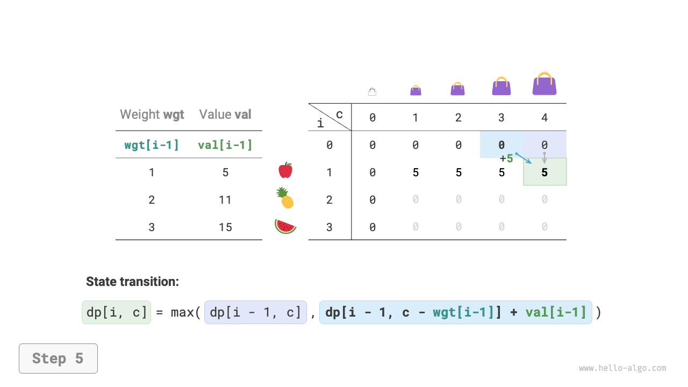

# 0-1ナップサック問題

ナップサック問題は動的プログラミングの優れた入門問題であり、動的プログラミングで最も一般的な問題タイプです。0-1ナップサック問題、無制限ナップサック問題、複数ナップサック問題など、多くの変種があります。

このセクションでは、まず最も一般的な0-1ナップサック問題を解決します。

!!! question

    $n$ 個のアイテムが与えられ、$i$ 番目のアイテムの重量は $wgt[i-1]$ で値は $val[i-1]$ です。容量が $cap$ のナップサックがあります。各アイテムは1回のみ選択できます。容量制限下でナップサックに入れることができるアイテムの最大値は何ですか？

下の図を観察すると、アイテム番号 $i$ は1から数え始め、配列インデックスは0から始まるため、アイテム $i$ の重量は $wgt[i-1]$ に対応し、値は $val[i-1]$ に対応します。


0-1ナップサック問題を $n$ ラウンドの決定から構成されるプロセスとして考えることができます。各アイテムについて入れない、または入れるという2つの決定があり、したがって問題は決定木モデルに適合します。

この問題の目的は「限られた容量の下でナップサックに入れることができるアイテムの値を最大化する」ことであり、動的プログラミング問題である可能性が高いです。

**第1ステップ：各ラウンドの決定を考え、状態を定義し、それにより $dp$ テーブルを得る**

各アイテムについて、ナップサックに入れなければ容量は変わらず、入れれば容量は減少します。これから状態定義を得ることができます：現在のアイテム番号 $i$ とナップサック容量 $c$、$[i, c]$ と表記されます。

状態 $[i, c]$ は部分問題に対応します：**容量 $c$ のナップサックでの最初の $i$ 個のアイテムの最大値**、$dp[i, c]$ と表記されます。

探している解は $dp[n, cap]$ であるため、サイズ $(n+1) \times (cap+1)$ の二次元 $dp$ テーブルが必要です。

**第2ステップ：最適部分構造を特定し、状態遷移方程式を導出する**

アイテム $i$ の決定を行った後、残るのは最初の $i-1$ 個のアイテムの決定の部分問題であり、これは2つのケースに分けることができます。

- **アイテム $i$ を入れない**：ナップサック容量は変わらず、状態は $[i-1, c]$ に変わります。
- **アイテム $i$ を入れる**：ナップサック容量は $wgt[i-1]$ だけ減少し、値は $val[i-1]$ だけ増加し、状態は $[i-1, c-wgt[i-1]]$ に変わります。

上記の分析により、この問題の最適部分構造が明らかになります：**最大値 $dp[i, c]$ は、アイテム $i$ を入れない方案とアイテム $i$ を入れる方案の2つのうち、より大きな値に等しい**。これから状態遷移方程式を導出できます：

$$
dp[i, c] = \max(dp[i-1, c], dp[i-1, c - wgt[i-1]] + val[i-1])
$$

現在のアイテムの重量 $wgt[i - 1]$ が残りのナップサック容量 $c$ を超える場合、唯一の選択肢はナップサックに入れないことであることに注意することが重要です。

**第3ステップ：境界条件と状態遷移の順序を決定する**

アイテムがない場合またはナップサック容量が $0$ の場合、最大値は $0$ です。つまり、最初の列 $dp[i, 0]$ と最初の行 $dp[0, c]$ はどちらも $0$ に等しいです。

現在の状態 $[i, c]$ は直接上の状態 $[i-1, c]$ と左上の状態 $[i-1, c-wgt[i-1]]$ から遷移するため、2層のループを通じて $dp$ テーブル全体を順序通りに走査します。

上記の分析に従って、次に力任せ探索、メモ化探索、動的プログラミングの順序で解法を実装します。

### 方法1：力任せ探索

探索コードには以下の要素が含まれます。

- **再帰パラメータ**：状態 $[i, c]$。
- **戻り値**：部分問題 $dp[i, c]$ の解。
- **終了条件**：アイテム番号が範囲外 $i = 0$ またはナップサックの残り容量が $0$ のとき、再帰を終了し値 $0$ を返す。
- **枝刈り**：現在のアイテムの重量がナップサックの残り容量を超える場合、唯一の選択肢はナップサックに入れないことです。

```src
[file]{knapsack}-[class]{}-[func]{knapsack_dfs}
```

下の図に示すように、各アイテムは選択しないと選択するという2つの探索分岐を生成するため、時間計算量は $O(2^n)$ です。

再帰木を観察すると、$dp[1, 10]$ などの重複する部分問題があることが容易にわかります。アイテムが多く、ナップサック容量が大きい場合、特に同じ重量のアイテムが多い場合、重複する部分問題の数は大幅に増加します。


### 方法2：メモ化探索

重複する部分問題が一度だけ計算されることを確保するために、部分問題の解を記録するメモ化リスト `mem` を使用します。ここで `mem[i][c]` は $dp[i, c]$ に対応します。

メモ化を導入した後、**時間計算量は部分問題の数に依存**し、$O(n \times cap)$ になります。実装コードは以下の通りです：

```src
[file]{knapsack}-[class]{}-[func]{knapsack_dfs_mem}
```

下の図はメモ化探索で枝刈りされる探索分岐を示しています。


### 方法3：動的プログラミング

動的プログラミングは本質的に状態遷移中に $dp$ テーブルを埋めることを含みます。コードは下の図に示されています：

```src
[file]{knapsack}-[class]{}-[func]{knapsack_dp}
```

下の図に示すように、時間計算量と空間計算量の両方が配列 `dp` のサイズ、つまり $O(n \times cap)$ によって決定されます。

=== "<1>"
    

=== "<2>"
    

=== "<3>"
    

=== "<4>"
    

=== "<5>"
    

=== "<6>"
    

=== "<7>"
    

=== "<8>"
    

=== "<9>"
    

=== "<10>"
    

=== "<11>"
    

=== "<12>"
    

=== "<13>"
    

=== "<14>"
    

### 空間最適化

各状態は上の行の状態のみに関連するため、2つの配列を使用してローリング前進させ、空間計算量を $O(n^2)$ から $O(n)$ に削減できます。

さらに考えてみると、1つの配列だけで空間最適化を達成できるでしょうか？各状態が直接上のセルまたは左上のセルから遷移することが観察できます。配列が1つしかない場合、$i$ 行目の走査を開始するとき、その配列はまだ $i-1$ 行目の状態を保存しています。

- 通常の順序で走査する場合、$dp[i, j]$ に走査したとき、左上の $dp[i-1, 1]$ ～ $dp[i-1, j-1]$ の値がすでに上書きされている可能性があり、正しい状態遷移結果を得ることができません。
- 逆順で走査する場合、上書き問題はなく、状態遷移を正しく実行できます。

下の図は単一配列での $i = 1$ 行目から $i = 2$ 行目への遷移プロセスを示しています。通常順序走査と逆順走査の違いについて考えてみてください。

=== "<1>"
    

=== "<2>"
    

=== "<3>"
    

=== "<4>"
    

=== "<5>"
    

=== "<6>"
    

コード実装では、配列 `dp` の最初の次元 $i$ を削除し、内側のループを逆走査に変更するだけです：

```src
[file]{knapsack}-[class]{}-[func]{knapsack_dp_comp}
```
