# 完全ナップサック問題

本節では、まずもう 1 つの代表的なナップサック問題である完全ナップサック問題を解き、その特殊例である硬貨交換問題について見ていきます。

## 完全ナップサック問題

!!! question

    $n$ 個の品物が与えられ、$i$ 番目の品物の重さは $wgt[i-1]$、価値は $val[i-1]$ であり、容量 $cap$ のナップサックがあります。**各品物は繰り返し選択できます**。ナップサック容量の制約下で入れられる品物の最大価値を求めてください。例を以下の図に示します。

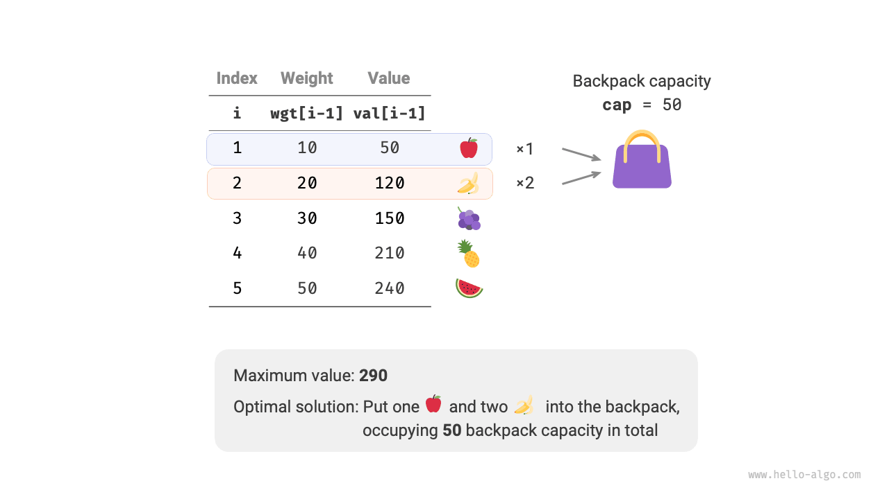

### 動的計画法の考え方

完全ナップサック問題は 0-1 ナップサック問題と非常によく似ています。**違いは、品物の選択回数に制限がない点だけです**。

- 0-1 ナップサック問題では、各品物は 1 つしかないため、品物 $i$ をナップサックに入れた後は先頭 $i-1$ 個の品物からしか選べません。
- 完全ナップサック問題では、各品物の数は無限であるため、品物 $i$ をナップサックに入れた後も、**引き続き先頭 $i$ 個の品物から選べます**。

完全ナップサック問題では、状態 $[i, c]$ の変化は 2 つの場合に分けられます。

- **品物 $i$ を入れない** ：0-1 ナップサック問題と同様に、$[i-1, c]$ へ遷移します。
- **品物 $i$ を入れる** ：0-1 ナップサック問題とは異なり、$[i, c-wgt[i-1]]$ へ遷移します。

したがって、状態遷移方程式は次のようになります。

$$
dp[i, c] = \max(dp[i-1, c], dp[i, c - wgt[i-1]] + val[i-1])
$$

### コード実装

2 つの問題のコードを比較すると、状態遷移の中で 1 か所だけ $i-1$ が $i$ に変わり、それ以外は完全に同じです。

```src
[file]{unbounded_knapsack}-[class]{}-[func]{unbounded_knapsack_dp}
```

### 空間最適化

現在の状態は左側と上側の状態から遷移してくるため、**空間最適化後は $dp$ テーブルの各行を順方向に走査する必要があります**。

この走査順序は 0-1 ナップサックとはちょうど逆です。両者の違いは次の図を用いて理解してください。

=== "<1>"
    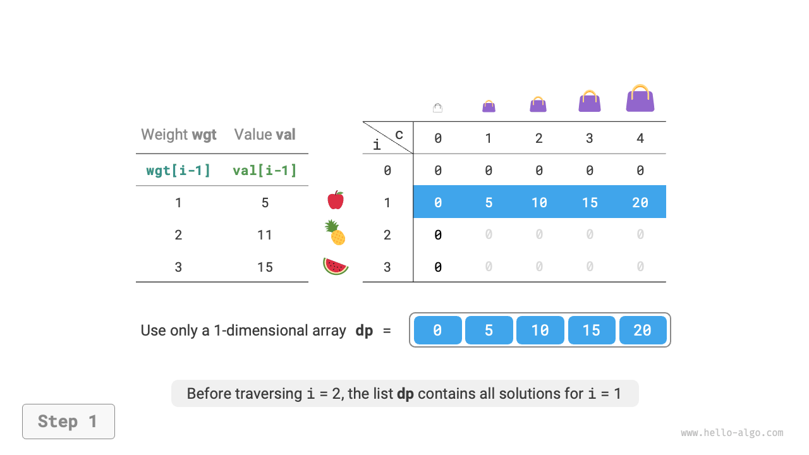

=== "<2>"
    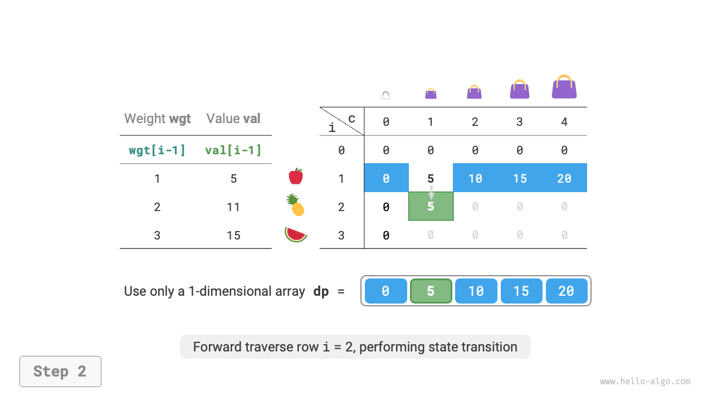

=== "<3>"
    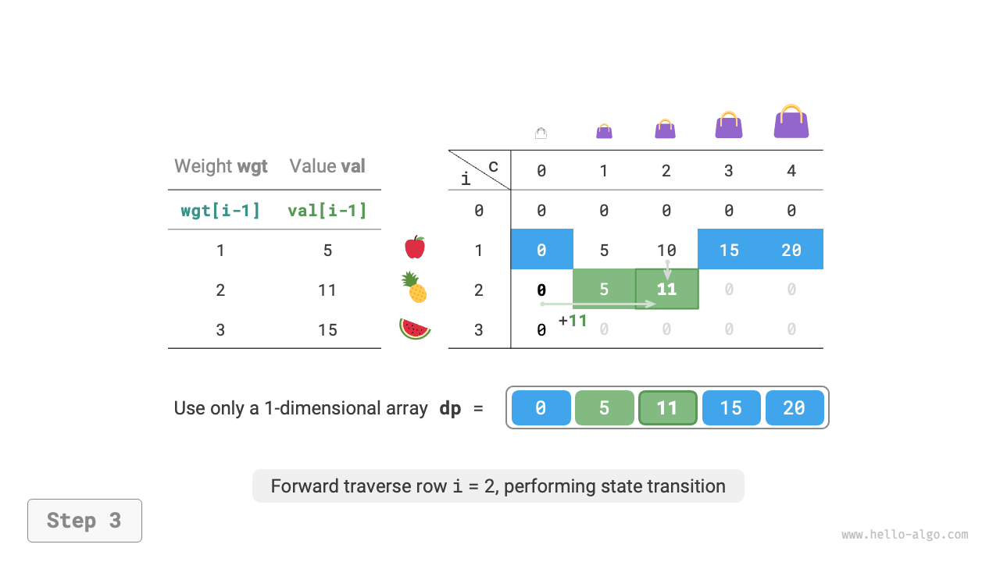

=== "<4>"
    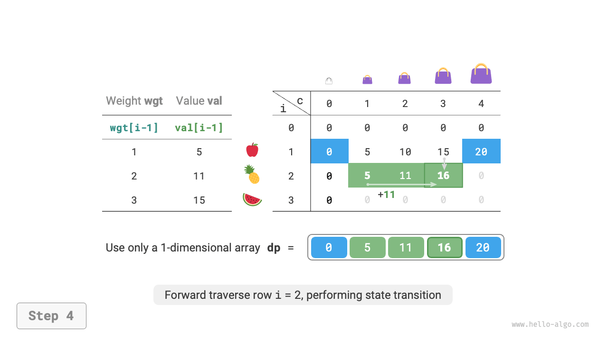

=== "<5>"
    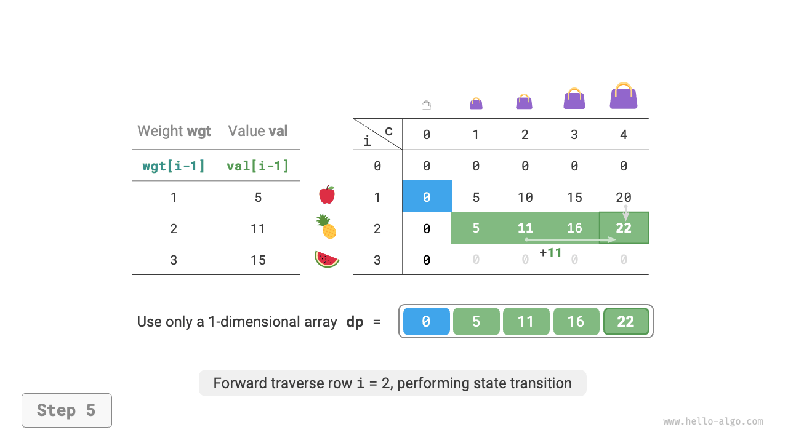

=== "<6>"
    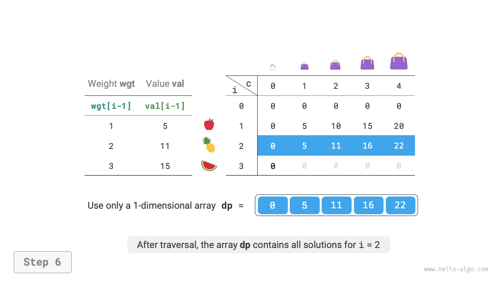

コード実装は比較的簡単で、配列 `dp` の第 1 次元を削除するだけです。

```src
[file]{unbounded_knapsack}-[class]{}-[func]{unbounded_knapsack_dp_comp}
```

## 硬貨交換問題

ナップサック問題は動的計画法の代表的な問題群であり、多くの派生問題があります。硬貨交換問題もその 1 つです。

!!! question

    $n$ 種類の硬貨が与えられ、$i$ 番目の硬貨の額面は $coins[i - 1]$ 、目標金額は $amt$ です。**各硬貨は繰り返し選択できます**。目標金額を作るために必要な最小の硬貨枚数を求めてください。目標金額を作れない場合は $-1$ を返します。例を以下の図に示します。

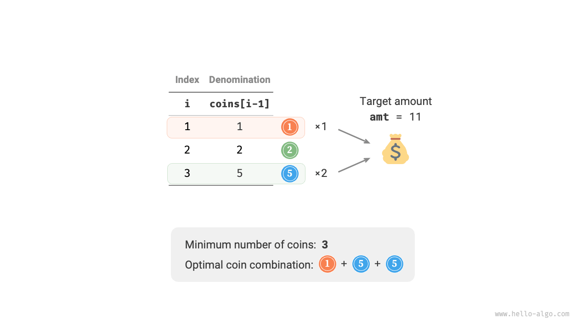

### 動的計画法の考え方

**硬貨交換は完全ナップサック問題の特殊なケースとみなせます**。両者には次の対応関係と相違点があります。

- 2 つの問題は相互に変換でき、「品物」は「硬貨」、「品物の重さ」は「硬貨の額面」、「ナップサック容量」は「目標金額」に対応します。
- 最適化の目標は逆であり、完全ナップサック問題は品物価値の最大化、硬貨交換問題は硬貨枚数の最小化を目指します。
- 完全ナップサック問題はナップサック容量を「超えない」解を求めますが、硬貨交換は目標金額に「ちょうど」一致する解を求めます。

**ステップ 1：各ラウンドの選択を考え、状態を定義して、$dp$ テーブルを得る**

状態 $[i, a]$ に対応する部分問題は、**先頭 $i$ 種類の硬貨で金額 $a$ を作るための最小硬貨枚数**であり、これを $dp[i, a]$ と表します。

2 次元 $dp$ テーブルのサイズは $(n+1) \times (amt+1)$ です。

**ステップ 2：最適部分構造を見つけ、状態遷移方程式を導く**

本問の状態遷移方程式は、完全ナップサック問題と比べて次の 2 点が異なります。

- 本問では最小値を求めるため、演算子 $\max()$ を $\min()$ に変更する必要があります。
- 最適化の対象は品物価値ではなく硬貨枚数であるため、硬貨を選んだときは $+1$ すれば十分です。

$$
dp[i, a] = \min(dp[i-1, a], dp[i, a - coins[i-1]] + 1)
$$

**ステップ 3：境界条件と状態遷移順序を決める**

目標金額が $0$ のとき、それを作るための最小硬貨枚数は $0$ です。つまり、先頭列のすべての $dp[i, 0]$ は $0$ になります。

硬貨が 1 枚もない場合、**任意の $> 0$ の目標金額を作ることはできません**。これは無効解です。状態遷移方程式内の $\min()$ 関数が無効解を識別して除外できるように、それらを $+ \infty$ で表すことを考えます。すなわち、先頭行のすべての $dp[0, a]$ を $+ \infty$ とします。

### コード実装

多くのプログラミング言語には $+ \infty$ を表す変数が用意されていないため、通常は整数型 `int` の最大値で代用します。しかし、その場合は大きな数のオーバーフローが起こり得ます。状態遷移方程式中の $+ 1$ 操作で桁あふれが発生する可能性があるためです。

そのため、ここでは数値 $amt + 1$ を無効解の表現として用います。金額 $amt$ を作るための硬貨枚数は最大でも $amt$ 枚だからです。最後に返す前に、$dp[n, amt]$ が $amt + 1$ に等しいかを判定し、等しければ $-1$ を返して目標金額を作れないことを表します。コードは次のとおりです。

```src
[file]{coin_change}-[class]{}-[func]{coin_change_dp}
```

次の図は硬貨交換の動的計画法の過程を示しており、完全ナップサック問題と非常によく似ています。

=== "<1>"
    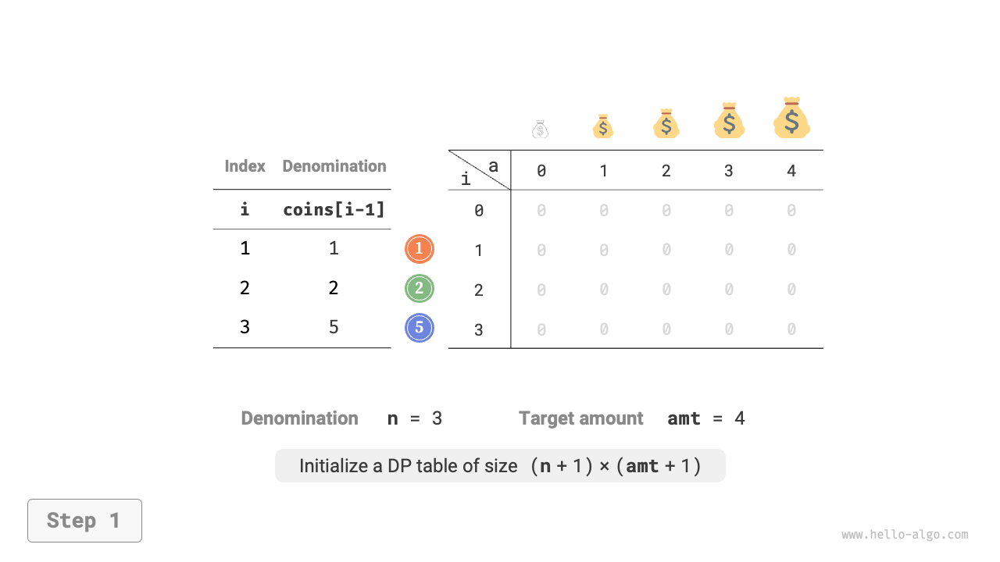

=== "<2>"
    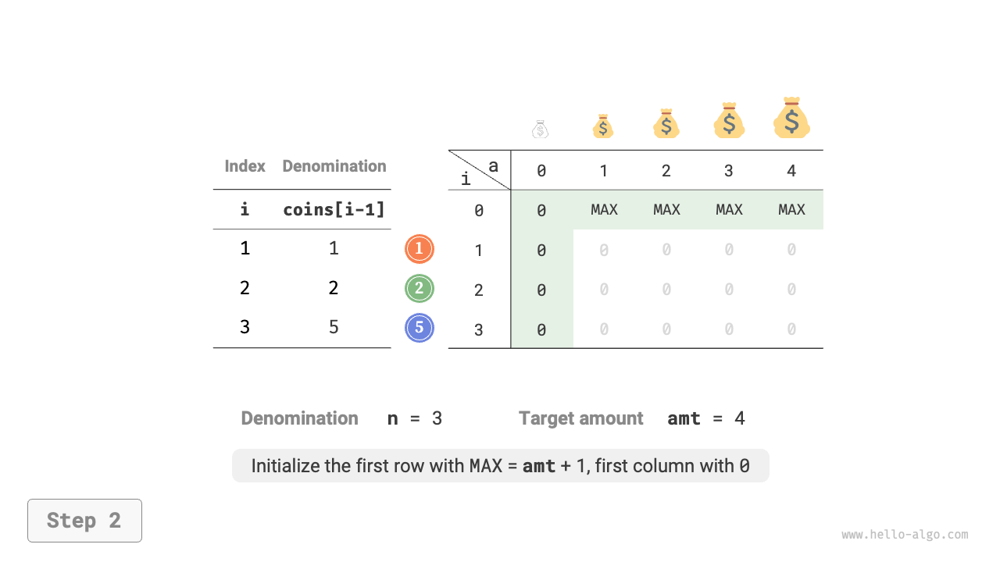

=== "<3>"
    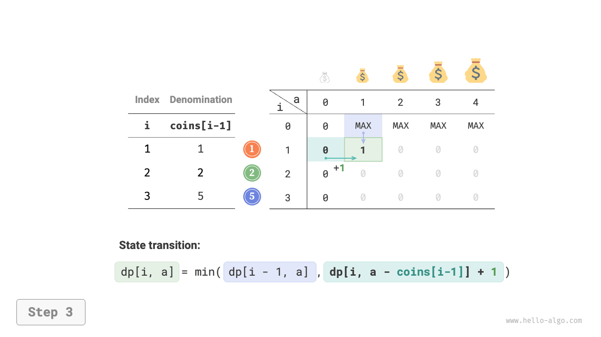

=== "<4>"
    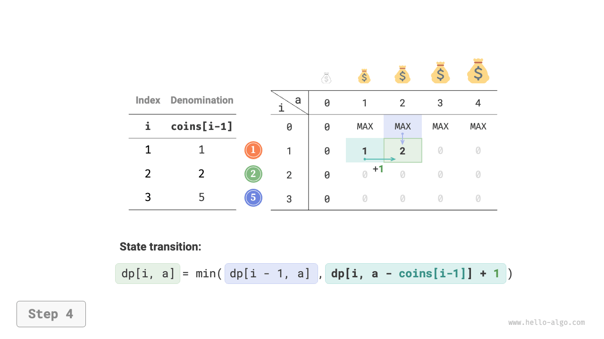

=== "<5>"
    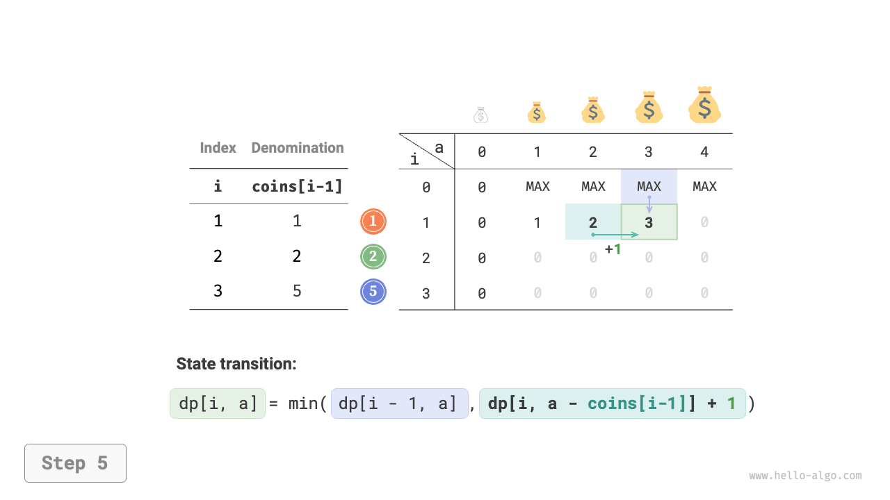

=== "<6>"
    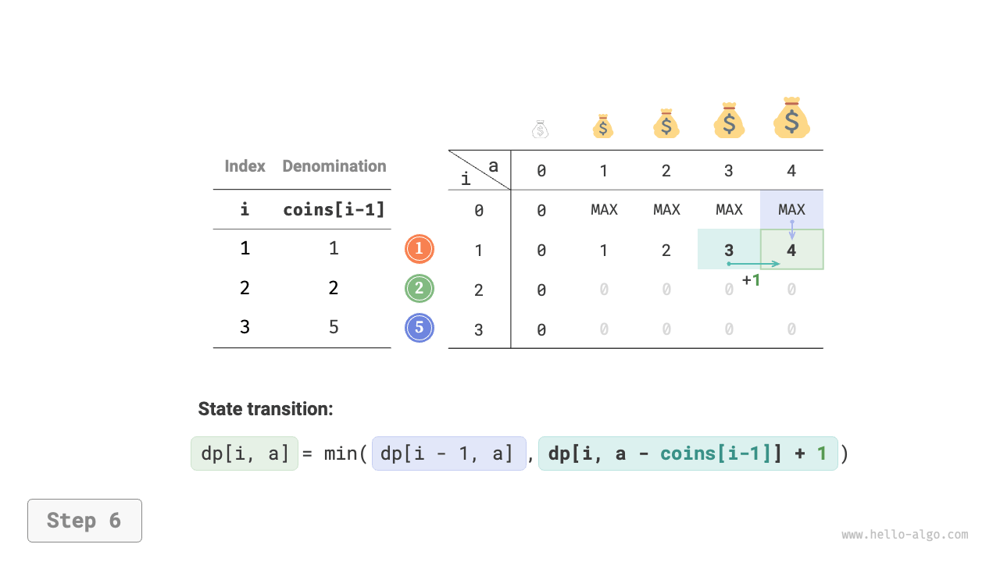

=== "<7>"
    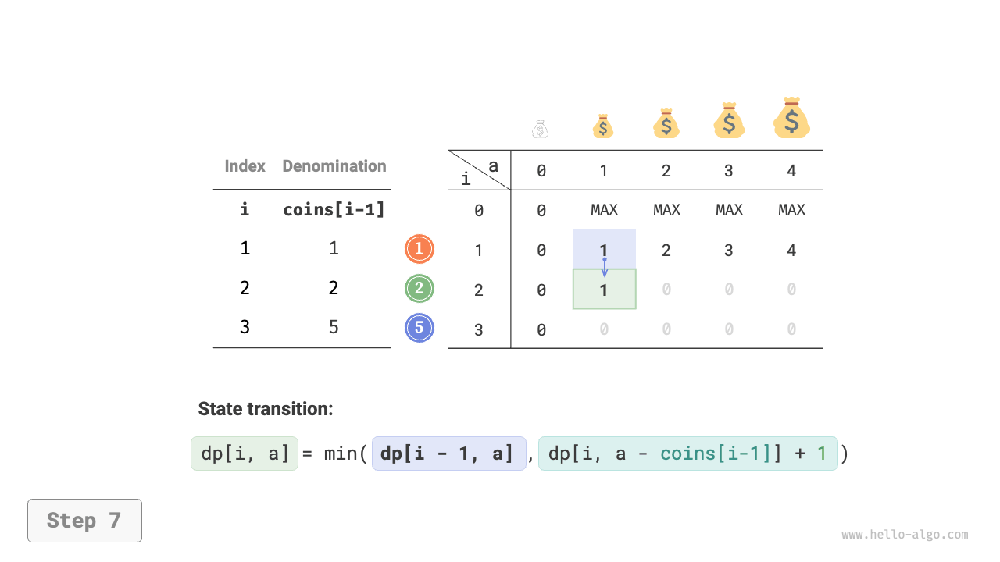

=== "<8>"
    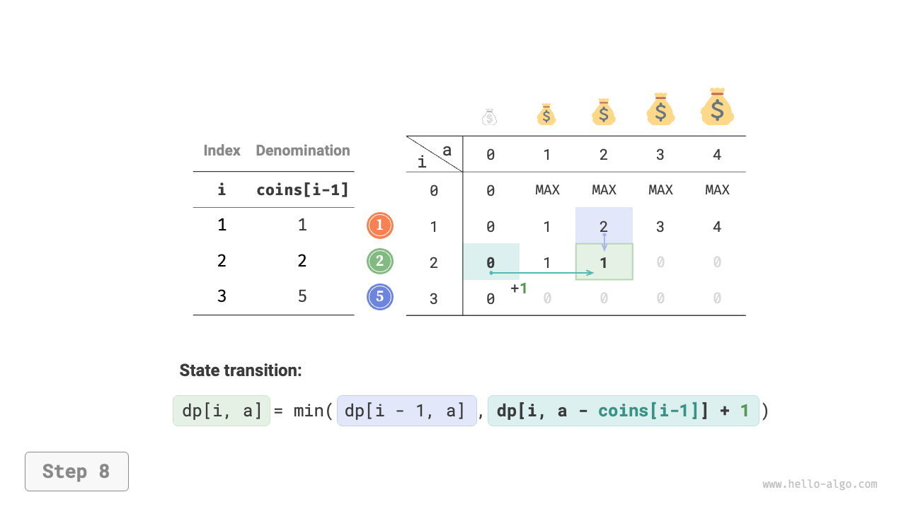

=== "<9>"
    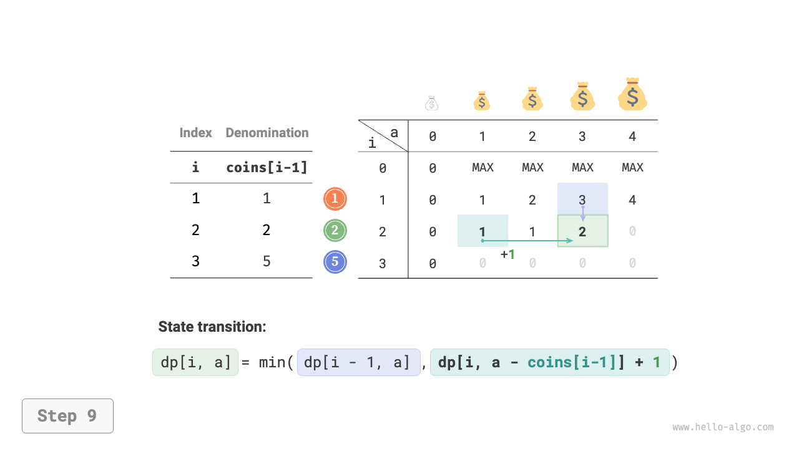

=== "<10>"
    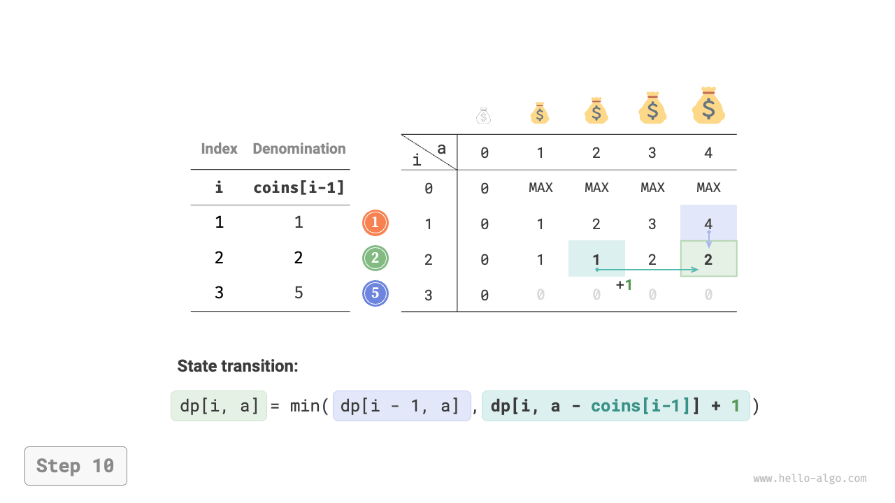

=== "<11>"
    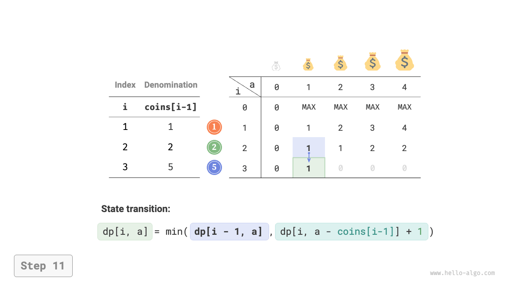

=== "<12>"
    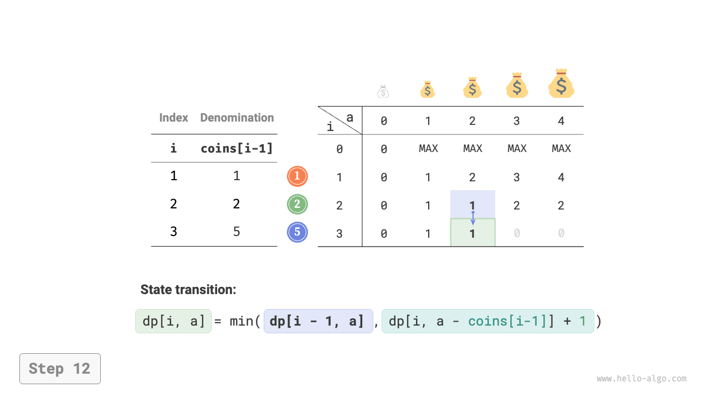

=== "<13>"
    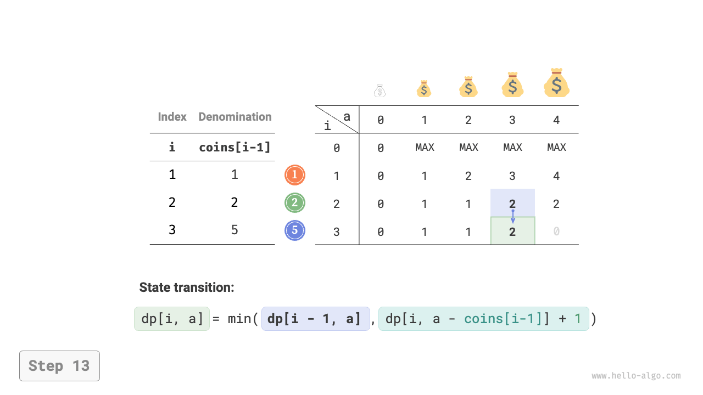

=== "<14>"
    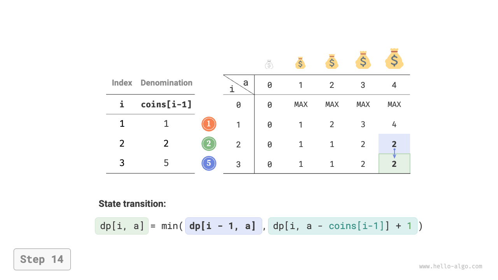

=== "<15>"
    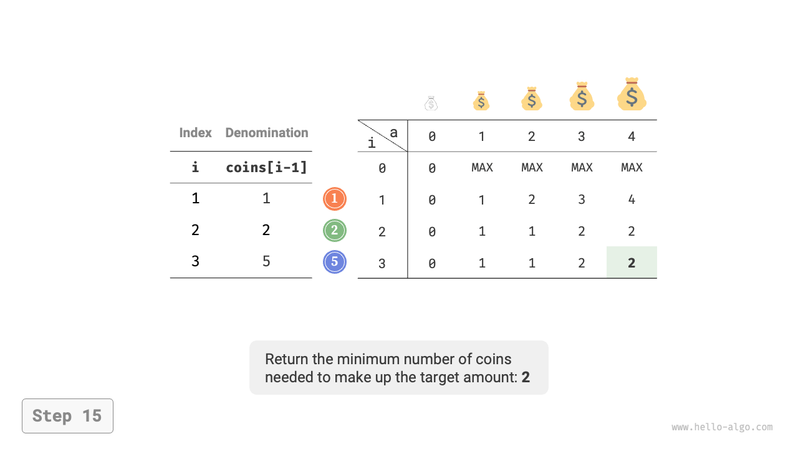

### 空間最適化

硬貨交換の空間最適化の方法は、完全ナップサック問題と同じです。

```src
[file]{coin_change}-[class]{}-[func]{coin_change_dp_comp}
```

## 硬貨交換問題 II

!!! question

    $n$ 種類の硬貨が与えられ、$i$ 番目の硬貨の額面は $coins[i - 1]$ 、目標金額は $amt$ です。各硬貨は繰り返し選択できるとして、**目標金額を作る硬貨の組合せ数**を求めてください。例を以下の図に示します。

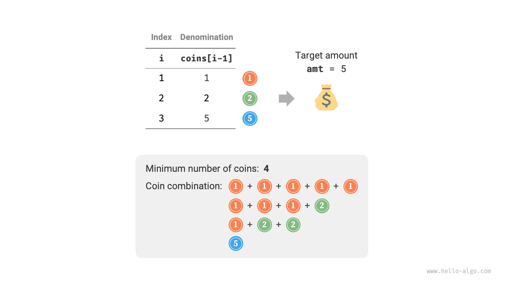

### 動的計画法の考え方

前問と比べて、本問の目的は組合せ数を求めることです。そのため、部分問題は **先頭 $i$ 種類の硬貨で金額 $a$ を作れる組合せ数** になります。一方、$dp$ テーブルは引き続きサイズ $(n+1) \times (amt + 1)$ の 2 次元行列です。

現在の状態における組合せ数は、現在の硬貨を選ばない場合と選ぶ場合の 2 つの選択肢の組合せ数の和に等しくなります。状態遷移方程式は次のとおりです。

$$
dp[i, a] = dp[i-1, a] + dp[i, a - coins[i-1]]
$$

目標金額が $0$ のときは、どの硬貨も選ばなくても目標金額を作れるため、先頭列のすべての $dp[i, 0]$ を $1$ に初期化します。硬貨がないときは、任意の $>0$ の目標金額を作れないため、先頭行のすべての $dp[0, a]$ は $0$ になります。

### コード実装

```src
[file]{coin_change_ii}-[class]{}-[func]{coin_change_ii_dp}
```

### 空間最適化

空間最適化の方法も同様で、硬貨の次元を削除するだけです。

```src
[file]{coin_change_ii}-[class]{}-[func]{coin_change_ii_dp_comp}
```
