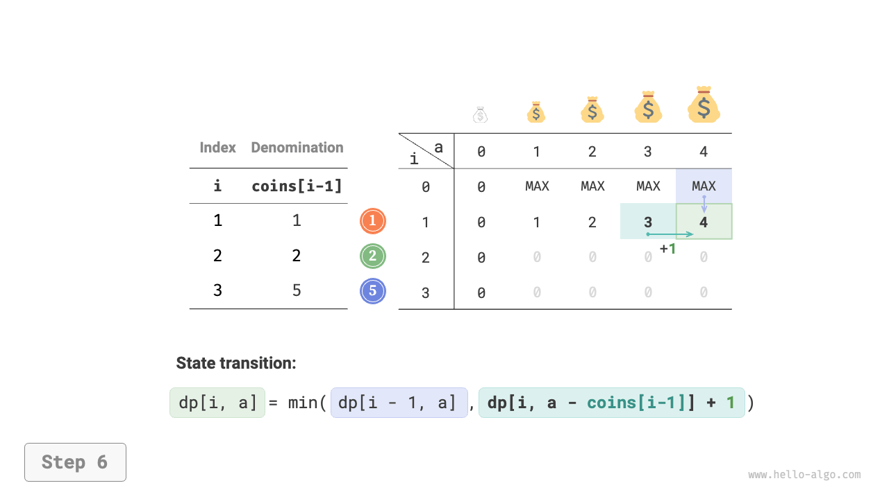
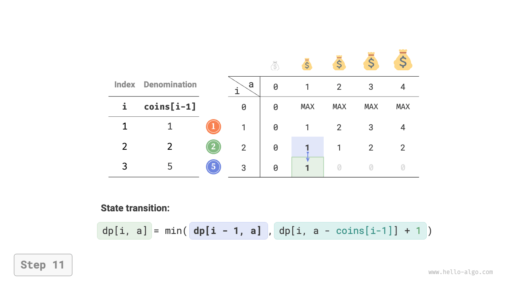

# 無制限ナップサック問題

このセクションでは、まず別の一般的なナップサック問題である無制限ナップサックを解決し、次にその特殊ケースであるコイン交換問題を探索します。

## 無制限ナップサック問題

!!! question

    $n$ 個のアイテムが与えられ、$i$ 番目のアイテムの重量は $wgt[i-1]$ で値は $val[i-1]$ です。容量が $cap$ のバックパックがあります。**各アイテムは複数回選択できます**。容量を超えることなくバックパックに入れることができるアイテムの最大値は何ですか？以下の例を参照してください。


### 動的プログラミングアプローチ

無制限ナップサック問題は0-1ナップサック問題と非常に似ており、**唯一の違いはアイテムを選択できる回数に制限がないことです**。

- 0-1ナップサック問題では、各アイテムは1つしかないため、アイテム $i$ をバックパックに入れた後は、前の $i-1$ 個のアイテムからのみ選択できます。
- 無制限ナップサック問題では、各アイテムの数量は無制限であるため、アイテム $i$ をバックパックに入れた後も、**前の $i$ 個のアイテムから引き続き選択できます**。

無制限ナップサック問題のルールの下で、状態 $[i, c]$ は2つの方法で変化できます。

- **アイテム $i$ を入れない**：0-1ナップサック問題と同様に、$[i-1, c]$ に遷移します。
- **アイテム $i$ を入れる**：0-1ナップサック問題とは異なり、$[i, c-wgt[i-1]]$ に遷移します。

したがって、状態遷移方程式は次のようになります：

$$
dp[i, c] = \max(dp[i-1, c], dp[i, c - wgt[i-1]] + val[i-1])
$$

### コード実装

2つの問題のコードを比較すると、状態遷移が $i-1$ から $i$ に変わり、残りは完全に同一です：

```src
[file]{unbounded_knapsack}-[class]{}-[func]{unbounded_knapsack_dp}
```

### 空間最適化

現在の状態は左と上の状態から来るため、**空間最適化解法は $dp$ テーブルの各行に対して前方走査を実行する必要があります**。

この走査順序は0-1ナップサックの場合とは逆です。違いを理解するために下の図を参照してください。

=== "<1>"
    

=== "<2>"
    

=== "<3>"
    

=== "<4>"
    

=== "<5>"
    

=== "<6>"
    

コード実装は非常に簡単で、配列 `dp` の最初の次元を削除するだけです：

```src
[file]{unbounded_knapsack}-[class]{}-[func]{unbounded_knapsack_dp_comp}
```

## コイン交換問題

ナップサック問題は動的プログラミング問題の大きなクラスの代表であり、コイン交換問題など多くの変種があります。

!!! question

    $n$ 種類のコインが与えられ、$i$ 番目の種類のコインの額面は $coins[i - 1]$ で、目標金額は $amt$ です。**各種類のコインは複数回選択できます**。目標金額を構成するのに必要な最小コイン数は何ですか？目標金額を構成できない場合は $-1$ を返してください。以下の例を参照してください。


### 動的プログラミングアプローチ

**コイン交換は無制限ナップサック問題の特殊ケースと見なすことができ**、以下の類似点と相違点を共有しています。

- 2つの問題は互いに変換できます：「アイテム」は「コイン」に対応し、「アイテムの重量」は「コインの額面」に対応し、「バックパックの容量」は「目標金額」に対応します。
- 最適化目標は逆です：無制限ナップサック問題はアイテムの値を最大化することを目的とし、コイン交換問題はコインの数を最小化することを目的とします。
- 無制限ナップサック問題はバックパック容量を「超えない」解を求め、コイン交換は目標金額を「正確に」構成する解を求めます。

**第1ステップ：各ラウンドの意思決定を考え、状態を定義し、それにより $dp$ テーブルを導出する**

状態 $[i, a]$ は部分問題に対応します：**最初の $i$ 種類のコインを使用して金額 $a$ を構成できる最小コイン数**、$dp[i, a]$ と表記されます。

二次元 $dp$ テーブルのサイズは $(n+1) \times (amt+1)$ です。

**第2ステップ：最適部分構造を特定し、状態遷移方程式を導出する**

この問題は状態遷移方程式の2つの側面で無制限ナップサック問題と異なります。

- この問題は最小値を求めるため、演算子 $\max()$ を $\min()$ に変更する必要があります。
- 最適化はコインの数に焦点を当てているため、コインが選択されたときに単純に $+1$ を追加します。

$$
dp[i, a] = \min(dp[i-1, a], dp[i, a - coins[i-1]] + 1)
$$

**第3ステップ：境界条件と状態遷移順序を定義する**

目標金額が $0$ の場合、それを構成するのに必要な最小コイン数は $0$ であるため、最初の列のすべての $dp[i, 0]$ は $0$ です。

コインがない場合、**任意の金額 >0 を構成することは不可能**であり、これは無効な解です。状態遷移方程式の $\min()$ 関数が無効な解を認識してフィルタリングできるように、$+\infty$ を使用してそれらを表現することを検討し、つまり最初の行のすべての $dp[0, a]$ を $+\infty$ に設定します。

### コード実装

ほとんどのプログラミング言語は $+\infty$ 変数を提供しておらず、整数 `int` の最大値のみを代替として使用できます。これによりオーバーフローが発生する可能性があります：状態遷移方程式の $+1$ 演算がオーバーフローする可能性があります。

この理由で、数値 $amt + 1$ を使用して無効な解を表します。なぜなら、$amt$ を構成するのに必要な最大コイン数は最大でも $amt$ だからです。結果を返す前に、$dp[n, amt]$ が $amt + 1$ に等しいかどうかを確認し、そうであれば $-1$ を返し、目標金額を構成できないことを示します。コードは以下の通りです：

```src
[file]{coin_change}-[class]{}-[func]{coin_change_dp}
```

下の図はコイン交換問題の動的プログラミングプロセスを示しており、無制限ナップサック問題と非常に似ています。

=== "<1>"
    

=== "<2>"
    

=== "<3>"
    

=== "<4>"
    

=== "<5>"
    

=== "<6>"
    

=== "<7>"
    

=== "<8>"
    

=== "<9>"
    

=== "<10>"
    

=== "<11>"
    

=== "<12>"
    

=== "<13>"
    

=== "<14>"
    

=== "<15>"
    

### 空間最適化

コイン交換問題の空間最適化は無制限ナップサック問題と同じ方法で処理されます：

```src
[file]{coin_change}-[class]{}-[func]{coin_change_dp_comp}
```

## コイン交換問題II

!!! question

    $n$ 種類のコインが与えられ、$i$ 番目の種類のコインの額面は $coins[i - 1]$ で、目標金額は $amt$ です。各種類のコインは複数回選択でき、**目標金額を構成できるコインの組み合わせは何通りありますか**。以下の例を参照してください。


### 動的プログラミングアプローチ

前の問題と比較して、この問題の目標は組み合わせの数を決定することであるため、部分問題は次のようになります：**最初の $i$ 種類のコインを使用して金額 $a$ を構成できる組み合わせの数**。$dp$ テーブルはサイズ $(n+1) \times (amt + 1)$ の二次元行列のまま残ります。

現在の状態の組み合わせ数は、現在のコインを選択しない組み合わせと現在のコインを選択する組み合わせの合計です。状態遷移方程式は：

$$
dp[i, a] = dp[i-1, a] + dp[i, a - coins[i-1]]
$$

目標金額が $0$ の場合、目標金額を構成するのにコインは必要ないため、最初の列のすべての $dp[i, 0]$ は $1$ に初期化されるべきです。コインがない場合、任意の金額 >0 を構成することは不可能であるため、最初の行のすべての $dp[0, a]$ は $0$ に設定されるべきです。

### コード実装

```src
[file]{coin_change_ii}-[class]{}-[func]{coin_change_ii_dp}
```

### 空間最適化

空間最適化アプローチは同じで、コインの次元を削除するだけです：

```src
[file]{coin_change_ii}-[class]{}-[func]{coin_change_ii_dp_comp}
```
