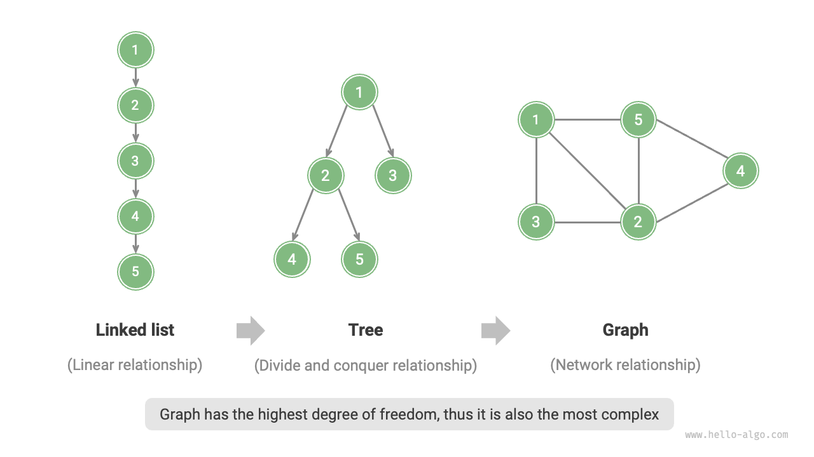
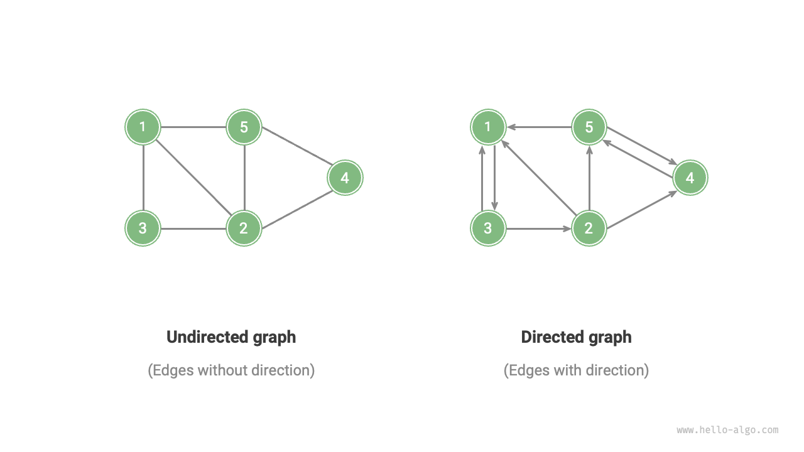
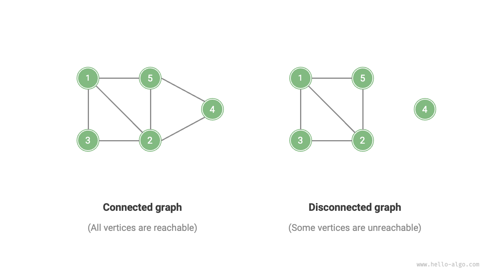
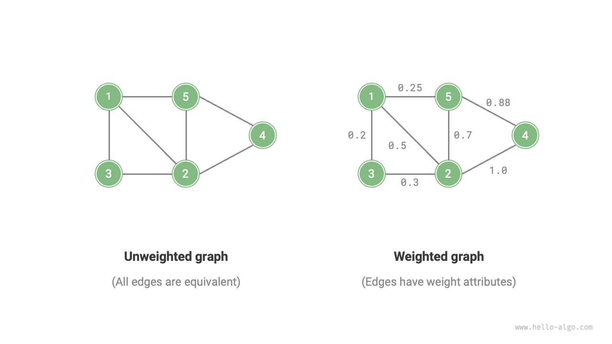
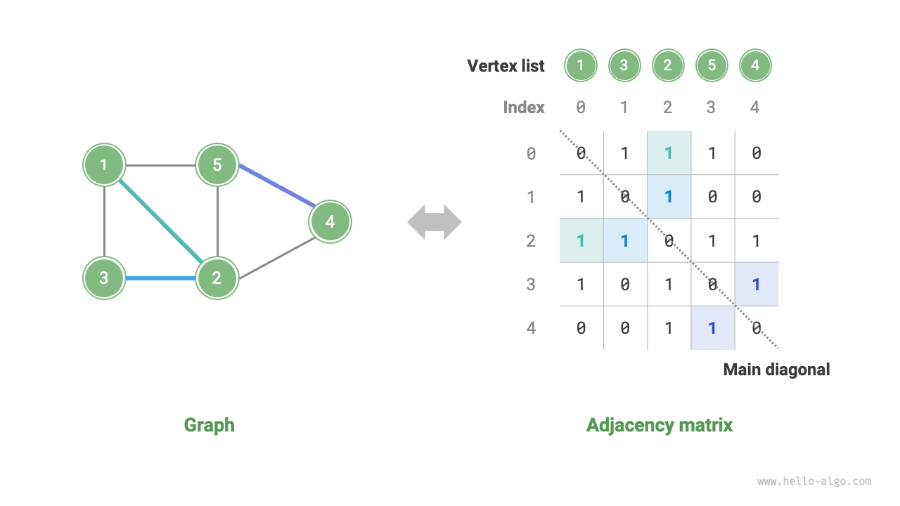
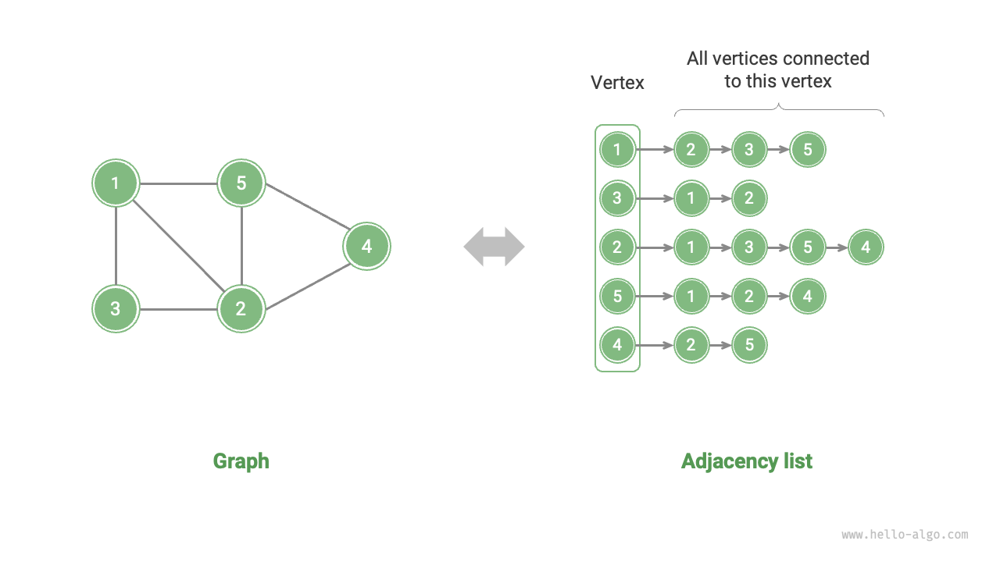

# グラフ

<u>グラフ</u>は非線形データ構造の一種で、<u>頂点</u>と<u>辺</u>で構成されます。グラフ$G$は、頂点の集合$V$と辺の集合$E$の組み合わせとして抽象的に表現できます。以下の例は、5つの頂点と7つの辺を含むグラフを示しています。

$$
\begin{aligned}
V & = \{ 1, 2, 3, 4, 5 \} \newline
E & = \{ (1,2), (1,3), (1,5), (2,3), (2,4), (2,5), (4,5) \} \newline
G & = \{ V, E \} \newline
\end{aligned}
$$

頂点をノード、辺をノードを接続する参照（ポインタ）と見なすと、グラフは連結リストから拡張されたデータ構造として見ることができます。下図に示すように、**線形関係（連結リスト）や分割統治関係（木）と比較して、ネットワーク関係（グラフ）は自由度が高いため、より複雑です**。

## グラフの一般的な種類と用語

グラフは、辺に方向があるかどうかによって<u>無向グラフ</u>と<u>有向グラフ</u>に分けることができます（下図参照）。

- 無向グラフでは、辺は2つの頂点間の「双方向」接続を表します。例えば、Facebookの「友達」関係です。
- 有向グラフでは、辺に方向性があります。つまり、辺$A \rightarrow B$と$A \leftarrow B$は互いに独立しています。例えば、InstagramやTikTokの「フォロー」と「フォロワー」の関係です。

すべての頂点が接続されているかどうかによって、グラフは<u>連結グラフ</u>と<u>非連結グラフ</u>に分けることができます（下図参照）。

- 連結グラフでは、任意の頂点から開始して他の任意の頂点に到達することが可能です。
- 非連結グラフでは、任意の開始頂点から到達できない頂点が少なくとも1つ存在します。

辺に重み変数を追加することもでき、その結果として<u>重み付きグラフ</u>が生まれます（下図参照）。例えば、Instagramでは、システムがあなたと他のユーザーとの間の相互作用レベル（いいね、閲覧、コメントなど）によってフォロワーとフォロー中のリストをソートします。このような相互作用ネットワークは重み付きグラフで表現できます。

グラフデータ構造には、以下のような一般的に使用される用語があります。

- <u>隣接</u>：2つの頂点を接続する辺がある場合、これら2つの頂点は「隣接」していると言われます。上図では、頂点1の隣接頂点は頂点2、3、5です。
- <u>パス</u>：頂点Aから頂点Bまでに通過する辺のシーケンスを、AからBへのパスと呼びます。上図では、辺のシーケンス1-5-2-4は頂点1から頂点4へのパスです。
- <u>次数</u>：頂点が持つ辺の数です。有向グラフの場合、<u>入次数</u>はその頂点を指す辺の数、<u>出次数</u>はその頂点から出る辺の数を指します。

## グラフの表現

グラフの一般的な表現には「隣接行列」と「隣接リスト」があります。以下の例では無向グラフを使用します。

### 隣接行列

グラフの頂点数を$n$とすると、<u>隣接行列</u>は$n \times n$の行列を使用してグラフを表現します。各行（列）は頂点を表し、行列要素は辺を表し、2つの頂点間に辺があるかどうかを$1$または$0$で示します。

下図に示すように、隣接行列を$M$、頂点のリストを$V$とすると、行列要素$M[i, j] = 1$は頂点$V[i]$と頂点$V[j]$の間に辺があることを示し、逆に$M[i, j] = 0$は2つの頂点間に辺がないことを示します。

隣接行列には以下の特性があります。

- 頂点は自分自身に接続することはできないため、隣接行列の主対角線上の要素は意味がありません。
- 無向グラフの場合、両方向の辺は等価であるため、隣接行列は主対角線に関して対称です。
- 隣接行列の要素を$1$と$0$から重みに置き換えることで、重み付きグラフを表現できます。

隣接行列でグラフを表現する場合、行列要素に直接アクセスして辺を取得できるため、追加、削除、検索、変更の操作が効率的で、すべて時間計算量$O(1)$です。ただし、行列の空間計算量は$O(n^2)$で、より多くのメモリを消費します。

### 隣接リスト

<u>隣接リスト</u>は$n$個の連結リストを使用してグラフを表現し、各連結リストノードは頂点を表します。$i$番目の連結リストは頂点$i$に対応し、すべての隣接頂点（その頂点に接続された頂点）を含みます。下図は隣接リストを使用して格納されたグラフの例を示しています。

隣接リストは実際の辺のみを格納し、辺の総数は$n^2$よりもはるかに少ないことが多く、より空間効率的です。ただし、隣接リストで辺を見つけるには連結リストを走査する必要があるため、その時間効率は隣接行列ほど良くありません。

上図を観察すると、**隣接リストの構造はハッシュテーブルの「チェイン法」と非常に似ているため、同様の方法を使用して効率を最適化できます**。例えば、連結リストが長い場合、それをAVL木や赤黒木に変換して、時間効率を$O(n)$から$O(\log n)$に最適化できます。連結リストをハッシュテーブルに変換することで、時間計算量を$O(1)$に削減することもできます。

## グラフの一般的な応用

下表に示すように、多くの現実世界のシステムはグラフでモデル化でき、対応する問題はグラフ計算問題に削減できます。

 表 <id> &nbsp; 現実生活の一般的なグラフ 

|                | 頂点           | 辺                               | グラフ計算問題               |
| -------------- | -------------- | -------------------------------- | --------------------------- |
| ソーシャルネットワーク | ユーザー       | フォロー / フォロワー関係         | 潜在的フォロー推薦           |
| 地下鉄路線     | 駅             | 駅間の接続性                     | 最短ルート推薦              |
| 太陽系         | 天体           | 天体間の重力                     | 惑星軌道計算                |
