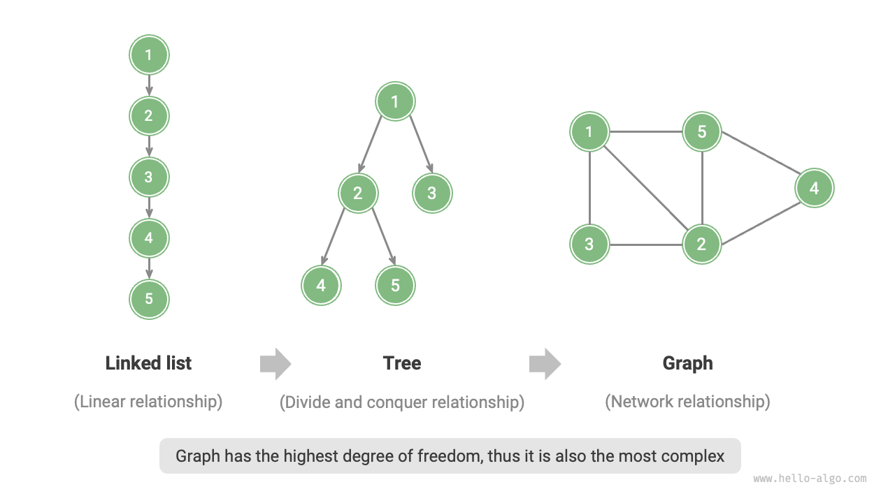
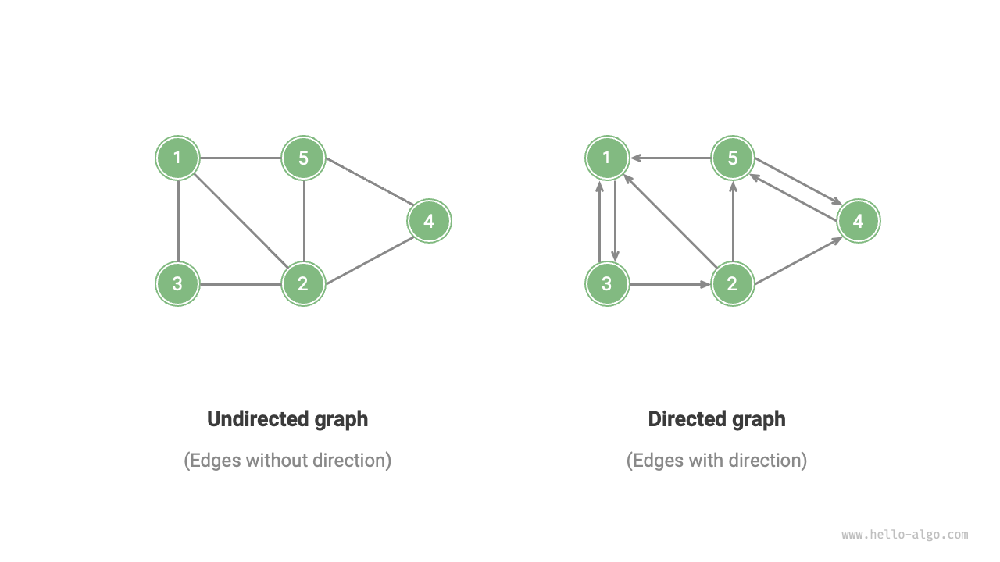
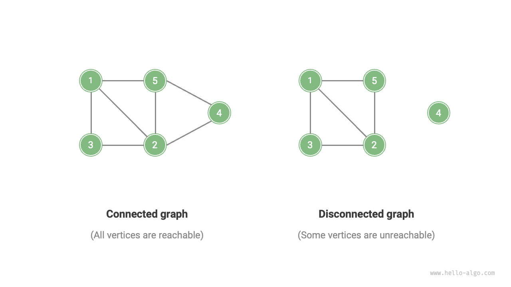
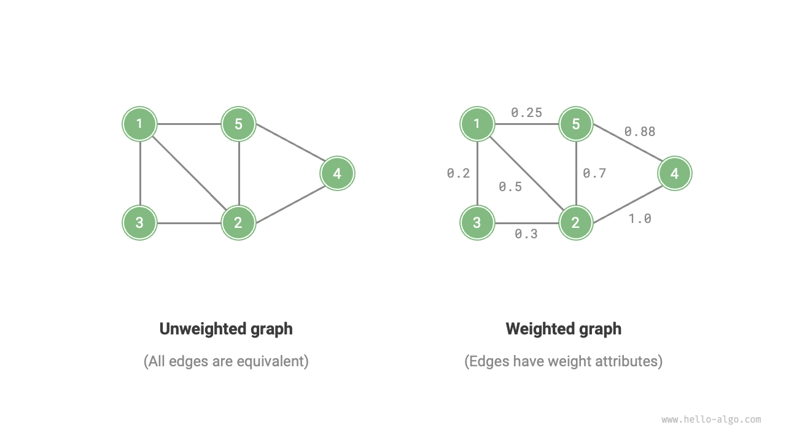
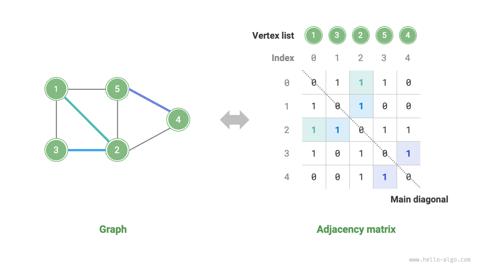
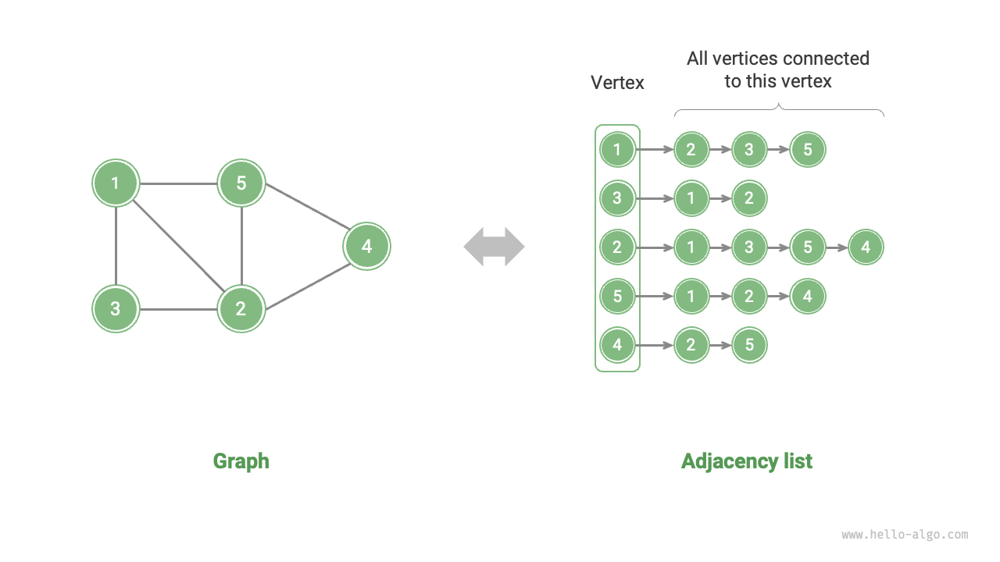

# グラフ

<u>グラフ（graph）</u>は、<u>頂点（vertex）</u>と<u>辺（edge）</u>から構成される非線形データ構造です。グラフ $G$ は、頂点集合 $V$ と辺集合 $E$ からなる集合として抽象的に表せます。以下の例は、5 個の頂点と 7 本の辺を含むグラフを示しています。

$$
\begin{aligned}
V & = \{ 1, 2, 3, 4, 5 \} \newline
E & = \{ (1,2), (1,3), (1,5), (2,3), (2,4), (2,5), (4,5) \} \newline
G & = \{ V, E \} \newline
\end{aligned}
$$

頂点をノード、辺を各ノードをつなぐ参照（ポインタ）とみなせば、グラフは連結リストを拡張したデータ構造の一種と捉えられます。次の図に示すように、**線形関係（連結リスト）や分治関係（木）と比べて、ネットワーク関係（グラフ）は自由度が高く**、そのぶん複雑です。

## グラフの一般的な種類と用語

辺が方向性を持つかどうかに応じて、<u>無向グラフ（undirected graph）</u>と<u>有向グラフ（directed graph）</u>に分けられます。次の図のとおりです。

- 無向グラフでは、辺は 2 つの頂点間の「双方向」の接続関係を表します。例えば WeChat や QQ における「友だち関係」です。
- 有向グラフでは、辺は方向性を持ち、すなわち $A \rightarrow B$ と $A \leftarrow B$ の 2 方向の辺は互いに独立です。例えば Weibo や Douyin における「フォロー」と「フォロワー」の関係です。

すべての頂点が連結しているかどうかに応じて、<u>連結グラフ（connected graph）</u>と<u>非連結グラフ（disconnected graph）</u>に分けられます。次の図のとおりです。

- 連結グラフでは、ある頂点から出発すると、ほかの任意の頂点に到達できます。
- 非連結グラフでは、ある頂点から出発すると、少なくとも 1 つの頂点には到達できません。

辺に「重み」の変数を追加すると、次の図に示すような<u>重み付きグラフ（weighted graph）</u>が得られます。例えば『Honor of Kings』のようなモバイルゲームでは、システムが共にプレイした時間に基づいてプレイヤー間の「親密度」を計算します。この親密度ネットワークは重み付きグラフで表せます。

グラフというデータ構造には、次のような基本用語があります。

- <u>隣接（adjacency）</u>：2 つの頂点の間に辺が存在するとき、この 2 つの頂点は「隣接している」といいます。上図では、頂点 1 に隣接する頂点は 2、3、5 です。
- <u>経路（path）</u>：頂点 A から頂点 B までに通過する辺で構成された列を、A から B への「経路」と呼びます。上図では、辺の列 1-5-2-4 は頂点 1 から頂点 4 への 1 本の経路です。
- <u>次数（degree）</u>：ある頂点が持つ辺の本数です。有向グラフでは、<u>入次数（in-degree）</u>はその頂点に向かう辺の本数を表し、<u>出次数（out-degree）</u>はその頂点から出る辺の本数を表します。

## グラフの表現

グラフの一般的な表現方法には「隣接行列」と「隣接リスト」があります。以下では無向グラフを例に説明します。

### 隣接行列

グラフの頂点数を $n$ とすると、<u>隣接行列（adjacency matrix）</u>は $n \times n$ の行列を用いてグラフを表します。各行（列）は 1 つの頂点を表し、行列要素は辺を表します。$1$ または $0$ を用いて、2 つの頂点の間に辺があるかどうかを示します。

次の図のように、隣接行列を $M$、頂点リストを $V$ とすると、行列要素 $M[i, j] = 1$ は頂点 $V[i]$ から頂点 $V[j]$ への辺が存在することを表し、逆に $M[i, j] = 0$ は 2 つの頂点の間に辺がないことを表します。

隣接行列には次の特徴があります。

- 単純グラフでは、頂点は自分自身とは接続できないため、このとき隣接行列の主対角線上の要素には意味がありません。
- 無向グラフでは、2 方向の辺は等価であるため、このとき隣接行列は主対角線に関して対称です。
- 隣接行列の要素を $1$ と $0$ から重みに置き換えると、重み付きグラフを表せます。

隣接行列でグラフを表す場合、行列要素に直接アクセスして辺を取得できるため、追加・削除・検索・更新の操作効率は高く、時間計算量はいずれも $O(1)$ です。しかし、行列の空間計算量は $O(n^2)$ であり、メモリ使用量は多くなります。

### 隣接リスト

<u>隣接リスト（adjacency list）</u>は、$n$ 本の連結リストを使ってグラフを表します。連結リストのノードは頂点を表します。第 $i$ 本の連結リストは頂点 $i$ に対応し、その頂点に隣接するすべての頂点（その頂点と接続された頂点）を格納します。次の図は、隣接リストで保存したグラフの例です。

隣接リストは実際に存在する辺だけを格納し、辺の総数は通常 $n^2$ よりはるかに小さいため、より省スペースです。しかし、隣接リストでは辺を見つけるために連結リストを走査する必要があるため、時間効率は隣接行列に及びません。

上図を見ると、**隣接リストの構造はハッシュテーブルにおける「連鎖アドレス法」と非常によく似ているため、同様の方法で効率を最適化できます**。例えば、連結リストが長い場合は AVL 木や赤黒木に変換して時間効率を $O(n)$ から $O(\log n)$ に改善できます。さらに、連結リストをハッシュテーブルに変換すれば、時間計算量を $O(1)$ まで下げられます。

## グラフの一般的な応用

次の表のように、多くの現実のシステムはグラフでモデル化でき、対応する問題もグラフ計算の問題に帰着できます。

 表 <id> &nbsp; 現実世界でよく見られるグラフ 

|          | 頂点 | 辺                   | グラフ計算問題 |
| -------- | ---- | -------------------- | ------------ |
| ソーシャルネットワーク | ユーザー | 友だち関係           | 潜在的な友だちの推薦 |
| 地下鉄路線 | 駅   | 駅間の接続性         | 最短経路の推薦 |
| 太陽系   | 天体 | 天体間の万有引力作用 | 惑星軌道の計算 |
