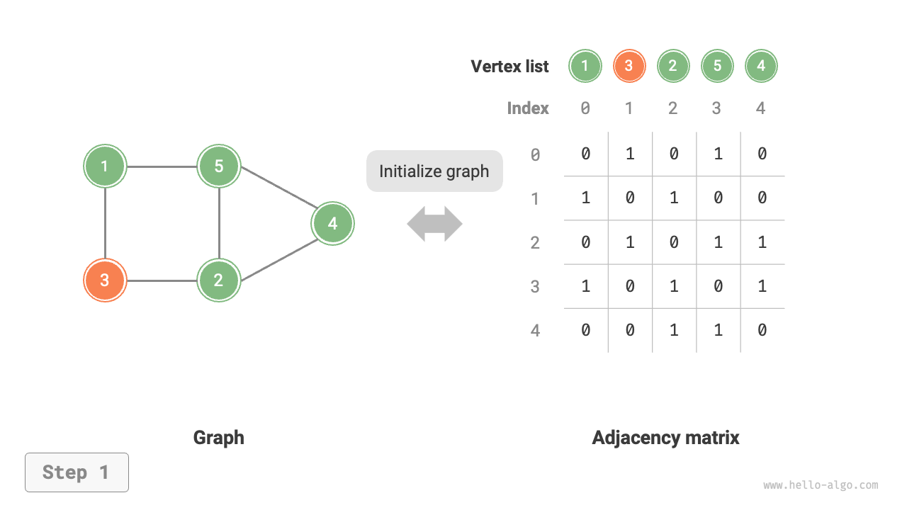
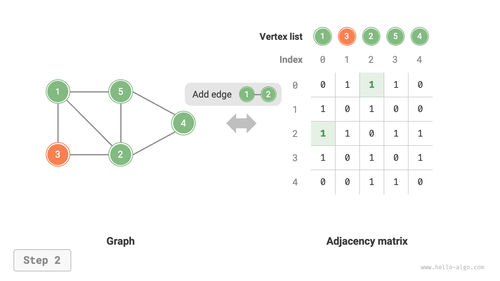
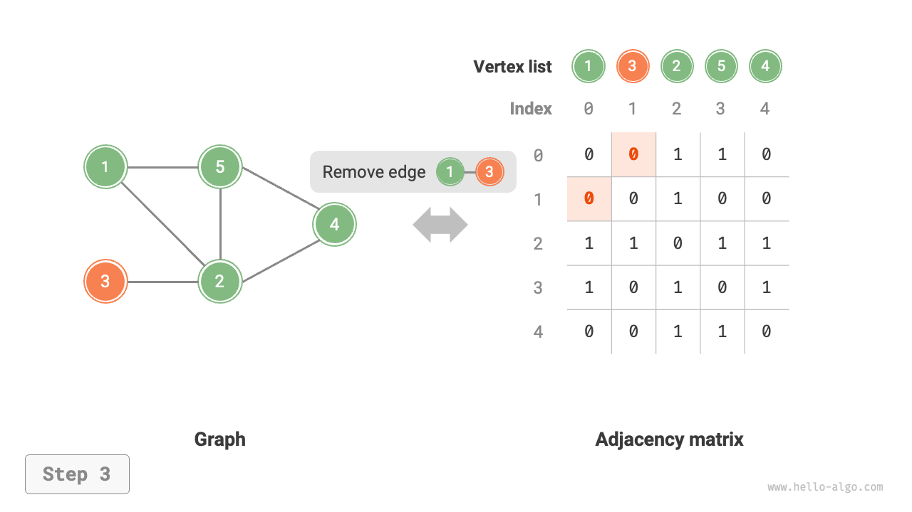
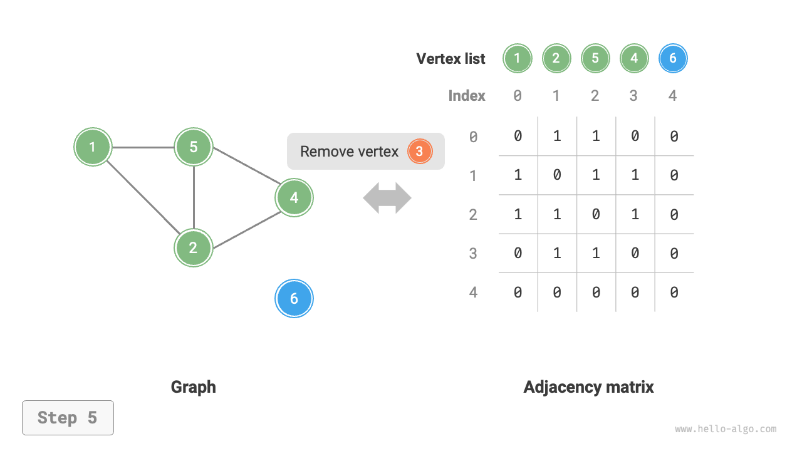
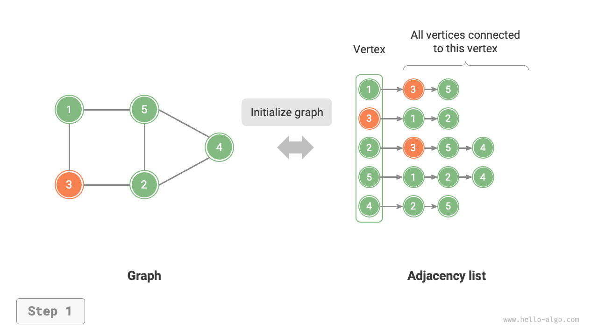
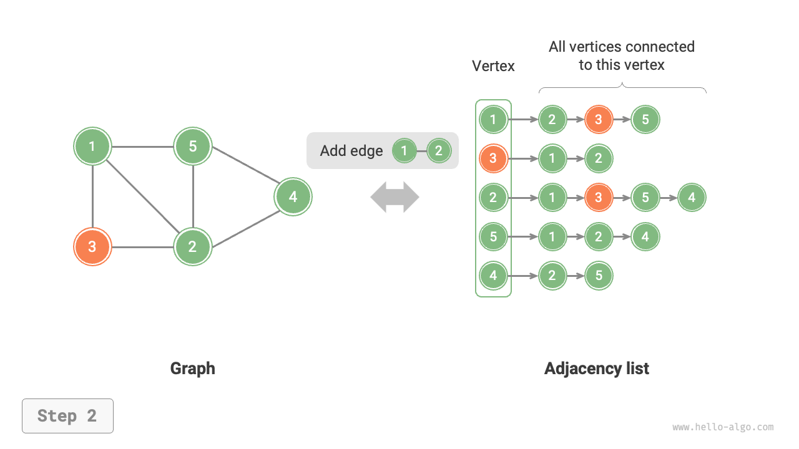
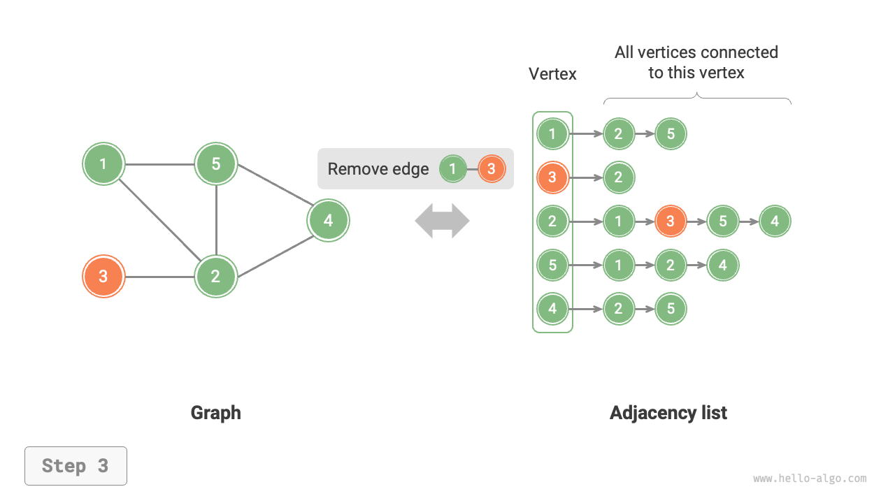
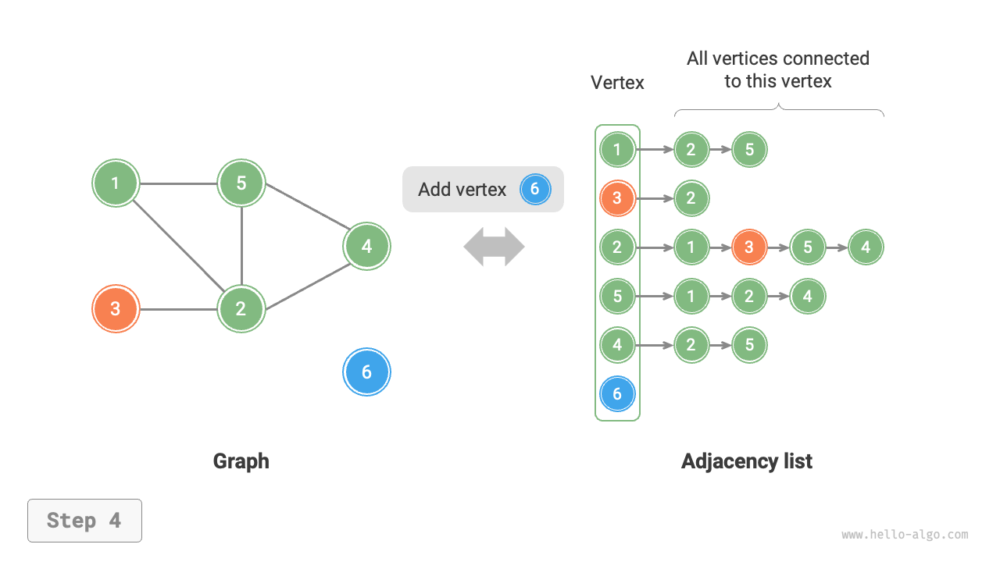
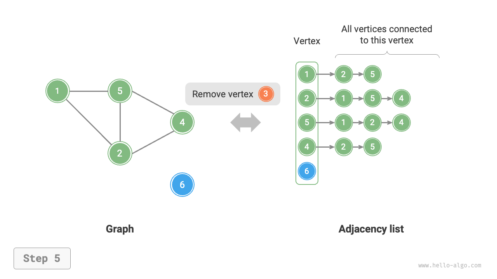

# グラフの基本操作

グラフの基本操作は「辺」に対する操作と「頂点」に対する操作に分けることができます。「隣接行列」と「隣接リスト」の2つの表現方法の下では、実装が異なります。

## 隣接行列に基づく実装

$n$個の頂点を持つ無向グラフが与えられた場合、さまざまな操作は下図のように実装されます。

- **辺の追加または削除**：隣接行列内の指定された辺を直接変更し、$O(1)$時間を使用します。無向グラフであるため、両方向の辺を同時に更新する必要があります。
- **頂点の追加**：隣接行列の末尾に行と列を追加し、すべて$0$で埋めます。$O(n)$時間を使用します。
- **頂点の削除**：隣接行列内の行と列を削除します。最悪の場合は最初の行と列が削除されるときで、$(n-1)^2$個の要素を「上と左に移動」する必要があり、$O(n^2)$時間を使用します。
- **初期化**：$n$個の頂点を渡し、長さ$n$の頂点リスト`vertices`を初期化し、$O(n)$時間を使用します。$n \times n$サイズの隣接行列`adjMat`を初期化し、$O(n^2)$時間を使用します。

=== "隣接行列の初期化"
    

=== "辺の追加"
    

=== "辺の削除"
    

=== "頂点の追加"
    

=== "頂点の削除"
    

以下は隣接行列を使用して表現されたグラフの実装コードです：

```src
[file]{graph_adjacency_matrix}-[class]{graph_adj_mat}-[func]{}
```

## 隣接リストに基づく実装

総計$n$個の頂点と$m$個の辺を持つ無向グラフが与えられた場合、さまざまな操作は下図のように実装できます。

- **辺の追加**：対応する頂点の連結リストの末尾に辺を追加するだけで、$O(1)$時間を使用します。無向グラフであるため、両方向に同時に辺を追加する必要があります。
- **辺の削除**：対応する頂点の連結リスト内で指定された辺を見つけて削除し、$O(m)$時間を使用します。無向グラフでは、両方向の辺を同時に削除する必要があります。
- **頂点の追加**：隣接リストに連結リストを追加し、新しい頂点をリストのヘッドノードにし、$O(1)$時間を使用します。
- **頂点の削除**：隣接リスト全体を走査し、指定された頂点を含むすべての辺を削除する必要があり、$O(n + m)$時間を使用します。
- **初期化**：隣接リストに$n$個の頂点と$2m$個の辺を作成し、$O(n + m)$時間を使用します。

=== "隣接リストの初期化"
    

=== "辺の追加"
    

=== "辺の削除"
    

=== "頂点の追加"
    

=== "頂点の削除"
    

以下は隣接リストのコード実装です。上図と比較して、実際のコードには以下の違いがあります。

- 頂点の追加と削除の便宜、およびコードの簡素化のため、連結リストの代わりにリスト（動的配列）を使用します。
- ハッシュテーブルを使用して隣接リストを格納し、`key`が頂点インスタンス、`value`がその頂点の隣接頂点のリスト（連結リスト）です。

さらに、隣接リストで頂点を表現するために`Vertex`クラスを使用します。その理由は：隣接行列のようにリストインデックスを使用して異なる頂点を区別する場合、インデックス$i$の頂点を削除したい場合、隣接リスト全体を走査し、$i$より大きいすべてのインデックスを1つずつ減少させる必要があり、これは非常に非効率的です。しかし、各頂点が一意の`Vertex`インスタンスである場合、頂点を削除しても他の頂点に変更を加える必要がありません。

```src
[file]{graph_adjacency_list}-[class]{graph_adj_list}-[func]{}
```

## 効率の比較

グラフに$n$個の頂点と$m$個の辺があると仮定すると、下表は隣接行列と隣接リストの時間効率と空間効率を比較しています。

<p align="center"> 表 <id> &nbsp; 隣接行列と隣接リストの比較 </p>

|                  | 隣接行列       | 隣接リスト（連結リスト） | 隣接リスト（ハッシュテーブル） |
| ---------------- | -------------- | ----------------------- | ----------------------------- |
| 隣接性の判定     | $O(1)$         | $O(m)$                  | $O(1)$                        |
| 辺の追加         | $O(1)$         | $O(1)$                  | $O(1)$                        |
| 辺の削除         | $O(1)$         | $O(m)$                  | $O(1)$                        |
| 頂点の追加       | $O(n)$         | $O(1)$                  | $O(1)$                        |
| 頂点の削除       | $O(n^2)$       | $O(n + m)$              | $O(n)$                        |
| メモリ空間使用量 | $O(n^2)$       | $O(n + m)$              | $O(n + m)$                    |

上表を観察すると、隣接リスト（ハッシュテーブル）が最高の時間効率と空間効率を持っているように見えます。しかし、実際には、隣接行列での辺に対する操作がより効率的で、単一の配列アクセスまたは代入操作のみが必要です。全体的に、隣接行列は「空間と時間のトレードオフ」の原則を例示し、隣接リストは「時間と空間のトレードオフ」を例示しています。
