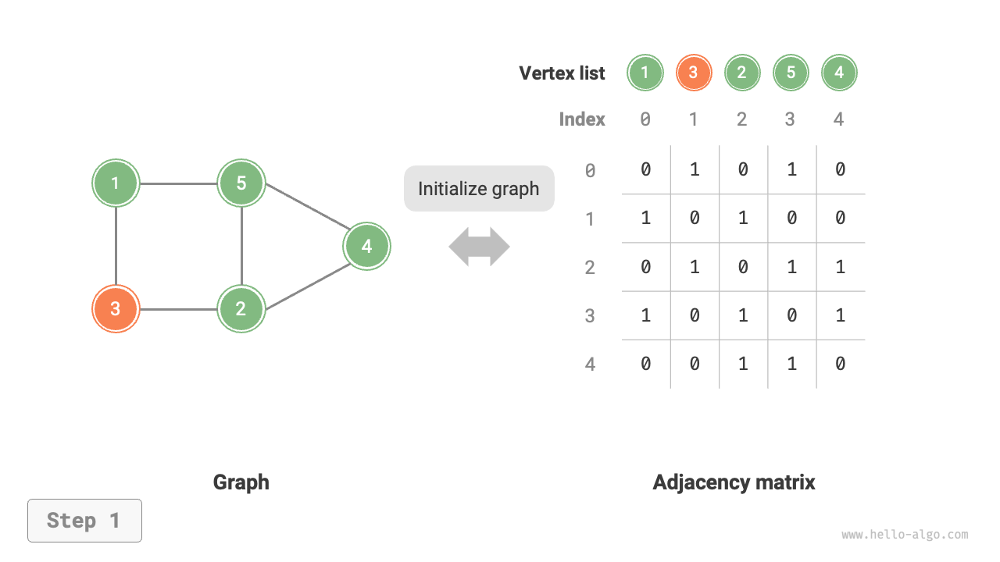
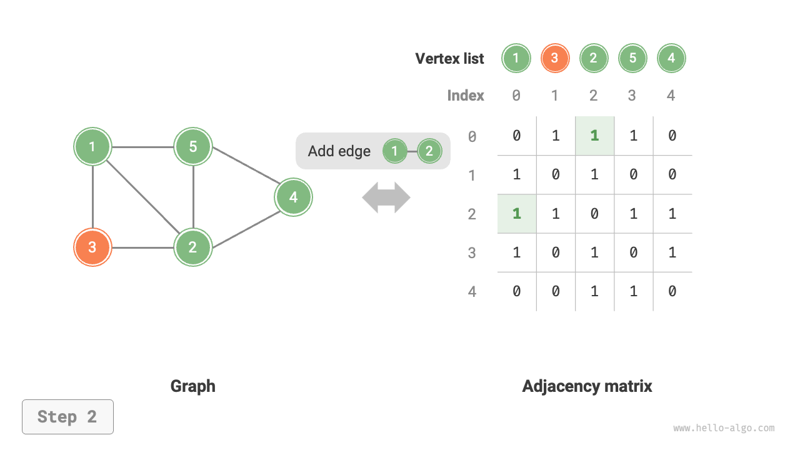
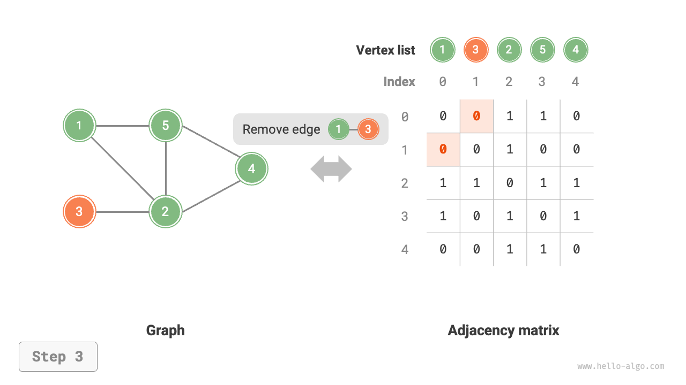
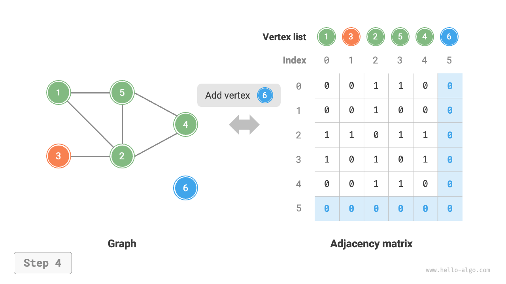
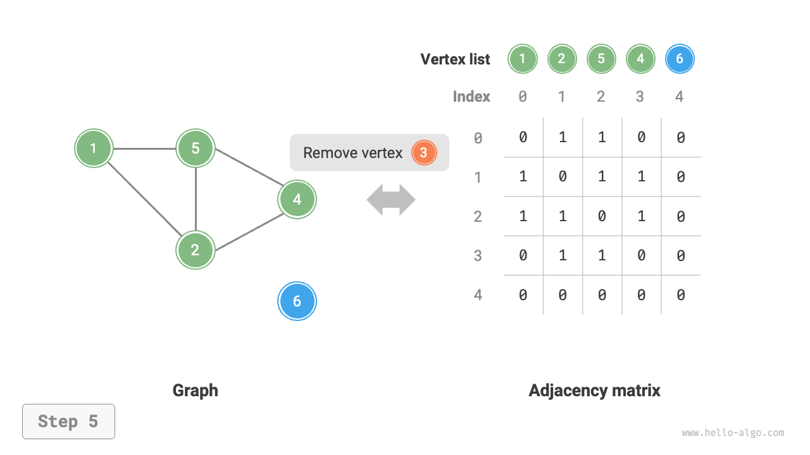
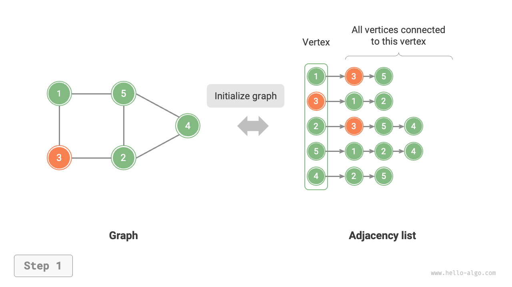
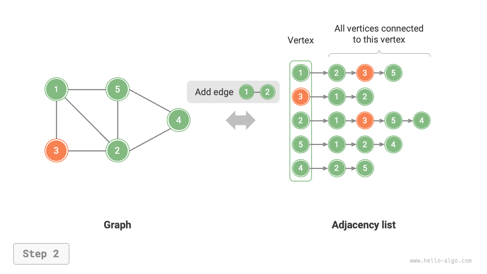
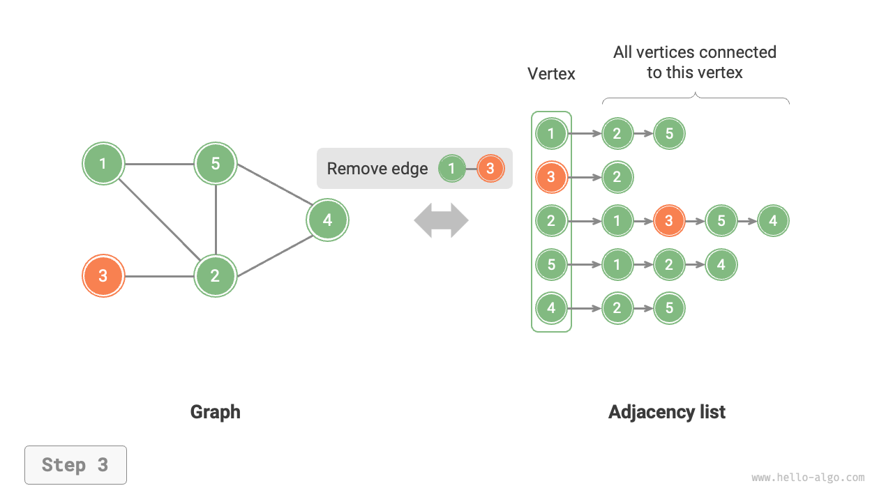
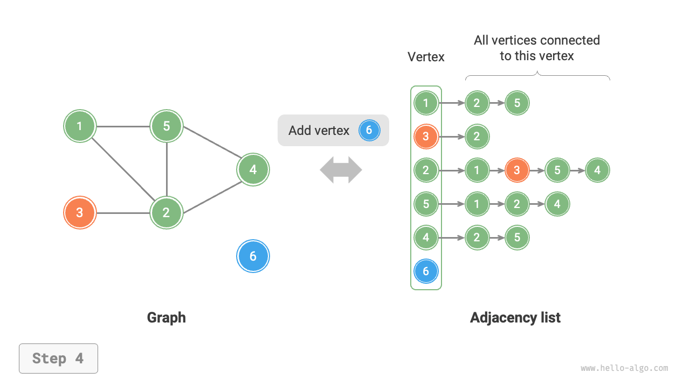
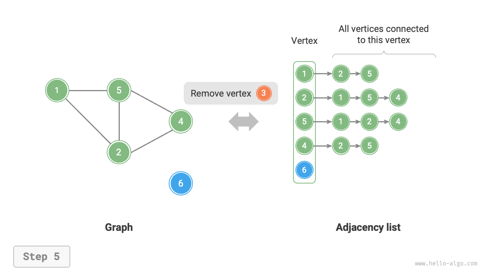

# グラフの基本操作

グラフの基本操作は、「辺」に対する操作と「頂点」に対する操作に分けられます。「隣接行列」と「隣接リスト」の 2 つの表現方法では、実装方法が異なります。

## 隣接行列に基づく実装

頂点数が $n$ の無向グラフを与えると、各種操作の実装方法は次図のとおりです。

- **辺の追加または削除**：隣接行列で指定した辺を直接変更すればよく、$O(1)$ 時間です。無向グラフであるため、2 方向の辺を同時に更新する必要があります。
- **頂点の追加**：隣接行列の末尾に 1 行 1 列を追加し、すべてを $0$ で埋めればよく、$O(n)$ 時間です。
- **頂点の削除**：隣接行列から 1 行 1 列を削除します。先頭行と先頭列を削除する場合が最悪で、$(n-1)^2$ 個の要素を「左上へ移動」させる必要があるため、$O(n^2)$ 時間です。
- **初期化**：$n$ 個の頂点を受け取り、長さ $n$ の頂点リスト `vertices` を初期化するのに $O(n)$ 時間、サイズ $n \times n$ の隣接行列 `adjMat` を初期化するのに $O(n^2)$ 時間かかります。

=== "隣接行列の初期化"
    

=== "辺の追加"
    

=== "辺の削除"
    

=== "頂点の追加"
    

=== "頂点の削除"
    

以下は、隣接行列でグラフを表した実装コードです：

```src
[file]{graph_adjacency_matrix}-[class]{graph_adj_mat}-[func]{}
```

## 隣接リストに基づく実装

無向グラフの頂点総数を $n$、辺総数を $m$ とすると、各種操作は次図の方法で実装できます。

- **辺の追加**：頂点に対応する連結リストの末尾に辺を追加すればよく、$O(1)$ 時間です。無向グラフなので、2 方向の辺を同時に追加する必要があります。
- **辺の削除**：頂点に対応する連結リストから指定した辺を探して削除するため、$O(m)$ 時間です。無向グラフでは、2 方向の辺を同時に削除する必要があります。
- **頂点の追加**：隣接リストに 1 つの連結リストを追加し、新しい頂点をその連結リストの先頭ノードとするため、$O(1)$ 時間です。
- **頂点の削除**：隣接リスト全体を走査し、指定した頂点を含むすべての辺を削除する必要があるため、$O(n + m)$ 時間です。
- **初期化**：隣接リストに $n$ 個の頂点と $2m$ 本の辺を作成するため、$O(n + m)$ 時間です。

=== "隣接リストの初期化"
    

=== "辺の追加"
    

=== "辺の削除"
    

=== "頂点の追加"
    

=== "頂点の削除"
    

以下は隣接リストのコード実装です。上図と比べると、実際のコードには次の違いがあります。

- 頂点の追加と削除を容易にし、コードを簡潔にするため、連結リストの代わりにリスト（動的配列）を使用しています。
- ハッシュテーブルを用いて隣接リストを格納しており、`key` は頂点インスタンス、`value` はその頂点に隣接する頂点のリスト（連結リスト）です。

また、隣接リストでは頂点を表すために `Vertex` クラスを使用しています。その理由は、もし隣接行列と同様にリストのインデックスで異なる頂点を区別すると、インデックス $i$ の頂点を削除する場合、隣接リスト全体を走査して、$i$ より大きいすべてのインデックスを $1$ 減らす必要があり、効率が非常に低いためです。これに対して、各頂点が一意な `Vertex` インスタンスであれば、ある頂点を削除しても他の頂点を変更する必要はありません。

```src
[file]{graph_adjacency_list}-[class]{graph_adj_list}-[func]{}
```

## 効率の比較

グラフに $n$ 個の頂点と $m$ 本の辺があるとすると、次の表は隣接行列と隣接リストの時間効率および空間効率を比較したものです。なお、隣接リスト（連結リスト）は本記事の実装に対応し、隣接リスト（ハッシュテーブル）はすべての連結リストをハッシュテーブルに置き換えた実装を指します。

<p align="center"> 表 <id> &nbsp; 隣接行列と隣接リストの比較 </p>

|              | 隣接行列 | 隣接リスト（連結リスト） | 隣接リスト（ハッシュテーブル） |
| ------------ | -------- | -------------- | ---------------- |
| 隣接判定     | $O(1)$   | $O(n)$         | $O(1)$           |
| 辺の追加     | $O(1)$   | $O(1)$         | $O(1)$           |
| 辺の削除     | $O(1)$   | $O(n)$         | $O(1)$           |
| 頂点の追加   | $O(n)$   | $O(1)$         | $O(1)$           |
| 頂点の削除   | $O(n^2)$ | $O(n + m)$     | $O(n)$           |
| メモリ使用量 | $O(n^2)$ | $O(n + m)$     | $O(n + m)$       |

上表を見ると、隣接リスト（ハッシュテーブル）の時間効率と空間効率が最も優れているように見えます。しかし実際には、隣接行列のほうが辺の操作効率は高く、必要なのは 1 回の配列アクセスまたは代入だけです。総合的に見ると、隣接行列は「空間を時間と引き換えにする」原則を体現し、隣接リストは「時間を空間と引き換えにする」原則を体現しています。
