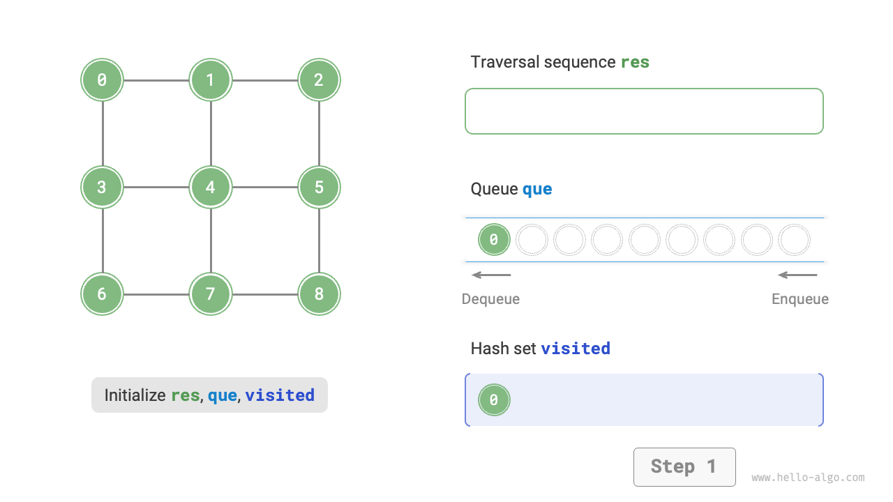
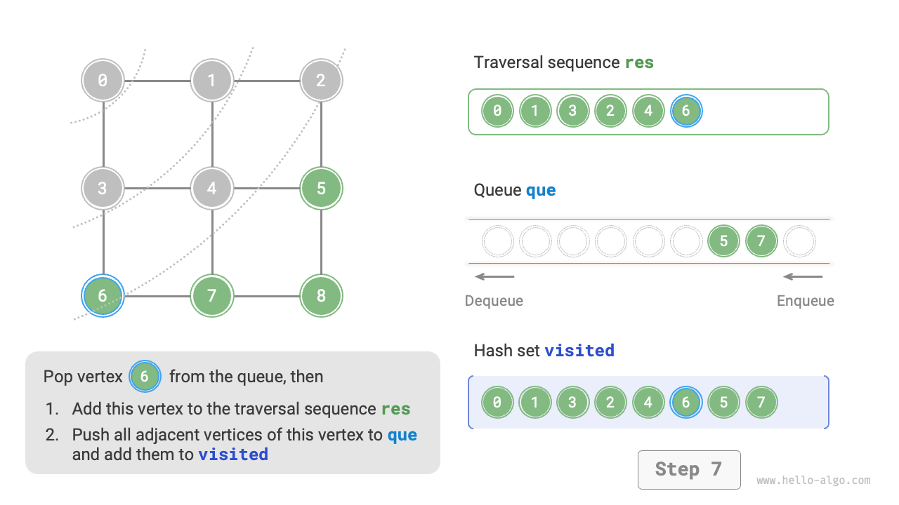

# 9.3 &nbsp; グラフ走査

木は「一対多」の関係を表現し、グラフはより高い自由度を持ち、任意の「多対多」の関係を表現できます。したがって、木をグラフの特別なケースと見なすことができます。明らかに、**木の走査操作もグラフ走査操作の特別なケースです**。

グラフと木の両方で、走査操作を実装するために探索アルゴリズムの応用が必要です。グラフ走査は2つのタイプに分けることができます：<u>幅優先探索（BFS）</u>と<u>深さ優先探索（DFS）</u>です。

## 9.3.1 &nbsp; 幅優先探索

**幅優先探索は近くから遠くへの走査方法で、ある頂点から開始し、常に最も近い頂点を優先的に訪問し、層ごとに外側に展開していきます**。下図に示すように、左上の頂点から開始し、まずその頂点のすべての隣接頂点を走査し、次に次の頂点のすべての隣接頂点を走査し、以下同様に、すべての頂点が訪問されるまで続けます。

{ class="animation-figure" }

<p align="center"> 図 9-9 &nbsp; グラフの幅優先走査 </p>

### 1. &nbsp; アルゴリズムの実装

BFSは通常キューの助けを借りて実装されます（下記のコード参照）。キューは「先入先出」で、これは「近くから遠くへ」走査するBFSの考え方と一致します。

1. 開始頂点`startVet`をキューに追加し、ループを開始します。
2. ループの各反復で、キューの先頭の頂点をポップし、それを訪問済みとして記録し、次にその頂点のすべての隣接頂点をキューの末尾に追加します。
3. すべての頂点が訪問されるまで手順`2.`を繰り返します。

頂点の再訪問を防ぐために、ハッシュセット`visited`を使用してどのノードが訪問されたかを記録します。

=== "Python"

    ```python title="graph_bfs.py"
    def graph_bfs(graph: GraphAdjList, start_vet: Vertex) -> list[Vertex]:
        """幅優先走査"""
        # 隣接リストを使用してグラフを表現し、指定された頂点のすべての隣接頂点を取得
        # 頂点走査シーケンス
        res = []
        # ハッシュセット、訪問済み頂点を記録するために使用
        visited = set[Vertex]([start_vet])
        # BFSを実装するために使用されるキュー
        que = deque[Vertex]([start_vet])
        # 頂点vetから開始し、すべての頂点が訪問されるまでループ
        while len(que) > 0:
            vet = que.popleft()  # キューの先頭の頂点をデキュー
            res.append(vet)  # 訪問済み頂点を記録
            # その頂点のすべての隣接頂点を走査
            for adj_vet in graph.adj_list[vet]:
                if adj_vet in visited:
                    continue  # 既に訪問済みの頂点をスキップ
                que.append(adj_vet)  # 未訪問の頂点のみをエンキュー
                visited.add(adj_vet)  # 頂点を訪問済みとしてマーク
        # 頂点走査シーケンスを返す
        return res
    ```

=== "C++"

    ```cpp title="graph_bfs.cpp"
    /* 幅優先走査 */
    // 隣接リストを使用してグラフを表現し、指定された頂点のすべての隣接頂点を取得
    vector<Vertex *> graphBFS(GraphAdjList &graph, Vertex *startVet) {
        // 頂点走査順序
        vector<Vertex *> res;
        // ハッシュセット、訪問済み頂点を記録するために使用
        unordered_set<Vertex *> visited = {startVet};
        // BFSを実装するために使用されるキュー
        queue<Vertex *> que;
        que.push(startVet);
        // 頂点vetから開始し、すべての頂点が訪問されるまでループ
        while (!que.empty()) {
            Vertex *vet = que.front();
            que.pop();          // キューの先頭の頂点をデキュー
            res.push_back(vet); // 訪問済み頂点を記録
            // その頂点のすべての隣接頂点を走査
            for (auto adjVet : graph.adjList[vet]) {
                if (visited.count(adjVet))
                    continue;            // すでに訪問済みの頂点をスキップ
                que.push(adjVet);        // 未訪問の頂点のみをエンキュー
                visited.emplace(adjVet); // 頂点を訪問済みとしてマーク
            }
        }
        // 頂点走査順序を返す
        return res;
    }
    ```

=== "Java"

    ```java title="graph_bfs.java"
    /* 幅優先走査 */
    // 隣接リストを使用してグラフを表現し、指定した頂点のすべての隣接頂点を取得
    List<Vertex> graphBFS(GraphAdjList graph, Vertex startVet) {
        // 頂点走査順序
        List<Vertex> res = new ArrayList<>();
        // ハッシュセット、訪問済みの頂点を記録するために使用
        Set<Vertex> visited = new HashSet<>();
        visited.add(startVet);
        // BFS を実装するために使用するキュー
        Queue<Vertex> que = new LinkedList<>();
        que.offer(startVet);
        // 頂点 vet から開始し、すべての頂点が訪問されるまでループ
        while (!que.isEmpty()) {
            Vertex vet = que.poll(); // キューの先頭の頂点をデキュー
            res.add(vet);            // 訪問した頂点を記録
            // その頂点のすべての隣接頂点を走査
            for (Vertex adjVet : graph.adjList.get(vet)) {
                if (visited.contains(adjVet))
                    continue;        // すでに訪問済みの頂点をスキップ
                que.offer(adjVet);   // 未訪問の頂点のみをエンキュー
                visited.add(adjVet); // 頂点を訪問済みとしてマーク
            }
        }
        // 頂点走査順序を返す
        return res;
    }
    ```

=== "C#"

    ```csharp title="graph_bfs.cs"
    [class]{graph_bfs}-[func]{GraphBFS}
    ```

=== "Go"

    ```go title="graph_bfs.go"
    [class]{}-[func]{graphBFS}
    ```

=== "Swift"

    ```swift title="graph_bfs.swift"
    [class]{}-[func]{graphBFS}
    ```

=== "JS"

    ```javascript title="graph_bfs.js"
    [class]{}-[func]{graphBFS}
    ```

=== "TS"

    ```typescript title="graph_bfs.ts"
    [class]{}-[func]{graphBFS}
    ```

=== "Dart"

    ```dart title="graph_bfs.dart"
    [class]{}-[func]{graphBFS}
    ```

=== "Rust"

    ```rust title="graph_bfs.rs"
    [class]{}-[func]{graph_bfs}
    ```

=== "C"

    ```c title="graph_bfs.c"
    [class]{Queue}-[func]{}

    [class]{}-[func]{isVisited}

    [class]{}-[func]{graphBFS}
    ```

=== "Kotlin"

    ```kotlin title="graph_bfs.kt"
    [class]{}-[func]{graphBFS}
    ```

=== "Ruby"

    ```ruby title="graph_bfs.rb"
    [class]{}-[func]{graph_bfs}
    ```

=== "Zig"

    ```zig title="graph_bfs.zig"
    [class]{}-[func]{graphBFS}
    ```

コードは比較的抽象的ですが、下図と比較することでより良く理解できます。

=== "<1>"
    { class="animation-figure" }

=== "<2>"
    { class="animation-figure" }

=== "<3>"
    { class="animation-figure" }

=== "<4>"
    { class="animation-figure" }

=== "<5>"
    { class="animation-figure" }

=== "<6>"
    { class="animation-figure" }

=== "<7>"
    { class="animation-figure" }

=== "<8>"
    { class="animation-figure" }

=== "<9>"
    { class="animation-figure" }

=== "<10>"
    { class="animation-figure" }

=== "<11>"
    { class="animation-figure" }

<p align="center"> 図 9-10 &nbsp; グラフの幅優先探索の手順 </p>

!!! question "幅優先走査のシーケンスは一意ですか？"

    一意ではありません。幅優先走査は「近くから遠く」の順序で走査することのみを要求し、**同じ距離の頂点の走査順序は任意にできます**。例えば、上図では、頂点$1$と$3$の訪問順序を交換できますし、頂点$2$、$4$、$6$の順序も同様です。

### 2. &nbsp; 計算量分析

**時間計算量**：すべての頂点が一度ずつエンキューおよびデキューされ、$O(|V|)$時間を使用します。隣接頂点を走査する過程で、無向グラフであるため、すべての辺が$2$回訪問され、$O(2|E|)$時間を使用します。全体で$O(|V| + |E|)$時間を使用します。

**空間計算量**：リスト`res`、ハッシュセット`visited`、キュー`que`の最大頂点数は$|V|$で、$O(|V|)$空間を使用します。

## 9.3.2 &nbsp; 深さ優先探索

**深さ優先探索は可能な限り遠くまで行き、それ以上のパスがない場合にバックトラックする走査方法です**。下図に示すように、左上の頂点から開始し、それ以上のパスがなくなるまで現在の頂点のいずれかの隣接頂点を訪問し、次に戻って続行し、すべての頂点が走査されるまで続けます。

{ class="animation-figure" }

<p align="center"> 図 9-11 &nbsp; グラフの深さ優先走査 </p>

### 1. &nbsp; アルゴリズムの実装

この「可能な限り遠くまで行ってから戻る」アルゴリズムパラダイムは通常再帰に基づいて実装されます。幅優先探索と同様に、深さ優先探索でも、再訪問を避けるために訪問済み頂点を記録するハッシュセット`visited`の助けが必要です。

=== "Python"

    ```python title="graph_dfs.py"
    def dfs(graph: GraphAdjList, visited: set[Vertex], res: list[Vertex], vet: Vertex):
        """深さ優先走査のヘルパー関数"""
        res.append(vet)  # 訪問済み頂点を記録
        visited.add(vet)  # 頂点を訪問済みとしてマーク
        # その頂点のすべての隣接頂点を走査
        for adjVet in graph.adj_list[vet]:
            if adjVet in visited:
                continue  # 既に訪問済みの頂点をスキップ
            # 隣接頂点を再帰的に訪問
            dfs(graph, visited, res, adjVet)

    def graph_dfs(graph: GraphAdjList, start_vet: Vertex) -> list[Vertex]:
        """深さ優先走査"""
        # 隣接リストを使用してグラフを表現し、指定された頂点のすべての隣接頂点を取得
        # 頂点走査シーケンス
        res = []
        # ハッシュセット、訪問済み頂点を記録するために使用
        visited = set[Vertex]()
        dfs(graph, visited, res, start_vet)
        return res
    ```

=== "C++"

    ```cpp title="graph_dfs.cpp"
    /* 深さ優先走査ヘルパー関数 */
    void dfs(GraphAdjList &graph, unordered_set<Vertex *> &visited, vector<Vertex *> &res, Vertex *vet) {
        res.push_back(vet);   // 訪問済み頂点を記録
        visited.emplace(vet); // 頂点を訪問済みとしてマーク
        // その頂点のすべての隣接頂点を走査
        for (Vertex *adjVet : graph.adjList[vet]) {
            if (visited.count(adjVet))
                continue; // すでに訪問済みの頂点をスキップ
            // 隣接頂点を再帰的に訪問
            dfs(graph, visited, res, adjVet);
        }
    }

    /* 深さ優先走査 */
    // 隣接リストを使用してグラフを表現し、指定された頂点のすべての隣接頂点を取得
    vector<Vertex *> graphDFS(GraphAdjList &graph, Vertex *startVet) {
        // 頂点走査順序
        vector<Vertex *> res;
        // ハッシュセット、訪問済み頂点を記録するために使用
        unordered_set<Vertex *> visited;
        dfs(graph, visited, res, startVet);
        return res;
    }
    ```

=== "Java"

    ```java title="graph_dfs.java"
    /* 深さ優先走査の補助関数 */
    void dfs(GraphAdjList graph, Set<Vertex> visited, List<Vertex> res, Vertex vet) {
        res.add(vet);     // 訪問した頂点を記録
        visited.add(vet); // 頂点を訪問済みとしてマーク
        // その頂点のすべての隣接頂点を走査
        for (Vertex adjVet : graph.adjList.get(vet)) {
            if (visited.contains(adjVet))
                continue; // すでに訪問済みの頂点をスキップ
            // 隣接頂点を再帰的に訪問
            dfs(graph, visited, res, adjVet);
        }
    }

    /* 深さ優先走査 */
    // 隣接リストを使用してグラフを表現し、指定した頂点のすべての隣接頂点を取得
    List<Vertex> graphDFS(GraphAdjList graph, Vertex startVet) {
        // 頂点走査順序
        List<Vertex> res = new ArrayList<>();
        // ハッシュセット、訪問済みの頂点を記録するために使用
        Set<Vertex> visited = new HashSet<>();
        dfs(graph, visited, res, startVet);
        return res;
    }
    ```

=== "C#"

    ```csharp title="graph_dfs.cs"
    [class]{graph_dfs}-[func]{DFS}

    [class]{graph_dfs}-[func]{GraphDFS}
    ```

=== "Go"

    ```go title="graph_dfs.go"
    [class]{}-[func]{dfs}

    [class]{}-[func]{graphDFS}
    ```

=== "Swift"

    ```swift title="graph_dfs.swift"
    [class]{}-[func]{dfs}

    [class]{}-[func]{graphDFS}
    ```

=== "JS"

    ```javascript title="graph_dfs.js"
    [class]{}-[func]{dfs}

    [class]{}-[func]{graphDFS}
    ```

=== "TS"

    ```typescript title="graph_dfs.ts"
    [class]{}-[func]{dfs}

    [class]{}-[func]{graphDFS}
    ```

=== "Dart"

    ```dart title="graph_dfs.dart"
    [class]{}-[func]{dfs}

    [class]{}-[func]{graphDFS}
    ```

=== "Rust"

    ```rust title="graph_dfs.rs"
    [class]{}-[func]{dfs}

    [class]{}-[func]{graph_dfs}
    ```

=== "C"

    ```c title="graph_dfs.c"
    [class]{}-[func]{isVisited}

    [class]{}-[func]{dfs}

    [class]{}-[func]{graphDFS}
    ```

=== "Kotlin"

    ```kotlin title="graph_dfs.kt"
    [class]{}-[func]{dfs}

    [class]{}-[func]{graphDFS}
    ```

=== "Ruby"

    ```ruby title="graph_dfs.rb"
    [class]{}-[func]{dfs}

    [class]{}-[func]{graph_dfs}
    ```

=== "Zig"

    ```zig title="graph_dfs.zig"
    [class]{}-[func]{dfs}

    [class]{}-[func]{graphDFS}
    ```

深さ優先探索のアルゴリズムプロセスを下図に示します。

- **破線は下向きの再帰を表し**、新しい頂点を訪問するために新しい再帰メソッドが開始されたことを示します。
- **曲線の破線は上向きのバックトラックを表し**、この再帰メソッドがこのメソッドが開始された位置に戻ったことを示します。

理解を深めるため、下図とコードを組み合わせて、DFSプロセス全体を頭の中でシミュレート（または描画）することをお勧めします。各再帰メソッドがいつ開始され、いつ戻るかを含めてです。

=== "<1>"
    { class="animation-figure" }

=== "<2>"
    { class="animation-figure" }

=== "<3>"
    { class="animation-figure" }

=== "<4>"
    { class="animation-figure" }

=== "<5>"
    { class="animation-figure" }

=== "<6>"
    { class="animation-figure" }

=== "<7>"
    { class="animation-figure" }

=== "<8>"
    { class="animation-figure" }

=== "<9>"
    { class="animation-figure" }

=== "<10>"
    { class="animation-figure" }

=== "<11>"
    { class="animation-figure" }

<p align="center"> 図 9-12 &nbsp; グラフの深さ優先探索の手順 </p>

!!! question "深さ優先走査のシーケンスは一意ですか？"

    幅優先走査と同様に、深さ優先走査シーケンスの順序も一意ではありません。ある頂点が与えられた場合、どの方向を最初に探索することも可能です。つまり、隣接頂点の順序は任意にシャッフルできますが、すべて深さ優先走査の一部です。

    木の走査を例に取ると、「根 $\rightarrow$ 左 $\rightarrow$ 右」、「左 $\rightarrow$ 根 $\rightarrow$ 右」、「左 $\rightarrow$ 右 $\rightarrow$ 根」は、それぞれ前順、中順、後順走査に対応します。これらは3つの異なる走査優先度を示していますが、3つすべてが深さ優先走査と見なされます。

### 2. &nbsp; 計算量分析

**時間計算量**：すべての頂点が一度訪問され、$O(|V|)$時間を使用します。すべての辺が2回訪問され、$O(2|E|)$時間を使用します。全体で$O(|V| + |E|)$時間を使用します。

**空間計算量**：リスト`res`、ハッシュセット`visited`の最大頂点数は$|V|$で、最大再帰深度は$|V|$です。したがって、$O(|V|)$空間を使用します。
