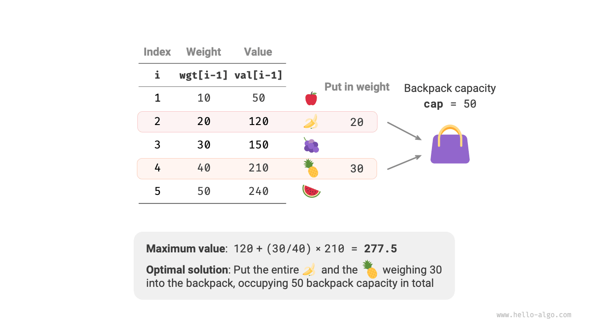
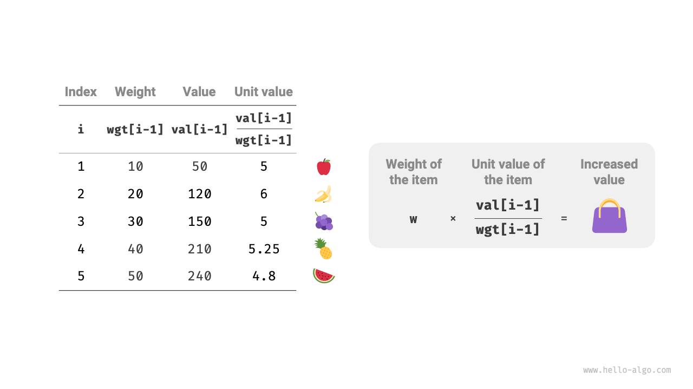
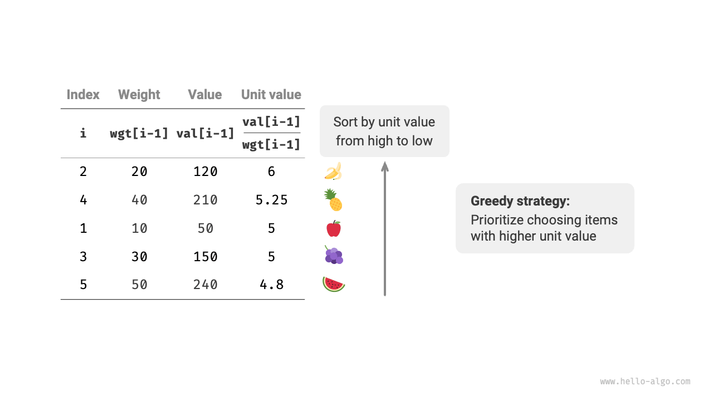
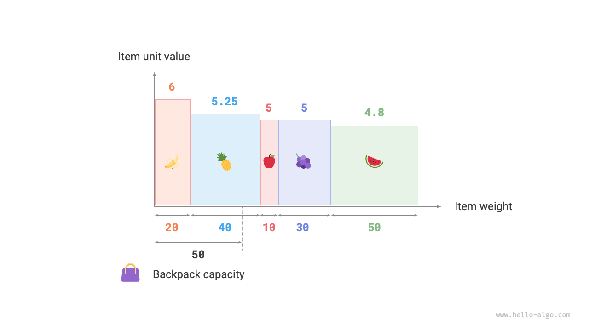

# 分数ナップサック問題

!!! question

    $n$ 個のアイテムが与えられ、$i$ 番目のアイテムの重量は $wgt[i-1]$ で値は $val[i-1]$ です。容量が $cap$ のナップサックがあります。各アイテムは1回のみ選択できますが、**アイテムの一部を選択することができ、その値は選択された重量の割合に基づいて計算されます**。限られた容量の下でナップサック内のアイテムの最大値は何ですか？例を下の図に示します。



分数ナップサック問題は全体的に0-1ナップサック問題と非常に似ており、現在のアイテム $i$ と容量 $c$ を含み、ナップサックの限られた容量内で値を最大化することを目的としています。

違いは、この問題ではアイテムの一部のみを選択できることです。下の図に示すように、**アイテムを任意に分割し、重量の割合に基づいて対応する値を計算できます**。

1. アイテム $i$ について、その単位重量あたりの値は $val[i-1] / wgt[i-1]$ で、単位値と呼ばれます。
2. 重量 $w$ のアイテム $i$ の一部をナップサックに入れるとすると、ナップサックに追加される値は $w \times val[i-1] / wgt[i-1]$ です。



### 貪欲戦略の決定

ナップサック内のアイテムの総値を最大化することは、**本質的に単位重量あたりの値を最大化することを意味します**。これから、下の図に示す貪欲戦略を導出できます。

1. アイテムを単位値の高い順から低い順にソートします。
2. すべてのアイテムを反復し、**各ラウンドで最も高い単位値を持つアイテムを貪欲に選択**します。
3. ナップサックの残り容量が不十分な場合、現在のアイテムの一部を使用してナップサックを満たします。



### コード実装

アイテムを単位値でソートするために `Item` クラスを作成しました。ナップサックが満たされるまでループして貪欲な選択を行い、その後終了して解を返します：

```src
[file]{fractional_knapsack}-[class]{}-[func]{fractional_knapsack}
```

ソート以外に、最悪の場合、アイテムのリスト全体を走査する必要があるため、**時間計算量は $O(n)$** です。ここで $n$ はアイテムの数です。

`Item` オブジェクトリストが初期化されるため、**空間計算量は $O(n)$** です。

### 正しさの証明

背理法を使用します。アイテム $x$ が最高の単位値を持ち、あるアルゴリズムが最大値 `res` を生成するが、解にアイテム $x$ が含まれていないと仮定します。

今、ナップサックから任意のアイテムの単位重量を取り除き、アイテム $x$ の単位重量で置き換えます。アイテム $x$ の単位値が最高であるため、置き換え後の総値は確実に `res` より大きくなります。**これは `res` が最適解であるという仮定と矛盾し、最適解には必ずアイテム $x$ が含まれることを証明します**。

この解の他のアイテムについても、上記の矛盾を構築できます。全体的に、**単位値がより大きいアイテムは常により良い選択**であり、貪欲戦略が効果的であることを証明します。

下の図に示すように、アイテムの重量と単位値をそれぞれ二次元チャートの横軸と縦軸と見なすと、分数ナップサック問題は「限られた横軸範囲内で囲まれる最大面積を求める」ことに変換できます。この類推は、幾何学的観点から貪欲戦略の効果を理解するのに役立ちます。


