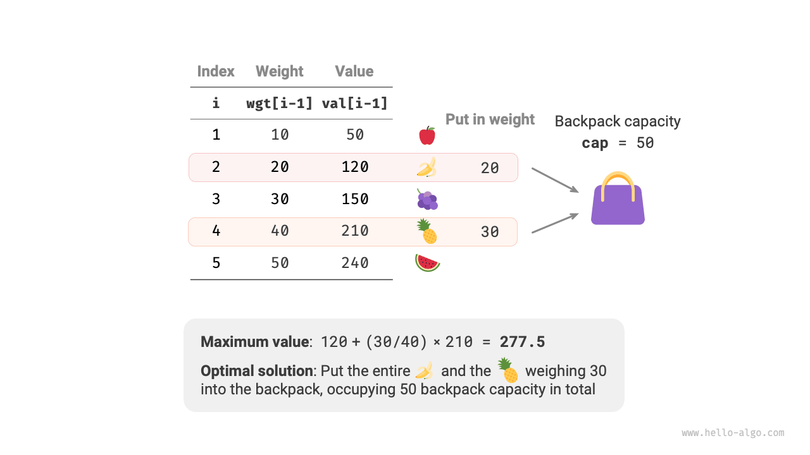
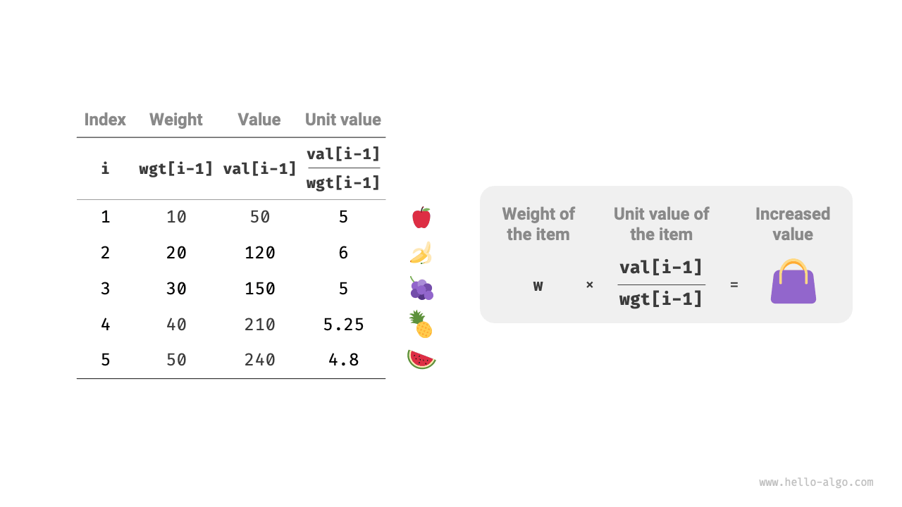
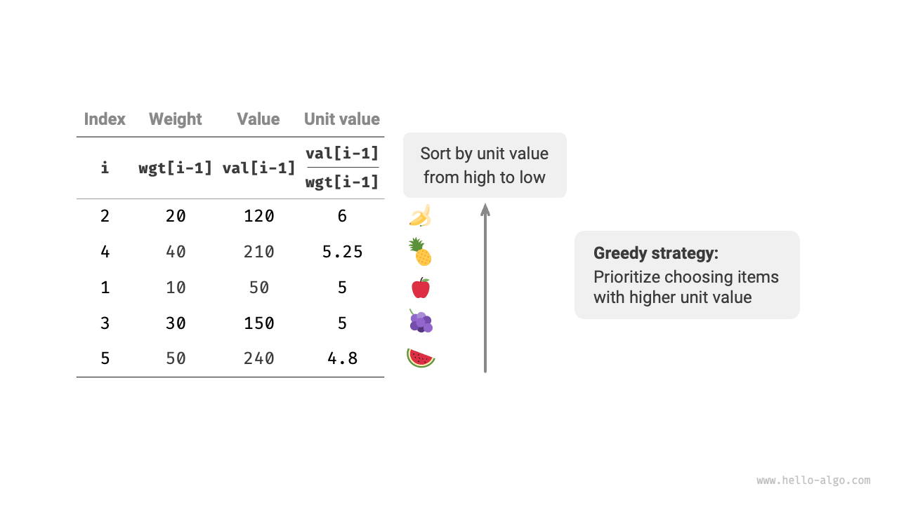
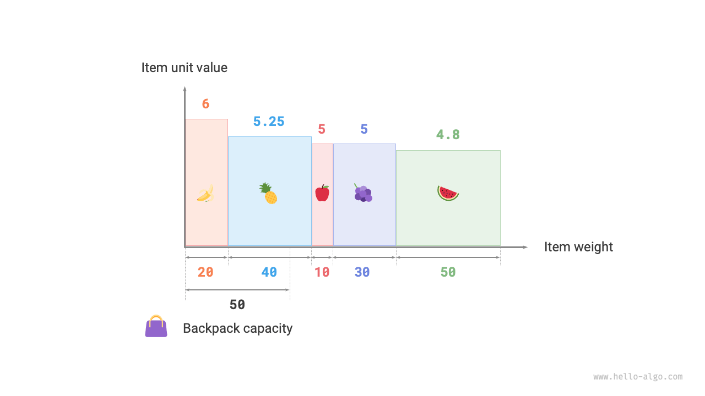

# 分数ナップサック問題

!!! question

    $n$ 個の品物が与えられ、第 $i$ 個の品物の重さは $wgt[i-1]$、価値は $val[i-1]$ であり、容量が $cap$ のナップサックがある。各品物は 1 回だけ選択できるが、**品物の一部を選ぶこともでき、価値は選択した重量の割合に応じて計算される**。容量制限の下でナップサック内の品物の最大価値を求めよ。例を以下に示す。



分数ナップサック問題は 0-1 ナップサック問題と全体として非常によく似ており、状態には現在の品物 $i$ と容量 $c$ が含まれ、目標は容量制限下での最大価値を求めることである。

異なる点は、本問では品物の一部だけを選べることである。以下に示すように、**品物は任意に分割でき、対応する価値は重量の割合に応じて計算される**。

1. 品物 $i$ について、単位重量あたりの価値は $val[i-1] / wgt[i-1]$ であり、これを単位価値と呼ぶ。
2. 品物 $i$ の一部を重さ $w$ だけ入れると、ナップサックに増える価値は $w \times val[i-1] / wgt[i-1]$ となる。



### 貪欲戦略の決定

ナップサック内の品物の総価値を最大化することは、**本質的には単位重量あたりの品物価値を最大化すること**である。そこから、以下に示す貪欲戦略を導ける。

1. 品物を単位価値の高い順にソートする。
2. すべての品物を走査し、**各回で単位価値が最も高い品物を貪欲に選択する**。
3. 残りのナップサック容量が足りない場合は、現在の品物の一部を使ってナップサックを満たす。



### コード実装

品物を単位価値でソートできるように、`Item` クラスを定義する。貪欲選択を繰り返し、ナップサックが満杯になったら終了して解を返す。

```src
[file]{fractional_knapsack}-[class]{}-[func]{fractional_knapsack}
```

組み込みのソートアルゴリズムの時間計算量は通常 $O(\log n)$、空間計算量は通常 $O(\log n)$ または $O(n)$ であり、具体的な値はプログラミング言語の実装に依存する。

ソートを除けば、最悪の場合は品物リスト全体を走査する必要があるため、**時間計算量は $O(n)$** であり、ここで $n$ は品物数である。

`Item` オブジェクトのリストを初期化しているため、**空間計算量は $O(n)$** である。

### 正しさの証明

背理法を用いる。品物 $x$ が単位価値最大の品物であり、あるアルゴリズムで得られた最大価値を `res` とするが、その解には品物 $x$ が含まれていないと仮定する。

ここでナップサックから単位重量の任意の品物を取り出し、単位重量の品物 $x$ に置き換える。品物 $x$ の単位価値が最大であるため、置き換え後の総価値は必ず `res` より大きくなる。**これは `res` が最適解であることに矛盾し、最適解には必ず品物 $x$ が含まれなければならないことを示す**。

この解に含まれる他の品物についても、同様の矛盾を構成できる。要するに、**単位価値がより大きい品物は常により良い選択である**。これは貪欲戦略が有効であることを示している。

以下に示すように、品物の重さと品物の単位価値をそれぞれ二次元グラフの横軸と縦軸とみなすと、分数ナップサック問題は「有限な横軸区間で囲まれる最大面積を求める問題」に変換できる。この類比は、幾何学的な観点から貪欲戦略の有効性を理解する助けになる。


