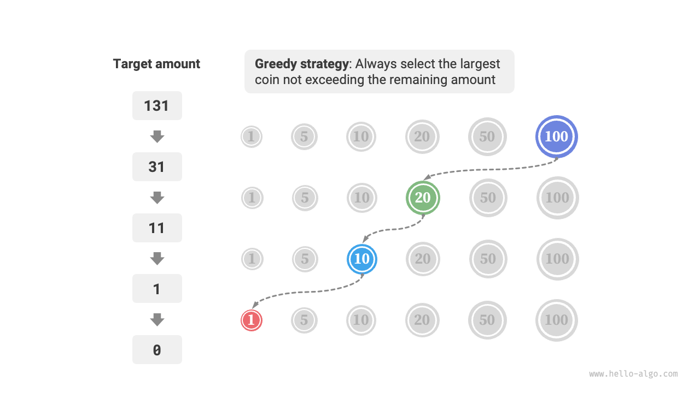
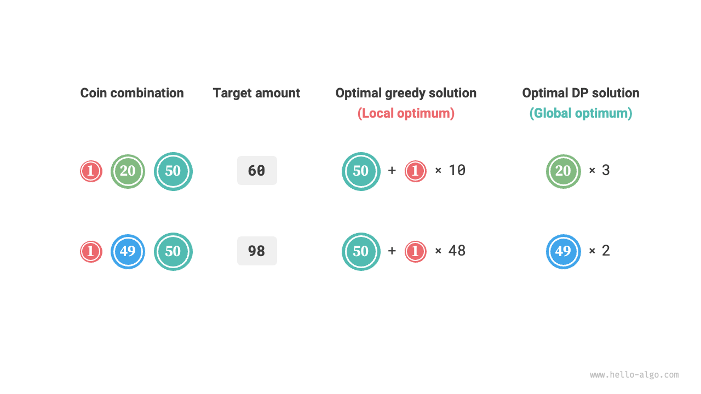

# 貪欲アルゴリズム

<u>貪欲アルゴリズム</u>は最適化問題を解決するための一般的なアルゴリズムで、基本的に問題の各意思決定段階で最も良い選択をすること、つまり局所的に最適な決定を貪欲に行い、グローバルに最適な解を見つけることを望みます。貪欲アルゴリズムは簡潔で効率的であり、多くの実用的な問題で広く使用されています。

貪欲アルゴリズムと動的プログラミングは、どちらも最適化問題を解決するためによく使用されます。両者は最適部分構造の性質に依存するなど、いくつかの類似点を共有していますが、動作方法が異なります。

- 動的プログラミングは現在の決定段階ですべての以前の決定を考慮し、過去の部分問題の解を使用して現在の部分問題の解を構築します。
- 貪欲アルゴリズムは過去の決定を考慮せず、代わりに貪欲な選択を続け、問題が解決されるまで問題の範囲を継続的に狭めます。

まず、「完全ナップサック問題」の章で紹介された「コイン交換」の例を通じて貪欲アルゴリズムの動作原理を理解しましょう。すでによく知っていると思います。

!!! question

    $n$ 種類のコインが与えられ、$i$ 番目の種類のコインの額面は $coins[i - 1]$ で、目標金額は $amt$ です。各種類のコインは無制限に利用可能で、目標金額を構成するのに必要な最小コイン数は何ですか？目標金額を構成できない場合は $-1$ を返してください。

この問題で採用される貪欲戦略を下の図に示します。目標金額が与えられたとき、**それに最も近く、それを超えないコインを貪欲に選択**し、目標金額が満たされるまでこのステップを繰り返します。



実装コードは以下の通りです：

```src
[file]{coin_change_greedy}-[class]{}-[func]{coin_change_greedy}
```

感嘆するかもしれません：なんて簡潔なんだ！貪欲アルゴリズムは約10行のコードでコイン交換問題を解決します。

## 貪欲アルゴリズムの利点と制限

**貪欲アルゴリズムは直接的で実装が簡単であるだけでなく、通常非常に効率的でもあります**。上記のコードで、最小のコイン額面を $\min(coins)$ とすると、貪欲な選択ループは最大 $amt / \min(coins)$ 回実行され、時間計算量は $O(amt / \min(coins))$ になります。これは動的プログラミング解法の時間計算量 $O(n \times amt)$ よりも一桁小さいです。

しかし、**一部のコイン額面の組み合わせでは、貪欲アルゴリズムは最適解を見つけることができません**。下の図は2つの例を示しています。

- **正の例 $coins = [1, 5, 10, 20, 50, 100]$**：このコインの組み合わせでは、任意の $amt$ に対して、貪欲アルゴリズムは最適解を見つけることができます。
- **負の例 $coins = [1, 20, 50]$**：$amt = 60$ とすると、貪欲アルゴリズムは組み合わせ $50 + 1 \times 10$ しか見つけられず、合計11枚のコインですが、動的プログラミングは最適解 $20 + 20 + 20$ を見つけることができ、3枚のコインのみが必要です。
- **負の例 $coins = [1, 49, 50]$**：$amt = 98$ とすると、貪欲アルゴリズムは組み合わせ $50 + 1 \times 48$ しか見つけられず、合計49枚のコインですが、動的プログラミングは最適解 $49 + 49$ を見つけることができ、2枚のコインのみが必要です。



これは、コイン交換問題において、貪欲アルゴリズムがグローバルに最適な解を見つけることを保証できず、非常に悪い解を見つける可能性があることを意味します。動的プログラミングの方が適しています。

一般的に、貪欲アルゴリズムの適用性は2つのカテゴリに分類されます。

1. **最適解を見つけることが保証される**：これらの場合、貪欲アルゴリズムはしばしば最良の選択で、バックトラッキングや動的プログラミングよりも効率的である傾向があります。
2. **準最適解を見つけることができる**：貪欲アルゴリズムはここでも適用可能です。多くの複雑な問題では、グローバル最適解を見つけることは非常に困難であり、高効率の準最適解を見つけることも非常に価値があります。

## 貪欲アルゴリズムの特徴

それでは、どのような問題が貪欲アルゴリズムで解決するのに適しているのでしょうか？言い換えれば、どのような条件下で貪欲アルゴリズムは最適解を見つけることを保証できるのでしょうか？

動的プログラミングと比較して、貪欲アルゴリズムはより厳しい使用条件を持ち、主に問題の2つの性質に焦点を当てています。

- **貪欲選択性**：局所的に最適な選択が常にグローバルに最適な解に導くことができる場合のみ、貪欲アルゴリズムは最適解を得ることを保証できます。
- **最適部分構造**：元の問題の最適解はその部分問題の最適解を含みます。

最適部分構造は「動的プログラミング」の章ですでに紹介されているため、ここではこれ以上議論しません。一部の問題には明らかな最適部分構造がありませんが、それでも貪欲アルゴリズムを使用して解決できることに注意することが重要です。

主に貪欲選択性を決定する方法を探索します。その記述は単純に見えますが、**実際には、多くの問題の貪欲選択性を証明することは容易ではありません**。

例えば、コイン交換問題では、貪欲選択性を反証するために反例を簡単に挙げることができますが、それを証明することははるかに困難です。**コインの組み合わせが貪欲アルゴリズムを使用して解決できるためには、どのような条件を満たす必要があるか**と尋ねられた場合、厳密な数学的証明を提供することが困難であるため、しばしば直感や例に頼って曖昧な答えを提供しなければなりません。

!!! quote

    ある論文では、コインの組み合わせが任意の金額に対して貪欲アルゴリズムを使用して最適解を見つけることができるかどうかを判定するための時間計算量 $O(n^3)$ のアルゴリズムが提示されています。

    Pearson, D. A polynomial-time algorithm for the change-making problem[J]. Operations Research Letters, 2005, 33(3): 231-234.

## 貪欲アルゴリズムによる問題解決のステップ

貪欲問題の問題解決プロセスは、一般的に以下の3つのステップに分けることができます。

1. **問題分析**：問題の特徴を整理し理解する。状態定義、最適化目標、制約などを含みます。このステップはバックトラッキングや動的プログラミングでも関与します。
2. **貪欲戦略の決定**：各ステップで貪欲な選択をする方法を決定する。この戦略は各ステップで問題の規模を縮小し、最終的に問題全体を解決できます。
3. **正確性の証明**：通常、問題が貪欲選択性と最適部分構造の両方を持つことを証明する必要があります。このステップには、帰納法や背理法などの数学的証明が必要な場合があります。

貪欲戦略の決定は問題解決の核心ステップですが、実装は容易ではない場合があります。主な理由は以下の通りです。

- **異なる問題間で貪欲戦略は大きく異なる**。多くの問題では、貪欲戦略はかなり直接的で、一般的な思考と試行を通じて思いつくことができます。しかし、一部の複雑な問題では、貪欲戦略は非常に見つけにくく、これは個人の問題解決経験とアルゴリズム能力の真のテストです。
- **一部の貪欲戦略は非常に誤解を招く**。自信を持って貪欲戦略を設計し、コードを書いてテストに提出したとき、一部のテストケースが通らない可能性が高いです。これは設計された貪欲戦略が「部分的に正しい」だけであるためで、上記のコイン交換の例で説明した通りです。

正確性を確保するために、貪欲戦略に対して厳密な数学的証明を提供すべきで、**通常は背理法や数学的帰納法を含みます**。

しかし、正確性を証明することは容易な作業ではない場合があります。途方に暮れた場合、通常はテストケースに基づいてコードをデバッグし、貪欲戦略を段階的に修正し検証することを選択します。

## 貪欲アルゴリズムで解決される典型的な問題

貪欲アルゴリズムは、貪欲選択と最適部分構造の性質を満たす最適化問題によく適用されます。以下は典型的な貪欲アルゴリズム問題のいくつかです。

- **コイン交換問題**：一部のコインの組み合わせでは、貪欲アルゴリズムは常に最適解を提供します。
- **区間スケジューリング問題**：いくつかのタスクがあり、それぞれが一定期間にわたって行われるとします。目標はできるだけ多くのタスクを完了することです。常に最も早く終了するタスクを選択すると、貪欲アルゴリズムは最適解を達成できます。
- **分数ナップサック問題**：アイテムのセットと運搬容量が与えられ、目標は総重量が運搬容量を超えず、総価値が最大化されるようなアイテムのセットを選択することです。常に最高の価値対重量比（価値/重量）のアイテムを選択すると、貪欲アルゴリズムは一部のケースで最適解を達成できます。
- **株式取引問題**：株価の履歴のセットが与えられ、複数回の取引を行うことができますが、すでに株式を所有している場合は売却後でないと再度購入できません。目標は最大利益を達成することです。
- **ハフマン符号化**：ハフマン符号化は無損失データ圧縮に使用される貪欲アルゴリズムです。ハフマン木を構築することにより、常に最低頻度の2つのノードを統合し、最小重み付きパス長（符号化長）のハフマン木を生成します。
- **ダイクストラのアルゴリズム**：これは与えられたソース頂点から他のすべての頂点への最短経路問題を解決するための貪欲アルゴリズムです。
