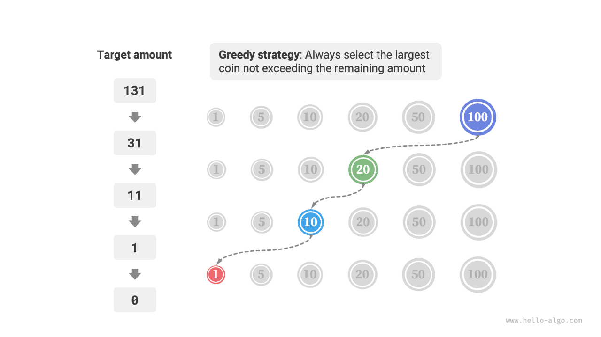
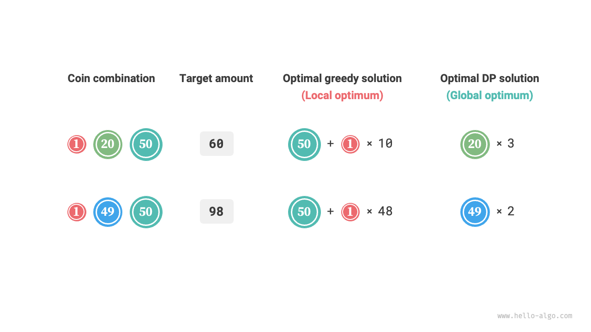

# 15.1 &nbsp; 貪欲法

<u>貪欲法（greedy algorithm）</u>は、最適化問題を解くための一般的なアルゴリズムです。その基本的な考え方は、問題の各意思決定段階において、その時点で最善に見える選択を行い、すなわち貪欲に局所最適な決定を下すことで、大域最適解を得ようとするものです。貪欲法は簡潔で効率的であり、多くの実際の問題で広く用いられています。

貪欲法と動的計画法は、どちらも最適化問題を解く際によく用いられます。両者には、最適部分構造に依存するなどの共通点がありますが、その動作原理は異なります。

- 動的計画法は、前の段階までのすべての決定に基づいて現在の決定を考え、過去の部分問題の解を用いて現在の部分問題の解を構築します。
- 貪欲法は過去の決定を考慮せず、ひたすら前に進みながら貪欲な選択を行い、問題の範囲を縮小し続けて、最終的に問題を解決します。

まずは例題「コイン両替」を通して、貪欲法の仕組みを理解しましょう。この問題はすでに「完全ナップサック問題」の節で紹介しているので、見覚えがあるはずです。

!!! question

    $n$ 種類の硬貨が与えられ、$i$ 番目の硬貨の額面は $coins[i - 1]$ 、目標金額は $amt$ です。各硬貨は何度でも選べるとき、目標金額を作るために必要な最小の硬貨枚数を求めてください。目標金額を作れない場合は $-1$ を返します。

この問題で採用する貪欲戦略は下図のとおりです。目標金額が与えられたら、**それを超えず、かつ最も近い硬貨を貪欲に選択し**、この手順を目標金額を作り切るまで繰り返します。

{ class="animation-figure" }

<p align="center"> 図 15-1 &nbsp; コイン両替の貪欲戦略 </p>

実装コードは次のとおりです。

=== "Python"

    ```python title="coin_change_greedy.py"
    def coin_change_greedy(coins: list[int], amt: int) -> int:
        """コイン交換：貪欲法"""
        # coins リストはソート済みと仮定する
        i = len(coins) - 1
        count = 0
        # 残額がなくなるまで貪欲選択を繰り返す
        while amt > 0:
            # 残額以下で最も近い硬貨を見つける
            while i > 0 and coins[i] > amt:
                i -= 1
            # coins[i] を選択する
            amt -= coins[i]
            count += 1
        # 実行可能な解が見つからなければ -1 を返す
        return count if amt == 0 else -1
    ```

=== "C++"

    ```cpp title="coin_change_greedy.cpp"
    /* コイン交換：貪欲法 */
    int coinChangeGreedy(vector<int> &coins, int amt) {
        // coins リストはソート済みと仮定する
        int i = coins.size() - 1;
        int count = 0;
        // 残額がなくなるまで貪欲選択を繰り返す
        while (amt > 0) {
            // 残額以下で最も近い硬貨を見つける
            while (i > 0 && coins[i] > amt) {
                i--;
            }
            // coins[i] を選択する
            amt -= coins[i];
            count++;
        }
        // 実行可能な解が見つからなければ -1 を返す
        return amt == 0 ? count : -1;
    }
    ```

=== "Java"

    ```java title="coin_change_greedy.java"
    /* コイン交換：貪欲法 */
    int coinChangeGreedy(int[] coins, int amt) {
        // coins リストはソート済みと仮定する
        int i = coins.length - 1;
        int count = 0;
        // 残額がなくなるまで貪欲選択を繰り返す
        while (amt > 0) {
            // 残額以下で最も近い硬貨を見つける
            while (i > 0 && coins[i] > amt) {
                i--;
            }
            // coins[i] を選択する
            amt -= coins[i];
            count++;
        }
        // 実行可能な解が見つからなければ -1 を返す
        return amt == 0 ? count : -1;
    }
    ```

=== "C#"

    ```csharp title="coin_change_greedy.cs"
    /* コイン交換：貪欲法 */
    int CoinChangeGreedy(int[] coins, int amt) {
        // coins リストはソート済みと仮定する
        int i = coins.Length - 1;
        int count = 0;
        // 残額がなくなるまで貪欲選択を繰り返す
        while (amt > 0) {
            // 残額以下で最も近い硬貨を見つける
            while (i > 0 && coins[i] > amt) {
                i--;
            }
            // coins[i] を選択する
            amt -= coins[i];
            count++;
        }
        // 実行可能な解が見つからなければ -1 を返す
        return amt == 0 ? count : -1;
    }
    ```

=== "Go"

    ```go title="coin_change_greedy.go"
    /* コイン交換：貪欲法 */
    func coinChangeGreedy(coins []int, amt int) int {
        // coins リストはソート済みと仮定する
        i := len(coins) - 1
        count := 0
        // 残額がなくなるまで貪欲選択を繰り返す
        for amt > 0 {
            // 残額以下で最も近い硬貨を見つける
            for i > 0 && coins[i] > amt {
                i--
            }
            // coins[i] を選択する
            amt -= coins[i]
            count++
        }
        // 実行可能な解が見つからなければ -1 を返す
        if amt != 0 {
            return -1
        }
        return count
    }
    ```

=== "Swift"

    ```swift title="coin_change_greedy.swift"
    /* コイン交換：貪欲法 */
    func coinChangeGreedy(coins: [Int], amt: Int) -> Int {
        // coins リストはソート済みと仮定する
        var i = coins.count - 1
        var count = 0
        var amt = amt
        // 残額がなくなるまで貪欲選択を繰り返す
        while amt > 0 {
            // 残額以下で最も近い硬貨を見つける
            while i > 0 && coins[i] > amt {
                i -= 1
            }
            // coins[i] を選択する
            amt -= coins[i]
            count += 1
        }
        // 実行可能な解が見つからなければ -1 を返す
        return amt == 0 ? count : -1
    }
    ```

=== "JS"

    ```javascript title="coin_change_greedy.js"
    /* コイン交換：貪欲法 */
    function coinChangeGreedy(coins, amt) {
        // coins 配列はソート済みと仮定する
        let i = coins.length - 1;
        let count = 0;
        // 残額がなくなるまで貪欲選択を繰り返す
        while (amt > 0) {
            // 残額以下で最も近い硬貨を見つける
            while (i > 0 && coins[i] > amt) {
                i--;
            }
            // coins[i] を選択する
            amt -= coins[i];
            count++;
        }
        // 実行可能な解が見つからなければ -1 を返す
        return amt === 0 ? count : -1;
    }
    ```

=== "TS"

    ```typescript title="coin_change_greedy.ts"
    /* コイン交換：貪欲法 */
    function coinChangeGreedy(coins: number[], amt: number): number {
        // coins 配列はソート済みと仮定する
        let i = coins.length - 1;
        let count = 0;
        // 残額がなくなるまで貪欲選択を繰り返す
        while (amt > 0) {
            // 残額以下で最も近い硬貨を見つける
            while (i > 0 && coins[i] > amt) {
                i--;
            }
            // coins[i] を選択する
            amt -= coins[i];
            count++;
        }
        // 実行可能な解が見つからなければ -1 を返す
        return amt === 0 ? count : -1;
    }
    ```

=== "Dart"

    ```dart title="coin_change_greedy.dart"
    /* コイン交換：貪欲法 */
    int coinChangeGreedy(List<int> coins, int amt) {
      // coins リストはソート済みと仮定する
      int i = coins.length - 1;
      int count = 0;
      // 残額がなくなるまで貪欲選択を繰り返す
      while (amt > 0) {
        // 残額以下で最も近い硬貨を見つける
        while (i > 0 && coins[i] > amt) {
          i--;
        }
        // coins[i] を選択する
        amt -= coins[i];
        count++;
      }
      // 実行可能な解が見つからなければ -1 を返す
      return amt == 0 ? count : -1;
    }
    ```

=== "Rust"

    ```rust title="coin_change_greedy.rs"
    /* コイン交換：貪欲法 */
    fn coin_change_greedy(coins: &[i32], mut amt: i32) -> i32 {
        // coins リストはソート済みと仮定する
        let mut i = coins.len() - 1;
        let mut count = 0;
        // 残額がなくなるまで貪欲選択を繰り返す
        while amt > 0 {
            // 残額以下で最も近い硬貨を見つける
            while i > 0 && coins[i] > amt {
                i -= 1;
            }
            // coins[i] を選択する
            amt -= coins[i];
            count += 1;
        }
        // 実行可能な解が見つからなければ -1 を返す
        if amt == 0 {
            count
        } else {
            -1
        }
    }
    ```

=== "C"

    ```c title="coin_change_greedy.c"
    /* コイン交換：貪欲法 */
    int coinChangeGreedy(int *coins, int size, int amt) {
        // coins リストはソート済みと仮定する
        int i = size - 1;
        int count = 0;
        // 残額がなくなるまで貪欲選択を繰り返す
        while (amt > 0) {
            // 残額以下で最も近い硬貨を見つける
            while (i > 0 && coins[i] > amt) {
                i--;
            }
            // coins[i] を選択する
            amt -= coins[i];
            count++;
        }
        // 実行可能な解が見つからなければ -1 を返す
        return amt == 0 ? count : -1;
    }
    ```

=== "Kotlin"

    ```kotlin title="coin_change_greedy.kt"
    /* コイン交換：貪欲法 */
    fun coinChangeGreedy(coins: IntArray, amt: Int): Int {
        // coins リストはソート済みと仮定する
        var am = amt
        var i = coins.size - 1
        var count = 0
        // 残額がなくなるまで貪欲選択を繰り返す
        while (am > 0) {
            // 残額以下で最も近い硬貨を見つける
            while (i > 0 && coins[i] > am) {
                i--
            }
            // coins[i] を選択する
            am -= coins[i]
            count++
        }
        // 実行可能な解が見つからなければ -1 を返す
        return if (am == 0) count else -1
    }
    ```

=== "Ruby"

    ```ruby title="coin_change_greedy.rb"
    ### コイン両替：貪欲法 ###
    def coin_change_greedy(coins, amt)
      # coins リストはソート済みと仮定する
      i = coins.length - 1
      count = 0
      # 残額がなくなるまで貪欲選択を繰り返す
      while amt > 0
        # 残額以下で最も近い硬貨を見つける
        while i > 0 && coins[i] > amt
          i -= 1
        end
        # coins[i] を選択する
        amt -= coins[i]
        count += 1
      end
      # 実行可能な解が見つからなければ `-1` を返す
      amt == 0 ? count : -1
    end
    ```

??? pythontutor "コードの可視化"

    <div style="height: 549px; width: 100%;"><iframe class="pythontutor-iframe" src="https://pythontutor.com/iframe-embed.html#code=def%20coin_change_greedy%28coins%3A%20list%5Bint%5D%2C%20amt%3A%20int%29%20-%3E%20int%3A%0A%20%20%20%20%22%22%22%E3%82%B3%E3%82%A4%E3%83%B3%E4%BA%A4%E6%8F%9B%EF%BC%9A%E8%B2%AA%E6%AC%B2%E6%B3%95%22%22%22%0A%20%20%20%20%23%20coins%20%E3%83%AA%E3%82%B9%E3%83%88%E3%81%AF%E3%82%BD%E3%83%BC%E3%83%88%E6%B8%88%E3%81%BF%E3%81%A8%E4%BB%AE%E5%AE%9A%E3%81%99%E3%82%8B%0A%20%20%20%20i%20%3D%20len%28coins%29%20-%201%0A%20%20%20%20count%20%3D%200%0A%20%20%20%20%23%20%E6%AE%8B%E9%A1%8D%E3%81%8C%E3%81%AA%E3%81%8F%E3%81%AA%E3%82%8B%E3%81%BE%E3%81%A7%E8%B2%AA%E6%AC%B2%E9%81%B8%E6%8A%9E%E3%82%92%E7%B9%B0%E3%82%8A%E8%BF%94%E3%81%99%0A%20%20%20%20while%20amt%20%3E%200%3A%0A%20%20%20%20%20%20%20%20%23%20%E6%AE%8B%E9%A1%8D%E4%BB%A5%E4%B8%8B%E3%81%A7%E6%9C%80%E3%82%82%E8%BF%91%E3%81%84%E7%A1%AC%E8%B2%A8%E3%82%92%E8%A6%8B%E3%81%A4%E3%81%91%E3%82%8B%0A%20%20%20%20%20%20%20%20while%20i%20%3E%200%20and%20coins%5Bi%5D%20%3E%20amt%3A%0A%20%20%20%20%20%20%20%20%20%20%20%20i%20-%3D%201%0A%20%20%20%20%20%20%20%20%23%20coins%5Bi%5D%20%E3%82%92%E9%81%B8%E6%8A%9E%E3%81%99%E3%82%8B%0A%20%20%20%20%20%20%20%20amt%20-%3D%20coins%5Bi%5D%0A%20%20%20%20%20%20%20%20count%20%2B%3D%201%0A%20%20%20%20%23%20%E5%AE%9F%E8%A1%8C%E5%8F%AF%E8%83%BD%E3%81%AA%E8%A7%A3%E3%81%8C%E8%A6%8B%E3%81%A4%E3%81%8B%E3%82%89%E3%81%AA%E3%81%91%E3%82%8C%E3%81%B0%20-1%20%E3%82%92%E8%BF%94%E3%81%99%0A%20%20%20%20return%20count%20if%20amt%20%3D%3D%200%20else%20-1%0A%0A%0Aif%20__name__%20%3D%3D%20%22__main__%22%3A%0A%20%20%20%20%23%20%E8%B2%AA%E6%AC%B2%E6%B3%95%EF%BC%9A%E5%A4%A7%E5%9F%9F%E6%9C%80%E9%81%A9%E8%A7%A3%E3%82%92%E4%BF%9D%E8%A8%BC%E3%81%A7%E3%81%8D%E3%82%8B%0A%20%20%20%20coins%20%3D%20%5B1%2C%205%2C%2010%2C%2020%2C%2050%2C%20100%5D%0A%20%20%20%20amt%20%3D%20186%0A%20%20%20%20res%20%3D%20coin_change_greedy%28coins%2C%20amt%29%0A%20%20%20%20print%28f%22%5Cncoins%20%3D%20%7Bcoins%7D%2C%20amt%20%3D%20%7Bamt%7D%22%29%0A%20%20%20%20print%28f%22%7Bamt%7D%20%E3%82%92%E4%BD%9C%E3%82%8B%E3%81%AE%E3%81%AB%E5%BF%85%E8%A6%81%E3%81%AA%E6%9C%80%E5%B0%8F%E3%81%AE%E7%A1%AC%E8%B2%A8%E6%9E%9A%E6%95%B0%E3%81%AF%20%7Bres%7D%22%29%0A%0A%20%20%20%20%23%20%E8%B2%AA%E6%AC%B2%E6%B3%95%EF%BC%9A%E5%A4%A7%E5%9F%9F%E6%9C%80%E9%81%A9%E8%A7%A3%E3%82%92%E4%BF%9D%E8%A8%BC%E3%81%A7%E3%81%8D%E3%81%AA%E3%81%84%0A%20%20%20%20coins%20%3D%20%5B1%2C%2020%2C%2050%5D%0A%20%20%20%20amt%20%3D%2060%0A%20%20%20%20res%20%3D%20coin_change_greedy%28coins%2C%20amt%29%0A%20%20%20%20print%28f%22%5Cncoins%20%3D%20%7Bcoins%7D%2C%20amt%20%3D%20%7Bamt%7D%22%29%0A%20%20%20%20print%28f%22%7Bamt%7D%20%E3%82%92%E4%BD%9C%E3%82%8B%E3%81%AE%E3%81%AB%E5%BF%85%E8%A6%81%E3%81%AA%E6%9C%80%E5%B0%8F%E3%81%AE%E7%A1%AC%E8%B2%A8%E6%9E%9A%E6%95%B0%E3%81%AF%20%7Bres%7D%22%29%0A%20%20%20%20print%28f%22%E5%AE%9F%E9%9A%9B%E3%81%AB%E5%BF%85%E8%A6%81%E3%81%AA%E6%9C%80%E5%B0%8F%E6%9E%9A%E6%95%B0%E3%81%AF%203%20%EF%BC%8C%E3%81%A4%E3%81%BE%E3%82%8A%2020%20%2B%2020%20%2B%2020%22%29&codeDivHeight=472&codeDivWidth=350&cumulative=false&curInstr=5&heapPrimitives=nevernest&origin=opt-frontend.js&py=311&rawInputLstJSON=%5B%5D&textReferences=false"> </iframe></div>
    <div style="margin-top: 5px;"><a href="https://pythontutor.com/iframe-embed.html#code=def%20coin_change_greedy%28coins%3A%20list%5Bint%5D%2C%20amt%3A%20int%29%20-%3E%20int%3A%0A%20%20%20%20%22%22%22%E3%82%B3%E3%82%A4%E3%83%B3%E4%BA%A4%E6%8F%9B%EF%BC%9A%E8%B2%AA%E6%AC%B2%E6%B3%95%22%22%22%0A%20%20%20%20%23%20coins%20%E3%83%AA%E3%82%B9%E3%83%88%E3%81%AF%E3%82%BD%E3%83%BC%E3%83%88%E6%B8%88%E3%81%BF%E3%81%A8%E4%BB%AE%E5%AE%9A%E3%81%99%E3%82%8B%0A%20%20%20%20i%20%3D%20len%28coins%29%20-%201%0A%20%20%20%20count%20%3D%200%0A%20%20%20%20%23%20%E6%AE%8B%E9%A1%8D%E3%81%8C%E3%81%AA%E3%81%8F%E3%81%AA%E3%82%8B%E3%81%BE%E3%81%A7%E8%B2%AA%E6%AC%B2%E9%81%B8%E6%8A%9E%E3%82%92%E7%B9%B0%E3%82%8A%E8%BF%94%E3%81%99%0A%20%20%20%20while%20amt%20%3E%200%3A%0A%20%20%20%20%20%20%20%20%23%20%E6%AE%8B%E9%A1%8D%E4%BB%A5%E4%B8%8B%E3%81%A7%E6%9C%80%E3%82%82%E8%BF%91%E3%81%84%E7%A1%AC%E8%B2%A8%E3%82%92%E8%A6%8B%E3%81%A4%E3%81%91%E3%82%8B%0A%20%20%20%20%20%20%20%20while%20i%20%3E%200%20and%20coins%5Bi%5D%20%3E%20amt%3A%0A%20%20%20%20%20%20%20%20%20%20%20%20i%20-%3D%201%0A%20%20%20%20%20%20%20%20%23%20coins%5Bi%5D%20%E3%82%92%E9%81%B8%E6%8A%9E%E3%81%99%E3%82%8B%0A%20%20%20%20%20%20%20%20amt%20-%3D%20coins%5Bi%5D%0A%20%20%20%20%20%20%20%20count%20%2B%3D%201%0A%20%20%20%20%23%20%E5%AE%9F%E8%A1%8C%E5%8F%AF%E8%83%BD%E3%81%AA%E8%A7%A3%E3%81%8C%E8%A6%8B%E3%81%A4%E3%81%8B%E3%82%89%E3%81%AA%E3%81%91%E3%82%8C%E3%81%B0%20-1%20%E3%82%92%E8%BF%94%E3%81%99%0A%20%20%20%20return%20count%20if%20amt%20%3D%3D%200%20else%20-1%0A%0A%0Aif%20__name__%20%3D%3D%20%22__main__%22%3A%0A%20%20%20%20%23%20%E8%B2%AA%E6%AC%B2%E6%B3%95%EF%BC%9A%E5%A4%A7%E5%9F%9F%E6%9C%80%E9%81%A9%E8%A7%A3%E3%82%92%E4%BF%9D%E8%A8%BC%E3%81%A7%E3%81%8D%E3%82%8B%0A%20%20%20%20coins%20%3D%20%5B1%2C%205%2C%2010%2C%2020%2C%2050%2C%20100%5D%0A%20%20%20%20amt%20%3D%20186%0A%20%20%20%20res%20%3D%20coin_change_greedy%28coins%2C%20amt%29%0A%20%20%20%20print%28f%22%5Cncoins%20%3D%20%7Bcoins%7D%2C%20amt%20%3D%20%7Bamt%7D%22%29%0A%20%20%20%20print%28f%22%7Bamt%7D%20%E3%82%92%E4%BD%9C%E3%82%8B%E3%81%AE%E3%81%AB%E5%BF%85%E8%A6%81%E3%81%AA%E6%9C%80%E5%B0%8F%E3%81%AE%E7%A1%AC%E8%B2%A8%E6%9E%9A%E6%95%B0%E3%81%AF%20%7Bres%7D%22%29%0A%0A%20%20%20%20%23%20%E8%B2%AA%E6%AC%B2%E6%B3%95%EF%BC%9A%E5%A4%A7%E5%9F%9F%E6%9C%80%E9%81%A9%E8%A7%A3%E3%82%92%E4%BF%9D%E8%A8%BC%E3%81%A7%E3%81%8D%E3%81%AA%E3%81%84%0A%20%20%20%20coins%20%3D%20%5B1%2C%2020%2C%2050%5D%0A%20%20%20%20amt%20%3D%2060%0A%20%20%20%20res%20%3D%20coin_change_greedy%28coins%2C%20amt%29%0A%20%20%20%20print%28f%22%5Cncoins%20%3D%20%7Bcoins%7D%2C%20amt%20%3D%20%7Bamt%7D%22%29%0A%20%20%20%20print%28f%22%7Bamt%7D%20%E3%82%92%E4%BD%9C%E3%82%8B%E3%81%AE%E3%81%AB%E5%BF%85%E8%A6%81%E3%81%AA%E6%9C%80%E5%B0%8F%E3%81%AE%E7%A1%AC%E8%B2%A8%E6%9E%9A%E6%95%B0%E3%81%AF%20%7Bres%7D%22%29%0A%20%20%20%20print%28f%22%E5%AE%9F%E9%9A%9B%E3%81%AB%E5%BF%85%E8%A6%81%E3%81%AA%E6%9C%80%E5%B0%8F%E6%9E%9A%E6%95%B0%E3%81%AF%203%20%EF%BC%8C%E3%81%A4%E3%81%BE%E3%82%8A%2020%20%2B%2020%20%2B%2020%22%29&codeDivHeight=800&codeDivWidth=600&cumulative=false&curInstr=5&heapPrimitives=nevernest&origin=opt-frontend.js&py=311&rawInputLstJSON=%5B%5D&textReferences=false" target="_blank" rel="noopener noreferrer">全画面で見る ></a></div>

思わずこう言いたくなるかもしれません。So clean！貪欲法はわずか十行ほどのコードでコイン両替問題を解いてしまいます。

## 15.1.1 &nbsp; 貪欲法の利点と限界

**貪欲法は操作が直接的で実装が簡単なだけでなく、通常は効率も高い**です。上のコードでは、硬貨の最小額面を $\min(coins)$ とすると、貪欲選択のループ回数は高々 $amt / \min(coins)$ 回であり、時間計算量は $O(amt / \min(coins))$ です。これは動的計画法による解法の時間計算量 $O(n \times amt)$ より 1 桁小さいオーダーです。

しかし、**硬貨の額面の組み合わせによっては、貪欲法では最適解を見つけられません**。下図に 2 つの例を示します。

- **正例 $coins = [1, 5, 10, 20, 50, 100]$**：この硬貨の組み合わせでは、任意の $amt$ に対して貪欲法で最適解を見つけられます。
- **反例 $coins = [1, 20, 50]$**：$amt = 60$ とすると、貪欲法では $50 + 1 \times 10$ という両替しか見つからず、硬貨は合計 $11$ 枚になります。しかし動的計画法なら最適解 $20 + 20 + 20$ を見つけられ、必要なのはわずか $3$ 枚です。
- **反例 $coins = [1, 49, 50]$**：$amt = 98$ とすると、貪欲法では $50 + 1 \times 48$ という両替しか見つからず、硬貨は合計 $49$ 枚になります。しかし動的計画法なら最適解 $49 + 49$ を見つけられ、必要なのはわずか $2$ 枚です。

{ class="animation-figure" }

<p align="center"> 図 15-2 &nbsp; 貪欲法では最適解を見つけられない例 </p>

つまり、コイン両替問題に対して、貪欲法は大域最適解を保証できず、非常に悪い解を見つけてしまうこともあります。この問題は動的計画法で解くほうが適しています。

一般に、貪欲法が適用できる状況は次の 2 つに分けられます。

1. **最適解を保証できる場合**：この場合、貪欲法はしばしば最良の選択です。多くの場合、バックトラッキングや動的計画法より効率的だからです。
2. **近似最適解を見つけられる場合**：この場合も貪欲法は有効です。多くの複雑な問題では、大域最適解を求めること自体が非常に難しく、より高い効率で準最適解を得られるだけでも十分価値があります。

## 15.1.2 &nbsp; 貪欲法の特性

では、どのような問題が貪欲法に適しているのでしょうか。言い換えると、貪欲法はどのような場合に最適解を保証できるのでしょうか。

動的計画法と比べると、貪欲法の適用条件はより厳しく、主に次の 2 つの性質に注目します。

- **貪欲選択性**：局所最適な選択が常に大域最適解につながる場合にのみ、貪欲法は最適解を保証できます。
- **最適部分構造**：元の問題の最適解が、部分問題の最適解を含むことです。

最適部分構造については「動的計画法」の節ですでに紹介したので、ここでは繰り返しません。なお、問題によっては最適部分構造が明確でなくても、貪欲法で解ける場合があります。

ここでは主に、貪欲選択性をどのように判定するかを考えます。説明だけを見ると単純そうですが、**実際には多くの問題で、貪欲選択性を証明するのは容易ではありません**。

たとえばコイン両替問題では、反例を挙げて貪欲選択性が成り立たないことを示すのは簡単ですが、成り立つことを証明するのは難しいです。もし、**どのような条件を満たす硬貨の組み合わせなら貪欲法で解けるのか**と問われると、直感や例示に頼った曖昧な答えしか出せず、厳密な数学的証明を与えるのは困難です。

!!! quote

    ある論文では、ある硬貨の組み合わせについて、任意の金額に対する最適解を貪欲法で求められるかどうかを判定する、時間計算量 $O(n^3)$ のアルゴリズムが示されています。

    Pearson, D. A polynomial-time algorithm for the change-making problem[J]. Operations Research Letters, 2005, 33(3): 231-234.

## 15.1.3 &nbsp; 貪欲法の問題解決手順

貪欲法による問題解決の流れは、おおむね次の 3 段階に分けられます。

1. **問題分析**：状態の定義、最適化目標、制約条件などを整理し、問題の性質を理解します。この段階はバックトラッキングや動的計画法でも共通して現れます。
2. **貪欲戦略の決定**：各ステップでどのように貪欲選択を行うかを定めます。この戦略により各ステップで問題規模を縮小し、最終的に問題全体を解決します。
3. **正しさの証明**：通常は、その問題が貪欲選択性と最適部分構造を持つことを示す必要があります。この段階では、帰納法や背理法などの数学的証明が必要になることがあります。

貪欲戦略を定めることは問題解決の核心ですが、実際には簡単ではないことも多く、主な理由は次のとおりです。

- **問題ごとに貪欲戦略の差が大きい**。多くの問題では貪欲戦略は比較的わかりやすく、おおまかな考察や試行だけで見つけられます。しかし複雑な問題では、貪欲戦略が非常に見えにくいことがあり、その場合は解法経験やアルゴリズム力が大きく問われます。
- **一見もっともらしい貪欲戦略もある**。自信を持って貪欲戦略を設計し、コードを書いて提出しても、一部のテストケースを通過できないことがあります。これは、その貪欲戦略が「部分的にしか正しくない」ためであり、先ほどのコイン両替は典型例です。

正しさを保証するためには、貪欲戦略に対して厳密な数学的証明を行うべきであり、**通常は背理法や数学的帰納法が必要になります**。

しかし、正しさの証明もまた簡単とは限りません。手がかりがない場合には、テストケースを使ってコードをデバッグしながら、貪欲戦略を少しずつ修正して検証していくことがよくあります。

## 15.1.4 &nbsp; 貪欲法の典型問題

貪欲法は、貪欲選択性と最適部分構造を満たす最適化問題によく用いられます。以下に典型的な貪欲法の問題をいくつか挙げます。

- **硬貨のお釣り問題**：ある種の硬貨の組み合わせでは、貪欲法で常に最適解が得られます。
- **区間スケジューリング問題**：いくつかのタスクがあり、それぞれがある時間区間で実行されるとします。できるだけ多くのタスクを完了することが目標で、毎回終了時刻が最も早いタスクを選ぶなら、貪欲法で最適解を得られます。
- **分数ナップサック問題**：一群の品物と積載容量が与えられたとき、総重量が容量を超えず、かつ総価値が最大になるように品物を選ぶ問題です。毎回、価値対重量比（価値 / 重量）が最も高い品物を選ぶなら、ある条件下で貪欲法は最適解を得られます。
- **株式売買問題**：株価の履歴が与えられ、複数回の売買が可能ですが、すでに株を保有している場合は売却前に再度購入することはできません。目標は最大利益を得ることです。
- **ハフマン符号化**：ハフマン符号化は、可逆データ圧縮に用いられる貪欲法です。ハフマン木を構築する際、毎回出現頻度が最も低い 2 つのノードを選んで併合すると、最終的に得られるハフマン木の重み付きパス長（符号長）は最小になります。
- **Dijkstra アルゴリズム**：与えられた始点から他の各頂点への最短経路問題を解く貪欲法です。
