# 最大容量問題

!!! question

    配列 $ht$ を入力します。各要素は垂直仕切りの高さを表します。配列内の任意の2つの仕切りと、それらの間のスペースによってコンテナを形成できます。

    コンテナの容量は高さと幅の積（面積）で、高さは短い方の仕切りによって決定され、幅は2つの仕切りの配列インデックスの差です。

    コンテナの容量を最大化する2つの仕切りを配列から選択し、この最大容量を返してください。例を下の図に示します。

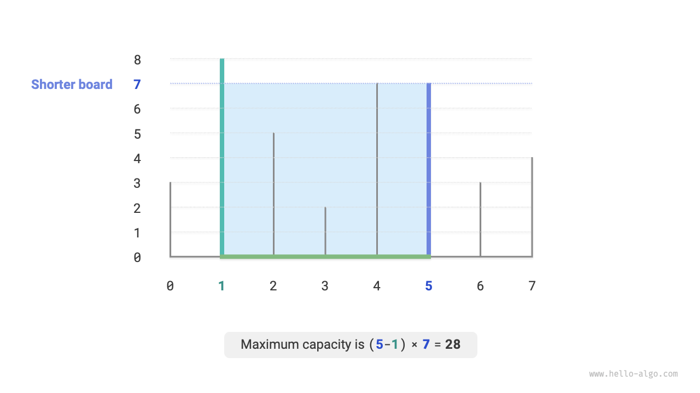

コンテナは任意の2つの仕切りによって形成されるため、**この問題の状態は2つの仕切りのインデックスで表現され、$[i, j]$ と表記されます**。

問題の記述によれば、容量は高さと幅の積に等しく、高さは短い方の仕切りによって決定され、幅は2つの仕切りの配列インデックスの差です。容量 $cap[i, j]$ の式は：

$$
cap[i, j] = \min(ht[i], ht[j]) \times (j - i)
$$

配列の長さを $n$ と仮定すると、2つの仕切りの組み合わせ数（状態の総数）は $C_n^2 = \frac{n(n - 1)}{2}$ です。最も直接的なアプローチは**すべての可能な状態を列挙する**ことで、時間計算量は $O(n^2)$ になります。

### 貪欲戦略の決定

この問題にはより効率的な解法があります。下の図に示すように、インデックス $i < j$ かつ高さ $ht[i] < ht[j]$ の状態 $[i, j]$ を選択します。つまり、$i$ は短い仕切り、$j$ は高い仕切りです。

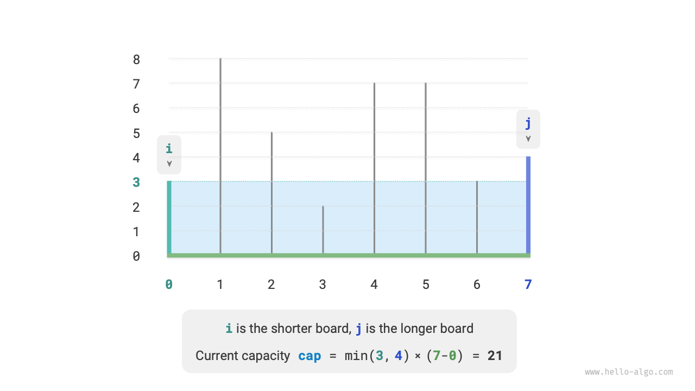

下の図に示すように、**高い仕切り $j$ を短い仕切り $i$ に近づけて移動すると、容量は確実に減少します**。

これは、高い仕切り $j$ を移動すると、幅 $j-i$ が確実に減少するためです。高さは短い仕切りによって決定されるため、高さは同じまま（$i$ が短い仕切りのまま）か減少（移動した $j$ が短い仕切りになる）しかありません。

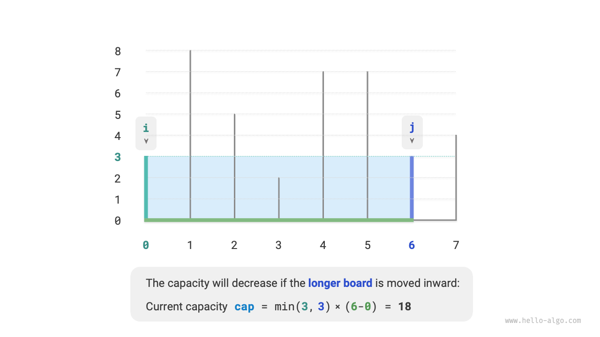

逆に、**短い仕切り $i$ を内側に移動することによってのみ容量を増加させることが可能です**。幅は確実に減少しますが、**高さが増加する可能性があります**（移動した短い仕切り $i$ が高くなる場合）。例えば、下の図では、短い仕切りを移動した後に面積が増加しています。

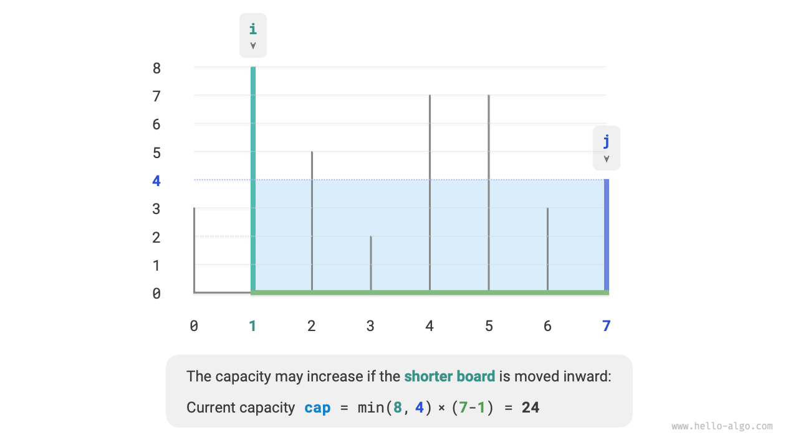

これにより、この問題の貪欲戦略が導かれます：コンテナの両端に2つのポインタを初期化し、各ラウンドで短い仕切りに対応するポインタを内側に移動し、2つのポインタが出会うまで続けます。

下の図は貪欲戦略の実行を示しています。

1. 最初に、ポインタ $i$ と $j$ が配列の両端に配置されます。
2. 現在の状態の容量 $cap[i, j]$ を計算し、最大容量を更新します。
3. 仕切り $i$ と $j$ の高さを比較し、短い仕切りを1ステップ内側に移動します。
4. $i$ と $j$ が出会うまでステップ `2.` と `3.` を繰り返します。

=== "<1>"
    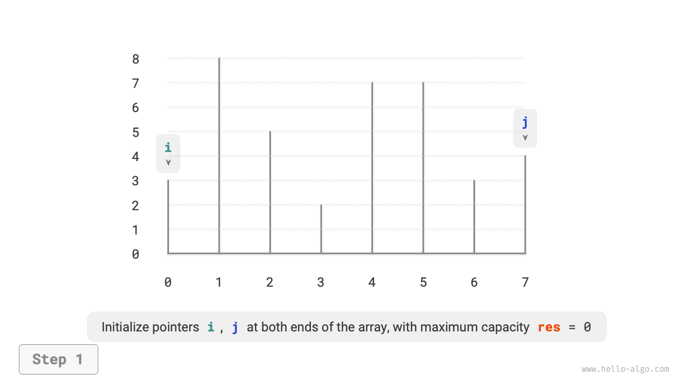

=== "<2>"
    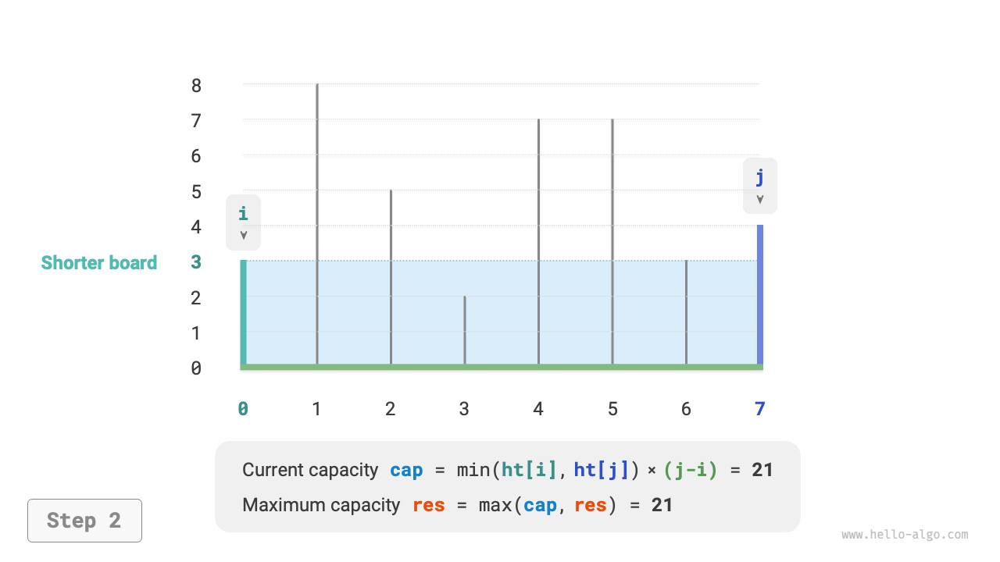

=== "<3>"
    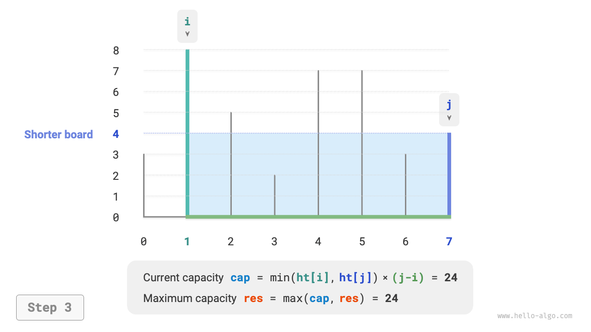

=== "<4>"
    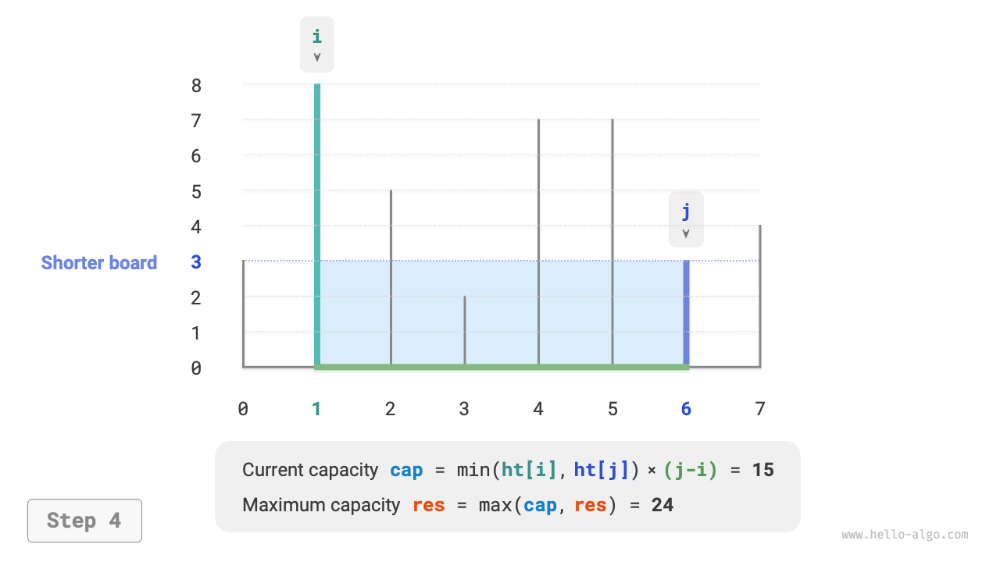

=== "<5>"
    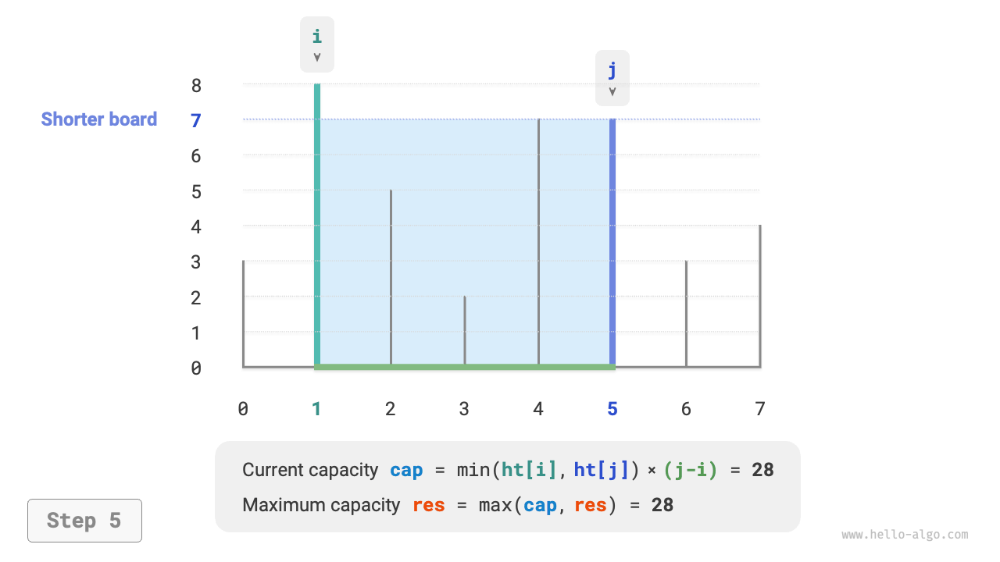

=== "<6>"
    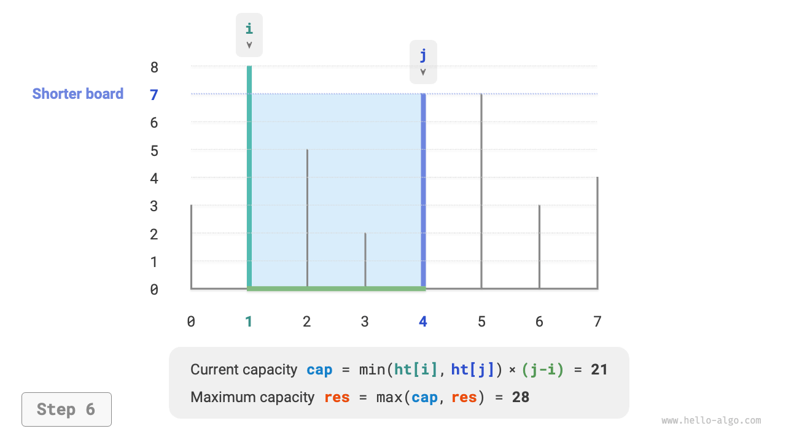

=== "<7>"
    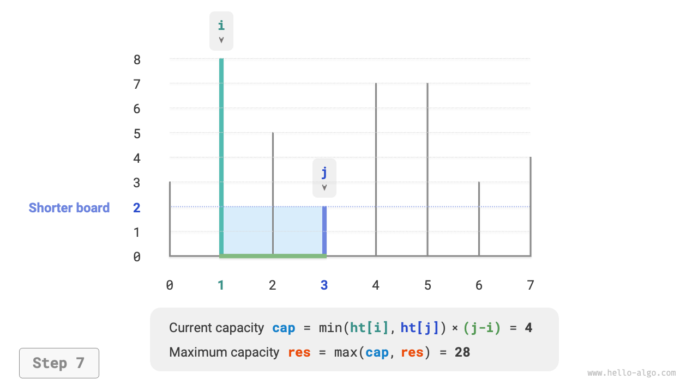

=== "<8>"
    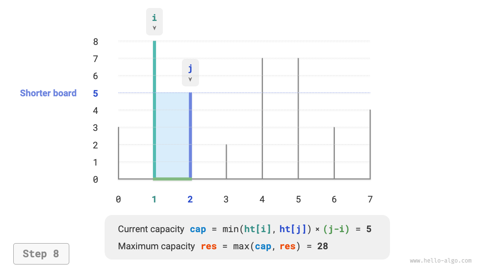

=== "<9>"
    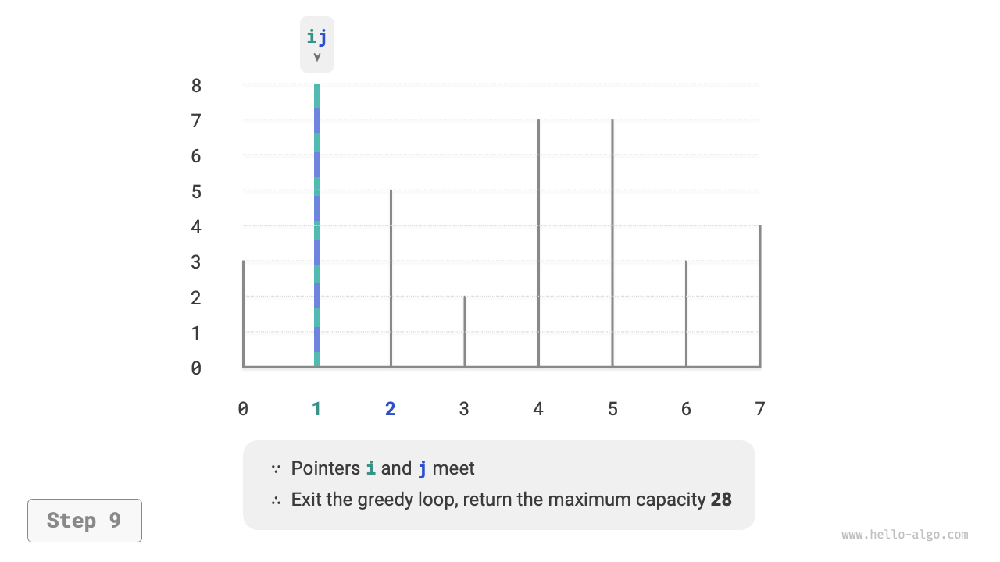

### 実装

コードは最大 $n$ 回ループするため、**時間計算量は $O(n)$** です。

変数 $i$、$j$、$res$ は一定量の追加スペースを使用するため、**空間計算量は $O(1)$** です。

```src
[file]{max_capacity}-[class]{}-[func]{max_capacity}
```

### 正しさの証明

貪欲法が列挙よりも高速である理由は、各ラウンドの貪欲選択が一部の状態を「スキップ」するからです。

例えば、$i$ が短い仕切りで $j$ が高い仕切りである状態 $cap[i, j]$ の下で、短い仕切り $i$ を貪欲に1ステップ内側に移動すると、下の図に示す「スキップされた」状態につながります。**これは、これらの状態の容量を後で検証できないことを意味します**。

$$
cap[i, i+1], cap[i, i+2], \dots, cap[i, j-2], cap[i, j-1]
$$

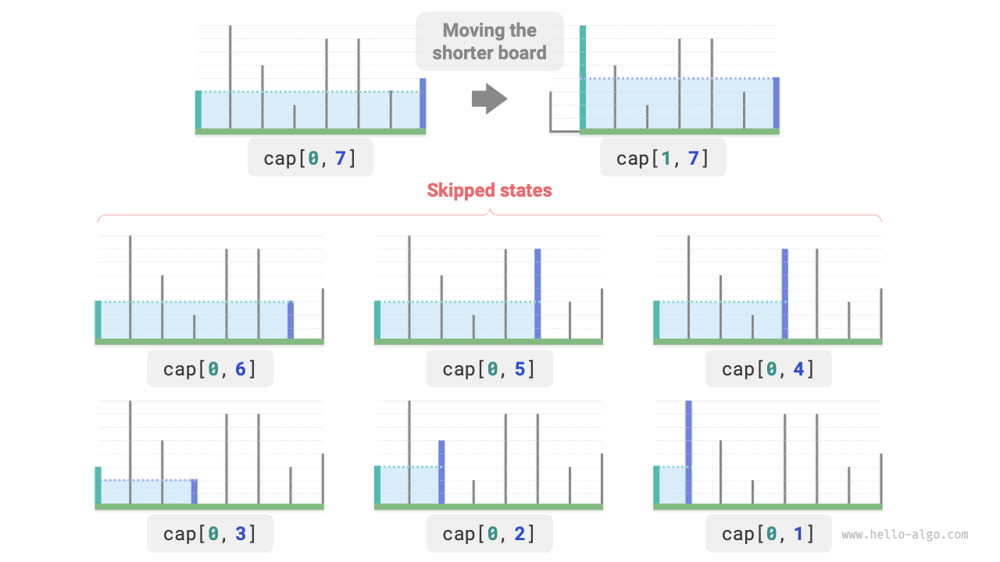

観察すると、**これらのスキップされた状態は実際には高い仕切り $j$ が内側に移動したすべての状態**です。高い仕切りを内側に移動すると容量が確実に減少することをすでに証明しました。したがって、スキップされた状態は最適解である可能性がなく、**それらをスキップしても最適解を見逃すことはありません**。

分析により、短い仕切りを移動する操作は「安全」であり、貪欲戦略が効果的であることが示されます。
